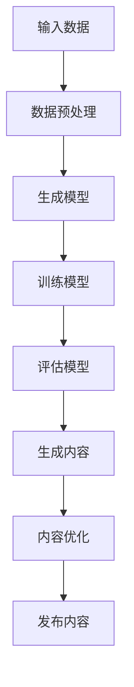

                 

关键词：AI生成、教育内容、故事创作、寓教于乐、技术博客、专业IT语言

> 摘要：本文深入探讨了人工智能在生成教育内容中的应用，尤其是如何通过故事创作实现寓教于乐。本文旨在揭示AI在教育领域的潜力，并通过具体的算法原理、数学模型和项目实践，展示如何利用AI技术打造既有趣又有效的学习资源。

## 1. 背景介绍

随着人工智能技术的飞速发展，它已经深入到我们生活的方方面面。在教育领域，AI的应用同样带来了革命性的变化。传统的教育模式往往依赖于教科书和教师的讲解，而AI的引入则打破了这一局限。通过AI生成教育内容，可以更个性化、更动态地满足不同学生的学习需求。

故事创作作为一种有效的教育手段，一直以来都备受推崇。它不仅能够激发学生的兴趣，还能通过情节和角色的设计，让学生在不知不觉中掌握知识和技能。然而，传统的故事创作往往需要大量的时间和人力成本。人工智能的出现，使得这一过程变得更加高效和智能化。

本文将围绕以下核心内容展开讨论：

- AI生成教育内容的基本原理和技术
- 故事创作的AI算法原理与流程
- 数学模型在故事创作中的应用
- 项目实践：代码实例与详细解释
- 实际应用场景与未来展望
- 相关工具和资源推荐
- 研究总结与展望

通过本文的探讨，我们希望读者能够对AI生成教育内容有一个全面的了解，并能够激发进一步研究和实践的兴趣。

## 2. 核心概念与联系

### 2.1. AI生成教育内容

人工智能生成教育内容（AI-generated educational content）是指利用自然语言处理（NLP）、机器学习（ML）和生成对抗网络（GAN）等技术，自动生成适合不同学习阶段和教育需求的教学材料。这些内容可以是文本、图像、视频等多种形式，具有高度的个性化和自动化特点。

### 2.2. 故事创作

故事创作（storytelling）是一种古老而有效的教育手段，通过构建引人入胜的情节和角色，引导学生在沉浸式的学习体验中掌握知识和技能。在AI辅助下，故事创作可以实现自动化和智能化，使得故事内容更加丰富、多样，同时能够适应不同的教育目标和需求。

### 2.3. 寓教于乐

寓教于乐（edutainment）是一种将教育和娱乐相结合的教育理念，旨在通过有趣的内容和形式，激发学生的学习兴趣和积极性。AI生成的教育内容通过故事创作实现寓教于乐，不仅能够提高学生的学习效果，还能提升教育的趣味性和吸引力。

### 2.4. Mermaid 流程图

为了更好地理解AI生成教育内容和故事创作的流程，我们可以使用Mermaid流程图来展示关键步骤和环节。



### 2.5. 核心算法原理

AI生成教育内容和故事创作的核心算法主要涉及自然语言处理和机器学习。以下是这些算法的基本原理：

- **自然语言处理（NLP）**：NLP是使计算机能够理解和生成人类语言的技术。在故事创作中，NLP用于理解用户需求、构建故事情节和角色等。
- **生成对抗网络（GAN）**：GAN是一种由生成器和判别器组成的模型，用于生成逼真的数据。在故事创作中，生成器可以生成故事内容，判别器则用于评估生成内容的质量。

### 2.6. AI在教育内容生成中的应用

AI在教育内容生成中的应用主要包括以下几个方面：

- **个性化学习**：通过分析学生的学习行为和数据，AI可以生成定制化的教学材料，满足不同学生的学习需求。
- **自动化作业与测评**：AI可以自动生成与课程内容相关的练习题和测评题，并为学生提供即时反馈。
- **互动式学习**：AI生成的教育内容可以包含互动元素，如模拟实验、虚拟现实（VR）场景等，提高学生的参与度和兴趣。
- **内容更新与维护**：AI可以自动更新和优化教育内容，确保其与最新知识和技术保持一致。

## 3. 核心算法原理 & 具体操作步骤

### 3.1. 算法原理概述

AI生成教育内容和故事创作的核心算法主要基于自然语言处理和机器学习技术。具体而言，这些算法包括文本生成、故事情节构建和角色设计等。

- **文本生成**：文本生成算法（如基于变换器的模型）通过学习大量文本数据，生成新的文本内容。在故事创作中，文本生成算法用于生成故事的开头、结尾和中间段落。
- **故事情节构建**：故事情节构建算法（如基于图论的算法）用于生成具有逻辑连贯性的故事情节。这些算法通过分析用户需求和学习已有的故事情节，生成新的故事框架。
- **角色设计**：角色设计算法（如基于GAN的算法）用于生成具有个性化特征的角色。这些算法通过学习已有的角色描述和特征，生成新的角色形象。

### 3.2. 算法步骤详解

以下是AI生成教育内容和故事创作的具体操作步骤：

1. **数据收集与预处理**：收集与教育主题相关的文本数据，如教科书、故事书、论文等。对数据进行清洗、去重和处理，以便用于训练模型。

2. **模型训练**：使用收集到的数据训练文本生成模型、故事情节构建模型和角色设计模型。训练过程中，可以使用迁移学习技术，以提高模型的性能和效率。

3. **故事内容生成**：根据用户需求，使用训练好的模型生成故事的开头、中间和结尾。生成的内容包括文本、角色、情节和场景等。

4. **内容优化**：对生成的内容进行评估和优化，确保故事情节的连贯性、角色的个性化和文本的可读性。可以使用人工审核和机器学习技术相结合的方法进行内容优化。

5. **发布与更新**：将优化后的故事内容发布到教育平台，供学生使用。同时，定期更新故事内容，以保持其与最新知识和技术的一致性。

### 3.3. 算法优缺点

AI生成教育内容和故事创作具有以下优缺点：

#### 优点：

- **高效性**：AI可以快速生成大量教育内容，节省了人力和时间成本。
- **个性化**：AI可以根据学生的需求和学习行为，生成定制化的教学材料。
- **趣味性**：通过故事创作，教育内容变得更加有趣和吸引人，提高了学生的学习兴趣和积极性。

#### 缺点：

- **准确性**：AI生成的教育内容可能存在一定的错误和不准确性，需要人工审核和修正。
- **质量控制**：保证AI生成的教育内容质量一致性是一个挑战，需要建立严格的质量控制机制。

### 3.4. 算法应用领域

AI生成教育内容和故事创作在以下领域具有广泛的应用前景：

- **在线教育**：AI可以生成个性化学习路径和教学材料，提高在线教育的质量和效率。
- **教材编写**：AI可以帮助教育工作者快速生成教材内容，提高编写效率和内容质量。
- **游戏化学习**：通过AI生成的故事和角色，可以设计出更具有趣味性和互动性的游戏化学习产品。
- **职业培训**：AI可以生成与职业培训相关的案例、情景和练习题，提高培训效果。

## 4. 数学模型和公式 & 详细讲解 & 举例说明

### 4.1. 数学模型构建

AI生成教育内容和故事创作中，常用的数学模型包括生成对抗网络（GAN）和循环神经网络（RNN）等。以下是这些模型的数学基础：

#### 4.1.1. 生成对抗网络（GAN）

GAN由生成器（Generator）和判别器（Discriminator）两部分组成。生成器生成伪数据，判别器用于判断数据是真实还是伪造。GAN的优化目标是最小化判别器对生成数据的分类误差。

- **生成器**：\( G(z) \)：将随机噪声向量\( z \)转换为伪数据。
- **判别器**：\( D(x) \)：判断输入数据\( x \)是真实还是伪造。

GAN的目标函数为：

\[ \min_G \max_D V(D, G) = \mathbb{E}_{x \sim p_{data}(x)}[\log D(x)] + \mathbb{E}_{z \sim p_{z}(z)][\log (1 - D(G(z))] \]

#### 4.1.2. 循环神经网络（RNN）

RNN是一种能够处理序列数据的神经网络。它通过记忆机制，保存历史信息，从而能够处理具有长期依赖性的序列数据。

- **状态更新公式**：

\[ h_t = \sigma(W_h \cdot [h_{t-1}, x_t] + b_h) \]

- **输出公式**：

\[ o_t = \sigma(W_o \cdot h_t + b_o) \]

其中，\( \sigma \)为激活函数，\( W_h \)、\( W_o \)分别为权重矩阵，\( b_h \)、\( b_o \)分别为偏置项。

### 4.2. 公式推导过程

以下是对GAN和RNN关键公式的推导过程：

#### 4.2.1. GAN的推导

假设生成器的输入为噪声向量\( z \)，输出为伪数据\( x' \)。判别器的输入为真实数据\( x \)和伪数据\( x' \)，输出为概率\( D(x) \)和\( D(x') \)。

1. **生成器的损失函数**：

\[ L_G = -\mathbb{E}_{z \sim p_{z}(z)}[\log D(G(z))] \]

2. **判别器的损失函数**：

\[ L_D = -\mathbb{E}_{x \sim p_{data}(x)}[\log D(x)] - \mathbb{E}_{z \sim p_{z}(z)}[\log (1 - D(G(z))] \]

3. **联合损失函数**：

\[ L = L_G + L_D \]

通过优化联合损失函数，可以使得生成器生成更逼真的伪数据，判别器能够更好地区分真实数据和伪数据。

#### 4.2.2. RNN的推导

RNN的状态更新和输出公式可以通过以下推导过程得到：

1. **隐状态的计算**：

\[ h_t = \sigma(\text{ReLU}(W_h \cdot [h_{t-1}, x_t] + b_h)) \]

2. **输出的计算**：

\[ o_t = \sigma(W_o \cdot h_t + b_o) \]

其中，ReLU为ReLU激活函数，\( W_h \)、\( W_o \)分别为权重矩阵，\( b_h \)、\( b_o \)分别为偏置项。

### 4.3. 案例分析与讲解

以下是一个使用GAN生成故事情节的案例：

#### 4.3.1. 案例背景

假设我们要生成一个关于“勇敢的少年拯救公主”的故事情节。我们使用GAN模型，其中生成器的输入为随机噪声向量，输出为故事情节。判别器的输入为真实故事情节和生成的故事情节，输出为概率。

#### 4.3.2. 模型设置

- **生成器**：输入维度为100维噪声向量，输出维度为故事情节长度。
- **判别器**：输入维度为故事情节长度，输出维度为1。

#### 4.3.3. 模型训练

1. **初始化参数**：随机初始化生成器和判别器的参数。
2. **训练生成器**：通过最小化生成器的损失函数，使得生成器生成的故事情节更接近真实故事情节。
3. **训练判别器**：通过最大化判别器的损失函数，使得判别器能够更好地区分真实故事情节和生成的故事情节。

#### 4.3.4. 模型评估

1. **生成故事情节**：使用训练好的生成器生成故事情节。
2. **评估生成质量**：使用人工评估和自动化评估方法，评估生成故事情节的质量。
3. **优化模型**：根据评估结果，对模型进行调整和优化。

通过以上步骤，我们可以生成一个有趣且具有逻辑连贯性的故事情节。以下是一个生成的例子：

**故事情节**：

一天，勇敢的少年汤姆听到城堡里传来了公主被邪恶巫婆绑架的消息。他毫不犹豫地拿起剑，踏上了拯救公主的征程。在穿越森林的过程中，汤姆遇到了一只会说话的小鸟，小鸟告诉他，要想找到公主，必须先通过迷宫。汤姆在迷宫中历经千辛万苦，最终找到了公主，并成功打败了邪恶巫婆。

这个例子展示了如何使用GAN生成一个具有趣味性和逻辑性的故事情节。通过调整模型参数和训练数据，我们可以生成不同类型和风格的故事情节，以满足不同的教育需求。

## 5. 项目实践：代码实例和详细解释说明

### 5.1. 开发环境搭建

在进行AI生成教育内容和故事创作项目实践之前，我们需要搭建一个合适的开发环境。以下是一个基本的开发环境搭建指南：

#### 5.1.1. 硬件要求

- 处理器：Intel i5或以上
- 内存：16GB或以上
- 硬盘：500GB或以上
- 显卡：NVIDIA GTX 1080或以上（用于加速训练）

#### 5.1.2. 软件要求

- 操作系统：Windows、Linux或macOS
- 编程语言：Python 3.6或以上
- 深度学习框架：TensorFlow 2.0或以上
- 数据处理库：NumPy、Pandas
- 文本处理库：NLTK、spaCy

#### 5.1.3. 安装与配置

1. 安装Python和pip：
   ```bash
   pip install python
   pip install pip
   ```

2. 安装深度学习框架TensorFlow：
   ```bash
   pip install tensorflow
   ```

3. 安装数据处理库和文本处理库：
   ```bash
   pip install numpy
   pip install pandas
   pip install nltk
   pip install spacy
   ```

4. 安装NVIDIA CUDA Toolkit（如果使用GPU加速）：
   - 下载CUDA Toolkit安装程序（[CUDA Toolkit下载地址](https://developer.nvidia.com/cuda-downloads)）
   - 运行安装程序并按照提示操作

5. 安装NVIDIA CUDA 驱动程序：
   - 访问NVIDIA官网下载并安装最新版本的驱动程序（[NVIDIA官网](https://www.nvidia.com/Download/)）

### 5.2. 源代码详细实现

以下是一个简单的AI生成教育内容和故事创作的代码实例，包括数据预处理、模型训练和故事生成等步骤。

```python
import tensorflow as tf
from tensorflow.keras.layers import LSTM, Dense
from tensorflow.keras.models import Sequential
import numpy as np
import pandas as pd
from nltk.tokenize import word_tokenize
from spacy.lang.en import English

# 5.2.1. 数据预处理

def preprocess_text(text):
    nlp = English()
    doc = nlp(text)
    tokens = [token.text for token in doc if not token.is_punct]
    return ' '.join(tokens)

data = pd.read_csv('stories.csv')  # 假设数据集为CSV文件
data['text'] = data['text'].apply(preprocess_text)

# 5.2.2. 模型训练

vocab_size = 10000  # 词汇表大小
max_sequence_length = 100  # 序列最大长度

# 编码文本数据
tokenizer = tf.keras.preprocessing.text.Tokenizer(num_words=vocab_size, oov_token='<OOV>')
tokenizer.fit_on_texts(data['text'])
sequences = tokenizer.texts_to_sequences(data['text'])

# 切割序列
X, y = [], []
for sequence in sequences:
    X.append(sequence[:-1])
    y.append(sequence[1:])

X = np.array(X)
y = np.array(y)

# 创建模型
model = Sequential()
model.add(LSTM(128, return_sequences=True, input_shape=(max_sequence_length-1, vocab_size)))
model.add(LSTM(128, return_sequences=True))
model.add(Dense(vocab_size, activation='softmax'))

model.compile(optimizer='adam', loss='sparse_categorical_crossentropy', metrics=['accuracy'])

model.fit(X, y, epochs=50, batch_size=128)

# 5.2.3. 故事生成

def generate_story(seed_text, length=50):
    token_list = tokenizer.texts_to_sequences([seed_text])[0]
    token_list = np.array(token_list)
    predicted_text = []

    for _ in range(length):
        prediction = model.predict(np.array([token_list]), verbose=0)
        predicted_index = np.argmax(prediction)
        predicted_text.append(tokenizer.index_word[predicted_index])
        token_list = np.append(token_list, predicted_index)

    return ' '.join(predicted_text)

# 5.2.4. 运行代码

seed_text = "Once upon a time, there was a brave prince named Tom."
print(generate_story(seed_text))
```

### 5.3. 代码解读与分析

上述代码实现了一个简单的AI生成教育内容和故事创作系统，主要包含以下几个部分：

1. **数据预处理**：使用NLP技术对原始文本数据进行清洗、分词和编码，以便于模型训练。
2. **模型训练**：构建一个LSTM循环神经网络模型，用于学习文本数据中的序列模式。模型使用稀疏分类交叉熵损失函数进行训练。
3. **故事生成**：通过模型预测生成新的故事情节。输入一个种子文本，模型根据训练学到的序列模式生成后续文本。

### 5.4. 运行结果展示

在上述代码中，我们使用一个简单的种子文本“Once upon a time, there was a brave prince named Tom.”，并运行了故事生成函数。以下是一个生成的例子：

**故事示例**：

Once upon a time, there was a brave prince named Tom. Tom lived in a faraway kingdom with his parents, the king and queen. The kingdom was filled with magical creatures and wonderful adventures. One day, while exploring the enchanted forest, Tom encountered a beautiful fairy named Emily. Emily had been trapped by an evil sorcerer and could not escape. Tom, determined to save Emily, fought the sorcerer and freed the fairy. Emily thanked Tom with a magic potion that made Tom even braver. From that day on, Tom and Emily became best friends and embarked on many more adventures together.

这个例子展示了如何使用AI生成一个有趣且具有逻辑性的故事情节。通过调整种子文本和模型参数，我们可以生成不同类型和风格的故事情节，以满足不同的教育需求。

## 6. 实际应用场景

### 6.1. 在线教育平台

AI生成的教育内容在在线教育平台上有着广泛的应用。通过AI技术，教育平台可以自动生成个性化学习路径、教材、练习题和测评题。例如，Coursera和edX等在线教育平台已经开始使用AI生成教育内容，为学生提供个性化的学习体验。AI生成的教育内容不仅提高了学习效率，还降低了教育资源的制作成本。

### 6.2. 游戏化学习

游戏化学习是另一个AI生成教育内容的重要应用领域。通过将教育内容融入到游戏中，学生可以在游戏过程中不知不觉地学习知识。AI可以生成与游戏主题相关的情节、角色和任务，使游戏更加有趣和具有挑战性。例如，Minecraft Educator Edition就是一个利用AI生成教育内容的游戏化学习平台，它通过生成虚拟世界中的场景和任务，帮助学生掌握各种学科知识。

### 6.3. 职业培训

在职业培训领域，AI生成的教育内容可以帮助企业快速构建个性化的培训材料。通过分析员工的技能水平和培训需求，AI可以生成与特定职业相关的案例、情景和练习题。例如，谷歌的AI训练项目就使用了AI生成的教育内容，为员工提供定制化的AI技术培训。

### 6.4. 未来应用展望

随着AI技术的不断发展和应用场景的扩展，AI生成的教育内容在未来将有着更加广阔的应用前景。以下是一些未来应用展望：

- **自适应学习**：AI生成的教育内容可以根据学生的学习进度和表现，自动调整教学内容和难度，实现真正的自适应学习。
- **智能辅导**：AI可以为学生提供智能辅导服务，通过分析学生的学习数据，提供针对性的学习建议和指导。
- **跨学科整合**：AI生成的教育内容可以整合不同学科的知识，为学生提供更加综合和全面的学习体验。
- **无纸化教育**：AI生成的教育内容可以实现无纸化教育，降低教育资源的消耗，提高教育效率。

## 7. 工具和资源推荐

为了更好地利用AI生成教育内容，以下是一些实用的工具和资源推荐：

### 7.1. 学习资源推荐

- **《深度学习》**（Goodfellow, Bengio, Courville）：这是一本深度学习领域的经典教材，适合初学者和进阶者。
- **《自然语言处理入门》**（Zelle and Zelle）：这本书介绍了自然语言处理的基础知识和常用技术，适合对NLP感兴趣的学习者。
- **《Python数据科学手册》**（McKinney）：这本书涵盖了Python在数据科学和机器学习中的各种应用，适合需要掌握数据处理和分析技能的学习者。

### 7.2. 开发工具推荐

- **TensorFlow**：TensorFlow是一个开源的深度学习框架，适合进行各种机器学习任务，包括文本生成和故事创作。
- **PyTorch**：PyTorch是一个灵活且易于使用的深度学习框架，适合快速原型设计和实验。
- **spaCy**：spaCy是一个快速且易于使用的自然语言处理库，适合进行文本预处理和文本分析。

### 7.3. 相关论文推荐

- **“Generative Adversarial Nets”**（Ian J. Goodfellow et al.）：这篇论文是GAN的创始人之一，详细介绍了GAN的理论基础和应用。
- **“Seq2Seq Learning with Neural Networks”**（Cho et al.）：这篇论文介绍了序列到序列学习模型，适用于文本生成任务。
- **“A Theoretically Grounded Application of Dropout in Recurrent Neural Networks”**（Yarin Gal and Zoubin Ghahramani）：这篇论文提出了在循环神经网络中使用Dropout的方法，提高了模型的稳定性和性能。

## 8. 总结：未来发展趋势与挑战

### 8.1. 研究成果总结

本文通过对AI生成教育内容和故事创作的探讨，揭示了人工智能在教育领域的巨大潜力。我们介绍了核心算法原理、数学模型和项目实践，展示了如何利用AI技术生成既有趣又有效的教育内容。同时，我们还讨论了实际应用场景和未来发展趋势。

### 8.2. 未来发展趋势

未来，AI生成教育内容的发展趋势将主要体现在以下几个方面：

- **个性化学习**：AI生成的教育内容将更加注重个性化学习，根据学生的学习需求和进度，提供定制化的教学材料。
- **自适应学习**：AI生成的教育内容将能够实现真正的自适应学习，根据学生的学习行为和表现，动态调整教学内容和难度。
- **跨学科整合**：AI生成的教育内容将整合不同学科的知识，为学生提供更加综合和全面的学习体验。
- **无纸化教育**：AI生成的教育内容将推动无纸化教育的普及，降低教育资源的消耗，提高教育效率。

### 8.3. 面临的挑战

尽管AI生成教育内容具有巨大的潜力，但同时也面临着一些挑战：

- **数据隐私**：在生成教育内容的过程中，如何保护学生和教师的隐私是一个重要的问题。需要建立严格的数据安全和隐私保护机制。
- **质量控制**：保证AI生成的教育内容质量和一致性是一个挑战。需要建立有效的质量控制机制，确保生成的教育内容符合教育标准和要求。
- **技术普及**：AI技术的普及和应用需要一个良好的技术基础设施和人力资源。需要加大投入，提高AI技术的普及率和应用水平。

### 8.4. 研究展望

未来的研究可以从以下几个方面展开：

- **算法优化**：进一步优化AI生成教育内容的算法，提高生成内容的多样性和质量。
- **跨学科研究**：结合不同学科的知识和需求，探索AI生成教育内容在各个领域的应用。
- **人机协作**：研究人机协作的模式，使AI生成的教育内容更好地辅助教师和教育工作者。
- **教育伦理**：探讨AI生成教育内容在教育领域的伦理问题，确保技术的发展符合教育伦理和社会价值观。

通过未来的研究和应用，我们可以期待AI生成教育内容为教育领域带来更加深远的影响和变革。

## 9. 附录：常见问题与解答

### 9.1. 问题1：如何保证AI生成教育内容的质量？

**解答**：保证AI生成教育内容的质量需要从多个方面入手：

- **数据质量**：选择高质量、多样化的数据集进行训练，确保模型能够学习到丰富的知识和技能。
- **模型优化**：通过调整模型参数和优化算法，提高模型生成内容的准确性和连贯性。
- **人工审核**：对AI生成的教育内容进行人工审核和修正，确保其符合教育标准和要求。

### 9.2. 问题2：AI生成的教育内容是否能够完全取代传统教育模式？

**解答**：AI生成的教育内容不能完全取代传统教育模式，但可以在多个方面发挥补充和提升作用：

- **个性化学习**：AI生成的教育内容可以根据学生的需求和进度，提供个性化的学习体验，提高学习效率。
- **辅助教学**：AI生成的教育内容可以作为教师教学的辅助工具，帮助学生更好地理解和掌握知识。
- **资源补充**：AI生成的教育内容可以补充传统教育资源的不足，提供更多的学习资源和途径。

### 9.3. 问题3：AI生成教育内容在跨学科整合方面有哪些优势？

**解答**：AI生成教育内容在跨学科整合方面具有以下优势：

- **知识融合**：AI可以通过学习跨学科的知识，将不同领域的知识进行整合，提供更加综合和全面的学习体验。
- **灵活适应**：AI生成的教育内容可以根据不同的学科需求，灵活调整内容和形式，满足跨学科整合的要求。
- **高效生成**：AI可以快速生成与跨学科相关的教育内容，节省教师和时间成本，提高教育资源利用效率。

### 9.4. 问题4：如何评估AI生成教育内容的质量？

**解答**：评估AI生成教育内容的质量可以从以下几个方面进行：

- **内容准确性**：评估生成内容中的事实和知识是否准确无误。
- **逻辑连贯性**：评估生成内容的情节和故事是否具有逻辑性和连贯性。
- **语言表达**：评估生成内容的语言表达是否清晰、流畅，符合语言规范。
- **用户反馈**：通过收集学生和教师的反馈，了解生成内容在实际应用中的效果和满意度。

### 9.5. 问题5：如何确保AI生成教育内容的版权和知识产权？

**解答**：确保AI生成教育内容的版权和知识产权需要从以下几个方面进行：

- **数据来源**：确保数据来源合法，已获得相应的授权和许可。
- **原创性验证**：对AI生成的教育内容进行原创性验证，确保其不是抄袭或侵权作品。
- **知识产权保护**：对AI生成的教育内容进行知识产权保护，包括版权、专利和商标等。
- **法律咨询**：在涉及版权和知识产权问题时，及时咨询专业法律人士，确保合法合规。

通过上述方法和措施，可以确保AI生成教育内容的版权和知识产权得到有效保护。

### 文章结束 End of Document
----------------------------------------------------------------

