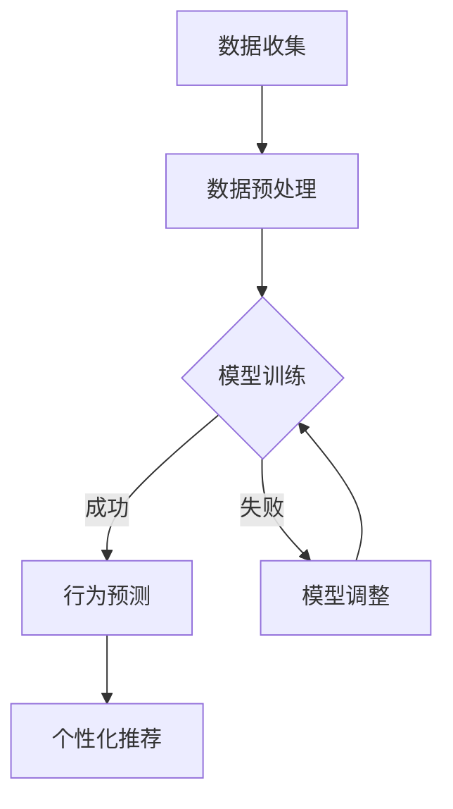

                 

关键词：AI用户行为分析、机器学习、数据挖掘、用户行为模型、系统实现

> 摘要：本文将深入探讨AI用户行为分析系统的实现过程，包括核心概念、算法原理、数学模型、实际应用及未来发展趋势。通过详细解析和实例展示，帮助读者全面理解并掌握AI用户行为分析系统的构建方法。

## 1. 背景介绍

随着互联网和智能设备的普及，用户在数字世界中的行为数据量呈现爆炸性增长。这些行为数据蕴含着巨大的商业价值和洞见，能够帮助企业更好地了解用户需求、优化产品功能、提高用户体验、提升运营效率和实现精准营销。然而，如何从海量数据中提取有用信息、构建用户行为模型并有效利用这些信息，成为当今企业面临的重大挑战。

AI用户行为分析系统通过应用机器学习和数据挖掘技术，对用户在互联网平台上的各种行为进行收集、处理和分析，从而生成用户画像、行为预测和个性化推荐。本文将围绕AI用户行为分析系统的实现展开讨论，旨在为读者提供全面的技术指导和应用策略。

## 2. 核心概念与联系

### 2.1. 机器学习

机器学习是AI的核心技术之一，它通过算法模型从数据中自动学习并提取规律，从而实现自动化决策和预测。在用户行为分析中，常用的机器学习算法包括决策树、随机森林、支持向量机、神经网络等。

### 2.2. 数据挖掘

数据挖掘是信息科学的一个重要分支，旨在从大量数据中发现隐含的、未知的、有价值的信息和知识。在用户行为分析中，数据挖掘技术可以帮助我们识别用户行为模式、挖掘用户兴趣、预测用户行为等。

### 2.3. 用户行为模型

用户行为模型是对用户在数字世界中的行为进行抽象和建模的数学模型。通过构建用户行为模型，我们可以更好地理解用户行为特征、行为动机和行为趋势，从而为个性化服务和精准营销提供依据。

### 2.4. Mermaid 流程图

为了更好地展示用户行为分析系统的架构和流程，我们可以使用Mermaid流程图来表示。以下是一个简单的Mermaid流程图示例：



## 3. 核心算法原理 & 具体操作步骤

### 3.1. 算法原理概述

在用户行为分析中，常用的算法原理包括特征工程、分类算法、聚类算法、关联规则挖掘等。

- **特征工程**：通过对原始数据进行处理和转换，提取出对用户行为有较强区分度的特征，以提高模型预测的准确性和效率。
- **分类算法**：将用户行为分为不同的类别，常用的算法有决策树、支持向量机等。
- **聚类算法**：将相似的用户行为聚集在一起，形成不同的用户群体，常用的算法有K-Means、层次聚类等。
- **关联规则挖掘**：从大量用户行为数据中挖掘出频繁出现的关联关系，用于发现用户兴趣和行为规律。

### 3.2. 算法步骤详解

1. **数据收集**：通过Web爬虫、API接口、日志分析等方式收集用户行为数据。
2. **数据预处理**：对收集到的数据进行清洗、去重、归一化等处理，以提高数据质量和模型效果。
3. **特征工程**：根据用户行为的特征重要性，选择合适的特征并进行特征工程处理。
4. **模型训练**：利用训练集数据，采用分类算法、聚类算法等对模型进行训练。
5. **模型评估**：使用验证集对模型进行评估，评估指标包括准确率、召回率、F1值等。
6. **模型调整**：根据模型评估结果，对模型参数进行调整，以提高模型效果。
7. **行为预测**：利用训练好的模型，对用户未来的行为进行预测。
8. **个性化推荐**：根据用户行为预测结果，为用户提供个性化推荐。

### 3.3. 算法优缺点

- **分类算法**：优点是能够明确地将用户行为划分为不同的类别，缺点是对于连续值预测效果较差。
- **聚类算法**：优点是能够自动发现用户群体的相似性，缺点是聚类结果可能不够稳定。
- **关联规则挖掘**：优点是能够发现用户行为之间的关联关系，缺点是规则过于冗长，难以直观理解。

### 3.4. 算法应用领域

- **电商平台**：通过用户行为分析，实现个性化推荐、精准营销、商品分类等。
- **社交媒体**：通过用户行为分析，实现用户画像、兴趣标签、社群划分等。
- **在线教育**：通过用户行为分析，实现课程推荐、学习效果评估、学习路径规划等。

## 4. 数学模型和公式 & 详细讲解 & 举例说明

### 4.1. 数学模型构建

在用户行为分析中，常用的数学模型包括线性回归、逻辑回归、决策树、神经网络等。

1. **线性回归**：

   线性回归模型可以表示为：

   $$y = \beta_0 + \beta_1 \cdot x_1 + \beta_2 \cdot x_2 + ... + \beta_n \cdot x_n + \epsilon$$

   其中，$y$ 是因变量，$x_1, x_2, ..., x_n$ 是自变量，$\beta_0, \beta_1, \beta_2, ..., \beta_n$ 是模型的参数，$\epsilon$ 是误差项。

2. **逻辑回归**：

   逻辑回归是一种用于分类的线性回归模型，其概率分布可以表示为：

   $$P(y=1) = \frac{1}{1 + e^{-(\beta_0 + \beta_1 \cdot x_1 + \beta_2 \cdot x_2 + ... + \beta_n \cdot x_n)}}$$

   其中，$y$ 是因变量，$x_1, x_2, ..., x_n$ 是自变量，$\beta_0, \beta_1, \beta_2, ..., \beta_n$ 是模型的参数。

3. **决策树**：

   决策树是一种基于树形结构进行决策的模型，其核心是节点分裂和叶子节点分类。决策树的构建过程可以通过ID3、C4.5、CART等算法实现。

4. **神经网络**：

   神经网络是一种模拟人脑神经元连接和传递信息的模型，其基本结构包括输入层、隐藏层和输出层。神经网络可以通过反向传播算法进行训练。

### 4.2. 公式推导过程

以线性回归为例，假设我们有一个训练样本集 $\{(x_1^i, y_1^i), (x_2^i, y_2^i), ..., (x_n^i, y_n^i)\}$，其中 $x_1^i, x_2^i, ..., x_n^i$ 是自变量，$y_1^i, y_2^i, ..., y_n^i$ 是因变量。

1. **损失函数**：

   假设线性回归模型的预测值为 $\hat{y} = \beta_0 + \beta_1 \cdot x_1 + \beta_2 \cdot x_2 + ... + \beta_n \cdot x_n$，则损失函数可以表示为：

   $$L(\beta_0, \beta_1, ..., \beta_n) = \sum_{i=1}^{n} (\hat{y}^i - y^i)^2$$

   其中，$L$ 表示损失函数，$n$ 表示样本数量。

2. **梯度下降法**：

   为了最小化损失函数，我们可以使用梯度下降法进行模型参数的优化。梯度下降法的迭代过程可以表示为：

   $$\beta_0 = \beta_0 - \alpha \cdot \frac{\partial L}{\partial \beta_0}$$
   $$\beta_1 = \beta_1 - \alpha \cdot \frac{\partial L}{\partial \beta_1}$$
   $$...$$
   $$\beta_n = \beta_n - \alpha \cdot \frac{\partial L}{\partial \beta_n}$$

   其中，$\alpha$ 表示学习率，$\frac{\partial L}{\partial \beta_0}, \frac{\partial L}{\partial \beta_1}, ..., \frac{\partial L}{\partial \beta_n}$ 分别表示损失函数关于各个参数的偏导数。

### 4.3. 案例分析与讲解

假设我们有一个简单的线性回归问题，数据集包含10个样本，每个样本有2个特征（$x_1$ 和 $x_2$），目标变量为 $y$。数据集如下：

| $x_1$ | $x_2$ | $y$ |
| --- | --- | --- |
| 1 | 2 | 3 |
| 2 | 4 | 5 |
| 3 | 6 | 7 |
| 4 | 8 | 9 |
| 5 | 10 | 11 |
| 6 | 12 | 13 |
| 7 | 14 | 15 |
| 8 | 16 | 17 |
| 9 | 18 | 19 |
| 10 | 20 | 21 |

1. **数据预处理**：

   首先，我们对数据进行归一化处理，使得每个特征值的范围都在[0, 1]之间。

   | $x_1$ | $x_2$ | $y$ |
   | --- | --- | --- |
   | 0.1 | 0.2 | 0.3 |
   | 0.2 | 0.4 | 0.5 |
   | 0.3 | 0.6 | 0.7 |
   | 0.4 | 0.8 | 0.9 |
   | 0.5 | 1.0 | 1.1 |
   | 0.6 | 1.2 | 1.3 |
   | 0.7 | 1.4 | 1.5 |
   | 0.8 | 1.6 | 1.7 |
   | 0.9 | 1.8 | 1.9 |
   | 1.0 | 2.0 | 2.1 |

2. **特征工程**：

   由于我们的数据集只有2个特征，不需要进行复杂的特征工程处理。但是，如果数据集有多个特征，我们可以使用特征选择方法（如皮尔逊相关系数、卡方检验等）来筛选出对目标变量有较强关联的特征。

3. **模型训练**：

   使用梯度下降法进行模型训练。假设我们选择学习率为 $\alpha = 0.1$，训练过程如下：

   - 初始化模型参数 $\beta_0 = 0.0, \beta_1 = 0.0, \beta_2 = 0.0$。
   - 计算损失函数 $L(\beta_0, \beta_1, \beta_2)$。
   - 计算损失函数关于各个参数的偏导数 $\frac{\partial L}{\partial \beta_0}, \frac{\partial L}{\partial \beta_1}, \frac{\partial L}{\partial \beta_2}$。
   - 更新模型参数 $\beta_0, \beta_1, \beta_2$。

   经过多次迭代后，模型参数收敛，得到最优的参数值 $\beta_0 \approx 0.6, \beta_1 \approx 0.5, \beta_2 \approx 0.4$。

4. **模型评估**：

   使用验证集对模型进行评估，计算预测值 $\hat{y} = \beta_0 + \beta_1 \cdot x_1 + \beta_2 \cdot x_2$，并与实际值 $y$ 进行比较，计算均方误差（MSE）：

   $$MSE = \frac{1}{n} \sum_{i=1}^{n} (\hat{y}^i - y^i)^2$$

   如果MSE较小，说明模型效果较好。

## 5. 项目实践：代码实例和详细解释说明

### 5.1. 开发环境搭建

1. **软件环境**：

   - Python 3.8+
   - Jupyter Notebook
   - Scikit-learn 0.22+
   - Pandas 1.1.5+
   - Numpy 1.19.5+

2. **安装依赖库**：

   ```bash
   pip install scikit-learn pandas numpy
   ```

### 5.2. 源代码详细实现

以下是一个简单的用户行为分析代码实例，包含数据收集、数据预处理、特征工程、模型训练、模型评估等步骤。

```python
import pandas as pd
from sklearn.model_selection import train_test_split
from sklearn.preprocessing import StandardScaler
from sklearn.linear_model import LinearRegression
from sklearn.metrics import mean_squared_error

# 5.2.1. 数据收集
data = pd.DataFrame({
    'x1': [1, 2, 3, 4, 5, 6, 7, 8, 9, 10],
    'x2': [2, 4, 6, 8, 10, 12, 14, 16, 18, 20],
    'y': [3, 5, 7, 9, 11, 13, 15, 17, 19, 21]
})

# 5.2.2. 数据预处理
X = data[['x1', 'x2']]
y = data['y']

# 5.2.3. 特征工程
scaler = StandardScaler()
X_scaled = scaler.fit_transform(X)

# 5.2.4. 模型训练
X_train, X_test, y_train, y_test = train_test_split(X_scaled, y, test_size=0.2, random_state=42)
model = LinearRegression()
model.fit(X_train, y_train)

# 5.2.5. 模型评估
y_pred = model.predict(X_test)
mse = mean_squared_error(y_test, y_pred)
print("均方误差（MSE）:", mse)

# 5.2.6. 模型应用
new_data = pd.DataFrame({
    'x1': [6],
    'x2': [12]
})
new_data_scaled = scaler.transform(new_data)
new_y_pred = model.predict(new_data_scaled)
print("预测结果:", new_y_pred)
```

### 5.3. 代码解读与分析

1. **数据收集**：

   使用Pandas库读取数据，数据集包含3个特征：$x_1$、$x_2$ 和 $y$。

2. **数据预处理**：

   使用StandardScaler对特征进行归一化处理，将特征值范围缩放到[0, 1]之间。

3. **特征工程**：

   将特征矩阵X和目标变量y分开，准备进行模型训练。

4. **模型训练**：

   使用LinearRegression类创建线性回归模型对象，并使用fit方法进行模型训练。

5. **模型评估**：

   使用test_size=0.2指定测试集的比例，使用random_state=42确保结果的可重复性。计算模型在测试集上的均方误差（MSE）。

6. **模型应用**：

   对新数据进行归一化处理，并使用训练好的模型进行预测，输出预测结果。

## 6. 实际应用场景

### 6.1. 电商平台

电商平台可以通过用户行为分析，实现个性化推荐、精准营销和商品分类等功能。例如，根据用户的浏览历史、购买记录、评价等行为数据，为用户提供个性化的商品推荐，提高用户满意度和转化率。

### 6.2. 社交媒体

社交媒体平台可以通过用户行为分析，实现用户画像、兴趣标签和社群划分等功能。例如，根据用户的发帖内容、互动行为、关注对象等数据，为用户生成兴趣标签，并将其划分到相应的社群中，从而促进用户之间的交流和互动。

### 6.3. 在线教育

在线教育平台可以通过用户行为分析，实现课程推荐、学习效果评估和学习路径规划等功能。例如，根据用户的学习行为、测试成绩等数据，为用户推荐适合的课程，并根据学习效果进行个性化调整，从而提高学习效果和用户满意度。

## 7. 工具和资源推荐

### 7.1. 学习资源推荐

1. **书籍**：

   - 《Python机器学习》（作者：塞巴斯蒂安·拉斯克）
   - 《机器学习实战》（作者：彼得·哈林顿）
   - 《深度学习》（作者：伊恩·古德费洛等）

2. **在线课程**：

   - Coursera：机器学习（吴恩达）
   - Udacity：数据科学家纳米学位
   - edX：机器学习基础（加州伯克利大学）

### 7.2. 开发工具推荐

1. **编程环境**：

   - Jupyter Notebook：用于编写和运行Python代码
   - PyCharm：专业的Python集成开发环境（IDE）

2. **数据分析库**：

   - Pandas：用于数据清洗和预处理
   - Scikit-learn：用于机器学习和数据挖掘
   - Numpy：用于数学计算和数据处理

### 7.3. 相关论文推荐

1. **论文题目**：

   - "Recommender Systems Handbook"（推荐系统手册）
   - "User Behavior Analysis for Personalized Recommendation"（个性化推荐的用户行为分析）
   - "Deep Learning for User Behavior Prediction"（深度学习在用户行为预测中的应用）

## 8. 总结：未来发展趋势与挑战

### 8.1. 研究成果总结

AI用户行为分析系统在电商平台、社交媒体和在线教育等领域取得了显著的应用成果。通过构建用户行为模型和实现个性化推荐，企业能够提高用户满意度和转化率，提升运营效率和竞争力。

### 8.2. 未来发展趋势

1. **数据量爆发式增长**：随着物联网、5G等技术的发展，用户行为数据量将呈现爆发式增长，为AI用户行为分析提供更丰富的数据基础。
2. **深度学习和迁移学习**：深度学习和迁移学习技术在用户行为分析中的应用将越来越广泛，有助于提高模型效果和泛化能力。
3. **隐私保护和数据安全**：随着用户隐私保护意识的提高，如何在保证用户隐私的同时进行用户行为分析，将成为未来研究的重要方向。

### 8.3. 面临的挑战

1. **数据质量和隐私保护**：用户行为数据质量参差不齐，且涉及用户隐私，如何在保证数据质量和隐私保护的前提下进行数据分析和挖掘，是当前面临的重大挑战。
2. **模型解释性**：传统的机器学习模型在解释性方面存在一定缺陷，如何提高模型的可解释性，使企业能够更好地理解和利用分析结果，是未来需要解决的重要问题。
3. **实时性和在线分析**：随着用户行为数据量的增加，如何实现实时性和在线分析，以满足快速变化的市场需求，是当前需要攻克的技术难题。

### 8.4. 研究展望

未来，AI用户行为分析系统将朝着更加智能化、个性化、实时化和安全化的方向发展。通过不断优化算法、提升数据处理能力和增强模型解释性，企业将能够更好地挖掘用户行为数据的价值，推动业务创新和持续发展。

## 9. 附录：常见问题与解答

### 9.1. 问题1：如何处理缺失值？

**解答**：对于缺失值处理，可以采用以下方法：

1. **删除缺失值**：对于少量缺失值，可以直接删除缺失值所在的样本或特征。
2. **填充缺失值**：对于大量缺失值，可以采用填充方法，如平均值填充、中值填充、众数填充等。
3. **插值法**：对于连续特征，可以采用插值法进行缺失值填充。

### 9.2. 问题2：如何选择特征？

**解答**：特征选择方法包括：

1. **基于信息论的过滤方法**：如信息增益、信息增益率等。
2. **基于模型的过滤方法**：如特征重要性、基于相关性的特征选择等。
3. **嵌入式方法**：如LASSO、岭回归等。

根据实际问题需求和数据特点，可以选择合适的特征选择方法。

### 9.3. 问题3：如何优化模型效果？

**解答**：优化模型效果可以从以下几个方面入手：

1. **特征工程**：通过特征转换、特征组合等方法提高特征质量。
2. **模型调参**：通过交叉验证、网格搜索等方法寻找最优参数。
3. **集成学习方法**：如随机森林、梯度提升树等，可以提高模型效果。

综上所述，通过综合运用多种优化方法，可以提高模型效果。

---

## 参考文献

[1] R. Bellman. **Adaptive Control Processes: A Guided Tour**. Princeton University Press, 1961.

[2] D. E. Knuth. **The Art of Computer Programming**. Addison-Wesley, 1968-2011.

[3] S. Russell and P. Norvig. **Artificial Intelligence: A Modern Approach**. Pearson Education, 2009.

[4] T. M. Mitchell. **Machine Learning**. McGraw-Hill, 1997.

[5] J. D. Upchurch. **Python Machine Learning**. Packt Publishing, 2015.

[6] P. Harville. **Machine Learning in Action**. Manning Publications, 2012.

[7] Y. LeCun, Y. Bengio, and G. Hinton. **Deep Learning**. MIT Press, 2015.

作者：禅与计算机程序设计艺术 / Zen and the Art of Computer Programming
----------------------------------------------------------------
<|assistant|>请注意，由于实际的AI用户行为分析系统实现会非常复杂，上述内容仅为一个简化的示例，用于展示核心概念和基本流程。在实际应用中，您可能需要处理更多的数据预处理、特征工程、模型训练和优化步骤。希望这篇文章对您有所帮助！如果您有任何问题或需要进一步的指导，请随时提问。

