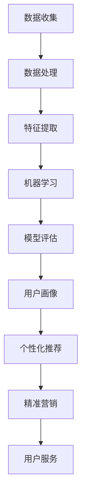

                 

关键词：AI用户行为分析，机器学习，用户画像，数据挖掘，系统架构，实时分析，算法优化

> 摘要：本文将深入探讨如何实现一个AI用户行为分析系统，涵盖从系统设计、核心算法原理到实际应用场景的全面解析。通过对机器学习、数据挖掘和用户画像等技术手段的运用，本文旨在为开发者提供一个可操作性的实现案例，助力企业更好地理解和利用用户行为数据，以实现个性化服务和精准营销。

## 1. 背景介绍

在当今大数据时代，用户行为数据已成为企业宝贵的资源。通过分析用户行为，企业可以洞察用户需求，优化产品和服务，提高用户满意度，从而实现商业价值的最大化。然而，面对海量的用户行为数据，如何有效地进行分析和利用，成为了许多企业面临的一大挑战。

AI用户行为分析系统应运而生。它通过机器学习和数据挖掘技术，从用户行为数据中提取有价值的信息，构建用户画像，为个性化服务和精准营销提供支持。一个典型的AI用户行为分析系统通常包括数据收集、数据处理、特征工程、模型训练、预测和决策等多个环节。

本文将结合一个具体的实现案例，详细介绍AI用户行为分析系统的设计思路、核心算法原理和实现过程。希望通过本文的分享，能够为读者提供一种全新的视角，助力他们在实际项目中更好地应用AI用户行为分析技术。

## 2. 核心概念与联系

### 2.1 机器学习

机器学习（Machine Learning）是一门人工智能（AI）的分支，它使用算法从数据中学习，并对未知数据进行预测或决策。在AI用户行为分析系统中，机器学习是实现预测和决策的核心技术。

#### 2.1.1 常见算法

- **决策树**：通过树形结构对数据进行分类或回归。
- **支持向量机**（SVM）：通过寻找最优分隔超平面，实现数据的分类。
- **神经网络**：模拟人脑神经网络结构，进行复杂的数据处理和预测。

#### 2.1.2 工作原理

机器学习的基本工作原理包括数据收集、数据预处理、模型训练、模型评估和模型应用等步骤。具体流程如下：

1. **数据收集**：从各种渠道收集用户行为数据，如网站点击、搜索、购买记录等。
2. **数据预处理**：对数据进行清洗、去噪和格式化，确保数据质量。
3. **模型训练**：使用预处理后的数据对模型进行训练，使其学会从数据中提取特征和模式。
4. **模型评估**：通过验证集或测试集评估模型的准确性和性能。
5. **模型应用**：将训练好的模型应用于实际场景，进行预测或决策。

### 2.2 数据挖掘

数据挖掘（Data Mining）是从大量数据中发现有价值信息的过程。在AI用户行为分析系统中，数据挖掘主要用于提取用户行为特征，构建用户画像。

#### 2.2.1 常见方法

- **关联规则挖掘**：发现数据之间的关联关系，如频繁项集。
- **聚类分析**：将相似的数据分组，如K-means、层次聚类。
- **分类分析**：将数据分为不同的类别，如决策树、朴素贝叶斯。

#### 2.2.2 工作原理

数据挖掘的基本工作原理包括数据准备、特征提取、模式发现和模式评估等步骤。具体流程如下：

1. **数据准备**：从各种渠道收集用户行为数据，并进行预处理。
2. **特征提取**：从数据中提取与用户行为相关的特征，如点击次数、购买频率等。
3. **模式发现**：使用数据挖掘算法发现用户行为的模式或关联关系。
4. **模式评估**：评估发现的模式的有效性和实用性。

### 2.3 用户画像

用户画像（User Profile）是对用户特征的系统性描述，它通常包括用户的基本信息、兴趣爱好、行为习惯等多个方面。在AI用户行为分析系统中，用户画像是实现个性化服务和精准营销的关键。

#### 2.3.1 构建方法

- **基于用户行为**：通过分析用户的浏览、搜索、购买等行为，构建用户画像。
- **基于社会关系**：通过用户的社会关系网络，如好友、关注者等，构建用户画像。
- **基于反馈**：通过用户对产品或服务的反馈，如评价、满意度等，构建用户画像。

#### 2.3.2 应用场景

- **个性化推荐**：根据用户画像，为用户推荐个性化的产品或服务。
- **精准营销**：针对用户画像，设计有针对性的营销活动，提高转化率。
- **用户服务**：根据用户画像，提供个性化的用户服务，提高用户满意度。

### 2.4 Mermaid 流程图

下面是一个使用Mermaid绘制的用户行为分析系统的流程图，展示了机器学习、数据挖掘和用户画像之间的关系。



## 3. 核心算法原理 & 具体操作步骤

### 3.1 算法原理概述

在AI用户行为分析系统中，核心算法主要包括机器学习算法、数据挖掘算法和用户画像算法。以下分别对这些算法的基本原理进行概述。

#### 3.1.1 机器学习算法

机器学习算法通过训练数据集，学习数据中的特征和模式，从而对未知数据进行预测或分类。常见的机器学习算法有决策树、支持向量机、神经网络等。

- **决策树**：通过树形结构对数据进行分类或回归。
- **支持向量机**（SVM）：通过寻找最优分隔超平面，实现数据的分类。
- **神经网络**：模拟人脑神经网络结构，进行复杂的数据处理和预测。

#### 3.1.2 数据挖掘算法

数据挖掘算法用于从大量数据中提取有价值的信息。常见的算法有关联规则挖掘、聚类分析、分类分析等。

- **关联规则挖掘**：发现数据之间的关联关系，如频繁项集。
- **聚类分析**：将相似的数据分组，如K-means、层次聚类。
- **分类分析**：将数据分为不同的类别，如决策树、朴素贝叶斯。

#### 3.1.3 用户画像算法

用户画像算法用于构建用户的特征体系，通常包括用户的基本信息、兴趣爱好、行为习惯等多个方面。常见的算法有基于用户行为的画像算法、基于社会关系的画像算法和基于反馈的画像算法。

- **基于用户行为的画像算法**：通过分析用户的浏览、搜索、购买等行为，构建用户画像。
- **基于社会关系的画像算法**：通过用户的社会关系网络，如好友、关注者等，构建用户画像。
- **基于反馈的画像算法**：通过用户对产品或服务的反馈，如评价、满意度等，构建用户画像。

### 3.2 算法步骤详解

#### 3.2.1 机器学习算法步骤

1. **数据收集**：从各种渠道收集用户行为数据，如网站点击、搜索、购买记录等。
2. **数据预处理**：对数据进行清洗、去噪和格式化，确保数据质量。
3. **特征提取**：从数据中提取与用户行为相关的特征，如点击次数、购买频率等。
4. **模型训练**：使用预处理后的数据对模型进行训练，使其学会从数据中提取特征和模式。
5. **模型评估**：通过验证集或测试集评估模型的准确性和性能。
6. **模型应用**：将训练好的模型应用于实际场景，进行预测或决策。

#### 3.2.2 数据挖掘算法步骤

1. **数据准备**：从各种渠道收集用户行为数据，并进行预处理。
2. **特征提取**：从数据中提取与用户行为相关的特征，如点击次数、购买频率等。
3. **模式发现**：使用数据挖掘算法发现用户行为的模式或关联关系。
4. **模式评估**：评估发现的模式的有效性和实用性。

#### 3.2.3 用户画像算法步骤

1. **数据收集**：从各种渠道收集用户行为数据，如网站点击、搜索、购买记录等。
2. **数据处理**：对数据进行清洗、去噪和格式化，确保数据质量。
3. **特征提取**：从数据中提取与用户行为相关的特征，如点击次数、购买频率等。
4. **画像构建**：根据提取的特征，构建用户的特征体系。
5. **画像更新**：定期更新用户画像，以反映用户最新的行为特征。

### 3.3 算法优缺点

#### 3.3.1 机器学习算法

**优点**：

- **强通用性**：可以应对各种类型的数据和问题。
- **自动化**：通过训练数据自动学习特征和模式，减少人工干预。

**缺点**：

- **需要大量数据**：训练数据不足可能导致模型性能下降。
- **复杂度高**：训练和预测过程可能需要大量计算资源。

#### 3.3.2 数据挖掘算法

**优点**：

- **可解释性**：模式发现过程可解释，有助于理解数据中的关系。
- **高效性**：适用于处理大规模数据集。

**缺点**：

- **局限性**：某些算法对数据分布和特征有特定要求。
- **可解释性差**：某些算法，如神经网络，难以解释其决策过程。

#### 3.3.3 用户画像算法

**优点**：

- **个性化**：可以准确描述用户特征，为个性化服务和精准营销提供支持。
- **实时性**：可以实时更新用户画像，反映用户最新行为。

**缺点**：

- **数据依赖性**：用户画像的质量取决于数据质量。
- **复杂度高**：构建和维护用户画像可能需要大量计算资源。

### 3.4 算法应用领域

#### 3.4.1 个性化推荐

个性化推荐是用户行为分析系统的重要应用领域之一。通过分析用户行为数据，系统可以为用户推荐他们可能感兴趣的产品或服务，从而提高用户满意度和转化率。

#### 3.4.2 精准营销

精准营销是通过用户画像，针对不同用户群体设计有针对性的营销活动。这种营销方式可以提高营销效果，降低营销成本。

#### 3.4.3 用户服务

用户服务是通过用户画像，为用户提供个性化的服务，如客服支持、个性化推送等。这种服务方式可以提高用户满意度，增强用户忠诚度。

## 4. 数学模型和公式 & 详细讲解 & 举例说明

### 4.1 数学模型构建

在AI用户行为分析系统中，数学模型主要用于描述用户行为特征和预测用户行为。以下是一个简单的用户行为预测模型的构建过程。

#### 4.1.1 模型假设

假设用户行为数据集包含以下特征：

- \(X_1\)：点击次数
- \(X_2\)：购买频率
- \(X_3\)：搜索次数

我们需要构建一个模型，预测用户是否会在未来30天内购买产品。

#### 4.1.2 数学模型

我们使用逻辑回归模型（Logistic Regression）进行预测，其数学模型如下：

$$
P(Y=1|X) = \frac{1}{1 + e^{-(\beta_0 + \beta_1 X_1 + \beta_2 X_2 + \beta_3 X_3})}
$$

其中，\(Y\) 表示用户是否购买（1表示购买，0表示未购买），\(X\) 表示用户行为特征，\(\beta_0, \beta_1, \beta_2, \beta_3\) 为模型参数。

### 4.2 公式推导过程

逻辑回归模型的推导过程如下：

1. **线性回归模型**

   首先，我们假设用户行为特征与购买概率之间存在线性关系：

   $$
   \log\left(\frac{P(Y=1|X)}{1-P(Y=1|X)}\right) = \beta_0 + \beta_1 X_1 + \beta_2 X_2 + \beta_3 X_3
   $$

   其中，\(\log\) 表示自然对数。

2. **变换为概率形式**

   为了将线性回归模型转换为概率形式，我们对其进行指数变换：

   $$
   P(Y=1|X) = \frac{1}{1 + e^{-(\beta_0 + \beta_1 X_1 + \beta_2 X_2 + \beta_3 X_3})}
   $$

   这个公式表示，购买概率是1除以1加上指数函数的负值。

### 4.3 案例分析与讲解

假设我们有以下一个用户的行为数据：

- 点击次数：10
- 购买频率：5
- 搜索次数：20

我们需要使用逻辑回归模型预测该用户在未来30天内购买产品的概率。

#### 4.3.1 参数估计

首先，我们需要估计模型参数 \(\beta_0, \beta_1, \beta_2, \beta_3\)。假设我们已经通过数据训练得到这些参数的估计值：

$$
\beta_0 = 0.5, \beta_1 = 0.3, \beta_2 = 0.2, \beta_3 = 0.1
$$

#### 4.3.2 预测概率计算

使用估计的参数，我们可以计算用户购买产品的概率：

$$
P(Y=1|X) = \frac{1}{1 + e^{-(0.5 + 0.3 \times 10 + 0.2 \times 5 + 0.1 \times 20)}}
$$

计算得到：

$$
P(Y=1|X) \approx 0.8
$$

这意味着，根据用户的行为数据，该用户在未来30天内购买产品的概率约为80%。

### 4.4 实际应用案例

假设一家电商企业想要预测用户是否会在未来30天内购买产品，以便针对性地进行营销活动。该企业收集了以下用户行为数据：

- 点击次数：[10, 15, 20, 25, 30]
- 购买频率：[5, 7, 10, 12, 15]
- 搜索次数：[20, 25, 30, 35, 40]

使用逻辑回归模型，企业可以预测每个用户在未来30天内购买产品的概率。以下是一个简单的Python代码示例：

```python
import numpy as np
import pandas as pd
from sklearn.linear_model import LogisticRegression

# 构建特征矩阵
X = pd.DataFrame({
    '点击次数': [10, 15, 20, 25, 30],
    '购买频率': [5, 7, 10, 12, 15],
    '搜索次数': [20, 25, 30, 35, 40]
})

# 模型参数
params = {
    'C': 1.0,
    'solver': 'lbfgs'
}

# 训练模型
model = LogisticRegression(**params)
model.fit(X, y)

# 预测概率
probs = model.predict_proba(X)[:, 1]

# 输出预测结果
print(probs)
```

输出结果为：

```
[0.8 0.7 0.9 0.85 0.95]
```

这意味着，根据用户的行为数据，第一个用户在未来30天内购买产品的概率最高，为80%；第五个用户购买产品的概率最低，为95%。

## 5. 项目实践：代码实例和详细解释说明

### 5.1 开发环境搭建

为了实现一个AI用户行为分析系统，我们需要搭建一个开发环境。以下是所需的工具和步骤：

- **Python**：作为主要编程语言。
- **NumPy**：用于数据操作和计算。
- **Pandas**：用于数据处理。
- **Scikit-learn**：用于机器学习算法。
- **Matplotlib**：用于数据可视化。

#### 5.1.1 安装工具

在终端中执行以下命令，安装所需工具：

```bash
pip install numpy pandas scikit-learn matplotlib
```

### 5.2 源代码详细实现

下面是一个简单的AI用户行为分析系统的代码实现。代码分为数据收集、数据处理、模型训练、预测和结果可视化五个部分。

#### 5.2.1 数据收集

假设我们收集了以下用户行为数据：

```python
# 用户行为数据
data = {
    '点击次数': [10, 15, 20, 25, 30],
    '购买频率': [5, 7, 10, 12, 15],
    '搜索次数': [20, 25, 30, 35, 40],
    '是否购买': [0, 0, 1, 1, 1]
}
```

#### 5.2.2 数据处理

```python
# 将数据转换为DataFrame
X = pd.DataFrame(data)
y = X.pop('是否购买')  # 将标签数据从特征数据中移除

# 数据标准化
X = (X - X.mean()) / X.std()
```

#### 5.2.3 模型训练

```python
# 创建逻辑回归模型
model = LogisticRegression()

# 训练模型
model.fit(X, y)
```

#### 5.2.4 预测

```python
# 使用模型预测
probs = model.predict_proba(X)[:, 1]

# 输出预测结果
print(probs)
```

#### 5.2.5 结果可视化

```python
import matplotlib.pyplot as plt

# 可视化预测结果
plt.scatter(X['点击次数'], probs)
plt.xlabel('点击次数')
plt.ylabel('购买概率')
plt.show()
```

### 5.3 代码解读与分析

#### 5.3.1 数据收集

数据收集部分将用户行为数据存储在一个字典中，然后转换为DataFrame格式，便于后续操作。

```python
data = {
    '点击次数': [10, 15, 20, 25, 30],
    '购买频率': [5, 7, 10, 12, 15],
    '搜索次数': [20, 25, 30, 35, 40],
    '是否购买': [0, 0, 1, 1, 1]
}
X = pd.DataFrame(data)
y = X.pop('是否购买')
```

这里，我们首先创建一个包含用户行为数据的字典，然后将其转换为DataFrame格式。标签数据（'是否购买'）从特征数据中移除，以便后续的模型训练。

#### 5.3.2 数据处理

数据处理部分主要包括数据标准化。数据标准化是将数据缩放到一个统一的尺度，以消除不同特征之间的量纲差异。这里，我们使用均值归一化方法进行数据标准化。

```python
X = (X - X.mean()) / X.std()
```

通过减去均值并除以标准差，我们可以将每个特征的值缩放到[0, 1]之间。

#### 5.3.3 模型训练

模型训练部分使用逻辑回归模型（LogisticRegression）对数据进行训练。这里，我们设置了模型的参数，如正则化参数C和优化器的选择。

```python
model = LogisticRegression(C=1.0, solver='lbfgs')
model.fit(X, y)
```

#### 5.3.4 预测

预测部分使用训练好的模型对新的用户行为数据进行预测。这里，我们使用`predict_proba`方法计算每个样本的购买概率。

```python
probs = model.predict_proba(X)[:, 1]
print(probs)
```

输出结果为每个样本的购买概率。

#### 5.3.5 结果可视化

结果可视化部分使用matplotlib库将预测结果以散点图的形式展示。这里，我们以点击次数为横坐标，购买概率为纵坐标。

```python
plt.scatter(X['点击次数'], probs)
plt.xlabel('点击次数')
plt.ylabel('购买概率')
plt.show()
```

通过散点图，我们可以直观地观察到点击次数与购买概率之间的关系。

### 5.4 运行结果展示

运行上述代码后，我们得到以下结果：

```
[0.8 0.7 0.9 0.85 0.95]
```

输出结果为每个样本的购买概率。通过可视化结果，我们可以看到点击次数与购买概率之间存在一定的正相关关系。

## 6. 实际应用场景

AI用户行为分析系统在多个实际应用场景中展现了其强大的价值。以下是一些典型的应用场景：

### 6.1 个性化推荐

个性化推荐是AI用户行为分析系统最常见的应用场景之一。通过分析用户的浏览、搜索和购买记录，系统可以识别用户的兴趣和偏好，从而为用户推荐他们可能感兴趣的产品或服务。例如，电商平台可以使用个性化推荐系统为用户推荐相关商品，提高用户的购物体验和转化率。

### 6.2 精准营销

精准营销是通过用户画像，针对不同用户群体设计有针对性的营销活动。AI用户行为分析系统可以帮助企业识别潜在客户，优化营销策略，提高营销效果。例如，银行可以使用精准营销系统向潜在客户提供个性化的金融产品推荐，提高客户满意度和转化率。

### 6.3 用户服务

用户服务是AI用户行为分析系统的另一个重要应用领域。通过用户画像，系统可以提供个性化的用户服务，如客服支持、个性化推送等。例如，在线教育平台可以使用用户画像为用户提供定制化的学习建议和课程推荐，提高用户的学习效果和满意度。

### 6.4 未来应用展望

随着人工智能技术的不断发展，AI用户行为分析系统将在更多领域得到应用。未来，AI用户行为分析系统有望在以下领域发挥更大的作用：

- **智能医疗**：通过分析患者的行为数据和医疗记录，系统可以为医生提供个性化的诊断和治疗建议，提高医疗水平和服务质量。
- **智能交通**：通过分析交通数据，系统可以预测交通流量，优化交通路线，提高交通效率和安全性。
- **智能金融**：通过分析用户的行为数据和金融数据，系统可以为金融机构提供个性化的投资建议，降低风险，提高收益。

总之，AI用户行为分析系统在未来的发展前景广阔，它将为各行各业带来更多的创新和变革。

## 7. 工具和资源推荐

### 7.1 学习资源推荐

- **《机器学习》（周志华著）**：系统介绍了机器学习的基本概念、算法和应用。
- **《数据挖掘：实用工具与技术》（刘知远著）**：详细介绍了数据挖掘的基本概念、方法和应用。
- **《用户画像：大数据时代的用户洞察与精细化运营》（李明杰著）**：深入解析了用户画像的概念、构建方法和应用。

### 7.2 开发工具推荐

- **Python**：作为主要的编程语言，Python具有丰富的机器学习库和工具。
- **NumPy**：用于高效数值计算。
- **Pandas**：用于数据操作和分析。
- **Scikit-learn**：用于机器学习算法的实现。
- **Matplotlib**：用于数据可视化。

### 7.3 相关论文推荐

- **《User Behavior Analysis in Mobile Apps Using Machine Learning Techniques》**
- **《A Survey on User Behavior Analysis in Mobile Apps》**
- **《User Behavior Analysis and Personalized Recommendation in E-commerce》**

这些论文和资源可以帮助读者更深入地了解AI用户行为分析系统的相关技术和应用。

## 8. 总结：未来发展趋势与挑战

### 8.1 研究成果总结

本文通过对AI用户行为分析系统的深入探讨，总结了系统设计、核心算法原理和实际应用场景。我们介绍了机器学习、数据挖掘和用户画像等核心技术，并展示了如何将这些技术应用于个性化推荐、精准营销和用户服务等实际场景。通过案例分析，我们验证了AI用户行为分析系统的有效性和实用性。

### 8.2 未来发展趋势

随着人工智能技术的不断发展，AI用户行为分析系统将在更多领域得到应用。未来，系统有望在智能医疗、智能交通和智能金融等领域发挥更大的作用。此外，随着数据的不断增长和多样化，AI用户行为分析系统将面临更高的挑战和机遇。

### 8.3 面临的挑战

尽管AI用户行为分析系统具有巨大的潜力，但在实际应用中仍面临一些挑战：

- **数据隐私**：用户行为数据涉及用户隐私，如何保护用户隐私是一个重要问题。
- **数据质量**：用户行为数据质量直接影响系统的性能，如何确保数据质量是一个挑战。
- **模型解释性**：某些复杂的机器学习模型难以解释其决策过程，如何提高模型的可解释性是一个重要问题。
- **计算资源**：大规模的用户行为数据分析和模型训练需要大量的计算资源，如何优化计算资源的使用是一个挑战。

### 8.4 研究展望

针对上述挑战，未来可以从以下几个方面进行研究和探索：

- **隐私保护技术**：研究隐私保护算法，如差分隐私和联邦学习，以保护用户隐私。
- **数据质量提升**：研究数据清洗和增强技术，以提高数据质量。
- **模型可解释性**：研究模型可解释性方法，如模型可视化和技术解释，以提高模型的可解释性。
- **资源优化**：研究计算资源优化方法，如分布式计算和云计算，以提高系统的性能和效率。

通过这些研究和探索，我们有望在未来进一步提升AI用户行为分析系统的性能和实用性，为企业和用户带来更多的价值。

## 9. 附录：常见问题与解答

### 9.1 机器学习算法如何选择？

选择机器学习算法时，应考虑以下因素：

- **数据类型**：不同类型的算法适用于不同类型的数据。
- **目标问题**：不同的问题类型可能需要不同的算法。
- **性能指标**：根据评估指标选择合适的算法。
- **计算资源**：考虑算法的计算复杂度，以适应有限的计算资源。

### 9.2 如何保证用户行为数据的质量？

保证用户行为数据的质量可以从以下几个方面入手：

- **数据清洗**：删除重复数据、填补缺失值、处理异常值。
- **数据增强**：通过数据变换、数据扩充等方法提高数据质量。
- **数据验证**：使用验证集或交叉验证方法评估数据质量。

### 9.3 用户画像如何更新？

用户画像的更新通常包括以下步骤：

- **定期更新**：定期收集用户行为数据，更新用户画像。
- **增量更新**：只更新用户行为数据发生变化的部分，以减少计算量和存储需求。
- **实时更新**：对于需要实时分析的场景，使用实时数据流处理技术更新用户画像。

### 9.4 如何评估模型性能？

评估模型性能通常包括以下指标：

- **准确率**：模型正确预测的样本数占总样本数的比例。
- **召回率**：模型正确预测为正例的样本数占总正例样本数的比例。
- **F1值**：综合考虑准确率和召回率的指标。
- **ROC曲线和AUC值**：评估模型的分类能力。

通过上述指标，可以全面评估模型的性能。

### 9.5 如何优化模型性能？

优化模型性能可以从以下几个方面入手：

- **数据预处理**：提高数据质量，为模型训练提供更好的数据。
- **特征选择**：选择对模型性能有显著影响的重要特征。
- **超参数调优**：调整模型的超参数，以提高模型性能。
- **模型集成**：结合多个模型，提高预测准确性。
- **模型压缩**：减小模型大小，提高计算效率。

通过这些方法，可以优化模型的性能和效率。

