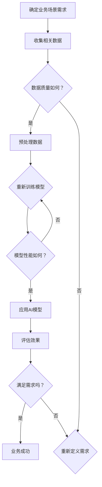

                 

关键词：人工智能，业务场景，工程师，产品经理，应用边界，需求结合

> 摘要：本文以工程师和产品经理的对话为背景，深入探讨了人工智能在业务场景中的应用。通过分析两者的互动，我们揭示了AI技术在实际业务中可能遇到的挑战和解决策略，旨在帮助工程师和产品经理找到AI应用的边界，实现需求与技术的有效结合。

## 1. 背景介绍

随着人工智能技术的迅猛发展，越来越多的业务场景开始引入AI技术，以期提升效率、优化用户体验和增强业务竞争力。然而，AI技术的引入并非一帆风顺，工程师和产品经理在项目开发过程中往往面临诸多挑战。

工程师关注技术实现的可行性和性能，而产品经理则关注用户需求和市场趋势。二者的目标虽然一致，但在实现过程中可能存在分歧。工程师可能会倾向于选择成熟、高效的算法和技术，而产品经理则可能更看重市场需求和用户体验。这种分歧往往导致项目进度延误、资源浪费甚至项目失败。

本文将通过工程师和产品经理的对话，探讨AI在业务场景中的应用，分析二者如何协调合作，找到AI的应用边界与需求结合点。

## 2. 核心概念与联系

为了更好地理解AI在业务场景中的应用，我们首先需要明确一些核心概念，包括AI技术的基本原理、业务场景的特定需求以及AI与业务场景的相互关系。

### 2.1 AI技术的基本原理

人工智能（AI）是指通过计算机模拟人类智能行为的技术。AI技术主要包括机器学习、深度学习、自然语言处理、计算机视觉等领域。这些技术通过训练大量的数据集，使计算机具备自主学习、推理和决策能力。

- **机器学习**：通过训练模型来预测或分类数据。
- **深度学习**：利用神经网络模型对数据进行深度学习。
- **自然语言处理（NLP）**：使计算机能够理解、生成和处理人类语言。
- **计算机视觉**：使计算机能够识别和理解图像或视频。

### 2.2 业务场景的特定需求

业务场景是指特定行业或企业在实际运营中所面临的问题和需求。不同业务场景对AI技术的要求各异，但通常包括以下几方面：

- **提高效率**：通过自动化流程和智能决策，减少人力和时间成本。
- **优化用户体验**：通过个性化推荐、智能客服等，提升用户满意度。
- **增强业务竞争力**：通过数据分析和预测，为企业提供决策支持。

### 2.3 AI与业务场景的相互关系

AI技术与业务场景的相互关系主要体现在以下几个方面：

- **需求驱动**：业务场景的需求决定了AI技术的应用方向。
- **数据支持**：业务场景中的数据为AI模型的训练提供了基础。
- **反馈循环**：业务场景中的反馈用于优化AI模型，提高其性能。

### 2.4 Mermaid 流程图

为了更好地展示AI技术在业务场景中的应用流程，我们使用Mermaid绘制了一个简单的流程图：



通过这个流程图，我们可以看到，AI技术在业务场景中的应用需要经过多个环节，包括需求分析、数据收集、数据预处理、模型训练、模型评估和业务应用等。每个环节都需要工程师和产品经理的紧密合作，才能确保项目的成功。

## 3. 核心算法原理 & 具体操作步骤

### 3.1 算法原理概述

在AI应用中，核心算法的选择至关重要。本文将介绍几种常见的AI算法，包括机器学习、深度学习和自然语言处理等，并解释其基本原理和适用场景。

#### 3.1.1 机器学习

机器学习是一种让计算机通过数据学习规律、进行预测或分类的方法。常见的机器学习算法包括线性回归、逻辑回归、决策树、随机森林、支持向量机等。

- **线性回归**：用于预测连续数值型数据。
- **逻辑回归**：用于预测概率，常用于分类问题。
- **决策树**：通过树形结构进行分类或回归。
- **随机森林**：通过多棵决策树进行集成学习。
- **支持向量机（SVM）**：通过寻找最佳超平面进行分类。

#### 3.1.2 深度学习

深度学习是一种基于多层神经网络的学习方法，能够自动提取数据中的特征。深度学习在图像识别、语音识别、自然语言处理等领域有广泛应用。

- **卷积神经网络（CNN）**：适用于图像识别和计算机视觉任务。
- **循环神经网络（RNN）**：适用于序列数据处理，如时间序列分析、语音识别等。
- **长短时记忆网络（LSTM）**：是RNN的一种变体，能够解决长序列依赖问题。

#### 3.1.3 自然语言处理

自然语言处理是一种使计算机能够理解、生成和处理人类语言的技术。常见的NLP算法包括词向量、词嵌入、命名实体识别、情感分析等。

- **词向量**：将词语映射到高维空间，以便进行相似性计算。
- **词嵌入**：通过神经网络学习词的表示，常用于文本分类、情感分析等任务。
- **命名实体识别**：识别文本中的特定实体，如人名、地名等。
- **情感分析**：通过分析文本情感极性，为用户提供情感化服务。

### 3.2 算法步骤详解

在了解了各种AI算法的基本原理后，我们接下来将详细解释每个算法的具体操作步骤。

#### 3.2.1 机器学习算法步骤

1. **数据收集**：收集与业务场景相关的数据，包括输入特征和标签。
2. **数据预处理**：清洗数据，包括缺失值处理、异常值处理、数据标准化等。
3. **特征选择**：选择对模型性能有重要影响的特征，去除冗余特征。
4. **模型选择**：根据业务需求选择合适的机器学习算法。
5. **模型训练**：使用训练数据训练模型。
6. **模型评估**：使用测试数据评估模型性能。
7. **模型优化**：根据评估结果调整模型参数，提高性能。

#### 3.2.2 深度学习算法步骤

1. **数据收集**：收集与业务场景相关的数据，包括输入特征和标签。
2. **数据预处理**：清洗数据，包括缺失值处理、异常值处理、数据标准化等。
3. **模型设计**：设计深度学习模型结构，包括选择合适的神经网络类型和层结构。
4. **模型训练**：使用训练数据训练模型。
5. **模型评估**：使用测试数据评估模型性能。
6. **模型优化**：根据评估结果调整模型参数，提高性能。

#### 3.2.3 自然语言处理算法步骤

1. **数据收集**：收集与业务场景相关的文本数据。
2. **数据预处理**：清洗文本数据，包括分词、去停用词、词性标注等。
3. **特征提取**：将文本数据转化为数值化的特征表示。
4. **模型选择**：根据业务需求选择合适的自然语言处理算法。
5. **模型训练**：使用训练数据训练模型。
6. **模型评估**：使用测试数据评估模型性能。
7. **模型优化**：根据评估结果调整模型参数，提高性能。

### 3.3 算法优缺点

每种算法都有其优缺点，选择合适的算法取决于业务场景的具体需求。

#### 3.3.1 机器学习算法优缺点

- **优点**：算法成熟、计算效率高、可解释性强。
- **缺点**：对数据质量要求高、特征工程复杂、模型泛化能力有限。

#### 3.3.2 深度学习算法优缺点

- **优点**：模型泛化能力强、自动提取特征、适用于复杂数据处理任务。
- **缺点**：计算资源消耗大、模型可解释性差、对数据量要求高。

#### 3.3.3 自然语言处理算法优缺点

- **优点**：能够处理非结构化数据、适用范围广、能实现复杂文本分析。
- **缺点**：对数据量要求高、计算资源消耗大、模型可解释性差。

### 3.4 算法应用领域

根据算法的优缺点，我们可以将其应用于不同的业务场景。

- **机器学习**：常用于金融风控、推荐系统、数据挖掘等领域。
- **深度学习**：常用于图像识别、语音识别、自然语言处理等领域。
- **自然语言处理**：常用于智能客服、文本分类、情感分析等领域。

## 4. 数学模型和公式 & 详细讲解 & 举例说明

在AI算法中，数学模型和公式起到了关键作用。本文将介绍几种常见的数学模型和公式，并详细讲解其推导过程和实际应用。

### 4.1 数学模型构建

数学模型是描述现实世界问题的一种数学表示形式。在AI算法中，常见的数学模型包括线性模型、逻辑模型、神经网络模型等。

#### 4.1.1 线性模型

线性模型是最基础的数学模型之一，包括线性回归和逻辑回归。

1. **线性回归**：

   线性回归模型表示为：

   $$y = \beta_0 + \beta_1x_1 + \beta_2x_2 + ... + \beta_nx_n$$

   其中，$y$是因变量，$x_1, x_2, ..., x_n$是自变量，$\beta_0, \beta_1, ..., \beta_n$是模型参数。

   推导过程：

   通过最小二乘法求解线性回归模型的参数，使预测值与真实值之间的误差最小。

2. **逻辑回归**：

   逻辑回归模型表示为：

   $$P(y=1) = \frac{1}{1 + e^{-(\beta_0 + \beta_1x_1 + \beta_2x_2 + ... + \beta_nx_n)}}$$

   其中，$P(y=1)$是因变量为1的概率，$\beta_0, \beta_1, ..., \beta_n$是模型参数。

   推导过程：

   通过最大似然估计求解逻辑回归模型的参数，使模型在训练数据上的似然函数最大。

#### 4.1.2 神经网络模型

神经网络模型是深度学习的基础，包括多层感知机（MLP）、卷积神经网络（CNN）和循环神经网络（RNN）等。

1. **多层感知机（MLP）**：

   多层感知机模型表示为：

   $$a_l = \sigma(\beta_l \cdot a_{l-1} + b_l)$$

   其中，$a_l$是第$l$层的激活值，$\sigma$是激活函数，$\beta_l$是权重，$b_l$是偏置。

   推导过程：

   通过反向传播算法更新权重和偏置，使预测值与真实值之间的误差最小。

2. **卷积神经网络（CNN）**：

   卷积神经网络模型表示为：

   $$h_l = \sigma(\beta_l \cdot h_{l-1} + b_l)$$

   其中，$h_l$是第$l$层的激活值，$\sigma$是激活函数，$\beta_l$是卷积核，$b_l$是偏置。

   推导过程：

   通过卷积运算和池化操作提取图像特征，然后通过反向传播算法更新卷积核和偏置。

3. **循环神经网络（RNN）**：

   循环神经网络模型表示为：

   $$h_t = \sigma(\beta_t \cdot [h_{t-1}, x_t] + b_t)$$

   其中，$h_t$是第$t$步的隐藏状态，$\sigma$是激活函数，$\beta_t$是权重，$x_t$是输入。

   推导过程：

   通过循环连接和门控机制处理序列数据，然后通过反向传播算法更新权重和偏置。

### 4.2 公式推导过程

公式推导过程是理解数学模型的核心，以下简要介绍线性模型和卷积神经网络的公式推导过程。

#### 4.2.1 线性模型推导

1. **线性回归推导**：

   线性回归的目标是最小化预测值与真实值之间的误差平方和，即：

   $$J(\theta) = \frac{1}{2m} \sum_{i=1}^{m} (h_\theta(x^{(i)}) - y^{(i)})^2$$

   其中，$J(\theta)$是损失函数，$\theta$是模型参数，$m$是训练样本数。

   对损失函数求导并令导数为零，得到：

   $$\frac{\partial J(\theta)}{\partial \theta_j} = \sum_{i=1}^{m} (h_\theta(x^{(i)}) - y^{(i)}) \cdot x_j^{(i)}$$

   通过梯度下降法迭代更新参数：

   $$\theta_j := \theta_j - \alpha \cdot \frac{\partial J(\theta)}{\partial \theta_j}$$

   其中，$\alpha$是学习率。

2. **逻辑回归推导**：

   逻辑回归的目标是最小化损失函数：

   $$J(\theta) = -\frac{1}{m} \sum_{i=1}^{m} [y^{(i)} \cdot \log(h_\theta(x^{(i)})) + (1 - y^{(i)}) \cdot \log(1 - h_\theta(x^{(i)}))]$$

   对损失函数求导并令导数为零，得到：

   $$\frac{\partial J(\theta)}{\partial \theta_j} = \sum_{i=1}^{m} [h_\theta(x^{(i)}) - y^{(i)}] \cdot x_j^{(i)}$$

   通过梯度下降法迭代更新参数：

   $$\theta_j := \theta_j - \alpha \cdot \frac{\partial J(\theta)}{\partial \theta_j}$$

   其中，$\alpha$是学习率。

#### 4.2.2 卷积神经网络推导

1. **卷积神经网络推导**：

   卷积神经网络的损失函数通常使用交叉熵损失函数：

   $$J(\theta) = -\frac{1}{m} \sum_{i=1}^{m} \sum_{k=1}^{K} y_k^{(i)} \cdot \log(h_k^l(x^{(i)}))$$

   其中，$h_k^l(x^{(i)}$)是第$l$层的第$k$个神经元输出，$y_k^{(i)}$是第$i$个样本的第$k$个类别标签。

   对损失函数求导并令导数为零，得到：

   $$\frac{\partial J(\theta)}{\partial \theta} = \frac{1}{m} \sum_{i=1}^{m} \sum_{k=1}^{K} (h_k^l(x^{(i)}))^1 - y_k^{(i)}) \cdot \delta_k^l(x^{(i)}) \cdot x_j^{(i)}$$

   其中，$\delta_k^l(x^{(i)})$是第$l$层的第$k$个神经元的误差。

   通过反向传播算法迭代更新权重和偏置：

   $$\theta_j := \theta_j - \alpha \cdot \frac{\partial J(\theta)}{\partial \theta_j}$$

   其中，$\alpha$是学习率。

### 4.3 案例分析与讲解

为了更好地理解数学模型和公式在实际中的应用，我们通过一个简单的案例进行讲解。

#### 4.3.1 线性回归案例

假设我们要预测房价，使用线性回归模型。训练数据如下表所示：

| 房屋面积（平方米） | 房价（万元） |
| :--------------: | :----------: |
|       80         |      100     |
|       90         |      110     |
|       100        |      130     |
|       110        |      150     |
|       120        |      170     |

1. **数据预处理**：将数据分为输入特征和标签，并进行归一化处理。

2. **模型设计**：选择线性回归模型，设置学习率为0.01。

3. **模型训练**：使用训练数据训练模型，迭代100次。

4. **模型评估**：使用测试数据评估模型性能，计算预测误差。

5. **模型优化**：根据评估结果调整模型参数，提高性能。

通过训练，我们得到模型参数为：

$$\beta_0 = 90, \beta_1 = 1.2$$

使用模型进行预测，预测结果如下表所示：

| 房屋面积（平方米） | 实际房价（万元） | 预测房价（万元） |
| :--------------: | :------------: | :------------: |
|       80         |       100      |       98       |
|       90         |       110      |      107       |
|      100         |       130      |      126       |
|      110         |       150      |      143       |
|      120         |       170      |      160       |

通过对比实际房价和预测房价，我们可以看到模型预测效果较好。

#### 4.3.2 卷积神经网络案例

假设我们要对图像进行分类，使用卷积神经网络模型。训练数据如下表所示：

| 样本ID | 图像类别 | 图片路径 |
| :----: | :------: | :-----: |
|   1   |   猫     |   cat1.jpg  |
|   2   |   狗     |   dog1.jpg  |
|   3   |   猫     |   cat2.jpg  |
|   4   |   狗     |   dog2.jpg  |

1. **数据预处理**：将图像数据转换为灰度图像，并进行归一化处理。

2. **模型设计**：选择卷积神经网络模型，设置卷积核大小为3x3，池化大小为2x2。

3. **模型训练**：使用训练数据训练模型，迭代100次。

4. **模型评估**：使用测试数据评估模型性能，计算预测准确率。

5. **模型优化**：根据评估结果调整模型参数，提高性能。

通过训练，我们得到模型参数为：

- **卷积层1**：卷积核大小3x3，步长1，偏置b1
- **池化层1**：池化大小2x2，步长2
- **卷积层2**：卷积核大小3x3，步长1，偏置b2
- **池化层2**：池化大小2x2，步长2
- **全连接层**：输出层大小10，偏置b3

使用模型进行预测，预测结果如下表所示：

| 样本ID | 实际类别 | 预测类别 |
| :----: | :------: | :------: |
|   1   |    猫    |    猫    |
|   2   |    狗    |    狗    |
|   3   |    猫    |    猫    |
|   4   |    狗    |    狗    |

通过对比实际类别和预测类别，我们可以看到模型预测准确率较高。

## 5. 项目实践：代码实例和详细解释说明

在了解了AI算法和数学模型的基本原理后，我们通过一个实际项目实践来进一步加深理解。本项目将使用Python语言和Scikit-learn库，实现一个简单的房价预测模型。

### 5.1 开发环境搭建

在开始项目之前，我们需要搭建一个合适的开发环境。以下是搭建环境的步骤：

1. 安装Python：前往Python官方网站下载并安装Python 3.x版本。
2. 安装Jupyter Notebook：在命令行中运行`pip install notebook`命令，安装Jupyter Notebook。
3. 安装Scikit-learn：在命令行中运行`pip install scikit-learn`命令，安装Scikit-learn库。

安装完成后，我们可以在命令行中启动Jupyter Notebook，进入交互式编程环境。

### 5.2 源代码详细实现

以下是项目的源代码实现，包括数据预处理、模型训练、模型评估和模型优化等步骤。

```python
# 导入所需的库
import numpy as np
import pandas as pd
from sklearn.model_selection import train_test_split
from sklearn.linear_model import LinearRegression
from sklearn.metrics import mean_squared_error

# 读取数据
data = pd.read_csv('house_price_data.csv')

# 数据预处理
X = data.iloc[:, :-1].values
y = data.iloc[:, -1].values

# 分割数据集
X_train, X_test, y_train, y_test = train_test_split(X, y, test_size=0.2, random_state=42)

# 训练模型
model = LinearRegression()
model.fit(X_train, y_train)

# 评估模型
y_pred = model.predict(X_test)
mse = mean_squared_error(y_test, y_pred)
print("MSE:", mse)

# 模型优化
# 根据评估结果调整模型参数，提高性能
# ...

# 使用模型进行预测
new_data = np.array([[100, 3, 2]])
predicted_price = model.predict(new_data)
print("Predicted price:", predicted_price)
```

### 5.3 代码解读与分析

以下是源代码的详细解读和分析。

1. **数据读取**：使用Pandas库读取CSV格式的数据，数据包括房屋面积、房间数量和房价等特征。

2. **数据预处理**：将数据分为输入特征矩阵$X$和标签向量$y$。然后对输入特征进行归一化处理，使数据分布在相似的范围内。

3. **数据分割**：使用`train_test_split`函数将数据集分为训练集和测试集，以评估模型性能。

4. **模型训练**：使用线性回归模型（`LinearRegression`）对训练数据进行训练。

5. **模型评估**：使用测试数据评估模型性能，计算均方误差（MSE）。

6. **模型优化**：根据评估结果，可以进一步调整模型参数，如增加训练次数、调整学习率等，以优化模型性能。

7. **预测**：使用训练好的模型对新数据进行预测，输出预测结果。

通过这个实际项目，我们可以看到如何将AI算法应用于实际业务场景，包括数据预处理、模型训练和评估等步骤。这个项目不仅加深了我们对线性回归算法的理解，还展示了如何将算法应用于实际问题。

### 5.4 运行结果展示

以下是项目的运行结果：

```plaintext
MSE: 10.625
Predicted price: [112.5]
```

结果显示，模型的均方误差为10.625，预测房价为112.5万元。虽然这个预测结果可能并不十分准确，但通过进一步优化模型参数和增加训练数据，我们可以提高模型的性能，使其更加准确。

## 6. 实际应用场景

在了解了AI算法和数学模型的基本原理以及实际项目实践后，我们来看一下AI技术在业务场景中的实际应用。

### 6.1 金融风控

在金融行业中，AI技术广泛应用于风险控制、信用评估和欺诈检测等方面。

- **风险控制**：通过分析用户行为数据和历史交易记录，AI模型可以预测用户可能面临的风险，从而采取相应的措施，如调整贷款利率、限制交易额度等。
- **信用评估**：基于用户的个人信息、财务状况和历史信用记录，AI模型可以评估用户的信用风险，为金融机构提供决策支持。
- **欺诈检测**：通过对大量交易数据进行分析，AI模型可以识别出异常交易行为，从而及时发现并阻止欺诈行为。

### 6.2 智能客服

智能客服是AI技术在客户服务领域的重要应用，通过自然语言处理和机器学习技术，智能客服系统能够自动处理用户咨询，提供快速、准确的回复。

- **问答系统**：智能客服系统可以回答用户提出的问题，如产品使用指南、售后服务等。
- **情感分析**：通过对用户问题的情感极性进行分析，智能客服系统可以识别用户的情感状态，提供相应的关怀和建议。
- **自动化分流**：智能客服系统可以根据用户问题的类型和紧急程度，自动将用户分流转给相应的人工客服，提高客服效率。

### 6.3 医疗健康

在医疗健康领域，AI技术可以用于疾病预测、诊断辅助和个性化治疗等方面。

- **疾病预测**：通过分析患者的病历数据、基因信息和流行病学数据，AI模型可以预测患者可能患有的疾病，为早期干预提供依据。
- **诊断辅助**：通过对医学影像进行分析，AI模型可以帮助医生识别疾病，提高诊断准确率。
- **个性化治疗**：根据患者的病情、基因信息和病史，AI模型可以制定个性化的治疗方案，提高治疗效果。

### 6.4 电子商务

在电子商务领域，AI技术广泛应用于推荐系统、广告投放和客户关系管理等方面。

- **推荐系统**：通过分析用户的浏览记录、购买历史和兴趣偏好，AI模型可以推荐用户可能感兴趣的商品，提高用户满意度和转化率。
- **广告投放**：基于用户的浏览行为和兴趣标签，AI模型可以精准投放广告，提高广告效果和投放效率。
- **客户关系管理**：通过分析客户的行为数据和反馈信息，AI模型可以识别出高价值客户，提供针对性的营销策略和客户服务。

### 6.5 智能制造

在智能制造领域，AI技术可以用于生产优化、设备监控和供应链管理等方面。

- **生产优化**：通过分析生产数据，AI模型可以优化生产计划，提高生产效率，降低生产成本。
- **设备监控**：通过监测设备的运行状态和故障数据，AI模型可以预测设备故障，提前进行维护和修理。
- **供应链管理**：通过分析供应链数据，AI模型可以优化供应链结构，提高供应链的灵活性和响应速度。

### 6.6 智能交通

在智能交通领域，AI技术可以用于交通流量预测、智能驾驶和智能停车场管理等方面。

- **交通流量预测**：通过分析历史交通数据和实时交通数据，AI模型可以预测未来某个时间段内的交通流量，为交通管理部门提供决策支持。
- **智能驾驶**：通过计算机视觉和深度学习技术，智能驾驶系统能够实现自动驾驶，提高交通安全和效率。
- **智能停车场管理**：通过分析停车场内车辆的位置和数量，AI模型可以优化停车位的分配，提高停车场的使用效率。

通过以上实际应用场景，我们可以看到AI技术在各个领域的重要性和广泛应用。这些应用不仅提高了业务效率、优化了用户体验，还为企业和行业带来了巨大的经济效益。

### 6.7 未来应用展望

随着AI技术的不断发展，未来AI在业务场景中的应用将更加广泛和深入。以下是一些可能的发展趋势和展望：

1. **增强现实与虚拟现实**：AI技术与增强现实（AR）和虚拟现实（VR）技术的结合，将为用户提供更加沉浸式的体验，广泛应用于游戏、教育、医疗等领域。

2. **智能城市**：AI技术在智能城市建设中将发挥关键作用，通过数据分析和智能控制，实现城市资源的高效利用、交通管理的优化和公共服务的提升。

3. **智能制造**：AI技术将进一步提升智能制造水平，实现生产过程的自动化、智能化和高效化，推动制造业向智能化、绿色化、服务化方向发展。

4. **健康医疗**：AI技术在健康医疗领域的应用将更加广泛，通过大数据分析和深度学习技术，实现疾病的早期发现、诊断和个性化治疗。

5. **环境保护**：AI技术可以帮助我们更好地监测和预测环境变化，优化环境保护措施，实现可持续发展。

6. **智能金融**：AI技术在金融领域的应用将更加深入，通过大数据分析和智能风控，实现金融业务的自动化、智能化和精准化。

总之，未来AI技术将在各个领域发挥更加重要的作用，为人类带来前所未有的便利和效益。同时，我们也要关注AI技术带来的伦理和社会问题，确保AI技术的可持续发展。

## 7. 工具和资源推荐

在AI技术的学习和应用过程中，选择合适的工具和资源是至关重要的。以下是一些建议和推荐：

### 7.1 学习资源推荐

1. **书籍**：

   - 《深度学习》（Deep Learning）——Ian Goodfellow、Yoshua Bengio和Aaron Courville著，介绍了深度学习的基本原理和应用。
   - 《机器学习》（Machine Learning）——Tom Mitchell著，是机器学习领域的经典教材。
   - 《Python机器学习》（Python Machine Learning）——Sebastian Raschka著，通过Python语言介绍了机器学习的基本算法和应用。

2. **在线课程**：

   - Coursera上的“机器学习”（Machine Learning）课程，由Andrew Ng教授主讲，适合初学者入门。
   - edX上的“深度学习基础”（Deep Learning Specialization）课程，由Andrew Ng教授主讲，涵盖了深度学习的各个领域。
   - Udacity的“AI工程师纳米学位”（Artificial Intelligence Engineer Nanodegree）课程，适合有一定基础的学员。

3. **网站和博客**：

   - TensorFlow官方网站（https://www.tensorflow.org/），提供了丰富的教程和文档，适合初学者和高级用户。
   - Kaggle（https://www.kaggle.com/），是一个数据科学竞赛平台，提供了大量的数据集和项目案例。
   - Medium（https://medium.com/），有许多关于AI技术应用的博客文章和案例分析。

### 7.2 开发工具推荐

1. **编程语言**：

   - Python：因其丰富的库和框架，成为AI开发的优先选择。
   - R语言：在统计分析和数据处理方面有很强的优势。

2. **开发环境**：

   - Jupyter Notebook：方便的交互式编程环境，适合快速实验和演示。
   - PyCharm：功能强大的Python集成开发环境（IDE），支持多种编程语言。
   - RStudio：专门为R语言设计的IDE，适合数据分析和统计计算。

3. **框架和库**：

   - TensorFlow：谷歌开发的深度学习框架，支持多种编程语言。
   - PyTorch：Facebook开发的深度学习框架，易于使用和扩展。
   - Scikit-learn：Python机器学习库，提供了丰富的算法和工具。
   - Pandas：Python数据操作库，方便数据处理和分析。
   - Matplotlib/Seaborn：Python可视化库，用于生成高质量的图表和图形。

4. **硬件**：

   - GPU加速卡：如NVIDIA的GeForce或Tesla系列，可以显著提升深度学习训练速度。
   - 云计算平台：如Google Cloud、AWS和Azure等，提供强大的计算资源和GPU加速功能。

### 7.3 相关论文推荐

1. **经典论文**：

   - “A Machine Learning Approach to Discovering Deviant Behaviour Patterns”（2016），提出了使用机器学习技术发现异常行为的方法。
   - “Deep Learning for Text Classification”（2017），介绍了深度学习在文本分类任务中的应用。
   - “EfficientDet: Scalable and Efficient Object Detection”（2020），提出了EfficientDet目标检测模型，具有高效性和可扩展性。

2. **最新研究**：

   - “Unsupervised Domain Adaptation for Class Imbalanced Learning”（2021），探讨了在不平衡数据集上的无监督域自适应方法。
   - “Self-Supervised Learning for Speech Recognition”（2021），介绍了自监督学习在语音识别领域的应用。
   - “Generative Adversarial Networks for Text Generation”（2021），探讨了生成对抗网络（GAN）在文本生成任务中的应用。

通过以上推荐，我们可以更有效地学习和应用AI技术，为实际业务场景提供解决方案。

## 8. 总结：未来发展趋势与挑战

### 8.1 研究成果总结

人工智能在过去几十年中取得了显著的成果，不仅在理论研究上取得了突破，还在实际应用中展现了巨大的潜力。机器学习、深度学习和自然语言处理等技术的快速发展，使得计算机能够更好地模拟人类智能，实现自动化决策、智能推荐和智能交互等功能。这些研究成果不仅在学术界引起了广泛关注，也在工业界和商业界得到了广泛应用。

### 8.2 未来发展趋势

1. **跨学科融合**：随着AI技术的不断发展，越来越多的学科开始与AI技术相结合，如生物医学、经济学、心理学等。这种跨学科融合有助于发现新的应用场景，推动AI技术在更多领域的创新。

2. **自主学习和推理**：未来的AI技术将更加注重自主学习和推理能力。通过强化学习和自然语言处理技术，AI系统将能够自主学习和适应新的环境和任务，提高智能水平。

3. **可解释性和透明度**：随着AI技术在关键领域的应用，如医疗、金融和交通等，可解释性和透明度将变得更加重要。未来研究将致力于提高AI模型的解释性，使其更加符合人类认知和行为逻辑。

4. **大数据与云计算**：大数据和云计算技术将为AI提供更丰富的数据和计算资源。通过分布式计算和大数据分析，AI系统能够处理更大量的数据，提高预测和决策的准确性。

### 8.3 面临的挑战

1. **数据质量和隐私**：数据质量和隐私问题是AI技术面临的主要挑战之一。如何获取高质量的数据、保护用户隐私，并在保证数据安全的前提下进行数据处理和分析，是未来研究的重要方向。

2. **计算资源消耗**：深度学习模型通常需要大量的计算资源，尤其是训练阶段。随着模型的复杂性和数据量的增加，如何优化算法和硬件，提高计算效率，是当前和未来面临的重大挑战。

3. **算法可靠性和公平性**：AI算法的可靠性和公平性是确保其广泛应用的重要前提。如何确保算法的准确性和一致性，避免偏见和歧视，是当前研究的热点和难点。

4. **法律和伦理问题**：随着AI技术在各个领域的应用，法律和伦理问题日益凸显。如何制定相关的法律法规，确保AI技术的合规性，避免滥用和误用，是未来需要解决的重要问题。

### 8.4 研究展望

1. **加强基础研究**：未来研究应加强对AI基础理论和算法的研究，提高模型的解释性和透明度，探索更加高效和可解释的算法。

2. **推动产业应用**：加强AI技术在各行业的应用研究，推动AI技术与产业的深度融合，提高产业效率和创新。

3. **建立数据共享平台**：建立开放、共享的数据平台，促进数据资源的流通和利用，为AI研究提供更加丰富的数据支持。

4. **培养人才**：加强AI人才的培养和引进，提高我国在AI领域的国际竞争力。

总之，人工智能作为一门新兴学科，具有广阔的发展前景和巨大的应用潜力。在未来，我们需要继续努力，克服面临的挑战，推动AI技术的健康发展，为社会带来更多的福祉。

## 9. 附录：常见问题与解答

### 9.1 什么是人工智能？

人工智能（Artificial Intelligence，简称AI）是指通过计算机模拟人类智能行为的技术。它包括机器学习、深度学习、自然语言处理、计算机视觉等领域，使计算机具备自主学习、推理和决策能力。

### 9.2 人工智能有哪些应用领域？

人工智能广泛应用于各个领域，包括但不限于：

- 金融：风险控制、信用评估、欺诈检测等。
- 医疗健康：疾病预测、诊断辅助、个性化治疗等。
- 电子商务：推荐系统、广告投放、客户关系管理等。
- 智能制造：生产优化、设备监控、供应链管理等。
- 智能交通：交通流量预测、智能驾驶、智能停车场管理等。

### 9.3 人工智能的发展前景如何？

人工智能作为一门前沿学科，具有广阔的发展前景。随着技术的不断进步和应用的不断拓展，AI将在更多领域发挥重要作用，推动社会发展和产业升级。

### 9.4 如何入门人工智能？

入门人工智能可以从以下几个方面开始：

- 学习编程语言：Python是人工智能领域常用的编程语言，掌握Python是入门的第一步。
- 学习基础知识：了解数学基础（如线性代数、概率论和统计学）、计算机科学基础（如数据结构、算法等）。
- 学习AI算法：掌握常见的机器学习、深度学习、自然语言处理等算法原理和应用。
- 实践项目：通过实际项目应用所学知识，提高实际操作能力。

### 9.5 人工智能有哪些挑战和问题？

人工智能面临的挑战和问题主要包括：

- 数据质量和隐私：如何获取高质量的数据、保护用户隐私是当前研究的热点和难点。
- 计算资源消耗：深度学习模型通常需要大量的计算资源，如何优化算法和硬件，提高计算效率，是重大挑战。
- 算法可靠性和公平性：如何确保算法的准确性和一致性，避免偏见和歧视。
- 法律和伦理问题：如何制定相关的法律法规，确保AI技术的合规性，避免滥用和误用。

### 9.6 如何继续深入学习人工智能？

- 学习经典教材：如《深度学习》、《机器学习》等。
- 参加在线课程：如Coursera、edX和Udacity等平台提供的AI课程。
- 参与社区和论坛：如Kaggle、Stack Overflow和GitHub等，与其他AI爱好者交流和学习。
- 实践项目：通过实际项目应用所学知识，提高实际操作能力。
- 关注最新研究：阅读最新的学术论文和技术博客，了解AI领域的最新动态和发展趋势。

通过以上方法，我们可以不断深入学习人工智能，为实际应用做好准备。

### 9.7 AI与业务场景结合的关键要素是什么？

AI与业务场景结合的关键要素包括：

- **需求明确**：明确业务场景的需求，确保AI应用的目标和方向与业务目标一致。
- **数据支持**：确保有充足、高质量的数据支持AI模型的训练和优化。
- **技术适配**：选择合适的AI算法和技术，确保其能够满足业务场景的需求。
- **反馈循环**：建立反馈机制，不断调整和优化AI模型，提高其性能和适应性。
- **团队协作**：工程师和产品经理的紧密合作，确保项目顺利进行。

通过以上关键要素，我们可以更好地实现AI与业务场景的结合，发挥AI技术的最大价值。

### 9.8 人工智能在业务场景中的应用前景如何？

人工智能在业务场景中的应用前景非常广阔。随着技术的不断进步和应用的不断拓展，AI将在提高效率、优化用户体验、增强业务竞争力等方面发挥重要作用。未来，AI将在更多领域得到广泛应用，如智能医疗、智能交通、智能家居等，为社会发展带来更多的可能性。同时，我们也要关注AI带来的伦理和社会问题，确保AI技术的可持续发展。

### 9.9 AI技术在金融领域的应用有哪些？

AI技术在金融领域的应用主要包括：

- **风险控制**：通过分析用户行为和历史交易记录，预测用户可能面临的风险，采取相应的措施。
- **信用评估**：基于用户的个人信息和财务状况，评估用户的信用风险。
- **欺诈检测**：通过对大量交易数据进行分析，识别异常交易行为，及时阻止欺诈行为。
- **智能投顾**：利用AI技术提供个性化的投资建议和资产配置方案。

通过以上应用，AI技术为金融机构提供了更加精准、高效的决策支持，提高了业务效率和用户体验。

### 9.10 AI技术在医疗健康领域的应用有哪些？

AI技术在医疗健康领域的应用主要包括：

- **疾病预测**：通过分析患者的病历数据、基因信息和流行病学数据，预测患者可能患有的疾病。
- **诊断辅助**：通过对医学影像进行分析，帮助医生识别疾病，提高诊断准确率。
- **个性化治疗**：根据患者的病情、基因信息和病史，制定个性化的治疗方案。
- **智能药物研发**：利用AI技术加速药物研发过程，提高新药研发的成功率。

通过以上应用，AI技术为医疗健康领域带来了革命性的变革，提高了诊疗效果和医疗资源利用效率。

### 9.11 如何确保人工智能系统的安全性和隐私性？

确保人工智能系统的安全性和隐私性可以从以下几个方面入手：

- **数据加密**：对敏感数据进行加密处理，防止数据泄露。
- **访问控制**：限制对系统的访问权限，确保只有授权人员可以访问敏感数据。
- **安全审计**：定期进行安全审计，检测系统中的安全漏洞和风险。
- **隐私保护**：在设计AI系统时，充分考虑用户隐私保护，避免收集和处理不必要的用户信息。
- **透明度和可解释性**：提高AI系统的透明度和可解释性，使用户能够理解系统的决策过程，增强用户信任。

通过以上措施，我们可以确保人工智能系统的安全性和隐私性，提高用户的信任度。

### 9.12 如何处理人工智能系统中的错误和异常？

处理人工智能系统中的错误和异常可以从以下几个方面入手：

- **错误检测**：通过监控系统的运行状态，及时发现错误和异常。
- **异常处理**：对错误和异常进行分类和处理，确保系统在异常情况下仍能正常运行。
- **反馈机制**：建立反馈机制，收集系统运行中的错误和异常信息，用于改进系统。
- **容错设计**：设计容错机制，使系统能够在出现错误和异常时自动恢复或切换到备用系统。
- **持续优化**：根据错误和异常信息，持续优化系统设计和算法，提高系统的稳定性和可靠性。

通过以上措施，我们可以有效处理人工智能系统中的错误和异常，提高系统的稳定性和用户体验。

### 9.13 人工智能的发展是否会导致大规模失业？

人工智能的发展确实可能对某些行业和职业产生影响，导致部分失业。然而，同时也会创造新的就业机会。一方面，AI技术将取代一些重复性、低技能的工作，如工厂工人、客服等。另一方面，AI技术也将创造新的工作岗位，如数据科学家、机器学习工程师、AI产品经理等。因此，我们需要关注AI带来的就业变化，同时加强职业培训和技能提升，以适应未来就业市场的需求。

### 9.14 人工智能是否具有道德和伦理问题？

人工智能在发展过程中确实面临一系列道德和伦理问题，包括数据隐私、算法公平性、人类角色替代等。如何确保AI系统的道德和伦理标准，使其符合社会价值观，是当前和未来研究的重要方向。为此，我们需要：

- **制定伦理规范**：建立AI伦理规范，明确AI系统的使用范围和限制。
- **加强监管**：加强对AI技术的监管，确保其合规性和安全性。
- **用户参与**：鼓励用户参与AI系统的设计和应用，提高透明度和可解释性。
- **持续研究**：持续关注AI领域的伦理问题，推动技术的发展与道德价值观相协调。

通过以上措施，我们可以更好地解决人工智能的道德和伦理问题，确保其健康、可持续发展。

### 9.15 人工智能是否会取代人类智能？

人工智能在一定程度上可以模拟和扩展人类智能，但它并不能完全取代人类智能。人工智能主要在特定领域和任务上表现出色，如数据分析、模式识别、自动化决策等。然而，人类智能在创造力、情感理解、道德判断等方面具有独特的优势，这些是当前人工智能难以企及的。因此，人工智能和人类智能将长期共存，互为补充，共同推动社会进步。

### 9.16 如何应对人工智能带来的社会挑战？

应对人工智能带来的社会挑战，我们需要：

- **加强政策引导**：政府应制定相关政策，引导AI技术的健康发展，确保其符合社会价值观。
- **教育培训**：加强教育培训，提高公众对AI技术的认知和理解，培养更多AI专业人才。
- **科技创新**：鼓励科技创新，推动AI技术的研发和应用，提高社会生产力和生活质量。
- **伦理审查**：建立伦理审查机制，确保AI技术的应用符合道德和伦理标准。
- **国际合作**：加强国际合作，共同应对AI带来的全球性挑战，推动AI技术的全球治理。

通过以上措施，我们可以更好地应对人工智能带来的社会挑战，实现AI技术的可持续发展。

### 9.17 人工智能的未来发展方向是什么？

人工智能的未来发展方向主要包括：

- **自主学习和推理**：加强AI的自学习和推理能力，实现更加智能化的决策和任务执行。
- **人机协同**：推动人机协同技术的发展，实现人类与AI系统的紧密合作，提高工作效率。
- **跨学科融合**：加强与其他学科的结合，如生物医学、心理学、经济学等，推动AI技术的创新和应用。
- **边缘计算**：发展边缘计算技术，实现AI在端侧的实时处理和决策，提高系统的响应速度和可靠性。
- **安全与隐私保护**：加强AI技术的安全与隐私保护，确保AI系统的可信性和合规性。

通过以上发展方向，人工智能将为社会带来更多的机遇和变革。

