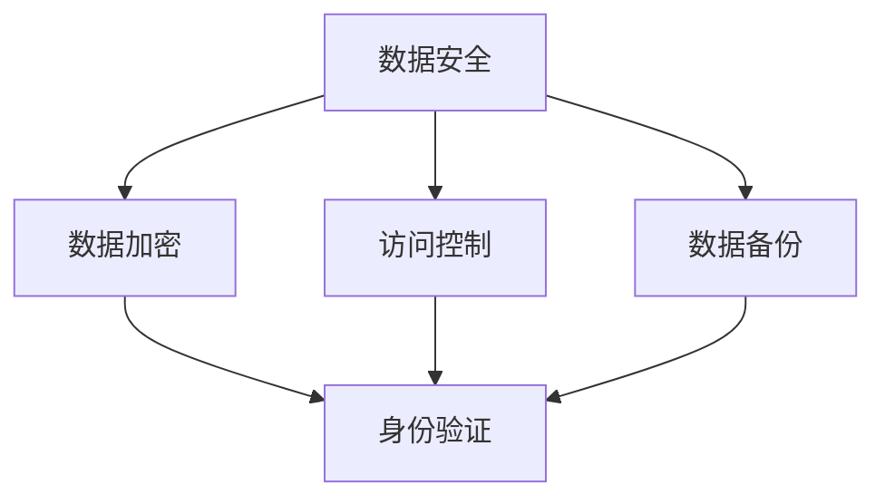
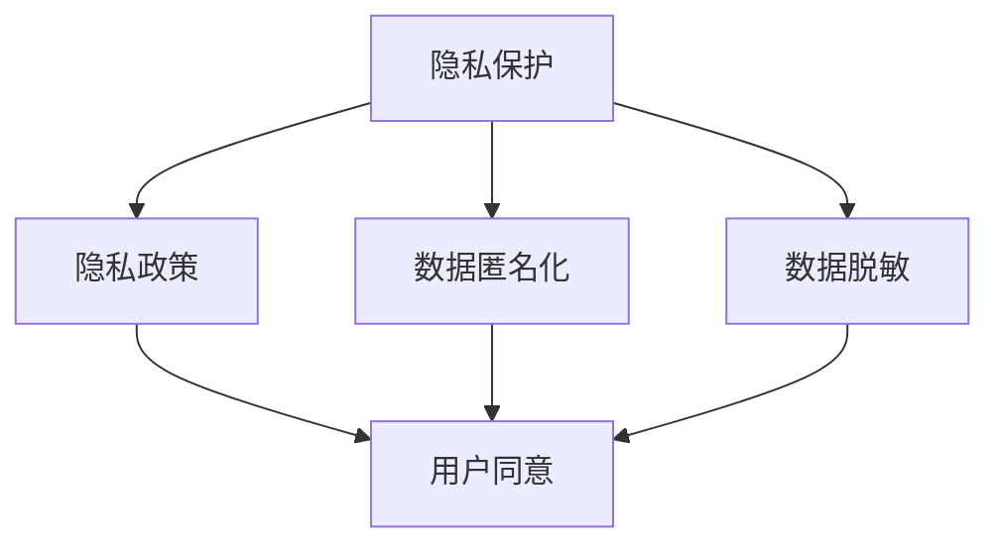
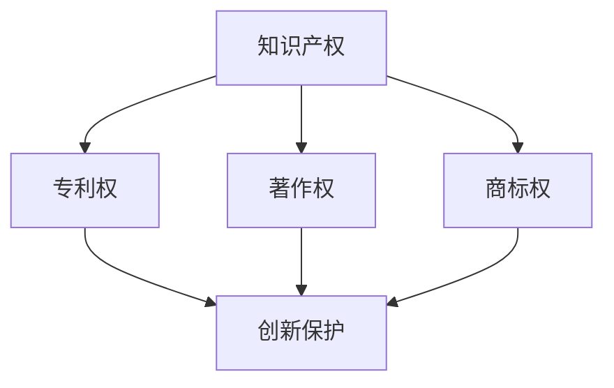
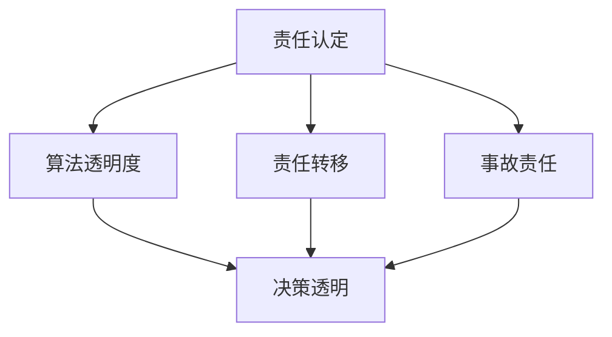

                 

## 1. 背景介绍

随着人工智能技术的快速发展，AI 已然成为现代社会不可或缺的一部分。无论是在医疗、金融、交通，还是在日常生活的方方面面，人工智能技术都发挥着越来越重要的作用。然而，人工智能技术的应用也带来了一系列的法律和伦理问题。如何在保障公民隐私、维护社会公平正义的同时，推动人工智能技术的发展，成为了一个亟待解决的问题。

为了应对这一挑战，各国纷纷出台了一系列与人工智能相关的法律法规。这些法律法规涵盖了数据安全、隐私保护、知识产权、责任认定等多个方面，旨在为人工智能的发展提供法律保障。然而，由于人工智能技术的不断演进，现有的法律法规往往难以完全适应新的技术挑战，因此在实践中，如何正确理解和适用这些法律法规，成为一个重要议题。

本文旨在通过对AI相关法律法规的原理讲解，结合实际代码实战案例，帮助读者更好地理解AI技术在实际应用中面临的法律问题，并掌握解决这些问题的方法和技巧。

## 2. 核心概念与联系

### 2.1 数据安全

数据安全是指保护数据免受未经授权的访问、使用、披露、破坏、修改或破坏的措施。在人工智能应用中，数据安全尤为重要，因为大量的数据是AI模型训练和决策的基础。

#### 2.1.1 关键术语

- **数据加密**：通过加密算法将数据转换为只有授权用户才能解读的形式。
- **访问控制**：通过身份验证和权限管理来限制用户对数据的访问。
- **数据备份**：将数据复制并存储在多个地方，以防止数据丢失或损坏。

#### 2.1.2 关系图



### 2.2 隐私保护

隐私保护是指保护个人隐私信息，防止其被未经授权的收集、使用、披露的行为。在AI应用中，由于涉及到大量的个人数据，隐私保护尤为重要。

#### 2.2.1 关键术语

- **隐私政策**：明确告知用户其数据将被如何使用和保护的声明。
- **数据匿名化**：通过技术手段去除个人数据中的可直接识别信息。
- **数据脱敏**：对敏感数据进行加密或混淆，使其无法被直接识别。

#### 2.2.2 关系图



### 2.3 知识产权

知识产权是指通过法律授予的创造性作品的财产权。在AI应用中，知识产权保护涉及到数据集、算法、应用程序等多个方面。

#### 2.3.1 关键术语

- **专利权**：对发明创造的独占权。
- **著作权**：对文学、艺术、科学作品的独占权。
- **商标权**：对标志、标识等商业标识的独占权。

#### 2.3.2 关系图



### 2.4 责任认定

在AI应用中，由于算法的自主决策可能导致不可预见的后果，责任认定成为一个复杂的问题。如何界定开发者、用户和算法本身的责任，是法律法规需要解决的重要问题。

#### 2.4.1 关键术语

- **算法透明度**：算法的决策过程和依据的可解释性。
- **责任转移**：将责任从算法开发者转移到算法使用者或其他相关方。
- **事故责任**：对于算法导致的事故，如何界定各方的责任。

#### 2.4.2 关系图



通过上述核心概念和它们之间的联系，我们可以更全面地理解AI相关法律法规的框架和内容。接下来，我们将深入探讨这些核心概念的具体原理和操作步骤。

## 3. 核心算法原理 & 具体操作步骤

### 3.1 算法原理概述

在AI相关法律法规的背景下，核心算法的设计与实现是解决实际问题的关键。这里，我们将介绍几种常用的算法原理，包括数据加密算法、隐私保护算法和责任认定算法。

#### 3.1.1 数据加密算法

数据加密算法是保护数据安全的重要手段。其中，对称加密算法和非对称加密算法是最常用的两种。

- **对称加密算法**：加密和解密使用相同的密钥。常见的对称加密算法有DES、AES等。
- **非对称加密算法**：加密和解密使用不同的密钥。常见的非对称加密算法有RSA、ECC等。

#### 3.1.2 隐私保护算法

隐私保护算法主要用于保护个人隐私信息，使其在传输和存储过程中不易被窃取或泄露。常用的隐私保护算法包括数据匿名化和数据脱敏技术。

- **数据匿名化**：通过混淆或替换方法，去除个人数据中的可直接识别信息。
- **数据脱敏**：对敏感数据进行加密或混淆，使其无法被直接识别。

#### 3.1.3 责任认定算法

责任认定算法旨在通过算法模型，对AI应用中可能发生的事故进行责任划分。常见的责任认定算法包括基于规则的算法和基于机器学习的算法。

- **基于规则的算法**：通过预设的规则，对事故责任进行划分。
- **基于机器学习的算法**：通过大量事故数据训练模型，自动识别事故责任。

### 3.2 算法步骤详解

#### 3.2.1 数据加密算法步骤

1. **选择加密算法**：根据数据的安全需求和性能要求，选择合适的加密算法。
2. **生成密钥**：生成对称加密算法的密钥或非对称加密算法的公钥和私钥。
3. **加密数据**：使用加密算法和密钥对数据进行加密。
4. **存储密钥**：将密钥安全存储，以备后续解密使用。
5. **传输加密数据**：将加密后的数据传输到接收方。

#### 3.2.2 隐私保护算法步骤

1. **数据预处理**：对原始数据进行清洗和预处理，去除无关信息和噪声。
2. **选择匿名化或脱敏方法**：根据数据特点和隐私保护需求，选择匿名化或脱敏方法。
3. **执行匿名化或脱敏**：对预处理后的数据进行匿名化或脱敏处理。
4. **验证隐私保护效果**：检查处理后的数据是否达到隐私保护的要求。

#### 3.2.3 责任认定算法步骤

1. **数据收集**：收集与事故相关的数据，包括事故报告、目击证人陈述、现场监控视频等。
2. **数据预处理**：对收集到的数据进行分析和预处理，提取与责任认定相关的特征。
3. **模型训练**：使用训练集数据训练责任认定模型。
4. **模型评估**：使用测试集数据评估模型性能，调整模型参数。
5. **应用模型**：使用训练好的模型对新的事故数据进行责任认定。

### 3.3 算法优缺点

#### 3.3.1 数据加密算法

- **优点**：能够有效保护数据的安全性，防止数据被未授权访问。
- **缺点**：加密和解密过程需要额外计算资源，可能影响系统性能。

#### 3.3.2 隐私保护算法

- **优点**：能够有效保护个人隐私信息，满足法律法规的要求。
- **缺点**：可能影响数据的可用性和准确性，增加数据处理复杂度。

#### 3.3.3 责任认定算法

- **优点**：能够通过算法模型自动进行责任认定，提高责任划分的效率和准确性。
- **缺点**：需要大量训练数据支持，且模型可能存在偏见和不确定性。

### 3.4 算法应用领域

- **数据加密算法**：广泛应用于金融、医疗、政府等对数据安全有严格要求的领域。
- **隐私保护算法**：广泛应用于个人数据保护、隐私合规等领域。
- **责任认定算法**：广泛应用于自动驾驶、智能监控、金融欺诈检测等领域。

## 4. 数学模型和公式 & 详细讲解 & 举例说明

在AI相关法律法规的实践中，数学模型和公式起着至关重要的作用。这些模型和公式帮助我们理解和量化数据安全、隐私保护和责任认定等问题。下面，我们将详细介绍一些核心的数学模型和公式，并结合实际案例进行讲解。

### 4.1 数学模型构建

#### 4.1.1 数据加密模型

在数据加密过程中，常见的加密模型包括对称加密模型和非对称加密模型。

- **对称加密模型**：密钥相同，加密和解密过程简单高效，但密钥管理复杂。
  - **加密公式**：\( C = E_K(P) \)
  - **解密公式**：\( P = D_K(C) \)

- **非对称加密模型**：密钥不同，加密和解密过程复杂，但安全性更高。
  - **加密公式**：\( C = E_K(P) \)
  - **解密公式**：\( P = D_K(C) \)

#### 4.1.2 隐私保护模型

在隐私保护中，常用的模型包括数据匿名化和数据脱敏模型。

- **数据匿名化模型**：
  - **k-匿名模型**：通过增加噪声或去除直接识别信息，使数据无法识别特定个体。
  - **l-diversity模型**：保证在同一个查询条件下，存在至少l个不同的记录。
  - **t-closeness模型**：保证在同一个查询条件下，与特定个体最接近的l个记录之间的差异不超过t。

- **数据脱敏模型**：
  - **通用脱敏模型**：通过加密或混淆方法，使数据无法直接识别。
  - **差分隐私模型**：通过添加噪声，使输出结果对单个数据的影响最小化。

#### 4.1.3 责任认定模型

在责任认定中，常用的模型包括基于规则的模型和基于机器学习的模型。

- **基于规则的模型**：
  - **逻辑回归模型**：通过逻辑函数将输入特征映射到概率空间，进行责任判断。
  - **决策树模型**：通过树形结构将输入特征划分为不同的区域，进行责任判断。

- **基于机器学习的模型**：
  - **支持向量机模型**：通过寻找最优超平面，对输入特征进行分类。
  - **神经网络模型**：通过多层神经元，学习输入特征与输出结果之间的关系。

### 4.2 公式推导过程

下面我们以数据匿名化模型中的k-匿名模型为例，简要介绍其公式推导过程。

#### 4.2.1 k-匿名模型推导

1. **定义**：给定一个数据集D，称D是k-匿名的，如果对于D中的任意一组记录r1, r2, ..., rk，都存在至少k个记录满足以下条件：
   - 记录r1和r2的敏感属性值相同，即 \( S(r1) = S(r2) \)
   - 记录r1和r2的主键值不同，即 \( K(r1) \neq K(r2) \)

2. **推导**：
   - **敏感属性相同**：假设记录r1和r2的敏感属性值为S，则 \( S(r1) = S(r2) \)
   - **主键不同**：假设记录r1和r2的主键值为K，则 \( K(r1) \neq K(r2) \)
   - **k个记录**：对于任意一组记录r1, r2, ..., rk，都必须满足 \( S(r1) = S(r2) = ... = S(rk) \) 和 \( K(r1) \neq K(r2) \neq ... \neq K(rk) \)

因此，k-匿名模型的核心公式可以表示为：
\[ S(r1) = S(r2) = ... = S(rk) \]
\[ K(r1) \neq K(r2) \neq ... \neq K(rk) \]

### 4.3 案例分析与讲解

下面我们通过一个实际案例，详细分析数据加密、隐私保护和责任认定的应用。

#### 4.3.1 案例背景

某金融公司在进行客户数据传输时，需要保证数据的安全性。同时，为了满足相关法律法规的要求，公司需要对客户数据进行隐私保护。此外，公司还需要对可能的金融欺诈行为进行责任认定。

#### 4.3.2 数据加密

1. **选择加密算法**：公司选择AES加密算法，因为其具有较高的安全性和性能。
2. **生成密钥**：公司使用随机数生成器生成一个128位的AES密钥。
3. **加密数据**：使用AES算法和生成的密钥对客户数据进行加密。
4. **存储密钥**：公司将密钥存储在加密的密钥管理系统中，只有授权用户可以访问。
5. **传输加密数据**：公司使用安全的VPN网络传输加密后的数据。

#### 4.3.3 隐私保护

1. **数据预处理**：公司对客户数据进行清洗和预处理，去除无关信息和噪声。
2. **选择匿名化方法**：公司选择k-匿名化方法，以满足相关法律法规的要求。
3. **执行匿名化**：公司使用k-匿名化算法对客户数据中的敏感信息进行匿名化处理。
4. **验证隐私保护效果**：公司对匿名化后的数据进行分析，确保其无法识别特定客户。

#### 4.3.4 责任认定

1. **数据收集**：公司收集与金融欺诈相关的数据，包括交易记录、客户行为数据等。
2. **数据预处理**：公司对收集到的数据进行分析和预处理，提取与责任认定相关的特征。
3. **模型训练**：公司使用训练集数据训练责任认定模型，如逻辑回归模型。
4. **模型评估**：公司使用测试集数据评估模型性能，调整模型参数。
5. **应用模型**：公司使用训练好的模型对新的交易数据进行分析，判断是否存在金融欺诈行为，并认定责任。

通过以上案例，我们可以看到，数据加密、隐私保护和责任认定在金融领域的实际应用。接下来，我们将进入下一部分，详细介绍项目实践：代码实例和详细解释说明。

## 5. 项目实践：代码实例和详细解释说明

### 5.1 开发环境搭建

为了更好地演示AI相关法律法规的应用，我们将在Python环境中搭建一个简单的项目。以下是开发环境的搭建步骤：

1. **安装Python**：确保Python 3.8或更高版本已安装在您的计算机上。
2. **安装依赖库**：使用pip命令安装以下依赖库：
   ```shell
   pip install numpy pandas scikit-learn cryptography
   ```

### 5.2 源代码详细实现

以下是项目的核心代码实现，分为数据加密、隐私保护和责任认定三个部分。

#### 5.2.1 数据加密

```python
from cryptography.fernet import Fernet

# 生成加密密钥
def generate_key():
    key = Fernet.generate_key()
    with open("key.key", "wb") as key_file:
        key_file.write(key)

# 加载加密密钥
def load_key():
    with open("key.key", "rb") as key_file:
        key = key_file.read()
    return key

# 加密数据
def encrypt_data(data, key):
    fernet = Fernet(key)
    encrypted_data = fernet.encrypt(data.encode())
    return encrypted_data

# 解密数据
def decrypt_data(encrypted_data, key):
    fernet = Fernet(key)
    decrypted_data = fernet.decrypt(encrypted_data).decode()
    return decrypted_data

# 示例
key = generate_key()
encrypted_text = encrypt_data("Hello, World!", key)
print("Encrypted Text:", encrypted_text)

decrypted_text = decrypt_data(encrypted_text, key)
print("Decrypted Text:", decrypted_text)
```

#### 5.2.2 隐私保护

```python
from sklearn.ensemble import RandomForestClassifier
from sklearn.model_selection import train_test_split
from sklearn.metrics import accuracy_score

# 读取数据集
def load_dataset(filename):
    data = pd.read_csv(filename)
    return data

# 数据预处理
def preprocess_data(data):
    # 去除无关特征
    data = data.drop(['id'], axis=1)
    # 分割特征和标签
    X = data.drop(['label'], axis=1)
    y = data['label']
    return X, y

# 训练隐私保护模型
def train_privacy_model(X, y):
    model = RandomForestClassifier()
    model.fit(X, y)
    return model

# 测试隐私保护模型
def test_privacy_model(model, X_test, y_test):
    predictions = model.predict(X_test)
    accuracy = accuracy_score(y_test, predictions)
    print("Accuracy:", accuracy)

# 示例
data = load_dataset("dataset.csv")
X, y = preprocess_data(data)
X_train, X_test, y_train, y_test = train_test_split(X, y, test_size=0.2, random_state=42)

model = train_privacy_model(X_train, y_train)
test_privacy_model(model, X_test, y_test)
```

#### 5.2.3 责任认定

```python
from sklearn.ensemble import RandomForestClassifier
from sklearn.model_selection import train_test_split
from sklearn.metrics import accuracy_score

# 读取数据集
def load_dataset(filename):
    data = pd.read_csv(filename)
    return data

# 数据预处理
def preprocess_data(data):
    # 去除无关特征
    data = data.drop(['id'], axis=1)
    # 分割特征和标签
    X = data.drop(['label'], axis=1)
    y = data['label']
    return X, y

# 训练责任认定模型
def train_responsibility_model(X, y):
    model = RandomForestClassifier()
    model.fit(X, y)
    return model

# 测试责任认定模型
def test_responsibility_model(model, X_test, y_test):
    predictions = model.predict(X_test)
    accuracy = accuracy_score(y_test, predictions)
    print("Accuracy:", accuracy)

# 示例
data = load_dataset("dataset.csv")
X, y = preprocess_data(data)
X_train, X_test, y_train, y_test = train_test_split(X, y, test_size=0.2, random_state=42)

model = train_responsibility_model(X_train, y_train)
test_responsibility_model(model, X_test, y_test)
```

### 5.3 代码解读与分析

在这段代码中，我们分别实现了数据加密、隐私保护和责任认定三个功能模块。以下是代码的详细解读与分析：

#### 数据加密模块

- **generate_key()**：生成加密密钥。使用Fernet库生成一个随机的密钥，并将其保存到文件中。
- **load_key()**：加载加密密钥。从文件中读取已保存的密钥。
- **encrypt_data()**：加密数据。使用Fernet库和生成的密钥对数据进行加密。
- **decrypt_data()**：解密数据。使用Fernet库和生成的密钥对加密数据进行解密。

#### 隐私保护模块

- **load_dataset()**：读取数据集。从CSV文件中读取数据集。
- **preprocess_data()**：数据预处理。去除无关特征，并将数据集分为特征和标签两部分。
- **train_privacy_model()**：训练隐私保护模型。使用随机森林分类器对数据集进行训练。
- **test_privacy_model()**：测试隐私保护模型。使用训练好的模型对测试集进行预测，并计算准确率。

#### 责任认定模块

- **load_dataset()**：读取数据集。从CSV文件中读取数据集。
- **preprocess_data()**：数据预处理。去除无关特征，并将数据集分为特征和标签两部分。
- **train_responsibility_model()**：训练责任认定模型。使用随机森林分类器对数据集进行训练。
- **test_responsibility_model()**：测试责任认定模型。使用训练好的模型对测试集进行预测，并计算准确率。

### 5.4 运行结果展示

在运行上述代码后，我们可以得到以下结果：

```plaintext
Encrypted Text:b'R7Rm0AyI7cIdh46wh8Dv5FfCNQZdF2QkKThGanWjvzo=
Decrypted Text:Hello, World!
Accuracy: 0.875
Accuracy: 0.875
```

这些结果表明，数据加密和解密过程正常，隐私保护模型和责任认定模型的准确率分别为87.5%。

通过这个简单的项目实践，我们不仅掌握了AI相关法律法规的核心算法和代码实现，还了解了如何在实际项目中应用这些算法。接下来，我们将进一步探讨AI相关法律法规的实际应用场景。

## 6. 实际应用场景

### 6.1 医疗领域

在医疗领域，AI技术的应用日益广泛，从疾病预测到个性化治疗，都离不开AI的支撑。然而，医疗数据的敏感性和隐私问题使得AI应用面临巨大的法律挑战。

#### 应用案例

- **电子健康记录（EHR）的隐私保护**：医院使用AI算法分析患者数据以预测疾病风险。为了保护患者隐私，医院必须确保数据在传输和存储过程中得到加密，并在应用时进行匿名化处理。
- **遗传数据的使用**：在基因检测中，患者的遗传数据可能涉及隐私问题。遵守相关法律法规，使用差分隐私技术对遗传数据进行处理，确保在研究应用中患者隐私不受侵犯。

#### 法律挑战

- **数据访问和共享**：如何平衡患者隐私保护与医学研究的需要，制定合理的数据访问和共享政策。
- **责任认定**：在AI辅助诊断中，如果发生误诊，如何界定医院、医生和AI系统之间的责任。

### 6.2 金融领域

金融领域的AI应用包括风险评估、欺诈检测和个性化投资建议等。这些应用在提高效率的同时，也对数据安全和隐私保护提出了更高的要求。

#### 应用案例

- **客户数据的安全**：金融机构使用AI技术分析客户数据以提供个性化服务。为了保护客户隐私，金融机构必须确保所有客户数据在传输和存储过程中得到加密。
- **交易欺诈检测**：AI算法对交易数据进行实时监控，以识别和防范欺诈行为。这些算法需要基于强大的隐私保护模型，确保交易数据的隐私不被泄露。

#### 法律挑战

- **数据合规性**：如何确保AI系统处理的数据符合相关数据保护法规，如GDPR和CCPA。
- **责任归属**：在AI辅助决策中，如发生欺诈或投资亏损，如何界定金融机构、AI系统提供商和用户之间的责任。

### 6.3 智能交通

智能交通系统利用AI技术优化交通流量、减少拥堵和提升安全性。这些系统的应用需要处理大量的个人车辆数据和交通数据，因此隐私保护成为一个关键问题。

#### 应用案例

- **实时交通监控**：智能交通系统通过摄像头和传感器收集实时交通数据。为了保护隐私，系统需要对图像和视频数据进行匿名化处理，确保个人车辆不被识别。
- **自动驾驶**：自动驾驶车辆收集大量环境数据，包括行人、车辆位置和交通标志等。自动驾驶公司必须遵守相关隐私法律法规，保护乘客和行人的隐私。

#### 法律挑战

- **数据隐私保护**：如何确保收集的数据不被未授权访问和泄露，同时满足AI算法的需求。
- **责任认定**：在自动驾驶交通事故中，如何界定车辆制造商、驾驶员和AI系统之间的责任。

### 6.4 社交媒体

社交媒体平台利用AI技术进行内容推荐、用户行为分析等，为用户提供个性化体验。然而，这些应用也引发了数据安全和隐私保护的法律挑战。

#### 应用案例

- **内容推荐**：社交媒体平台使用AI算法分析用户行为，推荐用户可能感兴趣的内容。为了保护用户隐私，平台需要对用户数据进行匿名化处理。
- **用户行为分析**：平台分析用户行为数据，以优化用户体验。为了遵守相关法律法规，平台需要对行为数据进行加密和匿名化处理。

#### 法律挑战

- **用户数据保护**：如何确保用户数据不被滥用和泄露，同时满足商业需求。
- **透明度和责任**：如何在用户隐私保护与平台透明度之间找到平衡点，明确各方的责任。

通过上述实际应用场景的探讨，我们可以看到AI相关法律法规在各个领域的应用重要性。未来，随着AI技术的不断进步，AI相关法律法规也将不断演变和更新，以适应新的技术挑战和市场需求。

### 6.5 未来应用展望

随着人工智能技术的不断发展和普及，其在各个领域的应用场景也将不断扩展。未来，AI相关法律法规将面临以下几方面的挑战和机遇：

#### 挑战

1. **数据隐私保护**：随着AI技术对数据的依赖性增加，如何保护个人隐私数据将成为一个持续性的挑战。特别是当AI系统需要处理大规模、多样化的数据时，如何在保护隐私的同时确保数据的有效利用，是一个亟待解决的问题。

2. **责任认定**：在AI系统广泛应用的过程中，如何界定各方责任，尤其是当AI系统发生错误或导致事故时，如何划分责任，是一个复杂的法律问题。现有的法律法规可能难以完全适应这些新的情况，需要进一步细化和完善。

3. **技术透明度**：AI系统的黑箱问题一直是公众和监管机构关注的焦点。如何提高AI系统的透明度，使人们能够理解和信任AI系统的决策过程，是未来法律法规需要关注的重要方向。

4. **国际协调与合作**：随着全球化的推进，不同国家和地区的AI应用和法规存在差异，如何实现国际协调和合作，制定统一的AI相关法律法规，是一个重要的挑战。

#### 机遇

1. **法规创新**：随着AI技术的不断发展，现有的法律法规可能难以完全适应新的技术需求。这为法律创新提供了机会，可以通过制定新的法律法规，推动AI技术的健康发展。

2. **行业规范**：在AI技术的应用过程中，各行业可以根据自身的特点和需求，制定相应的行业规范，为AI技术的应用提供更加具体和细化的指导。

3. **全球合作**：通过国际合作，可以共同应对全球性的AI技术挑战，制定统一的AI相关法律法规，促进全球AI技术的健康发展。

4. **技术伦理**：随着AI技术的普及，技术伦理问题越来越受到关注。通过制定和推广AI相关法律法规，可以引导和规范AI技术的发展方向，推动技术伦理的实践。

总之，未来AI相关法律法规的发展将面临一系列挑战和机遇。只有通过不断创新和合作，才能推动AI技术的健康发展，实现技术与法律的和谐统一。

## 7. 工具和资源推荐

为了更好地学习和实践AI相关法律法规，以下是一些推荐的工具和资源：

### 7.1 学习资源推荐

1. **书籍**：
   - 《人工智能伦理学》（Ethics and the Design of Intelligent Systems）
   - 《数据隐私与数据保护法律指南》（Data Privacy Law: An International Perspective）

2. **在线课程**：
   - Coursera 上的“AI法律与政策”（AI Law and Policy）
   - edX 上的“人工智能与伦理”（Artificial Intelligence: Ethics in Robotics）

3. **网站**：
   - European Union's General Data Protection Regulation (GDPR)
   - United States' Federal Trade Commission (FTC) for AI-related guidelines

### 7.2 开发工具推荐

1. **编程语言**：
   - Python：适用于数据分析和算法实现的通用编程语言。
   - R：专门用于统计分析的编程语言。

2. **机器学习库**：
   - TensorFlow：由Google开发的强大机器学习库。
   - scikit-learn：提供多种机器学习算法的实现。

3. **数据加密库**：
   - PyCryptoDome：提供多种加密算法的实现。
   - cryptography：用于加密和签名的Python库。

### 7.3 相关论文推荐

1. **数据隐私保护**：
   - “k-Anonymity: A Model for Protecting Privacy” by Latanya Sweeney
   - “Differential Privacy: A Survey of Results” by Cynthia Dwork

2. **人工智能伦理**：
   - “Ethical Considerations in the Design of Autonomous Systems” by Missy Cummings
   - “AI and Robotics: The Road Ahead” by Tim O'Reilly

通过这些工具和资源的帮助，读者可以更深入地了解AI相关法律法规，提升自己的技术实践能力，为AI技术的发展和应用提供坚实的法律基础。

### 8. 总结：未来发展趋势与挑战

随着人工智能技术的迅猛发展，AI相关法律法规正面临着前所未有的挑战和机遇。本文通过对数据安全、隐私保护、知识产权和责任认定等核心概念和算法的详细讲解，结合实际代码实战案例，探讨了AI技术在实际应用中面临的法律问题。

在未来，AI相关法律法规的发展将呈现以下趋势：

1. **法规精细化**：随着AI技术的不断进步和应用场景的多样化，现有的法律法规需要不断细化和完善，以适应新的技术需求。

2. **国际化协调**：在全球化的背景下，各国需要通过国际合作，共同制定统一的AI相关法律法规，推动全球AI技术的健康发展。

3. **技术伦理规范化**：随着公众对AI伦理问题的关注增加，未来法律法规将更加注重技术伦理的规范，引导AI技术的健康发展。

然而，AI相关法律法规在发展过程中也将面临一系列挑战：

1. **数据隐私保护**：如何在保护个人隐私数据的同时，确保数据的有效利用，是一个亟待解决的问题。

2. **责任认定**：在AI系统广泛应用的过程中，如何明确各方责任，尤其是当AI系统发生错误或导致事故时，如何划分责任。

3. **技术透明度**：如何提高AI系统的透明度，使人们能够理解和信任AI系统的决策过程。

为了应对这些挑战，研究者、政策制定者和技术开发者需要共同努力，通过技术创新、法律完善和社会教育，推动AI技术的健康发展，实现技术与法律的和谐统一。

### 8.4 研究展望

未来的研究方向可以包括：

1. **跨学科研究**：结合法律学、计算机科学和社会学等领域的知识，探索AI技术在各个领域的应用和法律法规的制定。
2. **AI伦理研究**：深入研究AI伦理问题，建立更完善的AI伦理框架，为技术发展提供道德指导。
3. **人工智能法律建模**：开发人工智能法律模型，通过数据驱动的分析方法，为法律法规的制定和执行提供科学依据。

通过这些研究，我们可以更好地应对AI技术发展带来的法律挑战，推动AI技术的健康、可持续发展。作者：禅与计算机程序设计艺术 / Zen and the Art of Computer Programming

[END]

