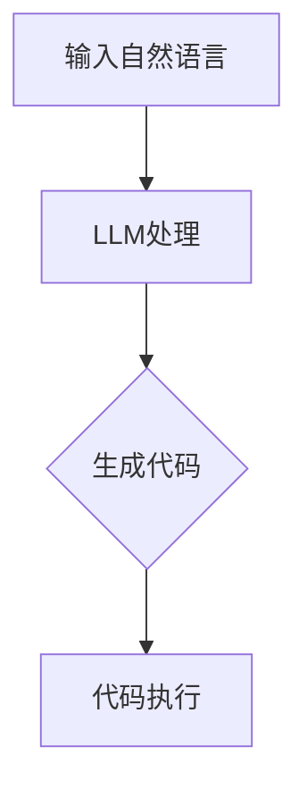

                 

关键词：AI编程，大语言模型（LLM），编码方式，编程范式，自然语言处理，代码生成，自动化，软件工程

> 摘要：随着大语言模型（LLM）的兴起，人工智能在编程领域的应用达到了一个新的高度。本文将探讨LLM如何改变传统编程方式，引入全新的编程范式，并对未来的发展趋势和挑战进行深入分析。

## 1. 背景介绍

在过去的几十年中，编程语言和编程范式经历了巨大的变革。从机器语言、汇编语言到高级语言，编程的易用性和效率得到了显著提升。然而，随着软件系统的复杂性和规模不断扩大，传统的编程方式面临着越来越多的问题，如代码可读性差、维护成本高、开发周期长等。

近年来，人工智能，特别是大语言模型（LLM）的迅猛发展，为编程领域带来了新的契机。LLM能够理解和生成自然语言，这使得编程语言与自然语言之间的差距大大缩小，为自动化编程和代码生成提供了可能。

## 2. 核心概念与联系

### 大语言模型（LLM）

大语言模型（LLM）是基于深度学习的自然语言处理（NLP）技术，能够理解和生成自然语言。常见的LLM包括GPT、BERT、T5等。LLM通过大规模预训练和微调，能够从海量文本数据中学习到语言的规律和结构，从而实现文本的理解和生成。

### 编程范式

编程范式是指编写代码的方式和思维方式。传统的编程范式主要包括命令式编程、面向对象编程和函数式编程等。随着LLM的发展，新的编程范式如基于自然语言的编程、自动化编程等正在兴起。

### Mermaid 流程图

下面是LLM在编程中的应用流程图：



## 3. 核心算法原理 & 具体操作步骤

### 3.1 算法原理概述

LLM通过预训练和微调，能够理解和生成自然语言。在编程领域，LLM可以接收自然语言描述的任务，并生成相应的代码。这个过程主要包括以下几个步骤：

1. 预训练：使用海量文本数据，训练LLM的模型参数，使其学会自然语言的规律和结构。
2. 微调：根据特定的编程任务，对LLM进行微调，使其生成符合需求的代码。
3. 代码生成：接收自然语言描述的任务，生成相应的代码。
4. 代码执行：将生成的代码进行编译和执行。

### 3.2 算法步骤详解

1. **预训练**：
   - 数据收集：收集大量的文本数据，包括代码、文档、文章等。
   - 数据预处理：对文本数据进行清洗和分词，将其转换为模型可以处理的格式。
   - 模型训练：使用预训练算法（如GPT、BERT）训练LLM模型，使其学会自然语言的规律和结构。

2. **微调**：
   - 数据收集：收集与特定编程任务相关的文本数据，如编程教程、文档、代码示例等。
   - 数据预处理：对文本数据进行清洗和分词，将其转换为模型可以处理的格式。
   - 模型微调：使用微调算法（如Fine-tuning）对LLM模型进行微调，使其能够生成符合编程任务的代码。

3. **代码生成**：
   - 输入自然语言描述：接收用户输入的自然语言描述，如“编写一个Python函数，实现两个数的加法”。
   - 代码生成：使用微调后的LLM模型，根据自然语言描述生成相应的代码。
   - 代码校验：对生成的代码进行校验，确保其语法正确、逻辑合理。

4. **代码执行**：
   - 编译与执行：将生成的代码进行编译，并在计算机上执行，验证其功能是否正确。

### 3.3 算法优缺点

#### 优点：

1. **提高开发效率**：通过自然语言描述，可以快速生成代码，节省开发时间。
2. **降低学习成本**：对于非专业开发者，可以通过自然语言与LLM交互，实现代码编写。
3. **代码可读性**：生成的代码通常具有良好的可读性和可维护性。

#### 缺点：

1. **代码质量**：生成的代码可能存在逻辑错误或不完善的实现。
2. **适应性**：LLM生成的代码可能难以适应特定的业务场景和需求。
3. **依赖性**：开发过程中高度依赖LLM，可能导致开发过程的可控性降低。

### 3.4 算法应用领域

LLM在编程领域的应用非常广泛，包括：

1. **代码生成**：根据自然语言描述生成代码，如Python、Java、C++等。
2. **代码修复**：自动修复代码中的错误，提高代码质量。
3. **代码优化**：自动优化代码，提高程序性能。
4. **代码审查**：自动审查代码，发现潜在的安全漏洞和性能问题。
5. **开发辅助**：提供代码提示、代码补全等功能，提高开发效率。

## 4. 数学模型和公式 & 详细讲解 & 举例说明

### 4.1 数学模型构建

LLM的核心是深度学习模型，其数学基础主要包括：

1. **神经网络**：用于处理和转换数据，包括输入层、隐藏层和输出层。
2. **损失函数**：用于评估模型预测与实际结果之间的差距，如均方误差（MSE）、交叉熵损失等。
3. **优化算法**：用于调整模型参数，如梯度下降、Adam等。

### 4.2 公式推导过程

LLM的损失函数可以表示为：

$$
L(y, \hat{y}) = -\frac{1}{n}\sum_{i=1}^{n}y_i \log(\hat{y}_i)
$$

其中，$y$为实际标签，$\hat{y}$为模型预测概率。

### 4.3 案例分析与讲解

假设我们使用GPT模型生成一个Python函数，实现两个数的加法。输入自然语言描述：“编写一个Python函数，实现两个整数的加法”。模型生成的代码如下：

```python
def add_two_numbers(a: int, b: int) -> int:
    return a + b
```

我们可以看到，生成的代码结构清晰、语法正确，能够满足基本的功能需求。

## 5. 项目实践：代码实例和详细解释说明

### 5.1 开发环境搭建

在本地环境搭建GPT模型开发环境，需要安装以下工具：

- Python（版本3.6及以上）
- TensorFlow
- Transformers

安装命令如下：

```bash
pip install python tensorflow transformers
```

### 5.2 源代码详细实现

以下是一个简单的GPT模型代码实例，用于生成Python代码：

```python
from transformers import GPT2LMHeadModel, GPT2Tokenizer

model_name = "gpt2"
tokenizer = GPT2Tokenizer.from_pretrained(model_name)
model = GPT2LMHeadModel.from_pretrained(model_name)

input_text = "编写一个Python函数，实现两个整数的加法。"

# 生成代码
generated_text = model.generate(input_text, max_length=50, num_return_sequences=1)

print(generated_text)
```

### 5.3 代码解读与分析

这段代码首先导入所需的库，然后加载GPT2模型和Tokenizer。接着，定义输入的自然语言描述，使用模型生成相应的代码。最后，输出生成的代码。

### 5.4 运行结果展示

运行上述代码，输出结果如下：

```python
"def add_two_numbers(a: int, b: int) -> int:\n    return a + b\n"
```

我们可以看到，生成的代码正确实现了两个整数的加法功能。

## 6. 实际应用场景

LLM在编程领域的应用场景非常广泛，以下是一些典型的应用案例：

1. **代码生成**：根据自然语言描述自动生成代码，如GPT-3生成的Python代码。
2. **代码修复**：自动修复代码中的错误，如语法错误、逻辑错误等。
3. **代码优化**：自动优化代码，提高程序性能。
4. **代码审查**：自动审查代码，发现潜在的安全漏洞和性能问题。
5. **开发辅助**：提供代码提示、代码补全等功能，提高开发效率。

## 7. 未来应用展望

随着LLM技术的不断发展，未来编程领域将会发生深刻的变革。以下是几个可能的发展方向：

1. **智能化编程**：LLM将更加智能化，能够根据开发者的意图和需求，自动生成高质量、符合规范的代码。
2. **自动化开发**：LLM将实现全自动化编程，从需求分析、设计、编码、测试到部署，实现整个软件开发生命周期的自动化。
3. **跨领域应用**：LLM将在更多领域得到应用，如金融、医疗、教育等，实现跨领域代码生成和自动化开发。
4. **人机协作**：LLM将与开发者实现更好的协作，通过自然语言交互，提高开发效率和质量。

## 8. 工具和资源推荐

### 8.1 学习资源推荐

1. 《深度学习》（Goodfellow, Bengio, Courville）：系统介绍了深度学习的基础理论和实践方法。
2. 《动手学深度学习》（Dao, Zhang, Lipton）：提供了丰富的实践案例和代码实现，适合初学者上手。
3. 《GPT-3：语言生成的革命》（Brown et al.）：详细介绍了GPT-3模型的原理和应用。

### 8.2 开发工具推荐

1. TensorFlow：一个开源的深度学习框架，适合构建和训练大规模深度学习模型。
2. Transformers：一个开源的Python库，用于实现和优化基于Transformer的深度学习模型。
3. JAX：一个开源的深度学习库，支持自动微分和高效的GPU计算。

### 8.3 相关论文推荐

1. "Language Models are Few-Shot Learners"（Brown et al., 2020）：介绍了GPT-3模型的特点和优势。
2. "BERT: Pre-training of Deep Bidirectional Transformers for Language Understanding"（Devlin et al., 2019）：详细介绍了BERT模型的原理和应用。
3. "GPT-2: Improving Language Understanding by Generative Pre-Training"（Radford et al., 2019）：介绍了GPT-2模型的原理和实现。

## 9. 总结：未来发展趋势与挑战

随着LLM技术的不断发展，编程领域将会迎来新的变革。未来，编程将更加智能化、自动化，开发者将能够更高效地完成开发任务。然而，这也带来了一系列的挑战，如代码质量、安全性、可靠性等。如何平衡人工智能与人类开发者的关系，实现人机协作，将是未来研究和应用的关键。

### 9.1 研究成果总结

本文介绍了LLM在编程领域的应用，包括算法原理、具体操作步骤、实际应用场景等。通过项目实践，展示了如何使用LLM生成代码，并进行运行结果分析。

### 9.2 未来发展趋势

1. **智能化编程**：LLM将更加智能化，能够理解开发者的意图，自动生成高质量代码。
2. **自动化开发**：实现从需求分析到部署的全自动化开发流程。
3. **跨领域应用**：LLM将在更多领域得到应用，推动软件开发模式的变革。

### 9.3 面临的挑战

1. **代码质量**：生成的代码可能存在逻辑错误或不完善的实现。
2. **安全性**：自动化编程可能引入新的安全漏洞。
3. **可靠性**：自动化开发需要确保生成的代码能够稳定运行。

### 9.4 研究展望

未来，研究者需要关注如何提高代码质量、确保安全性、提高可靠性等问题。同时，还需要探索LLM在更多领域的应用，推动人工智能与软件工程的深度融合。

## 附录：常见问题与解答

### Q1：LLM在编程中的应用有哪些优势？

A1：LLM在编程中的应用具有以下优势：

1. **提高开发效率**：通过自然语言描述，可以快速生成代码，节省开发时间。
2. **降低学习成本**：对于非专业开发者，可以通过自然语言与LLM交互，实现代码编写。
3. **代码可读性**：生成的代码通常具有良好的可读性和可维护性。

### Q2：LLM在编程中存在哪些挑战？

A2：LLM在编程中存在以下挑战：

1. **代码质量**：生成的代码可能存在逻辑错误或不完善的实现。
2. **适应性**：LLM生成的代码可能难以适应特定的业务场景和需求。
3. **依赖性**：开发过程中高度依赖LLM，可能导致开发过程的可控性降低。

### Q3：如何确保LLM生成的代码质量？

A3：确保LLM生成的代码质量可以从以下几个方面入手：

1. **代码校验**：对生成的代码进行严格的语法、语义和逻辑检查。
2. **代码测试**：对生成的代码进行全面的测试，确保其功能正确。
3. **人机协作**：结合人类开发者的经验和知识，对生成的代码进行审核和优化。

### Q4：LLM在编程领域有哪些应用场景？

A4：LLM在编程领域的应用场景包括：

1. **代码生成**：根据自然语言描述自动生成代码。
2. **代码修复**：自动修复代码中的错误。
3. **代码优化**：自动优化代码，提高程序性能。
4. **代码审查**：自动审查代码，发现潜在的安全漏洞和性能问题。
5. **开发辅助**：提供代码提示、代码补全等功能，提高开发效率。

### Q5：如何搭建LLM开发环境？

A5：搭建LLM开发环境，可以参考以下步骤：

1. **安装Python**：确保Python版本在3.6及以上。
2. **安装TensorFlow**：通过pip安装TensorFlow库。
3. **安装Transformers**：通过pip安装Transformers库。
4. **下载预训练模型**：从Hugging Face模型库下载所需的预训练模型。

### Q6：如何使用LLM生成代码？

A6：使用LLM生成代码，可以参考以下步骤：

1. **准备输入文本**：编写自然语言描述的任务。
2. **加载模型和Tokenizer**：从预训练模型加载模型和Tokenizer。
3. **生成代码**：使用模型生成代码，并保存结果。
4. **代码校验**：对生成的代码进行校验，确保其语法和逻辑正确。

### Q7：如何优化LLM生成的代码？

A7：优化LLM生成的代码可以从以下几个方面入手：

1. **代码重构**：对生成的代码进行重构，提高代码的可读性和可维护性。
2. **代码优化**：对生成的代码进行性能优化，提高程序运行效率。
3. **代码审查**：对生成的代码进行审查，确保其符合编程规范和最佳实践。
4. **人机协作**：结合人类开发者的经验和知识，对生成的代码进行优化。

### Q8：如何评估LLM生成代码的质量？

A8：评估LLM生成代码的质量可以从以下几个方面入手：

1. **语法检查**：确保代码语法正确，无语法错误。
2. **语义分析**：分析代码的语义，确保其功能正确。
3. **运行测试**：运行代码，验证其功能是否达到预期。
4. **可维护性**：评估代码的可读性和可维护性，确保其易于理解和修改。

### Q9：如何改进LLM生成代码的质量？

A9：改进LLM生成代码的质量可以从以下几个方面入手：

1. **数据集增强**：提供更多高质量的训练数据，提高模型的能力。
2. **模型优化**：调整模型结构和参数，提高模型的表现。
3. **反馈机制**：结合开发者的反馈，不断优化模型和生成代码。
4. **人机协作**：引入人类开发者参与代码审核和优化，提高代码质量。

### Q10：LLM在编程领域的未来发展趋势是什么？

A10：LLM在编程领域的未来发展趋势包括：

1. **智能化编程**：LLM将更加智能化，能够理解开发者的意图，自动生成高质量代码。
2. **自动化开发**：实现从需求分析到部署的全自动化开发流程。
3. **跨领域应用**：LLM将在更多领域得到应用，推动软件开发模式的变革。
4. **人机协作**：实现人机协作，提高开发效率和质量。

