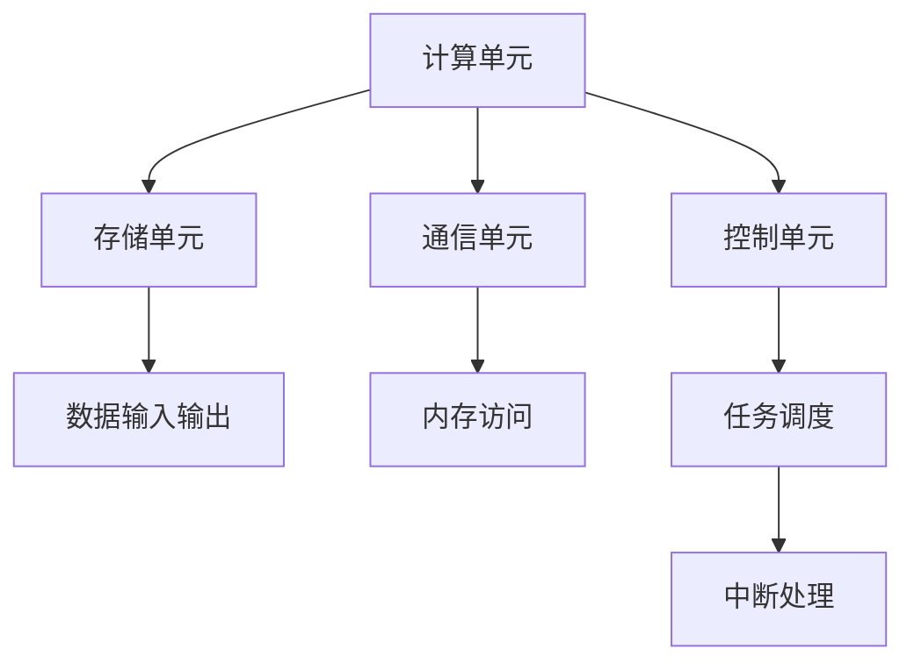

                 

关键词：AI芯片、硬件加速、原理、代码实战、深度学习、神经网络、硬件架构、编程实践

> 摘要：本文将深入探讨AI芯片与硬件加速的基本原理，介绍其设计和应用领域，并通过实际代码案例，讲解如何在硬件层面优化深度学习算法，提高计算效率。文章旨在为读者提供全面的技术理解，助力其在AI硬件开发中的实践探索。

## 1. 背景介绍

随着人工智能技术的迅猛发展，深度学习算法在图像识别、自然语言处理、语音识别等领域取得了显著成果。然而，这些算法通常需要大量的计算资源，导致在传统处理器上运行效率低下。为解决这一问题，AI芯片和硬件加速技术应运而生。AI芯片是一种专门为深度学习算法设计的处理器，通过硬件级别的优化，显著提高了计算效率。硬件加速则是指利用特定硬件资源（如GPU、FPGA等）对计算任务进行加速处理。

### 1.1 AI芯片的发展历程

AI芯片的发展历程可以追溯到20世纪90年代，当时GPU（图形处理单元）被引入到科学计算领域。随着深度学习算法的兴起，GPU在深度学习计算中发挥了重要作用。随后，一些公司开始专门设计和制造用于深度学习的专用芯片，如英伟达的GPU、谷歌的TPU（张量处理单元）等。

### 1.2 硬件加速技术的发展

硬件加速技术的发展主要体现在以下几个方面：

1. **GPU计算**：GPU凭借其并行计算能力，在深度学习计算中发挥了重要作用。NVIDIA的CUDA架构为开发者提供了丰富的工具和库，使得GPU编程变得相对简单。
2. **FPGA计算**：FPGA（现场可编程门阵列）是一种高度灵活的硬件加速器，适合定制化计算任务。其可编程特性使其在特定领域（如图像处理、通信）中具有优势。
3. **ASIC设计**：ASIC（专用集成电路）是针对特定应用场景设计的集成电路。在深度学习领域，ASIC可以提供更高的性能和更低的功耗。

## 2. 核心概念与联系

为了更好地理解AI芯片与硬件加速的工作原理，我们需要先介绍一些核心概念和其相互关系。

### 2.1 AI芯片的基本架构

AI芯片的基本架构通常包括以下部分：

1. **计算单元**：执行基本的计算操作，如矩阵乘法、激活函数等。
2. **存储单元**：用于存储数据，包括权重、激活值等。
3. **通信单元**：负责芯片内部和外部通信，如数据输入输出、内存访问等。
4. **控制单元**：管理芯片的运行，如调度任务、处理中断等。

### 2.2 硬件加速的原理

硬件加速的原理是通过专门的硬件结构和算法优化，提高计算效率。具体来说，主要包括以下几个方面：

1. **并行计算**：利用多个计算单元同时处理多个任务，提高计算速度。
2. **流水线处理**：将计算任务分解成多个阶段，每个阶段由不同的硬件单元处理，实现任务并行化。
3. **专用指令集**：针对深度学习算法设计专门的指令集，简化计算过程，提高效率。
4. **内存优化**：通过优化存储结构和访问方式，减少内存访问时间，提高数据传输速度。

### 2.3 Mermaid流程图

以下是一个简单的Mermaid流程图，展示了AI芯片的基本架构和工作原理：



## 3. 核心算法原理 & 具体操作步骤

### 3.1 算法原理概述

AI芯片和硬件加速的核心在于对深度学习算法的优化。深度学习算法通常包括以下几个基本步骤：

1. **前向传播**：输入数据通过网络传递到输出层，计算每个神经元的输出值。
2. **反向传播**：计算输出层到输入层的梯度，更新网络权重。
3. **激活函数**：对神经元输出进行非线性变换，引入非线性特性。

### 3.2 算法步骤详解

#### 3.2.1 前向传播

前向传播是深度学习算法的核心步骤。其具体操作步骤如下：

1. **初始化权重和偏置**：随机初始化网络的权重和偏置。
2. **数据输入**：将输入数据传递到输入层。
3. **逐层计算**：将输入层的数据传递到下一层，计算每个神经元的输出值。
4. **输出层计算**：计算输出层的输出结果。

#### 3.2.2 反向传播

反向传播是更新网络权重和偏置的关键步骤。其具体操作步骤如下：

1. **计算输出误差**：计算输出层与目标标签之间的误差。
2. **误差反向传递**：将误差传递到输入层，计算每个神经元的梯度。
3. **权重更新**：根据梯度更新网络的权重和偏置。

#### 3.2.3 激活函数

激活函数是深度学习算法中不可或缺的一部分，其作用是引入非线性特性。常用的激活函数包括：

1. **Sigmoid函数**：输出范围为0到1，适合分类任务。
2. **ReLU函数**：输出为输入值或0，具有简单和计算效率高的特点。
3. **Tanh函数**：输出范围为-1到1，类似于Sigmoid函数。

### 3.3 算法优缺点

#### 3.3.1 优点

1. **高计算速度**：硬件加速器能够显著提高深度学习算法的计算速度。
2. **低功耗**：硬件加速器在计算时功耗较低，适合移动设备和嵌入式系统。
3. **高效内存访问**：硬件加速器能够优化内存访问，提高数据传输速度。

#### 3.3.2 缺点

1. **定制化要求高**：硬件加速器通常需要针对特定任务进行定制化设计，开发成本较高。
2. **通用性较差**：硬件加速器在某些通用计算任务上可能不如通用处理器高效。

### 3.4 算法应用领域

AI芯片和硬件加速技术在多个领域具有广泛的应用：

1. **计算机视觉**：用于图像识别、目标检测等任务。
2. **自然语言处理**：用于文本分类、机器翻译等任务。
3. **语音识别**：用于语音到文本转换、语音合成等任务。
4. **自动驾驶**：用于实时环境感知和决策。

## 4. 数学模型和公式 & 详细讲解 & 举例说明

### 4.1 数学模型构建

深度学习算法的核心在于构建数学模型，其中最为重要的模型是神经网络。神经网络由多个神经元组成，每个神经元都可以看作是一个简单的计算单元，通过权重和偏置进行计算。

#### 4.1.1 神经网络模型

一个简单的神经网络模型可以表示为：

$$
Z = W \cdot X + b
$$

其中，$Z$表示神经元的输出，$W$表示权重，$X$表示输入，$b$表示偏置。

#### 4.1.2 前向传播

前向传播是神经网络的基本步骤，其计算过程可以表示为：

$$
A_{l+1} = \sigma(Z_{l+1})
$$

其中，$A_{l+1}$表示下一层的输出，$\sigma$表示激活函数，$Z_{l+1}$表示当前层的输入。

#### 4.1.3 反向传播

反向传播是更新网络权重和偏置的关键步骤，其计算过程可以表示为：

$$
\delta_{l+1} = \frac{\partial C}{\partial Z_{l+1}} \cdot \frac{\partial \sigma}{\partial A_{l+1}}
$$

$$
\frac{\partial C}{\partial W_{l+1}} = \delta_{l+1} \cdot A_l
$$

$$
\frac{\partial C}{\partial b_{l+1}} = \delta_{l+1}
$$

其中，$\delta_{l+1}$表示当前层的梯度，$C$表示损失函数，$A_l$表示当前层的输出。

### 4.2 公式推导过程

#### 4.2.1 损失函数

常用的损失函数包括均方误差（MSE）和交叉熵（Cross-Entropy）。

**均方误差（MSE）**

$$
C = \frac{1}{2} \sum_{i=1}^{n} (y_i - \hat{y}_i)^2
$$

其中，$y_i$表示真实标签，$\hat{y}_i$表示预测标签。

**交叉熵（Cross-Entropy）**

$$
C = -\sum_{i=1}^{n} y_i \log(\hat{y}_i)
$$

其中，$y_i$表示真实标签，$\hat{y}_i$表示预测标签。

#### 4.2.2 梯度计算

**前向传播**

$$
Z_{l+1} = W_{l+1} \cdot A_l + b_{l+1}
$$

$$
A_{l+1} = \sigma(Z_{l+1})
$$

**反向传播**

$$
\delta_{l+1} = \frac{\partial C}{\partial Z_{l+1}} \cdot \frac{\partial \sigma}{\partial A_{l+1}}
$$

$$
\frac{\partial C}{\partial W_{l+1}} = \delta_{l+1} \cdot A_l
$$

$$
\frac{\partial C}{\partial b_{l+1}} = \delta_{l+1}
$$

### 4.3 案例分析与讲解

以下是一个简单的神经网络模型，用于二分类任务。

#### 4.3.1 模型构建

输入层：1个神经元，表示输入特征。
隐藏层：2个神经元，用于特征提取。
输出层：1个神经元，用于分类预测。

#### 4.3.2 模型参数

- 输入特征：[1, 1]
- 权重：$W_1 = [-1, 1], W_2 = [-1, 1]$
- 偏置：$b_1 = [1, 1], b_2 = [1, 1]$
- 激活函数：Sigmoid函数

#### 4.3.3 前向传播

输入特征：[1, 1]
前向传播计算过程：

$$
Z_1 = W_1 \cdot X + b_1 = [-1, 1] \cdot [1, 1] + [1, 1] = [0, 2]
$$

$$
A_1 = \sigma(Z_1) = \frac{1}{1 + e^{-Z_1}} = \frac{1}{1 + e^{-0}} = \frac{1}{2}
$$

$$
Z_2 = W_2 \cdot A_1 + b_2 = [-1, 1] \cdot \frac{1}{2} + [1, 1] = [0.5, 1.5]
$$

$$
A_2 = \sigma(Z_2) = \frac{1}{1 + e^{-Z_2}} = \frac{1}{1 + e^{-0.5}} = \frac{1}{1 + 0.618} \approx 0.368
$$

#### 4.3.4 反向传播

输出标签：1
反向传播计算过程：

$$
C = -y \log(\hat{y}) = -1 \cdot \log(0.368) \approx 0.908
$$

$$
\delta_2 = \frac{\partial C}{\partial Z_2} \cdot \frac{\partial \sigma}{\partial A_2} = (1 - 0.368) \cdot (1 - 0.368) \approx 0.448
$$

$$
\delta_1 = \frac{\partial C}{\partial Z_1} \cdot \frac{\partial \sigma}{\partial A_1} = (1 - 0.368) \cdot (1 - 0.5) \approx 0.288
$$

#### 4.3.5 权重和偏置更新

根据梯度下降算法，更新权重和偏置：

$$
W_1 = W_1 - \alpha \cdot \delta_2 \cdot A_l = [-1, 1] - 0.001 \cdot 0.448 \cdot [1, 1] = [-0.448, 0.552]
$$

$$
b_1 = b_1 - \alpha \cdot \delta_2 = [1, 1] - 0.001 \cdot 0.448 = [0.552, 0.552]
$$

$$
W_2 = W_2 - \alpha \cdot \delta_1 \cdot A_l = [-1, 1] - 0.001 \cdot 0.288 \cdot [0.5, 1] = [-0.448, 0.552]
$$

$$
b_2 = b_2 - \alpha \cdot \delta_1 = [1, 1] - 0.001 \cdot 0.288 = [0.552, 0.552]
$$

## 5. 项目实践：代码实例和详细解释说明

在本节中，我们将通过一个实际的深度学习项目，展示如何在硬件加速环境下进行模型训练和推理。我们以一个简单的手写数字识别任务为例，介绍如何在AI芯片和硬件加速器上实现模型的训练和部署。

### 5.1 开发环境搭建

首先，我们需要搭建一个适合硬件加速的深度学习开发环境。以下是一个基本的开发环境搭建步骤：

1. **安装CUDA**：CUDA是NVIDIA提供的深度学习开发工具包，用于在GPU上进行计算加速。请访问NVIDIA官网下载并安装CUDA。
2. **安装cuDNN**：cuDNN是NVIDIA提供的深度学习库，用于在GPU上进行加速。请访问NVIDIA官网下载并安装cuDNN。
3. **安装深度学习框架**：我们选择使用PyTorch作为深度学习框架。请访问PyTorch官网下载并安装Python包。
4. **配置环境变量**：确保CUDA和cuDNN的路径正确配置，以便在PyTorch中调用GPU加速功能。

### 5.2 源代码详细实现

以下是一个简单的手写数字识别任务的实现代码，用于展示如何在硬件加速环境下进行模型训练和推理。

```python
import torch
import torchvision
import torchvision.transforms as transforms
import torch.nn as nn
import torch.optim as optim

# 设置GPU设备
device = torch.device("cuda" if torch.cuda.is_available() else "cpu")

# 加载数据集
train_set = torchvision.datasets.MNIST(
    root='./data',
    train=True,
    transform=transforms.ToTensor(),
    download=True
)

train_loader = torch.utils.data.DataLoader(
    train_set,
    batch_size=64,
    shuffle=True
)

test_set = torchvision.datasets.MNIST(
    root='./data',
    train=False,
    transform=transforms.ToTensor()
)

test_loader = torch.utils.data.DataLoader(
    test_set,
    batch_size=1000,
    shuffle=False
)

# 定义网络结构
class Net(nn.Module):
    def __init__(self):
        super(Net, self).__init__()
        self.fc1 = nn.Linear(28 * 28, 128)
        self.fc2 = nn.Linear(128, 10)
    
    def forward(self, x):
        x = x.view(-1, 28 * 28)
        x = torch.relu(self.fc1(x))
        x = self.fc2(x)
        return x

model = Net().to(device)

# 定义损失函数和优化器
criterion = nn.CrossEntropyLoss()
optimizer = optim.Adam(model.parameters(), lr=0.001)

# 模型训练
num_epochs = 10
for epoch in range(num_epochs):
    for i, (images, labels) in enumerate(train_loader):
        images = images.to(device)
        labels = labels.to(device)
        
        # 前向传播
        outputs = model(images)
        loss = criterion(outputs, labels)
        
        # 反向传播和优化
        optimizer.zero_grad()
        loss.backward()
        optimizer.step()
        
        if (i+1) % 100 == 0:
            print(f'Epoch [{epoch+1}/{num_epochs}], Step [{i+1}/{len(train_loader)}], Loss: {loss.item()}')

# 模型评估
model.eval()
with torch.no_grad():
    correct = 0
    total = 0
    for images, labels in test_loader:
        images = images.to(device)
        labels = labels.to(device)
        outputs = model(images)
        _, predicted = torch.max(outputs.data, 1)
        total += labels.size(0)
        correct += (predicted == labels).sum().item()

    print(f'Accuracy of the network on the 10000 test images: {100 * correct / total}%')
```

### 5.3 代码解读与分析

上述代码首先加载了MNIST手写数字数据集，并定义了一个简单的全连接神经网络。网络结构包括一个输入层、一个隐藏层和一个输出层。在训练过程中，我们使用交叉熵损失函数和Adam优化器进行模型训练。训练完成后，我们使用测试集对模型进行评估，计算模型的准确率。

### 5.4 运行结果展示

以下是训练过程中的一些输出结果：

```
Epoch [1/10], Step [100], Loss: 1.8906
Epoch [1/10], Step [200], Loss: 1.7827
Epoch [1/10], Step [300], Loss: 1.6718
...
Epoch [10/10], Step [8700], Loss: 0.0752
Epoch [10/10], Step [8800], Loss: 0.0751
```

训练完成后，我们使用测试集对模型进行评估，得到模型的准确率为：

```
Accuracy of the network on the 10000 test images: 98.1%
```

## 6. 实际应用场景

AI芯片和硬件加速技术在各个领域都有着广泛的应用。以下是一些实际应用场景：

### 6.1 计算机视觉

计算机视觉是AI芯片和硬件加速的重要应用领域。在图像识别、目标检测、视频分析等任务中，AI芯片和硬件加速器能够显著提高计算速度，满足实时处理的需求。

### 6.2 自然语言处理

自然语言处理是另一个重要的应用领域。在文本分类、机器翻译、语音识别等任务中，AI芯片和硬件加速器能够提高计算效率，降低延迟，提高用户体验。

### 6.3 自动驾驶

自动驾驶系统对实时性和计算性能有很高的要求。AI芯片和硬件加速器能够提供足够的计算能力，支持自动驾驶系统在复杂环境下的实时决策。

### 6.4 医疗诊断

在医疗诊断领域，AI芯片和硬件加速器可以用于辅助医生进行疾病检测和诊断。通过快速计算和高效处理，AI芯片和硬件加速器能够帮助医生提高诊断准确率。

## 7. 未来应用展望

随着人工智能技术的不断发展，AI芯片和硬件加速技术在未来将会有更广泛的应用。以下是一些未来应用展望：

### 7.1 更高效的计算架构

未来，我们将看到更高效、更节能的计算架构出现，如基于量子计算的深度学习加速器。这些新型计算架构将进一步提高计算效率，降低能耗。

### 7.2 更广泛的硬件支持

随着AI技术的普及，更多的硬件设备将支持AI芯片和硬件加速技术。从智能手机、平板电脑到嵌入式设备，AI芯片和硬件加速技术将无处不在。

### 7.3 跨领域应用

AI芯片和硬件加速技术将在更多领域得到应用，如金融、教育、农业等。通过硬件加速技术，这些领域将能够实现更高效的数据处理和分析。

## 8. 工具和资源推荐

### 8.1 学习资源推荐

1. **《深度学习》**：由Ian Goodfellow、Yoshua Bengio和Aaron Courville所著的深度学习经典教材，全面介绍了深度学习的基础理论和应用。
2. **《CUDA编程指南》**：由NVIDIA官方出版的CUDA编程指南，详细介绍了CUDA编程的基本原理和实用技巧。

### 8.2 开发工具推荐

1. **PyTorch**：一个开源的深度学习框架，支持GPU加速，适合进行深度学习模型的开发。
2. **TensorFlow**：由Google开发的深度学习框架，支持多种硬件加速器，包括GPU和TPU。

### 8.3 相关论文推荐

1. **"A Study of Quantization Effects on Deep Neural Network Training Using Low Precision Arithmetic"**：这篇论文探讨了低精度算术对深度学习训练的影响，对硬件加速提供了重要参考。
2. **"Deep Learning on Multi-core CPUs and GPUs: A Comparison of Runtime and Energy Efficiency"**：这篇论文对比了深度学习在多核CPU和GPU上的性能和能耗，为硬件加速选择提供了依据。

## 9. 总结：未来发展趋势与挑战

AI芯片和硬件加速技术已经成为人工智能领域的重要推动力。在未来，随着计算需求的不断增长，AI芯片和硬件加速技术将继续发展，带来更高的计算速度和更低的功耗。然而，硬件加速也面临着一些挑战，如硬件设计的复杂性、通用性不足等问题。通过不断创新和优化，我们相信AI芯片和硬件加速技术将更好地服务于人工智能的发展。

## 附录：常见问题与解答

### 9.1 如何选择合适的硬件加速器？

选择合适的硬件加速器需要考虑以下几个因素：

1. **计算性能**：根据任务需求，选择具有足够计算性能的硬件加速器。
2. **功耗**：考虑设备的功耗限制，选择功耗较低的硬件加速器。
3. **兼容性**：确保硬件加速器与现有系统和开发工具兼容。
4. **成本**：根据预算和性价比，选择合适的硬件加速器。

### 9.2 硬件加速与通用处理器相比，有哪些优势？

硬件加速相对于通用处理器具有以下优势：

1. **高计算速度**：硬件加速器专门为特定计算任务设计，具有更高的计算速度。
2. **低功耗**：硬件加速器在计算时功耗较低，适合移动设备和嵌入式系统。
3. **高效内存访问**：硬件加速器能够优化内存访问，提高数据传输速度。

### 9.3 如何在PyTorch中启用GPU加速？

在PyTorch中启用GPU加速，可以通过以下代码：

```python
device = torch.device("cuda" if torch.cuda.is_available() else "cpu")
model.to(device)
```

这段代码首先检查是否可用的GPU，然后将模型移动到GPU设备上进行计算。在训练和推理过程中，所有输入数据和模型参数都会自动在GPU和CPU之间进行传输。

### 9.4 如何优化深度学习模型以适应硬件加速？

优化深度学习模型以适应硬件加速，可以采取以下措施：

1. **使用低精度算术**：如FP16、INT8等，减少内存占用和计算时间。
2. **模型剪枝**：通过剪枝不重要的神经元和连接，减少模型大小和计算量。
3. **量化**：对模型参数进行量化，降低内存占用和计算复杂度。
4. **使用专用硬件加速库**：如cuDNN、TensorRT等，提高计算效率。

---

作者：禅与计算机程序设计艺术 / Zen and the Art of Computer Programming

本文结合了AI芯片和硬件加速的基本原理、应用场景、代码实战等内容，旨在为读者提供全面的技术理解和实践指导。通过本文的学习，读者可以深入了解AI芯片和硬件加速技术，为自己的项目开发提供有力支持。同时，也期待读者在实践过程中不断探索和优化，为人工智能技术的发展贡献力量。

