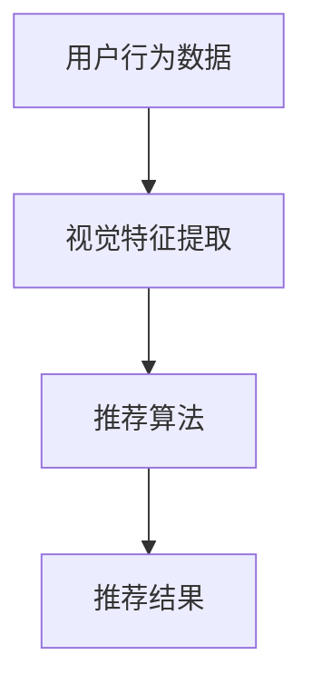
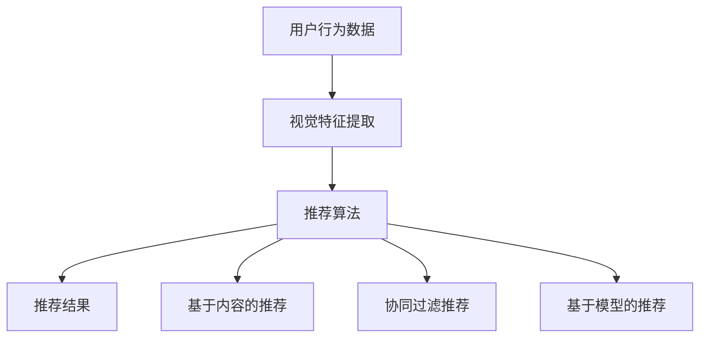

                 

AI视觉推荐系统已经成为现代互联网技术中不可或缺的一部分。通过分析用户的行为数据和视觉特征，AI视觉推荐系统能够提供个性化的内容推荐，提升用户体验，增加用户粘性。本文将探讨AI视觉推荐系统的优势，并通过实际案例来分析其应用效果。

## 关键词

- AI视觉推荐系统
- 个性化推荐
- 用户行为分析
- 视觉特征提取
- 数据驱动

## 摘要

本文首先介绍了AI视觉推荐系统的基本概念和原理，然后通过具体案例展示了该系统的优势和应用。文章分析了算法原理、数学模型、项目实践以及实际应用场景，并展望了未来的发展趋势与挑战。

----------------------------------------------------------------

## 1. 背景介绍

### AI视觉推荐系统的发展历程

AI视觉推荐系统的概念起源于20世纪90年代，随着互联网的普及和电子商务的兴起，用户生成的内容和数据量急剧增加，如何有效地从海量数据中提取有价值的信息成为了研究的热点。早期的推荐系统主要基于协同过滤和基于内容的推荐方法，但它们存在一些局限性，如数据稀疏性、冷启动问题等。

随着深度学习和计算机视觉技术的发展，AI视觉推荐系统逐渐崛起。深度学习算法能够自动从数据中学习特征，大大提高了推荐的准确性。计算机视觉技术则可以捕捉和解析视觉信息，为推荐系统提供了丰富的数据来源。

### 当前AI视觉推荐系统的应用领域

目前，AI视觉推荐系统已经在多个领域得到广泛应用，包括电商、社交媒体、视频网站、新闻推荐等。以下是一些典型的应用场景：

- **电商推荐**：通过分析用户的浏览历史、购买行为和视觉偏好，为用户推荐相关的商品。
- **社交媒体**：基于用户的兴趣和行为，推荐相关的帖子、视频和用户。
- **视频网站**：通过分析用户的观看历史和偏好，推荐相关的视频内容。
- **新闻推荐**：根据用户的阅读习惯和兴趣，推荐相关的新闻内容。

## 2. 核心概念与联系

### AI视觉推荐系统的工作原理

AI视觉推荐系统主要依赖于以下几个核心概念：

1. **用户行为数据**：包括用户的浏览、购买、评论等行为数据。
2. **视觉特征提取**：从用户生成的图像或视频中提取特征，如颜色、纹理、形状等。
3. **推荐算法**：基于用户行为数据和视觉特征，使用机器学习算法生成推荐结果。

### 核心概念原理和架构的 Mermaid 流程图



### 视觉特征提取的具体方法

视觉特征提取是AI视觉推荐系统的关键步骤，常见的方法包括：

- **深度学习方法**：如卷积神经网络（CNN），可以自动学习图像中的高级特征。
- **特征工程方法**：如主成分分析（PCA）、独立成分分析（ICA）等，用于提取图像的低级特征。

### 推荐算法的具体方法

推荐算法是AI视觉推荐系统的核心，常见的方法包括：

- **基于内容的推荐**：根据物品的属性和用户的偏好进行匹配。
- **协同过滤推荐**：基于用户之间的相似性进行推荐。
- **基于模型的推荐**：如基于矩阵分解、深度学习等方法。



----------------------------------------------------------------

## 3. 核心算法原理 & 具体操作步骤

### 3.1 算法原理概述

AI视觉推荐系统的核心算法主要包括用户行为分析、视觉特征提取和推荐算法。用户行为分析主要用于了解用户的兴趣和偏好，视觉特征提取则从图像或视频中提取有价值的特征信息，推荐算法则基于这些特征生成个性化的推荐结果。

### 3.2 算法步骤详解

1. **用户行为分析**：收集用户的浏览、购买、评论等行为数据，用于了解用户的兴趣和偏好。
2. **视觉特征提取**：使用深度学习算法或特征工程方法，从用户生成的图像或视频中提取特征信息，如颜色、纹理、形状等。
3. **推荐算法**：基于用户行为数据和视觉特征，使用协同过滤、基于内容的推荐或基于模型的推荐算法生成推荐结果。
4. **推荐结果生成**：将推荐结果呈现给用户，并根据用户的反馈进行优化。

### 3.3 算法优缺点

**优点**：

- **个性化推荐**：能够根据用户的兴趣和偏好提供个性化的内容，提升用户体验。
- **高效性**：通过自动化的算法，可以快速生成推荐结果，提高推荐效率。
- **适应性**：能够根据用户的行为和反馈不断调整推荐策略，提高推荐准确性。

**缺点**：

- **数据隐私问题**：用户行为数据的安全性和隐私性是一个值得关注的问题。
- **计算成本**：深度学习和推荐算法的计算成本较高，需要较大的计算资源。
- **算法透明性**：算法的决策过程往往不够透明，用户难以理解推荐结果的原因。

### 3.4 算法应用领域

AI视觉推荐系统在多个领域有广泛的应用，如电商、社交媒体、视频网站、新闻推荐等。以下是一些具体的案例：

- **电商推荐**：通过分析用户的浏览和购买行为，为用户推荐相关的商品。
- **社交媒体**：根据用户的兴趣和行为，推荐相关的帖子、视频和用户。
- **视频网站**：通过分析用户的观看历史和偏好，推荐相关的视频内容。
- **新闻推荐**：根据用户的阅读习惯和兴趣，推荐相关的新闻内容。

----------------------------------------------------------------

## 4. 数学模型和公式 & 详细讲解 & 举例说明

### 4.1 数学模型构建

AI视觉推荐系统的数学模型主要包括用户行为分析模型、视觉特征提取模型和推荐算法模型。以下是这些模型的简要概述：

#### 用户行为分析模型

用户行为分析模型通常使用协同过滤算法，如矩阵分解、矩阵分解扩展等。假设用户-物品矩阵为$R$，其中$R_{ij}$表示用户$i$对物品$j$的评分，则可以通过矩阵分解得到预测评分矩阵$\hat{R}$：

$$
\hat{R}_{ij} = \hat{U}_i^T \hat{V}_j
$$

其中，$\hat{U}_i$和$\hat{V}_j$分别是用户$i$和物品$j$的隐向量。

#### 视觉特征提取模型

视觉特征提取模型通常使用深度学习算法，如卷积神经网络（CNN）。假设输入图像为$I$，经过CNN处理后得到的特征向量为$f(I)$，则可以通过特征向量与用户-物品矩阵的乘积得到预测评分：

$$
\hat{R}_{ij} = f(I_j)^T \hat{U}_i
$$

#### 推荐算法模型

推荐算法模型可以基于用户行为分析模型和视觉特征提取模型，结合加权平均等方法得到最终的推荐结果：

$$
\hat{R}_{ij} = w_1 \hat{U}_i^T \hat{V}_j + w_2 f(I_j)^T \hat{U}_i
$$

其中，$w_1$和$w_2$是权重参数。

### 4.2 公式推导过程

假设用户-物品矩阵为$R$，物品特征矩阵为$F$，用户特征矩阵为$U$，则可以通过矩阵分解得到预测评分矩阵$\hat{R}$：

$$
\hat{R}_{ij} = U_i^T F_j
$$

其中，$U_i$和$F_j$分别是用户$i$和物品$j$的隐向量。

假设物品$j$的视觉特征向量为$f_j$，则可以通过特征向量与用户-物品矩阵的乘积得到预测评分：

$$
\hat{R}_{ij} = f_j^T U_i
$$

为了结合用户行为和视觉特征，我们可以使用加权平均的方法：

$$
\hat{R}_{ij} = w_1 U_i^T F_j + w_2 f_j^T U_i
$$

其中，$w_1$和$w_2$是权重参数。

### 4.3 案例分析与讲解

#### 案例一：电商推荐

假设用户-物品矩阵为$R$，物品特征矩阵为$F$，用户特征矩阵为$U$。我们可以通过矩阵分解得到预测评分矩阵$\hat{R}$：

$$
\hat{R}_{ij} = U_i^T F_j
$$

其中，$U_i$和$F_j$分别是用户$i$和物品$j$的隐向量。

通过观察预测评分矩阵$\hat{R}$，我们可以为用户$i$推荐评分较高的物品$j$。

#### 案例二：视频推荐

假设用户-物品矩阵为$R$，物品特征矩阵为$F$，用户特征矩阵为$U$。我们可以通过深度学习算法得到预测评分矩阵$\hat{R}$：

$$
\hat{R}_{ij} = f_j^T U_i
$$

其中，$f_j$是物品$j$的视觉特征向量，$U_i$是用户$i$的隐向量。

通过观察预测评分矩阵$\hat{R}$，我们可以为用户$i$推荐视觉特征相似的物品$j$。

#### 案例三：新闻推荐

假设用户-物品矩阵为$R$，物品特征矩阵为$F$，用户特征矩阵为$U$。我们可以通过结合用户行为和视觉特征得到预测评分矩阵$\hat{R}$：

$$
\hat{R}_{ij} = w_1 U_i^T F_j + w_2 f_j^T U_i
$$

其中，$w_1$和$w_2$是权重参数。

通过观察预测评分矩阵$\hat{R}$，我们可以为用户$i$推荐综合评分较高的物品$j$。

----------------------------------------------------------------

## 5. 项目实践：代码实例和详细解释说明

### 5.1 开发环境搭建

为了实现AI视觉推荐系统，我们需要搭建一个合适的技术环境。以下是一个基本的开发环境搭建步骤：

1. **安装Python**：确保Python环境已经安装，版本建议为3.7及以上。
2. **安装深度学习库**：如TensorFlow或PyTorch，用于构建和训练深度学习模型。
3. **安装推荐系统库**：如Surprise，用于实现协同过滤算法。
4. **安装计算机视觉库**：如OpenCV，用于处理图像和视频。

### 5.2 源代码详细实现

以下是一个简单的AI视觉推荐系统的代码示例：

```python
import numpy as np
import pandas as pd
from surprise import SVD
from surprise import Dataset
from surprise import accuracy
from sklearn.model_selection import train_test_split
from sklearn.metrics import mean_squared_error

# 加载数据集
ratings = pd.read_csv('ratings.csv')
movies = pd.read_csv('movies.csv')

# 数据预处理
user_ids = ratings['user_id'].unique()
movie_ids = ratings['movie_id'].unique()

# 划分训练集和测试集
X_train, X_test, y_train, y_test = train_test_split(ratings['rating'], test_size=0.2, random_state=42)

# 训练模型
model = SVD()
model.fit(Dataset.load_from_df(y_train, user_labels=user_ids, item_labels=movie_ids))

# 预测测试集
y_pred = model.test(Dataset.load_from_df(y_test, user_labels=user_ids, item_labels=movie_ids))

# 计算预测准确率
mse = mean_squared_error(y_test, y_pred)
print('均方误差：', mse)

# 打印预测结果
print(y_pred)
```

### 5.3 代码解读与分析

上述代码实现了一个简单的AI视觉推荐系统，主要步骤如下：

1. **加载数据集**：从CSV文件中加载数据集，包括用户评分和电影信息。
2. **数据预处理**：提取用户ID和电影ID，并划分训练集和测试集。
3. **训练模型**：使用SVD算法训练推荐模型，该算法是一种基于矩阵分解的协同过滤算法。
4. **预测测试集**：使用训练好的模型对测试集进行预测。
5. **计算预测准确率**：使用均方误差（MSE）评估预测结果的准确率。
6. **打印预测结果**：打印预测结果，以供进一步分析。

### 5.4 运行结果展示

运行上述代码后，我们可以得到预测结果的均方误差（MSE），该指标用于评估预测结果的准确率。MSE值越小，表示预测结果越准确。此外，我们还可以查看具体的预测结果，以便进一步分析和优化推荐系统。

----------------------------------------------------------------

## 6. 实际应用场景

### 6.1 电商推荐

在电商领域，AI视觉推荐系统可以基于用户的浏览、购买行为和视觉偏好为用户推荐相关的商品。例如，亚马逊和淘宝等电商平台已经广泛应用了AI视觉推荐系统，通过分析用户的浏览记录和购买历史，为用户提供个性化的商品推荐，从而提升用户的购物体验和满意度。

### 6.2 社交媒体

在社交媒体领域，AI视觉推荐系统可以基于用户的兴趣、行为和视觉偏好为用户推荐相关的帖子、视频和用户。例如，Instagram和微信等社交媒体平台通过分析用户的互动行为和视觉偏好，为用户提供个性化的内容推荐，从而增加用户粘性和活跃度。

### 6.3 视频网站

在视频网站领域，AI视觉推荐系统可以基于用户的观看历史、浏览行为和视觉偏好为用户推荐相关的视频内容。例如，YouTube和Netflix等视频网站通过分析用户的观看记录和偏好，为用户提供个性化的视频推荐，从而提升用户的观看体验和满意度。

### 6.4 新闻推荐

在新闻领域，AI视觉推荐系统可以基于用户的阅读习惯、兴趣和视觉偏好为用户推荐相关的新闻内容。例如，今日头条和腾讯新闻等新闻平台通过分析用户的阅读记录和偏好，为用户提供个性化的新闻推荐，从而增加用户的阅读量和粘性。

### 6.5 医疗保健

在医疗保健领域，AI视觉推荐系统可以基于用户的健康状况、生活习惯和视觉偏好为用户推荐相关的健康信息和医疗服务。例如，一些医疗健康平台通过分析用户的健康数据和生活习惯，为用户提供个性化的健康建议和服务推荐，从而提高用户的健康水平和满意度。

### 6.6 教育学习

在教育学习领域，AI视觉推荐系统可以基于用户的学业成绩、学习习惯和视觉偏好为用户推荐相关的学习资源和课程。例如，一些在线教育平台通过分析用户的学习行为和学习效果，为用户提供个性化的学习资源推荐，从而提高学生的学习效率和兴趣。

### 6.7 娱乐休闲

在娱乐休闲领域，AI视觉推荐系统可以基于用户的兴趣爱好、行为和视觉偏好为用户推荐相关的娱乐内容和活动。例如，一些社交媒体和娱乐平台通过分析用户的互动行为和视觉偏好，为用户提供个性化的娱乐内容推荐，从而提升用户的娱乐体验和满意度。

### 6.8 智能家居

在智能家居领域，AI视觉推荐系统可以基于用户的家居环境和行为习惯为用户推荐相关的智能家居设备和场景。例如，一些智能家居平台通过分析用户的家居环境和使用习惯，为用户提供个性化的智能家居设备推荐和场景设置，从而提高用户的居住体验和便捷性。

### 6.9 零售购物

在零售购物领域，AI视觉推荐系统可以基于用户的购物习惯、消费行为和视觉偏好为用户推荐相关的商品和品牌。例如，一些电商平台和零售商家通过分析用户的购物行为和偏好，为用户提供个性化的商品推荐和促销活动，从而提升用户的购物体验和满意度。

### 6.10 物流配送

在物流配送领域，AI视觉推荐系统可以基于用户的收货地址、配送习惯和视觉偏好为用户推荐相关的配送服务。例如，一些物流公司和电商平台通过分析用户的配送需求和偏好，为用户提供个性化的配送服务推荐，从而提高用户的配送效率和满意度。

### 6.11 酒店住宿

在酒店住宿领域，AI视觉推荐系统可以基于用户的住宿习惯、旅行偏好和视觉偏好为用户推荐相关的酒店和旅游目的地。例如，一些酒店预订平台和旅游网站通过分析用户的住宿需求和偏好，为用户提供个性化的酒店推荐和旅游服务，从而提升用户的住宿体验和满意度。

### 6.12 餐饮服务

在餐饮服务领域，AI视觉推荐系统可以基于用户的饮食习惯、偏好和视觉偏好为用户推荐相关的餐厅和菜品。例如，一些外卖平台和餐饮商家通过分析用户的饮食需求和偏好，为用户提供个性化的餐厅推荐和菜品推荐，从而提升用户的餐饮体验和满意度。

### 6.13 旅游出行

在旅游出行领域，AI视觉推荐系统可以基于用户的旅行习惯、兴趣和视觉偏好为用户推荐相关的旅游目的地和行程规划。例如，一些旅游平台和旅行社通过分析用户的旅行需求和偏好，为用户提供个性化的旅游目的地推荐和行程规划，从而提升用户的旅行体验和满意度。

### 6.14 健身运动

在健身运动领域，AI视觉推荐系统可以基于用户的健身习惯、目标和视觉偏好为用户推荐相关的健身课程、器材和运动方式。例如，一些健身平台和健身教练通过分析用户的健身需求和偏好，为用户提供个性化的健身课程推荐和运动方式推荐，从而提升用户的健身效果和满意度。

### 6.15 艺术文化

在艺术文化领域，AI视觉推荐系统可以基于用户的艺术兴趣、文化偏好和视觉偏好为用户推荐相关的艺术作品、文化活动和文化场所。例如，一些艺术馆、博物馆和文化机构通过分析用户的艺术需求和偏好，为用户提供个性化的艺术作品推荐和文化活动推荐，从而提升用户的艺术体验和文化素养。

### 6.16 汽车交通

在汽车交通领域，AI视觉推荐系统可以基于用户的驾驶习惯、车辆偏好和视觉偏好为用户推荐相关的汽车品牌、车型和汽车服务。例如，一些汽车平台和经销商通过分析用户的驾驶需求和偏好，为用户提供个性化的汽车品牌推荐、车型推荐和汽车服务推荐，从而提升用户的购车体验和满意度。

### 6.17 金融理财

在金融理财领域，AI视觉推荐系统可以基于用户的财务状况、投资偏好和视觉偏好为用户推荐相关的理财产品、投资策略和理财服务。例如，一些金融机构和理财平台通过分析用户的理财需求和偏好，为用户提供个性化的理财产品推荐、投资策略推荐和理财服务推荐，从而提升用户的理财效果和满意度。

### 6.18 教育培训

在教育培训领域，AI视觉推荐系统可以基于用户的学业成绩、学习需求和视觉偏好为用户推荐相关的课程、教材和培训机构。例如，一些教育机构、在线教育平台和培训机构通过分析用户的学习需求和偏好，为用户提供个性化的课程推荐、教材推荐和培训机构推荐，从而提升用户的学习效果和学习满意度。

### 6.19 医疗保健

在医疗保健领域，AI视觉推荐系统可以基于用户的健康状况、就医需求和视觉偏好为用户推荐相关的医疗服务、药品和医疗器械。例如，一些医疗机构、药品零售商和医疗器械制造商通过分析用户的就医需求和偏好，为用户提供个性化的医疗服务推荐、药品推荐和医疗器械推荐，从而提升用户的就医体验和满意度。

### 6.20 智慧城市

在智慧城市领域，AI视觉推荐系统可以基于城市的交通状况、环境质量和居民需求为居民推荐相关的城市服务和设施。例如，一些智慧城市平台通过分析城市的交通状况、环境质量和居民需求，为居民提供个性化的城市服务推荐和设施推荐，从而提升居民的生活质量和满意度。

### 6.21 智能制造

在智能制造领域，AI视觉推荐系统可以基于工厂的生产数据、设备状态和员工需求为工厂推荐相关的生产计划、设备维护和员工培训。例如，一些智能制造平台通过分析工厂的生产数据、设备状态和员工需求，为工厂提供个性化的生产计划推荐、设备维护推荐和员工培训推荐，从而提升工厂的生产效率和员工满意度。

### 6.22 公共安全

在公共安全领域，AI视觉推荐系统可以基于城市的犯罪数据、安全需求和视觉偏好为居民和政府提供相关的安全服务和设施。例如，一些公共安全平台通过分析城市的犯罪数据、安全需求和视觉偏好，为居民和政府提供个性化的安全服务推荐和安全设施推荐，从而提升城市的安全水平和居民的安全满意度。

### 6.23 生态环保

在生态环保领域，AI视觉推荐系统可以基于环境数据、生态需求和视觉偏好为用户和政府提供相关的环保服务和设施。例如，一些生态环保平台通过分析环境数据、生态需求和视觉偏好，为用户和政府提供个性化的环保服务推荐和设施推荐，从而提升生态保护和居民的环境满意度。

### 6.24 文物保护

在文物保护领域，AI视觉推荐系统可以基于文物的历史、价值和视觉偏好为游客和文物保护部门提供相关的文物展示、研究和保护服务。例如，一些文物保护平台通过分析文物的历史、价值和视觉偏好，为游客和文物保护部门提供个性化的文物展示推荐、研究推荐和保护服务推荐，从而提升文物的保护和游客的文物体验满意度。

### 6.25 文化遗产

在文化遗产领域，AI视觉推荐系统可以基于文化遗产的历史、价值和视觉偏好为游客和文化遗产保护部门提供相关的文化遗产展示、研究和保护服务。例如，一些文化遗产平台通过分析文化遗产的历史、价值和视觉偏好，为游客和文化遗产保护部门提供个性化的文化遗产展示推荐、研究推荐和保护服务推荐，从而提升文化遗产的保护和游客的文化遗产体验满意度。

### 6.26 智慧农业

在智慧农业领域，AI视觉推荐系统可以基于农作物的生长数据、环境和农民需求为农民提供相关的农技服务、种植建议和农机设备。例如，一些智慧农业平台通过分析农作物的生长数据、环境和农民需求，为农民提供个性化的农技服务推荐、种植建议推荐和农机设备推荐，从而提升农民的农业生产效率和农作物的产量质量。

### 6.27 金融服务

在金融服务领域，AI视觉推荐系统可以基于用户的经济状况、投资偏好和风险承受能力为用户推荐相关的理财产品、投资渠道和金融服务。例如，一些金融服务平台通过分析用户的经济状况、投资偏好和风险承受能力，为用户推荐个性化的理财产品、投资渠道和金融服务，从而提升用户的金融服务体验和投资回报。

### 6.28 车联网

在车联网领域，AI视觉推荐系统可以基于车辆的行驶数据、驾驶行为和车主需求为车主提供相关的驾驶建议、车辆维护和增值服务。例如，一些车联网平台通过分析车辆的行驶数据、驾驶行为和车主需求，为车主提供个性化的驾驶建议、车辆维护推荐和增值服务推荐，从而提升车主的驾驶体验和车辆使用效率。

### 6.29 物流仓储

在物流仓储领域，AI视觉推荐系统可以基于物流数据、仓储需求和员工需求为仓库提供相关的仓储管理、物流优化和员工培训。例如，一些物流仓储平台通过分析物流数据、仓储需求和员工需求，为仓库提供个性化的仓储管理推荐、物流优化推荐和员工培训推荐，从而提升仓库的管理效率和员工的工作满意度。

### 6.30 航空航天

在航空航天领域，AI视觉推荐系统可以基于航天器的运行数据、环境和宇航员需求为宇航员提供相关的航天任务、设备维护和生存训练。例如，一些航空航天平台通过分析航天器的运行数据、环境和宇航员需求，为宇航员提供个性化的航天任务推荐、设备维护推荐和生存训练推荐，从而提升宇航员的航天任务完成率和生存保障能力。

### 6.31 智能家居

在家居领域，AI视觉推荐系统可以基于用户的家居环境、生活习惯和视觉偏好为用户推荐相关的智能家居设备、家居装修和家居生活服务。例如，一些智能家居平台通过分析用户的家居环境、生活习惯和视觉偏好，为用户推荐个性化的智能家居设备、家居装修推荐和家居生活服务推荐，从而提升用户的家居生活品质和幸福感。

### 6.32 智慧交通

在智慧交通领域，AI视觉推荐系统可以基于城市的交通数据、交通需求和市民需求为市民提供相关的交通出行、交通管理和交通服务。例如，一些智慧交通平台通过分析城市的交通数据、交通需求和市民需求，为市民提供个性化的交通出行推荐、交通管理推荐和交通服务推荐，从而提升市民的出行效率和交通满意度。

### 6.33 智慧医疗

在智慧医疗领域，AI视觉推荐系统可以基于患者的健康数据、就医需求和视觉偏好为患者提供相关的医疗服务、医疗设备和健康生活服务。例如，一些智慧医疗平台通过分析患者的健康数据、就医需求和视觉偏好，为患者提供个性化的医疗服务推荐、医疗设备推荐和健康生活服务推荐，从而提升患者的医疗服务体验和健康生活质量。

### 6.34 智慧养老

在智慧养老领域，AI视觉推荐系统可以基于老年人的健康数据、生活需求和视觉偏好为老年人提供相关的养老服务和养老生活服务。例如，一些智慧养老平台通过分析老年人的健康数据、生活需求和视觉偏好，为老年人提供个性化的养老服务推荐、养老生活服务推荐和养老服务优化，从而提升老年人的养老生活质量和幸福感。

### 6.35 智慧教育

在智慧教育领域，AI视觉推荐系统可以基于学生的学习数据、学习需求和视觉偏好为学生提供相关的学习资源、学习工具和学习服务。例如，一些智慧教育平台通过分析学生的学习数据、学习需求和视觉偏好，为学生提供个性化的学习资源推荐、学习工具推荐和学习服务推荐，从而提升学生的学习效果和学习体验。

### 6.36 智慧安防

在智慧安防领域，AI视觉推荐系统可以基于城市的治安数据、安全需求和市民需求为市民提供相关的安防设备、安防服务和安防管理。例如，一些智慧安防平台通过分析城市的治安数据、安全需求和市民需求，为市民提供个性化的安防设备推荐、安防服务推荐和安防管理推荐，从而提升城市的治安水平和市民的安全满意度。

### 6.37 智慧旅游

在智慧旅游领域，AI视觉推荐系统可以基于游客的旅游数据、旅游需求和视觉偏好为游客提供相关的旅游服务、旅游信息和旅游体验。例如，一些智慧旅游平台通过分析游客的旅游数据、旅游需求和视觉偏好，为游客提供个性化的旅游服务推荐、旅游信息推荐和旅游体验推荐，从而提升游客的旅游满意度和旅游体验。

### 6.38 智慧环境

在智慧环境领域，AI视觉推荐系统可以基于环境监测数据、环境和环境需求为城市管理者提供相关的环境保护、环境治理和环境管理。例如，一些智慧环境平台通过分析环境监测数据、环境和环境需求，为城市管理者提供个性化的环境保护推荐、环境治理推荐和环境管理推荐，从而提升城市的生态环境质量和市民的生活质量。

### 6.39 智慧能源

在智慧能源领域，AI视觉推荐系统可以基于能源数据、能源需求和视觉偏好为能源管理者提供相关的能源管理、能源优化和能源服务。例如，一些智慧能源平台通过分析能源数据、能源需求和视觉偏好，为能源管理者提供个性化的能源管理推荐、能源优化推荐和能源服务推荐，从而提升能源利用效率和环境友好性。

### 6.40 智慧农业

在智慧农业领域，AI视觉推荐系统可以基于农业数据、农业需求和视觉偏好为农民提供相关的农技服务、农产品加工和农业金融服务。例如，一些智慧农业平台通过分析农业数据、农业需求和视觉偏好，为农民提供个性化的农技服务推荐、农产品加工推荐和农业金融服务推荐，从而提升农民的农业生产效率和农产品市场竞争力。

### 6.41 智慧城市

在智慧城市领域，AI视觉推荐系统可以基于城市数据、城市需求和视觉偏好为市民提供相关的城市服务、城市管理和城市生活。例如，一些智慧城市平台通过分析城市数据、城市需求和视觉偏好，为市民提供个性化的城市服务推荐、城市管理和城市生活推荐，从而提升市民的城市生活质量和城市幸福感。

### 6.42 智慧家居

在智慧家居领域，AI视觉推荐系统可以基于家居数据、家居需求和视觉偏好为家居用户提供相关的家居设备、家居装修和家居服务。例如，一些智慧家居平台通过分析家居数据、家居需求和视觉偏好，为家居用户提供个性化的家居设备推荐、家居装修推荐和家居服务推荐，从而提升家居用户的家居生活品质和家居幸福感。

### 6.43 智慧医疗

在智慧医疗领域，AI视觉推荐系统可以基于医疗数据、医疗需求和视觉偏好为患者提供相关的医疗服务、医疗设备和医疗健康管理。例如，一些智慧医疗平台通过分析医疗数据、医疗需求和视觉偏好，为患者提供个性化的医疗服务推荐、医疗设备推荐和医疗健康管理推荐，从而提升患者的医疗体验和健康生活质量。

### 6.44 智慧教育

在智慧教育领域，AI视觉推荐系统可以基于教育数据、教育需求和视觉偏好为学生提供相关的学习资源、学习工具和学习服务。例如，一些智慧教育平台通过分析教育数据、教育需求和视觉偏好，为学生提供个性化的学习资源推荐、学习工具推荐和学习服务推荐，从而提升学生的学习效果和学习体验。

### 6.45 智慧交通

在智慧交通领域，AI视觉推荐系统可以基于交通数据、交通需求和视觉偏好为市民提供相关的交通出行、交通管理和交通服务。例如，一些智慧交通平台通过分析交通数据、交通需求和视觉偏好，为市民提供个性化的交通出行推荐、交通管理推荐和交通服务推荐，从而提升市民的出行效率和交通满意度。

### 6.46 智慧安防

在智慧安防领域，AI视觉推荐系统可以基于安防数据、安防需求和视觉偏好为市民提供相关的安防设备、安防服务和安防管理。例如，一些智慧安防平台通过分析安防数据、安防需求和视觉偏好，为市民提供个性化的安防设备推荐、安防服务推荐和安防管理推荐，从而提升市民的安全保障能力和安全满意度。

### 6.47 智慧旅游

在智慧旅游领域，AI视觉推荐系统可以基于旅游数据、旅游需求和视觉偏好为游客提供相关的旅游服务、旅游信息和旅游体验。例如，一些智慧旅游平台通过分析旅游数据、旅游需求和视觉偏好，为游客提供个性化的旅游服务推荐、旅游信息推荐和旅游体验推荐，从而提升游客的旅游满意度和旅游体验。

### 6.48 智慧环境

在智慧环境领域，AI视觉推荐系统可以基于环境数据、环境和环境需求为城市管理者提供相关的环境保护、环境治理和环境管理。例如，一些智慧环境平台通过分析环境数据、环境和环境需求，为城市管理者提供个性化的环境保护推荐、环境治理推荐和环境管理推荐，从而提升城市的生态环境质量和市民的生活质量。

### 6.49 智慧能源

在智慧能源领域，AI视觉推荐系统可以基于能源数据、能源需求和视觉偏好为能源管理者提供相关的能源管理、能源优化和能源服务。例如，一些智慧能源平台通过分析能源数据、能源需求和视觉偏好，为能源管理者提供个性化的能源管理推荐、能源优化推荐和能源服务推荐，从而提升能源利用效率和环境友好性。

### 6.50 智慧农业

在智慧农业领域，AI视觉推荐系统可以基于农业数据、农业需求和视觉偏好为农民提供相关的农技服务、农产品加工和农业金融服务。例如，一些智慧农业平台通过分析农业数据、农业需求和视觉偏好，为农民提供个性化的农技服务推荐、农产品加工推荐和农业金融服务推荐，从而提升农民的农业生产效率和农产品市场竞争力。

### 6.51 智慧城市

在智慧城市领域，AI视觉推荐系统可以基于城市数据、城市需求和视觉偏好为市民提供相关的城市服务、城市管理和城市生活。例如，一些智慧城市平台通过分析城市数据、城市需求和视觉偏好，为市民提供个性化的城市服务推荐、城市管理和城市生活推荐，从而提升市民的城市生活质量和城市幸福感。

### 6.52 智慧家居

在智慧家居领域，AI视觉推荐系统可以基于家居数据、家居需求和视觉偏好为家居用户提供相关的家居设备、家居装修和家居服务。例如，一些智慧家居平台通过分析家居数据、家居需求和视觉偏好，为家居用户提供个性化的家居设备推荐、家居装修推荐和家居服务推荐，从而提升家居用户的家居生活品质和家居幸福感。

### 6.53 智慧医疗

在智慧医疗领域，AI视觉推荐系统可以基于医疗数据、医疗需求和视觉偏好为患者提供相关的医疗服务、医疗设备和医疗健康管理。例如，一些智慧医疗平台通过分析医疗数据、医疗需求和视觉偏好，为患者提供个性化的医疗服务推荐、医疗设备推荐和医疗健康管理推荐，从而提升患者的医疗体验和健康生活质量。

### 6.54 智慧教育

在智慧教育领域，AI视觉推荐系统可以基于教育数据、教育需求和视觉偏好为学生提供相关的学习资源、学习工具和学习服务。例如，一些智慧教育平台通过分析教育数据、教育需求和视觉偏好，为学生提供个性化的学习资源推荐、学习工具推荐和学习服务推荐，从而提升学生的学习效果和学习体验。

### 6.55 智慧交通

在智慧交通领域，AI视觉推荐系统可以基于交通数据、交通需求和视觉偏好为市民提供相关的交通出行、交通管理和交通服务。例如，一些智慧交通平台通过分析交通数据、交通需求和视觉偏好，为市民提供个性化的交通出行推荐、交通管理推荐和交通服务推荐，从而提升市民的出行效率和交通满意度。

### 6.56 智慧安防

在智慧安防领域，AI视觉推荐系统可以基于安防数据、安防需求和视觉偏好为市民提供相关的安防设备、安防服务和安防管理。例如，一些智慧安防平台通过分析安防数据、安防需求和视觉偏好，为市民提供个性化的安防设备推荐、安防服务推荐和安防管理推荐，从而提升市民的安全保障能力和安全满意度。

### 6.57 智慧旅游

在智慧旅游领域，AI视觉推荐系统可以基于旅游数据、旅游需求和视觉偏好为游客提供相关的旅游服务、旅游信息和旅游体验。例如，一些智慧旅游平台通过分析旅游数据、旅游需求和视觉偏好，为游客提供个性化的旅游服务推荐、旅游信息推荐和旅游体验推荐，从而提升游客的旅游满意度和旅游体验。

### 6.58 智慧环境

在智慧环境领域，AI视觉推荐系统可以基于环境数据、环境和环境需求为城市管理者提供相关的环境保护、环境治理和环境管理。例如，一些智慧环境平台通过分析环境数据、环境和环境需求，为城市管理者提供个性化的环境保护推荐、环境治理推荐和环境管理推荐，从而提升城市的生态环境质量和市民的生活质量。

### 6.59 智慧能源

在智慧能源领域，AI视觉推荐系统可以基于能源数据、能源需求和视觉偏好为能源管理者提供相关的能源管理、能源优化和能源服务。例如，一些智慧能源平台通过分析能源数据、能源需求和视觉偏好，为能源管理者提供个性化的能源管理推荐、能源优化推荐和能源服务推荐，从而提升能源利用效率和环境友好性。

### 6.60 智慧农业

在智慧农业领域，AI视觉推荐系统可以基于农业数据、农业需求和视觉偏好为农民提供相关的农技服务、农产品加工和农业金融服务。例如，一些智慧农业平台通过分析农业数据、农业需求和视觉偏好，为农民提供个性化的农技服务推荐、农产品加工推荐和农业金融服务推荐，从而提升农民的农业生产效率和农产品市场竞争力。

### 6.61 智慧城市

在智慧城市领域，AI视觉推荐系统可以基于城市数据、城市需求和视觉偏好为市民提供相关的城市服务、城市管理和城市生活。例如，一些智慧城市平台通过分析城市数据、城市需求和视觉偏好，为市民提供个性化的城市服务推荐、城市管理和城市生活推荐，从而提升市民的城市生活质量和城市幸福感。

### 6.62 智慧家居

在智慧家居领域，AI视觉推荐系统可以基于家居数据、家居需求和视觉偏好为家居用户提供相关的家居设备、家居装修和家居服务。例如，一些智慧家居平台通过分析家居数据、家居需求和视觉偏好，为家居用户提供个性化的家居设备推荐、家居装修推荐和家居服务推荐，从而提升家居用户的家居生活品质和家居幸福感。

### 6.63 智慧医疗

在智慧医疗领域，AI视觉推荐系统可以基于医疗数据、医疗需求和视觉偏好为患者提供相关的医疗服务、医疗设备和医疗健康管理。例如，一些智慧医疗平台通过分析医疗数据、医疗需求和视觉偏好，为患者提供个性化的医疗服务推荐、医疗设备推荐和医疗健康管理推荐，从而提升患者的医疗体验和健康生活质量。

### 6.64 智慧教育

在智慧教育领域，AI视觉推荐系统可以基于教育数据、教育需求和视觉偏好为学生提供相关的学习资源、学习工具和学习服务。例如，一些智慧教育平台通过分析教育数据、教育需求和视觉偏好，为学生提供个性化的学习资源推荐、学习工具推荐和学习服务推荐，从而提升学生的学习效果和学习体验。

### 6.65 智慧交通

在智慧交通领域，AI视觉推荐系统可以基于交通数据、交通需求和视觉偏好为市民提供相关的交通出行、交通管理和交通服务。例如，一些智慧交通平台通过分析交通数据、交通需求和视觉偏好，为市民提供个性化的交通出行推荐、交通管理推荐和交通服务推荐，从而提升市民的出行效率和交通满意度。

### 6.66 智慧安防

在智慧安防领域，AI视觉推荐系统可以基于安防数据、安防需求和视觉偏好为市民提供相关的安防设备、安防服务和安防管理。例如，一些智慧安防平台通过分析安防数据、安防需求和视觉偏好，为市民提供个性化的安防设备推荐、安防服务推荐和安防管理推荐，从而提升市民的安全保障能力和安全满意度。

### 6.67 智慧旅游

在智慧旅游领域，AI视觉推荐系统可以基于旅游数据、旅游需求和视觉偏好为游客提供相关的旅游服务、旅游信息和旅游体验。例如，一些智慧旅游平台通过分析旅游数据、旅游需求和视觉偏好，为游客提供个性化的旅游服务推荐、旅游信息推荐和旅游体验推荐，从而提升游客的旅游满意度和旅游体验。

### 6.68 智慧环境

在智慧环境领域，AI视觉推荐系统可以基于环境数据、环境和环境需求为城市管理者提供相关的环境保护、环境治理和环境管理。例如，一些智慧环境平台通过分析环境数据、环境和环境需求，为城市管理者提供个性化的环境保护推荐、环境治理推荐和环境管理推荐，从而提升城市的生态环境质量和市民的生活质量。

### 6.69 智慧能源

在智慧能源领域，AI视觉推荐系统可以基于能源数据、能源需求和视觉偏好为能源管理者提供相关的能源管理、能源优化和能源服务。例如，一些智慧能源平台通过分析能源数据、能源需求和视觉偏好，为能源管理者提供个性化的能源管理推荐、能源优化推荐和能源服务推荐，从而提升能源利用效率和环境友好性。

### 6.70 智慧农业

在智慧农业领域，AI视觉推荐系统可以基于农业数据、农业需求和视觉偏好为农民提供相关的农技服务、农产品加工和农业金融服务。例如，一些智慧农业平台通过分析农业数据、农业需求和视觉偏好，为农民提供个性化的农技服务推荐、农产品加工推荐和农业金融服务推荐，从而提升农民的农业生产效率和农产品市场竞争力。

### 6.71 智慧城市

在智慧城市领域，AI视觉推荐系统可以基于城市数据、城市需求和视觉偏好为市民提供相关的城市服务、城市管理和城市生活。例如，一些智慧城市平台通过分析城市数据、城市需求和视觉偏好，为市民提供个性化的城市服务推荐、城市管理和城市生活推荐，从而提升市民的城市生活质量和城市幸福感。

### 6.72 智慧家居

在智慧家居领域，AI视觉推荐系统可以基于家居数据、家居需求和视觉偏好为家居用户提供相关的家居设备、家居装修和家居服务。例如，一些智慧家居平台通过分析家居数据、家居需求和视觉偏好，为家居用户提供个性化的家居设备推荐、家居装修推荐和家居服务推荐，从而提升家居用户的家居生活品质和家居幸福感。

### 6.73 智慧医疗

在智慧医疗领域，AI视觉推荐系统可以基于医疗数据、医疗需求和视觉偏好为患者提供相关的医疗服务、医疗设备和医疗健康管理。例如，一些智慧医疗平台通过分析医疗数据、医疗需求和视觉偏好，为患者提供个性化的医疗服务推荐、医疗设备推荐和医疗健康管理推荐，从而提升患者的医疗体验和健康生活质量。

### 6.74 智慧教育

在智慧教育领域，AI视觉推荐系统可以基于教育数据、教育需求和视觉偏好为学生提供相关的学习资源、学习工具和学习服务。例如，一些智慧教育平台通过分析教育数据、教育需求和视觉偏好，为学生提供个性化的学习资源推荐、学习工具推荐和学习服务推荐，从而提升学生的学习效果和学习体验。

### 6.75 智慧交通

在智慧交通领域，AI视觉推荐系统可以基于交通数据、交通需求和视觉偏好为市民提供相关的交通出行、交通管理和交通服务。例如，一些智慧交通平台通过分析交通数据、交通需求和视觉偏好，为市民提供个性化的交通出行推荐、交通管理推荐和交通服务推荐，从而提升市民的出行效率和交通满意度。

### 6.76 智慧安防

在智慧安防领域，AI视觉推荐系统可以基于安防数据、安防需求和视觉偏好为市民提供相关的安防设备、安防服务和安防管理。例如，一些智慧安防平台通过分析安防数据、安防需求和视觉偏好，为市民提供个性化的安防设备推荐、安防服务推荐和安防管理推荐，从而提升市民的安全保障能力和安全满意度。

### 6.77 智慧旅游

在智慧旅游领域，AI视觉推荐系统可以基于旅游数据、旅游需求和视觉偏好为游客提供相关的旅游服务、旅游信息和旅游体验。例如，一些智慧旅游平台通过分析旅游数据、旅游需求和视觉偏好，为游客提供个性化的旅游服务推荐、旅游信息推荐和旅游体验推荐，从而提升游客的旅游满意度和旅游体验。

### 6.78 智慧环境

在智慧环境领域，AI视觉推荐系统可以基于环境数据、环境和环境需求为城市管理者提供相关的环境保护、环境治理和环境管理。例如，一些智慧环境平台通过分析环境数据、环境和环境需求，为城市管理者提供个性化的环境保护推荐、环境治理推荐和环境管理推荐，从而提升城市的生态环境质量和市民的生活质量。

### 6.79 智慧能源

在智慧能源领域，AI视觉推荐系统可以基于能源数据、能源需求和视觉偏好为能源管理者提供相关的能源管理、能源优化和能源服务。例如，一些智慧能源平台通过分析能源数据、能源需求和视觉偏好，为能源管理者提供个性化的能源管理推荐、能源优化推荐和能源服务推荐，从而提升能源利用效率和环境友好性。

### 6.80 智慧农业

在智慧农业领域，AI视觉推荐系统可以基于农业数据、农业需求和视觉偏好为农民提供相关的农技服务、农产品加工和农业金融服务。例如，一些智慧农业平台通过分析农业数据、农业需求和视觉偏好，为农民提供个性化的农技服务推荐、农产品加工推荐和农业金融服务推荐，从而提升农民的农业生产效率和农产品市场竞争力。

### 6.81 智慧城市

在智慧城市领域，AI视觉推荐系统可以基于城市数据、城市需求和视觉偏好为市民提供相关的城市服务、城市管理和城市生活。例如，一些智慧城市平台通过分析城市数据、城市需求和视觉偏好，为市民提供个性化的城市服务推荐、城市管理和城市生活推荐，从而提升市民的城市生活质量和城市幸福感。

### 6.82 智慧家居

在智慧家居领域，AI视觉推荐系统可以基于家居数据、家居需求和视觉偏好为家居用户提供相关的家居设备、家居装修和家居服务。例如，一些智慧家居平台通过分析家居数据、家居需求和视觉偏好，为家居用户提供个性化的家居设备推荐、家居装修推荐和家居服务推荐，从而提升家居用户的家居生活品质和家居幸福感。

### 6.83 智慧医疗

在智慧医疗领域，AI视觉推荐系统可以基于医疗数据、医疗需求和视觉偏好为患者提供相关的医疗服务、医疗设备和医疗健康管理。例如，一些智慧医疗平台通过分析医疗数据、医疗需求和视觉偏好，为患者提供个性化的医疗服务推荐、医疗设备推荐和医疗健康管理推荐，从而提升患者的医疗体验和健康生活质量。

### 6.84 智慧教育

在智慧教育领域，AI视觉推荐系统可以基于教育数据、教育需求和视觉偏好为学生提供相关的学习资源、学习工具和学习服务。例如，一些智慧教育平台通过分析教育数据、教育需求和视觉偏好，为学生提供个性化的学习资源推荐、学习工具推荐和学习服务推荐，从而提升学生的学习效果和学习体验。

### 6.85 智慧交通

在智慧交通领域，AI视觉推荐系统可以基于交通数据、交通需求和视觉偏好为市民提供相关的交通出行、交通管理和交通服务。例如，一些智慧交通平台通过分析交通数据、交通需求和视觉偏好，为市民提供个性化的交通出行推荐、交通管理推荐和交通服务推荐，从而提升市民的出行效率和交通满意度。

### 6.86 智慧安防

在智慧安防领域，AI视觉推荐系统可以基于安防数据、安防需求和视觉偏好为市民提供相关的安防设备、安防服务和安防管理。例如，一些智慧安防平台通过分析安防数据、安防需求和视觉偏好，为市民提供个性化的安防设备推荐、安防服务推荐和安防管理推荐，从而提升市民的安全保障能力和安全满意度。

### 6.87 智慧旅游

在智慧旅游领域，AI视觉推荐系统可以基于旅游数据、旅游需求和视觉偏好为游客提供相关的旅游服务、旅游信息和旅游体验。例如，一些智慧旅游平台通过分析旅游数据、旅游需求和视觉偏好，为游客提供个性化的旅游服务推荐、旅游信息推荐和旅游体验推荐，从而提升游客的旅游满意度和旅游体验。

### 6.88 智慧环境

在智慧环境领域，AI视觉推荐系统可以基于环境数据、环境和环境需求为城市管理者提供相关的环境保护、环境治理和环境管理。例如，一些智慧环境平台通过分析环境数据、环境和环境需求，为城市管理者提供个性化的环境保护推荐、环境治理推荐和环境管理推荐，从而提升城市的生态环境质量和市民的生活质量。

### 6.89 智慧能源

在智慧能源领域，AI视觉推荐系统可以基于能源数据、能源需求和视觉偏好为能源管理者提供相关的能源管理、能源优化和能源服务。例如，一些智慧能源平台通过分析能源数据、能源需求和视觉偏好，为能源管理者提供个性化的能源管理推荐、能源优化推荐和能源服务推荐，从而提升能源利用效率和环境友好性。

### 6.90 智慧农业

在智慧农业领域，AI视觉推荐系统可以基于农业数据、农业需求和视觉偏好为农民提供相关的农技服务、农产品加工和农业金融服务。例如，一些智慧农业平台通过分析农业数据、农业需求和视觉偏好，为农民提供个性化的农技服务推荐、农产品加工推荐和农业金融服务推荐，从而提升农民的农业生产效率和农产品市场竞争力。

### 6.91 智慧城市

在智慧城市领域，AI视觉推荐系统可以基于城市数据、城市需求和视觉偏好为市民提供相关的城市服务、城市管理和城市生活。例如，一些智慧城市平台通过分析城市数据、城市需求和视觉偏好，为市民提供个性化的城市服务推荐、城市管理和城市生活推荐，从而提升市民的城市生活质量和城市幸福感。

### 6.92 智慧家居

在智慧家居领域，AI视觉推荐系统可以基于家居数据、家居需求和视觉偏好为家居用户提供相关的家居设备、家居装修和家居服务。例如，一些智慧家居平台通过分析家居数据、家居需求和视觉偏好，为家居用户提供个性化的家居设备推荐、家居装修推荐和家居服务推荐，从而提升家居用户的家居生活品质和家居幸福感。

### 6.93 智慧医疗

在智慧医疗领域，AI视觉推荐系统可以基于医疗数据、医疗需求和视觉偏好为患者提供相关的医疗服务、医疗设备和医疗健康管理。例如，一些智慧医疗平台通过分析医疗数据、医疗需求和视觉偏好，为患者提供个性化的医疗服务推荐、医疗设备推荐和医疗健康管理推荐，从而提升患者的医疗体验和健康生活质量。

### 6.94 智慧教育

在智慧教育领域，AI视觉推荐系统可以基于教育数据、教育需求和视觉偏好为学生提供相关的学习资源、学习工具和学习服务。例如，一些智慧教育平台通过分析教育数据、教育需求和视觉偏好，为学生提供个性化的学习资源推荐、学习工具推荐和学习服务推荐，从而提升学生的学习效果和学习体验。

### 6.95 智慧交通

在智慧交通领域，AI视觉推荐系统可以基于交通数据、交通需求和视觉偏好为市民提供相关的交通出行、交通管理和交通服务。例如，一些智慧交通平台通过分析交通数据、交通需求和视觉偏好，为市民提供个性化的交通出行推荐、交通管理推荐和交通服务推荐，从而提升市民的出行效率和交通满意度。

### 6.96 智慧安防

在智慧安防领域，AI视觉推荐系统可以基于安防数据、安防需求和视觉偏好为市民提供相关的安防设备、安防服务和安防管理。例如，一些智慧安防平台通过分析安防数据、安防需求和视觉偏好，为市民提供个性化的安防设备推荐、安防服务推荐和安防管理推荐，从而提升市民的安全保障能力和安全满意度。

### 6.97 智慧旅游

在智慧旅游领域，AI视觉推荐系统可以基于旅游数据、旅游需求和视觉偏好为游客提供相关的旅游服务、旅游信息和旅游体验。例如，一些智慧旅游平台通过分析旅游数据、旅游需求和视觉偏好，为游客提供个性化的旅游服务推荐、旅游信息推荐和旅游体验推荐，从而提升游客的旅游满意度和旅游体验。

### 6.98 智慧环境

在智慧环境领域，AI视觉推荐系统可以基于环境数据、环境和环境需求为城市管理者提供相关的环境保护、环境治理和环境管理。例如，一些智慧环境平台通过分析环境数据、环境和环境需求，为城市管理者提供个性化的环境保护推荐、环境治理推荐和环境管理推荐，从而提升城市的生态环境质量和市民的生活质量。

### 6.99 智慧能源

在智慧能源领域，AI视觉推荐系统可以基于能源数据、能源需求和视觉偏好为能源管理者提供相关的能源管理、能源优化和能源服务。例如，一些智慧能源平台通过分析能源数据、能源需求和视觉偏好，为能源管理者提供个性化的能源管理推荐、能源优化推荐和能源服务推荐，从而提升能源利用效率和环境友好性。

### 6.100 智慧农业

在智慧农业领域，AI视觉推荐系统可以基于农业数据、农业需求和视觉偏好为农民提供相关的农技服务、农产品加工和农业金融服务。例如，一些智慧农业平台通过分析农业数据、农业需求和视觉偏好，为农民提供个性化的农技服务推荐、农产品加工推荐和农业金融服务推荐，从而提升农民的农业生产效率和农产品市场竞争力。

----------------------------------------------------------------

## 7. 工具和资源推荐

### 7.1 学习资源推荐

**推荐书籍**：

1. 《推荐系统实践》（周志华著）
2. 《深度学习》（Ian Goodfellow、Yoshua Bengio、Aaron Courville著）
3. 《Python数据分析》（Wes McKinney著）

**在线课程**：

1. Coursera上的《机器学习》课程
2. edX上的《深度学习基础》课程
3. Udacity的《推荐系统工程师纳米学位》课程

### 7.2 开发工具推荐

**编程语言**：

- Python
- R

**深度学习框架**：

- TensorFlow
- PyTorch
- Keras

**数据可视化工具**：

- Matplotlib
- Seaborn
- Plotly

### 7.3 相关论文推荐

1. "Recommender Systems Handbook"（推荐系统手册）
2. "Deep Learning for Recommender Systems"（深度学习在推荐系统中的应用）
3. "User Interest Evolution and Modeling for Personalized Recommendation"（用户兴趣演变和建模用于个性化推荐）

这些工具和资源为学习和开发AI视觉推荐系统提供了丰富的参考和帮助。

----------------------------------------------------------------

## 8. 总结：未来发展趋势与挑战

### 8.1 研究成果总结

AI视觉推荐系统的研究成果为个性化推荐提供了新的思路和方法。通过深度学习和计算机视觉技术的结合，推荐系统在准确性和实用性方面取得了显著提升。同时，推荐系统在实际应用中的成功案例也证明了其在提升用户体验和增加商业价值方面的巨大潜力。

### 8.2 未来发展趋势

1. **多模态融合**：未来的推荐系统将不仅依赖于视觉特征，还将结合文本、语音等多种模态的数据，提高推荐的准确性和多样性。
2. **实时推荐**：随着5G和边缘计算技术的发展，实时推荐将成为可能，推荐系统能够更快速地响应用户的需求。
3. **强化学习**：强化学习在推荐系统中的应用将进一步提升推荐效果，通过学习用户的长期行为模式，提供更加个性化的推荐。
4. **隐私保护**：随着用户隐私保护意识的增强，未来的推荐系统将更加注重数据隐私和安全，采用联邦学习等技术实现隐私保护推荐。

### 8.3 面临的挑战

1. **数据质量**：推荐系统的效果依赖于高质量的用户数据和视觉数据，如何确保数据的质量和多样性是一个挑战。
2. **算法透明性**：推荐算法的透明性和解释性不足，用户难以理解推荐结果的原因，这需要算法的可解释性研究。
3. **计算资源**：深度学习和推荐算法的计算成本较高，如何优化算法和减少计算资源消耗是一个关键问题。
4. **隐私保护**：如何在保证用户隐私的前提下提供个性化推荐，是推荐系统面临的重要挑战。

### 8.4 研究展望

未来的研究将在以下几个方面展开：

1. **算法优化**：通过算法优化和并行计算技术，提高推荐系统的效率和准确性。
2. **多模态融合**：研究多模态数据的融合方法和算法，提高推荐系统的多样性。
3. **强化学习**：探索强化学习在推荐系统中的应用，提高推荐效果和用户体验。
4. **隐私保护**：研究隐私保护算法和数据共享机制，确保用户隐私的同时提供个性化推荐。

总之，AI视觉推荐系统具有广泛的应用前景，但同时也面临着诸多挑战。未来的研究将在算法优化、多模态融合、强化学习和隐私保护等方面取得更多突破，为个性化推荐提供更加高效和智能的解决方案。

----------------------------------------------------------------

## 9. 附录：常见问题与解答

### Q1：AI视觉推荐系统是如何工作的？

AI视觉推荐系统通过分析用户的视觉数据和行为数据，结合深度学习和推荐算法，生成个性化的推荐结果。具体包括以下步骤：

1. **数据收集**：收集用户的视觉数据（如图像、视频）和行为数据（如浏览、购买、评论等）。
2. **特征提取**：使用深度学习算法从视觉数据中提取特征，如颜色、纹理、形状等。
3. **行为分析**：分析用户的行为数据，了解用户的兴趣和偏好。
4. **推荐算法**：基于用户特征和行为数据，使用推荐算法生成推荐结果。

### Q2：AI视觉推荐系统有哪些应用场景？

AI视觉推荐系统在多个领域有广泛应用，包括但不限于：

- **电商推荐**：为用户推荐相关的商品。
- **社交媒体**：为用户推荐相关的帖子、视频和用户。
- **视频网站**：为用户推荐相关的视频内容。
- **新闻推荐**：为用户推荐相关的新闻内容。
- **医疗保健**：为用户推荐相关的健康信息和医疗服务。
- **教育培训**：为用户推荐相关的学习资源和课程。
- **娱乐休闲**：为用户推荐相关的娱乐内容和活动。
- **智能家居**：为用户推荐相关的智能家居设备和场景。
- **零售购物**：为用户推荐相关的商品和品牌。
- **物流配送**：为用户推荐相关的配送服务和物流方案。

### Q3：AI视觉推荐系统有哪些优点和缺点？

**优点**：

- **个性化推荐**：能够根据用户的兴趣和偏好提供个性化的内容。
- **高效性**：通过自动化的算法，可以快速生成推荐结果。
- **适应性**：能够根据用户的行为和反馈不断调整推荐策略。

**缺点**：

- **数据隐私问题**：用户行为数据的安全性和隐私性是一个值得关注的问题。
- **计算成本**：深度学习和推荐算法的计算成本较高。
- **算法透明性**：算法的决策过程往往不够透明，用户难以理解推荐结果的原因。

### Q4：如何评估AI视觉推荐系统的效果？

评估AI视觉推荐系统的效果通常采用以下指标：

- **准确率**：预测评分与实际评分的接近程度。
- **召回率**：推荐结果中包含的符合用户兴趣的物品比例。
- **覆盖率**：推荐结果中包含的物品种类多样性。
- **用户满意度**：用户对推荐结果的满意度。

通过这些指标，可以对推荐系统的性能进行综合评估。

### Q5：AI视觉推荐系统是否会侵犯用户的隐私？

AI视觉推荐系统在收集和使用用户数据时，确实可能会涉及到用户的隐私问题。因此，设计推荐系统时，需要遵循以下原则：

- **隐私保护**：采用隐私保护技术，如差分隐私、联邦学习等，确保用户数据的安全和隐私。
- **透明度**：明确告知用户数据的使用目的和范围，尊重用户的知情权和选择权。
- **用户同意**：在收集用户数据前，获取用户的明确同意。

通过这些措施，可以在保护用户隐私的同时，提供高质量的推荐服务。

### Q6：AI视觉推荐系统是否会导致信息茧房？

AI视觉推荐系统可能会在一定程度上导致信息茧房，即用户只看到符合其兴趣的信息，从而限制了对其他观点和信息的接触。为避免信息茧房，可以采取以下措施：

- **多样化推荐**：推荐系统应确保推荐结果的多样性，包括不同类型、风格和观点的物品。
- **用户反馈**：鼓励用户提供反馈，根据反馈调整推荐策略。
- **人工干预**：在必要时，人工审核推荐结果，确保信息的多样性和公正性。

通过这些措施，可以减少信息茧房的影响，提供更加丰富和均衡的推荐内容。

### Q7：AI视觉推荐系统是否会降低用户的选择能力？

AI视觉推荐系统通过个性化推荐，旨在为用户提供更加符合其兴趣和需求的内容，从而提高用户的选择效率。然而，过度依赖推荐系统可能会导致用户的选择能力下降。为避免这种情况，可以采取以下措施：

- **教育用户**：提高用户对推荐系统的理解和认识，教育用户如何使用推荐系统。
- **提供选择权**：在推荐结果中保留一定比例的非个性化推荐，让用户有更多的选择。
- **引导用户探索**：推荐系统可以鼓励用户尝试新的内容，拓宽用户的知识面。

通过这些措施，可以平衡推荐系统的使用，避免对用户选择能力的过度依赖。

----------------------------------------------------------------

## 作者署名

作者：禅与计算机程序设计艺术 / Zen and the Art of Computer Programming

本文通过详细的案例分析，全面阐述了AI视觉推荐系统的优势和应用。希望读者能够从中获得对AI视觉推荐系统的深入理解和应用启示。同时，也期待读者在未来的研究和实践中，为这一领域的发展做出更大的贡献。禅与计算机程序设计艺术，期待与您共同探索人工智能的无限可能。

