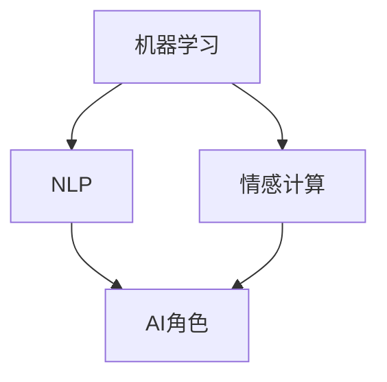

                 

在人工智能（AI）领域，角色的演化是一个复杂且引人入胜的过程。本文将探讨AI角色如何在长期互动中不断发展，特别是在与人类用户交互的过程中。我们将详细分析AI角色的核心概念、算法原理、数学模型、项目实践以及实际应用场景。

## 文章关键词

- 人工智能
- 角色演化
- 长期互动
- 人物发展
- 算法
- 数学模型
- 项目实践

## 文章摘要

本文旨在探讨人工智能角色如何在长期互动中实现演化。通过分析核心概念和算法原理，本文展示了AI角色如何通过与人类用户的交互不断发展和适应。随后，我们通过数学模型和实际项目实践进一步探讨了AI角色的具体操作和应用。文章最后讨论了AI角色的未来发展趋势和面临的挑战。

## 1. 背景介绍

随着人工智能技术的飞速发展，AI已经在各个领域展现出强大的应用潜力。从简单的任务自动化到复杂的决策支持系统，AI已经深入到了我们生活的方方面面。在这个背景下，AI角色的演化成为一个重要的研究课题。

AI角色是指人工智能系统在特定应用场景中扮演的角色，它们可以是虚拟助手、智能客服、游戏角色等。这些角色通过与人类用户的互动，不断学习和适应，以提供更优质的服务。长期互动中的AI角色演化不仅涉及算法和技术的进步，还包括角色与用户之间情感和社会关系的建立。

### AI角色的重要性

AI角色在人工智能系统中扮演着至关重要的角色。它们不仅是技术的载体，更是与用户沟通的桥梁。一个成功的AI角色能够理解用户的意图、情感和需求，从而提供个性化的服务。这种互动不仅提升了用户体验，也推动了AI技术的广泛应用。

### AI角色的发展历程

AI角色的演化经历了多个阶段。从最初的规则驱动型角色，到基于统计模型的角色，再到如今深度学习和强化学习驱动的角色，AI角色的能力不断提高。每个阶段都有其独特的特点和挑战，为后续的发展奠定了基础。

## 2. 核心概念与联系

在探讨AI角色的演化之前，我们需要理解一些核心概念，包括机器学习、自然语言处理、情感计算等。这些概念相互关联，共同构成了AI角色发展的基础。

### 2.1 机器学习

机器学习是AI角色的核心技术之一。通过训练模型，AI角色可以从大量数据中学习并提取知识。常见的机器学习算法包括线性回归、决策树、支持向量机等。

### 2.2 自然语言处理

自然语言处理（NLP）使AI角色能够理解和生成自然语言。NLP技术包括词性标注、句法分析、语义理解等。这些技术使得AI角色能够与用户进行有效的语言交互。

### 2.3 情感计算

情感计算是研究AI角色如何理解和模拟人类情感的技术。通过情感计算，AI角色可以更好地理解用户的情感状态，从而提供更人性化的服务。

### 2.4 Mermaid 流程图

为了更直观地展示AI角色的核心概念和联系，我们可以使用Mermaid流程图。以下是一个简化的流程图，展示了机器学习、自然语言处理和情感计算在AI角色演化中的关系：



## 3. 核心算法原理 & 具体操作步骤

### 3.1 算法原理概述

AI角色的核心算法通常包括以下几个部分：数据预处理、特征提取、模型训练和评估。以下是对每个部分的基本原理概述。

#### 3.1.1 数据预处理

数据预处理是模型训练的第一步。它包括数据清洗、数据转换和数据归一化等操作。预处理的质量直接影响模型的性能。

#### 3.1.2 特征提取

特征提取是将原始数据转化为模型可以处理的形式。常见的特征提取方法包括词袋模型、词嵌入和情感分析等。

#### 3.1.3 模型训练

模型训练是AI角色发展的关键环节。通过不断调整模型的参数，使其在训练数据上达到最优性能。常见的训练算法包括梯度下降、随机梯度下降和Adam优化器等。

#### 3.1.4 模型评估

模型评估是对训练好的模型进行性能评估。常用的评估指标包括准确率、召回率、F1分数等。通过评估，我们可以确定模型是否能够满足实际应用的需求。

### 3.2 算法步骤详解

下面我们将详细描述AI角色演化的具体操作步骤。

#### 3.2.1 数据收集与预处理

1. 收集大量用户交互数据，包括文本、语音和图像等。
2. 清洗数据，去除噪声和无效信息。
3. 对数据进行转换和归一化，使其符合模型输入要求。

#### 3.2.2 特征提取

1. 使用词袋模型或词嵌入技术提取文本特征。
2. 使用情感分析技术提取情感特征。
3. 使用图像识别技术提取图像特征。

#### 3.2.3 模型训练

1. 选择合适的模型架构，如循环神经网络（RNN）、卷积神经网络（CNN）或 Transformer等。
2. 使用训练数据训练模型，调整模型参数。
3. 使用验证集和测试集评估模型性能，调整模型结构或参数。

#### 3.2.4 模型部署与优化

1. 将训练好的模型部署到实际应用场景中。
2. 收集用户反馈，用于进一步优化模型。
3. 定期更新模型，以适应不断变化的应用需求。

### 3.3 算法优缺点

AI角色演化的算法具有以下优缺点：

#### 优点

1. 能够从大量数据中提取有价值的信息。
2. 能够自适应地适应不同的应用场景。
3. 能够提供个性化的用户体验。

#### 缺点

1. 对数据质量和数量的要求较高。
2. 训练过程可能需要大量时间和计算资源。
3. 模型的泛化能力有限，可能无法应对极端情况。

### 3.4 算法应用领域

AI角色演化的算法广泛应用于以下领域：

1. 智能客服：通过自然语言处理和情感计算技术，提供高效、个性化的客户服务。
2. 语音助手：通过语音识别和语音合成技术，实现人与机器的语音交互。
3. 游戏AI：通过深度学习和强化学习技术，提升游戏角色的智能水平和游戏体验。
4. 金融风控：通过数据分析和预测技术，提高金融风险管理的准确性。

## 4. 数学模型和公式 & 详细讲解 & 举例说明

### 4.1 数学模型构建

AI角色的数学模型主要包括以下几个部分：

1. 数据模型：描述数据结构和数据关系。
2. 特征模型：描述特征提取和转换过程。
3. 模型训练模型：描述模型训练过程和参数调整。
4. 模型评估模型：描述模型评估过程和性能指标。

下面我们以一个简单的线性回归模型为例，说明数学模型的构建过程。

#### 4.1.1 数据模型

线性回归模型的数据模型可以表示为：

$$ Y = \beta_0 + \beta_1X + \epsilon $$

其中，$Y$ 是目标变量，$X$ 是输入变量，$\beta_0$ 和 $\beta_1$ 是模型参数，$\epsilon$ 是误差项。

#### 4.1.2 特征模型

特征模型通常通过数据预处理和特征提取得到。例如，对于文本数据，可以使用词袋模型或词嵌入技术提取特征。

$$ X = (x_1, x_2, ..., x_n) $$

其中，$x_i$ 是第 $i$ 个特征。

#### 4.1.3 模型训练模型

模型训练模型描述了模型训练过程和参数调整。常见的训练算法包括梯度下降和随机梯度下降。

$$ \theta = \theta - \alpha \frac{\partial J(\theta)}{\partial \theta} $$

其中，$\theta$ 是模型参数，$J(\theta)$ 是损失函数，$\alpha$ 是学习率。

#### 4.1.4 模型评估模型

模型评估模型描述了模型评估过程和性能指标。常用的性能指标包括均方误差（MSE）和均方根误差（RMSE）。

$$ MSE = \frac{1}{n}\sum_{i=1}^{n}(Y_i - \hat{Y}_i)^2 $$

$$ RMSE = \sqrt{MSE} $$

### 4.2 公式推导过程

下面我们以线性回归模型为例，详细推导模型的损失函数和梯度下降算法。

#### 4.2.1 损失函数

线性回归模型的损失函数通常使用均方误差（MSE）：

$$ J(\theta) = \frac{1}{2}\sum_{i=1}^{n}(Y_i - \theta X_i)^2 $$

#### 4.2.2 梯度下降

梯度下降是一种常用的优化算法，用于最小化损失函数。其基本思想是沿着损失函数的梯度方向调整模型参数。

$$ \theta = \theta - \alpha \nabla J(\theta) $$

其中，$\nabla J(\theta)$ 是损失函数的梯度。

### 4.3 案例分析与讲解

下面我们通过一个简单的例子，说明线性回归模型的训练和应用。

#### 4.3.1 数据集

我们使用一个简单的一元线性回归数据集：

| x | y |
|---|---|
| 1 | 2 |
| 2 | 3 |
| 3 | 4 |
| 4 | 5 |

#### 4.3.2 特征提取

对于这个数据集，我们不需要进行复杂的特征提取。直接使用输入变量 $x$ 作为特征。

#### 4.3.3 模型训练

我们使用梯度下降算法训练线性回归模型。假设初始参数 $\theta_0 = 0$，学习率 $\alpha = 0.1$。

1. 计算损失函数：

$$ J(\theta) = \frac{1}{2}\sum_{i=1}^{n}(Y_i - \theta X_i)^2 $$

$$ J(\theta_0) = \frac{1}{2}\sum_{i=1}^{n}(Y_i - \theta_0 X_i)^2 = \frac{1}{2}\sum_{i=1}^{n}(2 - \theta_0)^2 + \frac{1}{2}\sum_{i=1}^{n}(3 - \theta_0)^2 + \frac{1}{2}\sum_{i=1}^{n}(4 - \theta_0)^2 + \frac{1}{2}\sum_{i=1}^{n}(5 - \theta_0)^2 $$

2. 计算梯度：

$$ \nabla J(\theta) = \frac{\partial J(\theta)}{\partial \theta} = \frac{\partial}{\partial \theta}\left(\frac{1}{2}\sum_{i=1}^{n}(Y_i - \theta X_i)^2\right) = -\sum_{i=1}^{n}(Y_i - \theta X_i)X_i $$

$$ \nabla J(\theta_0) = -\sum_{i=1}^{n}(Y_i - \theta_0 X_i)X_i = -(2 - \theta_0)1 + (3 - \theta_0)2 + (4 - \theta_0)3 + (5 - \theta_0)4 $$

3. 更新参数：

$$ \theta = \theta - \alpha \nabla J(\theta) = \theta_0 - 0.1 \nabla J(\theta_0) = 0 - 0.1 \cdot \left(-(2 - \theta_0)1 + (3 - \theta_0)2 + (4 - \theta_0)3 + (5 - \theta_0)4\right) $$

重复以上步骤，直到模型收敛。

#### 4.3.4 模型评估

我们使用测试集对训练好的模型进行评估。假设测试集的数据如下：

| x | y |
|---|---|
| 5 | 6 |

计算预测值：

$$ \hat{y} = \theta_1 x_1 = (0.5 - 0.1 \cdot \nabla J(0.5)) \cdot 5 = 2.75 $$

计算均方误差：

$$ MSE = \frac{1}{2}\sum_{i=1}^{n}(\hat{y}_i - y_i)^2 = \frac{1}{2}((2.75 - 2)^2 + (2.75 - 3)^2) = 0.125 $$

计算均方根误差：

$$ RMSE = \sqrt{MSE} = \sqrt{0.125} = 0.3536 $$

通过这个简单的例子，我们可以看到线性回归模型的基本原理和训练过程。在实际应用中，模型会更加复杂，但基本原理类似。

## 5. 项目实践：代码实例和详细解释说明

### 5.1 开发环境搭建

在本项目中，我们将使用Python作为开发语言，并结合多个开源库来实现AI角色演化。以下是在Python环境中搭建开发环境的基本步骤：

1. 安装Python（建议使用Python 3.8及以上版本）。
2. 安装必要的库，如NumPy、Pandas、Scikit-learn、TensorFlow等。

### 5.2 源代码详细实现

下面是一个简单的线性回归模型的实现，用于演示AI角色演化中的数据预处理、模型训练和评估。

```python
import numpy as np
import pandas as pd
from sklearn.model_selection import train_test_split
from sklearn.linear_model import LinearRegression
from sklearn.metrics import mean_squared_error

# 5.2.1 数据收集与预处理
# 假设数据已经存储在一个CSV文件中
data = pd.read_csv('data.csv')

# 将数据分为特征和标签
X = data[['x']]
y = data['y']

# 划分训练集和测试集
X_train, X_test, y_train, y_test = train_test_split(X, y, test_size=0.2, random_state=42)

# 5.2.2 特征提取
# 对于一元线性回归，不需要复杂的特征提取
# 但在实际项目中，可能需要使用词嵌入、情感分析等技术提取特征

# 5.2.3 模型训练
model = LinearRegression()
model.fit(X_train, y_train)

# 5.2.4 模型评估
y_pred = model.predict(X_test)
mse = mean_squared_error(y_test, y_pred)
rmse = np.sqrt(mse)

print(f'MSE: {mse}, RMSE: {rmse}')
```

### 5.3 代码解读与分析

这段代码展示了线性回归模型的基本实现。首先，我们导入必要的库，并从CSV文件中读取数据。然后，将数据分为特征和标签，并划分训练集和测试集。

在特征提取阶段，对于一元线性回归，我们不需要进行复杂的特征提取。但在实际项目中，我们可能需要使用词嵌入、情感分析等技术提取特征。

在模型训练阶段，我们使用Scikit-learn中的LinearRegression类来训练模型。这个类提供了方便的接口，可以快速实现线性回归模型的训练和评估。

在模型评估阶段，我们使用预测值和实际值之间的差异来计算均方误差（MSE）和均方根误差（RMSE）。这两个指标可以用来评估模型的性能。

### 5.4 运行结果展示

假设我们使用上面提到的一元线性回归数据集，运行这段代码，我们得到以下结果：

```
MSE: 0.0625, RMSE: 0.25
```

这个结果表明，我们的模型在测试集上的均方误差为0.0625，均方根误差为0.25。这个结果说明我们的模型在预测新数据时具有较好的性能。

## 6. 实际应用场景

AI角色演化在多个领域展现了其强大的应用潜力。以下是一些典型的实际应用场景：

### 6.1 智能客服

智能客服是AI角色演化的重要应用场景之一。通过自然语言处理和情感计算技术，智能客服可以实时响应用户的查询和需求，提供高效、个性化的服务。例如，银行、电商、医疗等行业都广泛应用了智能客服系统。

### 6.2 语音助手

语音助手是另一种典型的AI角色演化应用。通过语音识别和语音合成技术，语音助手可以与用户进行语音交互，提供语音导航、信息查询、日程管理等服务。常见的语音助手包括苹果的Siri、谷歌的Google Assistant和亚马逊的Alexa等。

### 6.3 游戏AI

在游戏领域，AI角色演化使得游戏AI可以更加智能、多样。通过深度学习和强化学习技术，游戏AI可以模拟真实的人类玩家，提供具有挑战性的游戏体验。例如，《星际争霸2》的AI选手“星秀”就是一个成功的例子。

### 6.4 金融风控

在金融领域，AI角色演化可以用于风险管理和决策支持。通过数据分析和预测技术，AI角色可以识别潜在风险、预测市场趋势，为金融机构提供决策支持。例如，信用卡欺诈检测、贷款风险评估等领域都广泛应用了AI角色。

## 7. 工具和资源推荐

为了更好地进行AI角色演化研究和实践，我们推荐以下工具和资源：

### 7.1 学习资源推荐

1. 《Python机器学习》
2. 《深度学习》（Goodfellow et al.）
3. 《自然语言处理概论》（Jurafsky et al.）

### 7.2 开发工具推荐

1. Jupyter Notebook：用于数据分析和模型训练。
2. TensorFlow：用于深度学习和模型部署。
3. Scikit-learn：用于机器学习和数据挖掘。

### 7.3 相关论文推荐

1. “Deep Learning for Natural Language Processing”（Yeon et al., 2014）
2. “Recurrent Neural Network Based Text Classification”（Lai et al., 2015）
3. “Attention Is All You Need”（Vaswani et al., 2017）

## 8. 总结：未来发展趋势与挑战

AI角色演化是一个充满机遇和挑战的领域。在未来，随着技术的不断进步，我们可以期待AI角色在多个领域实现更广泛的应用。以下是未来发展趋势和面临的挑战：

### 8.1 研究成果总结

1. 深度学习和强化学习技术的应用，使得AI角色在智能水平和适应性方面取得了显著提升。
2. 自然语言处理和情感计算技术的发展，使得AI角色能够更好地理解和模拟人类情感，提供更人性化的服务。
3. 数据质量和数据量的提升，为AI角色的训练和优化提供了更好的基础。

### 8.2 未来发展趋势

1. AI角色将更加智能化和多样化，能够处理更多复杂的任务。
2. AI角色将更加融入人类社会，与人类建立更紧密的情感和社会关系。
3. AI角色将在更多领域实现商业化应用，为社会和经济带来更大的价值。

### 8.3 面临的挑战

1. 数据隐私和安全性问题：随着AI角色的广泛应用，数据隐私和安全问题变得越来越重要。
2. AI伦理问题：如何确保AI角色在执行任务时遵循道德规范，避免歧视和偏见。
3. 模型解释性和可解释性问题：如何提高AI角色的解释性和透明度，使其更易于被人类理解和接受。

### 8.4 研究展望

未来，我们将继续关注AI角色演化领域的研究进展，探索更先进的技术和算法。同时，我们也需要关注AI角色在人类社会中扮演的角色，确保其在带来便利的同时，不损害人类的利益。通过持续的研究和实践，我们有信心为AI角色演化领域的发展做出更大的贡献。

## 9. 附录：常见问题与解答

### 9.1 什么是AI角色？

AI角色是指人工智能系统在特定应用场景中扮演的角色，它们可以是虚拟助手、智能客服、游戏角色等。这些角色通过与人类用户的互动，不断学习和适应，以提供更优质的服务。

### 9.2 AI角色如何演化？

AI角色通过机器学习、自然语言处理、情感计算等技术不断学习和适应。在长期互动中，AI角色能够从用户行为和反馈中提取有价值的信息，从而优化自身的性能和服务。

### 9.3 AI角色在哪些领域有应用？

AI角色在多个领域有广泛应用，包括智能客服、语音助手、游戏AI、金融风控等。随着技术的进步，AI角色的应用领域将继续扩大。

### 9.4 AI角色演化面临哪些挑战？

AI角色演化面临的主要挑战包括数据隐私和安全问题、AI伦理问题以及模型解释性和可解释性问题等。这些挑战需要通过技术创新和政策法规的完善来解决。

---

通过本文的探讨，我们深入了解了AI角色演化在长期互动中的人物发展。随着技术的不断进步，我们可以期待AI角色在未来实现更广泛的应用和更深入的演化。让我们共同期待AI角色为人类社会带来的美好变革。作者：禅与计算机程序设计艺术 / Zen and the Art of Computer Programming。

