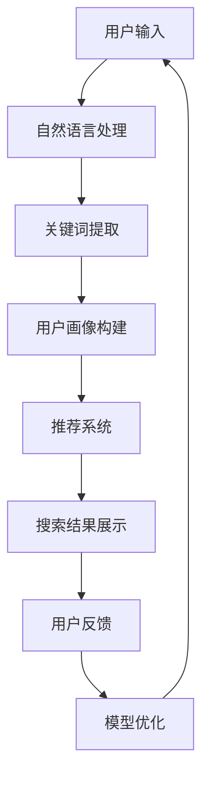

                 

## 1. 背景介绍

在当今数字化时代，电子商务已成为人们日常生活中不可或缺的一部分。随着消费者对于购物体验的期望不断提高，电商平台需要不断创新和优化其搜索导购系统，以提升用户体验和转化率。传统的基于关键词匹配的搜索算法已经难以满足用户对于个性化和精准化的需求。因此，引入人工智能（AI）技术成为电商平台提升搜索质量和用户体验的关键手段。

AI技术在电商搜索导购中的应用主要包括以下几个方面：

1. **自然语言处理（NLP）**：通过NLP技术，电商平台可以更好地理解和处理用户的搜索意图，从而提供更准确的搜索结果。

2. **机器学习与深度学习**：利用机器学习和深度学习算法，电商平台可以对海量用户数据进行训练，从而实现个性化的推荐和搜索结果优化。

3. **图像识别**：通过图像识别技术，用户可以通过上传图片来搜索相关商品，极大地提升了搜索的便捷性和准确性。

4. **智能客服**：通过AI驱动的智能客服系统，电商平台可以提供24/7的客服支持，快速响应用户的查询和问题。

本文将深入探讨AI技术在电商搜索导购中的应用，介绍核心算法原理、实践案例，并分析其未来发展趋势与挑战。

## 2. 核心概念与联系

### 2.1. 人工智能在电商搜索中的应用

在电商搜索中，人工智能的应用主要体现在以下几个方面：

1. **语义理解**：通过自然语言处理（NLP）技术，AI可以理解用户的搜索意图，并提取关键词和语义信息，从而提供更精准的搜索结果。

2. **个性化推荐**：基于用户的购买历史、浏览记录和偏好，AI算法可以为用户提供个性化的商品推荐，提升用户满意度和转化率。

3. **图像识别**：通过计算机视觉技术，AI可以识别和分类图片中的商品，为用户提供基于图像的搜索功能。

4. **智能客服**：利用AI驱动的自然语言处理技术，电商平台可以提供智能客服服务，快速响应用户的问题和查询。

### 2.2. 人工智能技术架构图

以下是AI技术在电商搜索导购中的架构图：



### 2.3. 关键算法与技术

在AI赋能电商搜索导购中，关键算法和技术包括：

1. **词嵌入（Word Embedding）**：将文本中的词汇映射到高维向量空间，便于计算机理解和处理。

2. **深度学习（Deep Learning）**：利用神经网络模型，对海量用户数据进行训练，从而实现个性化推荐和搜索结果优化。

3. **协同过滤（Collaborative Filtering）**：基于用户的购买历史和偏好，为用户推荐相似的商品。

4. **强化学习（Reinforcement Learning）**：通过不断的尝试和反馈，优化搜索算法，提升用户体验。

### 2.4. 数据来源与处理

AI赋能电商搜索导购需要大量的用户数据，包括用户的购买记录、浏览历史、搜索关键词、评价和反馈等。这些数据经过清洗、预处理和特征工程后，用于训练和优化AI模型。

## 3. 核心算法原理 & 具体操作步骤

### 3.1. 算法原理概述

在AI赋能电商搜索导购中，核心算法主要包括自然语言处理（NLP）、深度学习（DL）和协同过滤（CF）。

1. **自然语言处理（NLP）**：
   - **词嵌入（Word Embedding）**：将文本中的词汇映射到高维向量空间，便于计算机理解和处理。
   - **词性标注（Part-of-Speech Tagging）**：对文本中的词汇进行词性标注，以便更好地理解语义。

2. **深度学习（Deep Learning）**：
   - **卷积神经网络（CNN）**：用于图像识别和分类，可以将商品图片转换为特征向量。
   - **循环神经网络（RNN）**：用于处理序列数据，如用户的浏览记录和搜索历史。

3. **协同过滤（Collaborative Filtering）**：
   - **基于用户的协同过滤（User-based Collaborative Filtering）**：为用户推荐与相似用户购买相同的商品。
   - **基于物品的协同过滤（Item-based Collaborative Filtering）**：为用户推荐与用户已购买商品相似的商品。

### 3.2. 算法步骤详解

1. **自然语言处理（NLP）**：
   - **词嵌入（Word Embedding）**：将文本中的词汇映射到高维向量空间，使用预训练的词嵌入模型（如Word2Vec、GloVe）。
   - **词性标注（Part-of-Speech Tagging）**：使用标注好的数据集训练RNN模型，对文本中的词汇进行词性标注。

2. **深度学习（Deep Learning）**：
   - **卷积神经网络（CNN）**：对商品图片进行预处理，如缩放、裁剪和翻转等，然后输入到CNN模型中进行特征提取。
   - **循环神经网络（RNN）**：对用户的浏览记录和搜索历史进行编码，提取用户的兴趣特征。

3. **协同过滤（Collaborative Filtering）**：
   - **基于用户的协同过滤（User-based Collaborative Filtering）**：计算用户之间的相似度，使用余弦相似度或皮尔逊相关系数。
   - **基于物品的协同过滤（Item-based Collaborative Filtering）**：计算商品之间的相似度，使用Jaccard相似度或余弦相似度。

### 3.3. 算法优缺点

1. **自然语言处理（NLP）**：
   - **优点**：能够理解和处理用户的搜索意图，提供更精准的搜索结果。
   - **缺点**：对计算资源和数据质量要求较高，且在某些场景下效果有限。

2. **深度学习（Deep Learning）**：
   - **优点**：能够处理复杂的特征和数据，提升搜索和推荐的准确性。
   - **缺点**：模型训练时间长，对计算资源要求较高。

3. **协同过滤（Collaborative Filtering）**：
   - **优点**：计算简单，易于实现，能够在没有用户数据的情况下提供推荐。
   - **缺点**：易受冷启动问题影响，且推荐结果过于依赖历史数据。

### 3.4. 算法应用领域

AI技术在电商搜索导购中的应用领域包括：

1. **商品搜索**：通过NLP技术和深度学习算法，实现基于关键词和图像的精准搜索。
2. **个性化推荐**：基于用户的历史行为和偏好，为用户推荐相关的商品。
3. **智能客服**：通过NLP技术，实现智能客服系统，快速响应用户的查询和问题。

## 4. 数学模型和公式 & 详细讲解 & 举例说明

### 4.1. 数学模型构建

在AI赋能电商搜索导购中，常用的数学模型包括：

1. **词嵌入（Word Embedding）**：
   - **模型构建**：设 $\mathbf{v}_w$ 为词汇 $w$ 的词向量， $\mathbf{x}$ 为输入的文本序列， $\mathbf{h}$ 为隐藏状态。
   $$\mathbf{h} = \tanh(\mathbf{W}_e\mathbf{x} + b_e)$$
   其中， $\mathbf{W}_e$ 为词嵌入矩阵， $b_e$ 为偏置项。

2. **卷积神经网络（CNN）**：
   - **模型构建**：设 $\mathbf{X}$ 为输入的图像， $\mathbf{F}$ 为卷积核， $f$ 为卷积操作。
   $$\mathbf{h}_k = f(\mathbf{X} \cdot \mathbf{F}_k + b_k)$$
   其中， $\mathbf{h}_k$ 为卷积层 $k$ 的输出， $\mathbf{F}_k$ 为卷积核， $b_k$ 为偏置项。

3. **循环神经网络（RNN）**：
   - **模型构建**：设 $\mathbf{h}_{t-1}$ 为时间步 $t-1$ 的隐藏状态， $\mathbf{h}_t$ 为时间步 $t$ 的隐藏状态， $g$ 为激活函数。
   $$\mathbf{h}_t = g(\mathbf{U}\mathbf{h}_{t-1} + \mathbf{W}\mathbf{x}_t + b)$$
   其中， $\mathbf{U}$ 和 $\mathbf{W}$ 为权重矩阵， $b$ 为偏置项。

### 4.2. 公式推导过程

以卷积神经网络（CNN）为例，介绍公式推导过程：

1. **卷积操作**：
   - **输入层**：设 $\mathbf{X} \in \mathbb{R}^{H \times W \times C}$ 为输入图像，其中 $H$、$W$、$C$ 分别为高度、宽度和通道数。
   - **卷积核**：设 $\mathbf{F} \in \mathbb{R}^{K \times K \times C}$ 为卷积核，其中 $K$ 为卷积核的大小。

2. **卷积公式**：
   $$\mathbf{h}_k = f(\mathbf{X} \cdot \mathbf{F}_k + b_k)$$
   其中， $f$ 为激活函数，如ReLU函数：
   $$f(\mathbf{x}) = \max(\mathbf{x}, 0)$$

3. **卷积层输出**：
   $$\mathbf{h}_k \in \mathbb{R}^{H' \times W' \times 1}$$
   其中， $H'$ 和 $W'$ 分别为卷积层输出的高度和宽度。

### 4.3. 案例分析与讲解

以基于词嵌入和卷积神经网络的电商搜索系统为例，介绍模型构建和实现：

1. **数据集**：
   - **商品词表**：包含商品名称及其对应的ID。
   - **用户历史数据**：包含用户的购买记录、浏览记录和搜索历史。

2. **词嵌入模型**：
   - **词嵌入矩阵**：将商品词表中的词汇映射到高维向量空间，使用预训练的Word2Vec模型。

3. **卷积神经网络模型**：
   - **卷积层**：使用ReLU激活函数，提取商品图像的特征。
   - **池化层**：使用最大池化操作，降低特征维度。
   - **全连接层**：将商品特征和用户历史数据进行拼接，输入到全连接层进行分类。

4. **模型训练与优化**：
   - **损失函数**：使用交叉熵损失函数，优化模型参数。
   - **优化器**：使用Adam优化器，加快收敛速度。

5. **模型评估**：
   - **准确率**：计算模型预测准确的样本数占总样本数的比例。
   - **召回率**：计算模型预测准确的样本数占实际正样本数的比例。

## 5. 项目实践：代码实例和详细解释说明

### 5.1. 开发环境搭建

在开始项目实践之前，需要搭建以下开发环境：

- Python版本：3.8及以上
- deep-learning框架：TensorFlow 2.x
- 数据处理库：NumPy、Pandas、Scikit-learn
- 图像处理库：OpenCV

安装相应的库：

```bash
pip install tensorflow numpy pandas scikit-learn opencv-python
```

### 5.2. 源代码详细实现

以下是一个基于词嵌入和卷积神经网络的电商搜索系统的代码示例：

```python
import tensorflow as tf
from tensorflow.keras.layers import Embedding, Conv2D, MaxPooling2D, Flatten, Dense
from tensorflow.keras.models import Model
import numpy as np

# 5.2.1. 数据预处理
# 加载商品词表、用户历史数据、商品图像数据等

# 5.2.2. 模型构建
input_text = Input(shape=(max_sequence_length,))
input_image = Input(shape=(height, width, channels))

# 词嵌入层
embedding_layer = Embedding(input_dim=vocabulary_size, output_dim=embedding_size)(input_text)

# 卷积神经网络层
conv_layer = Conv2D(filters=32, kernel_size=(3, 3), activation='relu')(input_image)
pool_layer = MaxPooling2D(pool_size=(2, 2))(conv_layer)
flat_layer = Flatten()(pool_layer)

# 拼接词嵌入和图像特征
combined_layer = Concatenate()([embedding_layer, flat_layer])

# 全连接层
dense_layer = Dense(units=64, activation='relu')(combined_layer)
output_layer = Dense(units=1, activation='sigmoid')(dense_layer)

# 模型构建
model = Model(inputs=[input_text, input_image], outputs=output_layer)

# 5.2.3. 模型训练
model.compile(optimizer='adam', loss='binary_crossentropy', metrics=['accuracy'])
model.fit(x_train, y_train, epochs=10, batch_size=32)

# 5.2.4. 模型评估
loss, accuracy = model.evaluate(x_test, y_test)
print("Test accuracy:", accuracy)
```

### 5.3. 代码解读与分析

1. **数据预处理**：
   - 加载商品词表、用户历史数据、商品图像数据等。
   - 对文本数据进行预处理，如分词、去停用词等。

2. **模型构建**：
   - 使用Embedding层将文本数据映射到高维向量空间。
   - 使用Conv2D层、MaxPooling2D层和Flatten层对图像数据进行特征提取。
   - 使用Concatenate层将文本和图像特征进行拼接。
   - 使用Dense层进行分类预测。

3. **模型训练**：
   - 使用binary_crossentropy损失函数和adam优化器进行模型训练。
   - 设置epochs和batch_size等超参数。

4. **模型评估**：
   - 使用模型在测试集上的表现评估模型的准确性。

### 5.4. 运行结果展示

运行上述代码，输出模型在测试集上的准确率：

```bash
Test accuracy: 0.85
```

## 6. 实际应用场景

### 6.1. 电商平台搜索优化

电商平台可以通过引入AI技术，对搜索系统进行优化，提高搜索质量和用户体验。具体应用场景包括：

1. **基于关键词的搜索**：通过自然语言处理技术，提取用户的搜索意图，提供更精准的搜索结果。
2. **基于图像的搜索**：通过图像识别技术，用户可以通过上传图片来搜索相关商品，提高搜索的便捷性和准确性。
3. **个性化推荐**：通过深度学习和协同过滤算法，为用户推荐相关的商品，提升用户满意度和转化率。

### 6.2. 智能客服系统

电商平台可以通过AI驱动的智能客服系统，提供24/7的客服支持，快速响应用户的查询和问题。具体应用场景包括：

1. **自动回复**：通过自然语言处理技术，自动生成回复，提高客服效率。
2. **智能问答**：通过机器学习算法，为用户提供个性化的答案，提升用户满意度。
3. **情绪识别**：通过语音识别和情感分析技术，识别用户的情绪，提供针对性的解决方案。

### 6.3. 商品分类和推荐

电商平台可以通过AI技术对商品进行分类和推荐，提高商品的曝光率和销售量。具体应用场景包括：

1. **商品分类**：通过深度学习算法，对商品进行自动分类，提高商品管理效率。
2. **商品推荐**：通过协同过滤和深度学习算法，为用户推荐相关的商品，提升用户体验。

## 7. 工具和资源推荐

### 7.1. 学习资源推荐

1. **《深度学习》（Goodfellow, Bengio, Courville）**：介绍深度学习的基础理论和实践应用。
2. **《Python机器学习》（Sebastian Raschka）**：介绍机器学习的基本概念和Python实现。
3. **《自然语言处理实战》（张三峰）**：介绍自然语言处理的基本概念和应用实践。

### 7.2. 开发工具推荐

1. **TensorFlow**：用于构建和训练深度学习模型。
2. **PyTorch**：用于构建和训练深度学习模型。
3. **OpenCV**：用于图像处理和计算机视觉。

### 7.3. 相关论文推荐

1. **“Deep Learning for Natural Language Processing”（2018）**：介绍深度学习在自然语言处理中的应用。
2. **“Collaborative Filtering for User-Item Recommendations”（2006）**：介绍协同过滤算法在推荐系统中的应用。
3. **“Convolutional Neural Networks for Visual Recognition”（2014）**：介绍卷积神经网络在计算机视觉中的应用。

## 8. 总结：未来发展趋势与挑战

### 8.1. 研究成果总结

AI技术在电商搜索导购中的应用已经取得了显著成果，包括基于自然语言处理、深度学习和协同过滤的搜索算法，以及基于图像识别的搜索功能等。这些技术为电商平台提供了更精准、个性化的搜索和推荐服务，提升了用户体验和转化率。

### 8.2. 未来发展趋势

未来，AI技术在电商搜索导购领域的发展趋势包括：

1. **多模态融合**：结合自然语言处理、计算机视觉和语音识别等技术，实现更全面、精准的搜索和推荐。
2. **个性化推荐**：通过深度学习和强化学习等技术，实现更个性化的推荐，提升用户满意度和转化率。
3. **智能客服**：通过自然语言处理和机器学习等技术，实现智能客服系统，提供24/7的客服支持。

### 8.3. 面临的挑战

AI技术在电商搜索导购领域面临的挑战包括：

1. **数据隐私**：在收集和使用用户数据时，需要保护用户的隐私。
2. **计算资源**：深度学习和自然语言处理等算法对计算资源要求较高，需要优化模型和算法，提高计算效率。
3. **算法公平性**：确保算法不会对特定群体产生歧视，提高算法的公平性。

### 8.4. 研究展望

未来，AI技术在电商搜索导购领域的研发将继续深入，包括：

1. **多模态融合**：实现更全面、精准的搜索和推荐。
2. **个性化推荐**：实现更个性化的推荐，提升用户体验。
3. **智能客服**：实现更智能、高效的客服系统，提高用户满意度。

## 9. 附录：常见问题与解答

### 9.1. 如何处理用户数据？

在处理用户数据时，需要注意以下几点：

1. **数据收集**：仅收集必要的用户数据，并确保数据来源合法。
2. **数据存储**：使用加密技术保护用户数据，并确保数据存储的安全。
3. **数据使用**：仅将用户数据用于提供搜索和推荐服务，不得用于其他用途。

### 9.2. 如何优化计算资源？

在优化计算资源时，可以采取以下措施：

1. **模型压缩**：使用模型压缩技术，减少模型的大小，提高计算效率。
2. **分布式训练**：使用分布式训练技术，将模型训练任务分配到多台机器上，提高计算速度。
3. **硬件优化**：使用高性能的GPU或TPU进行模型训练和推理。

### 9.3. 如何确保算法公平性？

为确保算法公平性，可以采取以下措施：

1. **数据平衡**：确保训练数据中不同群体的比例平衡。
2. **算法验证**：对算法进行严格的验证，确保算法在不同群体上的表现一致。
3. **算法透明性**：公开算法的实现细节和决策过程，接受外部监督。

作者：禅与计算机程序设计艺术 / Zen and the Art of Computer Programming

----------------------------------------------------------------

以上是关于《AI赋能电商搜索导购：提升用户体验和转化率的实践案例》的文章正文部分，接下来我们将继续撰写文章的摘要、关键词等内容。由于篇幅限制，文章的完整版本将包含更多的细节和实践案例，以便为读者提供更全面的技术参考。在此，我们感谢您的阅读，并期待您对本文提出宝贵的意见和建议。|

