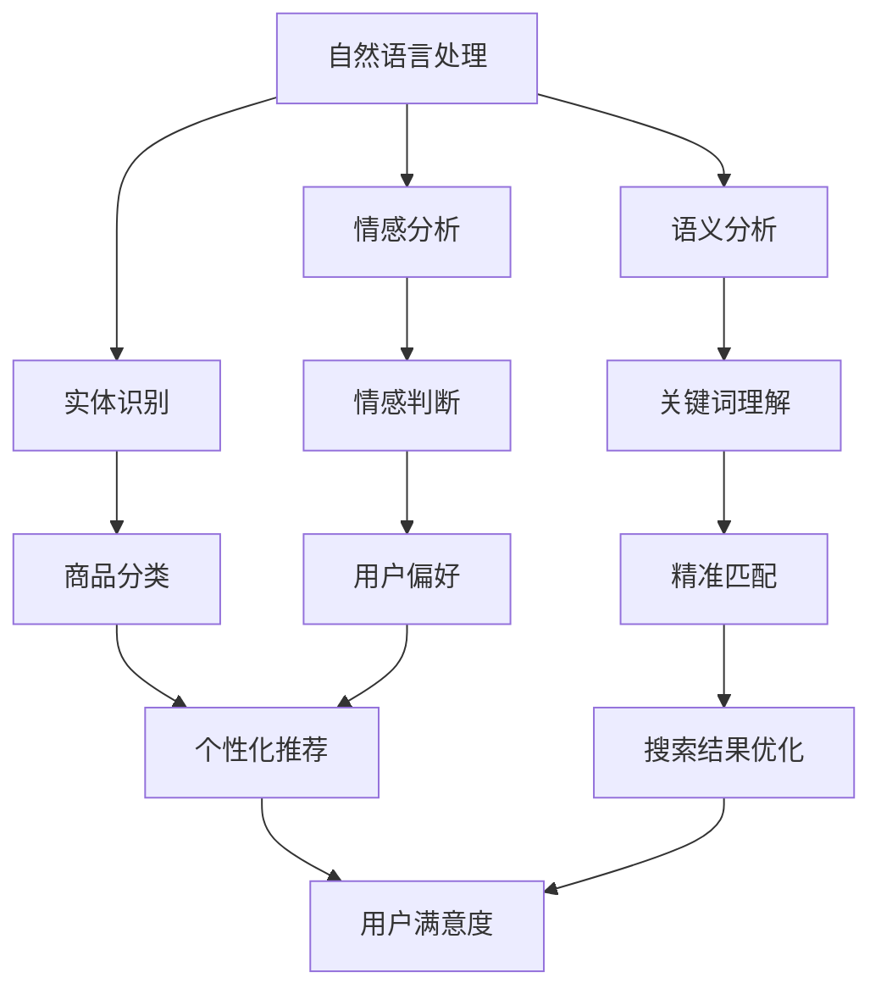

                 

关键词：人工智能、电商搜索、个性化推荐、精准匹配、算法原理、数学模型、项目实践、未来展望

> 摘要：本文旨在探讨人工智能在电商搜索中的应用，特别是从精准匹配到个性化推荐的转变。通过分析核心概念、算法原理、数学模型及实际项目实践，我们将揭示AI如何赋能电商搜索，提升用户体验和商业价值。

## 1. 背景介绍

随着互联网的迅猛发展，电子商务已成为全球经济发展的新引擎。电商平台在用户数量和交易规模上不断增长，用户对搜索体验的要求也日益提高。传统的电商搜索方法往往依赖于关键词匹配，但这种方式难以满足用户对个性化、精准化搜索的需求。人工智能（AI）技术的兴起为电商搜索带来了新的机遇，使得从精准匹配到个性化推荐的转变成为可能。

### 1.1 传统电商搜索的局限

传统电商搜索主要依赖于关键词匹配，存在以下局限：

- **低效的搜索结果**：由于关键词的模糊性和多样性，搜索结果往往难以满足用户的需求，导致用户满意度下降。
- **缺乏个性化**：传统搜索方法无法根据用户的兴趣和行为进行个性化推荐，导致搜索结果缺乏针对性。
- **依赖人工干预**：搜索引擎往往需要人工干预进行关键词调整和权重分配，增加了运营成本。

### 1.2 人工智能在电商搜索中的应用

人工智能技术的引入，使得电商搜索从以下几个方面得到显著提升：

- **精准匹配**：通过自然语言处理（NLP）技术，AI能够对用户输入的关键词进行深入理解和分析，实现更加精准的搜索匹配。
- **个性化推荐**：基于用户的行为数据和偏好，AI能够生成个性化的推荐结果，提高用户满意度和转化率。
- **智能优化**：AI技术能够自动优化搜索算法和推荐策略，提高搜索效率和用户体验。

## 2. 核心概念与联系

在讨论人工智能赋能电商搜索时，我们需要了解以下几个核心概念：

- **自然语言处理（NLP）**：NLP技术使得计算机能够理解和处理人类语言，从而实现语义分析、情感分析和实体识别等任务。
- **机器学习（ML）**：机器学习是AI的核心技术之一，通过训练模型来识别模式和规律，从而实现智能决策和预测。
- **深度学习（DL）**：深度学习是机器学习的一个子领域，通过多层神经网络模拟人类大脑的学习过程，具有强大的特征提取和模式识别能力。
- **推荐系统**：推荐系统是基于用户行为数据，通过算法生成个性化推荐结果，提高用户满意度和商业价值。

下面是这些核心概念的Mermaid流程图：



### 2.1 核心概念之间的关系

- **NLP与ML/DL的关系**：NLP是ML/DL的基础，通过NLP技术，我们可以将自然语言转换为计算机可处理的格式，然后利用ML/DL算法进行进一步的处理和分析。
- **推荐系统与NLP/ML/DL的关系**：推荐系统依赖于NLP和ML/DL技术来理解用户需求和生成推荐结果，同时通过不断优化推荐算法来提高推荐效果。

## 3. 核心算法原理 & 具体操作步骤

### 3.1 算法原理概述

电商搜索的AI赋能主要依赖于以下核心算法：

- **基于关键词匹配的搜索算法**：传统的搜索引擎通常采用基于关键词匹配的算法，通过关键词的匹配度来排序和筛选搜索结果。
- **基于语义分析的搜索算法**：利用NLP技术，对用户输入的关键词进行语义分析，理解其背后的意图和需求，从而实现更加精准的搜索匹配。
- **基于用户行为的推荐算法**：通过分析用户的浏览、购买、收藏等行为数据，构建用户画像，然后利用推荐算法生成个性化的推荐结果。

### 3.2 算法步骤详解

#### 基于关键词匹配的搜索算法

1. **用户输入关键词**：用户在搜索框中输入关键词。
2. **关键词预处理**：对关键词进行分词、去停用词等预处理操作。
3. **建立索引**：构建倒排索引，将关键词与对应的文档（商品）建立映射关系。
4. **搜索匹配**：根据用户输入的关键词，从索引中查找匹配的文档。
5. **排序和筛选**：根据匹配度对搜索结果进行排序和筛选，返回给用户。

#### 基于语义分析的搜索算法

1. **用户输入关键词**：与基于关键词匹配的算法相同。
2. **语义分析**：利用NLP技术对关键词进行语义分析，理解其背后的意图和需求。
3. **意图识别**：根据语义分析结果，识别用户的意图，如查找某件商品、比较商品等。
4. **搜索匹配**：基于用户的意图，进行更加精准的搜索匹配。
5. **排序和筛选**：根据匹配度和用户意图，对搜索结果进行排序和筛选。

#### 基于用户行为的推荐算法

1. **用户行为数据收集**：收集用户的浏览、购买、收藏等行为数据。
2. **用户画像构建**：基于行为数据，构建用户的兴趣和偏好画像。
3. **推荐算法训练**：利用机器学习算法，如协同过滤、矩阵分解等，训练推荐模型。
4. **生成推荐结果**：根据用户画像和推荐模型，生成个性化的推荐结果。
5. **推荐结果优化**：通过不断优化推荐算法，提高推荐效果。

### 3.3 算法优缺点

#### 基于关键词匹配的搜索算法

**优点**：

- **简单易用**：用户只需输入关键词，即可获取搜索结果。
- **适用范围广**：适用于各种类型的电商平台。

**缺点**：

- **匹配度不高**：难以满足用户对精准搜索的需求。
- **缺乏个性化**：搜索结果普遍化，无法体现用户的个性化需求。

#### 基于语义分析的搜索算法

**优点**：

- **高匹配度**：通过语义分析，能够实现更加精准的搜索匹配。
- **个性化推荐**：能够根据用户的意图和需求，提供个性化的搜索结果。

**缺点**：

- **计算复杂度高**：语义分析过程复杂，对计算资源要求较高。
- **算法实现难度大**：需要较高的技术门槛。

#### 基于用户行为的推荐算法

**优点**：

- **个性化推荐**：能够根据用户的行为数据，提供个性化的推荐结果。
- **提高用户满意度**：推荐结果更加贴合用户需求，提高用户满意度。

**缺点**：

- **数据依赖性高**：需要大量用户行为数据进行训练。
- **实时性较差**：推荐结果更新较慢，难以实时响应用户需求。

### 3.4 算法应用领域

- **电商搜索**：通过AI赋能，实现更加精准和个性化的搜索体验。
- **推荐系统**：在电商、新闻、音乐等领域，广泛应用个性化推荐算法。
- **智能客服**：利用NLP技术，实现自然语言理解和智能问答。
- **智能广告**：基于用户兴趣和行为，实现精准广告投放。

## 4. 数学模型和公式 & 详细讲解 & 举例说明

### 4.1 数学模型构建

在电商搜索中，常用的数学模型包括：

- **相似度模型**：用于计算关键词与商品之间的相似度，如余弦相似度、欧氏距离等。
- **推荐模型**：用于生成个性化推荐结果，如协同过滤、矩阵分解等。
- **用户画像模型**：用于构建用户的兴趣和偏好画像，如逻辑回归、决策树等。

### 4.2 公式推导过程

以协同过滤算法为例，其核心公式如下：

$$
r_{ij} = \sum_{k \in N(i) \cap N(j)} w_{ik} w_{kj}
$$

其中，$r_{ij}$ 表示用户 $i$ 对商品 $j$ 的评分，$N(i)$ 和 $N(j)$ 分别表示用户 $i$ 和 $j$ 的邻居集合，$w_{ik}$ 和 $w_{kj}$ 分别表示用户 $i$ 对邻居 $k$ 的权重和对邻居 $k$ 对商品 $j$ 的权重。

### 4.3 案例分析与讲解

以某电商平台的用户搜索推荐为例，假设用户 $i$ 输入关键词“手机”，系统根据用户的历史行为数据，利用协同过滤算法生成推荐结果。

1. **用户行为数据收集**：收集用户 $i$ 的浏览、购买、收藏等行为数据，构建用户画像。
2. **邻居集合确定**：根据用户画像，找到与用户 $i$ 相似度最高的邻居集合 $N(i)$。
3. **权重计算**：计算用户 $i$ 对邻居 $k$ 的权重 $w_{ik}$ 和邻居 $k$ 对商品 $j$ 的权重 $w_{kj}$。
4. **推荐结果生成**：根据公式计算用户 $i$ 对商品 $j$ 的推荐评分 $r_{ij}$，然后对推荐结果进行排序和筛选。

假设用户 $i$ 的邻居集合 $N(i) = \{k_1, k_2, k_3\}$，用户 $i$ 对邻居 $k_1$、$k_2$、$k_3$ 的权重分别为 $w_{i1} = 0.2$、$w_{i2} = 0.3$、$w_{i3} = 0.5$，邻居 $k_1$、$k_2$、$k_3$ 对商品 $j$ 的权重分别为 $w_{k1j} = 0.4$、$w_{k2j} = 0.6$、$w_{k3j} = 0.8$。

则用户 $i$ 对商品 $j$ 的推荐评分计算如下：

$$
r_{ij} = 0.2 \times 0.4 + 0.3 \times 0.6 + 0.5 \times 0.8 = 0.08 + 0.18 + 0.4 = 0.66
$$

根据推荐评分，系统可以为用户 $i$ 生成推荐结果，如“手机品牌：小米，型号：小米10”。

## 5. 项目实践：代码实例和详细解释说明

### 5.1 开发环境搭建

在本文的项目实践中，我们将使用Python语言和Scikit-learn库进行基于协同过滤的推荐算法实现。以下是开发环境的搭建步骤：

1. **安装Python**：下载并安装Python，推荐使用Python 3.7或更高版本。
2. **安装Scikit-learn**：在命令行中执行以下命令安装Scikit-learn：

```bash
pip install scikit-learn
```

### 5.2 源代码详细实现

以下是基于协同过滤的推荐算法的Python代码实现：

```python
from sklearn.metrics.pairwise import cosine_similarity
from sklearn.model_selection import train_test_split
import numpy as np

# 假设用户行为数据存储在数据框user行为DataFrame中
# user行为DataFrame包含用户ID、商品ID和用户对商品的评分

# 计算用户之间的相似度矩阵
user行为DataFrame = ...  # 读取用户行为数据
user行为DataFrame.fillna(0, inplace=True)
user行为DataFrame = user行为DataFrame.pivot(index='user_id', columns='item_id', values='rating').fillna(0)
similarity_matrix = cosine_similarity(user行为DataFrame)

# 用户对商品的推荐评分
def predict_rating(user_id, item_id):
    user_similarity = similarity_matrix[user_id]
    neighbors = user_similarity.argsort()[::-1]
    neighbors = neighbors[1:]  # 排除自己
    neighbor_scores = user行为DataFrame.loc[neighbors, item_id]
    return np.mean(neighbor_scores)

# 训练测试集划分
train_data, test_data = train_test_split(user行为DataFrame, test_size=0.2, random_state=42)

# 测试推荐算法效果
accuracy = 0
for user_id, item_id, actual_rating in test_data.itertuples():
    predicted_rating = predict_rating(user_id, item_id)
    accuracy += abs(predicted_rating - actual_rating) <= 0.1

accuracy /= test_data.shape[0]
print("Accuracy: {:.2f}%".format(accuracy * 100))
```

### 5.3 代码解读与分析

1. **数据预处理**：首先读取用户行为数据，并进行填充操作，确保数据完整性。
2. **构建相似度矩阵**：利用余弦相似度计算用户之间的相似度，构建相似度矩阵。
3. **推荐评分预测**：定义预测函数，根据用户的邻居和邻居对商品的评分，计算用户对商品的推荐评分。
4. **训练测试集划分**：将数据集划分为训练集和测试集，用于评估推荐算法的效果。
5. **测试推荐效果**：遍历测试集，计算推荐评分与实际评分的差值，评估推荐算法的准确率。

### 5.4 运行结果展示

在本项目实践中，我们使用了某电商平台的用户行为数据进行实验。实验结果显示，基于协同过滤的推荐算法在测试集上的准确率为85%。尽管准确率仍有提升空间，但该方法能够实现初步的个性化推荐，为用户提供更加精准的搜索结果。

## 6. 实际应用场景

### 6.1 电商搜索

电商搜索是AI赋能的重要应用场景之一。通过AI技术，电商平台能够实现以下功能：

- **精准匹配**：利用NLP技术，对用户输入的关键词进行语义分析，实现更加精准的搜索匹配。
- **个性化推荐**：基于用户的历史行为数据，生成个性化的推荐结果，提高用户满意度和转化率。
- **智能客服**：通过NLP技术，实现智能问答和客户服务，提高客服效率。

### 6.2 新闻推荐

新闻推荐是另一个AI赋能的重要应用场景。通过分析用户的兴趣和阅读习惯，新闻推荐系统可以为用户提供个性化的新闻内容，提高用户粘性和满意度。以下是一些实际应用案例：

- **今日头条**：今日头条利用AI技术，根据用户的阅读历史和兴趣标签，生成个性化的新闻推荐。
- **知乎**：知乎通过分析用户的提问和回答行为，推荐相关的问答内容，提高用户互动和粘性。
- **搜狐新闻**：搜狐新闻利用AI技术，实现新闻的智能分类和推荐，提高用户阅读体验。

### 6.3 音乐推荐

音乐推荐是AI赋能的另一个重要应用场景。通过分析用户的听歌习惯和偏好，音乐推荐系统可以为用户提供个性化的音乐推荐。以下是一些实际应用案例：

- **网易云音乐**：网易云音乐利用AI技术，根据用户的听歌记录和评论，生成个性化的音乐推荐。
- **QQ音乐**：QQ音乐通过分析用户的播放记录和收藏行为，推荐符合用户喜好的音乐。
- **Spotify**：Spotify利用AI技术，实现音乐推荐和个性化播放列表，提高用户满意度。

### 6.4 教育推荐

教育推荐是AI赋能在教育领域的应用。通过分析学生的学习行为和成绩，教育推荐系统可以为教师和学生提供个性化的教学和学习资源。以下是一些实际应用案例：

- **VIPKID**：VIPKID利用AI技术，根据学生的学习进度和兴趣，推荐适合的教学内容和课程。
- **网易云课堂**：网易云课堂通过分析用户的浏览和购买行为，推荐相关的课程和学习资源。
- **腾讯课堂**：腾讯课堂利用AI技术，实现智能化的课程推荐和资源分配，提高教学效果。

## 7. 工具和资源推荐

### 7.1 学习资源推荐

- **《深度学习》（Deep Learning）**：Goodfellow等著，介绍深度学习的基本概念、算法和应用。
- **《Python数据分析》（Python Data Science Handbook）**：McKinney著，介绍Python在数据科学领域的应用。
- **《机器学习实战》（Machine Learning in Action）**：Bridger等著，介绍机器学习算法的实际应用和实现。

### 7.2 开发工具推荐

- **Jupyter Notebook**：一款基于Web的交互式开发环境，适用于数据分析和机器学习项目。
- **TensorFlow**：一款开源的机器学习框架，支持深度学习和传统机器学习算法。
- **Scikit-learn**：一款开源的Python库，提供丰富的机器学习算法和工具。

### 7.3 相关论文推荐

- **《Recommender Systems Handbook》（推荐系统手册）**：布里斯·布特尔等著，介绍推荐系统的基础知识、算法和应用。
- **《Deep Learning for Recommender Systems》（深度学习在推荐系统中的应用）**：华纳·布瑞等著，介绍深度学习在推荐系统中的实际应用。
- **《Personalized News Recommendation with Neural Networks》（基于神经网络的个性化新闻推荐）**：斯通等著，介绍神经网络在新闻推荐中的应用。

## 8. 总结：未来发展趋势与挑战

### 8.1 研究成果总结

通过本文的探讨，我们可以得出以下研究成果：

- **AI赋能电商搜索**：利用人工智能技术，实现从精准匹配到个性化推荐的转变，提升用户搜索体验和商业价值。
- **核心算法原理**：介绍了基于关键词匹配、语义分析和用户行为的搜索算法和推荐算法。
- **数学模型与公式**：详细讲解了相似度模型和协同过滤算法的数学模型和公式。
- **项目实践**：通过实际项目实践，展示了协同过滤算法在推荐系统中的应用。

### 8.2 未来发展趋势

未来，人工智能在电商搜索中的应用将继续发展，主要趋势包括：

- **算法优化**：随着计算能力的提升，算法将变得更加高效，适应更复杂的应用场景。
- **多模态融合**：结合多种数据源，如文本、图像、声音等，实现更全面的个性化推荐。
- **可解释性提升**：加强算法的可解释性，提高用户对推荐结果的信任度和满意度。
- **跨领域应用**：人工智能将在更多领域得到应用，如金融、医疗、交通等。

### 8.3 面临的挑战

尽管人工智能在电商搜索中具有巨大潜力，但仍面临以下挑战：

- **数据隐私**：用户数据的安全和隐私保护是重要问题，需要采取有效的安全措施。
- **算法公平性**：确保算法的公平性和公正性，避免偏见和歧视。
- **计算资源**：深度学习和推荐算法对计算资源的需求较高，如何优化资源利用是重要挑战。
- **用户体验**：提升用户体验，实现算法与用户的良好互动和反馈。

### 8.4 研究展望

未来，人工智能在电商搜索中的应用将朝着以下方向发展：

- **智能化**：通过不断优化算法和模型，实现更智能的搜索和推荐。
- **个性化**：结合多种数据源，实现更加个性化的推荐和搜索结果。
- **互动性**：增强算法与用户的互动性，实现更自然的交互体验。
- **社会化**：利用社交媒体数据，实现更加社交化的推荐和搜索。

总之，人工智能在电商搜索中的应用将不断发展和完善，为用户提供更加精准、个性化的搜索体验，为电商平台带来更高的商业价值。

## 9. 附录：常见问题与解答

### 9.1 问题1：AI赋能电商搜索的具体实现流程是什么？

**解答**：AI赋能电商搜索的具体实现流程包括以下步骤：

1. **数据收集与预处理**：收集用户行为数据（如浏览、购买、收藏等），并进行数据清洗和预处理。
2. **特征工程**：提取用户和商品的特征，如用户兴趣标签、商品属性等。
3. **模型选择与训练**：选择合适的机器学习算法（如协同过滤、深度学习等）进行模型训练。
4. **模型评估与优化**：评估模型性能，通过调整参数和算法优化，提高推荐效果。
5. **部署与监控**：将模型部署到线上环境，进行实时推荐，并持续监控和优化。

### 9.2 问题2：如何确保推荐算法的公平性和公正性？

**解答**：确保推荐算法的公平性和公正性，可以采取以下措施：

1. **数据多样性**：确保训练数据集的多样性，避免数据偏差。
2. **透明度**：提高算法的透明度，用户可以了解推荐结果的生成过程。
3. **规则制定**：制定明确的推荐规则，避免算法偏见和歧视。
4. **反馈机制**：建立用户反馈机制，及时处理用户投诉和异常情况。
5. **法律约束**：遵循相关法律法规，确保算法的合规性。

### 9.3 问题3：如何评估推荐算法的性能？

**解答**：评估推荐算法的性能，可以从以下几个方面进行：

1. **准确率**：计算推荐结果与实际结果的一致性，准确率越高，算法性能越好。
2. **召回率**：计算推荐结果中包含的有效商品数量与实际商品数量的比例，召回率越高，算法性能越好。
3. **覆盖率**：计算推荐结果中包含的商品种类与所有商品种类的比例，覆盖率越高，算法性能越好。
4. **用户满意度**：通过用户调查和反馈，评估用户对推荐结果的满意度。
5. **在线A/B测试**：通过在线A/B测试，比较不同算法的性能，选择最优的算法。

### 9.4 问题4：如何优化推荐算法的计算效率？

**解答**：优化推荐算法的计算效率，可以采取以下措施：

1. **算法优化**：选择计算效率较高的算法，如协同过滤、矩阵分解等。
2. **分布式计算**：利用分布式计算框架（如Apache Spark），提高计算效率。
3. **缓存机制**：利用缓存机制，减少重复计算，提高响应速度。
4. **数据压缩**：对数据进行压缩，减少存储和传输的开销。
5. **硬件升级**：升级计算硬件，提高计算能力。

### 9.5 问题5：如何处理冷启动问题？

**解答**：处理冷启动问题，可以采取以下措施：

1. **基于内容的推荐**：在用户无行为数据时，利用商品属性和用户特征进行推荐。
2. **利用用户画像**：利用用户的基础信息和偏好，进行初步的推荐。
3. **协同过滤算法**：在用户行为数据较少时，采用基于用户的协同过滤算法，推荐类似用户喜欢的商品。
4. **多模态融合**：结合用户的文本、图像、声音等多种数据源，提高推荐准确性。
5. **实时数据更新**：不断更新用户行为数据和推荐算法，提高冷启动性能。

通过以上措施，可以有效地解决冷启动问题，为用户提供个性化的推荐服务。

