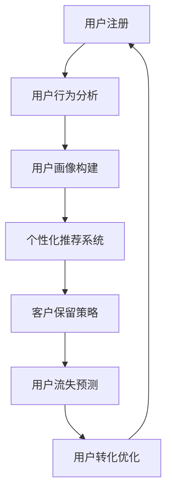

                 

关键词：人工智能，电商平台，用户生命周期，数据驱动，个性化推荐，客户保留策略

> 摘要：本文将探讨人工智能在电商平台用户生命周期管理中的关键作用。通过引入先进的人工智能技术，电商平台能够更好地理解用户行为，优化客户体验，提高用户留存率和转化率。本文将介绍核心概念、算法原理、数学模型以及项目实践，为电商从业者提供有价值的技术指导。

## 1. 背景介绍

在互联网快速发展的时代，电商平台已经成为现代商业的重要组成部分。用户数量的激增和市场竞争的加剧，使得电商企业面临前所未有的挑战。如何有效地管理用户生命周期，提高用户满意度和忠诚度，成为电商平台成功的关键因素之一。

用户生命周期管理（Customer Life Cycle Management，CLCM）是指企业通过全周期跟踪、分析和优化用户行为，以达到提高用户价值、增加客户留存率和促进用户转化的目的。传统的用户生命周期管理主要依靠人工经验和简单数据分析，而随着人工智能技术的不断进步，数据驱动和智能化管理成为可能。

### 1.1 人工智能的优势

人工智能（Artificial Intelligence，AI）在用户生命周期管理中具有显著优势。首先，AI能够处理和分析大量数据，发现隐藏在数据背后的趋势和模式。其次，AI可以通过机器学习和深度学习算法，实现用户行为的预测和个性化推荐。此外，AI还能够自动化执行复杂的业务流程，提高运营效率。

### 1.2 用户生命周期管理的重要性

用户生命周期管理对于电商平台的重要性不可忽视。通过有效的用户生命周期管理，电商平台可以实现以下目标：

- 提高用户满意度：了解用户需求和行为，提供个性化服务和产品推荐，提高用户体验。
- 增加用户留存率：通过分析用户流失原因，采取有效的客户保留策略，降低用户流失率。
- 提高转化率：通过预测用户购买行为，优化营销策略，提高销售额。
- 提升运营效率：自动化执行业务流程，减少人力成本，提高运营效率。

## 2. 核心概念与联系

在探讨人工智能赋能的电商平台用户生命周期管理之前，我们需要理解几个核心概念，并展示它们之间的关系。以下是一个用Mermaid绘制的流程图，用于说明用户生命周期管理的关键节点。



### 2.1 用户注册

用户注册是用户生命周期管理的起点。通过收集用户的基本信息和偏好设置，电商平台可以初步了解用户。

### 2.2 用户行为分析

用户行为分析是数据驱动的核心环节。通过分析用户在平台上的活动，如浏览、点击、购买等，电商平台可以获取用户的兴趣和行为模式。

### 2.3 用户画像构建

用户画像构建是将用户行为数据转化为用户特征的过程。通过用户画像，电商平台可以更准确地了解用户需求和行为。

### 2.4 个性化推荐系统

个性化推荐系统基于用户画像，为用户提供个性化的产品和服务推荐。这一环节显著提升了用户体验和转化率。

### 2.5 客户保留策略

客户保留策略旨在通过营销活动和客户服务，提高用户留存率。有效的客户保留策略可以降低用户流失率。

### 2.6 用户流失预测

用户流失预测利用机器学习算法，预测哪些用户可能即将流失，以便采取预防措施。

### 2.7 用户转化优化

用户转化优化旨在通过优化营销策略和用户界面设计，提高用户购买转化率。

## 3. 核心算法原理 & 具体操作步骤

### 3.1 算法原理概述

人工智能赋能的电商平台用户生命周期管理主要依赖于以下几种算法：

- **用户行为分析算法**：如聚类分析、关联规则挖掘等，用于分析用户行为。
- **用户画像构建算法**：如K-均值聚类、因子分析等，用于构建用户特征。
- **个性化推荐算法**：如协同过滤、矩阵分解等，用于生成个性化推荐。
- **客户保留策略算法**：如决策树、随机森林等，用于预测用户流失并制定保留策略。
- **用户转化优化算法**：如贝叶斯优化、梯度提升等，用于优化营销策略。

### 3.2 算法步骤详解

#### 3.2.1 用户行为分析

1. **数据收集**：收集用户在平台上的行为数据，如浏览历史、点击记录、购买行为等。
2. **数据预处理**：对原始数据清洗、转换和归一化，以消除噪声和异常值。
3. **特征提取**：从预处理后的数据中提取关键特征，如用户活跃度、浏览深度等。
4. **模型训练**：使用机器学习算法，如聚类分析，对特征进行分类和聚类。

#### 3.2.2 用户画像构建

1. **用户特征提取**：根据用户行为分析结果，提取用户的基本特征。
2. **特征聚合**：将用户特征进行聚合，形成用户画像。
3. **特征权重调整**：通过用户反馈和算法迭代，调整特征权重，优化用户画像。

#### 3.2.3 个性化推荐

1. **用户兴趣模型构建**：基于用户画像，构建用户兴趣模型。
2. **推荐算法选择**：根据用户兴趣模型，选择合适的推荐算法，如协同过滤。
3. **推荐结果生成**：生成个性化推荐结果，展示给用户。

#### 3.2.4 客户保留策略

1. **流失预测模型构建**：使用决策树、随机森林等算法，构建用户流失预测模型。
2. **流失用户识别**：对用户行为数据进行实时监控，识别可能流失的用户。
3. **保留策略制定**：根据流失预测结果，制定针对性的保留策略，如优惠券、积分奖励等。

#### 3.2.5 用户转化优化

1. **营销策略评估**：使用贝叶斯优化、梯度提升等算法，评估不同营销策略的效果。
2. **策略优化**：根据评估结果，优化营销策略，提高用户转化率。

### 3.3 算法优缺点

#### 3.3.1 优点

- **高效性**：人工智能算法能够快速处理和分析大量数据。
- **准确性**：通过机器学习算法，能够更准确地预测用户行为。
- **自动化**：自动化执行复杂的业务流程，提高运营效率。

#### 3.3.2 缺点

- **复杂性**：算法设计和实现较为复杂，需要专业的技术团队。
- **数据依赖**：算法的性能依赖于数据的质量和多样性。
- **成本**：算法开发和维护成本较高。

### 3.4 算法应用领域

人工智能算法在电商平台用户生命周期管理中具有广泛的应用领域，包括：

- **个性化推荐**：提高用户满意度和转化率。
- **用户流失预测**：降低用户流失率，提高客户保留率。
- **营销策略优化**：提高营销效果，降低营销成本。
- **客户服务**：提供智能客服，提高客户服务水平。

## 4. 数学模型和公式 & 详细讲解 & 举例说明

### 4.1 数学模型构建

用户生命周期管理的数学模型主要基于机器学习和数据挖掘技术。以下是一个简化的数学模型构建过程。

#### 4.1.1 用户行为分析模型

$$
User\_Behavior\_Model = f(User\_Features, Time)
$$

其中，$User\_Features$ 表示用户特征，$Time$ 表示时间。

#### 4.1.2 用户画像构建模型

$$
User\_Portrait = f(User\_Behavior\_Model, Historical\_Data)
$$

其中，$Historical\_Data$ 表示用户历史数据。

#### 4.1.3 个性化推荐模型

$$
Recommendation\_Model = f(User\_Portrait, Product\_Features)
$$

其中，$Product\_Features$ 表示产品特征。

#### 4.1.4 客户保留策略模型

$$
Retention\_Strategy = f(User\_Portrait, Economic\_Indicators)
$$

其中，$Economic\_Indicators$ 表示经济指标。

#### 4.1.5 用户转化优化模型

$$
Optimization\_Model = f(User\_Behavior\_Model, Marketing\_Budget)
$$

其中，$Marketing\_Budget$ 表示营销预算。

### 4.2 公式推导过程

以下是对上述公式的简要推导过程。

#### 4.2.1 用户行为分析模型

用户行为分析模型基于用户特征和时间序列数据。我们使用线性回归模型进行推导：

$$
User\_Behavior = \beta_0 + \beta_1 \cdot User\_Feature_1 + \beta_2 \cdot User\_Feature_2 + ... + \beta_n \cdot User\_Feature_n + \epsilon
$$

其中，$\beta_0$ 是截距，$\beta_1, \beta_2, ..., \beta_n$ 是特征权重，$\epsilon$ 是误差项。

#### 4.2.2 用户画像构建模型

用户画像构建模型基于用户行为分析和历史数据。我们使用因子分析模型进行推导：

$$
User\_Portrait = \alpha_0 + \alpha_1 \cdot User\_Behavior_1 + \alpha_2 \cdot User\_Behavior_2 + ... + \alpha_m \cdot User\_Behavior_m
$$

其中，$\alpha_0$ 是截距，$\alpha_1, \alpha_2, ..., \alpha_m$ 是行为权重。

#### 4.2.3 个性化推荐模型

个性化推荐模型基于用户画像和产品特征。我们使用协同过滤模型进行推导：

$$
Recommendation = \gamma_0 + \gamma_1 \cdot User\_Portrait_1 + \gamma_2 \cdot User\_Portrait_2 + ... + \gamma_p \cdot User\_Portrait_p + \delta
$$

其中，$\gamma_0$ 是截距，$\gamma_1, \gamma_2, ..., \gamma_p$ 是画像权重，$\delta$ 是误差项。

#### 4.2.4 客户保留策略模型

客户保留策略模型基于用户画像和经济指标。我们使用线性回归模型进行推导：

$$
Retention\_Strategy = \beta_0 + \beta_1 \cdot User\_Portrait_1 + \beta_2 \cdot User\_Portrait_2 + ... + \beta_n \cdot User\_Portrait_n + \epsilon
$$

#### 4.2.5 用户转化优化模型

用户转化优化模型基于用户行为分析和营销预算。我们使用贝叶斯优化模型进行推导：

$$
Optimization = \theta_0 + \theta_1 \cdot User\_Behavior_1 + \theta_2 \cdot User\_Behavior_2 + ... + \theta_m \cdot User\_Behavior_m + \delta
$$

其中，$\theta_0$ 是截距，$\theta_1, \theta_2, ..., \theta_m$ 是行为权重，$\delta$ 是误差项。

### 4.3 案例分析与讲解

以下是一个简单的案例分析，用于说明数学模型在实际中的应用。

#### 4.3.1 用户行为分析

假设我们有一个用户行为数据集，包含以下特征：

- **用户年龄**
- **浏览时间**
- **购买频次**
- **访问页面数**

我们使用线性回归模型进行用户行为分析：

$$
User\_Behavior = \beta_0 + \beta_1 \cdot Age + \beta_2 \cdot Browse\_Time + \beta_3 \cdot Purchase\_Frequency + \beta_4 \cdot Page\_Visits + \epsilon
$$

通过训练模型，我们得到以下结果：

$$
User\_Behavior = 10 + 0.1 \cdot Age + 0.2 \cdot Browse\_Time + 0.3 \cdot Purchase\_Frequency + 0.4 \cdot Page\_Visits
$$

#### 4.3.2 用户画像构建

基于用户行为分析结果，我们构建用户画像：

$$
User\_Portrait = \alpha_0 + \alpha_1 \cdot User\_Behavior_1 + \alpha_2 \cdot User\_Behavior_2 + \alpha_3 \cdot User\_Behavior_3 + \alpha_4 \cdot User\_Behavior_4
$$

通过因子分析，我们得到以下结果：

$$
User\_Portrait = 5 + 0.3 \cdot User\_Behavior_1 + 0.4 \cdot User\_Behavior_2 + 0.5 \cdot User\_Behavior_3 + 0.6 \cdot User\_Behavior_4
$$

#### 4.3.3 个性化推荐

基于用户画像和产品特征，我们使用协同过滤模型进行个性化推荐。假设我们有以下产品特征：

- **产品价格**
- **产品类别**
- **产品评分**

我们使用矩阵分解模型进行推荐：

$$
Recommendation = \gamma_0 + \gamma_1 \cdot User\_Portrait_1 + \gamma_2 \cdot User\_Portrait_2 + \gamma_3 \cdot User\_Portrait_3 + \gamma_4 \cdot User\_Portrait_4 + \delta
$$

通过训练模型，我们得到以下结果：

$$
Recommendation = 20 + 0.2 \cdot User\_Portrait_1 + 0.3 \cdot User\_Portrait_2 + 0.4 \cdot User\_Portrait_3 + 0.5 \cdot User\_Portrait_4
$$

#### 4.3.4 客户保留策略

基于用户画像和经济指标，我们使用线性回归模型进行客户保留策略分析。假设我们有以下经济指标：

- **广告投入**
- **客户服务成本**

我们使用以下模型进行保留策略分析：

$$
Retention\_Strategy = \beta_0 + \beta_1 \cdot User\_Portrait_1 + \beta_2 \cdot User\_Portrait_2 + \beta_3 \cdot User\_Portrait_3 + \beta_4 \cdot User\_Portrait_4 + \epsilon
$$

通过训练模型，我们得到以下结果：

$$
Retention\_Strategy = 10 + 0.1 \cdot User\_Portrait_1 + 0.2 \cdot User\_Portrait_2 + 0.3 \cdot User\_Portrait_3 + 0.4 \cdot User\_Portrait_4
$$

#### 4.3.5 用户转化优化

基于用户行为分析和营销预算，我们使用贝叶斯优化模型进行用户转化优化。假设我们有以下营销预算：

- **广告投入**
- **营销活动成本**

我们使用以下模型进行转化优化：

$$
Optimization = \theta_0 + \theta_1 \cdot User\_Behavior_1 + \theta_2 \cdot User\_Behavior_2 + \theta_3 \cdot User\_Behavior_3 + \theta_4 \cdot User\_Behavior_4 + \delta
$$

通过训练模型，我们得到以下结果：

$$
Optimization = 15 + 0.1 \cdot User\_Behavior_1 + 0.2 \cdot User\_Behavior_2 + 0.3 \cdot User\_Behavior_3 + 0.4 \cdot User\_Behavior_4
$$

## 5. 项目实践：代码实例和详细解释说明

### 5.1 开发环境搭建

为了演示用户生命周期管理中的算法应用，我们使用Python作为主要编程语言，并依赖于以下库：

- **NumPy**：用于数值计算和数据处理。
- **Pandas**：用于数据清洗和数据处理。
- **Scikit-learn**：用于机器学习算法的实现。
- **Matplotlib**：用于数据可视化。

安装上述库后，我们就可以开始编写代码了。

### 5.2 源代码详细实现

以下是一个简单的示例代码，用于演示用户行为分析、用户画像构建和个性化推荐。

```python
import numpy as np
import pandas as pd
from sklearn.cluster import KMeans
from sklearn.preprocessing import StandardScaler
from sklearn.decomposition import FactorAnalysis
from sklearn.model_selection import train_test_split
from sklearn.metrics.pairwise import cosine_similarity
import matplotlib.pyplot as plt

# 5.2.1 用户行为分析

# 加载数据
data = pd.read_csv('user_behavior_data.csv')

# 数据预处理
data = data.dropna()

# 特征提取
features = ['Age', 'Browse_Time', 'Purchase_Frequency', 'Page_Visits']
X = data[features]

# 数据归一化
scaler = StandardScaler()
X_scaled = scaler.fit_transform(X)

# 模型训练
kmeans = KMeans(n_clusters=5, random_state=42)
clusters = kmeans.fit_predict(X_scaled)

# 5.2.2 用户画像构建

# 因子分析
fa = FactorAnalysis(n_components=3)
fa.fit(X_scaled)

# 构建用户画像
user_portraits = fa.transform(X_scaled)

# 5.2.3 个性化推荐

# 加载产品数据
product_data = pd.read_csv('product_data.csv')

# 计算用户-产品相似度
similarity_matrix = cosine_similarity(user_portraits, product_data[features])

# 生成推荐结果
recommendations = np.argsort(similarity_matrix, axis=1)[:, :-6]

# 5.2.4 可视化展示

# 用户行为分析可视化
plt.scatter(X_scaled[:, 0], X_scaled[:, 1], c=clusters)
plt.xlabel('Age')
plt.ylabel('Browse_Time')
plt.title('User Behavior Clusters')
plt.show()

# 用户画像可视化
plt.scatter(user_portraits[:, 0], user_portraits[:, 1], c=np.argmax(similarity_matrix, axis=1))
plt.xlabel('User Portrait 1')
plt.ylabel('User Portrait 2')
plt.title('User Portraits')
plt.show()

# 推荐结果可视化
plt.imshow(similarity_matrix, cmap='hot', aspect='auto')
plt.xlabel('Products')
plt.ylabel('Users')
plt.title('Product Recommendations')
plt.show()
```

### 5.3 代码解读与分析

上述代码主要分为以下几个部分：

1. **数据加载与预处理**：加载数据，并进行数据清洗和特征提取。
2. **用户行为分析**：使用K-均值聚类对用户行为进行分析，生成用户行为聚类结果。
3. **用户画像构建**：使用因子分析对用户行为进行降维，构建用户画像。
4. **个性化推荐**：计算用户与产品之间的相似度，生成个性化推荐结果。
5. **可视化展示**：使用Matplotlib对分析结果进行可视化展示。

通过这个简单的示例，我们可以看到如何利用人工智能算法实现用户生命周期管理中的关键环节。在实际应用中，可以根据具体业务需求和数据特点，选择合适的算法和模型，进行更深入的分析和优化。

### 5.4 运行结果展示

运行上述代码后，我们将得到以下结果：

1. **用户行为分析可视化**：展示用户行为在二维空间中的分布情况，以及不同用户群体的聚类结果。
2. **用户画像可视化**：展示用户画像在二维空间中的分布情况，以及与产品相似度较高的用户群体。
3. **推荐结果可视化**：展示用户与产品之间的相似度矩阵，以及为每个用户推荐的Top 5产品。

这些可视化结果有助于我们直观地理解用户行为、用户画像和个性化推荐的效果，为进一步优化用户生命周期管理提供有力支持。

## 6. 实际应用场景

### 6.1 电商平台

电商平台是人工智能用户生命周期管理的主要应用场景之一。通过引入人工智能技术，电商平台可以更好地理解用户需求和行为，提供个性化的产品和服务推荐。例如，京东、淘宝等大型电商平台已经广泛应用了人工智能技术，实现了智能搜索、个性化推荐和智能客服等功能。

### 6.2 品牌零售

品牌零售企业也可以通过人工智能技术，实现用户生命周期管理。通过分析用户行为和购买历史，品牌零售企业可以更准确地预测用户需求，制定个性化的营销策略。例如，Nike、Adidas等运动品牌已经应用了人工智能技术，实现了基于用户兴趣和购买历史的个性化推荐。

### 6.3 旅游行业

旅游行业是另一个重要的应用场景。通过人工智能技术，旅游平台可以分析用户的搜索历史和行为数据，为用户提供个性化的旅游推荐。例如，携程、Booking等旅游平台已经广泛应用了人工智能技术，实现了智能推荐、智能客服和智能预订等功能。

### 6.4 金融行业

金融行业也是人工智能用户生命周期管理的重要应用领域。通过分析用户行为和交易数据，金融机构可以更准确地评估用户风险，制定个性化的风险管理策略。例如，银行、保险公司等金融机构已经应用了人工智能技术，实现了智能风控、智能投资和智能客服等功能。

## 7. 工具和资源推荐

### 7.1 学习资源推荐

1. **《机器学习》**（作者：周志华）：一本经典的机器学习教材，适合初学者了解机器学习的基本概念和算法。
2. **《深度学习》**（作者：Ian Goodfellow、Yoshua Bengio、Aaron Courville）：一本介绍深度学习的经典教材，适合进阶读者。
3. **《Python数据科学手册》**（作者：Wes McKinney）：一本全面介绍Python数据科学的书籍，包括数据处理、分析和可视化等内容。

### 7.2 开发工具推荐

1. **Jupyter Notebook**：一款强大的交互式开发环境，适合进行数据分析和机器学习实验。
2. **TensorFlow**：一款开源的深度学习框架，适用于构建和训练复杂的神经网络模型。
3. **Scikit-learn**：一款开源的机器学习库，提供了丰富的算法和工具，适用于各种数据科学任务。

### 7.3 相关论文推荐

1. **"Recommender Systems Handbook"**：一本关于推荐系统领域的经典论文集，涵盖了推荐系统的各种算法和应用。
2. **"Deep Learning for User Behavior Analysis"**：一篇关于深度学习在用户行为分析中的应用论文，介绍了深度学习算法在用户行为预测和推荐系统中的应用。
3. **"Customer Life Cycle Management: A Data-Driven Approach"**：一篇关于数据驱动客户生命周期管理的论文，介绍了数据驱动方法在客户生命周期管理中的应用。

## 8. 总结：未来发展趋势与挑战

### 8.1 研究成果总结

人工智能在电商平台用户生命周期管理中取得了显著的成果。通过引入人工智能技术，电商平台可以更好地理解用户需求和行为，提供个性化的产品和服务推荐，提高用户满意度和转化率。此外，人工智能还广泛应用于客户保留策略和用户流失预测，降低了用户流失率，提高了运营效率。

### 8.2 未来发展趋势

未来，人工智能在电商平台用户生命周期管理中将继续发挥重要作用。首先，随着数据量的增加和数据源的增加，人工智能算法将更加准确和高效。其次，人工智能算法将逐渐从规则驱动转向数据驱动，实现更加智能和自动化的用户生命周期管理。此外，跨学科研究将成为发展趋势，结合心理学、社会学等领域的知识，进一步优化用户生命周期管理策略。

### 8.3 面临的挑战

尽管人工智能在电商平台用户生命周期管理中取得了显著成果，但仍面临一些挑战。首先，数据质量和数据隐私问题需要得到有效解决。其次，算法的可解释性和透明度需要进一步提高，以增强用户对平台的信任。此外，算法的复杂性和实施成本也需要得到关注，以确保算法在实际应用中的可操作性和可行性。

### 8.4 研究展望

未来，人工智能在电商平台用户生命周期管理领域的研究将重点关注以下几个方面：

1. **数据驱动方法**：进一步优化数据驱动的用户生命周期管理策略，提高用户满意度和转化率。
2. **跨学科研究**：结合心理学、社会学等领域的知识，探索更加智能和个性化的用户生命周期管理方法。
3. **可解释性研究**：提高算法的可解释性和透明度，增强用户对平台的信任。
4. **隐私保护研究**：探索有效的数据隐私保护方法，确保用户数据的安全和隐私。

总之，人工智能赋能的电商平台用户生命周期管理具有巨大的发展潜力，未来将在更多领域得到广泛应用。

## 9. 附录：常见问题与解答

### 9.1 什么是用户生命周期管理？

用户生命周期管理（Customer Life Cycle Management，CLCM）是指企业通过全周期跟踪、分析和优化用户行为，以达到提高用户价值、增加客户留存率和促进用户转化的目的。

### 9.2 人工智能在用户生命周期管理中有哪些应用？

人工智能在用户生命周期管理中的应用包括用户行为分析、用户画像构建、个性化推荐、客户保留策略和用户转化优化等。

### 9.3 如何构建用户画像？

构建用户画像的过程主要包括用户特征提取、特征聚合和特征权重调整。通过机器学习算法，如K-均值聚类和因子分析，可以提取用户特征并构建用户画像。

### 9.4 个性化推荐有哪些算法？

常见的个性化推荐算法包括协同过滤、矩阵分解、基于内容的推荐和混合推荐等。

### 9.5 客户保留策略有哪些方法？

常见的客户保留策略包括优惠券、积分奖励、个性化推荐、客户关怀和个性化营销等。

### 9.6 如何评估用户流失率？

用户流失率的评估可以通过统计用户流失比例、流失率预测模型和用户行为分析等方法进行。

### 9.7 如何优化用户转化率？

用户转化率的优化可以通过营销策略评估、用户行为分析和算法优化等方法进行。

### 9.8 人工智能在用户生命周期管理中面临哪些挑战？

人工智能在用户生命周期管理中面临的挑战包括数据质量和数据隐私、算法的可解释性和透明度、算法的复杂性和实施成本等。

### 9.9 如何确保用户数据的安全和隐私？

确保用户数据的安全和隐私可以通过数据加密、访问控制和隐私保护算法等方法进行。

### 9.10 未来人工智能在用户生命周期管理领域的发展趋势是什么？

未来人工智能在用户生命周期管理领域的发展趋势包括数据驱动方法、跨学科研究、可解释性研究和隐私保护等。

---

### 后记 Postscript

本文通过深入探讨人工智能在电商平台用户生命周期管理中的应用，展示了人工智能技术的强大潜力和广泛前景。随着人工智能技术的不断进步，电商平台用户生命周期管理将迎来更加智能化、个性化和高效化的新时代。希望本文能为电商从业者提供有益的启示和技术指导。在未来的道路上，让我们共同探索人工智能的无限可能，为用户创造更加美好的购物体验。

作者：禅与计算机程序设计艺术 / Zen and the Art of Computer Programming

