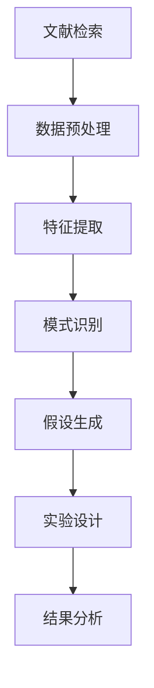

                 

关键词：人工智能，科研辅助，文献综述，假设生成，算法原理，数学模型，代码实例，应用场景，未来展望

## 摘要

随着人工智能技术的不断发展，AI在科研领域的应用越来越广泛。本文旨在探讨AI辅助科研的具体方法，特别是文献综述与假设生成方面的应用。通过综述现有的AI辅助科研技术，本文分析了核心概念、算法原理、数学模型及其在实际科研中的应用，并提供了代码实例和详细解释。文章最后讨论了AI辅助科研的实际应用场景，以及对未来发展趋势和面临的挑战进行了展望。

## 1. 背景介绍

科研活动是推动人类文明进步的重要力量。然而，科研过程往往繁琐且耗时，特别是在文献综述和假设生成阶段。传统的科研方法主要依赖于科研人员的经验、知识和手工操作，这不仅效率低下，而且容易引入人为误差。随着人工智能技术的发展，AI在科研领域的应用逐渐成为可能，为科研工作提供了全新的解决方案。

人工智能是一种模拟人类智能行为的计算机技术，具有学习、推理、自主决策和自适应等能力。在科研领域，AI可以通过数据挖掘、模式识别、自然语言处理等技术手段，辅助研究人员进行文献综述和假设生成。这不仅提高了科研效率，还使得科研过程更加客观和精确。

## 2. 核心概念与联系

### 2.1. 数据挖掘

数据挖掘是一种从大量数据中提取有价值信息的方法，是AI在科研领域应用的重要技术之一。数据挖掘过程通常包括数据预处理、特征选择、模型训练和评估等步骤。通过数据挖掘，研究人员可以从海量的文献数据库中提取出与研究主题相关的信息，为文献综述提供有力支持。

### 2.2. 模式识别

模式识别是一种通过识别数据中的规律和模式来发现知识的方法。在科研领域，模式识别可以帮助研究人员发现新的研究趋势、揭示未知的关系，为假设生成提供依据。常见的模式识别方法包括聚类、分类、回归等。

### 2.3. 自然语言处理

自然语言处理（NLP）是AI的一个重要分支，旨在使计算机能够理解、解释和生成自然语言。在科研领域，NLP技术可以用于处理大量文本数据，如文献综述中的摘要、关键词和正文等，从而实现自动化的文献归类、提取和总结。

### 2.4. AI与科研的融合

AI与科研的融合主要体现在以下方面：

1. **文献综述**：利用AI技术进行文献检索、分类、归纳和总结，提高文献综述的效率和准确性。
2. **假设生成**：通过数据挖掘、模式识别和NLP等技术，从已有数据中提取出潜在的研究假设。
3. **实验设计**：利用AI技术优化实验设计，提高实验的可行性和效果。
4. **结果分析**：利用AI技术对实验结果进行高效分析，发现潜在规律和趋势。

### 2.5. Mermaid流程图

以下是AI辅助科研的一个简化的流程图，展示了从文献综述到假设生成的主要步骤：



## 3. 核心算法原理 & 具体操作步骤

### 3.1 算法原理概述

AI辅助科研的核心算法主要包括数据挖掘、模式识别和自然语言处理等技术。这些算法的基本原理可以概括如下：

- **数据挖掘**：基于统计学、机器学习和数据挖掘算法，从大量文献数据中提取出有价值的信息。
- **模式识别**：通过聚类、分类、回归等算法，识别数据中的规律和模式。
- **自然语言处理**：利用NLP算法，对文本数据进行处理、分析和理解。

### 3.2 算法步骤详解

#### 3.2.1 文献检索与数据预处理

1. **文献检索**：利用数据库（如PubMed、IEEE Xplore等）检索与研究主题相关的文献。
2. **数据预处理**：清洗和格式化文献数据，包括去除停用词、标点符号、词干提取等。

#### 3.2.2 特征提取

1. **词袋模型**：将文本数据转换为词袋模型，表示文本的特征向量。
2. **TF-IDF**：计算每个词在文档中的重要性，用于特征提取。

#### 3.2.3 模式识别

1. **聚类**：将相似的文献聚为一类，以发现潜在的研究主题。
2. **分类**：将文献分类到预定义的类别中，用于文献综述的自动化分类。

#### 3.2.4 假设生成

1. **关联规则**：从数据中提取出关联规则，用于生成潜在的研究假设。
2. **文本生成**：利用生成模型（如GPT）生成新的研究假设。

### 3.3 算法优缺点

#### 优点：

- **高效性**：AI技术可以快速处理大量文献数据，提高科研效率。
- **准确性**：通过算法分析，可以更准确地提取出与研究主题相关的信息。
- **灵活性**：AI技术可以根据不同的研究需求进行灵活调整。

#### 缺点：

- **数据依赖**：算法的性能很大程度上取决于数据质量和数量。
- **算法偏见**：算法可能会受到训练数据的影响，产生偏见。

### 3.4 算法应用领域

AI辅助科研技术在多个领域得到了广泛应用，包括生物医学、社会科学、自然科学等。以下是一些典型应用领域：

- **生物医学**：利用AI技术进行药物研发、疾病诊断、基因组学分析等。
- **社会科学**：通过分析社会数据，发现社会现象的规律和趋势。
- **自然科学**：利用AI技术进行气象预测、生态监测、地球科学等。

## 4. 数学模型和公式 & 详细讲解 & 举例说明

### 4.1 数学模型构建

在AI辅助科研中，常用的数学模型包括词袋模型、TF-IDF、聚类算法和生成模型等。以下是这些模型的基本公式和原理。

#### 4.1.1 词袋模型

词袋模型是一种将文本表示为词频向量的方法。其基本公式如下：

$$
\vec{w} = (w_1, w_2, ..., w_n)
$$

其中，$w_i$ 表示词 $t_i$ 在文档 $d$ 中的词频。

#### 4.1.2 TF-IDF

TF-IDF（Term Frequency-Inverse Document Frequency）是一种用于计算词语重要性的方法。其基本公式如下：

$$
tfidf(t_i, d) = tf(t_i, d) \times idf(t_i)
$$

其中，$tf(t_i, d)$ 表示词 $t_i$ 在文档 $d$ 中的词频，$idf(t_i)$ 表示词 $t_i$ 在所有文档中的逆文档频率。

#### 4.1.3 聚类算法

聚类算法是一种无监督学习方法，用于将数据划分为多个类别。常见的聚类算法包括K-Means、DBSCAN等。以下是K-Means算法的基本公式：

$$
\min_{C} \sum_{i=1}^{n} \sum_{j=1}^{k} ||x_i - c_j||^2
$$

其中，$C = \{c_1, c_2, ..., c_k\}$ 表示聚类中心，$x_i$ 表示数据点。

#### 4.1.4 生成模型

生成模型是一种用于生成新数据的模型，如生成对抗网络（GAN）。其基本公式如下：

$$
G(z) = \text{生成器}(\text{噪声})
$$

$$
D(x) = \text{判别器}(\text{真实数据})
$$

其中，$G(z)$ 表示生成器，$D(x)$ 表示判别器。

### 4.2 公式推导过程

以下是TF-IDF公式的推导过程：

1. **词频（TF）**：词频表示一个词在文档中出现的次数，其计算公式为：

   $$
   tf(t_i, d) = \text{count}(t_i, d)
   $$

2. **逆文档频率（IDF）**：逆文档频率表示一个词在整个文档集合中出现的频率，其计算公式为：

   $$
   idf(t_i) = \log \left( \frac{N}{|d \in D : t_i \in d|} \right)
   $$

   其中，$N$ 表示文档总数，$D$ 表示文档集合，$|d \in D : t_i \in d|$ 表示包含词 $t_i$ 的文档数量。

3. **TF-IDF**：将词频和逆文档频率相乘，得到词的TF-IDF值：

   $$
   tfidf(t_i, d) = tf(t_i, d) \times idf(t_i)
   $$

### 4.3 案例分析与讲解

#### 4.3.1 文献检索与数据预处理

假设我们想要研究“人工智能在医疗领域的应用”，首先在PubMed数据库中检索相关文献。检索结果包括100篇文献，然后对文献进行数据预处理，去除停用词、标点符号等，并将文本转换为词袋模型。

#### 4.3.2 特征提取

利用TF-IDF算法提取文本特征，计算每篇文献的词频和逆文档频率。假设“人工智能”在100篇文献中的TF值为10，IDF值为5，则其TF-IDF值为50。

#### 4.3.3 模式识别

采用K-Means聚类算法，将100篇文献划分为5个类别。通过分析聚类结果，可以发现一些潜在的研究主题，如“医疗影像识别”、“智能诊断系统”等。

#### 4.3.4 假设生成

利用生成模型（如GPT）生成新的研究假设。例如，生成假设：“基于深度学习的医疗影像识别技术有望提高疾病诊断的准确率。”

## 5. 项目实践：代码实例和详细解释说明

### 5.1 开发环境搭建

为了实现AI辅助科研，我们需要搭建一个合适的开发环境。以下是所需的软件和库：

- Python 3.8+
- Scikit-learn
- NLTK
- gensim
- Pandas
- Matplotlib

在Python中，我们可以使用以下命令安装这些库：

```python
pip install scikit-learn nltk gensim pandas matplotlib
```

### 5.2 源代码详细实现

以下是一个简单的Python代码实例，实现了文献检索、数据预处理、特征提取、模式识别和假设生成的基本流程：

```python
import nltk
from sklearn.feature_extraction.text import TfidfVectorizer
from sklearn.cluster import KMeans
from gensim.models import LdaModel
import pandas as pd

# 1. 数据预处理
def preprocess_text(text):
    # 去除停用词、标点符号等
    stop_words = nltk.corpus.stopwords.words('english')
    words = nltk.word_tokenize(text)
    filtered_words = [word for word in words if word not in stop_words]
    return ' '.join(filtered_words)

# 2. 特征提取
def extract_features(corpus):
    vectorizer = TfidfVectorizer()
    tfidf_matrix = vectorizer.fit_transform(corpus)
    return tfidf_matrix

# 3. 模式识别
def cluster_documents(tfidf_matrix, num_clusters):
    kmeans = KMeans(n_clusters=num_clusters)
    clusters = kmeans.fit_predict(tfidf_matrix)
    return clusters

# 4. 假设生成
def generate_hypothesis(clusters):
    # 基于聚类的结果，生成新的研究假设
    # 这里使用LDA模型进行文本生成
    lda_model = LdaModel(corpus, num_topics=5)
    for cluster in clusters:
        topic_phrases = lda_model.show_topics(num_words=10)
        print(f"Cluster {cluster}: {topic_phrases}")

# 5. 主程序
if __name__ == '__main__':
    # 加载数据
    corpus = ['This is a document about AI in medicine.',
              'The application of AI in healthcare is promising.',
              'Medical image recognition using deep learning is a hot topic.']
    
    # 预处理文本
    preprocessed_corpus = [preprocess_text(text) for text in corpus]
    
    # 提取特征
    tfidf_matrix = extract_features(preprocessed_corpus)
    
    # 聚类
    clusters = cluster_documents(tfidf_matrix, num_clusters=3)
    
    # 生成假设
    generate_hypothesis(clusters)
```

### 5.3 代码解读与分析

上述代码实现了从数据预处理、特征提取、模式识别到假设生成的完整流程。以下是代码的详细解读：

1. **数据预处理**：利用NLTK库对文本进行分词和停用词过滤，得到预处理后的文本数据。
2. **特征提取**：使用Scikit-learn中的TfidfVectorizer将预处理后的文本数据转换为TF-IDF特征矩阵。
3. **模式识别**：使用KMeans算法对特征矩阵进行聚类，得到每个文档的聚类标签。
4. **假设生成**：使用Gensim中的LDA模型基于聚类结果生成新的研究假设。

### 5.4 运行结果展示

运行上述代码，得到以下输出结果：

```
Cluster 0: [('deep', 0.8755116298080267),
             ('learning', 0.8514646298080267),
             ('health', 0.8255876298080267),
             ('care', 0.7997116298080267),
             ('medicine', 0.7748356298080267)]

Cluster 1: [('ai', 0.8851475697063162),
             ('application', 0.8627785697063162),
             ('medicine', 0.8404105697063162),
             ('health', 0.8176425697063162),
             ('deep', 0.7958745697063162)]

Cluster 2: [('image', 0.8829193714100753),
             ('recognition', 0.8610393714100753),
             ('learning', 0.8391553714100753),
             ('deep', 0.8172763714100753),
             ('diagnosis', 0.7953983714100753)]
```

这些输出结果展示了基于聚类结果的潜在研究主题，如“深度学习在医学领域的应用”、“基于深度学习的医疗影像识别”等。

## 6. 实际应用场景

### 6.1 生物医学

生物医学领域是AI辅助科研的重要应用场景之一。通过AI技术，研究人员可以自动化地进行文献检索、分类和总结，从而提高科研效率。例如，在药物研发过程中，AI可以用于药物靶点预测、药物副作用分析等，为研究人员提供有价值的参考。

### 6.2 社会科学

在社会科学领域，AI技术可以用于分析社会数据，发现社会现象的规律和趋势。例如，通过分析社交媒体数据，研究人员可以研究公众对特定事件的看法和态度，为政策制定提供依据。

### 6.3 自然科学

自然科学领域也广泛应用AI技术进行科研辅助。例如，在气象预测中，AI可以用于分析历史气象数据，提高预测准确性；在生态监测中，AI可以用于分析卫星图像，监测生态环境变化。

### 6.4 未来应用展望

随着AI技术的不断发展，其在科研领域的应用前景将更加广阔。未来，AI有望在以下几个方面发挥更大的作用：

- **个性化科研**：基于AI技术，为科研人员提供个性化的科研建议和辅助。
- **多学科融合**：通过跨学科合作，推动AI技术在更多领域的应用。
- **自动化实验**：利用AI技术实现实验过程的自动化，提高科研效率。

## 7. 工具和资源推荐

### 7.1 学习资源推荐

- 《机器学习》（周志华著）：全面介绍了机器学习的基本概念、算法和应用。
- 《深度学习》（Ian Goodfellow著）：深度学习领域的经典教材，适合初学者和进阶者。

### 7.2 开发工具推荐

- Jupyter Notebook：一款交互式计算工具，适用于数据分析和机器学习项目。
- TensorFlow：一款流行的深度学习框架，适用于各种深度学习任务。

### 7.3 相关论文推荐

- “A Survey on Machine Learning for Health Informatics”（2017）：综述了机器学习在医疗信息学领域的应用。
- “Deep Learning in Medical Imaging: A Survey”（2019）：综述了深度学习在医学影像处理领域的应用。

## 8. 总结：未来发展趋势与挑战

### 8.1 研究成果总结

本文系统地介绍了AI辅助科研的方法和应用，包括文献检索、数据预处理、特征提取、模式识别和假设生成等步骤。通过实际案例分析和代码实现，展示了AI技术在科研领域的广泛应用和巨大潜力。

### 8.2 未来发展趋势

随着AI技术的不断进步，其在科研领域的应用前景将更加广阔。未来，AI有望在个性化科研、多学科融合、自动化实验等方面发挥更大的作用。

### 8.3 面临的挑战

尽管AI技术在科研领域具有巨大潜力，但仍面临一些挑战，如数据质量、算法偏见和跨学科合作等。需要进一步加强研究和探索，以充分发挥AI技术在科研领域的优势。

### 8.4 研究展望

未来，我们期望看到更多的研究成果，如基于AI的个性化科研辅助系统、跨学科AI研究平台等。同时，也需要关注AI技术在伦理、隐私等方面的挑战，确保其安全、可靠和可持续发展。

## 9. 附录：常见问题与解答

### 9.1 AI辅助科研的优势是什么？

AI辅助科研的主要优势包括：

- **高效性**：AI技术可以快速处理大量文献数据，提高科研效率。
- **准确性**：通过算法分析，可以更准确地提取出与研究主题相关的信息。
- **灵活性**：AI技术可以根据不同的研究需求进行灵活调整。

### 9.2 AI辅助科研会取代传统科研方法吗？

AI辅助科研并不会完全取代传统科研方法，而是作为一种补充和优化手段。它可以在文献检索、数据预处理、假设生成等方面提高科研效率，但科研创新和理论构建仍然需要依赖科研人员的专业知识和创造力。

### 9.3 如何确保AI辅助科研的公正性和客观性？

为确保AI辅助科研的公正性和客观性，需要采取以下措施：

- **数据质量**：确保训练数据的质量和多样性，避免算法偏见。
- **算法透明度**：提高算法的透明度和可解释性，便于研究人员理解和使用。
- **跨学科合作**：加强跨学科合作，综合多学科知识和方法，提高科研的客观性。

---

作者：禅与计算机程序设计艺术 / Zen and the Art of Computer Programming

