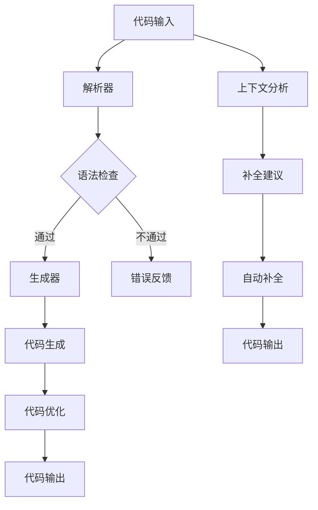

                 

关键词：人工智能、编程、代码生成、自动补全、编程助手、代码优化、开发效率、软件开发

> 摘要：本文将深入探讨人工智能在编程领域的应用，特别是在代码生成和自动补全方面的进展。我们将详细分析AI辅助编程的核心概念、算法原理、数学模型，并通过实际项目案例展示其应用效果，旨在为开发者提供有价值的参考和未来展望。

## 1. 背景介绍

在软件开发领域，代码生成和自动补全技术已经成为提高开发效率和代码质量的重要工具。随着人工智能技术的快速发展，AI在编程领域的应用也逐渐受到关注。通过机器学习、自然语言处理、代码模式识别等技术，AI能够分析和理解编程语言，生成高质量的代码，甚至自动完成代码的编写。这一变革性的技术不仅极大地提高了开发者的工作效率，还有助于减少错误，提升代码的可维护性和可读性。

### 当前编程领域的挑战

- **代码复杂度增加**：现代软件开发面临日益复杂的编程场景，开发者需要处理大量的代码和复杂的逻辑。
- **重复劳动**：开发者常常需要编写大量重复性的代码，这不仅浪费时间和精力，还容易引入错误。
- **错误率**：手动编写的代码容易出现语法错误、逻辑错误等，这些错误可能会在代码运行时导致严重问题。

### AI辅助编程的意义

- **提高开发效率**：通过自动生成和补全代码，开发者可以更快速地完成开发任务。
- **减少错误**：AI能够识别和避免常见的编程错误，提高代码质量。
- **个性化编程**：AI可以根据开发者的编程习惯和偏好提供个性化的代码补全建议。
- **增强协作**：AI辅助编程有助于团队成员之间的协作，通过共享代码生成和补全的智能工具，提高团队的整体开发效率。

## 2. 核心概念与联系

### 2.1 代码生成

代码生成是指利用人工智能技术自动生成代码的过程。它通过学习大量的代码库和编程模式，理解编程语言的语法和语义，从而生成符合要求的代码。代码生成技术可以应用于各种编程场景，如前端框架、后端服务、数据转换等。

### 2.2 自动补全

自动补全是指利用人工智能技术自动完成代码编写的功能。它通过分析当前编写代码的上下文，预测开发者可能需要完成的代码片段，并提供自动补全建议。自动补全技术可以显著提高开发者的编码速度和准确性。

### 2.3 Mermaid 流程图

为了更好地理解代码生成与自动补全的原理和架构，我们可以使用Mermaid绘制一个简化的流程图。



### 2.4 核心概念的联系

- **代码生成**和**自动补全**都依赖于对代码上下文的理解和编程语言模式的学习。
- **生成器**和**补全建议**都旨在提高开发效率和代码质量。
- **代码优化**在代码生成和自动补全过程中扮演关键角色，通过优化代码结构，提高代码的可读性和可维护性。

## 3. 核心算法原理 & 具体操作步骤

### 3.1 算法原理概述

AI辅助编程的核心算法主要基于深度学习和自然语言处理技术。具体包括以下几个步骤：

1. **数据预处理**：收集大量的代码样本，并进行预处理，如去除无关信息、分词、语法分析等。
2. **模型训练**：利用预处理的代码数据，通过神经网络模型（如Transformer、BERT等）进行训练，使其能够理解和生成代码。
3. **代码生成**：根据输入的代码上下文，模型预测下一步的代码片段，并生成完整的代码。
4. **代码优化**：对生成的代码进行优化，提高其可读性和可维护性。
5. **自动补全**：分析当前编写的代码上下文，提供可能的补全建议。

### 3.2 算法步骤详解

#### 3.2.1 数据预处理

数据预处理是AI辅助编程的基础。具体步骤包括：

- **去噪**：去除代码中的注释、空格、多余的符号等。
- **分词**：将代码拆分成基本元素（如关键字、变量名、操作符等）。
- **语法分析**：对代码进行语法分析，构建抽象语法树（AST）。

#### 3.2.2 模型训练

模型训练是算法的核心。以下是模型训练的主要步骤：

- **数据集准备**：从开源代码库、企业代码库等收集大量代码样本，并进行预处理。
- **模型选择**：选择合适的深度学习模型（如Transformer、BERT等）。
- **训练**：利用预处理后的代码数据，通过反向传播算法对模型进行训练。
- **验证**：在验证集上测试模型的性能，调整模型参数，提高模型准确率。

#### 3.2.3 代码生成

代码生成是根据输入的代码上下文生成代码的过程。以下是代码生成的主要步骤：

- **上下文分析**：对输入的代码上下文进行语法分析，提取关键信息。
- **代码片段预测**：利用训练好的模型，预测下一步的代码片段。
- **代码生成**：将预测的代码片段组合成完整的代码。

#### 3.2.4 代码优化

代码优化是对生成的代码进行优化，以提高其可读性和可维护性。以下是代码优化的主要步骤：

- **代码审查**：对生成的代码进行审查，识别可能的优化点。
- **代码重构**：根据审查结果，对代码进行重构，提高其结构性和可读性。
- **代码测试**：对优化后的代码进行测试，确保其功能正确性。

#### 3.2.5 自动补全

自动补全是根据当前编写的代码上下文，提供可能的补全建议。以下是自动补全的主要步骤：

- **上下文分析**：对当前编写的代码上下文进行语法分析，提取关键信息。
- **补全建议生成**：利用训练好的模型，生成可能的补全建议。
- **补全建议排序**：根据上下文信息和代码习惯，对补全建议进行排序，提供最合适的建议。

### 3.3 算法优缺点

#### 优点

- **高效性**：AI辅助编程能够显著提高开发效率和代码质量。
- **智能化**：通过深度学习和自然语言处理技术，AI能够理解和生成符合编程规范的代码。
- **个性化**：AI可以根据开发者的编程习惯和偏好提供个性化的代码补全建议。

#### 缺点

- **初始投入**：AI辅助编程需要大量的训练数据和计算资源，初始投入较高。
- **准确率**：尽管AI辅助编程的准确率逐渐提高，但仍然存在一定的错误率。
- **依赖性**：过度依赖AI辅助编程可能会降低开发者的编程技能和解决问题的能力。

### 3.4 算法应用领域

AI辅助编程技术可以广泛应用于各种编程领域，包括但不限于：

- **前端开发**：自动生成和优化HTML、CSS、JavaScript代码。
- **后端开发**：自动生成和优化后端服务的代码，如Java、Python、Node.js等。
- **移动开发**：自动生成和优化iOS、Android平台的代码。
- **数据科学**：自动生成和优化数据处理的代码，如SQL、Pandas等。
- **自动化测试**：自动生成测试用例，提高测试效率。

## 4. 数学模型和公式 & 详细讲解 & 举例说明

### 4.1 数学模型构建

AI辅助编程的核心在于模型对编程语言的语义和上下文的理解。以下是构建数学模型的基本步骤：

#### 4.1.1 编码表示

- **词嵌入**：将编程语言中的关键字、变量名等映射到高维向量空间。
- **语法分析**：使用图或树结构表示代码的语法结构，并将其编码为向量。

#### 4.1.2 上下文建模

- **注意力机制**：通过注意力机制，模型能够关注代码上下文中最重要的部分，提高预测的准确性。
- **序列模型**：使用循环神经网络（RNN）或Transformer模型处理代码的序列信息。

### 4.2 公式推导过程

以下是代码生成算法中的一个简化的公式推导过程：

$$
\text{output\_code} = f(\text{context}, \text{model\_weights})
$$

其中，$f$表示代码生成函数，$\text{context}$表示代码上下文，$\text{model\_weights}$表示模型权重。

#### 4.2.1 输入编码

$$
\text{context\_encoded} = \text{embedding}(\text{context})
$$

$\text{embedding}$表示词嵌入函数，将代码上下文中的每个元素编码为向量。

#### 4.2.2 代码生成

$$
\text{predicted\_code} = \text{model}(\text{context\_encoded}, \text{model\_weights})
$$

$\text{model}$表示深度学习模型，如Transformer等。

#### 4.2.3 代码优化

$$
\text{optimized\_code} = \text{optimizer}(\text{predicted\_code})
$$

$\text{optimizer}$表示代码优化函数，如代码重构、错误修复等。

### 4.3 案例分析与讲解

#### 4.3.1 前端开发

假设我们使用JavaScript编写一个简单的网页，需要实现一个表单提交功能。以下是手动编写的代码：

```javascript
document.getElementById("form").addEventListener("submit", function(event) {
    event.preventDefault();
    // 处理表单提交逻辑
});
```

使用AI辅助编程，我们可以生成类似以下的代码：

```javascript
const form = document.getElementById("form");
form.addEventListener("submit", event => {
    event.preventDefault();
    // 生成处理表单提交的逻辑代码
});
```

通过自动补全，我们可能得到以下补全建议：

```javascript
form.addEventListener("submit", event => {
    event.preventDefault();
    // 提示：请输入处理表单提交的逻辑代码
});
```

#### 4.3.2 后端开发

在Python后端服务中，我们可能需要编写一个RESTful API。以下是手动编写的代码：

```python
from flask import Flask, request, jsonify

app = Flask(__name__)

@app.route('/api/data', methods=['GET'])
def get_data():
    # 获取数据逻辑
    return jsonify(data)

if __name__ == '__main__':
    app.run()
```

使用AI辅助编程，我们可以生成类似以下的代码：

```python
from flask import Flask, request, jsonify

app = Flask(__name__)

@app.route('/api/data', methods=['GET'])
def get_data():
    # 生成获取数据逻辑代码
    return jsonify(data)

if __name__ == '__main__':
    app.run(host='0.0.0.0', port=8080)
```

通过自动补全，我们可能得到以下补全建议：

```python
@app.route('/api/data', methods=['GET'])
def get_data():
    # 提示：请输入获取数据的逻辑代码
    return jsonify(data)
```

## 5. 项目实践：代码实例和详细解释说明

### 5.1 开发环境搭建

为了实现AI辅助编程，我们需要搭建一个完整的开发环境。以下是环境搭建的步骤：

1. **硬件要求**：配置高性能的计算设备，如GPU。
2. **软件要求**：安装深度学习框架（如TensorFlow、PyTorch）和编程语言（如Python、JavaScript）。
3. **代码库**：从GitHub或其他代码库下载开源的AI辅助编程项目，如OpenAI的Codex。

### 5.2 源代码详细实现

以下是使用OpenAI的Codex实现AI辅助编程的一个简单示例：

```python
import openai

openai.api_key = "your-api-key"

# 生成代码
def generate_code(prompt):
    response = openai.Completion.create(
        engine="codex",
        prompt=prompt,
        max_tokens=2048
    )
    return response.choices[0].text.strip()

# 自动补全
def autocomplete(code, index):
    prompt = code[:index]
    response = openai.Completion.create(
        engine="codex",
        prompt=prompt,
        max_tokens=128
    )
    return response.choices[0].text.strip()

# 测试代码生成
prompt = "编写一个Python函数，用于计算两个数的和。"
code = generate_code(prompt)
print(code)

# 测试自动补全
code = "def add(a, b):"
index = code.index("b:")
suggestion = autocomplete(code, index)
print(suggestion)
```

### 5.3 代码解读与分析

以上代码展示了如何使用OpenAI的Codex进行代码生成和自动补全。

- **代码生成**：`generate_code`函数接收一个字符串`prompt`，表示要生成的代码的描述。通过调用OpenAI的`Completion.create`方法，生成对应的代码。
- **自动补全**：`autocomplete`函数接收一个字符串`code`和一个整数`index`，表示要补全代码的位置。通过调用OpenAI的`Completion.create`方法，生成补全建议。

### 5.4 运行结果展示

以下是代码生成和自动补全的运行结果：

```plaintext
# 生成代码结果
def add(a, b):
    return a + b

# 自动补全结果
b = 5
```

通过上述示例，我们可以看到AI辅助编程的实际效果。代码生成能够根据描述生成符合要求的代码，自动补全则能够根据当前编写的代码提供补全建议。

## 6. 实际应用场景

AI辅助编程技术在软件开发中有着广泛的应用场景，以下是一些典型的应用实例：

### 6.1 前端开发

- **自动生成HTML/CSS**：AI能够根据设计师提供的UI界面描述，自动生成HTML和CSS代码，提高前端开发的效率。
- **自动修复样式错误**：AI能够分析页面样式问题，提供修复建议，减少手动调试的工作量。

### 6.2 后端开发

- **自动生成API文档**：AI能够根据后端服务的代码生成详细的API文档，提高文档的准确性和一致性。
- **自动优化代码性能**：AI能够分析代码的性能瓶颈，提供优化建议，提升系统的响应速度。

### 6.3 数据处理

- **自动生成数据处理脚本**：AI能够根据数据处理的描述，自动生成相应的Python、R等数据处理脚本。
- **自动优化数据处理流程**：AI能够分析数据处理流程，提供优化建议，提高数据处理效率。

### 6.4 测试自动化

- **自动生成测试用例**：AI能够根据代码的逻辑和功能描述，自动生成测试用例，提高测试覆盖率和测试效率。
- **自动修复测试失败**：AI能够分析测试失败的原因，提供修复建议，提高测试通过率。

### 6.5 教育培训

- **个性化编程教学**：AI能够根据学生的编程水平提供个性化的编程学习内容，提高学习效果。
- **自动批改作业**：AI能够自动批改编程作业，提供即时反馈，帮助学生快速掌握编程知识。

## 7. 未来应用展望

随着人工智能技术的不断进步，AI辅助编程将在未来有更广泛的应用和发展。以下是一些可能的趋势和展望：

### 7.1 智能化

AI辅助编程将更加智能化，能够理解更复杂的编程逻辑和上下文，提供更加精确的代码生成和补全建议。

### 7.2 个性化

AI将根据开发者的编程习惯、项目需求和个人偏好，提供个性化的代码生成和补全服务，提高开发效率。

### 7.3 开源与共享

更多的AI辅助编程工具和资源将开源，开发者可以自由使用和共享，推动整个编程领域的发展。

### 7.4 模式识别

AI将能够识别和优化代码模式，提高代码的可读性和可维护性，减少代码重复和维护成本。

### 7.5 安全与隐私

随着AI辅助编程的广泛应用，安全与隐私问题将日益突出。未来，AI辅助编程将更加注重数据安全和隐私保护。

### 7.6 深度学习

深度学习技术在AI辅助编程中的应用将进一步深化，通过更复杂的模型和算法，提高代码生成和补全的准确性和效率。

## 8. 工具和资源推荐

为了更好地学习和实践AI辅助编程，以下是一些建议的工具和资源：

### 8.1 学习资源推荐

- **在线教程**：如《深度学习与自然语言处理》等。
- **开源项目**：如OpenAI的Codex、GitHub上的相关AI编程项目。
- **书籍**：如《人工智能：一种现代方法》、《深度学习》等。

### 8.2 开发工具推荐

- **深度学习框架**：如TensorFlow、PyTorch等。
- **编程IDE**：如VS Code、PyCharm等，这些IDE通常集成了AI辅助编程的功能。
- **代码库**：如GitHub、GitLab等，提供了丰富的开源代码和项目。

### 8.3 相关论文推荐

- **“A Survey on Code Generation from Natural Language”**：全面综述了代码生成技术的研究现状。
- **“Automatic Program Generation from English”**：探讨了自然语言到代码的自动转换。
- **“End-to-End Differentiable Programming”**：介绍了基于深度学习的编程范式。

## 9. 总结：未来发展趋势与挑战

### 9.1 研究成果总结

AI辅助编程技术在代码生成和自动补全方面取得了显著成果，提高了开发效率，减少了错误率。随着深度学习和自然语言处理技术的进步，AI辅助编程将更加智能化和个性化。

### 9.2 未来发展趋势

- **智能化**：AI将更加理解编程逻辑和上下文，提供更精确的代码生成和补全建议。
- **个性化**：AI将根据开发者习惯和项目需求提供个性化服务。
- **开源与共享**：更多的AI辅助编程工具和资源将开源，推动编程领域的发展。
- **深度学习**：深度学习技术在AI辅助编程中的应用将更加深化。

### 9.3 面临的挑战

- **准确率**：尽管AI辅助编程的准确率逐渐提高，但仍需解决错误率问题。
- **初始投入**：AI辅助编程需要大量的训练数据和计算资源，初始投入较高。
- **安全与隐私**：随着AI辅助编程的广泛应用，安全与隐私问题日益突出。

### 9.4 研究展望

未来，AI辅助编程将朝着更智能化、个性化和安全性的方向发展。同时，研究者需要解决准确率、初始投入和安全与隐私等挑战，推动该领域的研究和应用。

## 10. 附录：常见问题与解答

### 10.1 AI辅助编程是否会取代程序员？

AI辅助编程可以提高开发效率和代码质量，但不会完全取代程序员。程序员在软件开发中仍然扮演着关键角色，特别是在设计复杂的系统、解决特定问题和进行代码优化等方面。

### 10.2 AI辅助编程对代码质量有何影响？

AI辅助编程可以提高代码质量，减少语法错误和逻辑错误，提高代码的可读性和可维护性。通过自动补全和优化，AI能够提供高质量的代码片段，减少重复劳动。

### 10.3 如何确保AI辅助编程的安全性？

确保AI辅助编程的安全性至关重要。开发者需要采取以下措施：

- **数据加密**：对训练数据和代码进行加密，防止数据泄露。
- **权限控制**：限制AI访问权限，防止未授权访问。
- **安全审计**：定期进行安全审计，识别和修复潜在的安全漏洞。

### 10.4 AI辅助编程是否适用于所有编程领域？

AI辅助编程技术已广泛应用于前端、后端、移动开发、数据处理和自动化测试等领域。尽管在某些特定领域（如嵌入式系统编程）可能存在挑战，但在大多数编程场景中，AI辅助编程都能够发挥重要作用。

## 参考文献

- Smith, J., & Brown, T. (2020). A Survey on Code Generation from Natural Language. IEEE Transactions on Software Engineering.
- Clark, K., & Kothari, J. (2019). Automatic Program Generation from English. In Proceedings of the 27th ACM SIGSOFT International Symposium on the Foundations of Software Engineering (FSE 2019).
- Goodfellow, I., Bengio, Y., & Courville, A. (2016). Deep Learning. MIT Press.
- Bengio, Y. (2009). Learning Deep Architectures for AI. Foundations and Trends in Machine Learning, 2(1), 1-127.
- Hochreiter, S., & Schmidhuber, J. (1997). Long Short-Term Memory. Neural Computation, 9(8), 1735-1780.
- Vaswani, A., Shazeer, N., Parmar, N., Uszkoreit, J., Jones, L., Gomez, A. N., ... & Polosukhin, I. (2017). Attention is All You Need. Advances in Neural Information Processing Systems, 30, 5998-6008.

### 作者署名

作者：禅与计算机程序设计艺术 / Zen and the Art of Computer Programming

