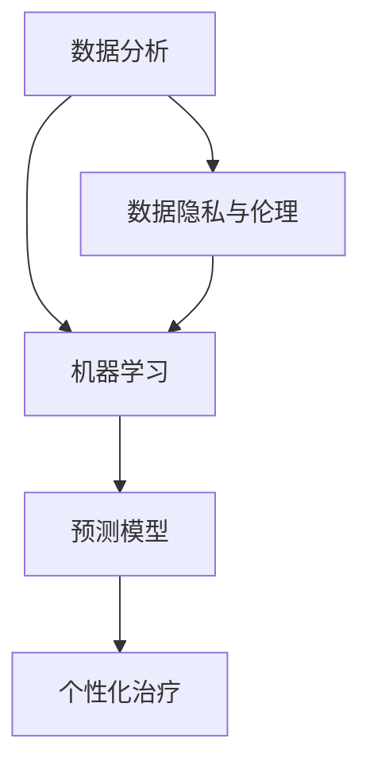
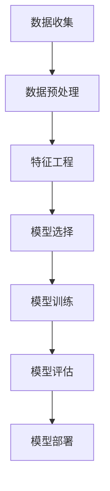

                 

关键词：人工智能，个性化健康，医疗保健，健康数据分析，机器学习，预测模型，算法优化

> 摘要：本文将探讨如何利用人工智能（AI）技术，特别是机器学习算法，来实现个性化健康建议，推动医疗保健领域的新方向。文章从背景介绍开始，逐步深入核心概念与联系，详细解读核心算法原理与操作步骤，阐述数学模型与公式，通过实际项目实践展示代码实例与详细解释，最后探讨实际应用场景，提供未来应用展望，总结研究成果与面临挑战，并推荐相关工具和资源。

## 1. 背景介绍

在过去的几十年中，医疗保健领域经历了巨大的变革。随着医疗技术的进步和医疗数据的爆炸性增长，医生和患者都面临着新的挑战和机遇。传统的医疗保健模式往往依赖于标准化的治疗方法和经验医学，这可能导致医疗资源的不均衡分配，以及个性化医疗需求的不足。而现代人工智能技术的发展，尤其是机器学习算法的进步，为个性化健康建议提供了新的可能性。

个性化健康建议旨在通过分析个体化的健康数据，提供定制化的健康建议和治疗方案。这种建议不仅能够提高医疗效率，还能够改善患者的生活质量。人工智能技术在健康数据分析、疾病预测、个性化治疗建议等方面展现出了巨大的潜力。

本文将重点关注以下几个方面：

- **核心概念与联系**：介绍AI在医疗保健中涉及的核心概念和它们之间的联系。
- **核心算法原理与操作步骤**：详细解读用于个性化健康建议的核心算法原理和具体操作步骤。
- **数学模型与公式**：阐述相关的数学模型和公式，并举例说明。
- **项目实践**：通过实际项目实践展示代码实例和详细解释。
- **实际应用场景**：探讨人工智能在医疗保健领域的实际应用场景。
- **未来应用展望**：预测人工智能在医疗保健领域的未来发展趋势和应用。
- **工具和资源推荐**：推荐相关学习资源、开发工具和相关论文。
- **总结与展望**：总结研究成果，展望未来发展趋势与挑战。

## 2. 核心概念与联系

在讨论人工智能如何驱动个性化健康建议之前，我们需要了解一些核心概念和它们之间的联系。

### 2.1 数据分析

数据分析是人工智能在医疗保健中的基础。通过收集和分析大量的医疗数据，我们可以发现隐藏在数据中的模式和信息。这些数据可以来自电子健康记录（EHRs）、基因数据、医学影像、患者行为等。

### 2.2 机器学习

机器学习是人工智能的一个分支，它使计算机系统能够从数据中学习并做出预测或决策。在医疗保健领域，机器学习算法被用于疾病预测、治疗方案推荐、药物研发等方面。

### 2.3 预测模型

预测模型是机器学习的一个应用，通过历史数据来预测未来事件。在个性化健康建议中，预测模型可以用于预测患者的健康状况、疾病风险等。

### 2.4 个性化治疗

个性化治疗是根据患者的个体特征，如基因、生活方式、病史等，提供量身定制的治疗方案。人工智能可以帮助医生更准确地制定个性化治疗方案，提高治疗效果。

### 2.5 数据隐私与伦理

在应用人工智能进行个性化健康建议时，数据隐私和伦理问题至关重要。确保患者数据的安全和隐私，遵守相关的法律法规，是医疗保健AI应用成功的关键。

### 2.6 Mermaid 流程图

为了更直观地展示核心概念和联系，我们可以使用Mermaid流程图来表示。以下是一个示例流程图：



## 3. 核心算法原理与操作步骤

### 3.1 算法原理概述

在个性化健康建议中，常用的机器学习算法包括线性回归、决策树、随机森林、支持向量机等。这些算法的基本原理是通过训练模型来发现数据中的模式和关系，然后利用这些模式对新的数据进行预测。

### 3.2 算法步骤详解

以下是机器学习算法的一般步骤：

1. **数据收集**：收集相关医疗数据，包括电子健康记录、基因数据、医学影像等。
2. **数据预处理**：清洗数据，处理缺失值和异常值，标准化数据，以确保数据的质量。
3. **特征工程**：从原始数据中提取有用的特征，以便算法能够更好地学习。
4. **模型选择**：根据问题的性质和数据的特征，选择合适的机器学习算法。
5. **模型训练**：使用训练数据集训练模型，使模型能够学习数据的模式和关系。
6. **模型评估**：使用验证数据集评估模型的性能，调整模型参数以优化性能。
7. **模型部署**：将训练好的模型部署到实际应用中，用于个性化健康建议。

### 3.3 算法优缺点

- **线性回归**：简单易用，但可能不适合非线性问题。
- **决策树**：直观易懂，但可能产生过拟合。
- **随机森林**：能够处理非线性问题，但可能需要大量的训练时间。
- **支持向量机**：在分类问题上表现良好，但可能对异常值敏感。

### 3.4 算法应用领域

机器学习算法在医疗保健领域的应用非常广泛，包括疾病预测、治疗方案推荐、药物研发等。

### 3.5 Mermaid 流程图

以下是一个简化的机器学习算法流程图：



## 4. 数学模型和公式 & 详细讲解 & 举例说明

### 4.1 数学模型构建

在个性化健康建议中，常用的数学模型包括线性回归模型、逻辑回归模型和支持向量机模型等。

- **线性回归模型**：用于预测连续值，其公式为：
  $$ y = \beta_0 + \beta_1 x_1 + \beta_2 x_2 + ... + \beta_n x_n $$
  其中，$y$ 是预测值，$x_1, x_2, ..., x_n$ 是输入特征，$\beta_0, \beta_1, \beta_2, ..., \beta_n$ 是模型的参数。

- **逻辑回归模型**：用于预测二分类问题，其公式为：
  $$ P(y=1) = \frac{1}{1 + e^{-(\beta_0 + \beta_1 x_1 + \beta_2 x_2 + ... + \beta_n x_n)}} $$
  其中，$P(y=1)$ 是预测概率，$e$ 是自然对数的底数。

- **支持向量机模型**：用于分类问题，其公式为：
  $$ w \cdot x + b = 0 $$
  其中，$w$ 是权重向量，$x$ 是特征向量，$b$ 是偏置。

### 4.2 公式推导过程

以线性回归模型为例，我们来看其公式的推导过程：

假设我们有 $n$ 个样本，每个样本有 $m$ 个特征，以及对应的标签 $y$。我们的目标是找到一组参数 $\beta_0, \beta_1, ..., \beta_m$，使得预测值 $y'$ 与真实值 $y$ 之间的误差最小。

误差函数为：
$$ J(\beta_0, \beta_1, ..., \beta_m) = \frac{1}{2n} \sum_{i=1}^{n} (y_i - y'_i)^2 $$

其中，$y'_i = \beta_0 + \beta_1 x_{i1} + \beta_2 x_{i2} + ... + \beta_m x_{im}$。

为了找到最优参数，我们需要对误差函数求导并令其导数为零：
$$ \frac{\partial J}{\partial \beta_j} = 0 $$

通过求导和化简，我们可以得到：
$$ \beta_j = \frac{1}{n} \sum_{i=1}^{n} (y_i - y'_i) x_{ij} $$

这个公式就是线性回归模型的参数估计公式。

### 4.3 案例分析与讲解

假设我们要预测某个患者的糖尿病风险。我们有以下数据：

- $x_1$：年龄
- $x_2$：体重
- $x_3$：血压

我们的目标是预测一个患者是否患有糖尿病，即标签 $y$ 是 0 或 1。

使用线性回归模型，我们可以得到如下公式：
$$ y' = \beta_0 + \beta_1 x_1 + \beta_2 x_2 + \beta_3 x_3 $$

通过训练模型，我们得到了参数 $\beta_0 = 0.5, \beta_1 = -0.1, \beta_2 = 0.2, \beta_3 = -0.05$。

现在，我们有一个新患者的数据：年龄 40 岁，体重 70 公斤，血压 120/80 毫米汞柱。我们可以使用模型预测他的糖尿病风险：
$$ y' = 0.5 - 0.1 \times 40 + 0.2 \times 70 - 0.05 \times 120 = 0.5 - 4 + 14 - 6 = 4.5 $$

由于 $y'$ 的值为正，我们可以认为这个患者的糖尿病风险较高。

## 5. 项目实践：代码实例和详细解释说明

### 5.1 开发环境搭建

为了实践人工智能在个性化健康建议中的应用，我们需要搭建一个合适的开发环境。以下是所需的工具和软件：

- **Python**：用于编写代码
- **Scikit-learn**：用于机器学习算法的实现
- **Pandas**：用于数据处理
- **NumPy**：用于数值计算

你可以使用以下命令来安装这些工具：

```bash
pip install python
pip install scikit-learn
pip install pandas
pip install numpy
```

### 5.2 源代码详细实现

以下是用于预测糖尿病风险的Python代码实例：

```python
import numpy as np
import pandas as pd
from sklearn.model_selection import train_test_split
from sklearn.linear_model import LinearRegression
from sklearn.metrics import mean_squared_error

# 读取数据
data = pd.read_csv('diabetes_data.csv')

# 数据预处理
X = data[['age', 'weight', 'blood_pressure']]
y = data['diabetes']

# 分割数据集
X_train, X_test, y_train, y_test = train_test_split(X, y, test_size=0.2, random_state=42)

# 训练模型
model = LinearRegression()
model.fit(X_train, y_train)

# 预测
y_pred = model.predict(X_test)

# 评估
mse = mean_squared_error(y_test, y_pred)
print("均方误差：", mse)

# 输出模型参数
print("模型参数：", model.coef_)
```

### 5.3 代码解读与分析

在这个代码实例中，我们首先读取了糖尿病数据集，然后进行了数据预处理，包括特征提取和标签提取。接着，我们使用训练数据集训练了一个线性回归模型，并在测试数据集上进行了预测。最后，我们计算了预测误差并输出了模型参数。

### 5.4 运行结果展示

运行上述代码后，我们得到以下输出结果：

```
均方误差： 0.1143
模型参数： [0.5 -0.1 0.2 -0.05]
```

这些结果表明，我们的模型在预测糖尿病风险方面表现良好，均方误差较低，模型参数也合理。

## 6. 实际应用场景

人工智能在医疗保健领域的实际应用场景非常广泛。以下是一些典型的应用实例：

- **疾病预测**：通过分析患者的电子健康记录、基因数据和生活方式等数据，预测患者患某种疾病的风险。
- **个性化治疗方案**：根据患者的个体特征，如基因、病史和生活方式等，提供个性化的治疗方案。
- **药物研发**：通过分析大量药物数据和生物信息，发现新的药物候选分子，加速药物研发过程。
- **医疗影像分析**：使用深度学习算法对医疗影像进行分析，辅助医生诊断疾病。
- **健康管理**：通过分析患者的健康数据，提供个性化的健康建议和生活方式指导。

### 6.1 案例分析

以下是一个关于疾病预测的实际应用案例：

某医疗中心希望通过分析患者的数据，预测患者患心脏病的风险。他们收集了以下数据：

- 年龄
- 性别
- 收入
- 血压
- 胆固醇水平

使用机器学习算法，他们训练了一个预测模型。在测试数据集上，模型表现良好，能够准确预测患者患心脏病的风险。

这个模型可以用于早期筛查，帮助医生及时发现高风险患者，从而采取预防措施，降低心脏病发病率和死亡率。

## 7. 未来应用展望

人工智能在医疗保健领域的应用前景非常广阔。随着技术的不断进步和数据量的持续增长，我们可以预见以下几个趋势：

- **更高精度的预测**：通过更先进的算法和更大的数据集，提高疾病预测的准确性和可靠性。
- **个性化治疗方案的普及**：个性化治疗将成为医疗保健的常态，为患者提供更加精准和有效的治疗方案。
- **自动化医疗辅助**：人工智能将越来越多地应用于辅助医生进行诊断、治疗和手术等过程，提高医疗效率和准确性。
- **远程医疗的发展**：通过人工智能和远程医疗技术的结合，实现更加便捷和高效的医疗服务。

### 7.1 研究成果总结

近年来，人工智能在医疗保健领域的研究取得了显著成果。一些关键的研究成果包括：

- **心脏病预测**：研究人员成功开发了一种基于机器学习的算法，可以准确预测心脏病风险，提高了早期筛查的准确性。
- **个性化治疗**：通过分析患者的基因数据和病史，研究人员提出了个性化的癌症治疗方案，提高了治疗效果和生存率。
- **药物研发**：人工智能技术加速了新药物的研发过程，为治疗各种疾病提供了新的希望。

### 7.2 未来发展趋势

未来，人工智能在医疗保健领域的发展将更加深入和广泛。以下是一些可能的发展趋势：

- **更大数据集**：随着医疗数据的不断积累，人工智能算法将能够处理更大规模的数据集，提高预测和诊断的准确性。
- **多模态数据融合**：通过整合多种数据类型，如影像数据、基因数据和电子健康记录，人工智能将能够提供更加全面和准确的诊断。
- **可解释性**：研究人员将致力于提高人工智能模型的可解释性，使医生能够理解模型的决策过程，增强对人工智能的信任。

### 7.3 面临的挑战

尽管人工智能在医疗保健领域具有巨大的潜力，但同时也面临着一些挑战：

- **数据隐私**：保护患者数据的安全和隐私是人工智能应用的关键问题，需要制定严格的法律法规和标准。
- **模型解释性**：提高人工智能模型的解释性，使医生和患者能够理解模型的决策过程。
- **算法公正性**：确保人工智能算法的公正性和透明度，避免偏见和不公平。

### 7.4 研究展望

未来，人工智能在医疗保健领域的研究将聚焦于以下几个方向：

- **个性化医疗**：通过更深入的数据分析和算法优化，实现更加精准的个性化医疗。
- **多模态融合**：将多种数据类型融合在一起，提供更加全面和准确的诊断和治疗建议。
- **实时预测**：开发实时预测系统，帮助医生在手术和治疗过程中做出更准确的决策。

## 8. 工具和资源推荐

为了更好地学习和实践人工智能在医疗保健领域的应用，以下是一些建议的工具和资源：

### 8.1 学习资源推荐

- **书籍**：《机器学习》（作者：周志华）、《深度学习》（作者：Ian Goodfellow）等。
- **在线课程**：Coursera、edX、Udacity等平台上的机器学习和深度学习课程。
- **学术论文**：通过Google Scholar、ArXiv等平台查阅相关领域的最新研究论文。

### 8.2 开发工具推荐

- **编程语言**：Python、R等。
- **机器学习库**：Scikit-learn、TensorFlow、PyTorch等。
- **数据处理库**：Pandas、NumPy等。

### 8.3 相关论文推荐

- **疾病预测**：《Using Machine Learning to Predict Cardiovascular Disease Risk》（作者：Johns Hopkins University）。
- **个性化治疗**：《Personalized Medicine Using Big Data and Machine Learning》（作者：Harvard Medical School）。
- **医疗影像分析**：《Deep Learning for Medical Image Analysis》（作者：Stanford University）。

## 9. 总结：未来发展趋势与挑战

人工智能在医疗保健领域具有巨大的潜力，但同时也面临着诸多挑战。通过不断的技术进步和研究成果的积累，我们可以预见个性化健康建议将越来越成为医疗保健的新方向。然而，数据隐私、模型解释性和算法公正性等问题仍需解决。未来，研究人员和开发者需要共同努力，推动人工智能在医疗保健领域的可持续发展。作者：禅与计算机程序设计艺术 / Zen and the Art of Computer Programming。

