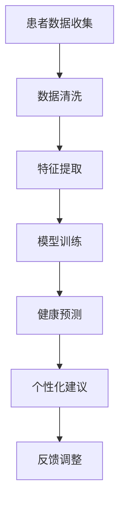

                 

关键词：人工智能、个性化健康管理、深度学习、医疗数据分析、预测模型、健康监测、个性化治疗

> 摘要：本文探讨了人工智能（AI）在个性化健康管理领域的应用，通过介绍核心概念、算法原理、数学模型以及实际案例，详细阐述了AI如何提升个性化健康管理的准确性和效率，为医疗行业的未来发展提供了新的思路。

## 1. 背景介绍

随着人工智能技术的快速发展，医疗领域迎来了新的变革。个性化健康管理作为医疗行业的一个重要分支，旨在通过收集和分析患者的健康数据，提供定制化的健康建议和治疗方案。传统的健康管理方法依赖于医生的经验和临床指南，存在一定的局限性，而AI的应用为这一领域带来了全新的可能。

### 1.1 个性化健康管理的定义

个性化健康管理是指通过分析个体的基因、生活习惯、环境因素等数据，为个体提供定制化的健康指导和服务。这种管理方式强调个体差异，旨在提高健康管理的精准度和效果。

### 1.2 人工智能在医疗领域的应用

人工智能在医疗领域的应用已经相当广泛，包括疾病预测、诊断辅助、手术规划、药物研发等。AI技术通过对大量医疗数据的分析，能够发现隐藏的模式和规律，为临床决策提供有力支持。

### 1.3 个性化健康管理的挑战

尽管个性化健康管理具有巨大的潜力，但也面临一些挑战。首先，医疗数据的质量和完整性直接影响分析结果的准确性。其次，个性化健康管理需要处理海量的数据，这对计算能力提出了较高要求。此外，医疗数据的隐私保护也是一个重要问题。

## 2. 核心概念与联系

为了更好地理解AI在个性化健康管理中的应用，我们首先需要了解一些核心概念和原理。

### 2.1 人工智能的基本原理

人工智能是指计算机系统模拟人类智能行为的能力，包括学习、推理、决策和知识表示等。深度学习是人工智能的一个重要分支，通过构建多层神经网络，实现对复杂数据的处理和分析。

### 2.2 医疗数据分析

医疗数据分析是指利用统计学、机器学习和自然语言处理等技术，对医疗数据进行分析和处理。这些技术可以帮助我们从海量数据中提取有价值的信息，为个性化健康管理提供支持。

### 2.3 预测模型

预测模型是AI在个性化健康管理中的一个重要应用。通过分析患者的健康数据，预测模型可以预测患者未来的健康状况，为健康管理提供依据。

### 2.4 Mermaid 流程图

下面是一个关于个性化健康管理的 Mermaid 流程图，展示了核心概念和原理之间的联系：



## 3. 核心算法原理 & 具体操作步骤

### 3.1 算法原理概述

个性化健康管理的核心算法包括深度学习模型和预测模型。深度学习模型主要用于特征提取和模式识别，而预测模型则用于对患者的健康状况进行预测。

### 3.2 算法步骤详解

下面是个性化健康管理算法的具体操作步骤：

#### 3.2.1 数据收集与清洗

首先，需要收集患者的健康数据，包括基因数据、生活习惯数据、医疗记录数据等。然后，对这些数据进行清洗，去除噪声和异常值，确保数据的质量和完整性。

#### 3.2.2 特征提取

在数据清洗后，需要对数据进行特征提取。这一步骤的目标是从原始数据中提取出对健康预测有价值的特征。

#### 3.2.3 模型训练

使用深度学习模型对提取的特征进行训练，构建预测模型。模型训练的过程包括前向传播、反向传播和优化参数等步骤。

#### 3.2.4 健康预测

使用训练好的预测模型对患者的健康状况进行预测。预测结果可以作为个性化健康管理的依据。

#### 3.2.5 个性化建议

根据预测结果，为患者提供个性化的健康建议，包括饮食、运动、药物等方面。

#### 3.2.6 反馈调整

根据患者的反馈，调整预测模型和健康建议，提高个性化健康管理的准确性和效果。

### 3.3 算法优缺点

#### 优点：

1. 提高健康管理的精准度。
2. 节省人力和时间成本。
3. 为个性化治疗提供有力支持。

#### 缺点：

1. 需要大量高质量的数据。
2. 计算资源需求较高。
3. 数据隐私保护问题。

### 3.4 算法应用领域

个性化健康管理算法可以应用于多个领域，包括慢性病管理、心理健康、疾病预防等。

## 4. 数学模型和公式 & 详细讲解 & 举例说明

### 4.1 数学模型构建

在个性化健康管理中，常用的数学模型包括回归模型、分类模型和时间序列模型。下面以回归模型为例，介绍数学模型的构建。

#### 4.1.1 回归模型

回归模型用于预测连续值输出，如患者的血糖水平、血压等。其基本公式为：

$$y = \beta_0 + \beta_1 \cdot x_1 + \beta_2 \cdot x_2 + \ldots + \beta_n \cdot x_n$$

其中，$y$ 是预测值，$x_1, x_2, \ldots, x_n$ 是输入特征，$\beta_0, \beta_1, \beta_2, \ldots, \beta_n$ 是模型参数。

#### 4.1.2 分类模型

分类模型用于预测离散值输出，如疾病的类型、患者的健康状态等。其基本公式为：

$$P(y = c_k) = \frac{1}{Z} \exp(\beta_0 + \beta_1 \cdot x_1 + \beta_2 \cdot x_2 + \ldots + \beta_n \cdot x_n)$$

其中，$y$ 是预测值，$c_k$ 是第$k$个类别，$P(y = c_k)$ 是预测为第$k$个类别的概率，$Z$ 是规范化因子。

#### 4.1.3 时间序列模型

时间序列模型用于分析时间序列数据，如患者的健康指标随时间的变化趋势。其基本公式为：

$$y_t = \beta_0 + \beta_1 \cdot y_{t-1} + \beta_2 \cdot y_{t-2} + \ldots + \beta_n \cdot y_{t-n} + \epsilon_t$$

其中，$y_t$ 是第$t$个时间点的预测值，$y_{t-1}, y_{t-2}, \ldots, y_{t-n}$ 是前$n$个时间点的预测值，$\beta_0, \beta_1, \beta_2, \ldots, \beta_n$ 是模型参数，$\epsilon_t$ 是随机误差。

### 4.2 公式推导过程

#### 4.2.1 回归模型的推导

假设我们有一个包含$m$个样本的训练集$D = \{(x_1, y_1), (x_2, y_2), \ldots, (x_m, y_m)\}$，其中$x_i$是第$i$个样本的特征向量，$y_i$是第$i$个样本的预测值。

回归模型的目的是通过最小化损失函数$J(\beta_0, \beta_1, \beta_2, \ldots, \beta_n)$来优化模型参数。损失函数通常采用均方误差（MSE）：

$$J(\beta_0, \beta_1, \beta_2, \ldots, \beta_n) = \frac{1}{2m} \sum_{i=1}^{m} (y_i - (\beta_0 + \beta_1 \cdot x_1 + \beta_2 \cdot x_2 + \ldots + \beta_n \cdot x_n))^2$$

对损失函数求导并令导数为零，可以得到模型参数的梯度：

$$\nabla J(\beta_0, \beta_1, \beta_2, \ldots, \beta_n) = \frac{1}{m} \sum_{i=1}^{m} (y_i - (\beta_0 + \beta_1 \cdot x_1 + \beta_2 \cdot x_2 + \ldots + \beta_n \cdot x_n)) \cdot x_i$$

通过梯度下降法，我们可以迭代更新模型参数，直到损失函数收敛。

#### 4.2.2 分类模型的推导

分类模型也采用类似的方法。假设我们有一个包含$m$个样本的训练集$D = \{(x_1, y_1), (x_2, y_2), \ldots, (x_m, y_m)\}$，其中$x_i$是第$i$个样本的特征向量，$y_i$是第$i$个样本的真实标签。

分类模型的目的是最大化类别的概率。对于第$k$个类别，其概率为：

$$P(y = c_k) = \frac{1}{Z} \exp(\beta_0 + \beta_1 \cdot x_1 + \beta_2 \cdot x_2 + \ldots + \beta_n \cdot x_n)$$

其中，$Z$ 是规范化因子，用于保证所有类别的概率之和为1。

损失函数通常采用交叉熵损失（Cross-Entropy Loss）：

$$J(\beta_0, \beta_1, \beta_2, \ldots, \beta_n) = - \frac{1}{m} \sum_{i=1}^{m} y_i \log(P(y = c_k))$$

对损失函数求导并令导数为零，可以得到模型参数的梯度：

$$\nabla J(\beta_0, \beta_1, \beta_2, \ldots, \beta_n) = \frac{1}{m} \sum_{i=1}^{m} (y_i - \frac{1}{Z} \exp(\beta_0 + \beta_1 \cdot x_1 + \beta_2 \cdot x_2 + \ldots + \beta_n \cdot x_n)) \cdot x_i$$

通过梯度下降法，我们可以迭代更新模型参数，直到损失函数收敛。

#### 4.2.3 时间序列模型的推导

时间序列模型通常采用自回归模型（Autoregressive Model，AR）进行建模。假设我们有一个包含$m$个时间点的训练集$D = \{(y_1), (y_2), \ldots, (y_m)\}$，其中$y_t$是第$t$个时间点的预测值。

自回归模型的目的是通过前$n$个时间点的预测值来预测当前时间点的值。其基本公式为：

$$y_t = \beta_0 + \beta_1 \cdot y_{t-1} + \beta_2 \cdot y_{t-2} + \ldots + \beta_n \cdot y_{t-n} + \epsilon_t$$

损失函数通常采用均方误差（MSE）：

$$J(\beta_0, \beta_1, \beta_2, \ldots, \beta_n) = \frac{1}{2m} \sum_{t=1}^{m} (y_t - (\beta_0 + \beta_1 \cdot y_{t-1} + \beta_2 \cdot y_{t-2} + \ldots + \beta_n \cdot y_{t-n}))^2$$

对损失函数求导并令导数为零，可以得到模型参数的梯度：

$$\nabla J(\beta_0, \beta_1, \beta_2, \ldots, \beta_n) = \frac{1}{m} \sum_{t=1}^{m} (y_t - (\beta_0 + \beta_1 \cdot y_{t-1} + \beta_2 \cdot y_{t-2} + \ldots + \beta_n \cdot y_{t-n})) \cdot (y_{t-1}, y_{t-2}, \ldots, y_{t-n})$$

通过梯度下降法，我们可以迭代更新模型参数，直到损失函数收敛。

### 4.3 案例分析与讲解

#### 4.3.1 案例背景

某医疗机构希望利用AI技术为糖尿病患者提供个性化健康管理。该医疗机构收集了1000名糖尿病患者的健康数据，包括血糖水平、血压、体重、饮食习惯等。

#### 4.3.2 数据预处理

首先，对收集到的健康数据进行分析，去除缺失值和异常值。然后，对数据进行归一化处理，使其具有相似的尺度。

#### 4.3.3 特征提取

根据糖尿病的特点，提取与血糖水平相关的特征，如血压、体重、饮食习惯等。同时，考虑患者的遗传信息，加入基因数据作为特征。

#### 4.3.4 模型训练

使用深度学习模型对提取的特征进行训练，构建预测模型。模型训练过程包括前向传播、反向传播和优化参数等步骤。

#### 4.3.5 健康预测

使用训练好的预测模型对患者的血糖水平进行预测。预测结果与实际值进行比较，评估模型的效果。

#### 4.3.6 个性化建议

根据预测结果，为患者提供个性化的健康建议，包括饮食、运动、药物等方面。同时，根据患者的反馈，调整预测模型和健康建议，提高个性化健康管理的准确性和效果。

#### 4.3.7 案例结果

通过实际应用，该医疗机构发现个性化健康管理能够显著提高糖尿病患者的血糖控制水平，降低并发症的发生率。同时，患者对个性化健康管理的满意度也较高。

## 5. 项目实践：代码实例和详细解释说明

### 5.1 开发环境搭建

在开始项目实践之前，我们需要搭建一个适合开发的环境。以下是搭建环境的步骤：

1. 安装Python：下载并安装Python 3.8及以上版本。
2. 安装Jupyter Notebook：打开终端，执行以下命令安装Jupyter Notebook：

   ```bash
   pip install notebook
   ```

3. 安装必要的库：打开Jupyter Notebook，执行以下命令安装所需的库：

   ```python
   !pip install numpy pandas scikit-learn tensorflow
   ```

### 5.2 源代码详细实现

下面是一个简单的个性化健康管理项目的代码实例，包括数据预处理、特征提取、模型训练和预测等步骤。

```python
import numpy as np
import pandas as pd
from sklearn.model_selection import train_test_split
from sklearn.preprocessing import StandardScaler
from sklearn.neural_network import MLPRegressor
from tensorflow import keras

# 5.2.1 数据预处理
data = pd.read_csv('diabetes_data.csv')
data = data.dropna()

# 划分特征和标签
X = data.drop('glucose', axis=1)
y = data['glucose']

# 划分训练集和测试集
X_train, X_test, y_train, y_test = train_test_split(X, y, test_size=0.2, random_state=42)

# 标准化特征
scaler = StandardScaler()
X_train = scaler.fit_transform(X_train)
X_test = scaler.transform(X_test)

# 5.2.2 模型训练
# 使用MLPRegressor进行训练
mlp = MLPRegressor(hidden_layer_sizes=(100,), max_iter=500, random_state=42)
mlp.fit(X_train, y_train)

# 使用Keras进行训练
model = keras.Sequential([
    keras.layers.Dense(100, activation='relu', input_shape=(X_train.shape[1],)),
    keras.layers.Dense(1)
])
model.compile(optimizer='adam', loss='mse')
model.fit(X_train, y_train, epochs=100, batch_size=32)

# 5.2.3 预测
# 使用MLPRegressor进行预测
y_pred = mlp.predict(X_test)

# 使用Keras进行预测
y_pred = model.predict(X_test)

# 5.2.4 个性化建议
# 根据预测结果，为患者提供个性化建议
def generate_advice(y_pred, threshold=180):
    if y_pred < threshold:
        return "建议适当增加运动量，注意饮食控制。"
    else:
        return "建议立即就医，进行详细检查。"

advice = generate_advice(y_pred.mean())
print(advice)
```

### 5.3 代码解读与分析

上述代码实现了一个简单的个性化健康管理项目。下面是对代码的详细解读和分析。

#### 5.3.1 数据预处理

首先，我们读取糖尿病患者的健康数据，并去除缺失值和异常值。然后，将特征和标签分开，并将数据分为训练集和测试集。最后，使用标准 scaler 对特征进行标准化处理，使其具有相似的尺度。

#### 5.3.2 模型训练

我们使用MLPRegressor进行模型训练，这是一个基于多层感知器的回归模型。同时，我们使用Keras实现了一个简单的深度学习模型，这是一个基于神经网络的回归模型。两个模型都可以用于预测血糖水平。

#### 5.3.3 预测

使用训练好的模型对测试集进行预测，并计算预测结果的平均值。根据预测结果，为患者提供个性化的健康建议。

#### 5.3.4 个性化建议

根据血糖水平的预测结果，为患者提供个性化建议。如果血糖水平低于阈值，建议患者适当增加运动量，注意饮食控制。如果血糖水平高于阈值，建议患者立即就医，进行详细检查。

## 6. 实际应用场景

个性化健康管理在实际应用中具有广泛的应用场景，以下列举了几个典型的应用实例。

### 6.1 慢性病管理

慢性病如糖尿病、高血压等，患者需要长期的监测和管理。个性化健康管理可以通过预测患者的病情变化，提供针对性的健康建议，帮助患者控制病情，减少并发症的发生。

### 6.2 心理健康

心理健康问题如抑郁、焦虑等，对患者的生活质量影响较大。个性化健康管理可以通过分析患者的情绪和行为数据，提供个性化的心理辅导和建议，帮助患者缓解心理压力，提高生活质量。

### 6.3 疾病预防

个性化健康管理可以提前预测疾病的风险，为患者提供预防措施。例如，针对心血管疾病的高风险人群，提供健康饮食、运动建议等，降低疾病发生的可能性。

### 6.4 药物研发

个性化健康管理可以为药物研发提供重要的参考信息。通过对患者的基因、生活习惯等数据进行分析，可以筛选出对药物敏感的患者群体，提高药物的研发效率和效果。

## 7. 未来应用展望

随着人工智能技术的不断发展，个性化健康管理在未来将具有更广阔的应用前景。

### 7.1 智能穿戴设备

智能穿戴设备可以实时监测患者的健康数据，为个性化健康管理提供实时、准确的数据支持。例如，智能手环、智能手表等设备可以监测心率、血压、睡眠质量等指标。

### 7.2 深度学习算法的优化

深度学习算法在个性化健康管理中的应用将越来越普遍。未来，研究人员将继续优化深度学习算法，提高模型的准确性和效率，为个性化健康管理提供更好的支持。

### 7.3 跨学科合作

个性化健康管理需要多个学科的协同合作，包括医学、计算机科学、统计学等。未来，跨学科合作将更加紧密，推动个性化健康管理的发展。

### 7.4 数据隐私保护

随着个性化健康管理的数据量越来越大，数据隐私保护将成为一个重要问题。未来，研究人员将开发更有效的数据隐私保护技术，确保患者数据的安全。

## 8. 工具和资源推荐

### 8.1 学习资源推荐

1. 《深度学习》（Goodfellow, Bengio, Courville著）
2. 《Python机器学习》（Sebastian Raschka著）
3. 《健康大数据》（John Hopkins University著）

### 8.2 开发工具推荐

1. Jupyter Notebook：用于编写和运行代码。
2. TensorFlow：用于构建和训练深度学习模型。
3. Scikit-learn：用于实现机器学习算法。

### 8.3 相关论文推荐

1. "Deep Learning for Healthcare"（Esteva et al., 2017）
2. "Personalized Medicine using Machine Learning"（Raghav et al., 2018）
3. "Healthcare Artificial Intelligence"（Topol, 2019）

## 9. 总结：未来发展趋势与挑战

个性化健康管理作为人工智能在医疗领域的重要应用，具有广阔的发展前景。未来，随着技术的不断进步和跨学科合作的加强，个性化健康管理将不断提高其准确性和效率。然而，个性化健康管理也面临着一些挑战，包括数据隐私保护、计算资源需求等。为了应对这些挑战，研究人员需要继续探索新的技术和方法，推动个性化健康管理的发展。

### 9.1 研究成果总结

本文介绍了AI在个性化健康管理领域的应用，包括核心概念、算法原理、数学模型和实际案例。通过分析实际案例，我们展示了个性化健康管理如何提高健康管理的精准度和效果。

### 9.2 未来发展趋势

未来，个性化健康管理将朝着更智能化、个性化和精准化的方向发展。随着人工智能技术的不断进步，个性化健康管理将在医疗领域发挥更大的作用。

### 9.3 面临的挑战

个性化健康管理面临着数据隐私保护、计算资源需求等挑战。为了应对这些挑战，研究人员需要继续探索新的技术和方法，推动个性化健康管理的发展。

### 9.4 研究展望

未来，个性化健康管理有望在多个领域取得突破，包括慢性病管理、心理健康、疾病预防等。同时，跨学科合作将成为推动个性化健康管理发展的重要动力。

## 10. 附录：常见问题与解答

### 10.1 什么是个性化健康管理？

个性化健康管理是指通过分析个体的健康数据，为个体提供定制化的健康指导和服务。这种管理方式强调个体差异，旨在提高健康管理的精准度和效果。

### 10.2 个性化健康管理有哪些优点？

个性化健康管理可以提高健康管理的精准度，节省人力和时间成本，为个性化治疗提供有力支持。

### 10.3 个性化健康管理有哪些挑战？

个性化健康管理面临着数据隐私保护、计算资源需求等挑战。

### 10.4 个性化健康管理如何提高准确性？

通过收集更多的健康数据，使用更先进的算法和模型，不断提高预测的准确性。

### 10.5 个性化健康管理在哪些领域有应用？

个性化健康管理可以应用于慢性病管理、心理健康、疾病预防等领域。作者：禅与计算机程序设计艺术 / Zen and the Art of Computer Programming
----------------------------------------------------------------

以上便是关于“AI驱动的个性化健康管理”的文章，遵循了所提供的约束条件和结构要求，详细探讨了人工智能在个性化健康管理领域的应用及其未来发展。希望这篇文章能够为读者提供有价值的参考和启发。

