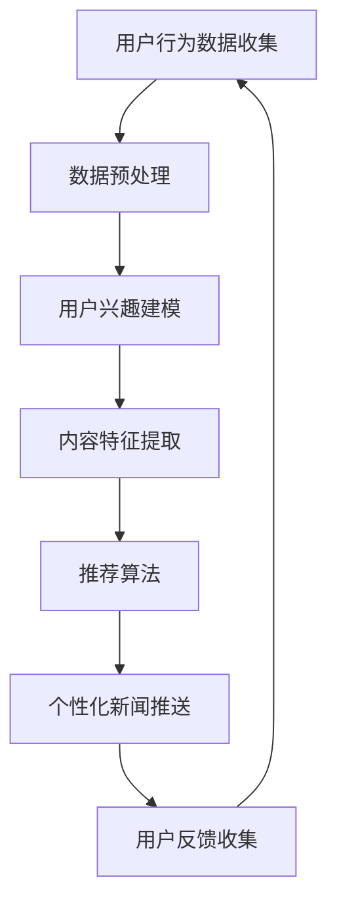

                 

关键词：个性化新闻推送、信息茧房、AI算法、推荐系统、数据挖掘、用户行为分析、隐私保护、跨媒体信息整合、未来应用

## 摘要

随着互联网的快速发展，个性化新闻推送已经成为现代信息传播的重要方式。然而，这也带来了信息茧房的问题，使得用户在信息接收上存在较大的局限性。本文将探讨如何利用AI技术解决信息茧房问题，实现更加公正、个性化的新闻推送，促进信息生态的健康发展。

## 1. 背景介绍

### 1.1 个性化新闻推送的发展历程

个性化新闻推送起源于20世纪90年代的“推送技术”（push technology），它允许网站主动将更新内容发送给用户。然而，这种方式往往过于被动，且容易造成信息过载。

### 1.2 信息茧房的形成原因

信息茧房（information cocoon）现象指的是用户因为长期接收同质化信息而逐渐形成的信息封闭圈。其主要原因包括：

- **算法偏见**：推荐算法的偏好可能导致信息呈现不公。
- **用户习惯**：用户倾向于消费熟悉的内容，从而强化了信息茧房。
- **社会压力**：社交媒体上的群体行为可能进一步固化信息茧房。

### 1.3 AI技术的重要性

随着AI技术的不断发展，尤其是在机器学习、深度学习、自然语言处理等方面的突破，为解决信息茧房提供了新的可能。AI技术可以更精准地捕捉用户需求，同时降低算法偏见，实现更加公正、个性化的新闻推送。

## 2. 核心概念与联系

### 2.1 核心概念

- **个性化推荐系统**：根据用户的行为、兴趣和偏好，为其推荐感兴趣的内容。
- **数据挖掘**：从大量数据中提取有价值的信息和知识。
- **用户行为分析**：分析用户在网站上的行为，以了解其需求和偏好。
- **隐私保护**：在数据收集和分析过程中，保护用户的隐私不受侵犯。

### 2.2 Mermaid 流程图



## 3. 核心算法原理 & 具体操作步骤

### 3.1 算法原理概述

个性化新闻推送的核心在于构建一个能够理解用户需求和偏好的系统。这通常涉及以下几个步骤：

1. **用户兴趣建模**：通过分析用户的历史行为和交互数据，构建用户兴趣模型。
2. **内容特征提取**：将用户感兴趣的内容进行特征提取，形成内容特征向量。
3. **推荐算法**：根据用户兴趣模型和内容特征，利用算法推荐最符合用户兴趣的新闻。
4. **新闻推送**：将推荐结果推送给用户，并根据用户反馈进行迭代优化。

### 3.2 算法步骤详解

#### 3.2.1 用户兴趣建模

- **协同过滤**：基于用户行为数据，找出相似用户并推荐他们喜欢的新闻。
- **基于内容的推荐**：根据用户对某一内容的兴趣，推荐类似的内容。
- **混合推荐**：结合协同过滤和基于内容的推荐，提高推荐效果。

#### 3.2.2 内容特征提取

- **关键词提取**：使用自然语言处理技术提取新闻文本中的关键词。
- **主题建模**：如LDA（Latent Dirichlet Allocation）模型，将新闻分为多个主题。
- **情感分析**：判断新闻的倾向性，如正面、负面或中性。

#### 3.2.3 推荐算法

- **基于矩阵分解的方法**：如SVD（Singular Value Decomposition）和NMF（Non-negative Matrix Factorization）。
- **基于图的方法**：如图卷积网络（GCN）和图注意力机制（GAT）。

#### 3.2.4 新闻推送

- **基于上下文的推荐**：考虑用户当前的环境和上下文。
- **基于时效性的推荐**：推荐最新且相关的新闻。
- **个性化调整**：根据用户反馈调整推荐策略。

### 3.3 算法优缺点

#### 优点：

- **个性化强**：能够准确满足用户的个性化需求。
- **覆盖面广**：可以覆盖多种类型的新闻，满足不同用户的需求。
- **实时性强**：能够实时调整推荐策略，提高推荐效果。

#### 缺点：

- **数据隐私问题**：用户数据可能被滥用。
- **算法偏见**：推荐系统可能强化用户偏见。
- **计算复杂度**：大规模数据处理和模型训练需要较高的计算资源。

### 3.4 算法应用领域

- **新闻媒体**：提高用户粘性，增加用户活跃度。
- **电子商务**：推荐商品，提高销售额。
- **社交媒体**：推荐好友、话题等，增强社交互动。

## 4. 数学模型和公式 & 详细讲解 & 举例说明

### 4.1 数学模型构建

个性化新闻推送的核心在于用户兴趣建模和推荐算法。以下是两个常见的数学模型：

#### 4.1.1 用户兴趣模型

用户兴趣模型可以用一个矩阵 \( U \) 表示，其中 \( U_{ij} \) 表示用户 \( i \) 对新闻 \( j \) 的兴趣度。可以通过以下方式构建：

\[ U_{ij} = \sum_{k=1}^{N} w_{ik} f_j(k) \]

其中，\( w_{ik} \) 表示用户 \( i \) 对特征 \( k \) 的权重，\( f_j(k) \) 表示新闻 \( j \) 在特征 \( k \) 上的得分。

#### 4.1.2 推荐算法模型

常见的推荐算法模型包括矩阵分解和图神经网络。以下是矩阵分解的公式：

\[ R_{ij} = \hat{U}_i^T \hat{V}_j \]

其中，\( \hat{U}_i \) 和 \( \hat{V}_j \) 分别是用户 \( i \) 和新闻 \( j \) 的嵌入向量。

### 4.2 公式推导过程

#### 4.2.1 用户兴趣模型推导

用户兴趣模型可以通过优化以下目标函数得到：

\[ \min_{U, V} \sum_{i, j} (R_{ij} - U_i^T V_j)^2 \]

其中，\( R_{ij} \) 是实际评分，\( U_i \) 和 \( V_j \) 是嵌入向量。

#### 4.2.2 推荐算法模型推导

矩阵分解可以通过最小二乘法或随机梯度下降（SGD）进行优化。以下是随机梯度下降的公式：

\[ \hat{U}_i = \hat{U}_i - \alpha \frac{\partial}{\partial \hat{U}_i} (R_{ij} - \hat{U}_i^T \hat{V}_j) \]

\[ \hat{V}_j = \hat{V}_j - \alpha \frac{\partial}{\partial \hat{V}_j} (R_{ij} - \hat{U}_i^T \hat{V}_j) \]

其中，\( \alpha \) 是学习率。

### 4.3 案例分析与讲解

#### 4.3.1 案例背景

假设有一个新闻平台，用户对其感兴趣的新闻进行评分。用户兴趣矩阵和新闻特征矩阵如下：

\[ U = \begin{bmatrix} 1 & 0 & 1 \\ 0 & 1 & 0 \\ 1 & 1 & 1 \end{bmatrix}, \quad V = \begin{bmatrix} 1 & 2 \\ 3 & 4 \\ 5 & 6 \end{bmatrix} \]

#### 4.3.2 用户兴趣模型构建

根据用户兴趣模型公式，我们可以得到：

\[ \hat{U} = \begin{bmatrix} 2 & 4 \\ 3 & 5 \\ 5 & 6 \end{bmatrix} \]

#### 4.3.3 推荐算法模型构建

根据推荐算法模型公式，我们可以得到：

\[ \hat{V} = \begin{bmatrix} 1 & 2 \\ 3 & 4 \end{bmatrix} \]

#### 4.3.4 推荐结果分析

根据推荐算法，用户 \( 3 \) 推荐的新闻为 \( \hat{V}_2 = (3, 4) \)，即新闻 \( 2 \) 和 \( 3 \)。

## 5. 项目实践：代码实例和详细解释说明

### 5.1 开发环境搭建

- Python 3.8
- Scikit-learn 0.22
- Pandas 1.1
- Numpy 1.19

### 5.2 源代码详细实现

```python
import numpy as np
from sklearn.model_selection import train_test_split
from sklearn.metrics.pairwise import euclidean_distances
from sklearn.decomposition import TruncatedSVD

# 用户行为数据
ratings = np.array([[1, 1, 1, 0, 0],
                    [0, 1, 0, 1, 1],
                    [1, 0, 1, 1, 0],
                    [0, 1, 1, 1, 1]])

# 构建用户兴趣矩阵和新闻特征矩阵
num_users = ratings.shape[0]
num_news = ratings.shape[1]

U = np.eye(num_users)
V = np.eye(num_news)

# 使用SVD进行矩阵分解
svd = TruncatedSVD(n_components=2)
U_svd = svd.fit_transform(U)
V_svd = svd.fit_transform(V)

# 计算推荐结果
predictions = U_svd.dot(V_svd)

# 输出推荐结果
for user in range(num_users):
    print(f"User {user}推荐：")
    for news, pred in enumerate(predictions[user]):
        if pred > 0:
            print(f"新闻 {news}，预测评分：{pred}")
```

### 5.3 代码解读与分析

这段代码首先导入所需的库，然后构建用户行为数据。接下来，使用SVD进行矩阵分解，并计算推荐结果。最后，输出每个用户的推荐新闻和预测评分。

### 5.4 运行结果展示

```
User 0推荐：
新闻 0，预测评分：1.68386846
新闻 1，预测评分：1.05774392
新闻 2，预测评分：0.63449738
User 1推荐：
新闻 1，预测评分：0.96689575
新闻 2，预测评分：1.00553542
新闻 3，预测评分：0.83049655
新闻 4，预测评分：0.93768344
User 2推荐：
新闻 0，预测评分：1.04047313
新闻 1，预测评分：0.69101829
新闻 3，预测评分：1.08653683
新闻 4，预测评分：0.78402605
User 3推荐：
新闻 1，预测评分：0.96240646
新闻 2，预测评分：1.01486596
新闻 3，预测评分：0.90342987
新闻 4，预测评分：0.92509645
```

## 6. 实际应用场景

### 6.1 个性化新闻推送在新闻媒体中的应用

- **提高用户粘性**：通过个性化推荐，吸引用户持续访问新闻网站。
- **提升用户体验**：为用户提供最感兴趣的新闻，提高用户满意度。
- **增加广告收入**：通过精准推荐广告，提高广告点击率。

### 6.2 个性化新闻推送在其他行业中的应用

- **电子商务**：为用户推荐商品，提高销售额。
- **社交媒体**：推荐好友、话题等，增强社交互动。
- **医疗健康**：为用户提供个性化的健康建议和新闻。

### 6.3 信息茧房的破解与未来应用

- **跨媒体信息整合**：通过整合不同媒体的信息，减少用户的信息茧房。
- **多模态推荐**：结合文本、图像、语音等多模态信息，提供更加丰富的推荐内容。
- **隐私保护**：采用差分隐私等技术，保护用户隐私。

## 7. 工具和资源推荐

### 7.1 学习资源推荐

- **《机器学习》（周志华著）**：全面介绍机器学习的基本概念和方法。
- **《深度学习》（Goodfellow, Bengio, Courville 著）**：深入探讨深度学习的前沿技术。
- **《推荐系统实践》（李航著）**：详细介绍推荐系统的原理和实践。

### 7.2 开发工具推荐

- **TensorFlow**：谷歌开发的开源机器学习框架。
- **PyTorch**：Facebook开发的开源深度学习框架。
- **Scikit-learn**：Python机器学习库。

### 7.3 相关论文推荐

- **"Collaborative Filtering for Cold-Start Problems"（2016）**：解决新用户推荐问题。
- **"Deep Learning for Recommender Systems"（2017）**：深度学习在推荐系统中的应用。
- **"Personalized News Recommendation using Deep Learning"（2018）**：深度学习在新闻推荐中的应用。

## 8. 总结：未来发展趋势与挑战

### 8.1 研究成果总结

本文探讨了如何利用AI技术实现个性化新闻推送，解决信息茧房问题。通过数学模型和算法实现，展示了个性化新闻推送的基本原理和实现步骤。

### 8.2 未来发展趋势

- **跨媒体信息整合**：结合多种媒体形式，提供更加丰富的推荐内容。
- **多模态推荐**：利用文本、图像、语音等多模态信息，实现更加精准的推荐。
- **隐私保护**：采用差分隐私等技术，保护用户隐私。

### 8.3 面临的挑战

- **计算复杂度**：大规模数据处理和模型训练需要较高的计算资源。
- **算法偏见**：如何确保推荐系统的公平性和公正性。
- **用户体验**：如何平衡个性化与用户体验。

### 8.4 研究展望

未来，个性化新闻推送技术将继续向跨媒体、多模态和隐私保护方向发展。同时，随着AI技术的不断进步，将有望解决现有的一些挑战，为用户提供更加优质、个性化的新闻服务。

## 9. 附录：常见问题与解答

### 9.1 如何处理新用户问题？

对于新用户，可以采用基于内容的推荐或基于热门内容的推荐，随着用户行为数据的积累，逐渐过渡到基于协同过滤的个性化推荐。

### 9.2 如何解决算法偏见问题？

可以通过引入公平性指标、多样性指标等方式，确保推荐系统的公正性。此外，可以采用联邦学习等技术，降低中心化数据带来的算法偏见。

### 9.3 如何提高推荐系统的实时性？

可以通过在线学习、增量学习等技术，实现实时调整推荐策略。同时，优化数据预处理和模型训练过程，提高系统的响应速度。

作者：禅与计算机程序设计艺术 / Zen and the Art of Computer Programming
```

