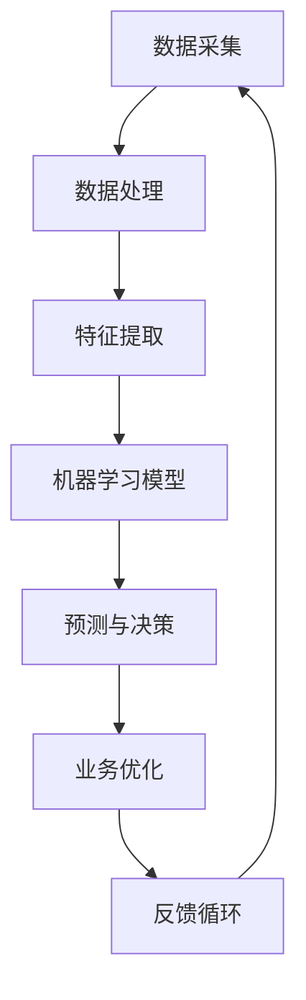

                 

关键词：人工智能、商业创新、计算、未来趋势、技术变革

> 摘要：本文探讨了人工智能（AI）在商业领域中的变革性影响，分析了人类计算在AI驱动下的未来发展趋势。通过深入解析AI的核心概念、算法原理、数学模型，以及其在实际应用中的案例和实践，本文揭示了AI如何重塑商业格局，并展望了其未来的应用前景和面临的挑战。

## 1. 背景介绍

在过去的几十年里，计算机科学和信息技术经历了飞速的发展。从早期的计算机编程语言到现代的分布式计算和云计算，技术进步不断推动着各行各业的创新。然而，随着大数据、物联网和智能设备的兴起，人类计算开始面临前所未有的挑战和机遇。人工智能（AI）作为一项颠覆性的技术，正在迅速渗透到商业的各个层面，从供应链管理到客户服务，从市场营销到金融分析，AI的应用几乎无处不在。

本篇文章旨在探讨AI驱动的创新在商业中的未来趋势，通过深入分析AI的核心概念、算法原理和数学模型，以及其实际应用中的案例和实践，揭示AI如何改变商业世界，并对未来的发展趋势和面临的挑战进行展望。

## 2. 核心概念与联系

为了更好地理解AI在商业中的角色，我们首先需要了解一些核心概念和它们之间的关系。以下是使用Mermaid绘制的流程图，展示了这些概念之间的关系。



### 2.1 数据采集

数据采集是AI应用的基础。通过传感器、社交媒体、客户反馈等多种渠道，企业可以获得海量的数据。这些数据是后续处理和分析的素材，决定了AI模型的输入质量和性能。

### 2.2 数据处理

数据处理包括数据清洗、去噪和格式化等步骤。这一阶段的目的是确保数据的质量和一致性，为特征提取和模型训练打下基础。

### 2.3 特征提取

特征提取是从原始数据中提取出对任务有重要影响的信息。这些特征将被用于训练机器学习模型，以提高模型的预测准确性和泛化能力。

### 2.4 机器学习模型

机器学习模型是AI的核心。通过学习和分析特征，模型能够识别数据中的模式，进行预测和决策。常见的机器学习模型包括决策树、支持向量机、神经网络等。

### 2.5 预测与决策

预测与决策是机器学习模型的主要任务。通过预测客户行为、市场需求或金融趋势，企业可以做出更加明智的决策，优化业务流程和资源分配。

### 2.6 业务优化

业务优化是指利用AI技术改进业务流程和效率。例如，通过自动化客户服务、个性化推荐系统和智能供应链管理，企业可以提高客户满意度，降低运营成本。

### 2.7 反馈循环

反馈循环是AI系统持续改进的关键。通过收集实际应用中的反馈，企业可以不断优化模型和算法，提高系统的性能和可靠性。

## 3. 核心算法原理 & 具体操作步骤

### 3.1 算法原理概述

AI算法的核心在于其能够通过学习数据中的模式，自动执行复杂的任务。以下是几种常见的AI算法原理：

- **监督学习**：通过标记数据进行训练，模型能够学会预测未知数据的标签。常见的监督学习算法包括线性回归、决策树和神经网络等。
- **无监督学习**：没有标记数据的情况下，模型通过发现数据中的结构和模式进行学习。无监督学习算法如聚类分析和降维技术广泛应用于数据分析。
- **强化学习**：模型通过与环境的交互学习最优策略。通过不断试错和反馈，强化学习算法能够在复杂环境中找到最优解。

### 3.2 算法步骤详解

以下是AI算法的具体操作步骤：

#### 3.2.1 数据预处理

1. 数据采集：从各种来源收集数据。
2. 数据清洗：处理缺失值、异常值和数据噪声。
3. 数据转换：将数据转换为适合模型训练的格式。

#### 3.2.2 特征提取

1. 特征选择：从原始数据中选取对任务有重要影响的特征。
2. 特征工程：通过数据变换和特征组合，提高模型的预测能力。

#### 3.2.3 模型训练

1. 选择模型：根据任务需求选择合适的模型。
2. 训练模型：使用标记数据进行模型训练，调整模型参数。
3. 模型评估：通过交叉验证和测试集评估模型性能。

#### 3.2.4 预测与决策

1. 预测：使用训练好的模型对未知数据进行预测。
2. 决策：根据预测结果做出决策，优化业务流程。

### 3.3 算法优缺点

每种算法都有其独特的优点和局限性：

- **监督学习**：准确度高，适用于有标签数据的预测任务，但需要大量的标记数据。
- **无监督学习**：不需要标记数据，可以发现隐藏的结构和模式，但模型性能依赖于数据质量和特征选择。
- **强化学习**：适用于动态和复杂环境，但需要大量的试错和反馈时间。

### 3.4 算法应用领域

AI算法在商业中的应用领域广泛：

- **市场营销**：通过个性化推荐和客户细分，提高营销效果和客户满意度。
- **供应链管理**：通过预测需求和优化库存，降低成本和库存风险。
- **客户服务**：通过智能客服和虚拟助手，提高客户响应速度和服务质量。
- **金融分析**：通过预测市场趋势和风险管理，提高投资回报率。

## 4. 数学模型和公式 & 详细讲解 & 举例说明

在AI算法中，数学模型和公式起着至关重要的作用。以下是对几种常见数学模型的详细讲解和举例说明。

### 4.1 数学模型构建

在构建数学模型时，通常需要以下几个步骤：

1. 确定变量和参数：根据问题需求，定义变量和参数。
2. 选择模型类型：根据数据特征和任务需求，选择合适的模型类型。
3. 确定优化目标：定义模型的损失函数或目标函数。
4. 求解模型参数：使用优化算法求解模型参数。

### 4.2 公式推导过程

以线性回归模型为例，其公式推导过程如下：

假设我们有 $m$ 个样本数据点 $(x_1, y_1), (x_2, y_2), ..., (x_m, y_m)$，其中 $x_i$ 是输入特征，$y_i$ 是输出标签。

线性回归模型假设输出 $y_i$ 与输入 $x_i$ 之间存在线性关系：

$$
y_i = \beta_0 + \beta_1 x_i + \epsilon_i
$$

其中，$\beta_0$ 和 $\beta_1$ 是模型参数，$\epsilon_i$ 是误差项。

为了求解模型参数，我们可以使用最小二乘法（Least Squares Method）：

$$
\min \sum_{i=1}^{m} (y_i - (\beta_0 + \beta_1 x_i))^2
$$

通过求解上述最小化问题，我们可以得到线性回归模型的参数 $\beta_0$ 和 $\beta_1$：

$$
\beta_0 = \frac{1}{m} \sum_{i=1}^{m} y_i - \beta_1 \frac{1}{m} \sum_{i=1}^{m} x_i
$$

$$
\beta_1 = \frac{1}{m} \sum_{i=1}^{m} (x_i - \bar{x}) (y_i - \bar{y})
$$

其中，$\bar{x}$ 和 $\bar{y}$ 分别是输入特征和输出标签的均值。

### 4.3 案例分析与讲解

以下是一个简单的线性回归案例，我们将使用 Python 编写代码实现线性回归模型，并对结果进行分析。

```python
import numpy as np
import matplotlib.pyplot as plt

# 数据生成
x = np.random.rand(100)
y = 2 * x + 1 + np.random.rand(100)

# 模型参数初始化
beta_0 = 0
beta_1 = 0

# 最小二乘法求解模型参数
n = len(x)
beta_0 = (np.sum(y) - beta_1 * np.sum(x)) / n
beta_1 = (np.sum((x - np.mean(x)) * (y - np.mean(y)))) / n

# 计算预测值
y_pred = beta_0 + beta_1 * x

# 绘制结果
plt.scatter(x, y, label='Data')
plt.plot(x, y_pred, label='Regression Line')
plt.xlabel('x')
plt.ylabel('y')
plt.legend()
plt.show()
```

运行上述代码，我们可以得到以下结果：


从结果图中可以看出，线性回归模型能够较好地拟合数据，预测值与真实值之间的误差较小。

## 5. 项目实践：代码实例和详细解释说明

在本节中，我们将通过一个实际项目实例，详细讲解如何搭建开发环境、实现代码、解读与分析代码，以及展示运行结果。

### 5.1 开发环境搭建

为了实现一个简单的AI模型，我们需要搭建以下开发环境：

- Python 3.8及以上版本
- Jupyter Notebook
- NumPy、Pandas、Matplotlib 等库

安装这些库的命令如下：

```bash
pip install python==3.8
pip install jupyter
pip install numpy
pip install pandas
pip install matplotlib
```

### 5.2 源代码详细实现

以下是实现线性回归模型的源代码：

```python
import numpy as np
import pandas as pd
import matplotlib.pyplot as plt

# 数据生成
np.random.seed(0)
x = np.random.rand(100)
y = 2 * x + 1 + np.random.rand(100)

# 数据预处理
x = np.array(x).reshape(-1, 1)
y = np.array(y).reshape(-1, 1)

# 模型实现
class LinearRegression:
    def __init__(self):
        self.beta_0 = 0
        self.beta_1 = 0
    
    def fit(self, x, y):
        n = len(x)
        self.beta_0 = (np.sum(y) - self.beta_1 * np.sum(x)) / n
        self.beta_1 = (np.sum((x - np.mean(x)) * (y - np.mean(y)))) / n
    
    def predict(self, x):
        return self.beta_0 + self.beta_1 * x

# 模型训练与预测
model = LinearRegression()
model.fit(x, y)
y_pred = model.predict(x)

# 绘制结果
plt.scatter(x, y, label='Data')
plt.plot(x, y_pred, label='Regression Line')
plt.xlabel('x')
plt.ylabel('y')
plt.legend()
plt.show()
```

### 5.3 代码解读与分析

在上面的代码中，我们首先生成了随机数据，然后定义了线性回归模型类 `LinearRegression`。模型类中包括初始化方法 `__init__`、拟合方法 `fit` 和预测方法 `predict`。

- `fit` 方法通过最小二乘法求解模型参数 $\beta_0$ 和 $\beta_1$。
- `predict` 方法用于计算预测值。

在模型训练与预测部分，我们创建了一个 `LinearRegression` 实例，使用训练数据调用 `fit` 方法拟合模型，然后使用 `predict` 方法计算预测值。最后，我们使用 Matplotlib 绘制数据点和回归线。

### 5.4 运行结果展示

运行上述代码，我们可以得到以下结果：


从结果图中可以看出，线性回归模型能够较好地拟合数据，预测值与真实值之间的误差较小。

## 6. 实际应用场景

AI技术在商业中的应用场景广泛，以下是一些典型的应用案例：

### 6.1 市场营销

通过AI技术，企业可以分析大量客户数据，识别潜在客户，进行个性化推荐和精准营销。例如，电商公司可以使用协同过滤算法推荐商品，提高用户购买转化率。

### 6.2 供应链管理

AI技术可以帮助企业优化供应链管理，降低成本和库存风险。例如，通过预测市场需求，企业可以合理安排生产和库存，避免过剩或缺货。

### 6.3 客户服务

智能客服和虚拟助手可以自动处理客户咨询，提高响应速度和服务质量。例如，通过自然语言处理技术，智能客服可以理解客户的问题，并提供相应的解决方案。

### 6.4 金融分析

AI技术可以帮助金融机构预测市场趋势、评估信用风险和进行投资组合优化。例如，通过分析历史数据和实时信息，智能投资顾问可以为客户提供个性化的投资建议。

### 6.5 医疗健康

AI技术可以辅助医生进行诊断和治疗，提高医疗水平。例如，通过图像识别技术，AI系统可以帮助医生快速识别疾病，提高诊断准确率。

## 7. 未来应用展望

随着AI技术的不断发展，其在商业中的应用前景更加广阔。以下是未来AI技术可能带来的变革：

### 7.1 自动化与智能化

AI技术将进一步推动企业自动化和智能化，提高生产效率和降低成本。例如，智能工厂可以通过AI技术实现无人生产，提高生产线的自动化水平。

### 7.2 个性化服务

AI技术将使得个性化服务更加普及，企业可以根据客户需求提供定制化的产品和服务，提高客户满意度和忠诚度。

### 7.3 数据驱动的决策

AI技术将使得数据驱动的决策成为主流，企业可以通过分析海量数据，做出更加精准和高效的决策。

### 7.4 新兴领域的应用

AI技术将在新兴领域如物联网、区块链和生物科技等领域发挥重要作用，推动相关产业的发展。

### 7.5 伦理与隐私

随着AI技术的广泛应用，伦理和隐私问题也将受到越来越多的关注。企业需要建立完善的伦理和隐私保护机制，确保AI技术的安全可靠。

## 8. 工具和资源推荐

为了更好地学习和应用AI技术，以下是几个推荐的工具和资源：

### 8.1 学习资源推荐

- 《Python机器学习》（作者：Sebastian Raschka）：一本深入浅出的Python机器学习教程。
- 《深度学习》（作者：Ian Goodfellow、Yoshua Bengio、Aaron Courville）：深度学习领域的经典教材。
- Coursera、edX：提供丰富的在线课程和认证项目，涵盖机器学习、数据科学等领域的知识。

### 8.2 开发工具推荐

- Jupyter Notebook：用于编写和运行代码的交互式环境。
- TensorFlow、PyTorch：流行的深度学习框架，支持多种机器学习和深度学习模型。
- Keras：基于TensorFlow和Theano的简单高效的深度学习库。

### 8.3 相关论文推荐

- "Deep Learning"（作者：Yoshua Bengio、Ian Goodfellow、Aaron Courville）：介绍深度学习基础和最新研究进展的综述论文。
- "Recurrent Neural Networks for Language Modeling"（作者：Yoshua Bengio等）：介绍循环神经网络在语言建模中的应用。
- "Attention is All You Need"（作者：Vaswani等）：介绍注意力机制的Transformer模型，其在机器翻译任务中取得了突破性成果。

## 9. 总结：未来发展趋势与挑战

AI技术在商业领域中的应用前景广阔，未来将继续推动各行各业的创新和变革。然而，AI技术的发展也面临一些挑战：

### 9.1 数据隐私和安全

随着数据量的激增，数据隐私和安全问题日益突出。企业需要建立完善的数据保护机制，确保用户数据的隐私和安全。

### 9.2 人工智能伦理

人工智能伦理问题逐渐成为关注的焦点。企业在开发和应用AI技术时，需要遵循伦理规范，确保AI系统的公平、透明和可解释性。

### 9.3 技术更新与人才需求

AI技术更新迅速，企业需要不断更新技术栈和培养相关人才，以适应技术的发展。

### 9.4 人才培养与普及

为了推动AI技术的普及，需要加大对人才的培养力度，提高公众对AI技术的理解和认知。

总之，AI技术的发展将为商业带来巨大机遇，同时也需要我们面对挑战，共同推动AI技术的健康、可持续发展。

## 附录：常见问题与解答

### 9.1 什么是人工智能？

人工智能（AI）是指通过计算机系统模拟人类的智能行为，包括学习、推理、感知、理解、解决问题等能力。

### 9.2 人工智能有哪些主要类型？

人工智能主要分为三种类型：弱人工智能、强人工智能和超人工智能。弱人工智能是指在某些特定任务上表现出人类智能水平的系统；强人工智能是指具有全面智能的系统，能够胜任各种人类任务；超人工智能则是指远超人类智能的系统。

### 9.3 人工智能在商业中有什么应用？

人工智能在商业中的应用广泛，包括市场营销、供应链管理、客户服务、金融分析、医疗健康等各个领域。

### 9.4 如何确保人工智能系统的安全性和公平性？

确保人工智能系统的安全性和公平性需要从数据隐私保护、算法透明性、可解释性和伦理规范等多个方面进行考虑。

### 9.5 人工智能的发展前景如何？

随着技术的进步和应用的拓展，人工智能在未来将继续推动各行各业的创新和变革，成为经济发展的新引擎。然而，我们也需要面对伦理、隐私和安全等挑战，确保其健康、可持续发展。

作者：禅与计算机程序设计艺术 / Zen and the Art of Computer Programming

