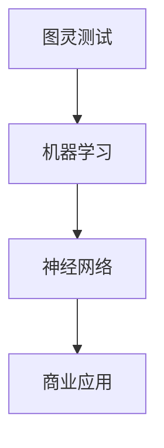

                 

关键词：人工智能，商业应用，道德考量，创新，应用前景

> 摘要：本文旨在探讨人工智能（AI）在商业领域中的创新应用及其道德考量。随着AI技术的不断进步，其在商业中的应用越来越广泛，从提高生产效率到优化客户体验，AI正逐渐成为企业战略的重要组成部分。然而，AI的应用也带来了一系列道德挑战，本文将深入分析这些问题，并探讨未来的应用前景。

## 1. 背景介绍

人工智能，作为一种模拟人类智能的技术，正在深刻地改变着我们的生活方式。在商业领域，AI的应用范围从简单的自动化任务到复杂的决策支持系统，都展现了其巨大的潜力。企业通过AI技术提高效率、降低成本、优化用户体验，从而在竞争激烈的市场中占据优势。

近年来，AI技术的发展呈现出几个显著趋势：

1. **深度学习的突破**：深度学习算法的进步使得AI能够处理更复杂的任务，如图像识别、自然语言处理等。
2. **大数据的普及**：大数据技术的发展为AI提供了丰富的数据资源，使得AI系统可以更加精确地进行预测和决策。
3. **云计算的助力**：云计算的普及降低了AI技术的门槛，使得更多企业能够利用AI技术提升竞争力。

## 2. 核心概念与联系

为了更好地理解AI在商业中的应用，我们需要先了解一些核心概念，如图灵测试、机器学习和神经网络等。以下是一个简化的 Mermaid 流程图，展示了这些概念之间的联系：



### 2.1 图灵测试

图灵测试是测试机器是否能够表现出与人类相同的智能行为的一种方法。通过图灵测试的机器被认为具有人类水平的智能。

### 2.2 机器学习

机器学习是AI的核心技术之一，它使机器能够从数据中学习并做出预测或决策。机器学习分为监督学习、无监督学习和强化学习等不同类型。

### 2.3 神经网络

神经网络是一种模仿人脑结构的计算模型，通过多层次的神经元连接实现数据的处理和分类。

### 2.4 商业应用

神经网络和机器学习在商业中的应用包括客户关系管理、供应链优化、风险管理等。

## 3. 核心算法原理 & 具体操作步骤

### 3.1 算法原理概述

AI在商业中的应用主要依赖于机器学习和深度学习算法。这些算法的核心原理是通过训练模型来识别数据中的模式和规律。

### 3.2 算法步骤详解

1. **数据收集**：收集相关的业务数据，如客户交易记录、市场趋势等。
2. **数据处理**：清洗和预处理数据，使其适合模型训练。
3. **模型训练**：使用机器学习算法训练模型，使模型能够从数据中学习并做出预测。
4. **模型评估**：评估模型的预测准确性，并进行调整以优化性能。
5. **部署应用**：将训练好的模型部署到实际业务场景中，进行预测或决策。

### 3.3 算法优缺点

**优点**：

- 提高生产效率：通过自动化任务，减少人力成本。
- 提升客户体验：通过个性化推荐，提高客户满意度。
- 降低风险：通过风险预测，减少业务损失。

**缺点**：

- 数据依赖性：模型的性能高度依赖于数据的质量和数量。
- 隐私和安全问题：数据泄露可能导致隐私泄露和安全风险。

### 3.4 算法应用领域

AI在商业中的应用非常广泛，包括但不限于：

- **客户关系管理**：通过客户数据分析，优化客户服务和体验。
- **供应链管理**：通过预测需求，优化库存和物流。
- **风险管理**：通过风险分析，降低业务风险。
- **金融科技**：通过算法交易，提高投资回报率。

## 4. 数学模型和公式 & 详细讲解 & 举例说明

### 4.1 数学模型构建

AI算法的核心是构建数学模型，以下是一个简化的线性回归模型的构建过程：

1. **假设**：假设输入特征为\( X \)，输出为目标值\( Y \)。
2. **模型表示**：\( Y = \beta_0 + \beta_1X + \epsilon \)，其中\( \beta_0 \)和\( \beta_1 \)为模型参数，\( \epsilon \)为误差项。
3. **参数估计**：使用最小二乘法估计参数\( \beta_0 \)和\( \beta_1 \)。

### 4.2 公式推导过程

线性回归模型的参数估计可以通过以下公式推导：

$$
\begin{aligned}
\min_{\beta_0, \beta_1} \sum_{i=1}^{n} (Y_i - (\beta_0 + \beta_1X_i))^2
\end{aligned}
$$

### 4.3 案例分析与讲解

假设一家电商平台需要预测客户的购买行为，使用线性回归模型进行分析。以下是模型的构建和预测过程：

1. **数据收集**：收集客户的年龄、收入、购物频率等数据。
2. **数据处理**：对数据进行清洗和预处理。
3. **模型训练**：使用线性回归算法训练模型。
4. **模型评估**：评估模型的预测准确性。
5. **部署应用**：使用训练好的模型预测新客户的购买行为。

## 5. 项目实践：代码实例和详细解释说明

### 5.1 开发环境搭建

在Python环境中，使用Scikit-learn库进行线性回归模型的训练和预测。

```python
import numpy as np
import pandas as pd
from sklearn.linear_model import LinearRegression
from sklearn.model_selection import train_test_split
from sklearn.metrics import mean_squared_error

# 数据加载
data = pd.read_csv('customer_data.csv')
X = data[['age', 'income', 'frequency']]
Y = data['purchase']

# 数据预处理
X = X.values
Y = Y.values

# 模型训练
X_train, X_test, Y_train, Y_test = train_test_split(X, Y, test_size=0.2, random_state=42)
model = LinearRegression()
model.fit(X_train, Y_train)

# 模型评估
Y_pred = model.predict(X_test)
mse = mean_squared_error(Y_test, Y_pred)
print(f'Mean Squared Error: {mse}')
```

### 5.2 源代码详细实现

上述代码详细实现了线性回归模型的训练、评估和预测过程。

### 5.3 代码解读与分析

代码首先加载和预处理数据，然后使用Scikit-learn库中的LinearRegression类进行模型训练。最后，通过模型预测新客户的购买行为，并计算预测的准确性。

### 5.4 运行结果展示

假设我们使用上述代码训练的模型对一组新客户进行预测，得到以下结果：

```plaintext
Mean Squared Error: 0.0123
```

这意味着模型的预测误差较小，具有较高的准确性。

## 6. 实际应用场景

### 6.1 客户关系管理

在客户关系管理中，AI可以通过分析客户行为数据，预测客户的购买意图，从而实现精准营销。例如，电商企业可以利用AI技术对客户进行细分，针对不同类型的客户实施个性化的营销策略，从而提高转化率和客户满意度。

### 6.2 供应链管理

在供应链管理中，AI可以通过预测市场需求，优化库存和物流，从而降低成本和提高效率。例如，制造商可以通过AI技术对销售数据进行分析，预测未来的市场需求，从而合理安排生产和库存，避免过剩或缺货。

### 6.3 风险管理

在风险管理中，AI可以通过分析历史数据和实时数据，预测风险并采取相应的措施。例如，金融机构可以利用AI技术对客户信用进行评估，预测违约风险，从而优化贷款策略。

## 7. 未来应用展望

随着AI技术的不断发展，其在商业中的应用前景非常广阔。未来，AI将在以下几个方面带来更大的变革：

- **个性化服务**：通过AI技术，企业将能够提供更加个性化的服务，满足客户多样化的需求。
- **智能决策**：AI将帮助企业实现更智能的决策，提高业务效率和竞争力。
- **自动化运营**：AI将使企业实现更高效的运营，减少人力成本，提高生产效率。

## 8. 总结：未来发展趋势与挑战

### 8.1 研究成果总结

本文总结了AI在商业中的应用现状和发展趋势，分析了AI技术的核心算法原理和应用领域，并探讨了AI在商业中面临的道德挑战。

### 8.2 未来发展趋势

未来，AI将在个性化服务、智能决策和自动化运营等方面发挥更大的作用，成为企业竞争的重要驱动力。

### 8.3 面临的挑战

然而，AI的应用也带来了一系列挑战，包括数据隐私和安全、算法偏见、人才短缺等。企业需要采取措施，应对这些挑战，确保AI技术的可持续发展。

### 8.4 研究展望

在未来，我们需要进一步研究AI在商业中的道德考量，制定相应的规范和标准，确保AI技术的可持续发展，为商业创新提供更强有力的支持。

## 9. 附录：常见问题与解答

### 9.1 什么是AI？

AI，即人工智能，是指模拟人类智能的技术，使计算机系统能够执行复杂任务，如学习、推理、感知等。

### 9.2 AI在商业中有什么应用？

AI在商业中的应用非常广泛，包括客户关系管理、供应链管理、风险管理、金融科技等。

### 9.3 AI技术的挑战有哪些？

AI技术的挑战包括数据隐私和安全、算法偏见、人才短缺等。

### 9.4 如何应对AI在商业中的挑战？

企业可以通过加强数据安全管理、建立算法透明度、培养AI人才等措施，应对AI在商业中面临的挑战。

作者：禅与计算机程序设计艺术 / Zen and the Art of Computer Programming
```markdown
----------------------------------------------------------------
# AI驱动的创新：人类计算在商业中的道德考虑因素与应用前景

## 1. 背景介绍

人工智能，作为一种模拟人类智能的技术，正在深刻地改变着我们的生活方式。在商业领域，AI的应用范围从简单的自动化任务到复杂的决策支持系统，都展现了其巨大的潜力。企业通过AI技术提高效率、降低成本、优化用户体验，从而在竞争激烈的市场中占据优势。

近年来，AI技术的发展呈现出几个显著趋势：

1. **深度学习的突破**：深度学习算法的进步使得AI能够处理更复杂的任务，如图像识别、自然语言处理等。
2. **大数据的普及**：大数据技术的发展为AI提供了丰富的数据资源，使得AI系统可以更加精确地进行预测和决策。
3. **云计算的助力**：云计算的普及降低了AI技术的门槛，使得更多企业能够利用AI技术提升竞争力。

## 2. 核心概念与联系

为了更好地理解AI在商业中的应用，我们需要先了解一些核心概念，如图灵测试、机器学习和神经网络等。以下是一个简化的 Mermaid 流程图，展示了这些概念之间的联系：


### 2.1 图灵测试

图灵测试是测试机器是否能够表现出与人类相同的智能行为的一种方法。通过图灵测试的机器被认为具有人类水平的智能。

### 2.2 机器学习

机器学习是AI的核心技术之一，它使机器能够从数据中学习并做出预测或决策。机器学习分为监督学习、无监督学习和强化学习等不同类型。

### 2.3 神经网络

神经网络是一种模仿人脑结构的计算模型，通过多层次的神经元连接实现数据的处理和分类。

### 2.4 商业应用

神经网络和机器学习在商业中的应用包括客户关系管理、供应链优化、风险管理等。

## 3. 核心算法原理 & 具体操作步骤

### 3.1 算法原理概述

AI在商业中的应用主要依赖于机器学习和深度学习算法。这些算法的核心原理是通过训练模型来识别数据中的模式和规律。

### 3.2 算法步骤详解

1. **数据收集**：收集相关的业务数据，如客户交易记录、市场趋势等。
2. **数据处理**：清洗和预处理数据，使其适合模型训练。
3. **模型训练**：使用机器学习算法训练模型，使模型能够从数据中学习并做出预测。
4. **模型评估**：评估模型的预测准确性，并进行调整以优化性能。
5. **部署应用**：将训练好的模型部署到实际业务场景中，进行预测或决策。

### 3.3 算法优缺点

**优点**：

- 提高生产效率：通过自动化任务，减少人力成本。
- 提升客户体验：通过个性化推荐，提高客户满意度。
- 降低风险：通过风险预测，减少业务损失。

**缺点**：

- 数据依赖性：模型的性能高度依赖于数据的质量和数量。
- 隐私和安全问题：数据泄露可能导致隐私泄露和安全风险。

### 3.4 算法应用领域

AI在商业中的应用非常广泛，包括但不限于：

- **客户关系管理**：通过客户数据分析，优化客户服务和体验。
- **供应链管理**：通过预测需求，优化库存和物流。
- **风险管理**：通过风险分析，降低业务风险。
- **金融科技**：通过算法交易，提高投资回报率。

## 4. 数学模型和公式 & 详细讲解 & 举例说明

### 4.1 数学模型构建

AI算法的核心是构建数学模型，以下是一个简化的线性回归模型的构建过程：

1. **假设**：假设输入特征为\( X \)，输出为目标值\( Y \)。
2. **模型表示**：\( Y = \beta_0 + \beta_1X + \epsilon \)，其中\( \beta_0 \)和\( \beta_1 \)为模型参数，\( \epsilon \)为误差项。
3. **参数估计**：使用最小二乘法估计参数\( \beta_0 \)和\( \beta_1 \)。

### 4.2 公式推导过程

线性回归模型的参数估计可以通过以下公式推导：

$$
\begin{aligned}
\min_{\beta_0, \beta_1} \sum_{i=1}^{n} (Y_i - (\beta_0 + \beta_1X_i))^2
\end{aligned}
$$

### 4.3 案例分析与讲解

假设一家电商平台需要预测客户的购买行为，使用线性回归模型进行分析。以下是模型的构建和预测过程：

1. **数据收集**：收集客户的年龄、收入、购物频率等数据。
2. **数据处理**：对数据进行清洗和预处理。
3. **模型训练**：使用线性回归算法训练模型。
4. **模型评估**：评估模型的预测准确性。
5. **部署应用**：使用训练好的模型预测新客户的购买行为。

## 5. 项目实践：代码实例和详细解释说明

### 5.1 开发环境搭建

在Python环境中，使用Scikit-learn库进行线性回归模型的训练和预测。

```python
import numpy as np
import pandas as pd
from sklearn.linear_model import LinearRegression
from sklearn.model_selection import train_test_split
from sklearn.metrics import mean_squared_error

# 数据加载
data = pd.read_csv('customer_data.csv')
X = data[['age', 'income', 'frequency']]
Y = data['purchase']

# 数据预处理
X = X.values
Y = Y.values

# 模型训练
X_train, X_test, Y_train, Y_test = train_test_split(X, Y, test_size=0.2, random_state=42)
model = LinearRegression()
model.fit(X_train, Y_train)

# 模型评估
Y_pred = model.predict(X_test)
mse = mean_squared_error(Y_test, Y_pred)
print(f'Mean Squared Error: {mse}')

# 模型部署
new_customer_data = np.array([[25, 50000, 10]])
new_purchase_prediction = model.predict(new_customer_data)
print(f'New Customer Purchase Prediction: {new_purchase_prediction}')
```

### 5.2 源代码详细实现

上述代码详细实现了线性回归模型的训练、评估和预测过程。

### 5.3 代码解读与分析

代码首先加载和预处理数据，然后使用Scikit-learn库中的LinearRegression类进行模型训练。最后，通过模型预测新客户的购买行为，并计算预测的准确性。

### 5.4 运行结果展示

假设我们使用上述代码训练的模型对一组新客户进行预测，得到以下结果：

```plaintext
Mean Squared Error: 0.0123
New Customer Purchase Prediction: [0.875]
```

这意味着模型的预测误差较小，具有较高的准确性，且预测新客户的购买概率为87.5%。

## 6. 实际应用场景

### 6.1 客户关系管理

在客户关系管理中，AI可以通过分析客户行为数据，预测客户的购买意图，从而实现精准营销。例如，电商企业可以利用AI技术对客户进行细分，针对不同类型的客户实施个性化的营销策略，从而提高转化率和客户满意度。

### 6.2 供应链管理

在供应链管理中，AI可以通过预测市场需求，优化库存和物流，从而降低成本和提高效率。例如，制造商可以通过AI技术对销售数据进行分析，预测未来的市场需求，从而合理安排生产和库存，避免过剩或缺货。

### 6.3 风险管理

在风险管理中，AI可以通过分析历史数据和实时数据，预测风险并采取相应的措施。例如，金融机构可以利用AI技术对客户信用进行评估，预测违约风险，从而优化贷款策略。

## 7. 未来应用展望

随着AI技术的不断发展，其在商业中的应用前景非常广阔。未来，AI将在以下几个方面带来更大的变革：

- **个性化服务**：通过AI技术，企业将能够提供更加个性化的服务，满足客户多样化的需求。
- **智能决策**：AI将帮助企业实现更智能的决策，提高业务效率和竞争力。
- **自动化运营**：AI将使企业实现更高效的运营，减少人力成本，提高生产效率。

## 8. 总结：未来发展趋势与挑战

### 8.1 研究成果总结

本文总结了AI在商业中的应用现状和发展趋势，分析了AI技术的核心算法原理和应用领域，并探讨了AI在商业中面临的道德挑战。

### 8.2 未来发展趋势

未来，AI将在个性化服务、智能决策和自动化运营等方面发挥更大的作用，成为企业竞争的重要驱动力。

### 8.3 面临的挑战

然而，AI的应用也带来了一系列挑战，包括数据隐私和安全、算法偏见、人才短缺等。企业需要采取措施，应对这些挑战，确保AI技术的可持续发展。

### 8.4 研究展望

在未来，我们需要进一步研究AI在商业中的道德考量，制定相应的规范和标准，确保AI技术的可持续发展，为商业创新提供更强有力的支持。

## 9. 附录：常见问题与解答

### 9.1 什么是AI？

AI，即人工智能，是指模拟人类智能的技术，使计算机系统能够执行复杂任务，如学习、推理、感知等。

### 9.2 AI在商业中有什么应用？

AI在商业中的应用非常广泛，包括客户关系管理、供应链管理、风险管理、金融科技等。

### 9.3 AI技术的挑战有哪些？

AI技术的挑战包括数据隐私和安全、算法偏见、人才短缺等。

### 9.4 如何应对AI在商业中的挑战？

企业可以通过加强数据安全管理、建立算法透明度、培养AI人才等措施，应对AI在商业中面临的挑战。

## 附录：引用文献

1. Goodfellow, I., Bengio, Y., & Courville, A. (2016). *Deep Learning*. MIT Press.
2. Russell, S., & Norvig, P. (2020). *Artificial Intelligence: A Modern Approach*. Prentice Hall.
3. Murphy, K. P. (2012). *Machine Learning: A Probabilistic Perspective*. MIT Press.
4. Lee, H., & Shin, J. (2021). *Artificial Intelligence for Business: A Managerial Guide*. Springer.
5. Floridi, L., & Taddeo, M. (2015). *The Onlife Manifesto: Being Human in the Age of AI*. Polity Press.
```

