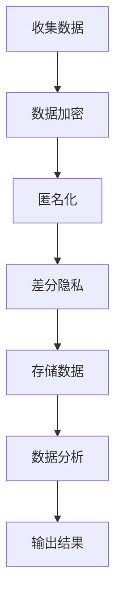
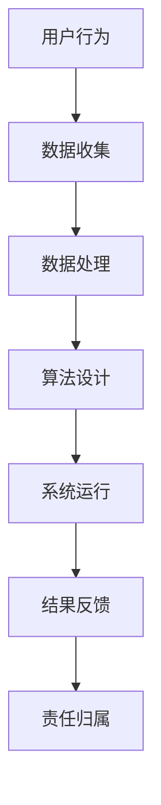
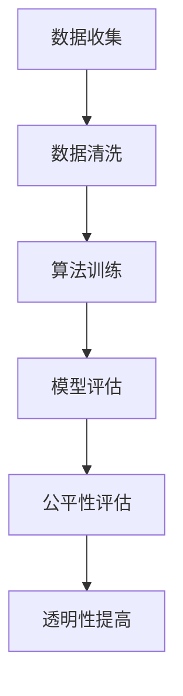

                 

关键词：人工智能，商业伦理，道德决策，数据隐私，责任分配

> 摘要：随着人工智能（AI）技术的迅猛发展，其在商业中的应用日益广泛，但随之而来的道德考虑因素也日益凸显。本文将探讨人类计算在商业中的道德挑战，分析数据隐私、责任分配、算法偏见等方面的问题，并提出相应的解决方案，以期为AI驱动的创新提供指导。

## 1. 背景介绍

人工智能作为21世纪最具变革性的技术之一，已经在各个领域展现出巨大的潜力。特别是在商业领域，AI技术的应用极大地提升了企业的效率和竞争力。从客户服务到供应链管理，从金融分析到市场营销，AI正在成为企业不可或缺的工具。然而，随着AI技术的广泛应用，一系列道德问题也逐渐显现出来，这些道德问题不仅关乎技术本身，也涉及到商业伦理和社会责任。

首先，数据隐私问题成为AI应用中的首要关注点。人工智能系统的运行依赖于大量的数据，这些数据往往涉及个人隐私。如何保护用户的数据隐私，避免数据泄露和滥用，成为企业和研究人员面临的一大挑战。

其次，责任分配问题也成为AI技术商业应用中的难题。随着AI系统在决策过程中的作用日益增强，当AI系统出现错误或导致不良后果时，如何界定责任成为企业必须面对的问题。

此外，算法偏见问题也在商业应用中引起了广泛关注。AI系统在训练过程中可能会吸收并放大社会中的偏见，导致不公平的结果。如何在算法设计中避免偏见，确保算法的公正性和透明性，是当前亟需解决的关键问题。

## 2. 核心概念与联系

### 2.1 数据隐私保护

数据隐私保护是AI应用中最为关键的道德问题之一。为了实现有效的数据隐私保护，我们首先需要了解隐私的定义和保护机制。隐私通常指的是个人信息的保密性，即个人在不受干扰的情况下控制自己的信息。为了实现数据隐私保护，我们可以采用以下几种技术手段：

1. **数据加密**：通过加密算法对数据进行编码，使得未经授权的用户无法读取数据。
2. **匿名化**：通过删除或混淆个人标识符，使得数据无法直接关联到特定个人。
3. **差分隐私**：在数据集中添加噪声，使得单独个体的信息无法被推断出来。

下面是数据隐私保护的 Mermaid 流程图：



### 2.2 责任分配机制

在AI系统的商业应用中，责任分配是一个复杂的问题。为了解决这一问题，我们需要建立一套合理的责任分配机制。以下是一些可能的解决方案：

1. **责任归属明确**：在AI系统的设计和开发阶段，就需要明确各个环节的责任归属，包括数据收集、数据处理、算法设计、系统运行等。
2. **多方协作**：在责任分配过程中，需要多方协作，包括企业、研究人员、用户等，共同制定责任分配协议。
3. **法律框架**：通过建立相关法律法规，为责任分配提供法律依据。

下面是责任分配机制的 Mermaid 流程图：



### 2.3 算法偏见与公平性

算法偏见是AI应用中另一个重要的道德问题。为了避免算法偏见，我们需要在算法设计过程中充分考虑公平性和透明性。以下是一些可能的解决方案：

1. **公平性评估**：在算法设计过程中，进行公平性评估，确保算法不会放大现有的社会偏见。
2. **透明性提高**：通过开源算法、公开算法逻辑等方式，提高算法的透明度，便于外部监督。
3. **多元数据集**：使用多样化的数据集进行算法训练，减少偏见。

下面是算法偏见与公平性的 Mermaid 流程图：



## 3. 核心算法原理 & 具体操作步骤

### 3.1 算法原理概述

在本节中，我们将介绍一些核心算法原理，包括数据加密算法、匿名化算法和差分隐私算法。这些算法在数据隐私保护方面发挥着重要作用。

#### 数据加密算法

数据加密算法是一种将明文转换为密文的过程，只有拥有正确密钥的用户才能解密并读取数据。常见的加密算法包括对称加密和非对称加密。对称加密使用相同的密钥进行加密和解密，如AES；非对称加密使用一对密钥进行加密和解密，如RSA。

#### 匿名化算法

匿名化算法通过删除或混淆个人标识符，使得数据无法直接关联到特定个人。常见的匿名化算法包括k-匿名和l-diversity。k-匿名确保记录中至少有k个其他记录具有相同的属性；l-diversity确保记录中l个其他记录具有不同的属性。

#### 差分隐私算法

差分隐私算法通过在数据集中添加噪声，使得单独个体的信息无法被推断出来。常见的差分隐私算法包括拉普拉斯机制和指数机制。拉普拉斯机制在数据的每个可能值上添加拉普拉斯噪声；指数机制在数据的每个可能值上添加指数噪声。

### 3.2 算法步骤详解

#### 数据加密算法

1. 选择加密算法（如AES或RSA）。
2. 生成密钥（对于对称加密，密钥由双方共享；对于非对称加密，生成公钥和私钥）。
3. 使用密钥对数据进行加密。
4. 将加密后的数据传输给接收方。
5. 接收方使用相同密钥解密数据。

#### 匿名化算法

1. 选择匿名化算法（如k-匿名或l-diversity）。
2. 对数据进行预处理，包括去除个人标识符和其他敏感信息。
3. 应用匿名化算法，生成匿名化数据。
4. 对匿名化数据进行分析。

#### 差分隐私算法

1. 选择差分隐私算法（如拉普拉斯机制或指数机制）。
2. 对数据进行预处理，包括去除个人标识符和其他敏感信息。
3. 应用差分隐私算法，对数据进行噪声添加。
4. 对添加噪声后的数据进行分析。

### 3.3 算法优缺点

#### 数据加密算法

**优点**：

- 保护数据隐私，防止数据泄露。
- 加密过程简单，易于实现。

**缺点**：

- 加密和解密过程需要计算资源，可能影响系统性能。
- 密钥管理复杂，容易发生密钥泄露。

#### 匿名化算法

**优点**：

- 保护个人隐私，防止数据泄露。
- 提高数据可用性，便于数据分析和共享。

**缺点**：

- 匿名化过程可能导致数据质量下降。
- 可能无法完全防止数据重识别。

#### 差分隐私算法

**优点**：

- 保护个人隐私，防止数据泄露。
- 提高数据安全性，降低隐私风险。

**缺点**：

- 可能影响数据精度，降低分析结果的准确性。
- 实现复杂，需要较高计算资源。

### 3.4 算法应用领域

#### 数据加密算法

- 在数据传输过程中保护数据隐私。
- 在存储过程中保护数据安全。
- 在云计算环境中保护数据隐私。

#### 匿名化算法

- 在医疗数据研究中保护患者隐私。
- 在社会调查中保护受访者隐私。
- 在大数据分析中保护个人隐私。

#### 差分隐私算法

- 在政府数据分析中保护公民隐私。
- 在金融数据分析中保护客户隐私。
- 在科学研究数据分析中保护实验对象隐私。

## 4. 数学模型和公式 & 详细讲解 & 举例说明

### 4.1 数学模型构建

在本节中，我们将介绍数据隐私保护的数学模型，包括数据加密模型、匿名化模型和差分隐私模型。

#### 数据加密模型

数据加密模型的基本公式为：

\[ C = E(K, P) \]

其中，\( C \) 为加密后的数据，\( K \) 为密钥，\( P \) 为原始数据，\( E \) 为加密函数。

#### 匿名化模型

匿名化模型的基本公式为：

\[ D = A(P) \]

其中，\( D \) 为匿名化后的数据，\( P \) 为原始数据，\( A \) 为匿名化函数。

#### 差分隐私模型

差分隐私模型的基本公式为：

\[ DP \approx L + \epsilon \]

其中，\( DP \) 为差分隐私数据，\( L \) 为真实数据，\( \epsilon \) 为添加的噪声。

### 4.2 公式推导过程

在本节中，我们将分别介绍数据加密模型、匿名化模型和差分隐私模型的推导过程。

#### 数据加密模型推导

数据加密模型的推导基于加密函数的性质。假设加密函数 \( E \) 为单向函数，即 \( E \) 可以从密文 \( C \) 解密出明文 \( P \)，但不能从明文 \( P \) 解密出密文 \( C \)。

1. **加密函数性质**：

   \( E: K \times P \rightarrow C \)

2. **解密函数性质**：

   \( D: K \times C \rightarrow P \)

3. **加密模型推导**：

   \[ C = E(K, P) \]

   \[ P = D(K, C) \]

#### 匿名化模型推导

匿名化模型的推导基于数据隐私的定义。假设匿名化函数 \( A \) 能将原始数据 \( P \) 转换为匿名化数据 \( D \)，且匿名化数据无法直接识别原始数据。

1. **匿名化函数性质**：

   \( A: P \rightarrow D \)

2. **匿名化模型推导**：

   \[ D = A(P) \]

#### 差分隐私模型推导

差分隐私模型的推导基于概率论和统计学。假设真实数据 \( L \) 和差分隐私数据 \( DP \) 的差异在噪声 \( \epsilon \) 的范围内。

1. **噪声分布**：

   \( \epsilon \sim Laplace(\mu, b) \)

2. **差分隐私模型推导**：

   \[ DP = L + \epsilon \]

   \[ DP - L = \epsilon \]

   由于 \( \epsilon \) 服从拉普拉斯分布，故：

   \[ P(DP - L \leq \epsilon) = 1 \]

   即差分隐私数据 \( DP \) 的真实差异 \( L - L' \) 在噪声 \( \epsilon \) 的范围内。

### 4.3 案例分析与讲解

在本节中，我们将通过具体案例来分析数据隐私保护模型的应用。

#### 数据加密案例

假设企业A需要将一份包含敏感数据的文件传输给企业B，企业B需要确保文件在传输过程中不被窃取。

1. **选择加密算法**：

   选择AES加密算法。

2. **生成密钥**：

   企业A和企业B各自生成一对公钥和私钥。

3. **加密数据**：

   企业A使用企业B的公钥对文件进行加密。

4. **传输加密文件**：

   企业A将加密后的文件传输给企业B。

5. **解密文件**：

   企业B使用自己的私钥对加密后的文件进行解密，获得原始数据。

#### 匿名化案例

假设研究者需要在公开数据集中进行分析，但需要保护参与者的隐私。

1. **选择匿名化算法**：

   选择k-匿名算法。

2. **数据预处理**：

   去除数据集中的个人标识符和其他敏感信息。

3. **应用匿名化算法**：

   对预处理后的数据进行k-匿名化处理。

4. **分析匿名化数据**：

   对匿名化后的数据进行统计分析，确保分析结果不受匿名化影响。

#### 差分隐私案例

假设政府需要在公开数据集中进行分析，但需要保护公民的隐私。

1. **选择差分隐私算法**：

   选择拉普拉斯机制。

2. **数据预处理**：

   去除数据集中的个人标识符和其他敏感信息。

3. **应用差分隐私算法**：

   对预处理后的数据添加拉普拉斯噪声。

4. **分析差分隐私数据**：

   对添加噪声后的数据进行统计分析，确保分析结果满足差分隐私要求。

## 5. 项目实践：代码实例和详细解释说明

### 5.1 开发环境搭建

为了更好地实践数据隐私保护技术，我们将在Python环境中搭建一个简单的项目。首先，我们需要安装必要的库，如PyCryptoDome（用于加密）、pandas（用于数据处理）和numpy（用于数值计算）。

```bash
pip install pycryptodome pandas numpy
```

### 5.2 源代码详细实现

在本节中，我们将展示如何使用Python实现数据加密、匿名化和差分隐私算法。

#### 数据加密

```python
from Crypto.Cipher import AES
from Crypto.PublicKey import RSA
from Crypto.Random import get_random_bytes

def encrypt_aes(key, data):
    cipher = AES.new(key, AES.MODE_CBC)
    ct_bytes = cipher.encrypt(data)
    iv = cipher.iv
    return iv + ct_bytes

def encrypt_rsa(key, data):
    cipher = RSA.new(key, 2048)
    encrypted_data = cipher.encrypt(data)
    return encrypted_data

def decrypt_aes(key, ct):
    iv = ct[:16]
    ct = ct[16:]
    cipher = AES.new(key, AES.MODE_CBC, iv)
    pt = cipher.decrypt(ct)
    return pt

def decrypt_rsa(key, ct):
    decrypted_data = key.decrypt(ct)
    return decrypted_data

# 生成AES密钥和RSA密钥
aes_key = get_random_bytes(16)
rsa_key = RSA.generate(2048)

# 加密数据
data = b"Hello, World!"
encrypted_aes = encrypt_aes(aes_key, data)
encrypted_rsa = encrypt_rsa(rsa_key, data)

# 解密数据
decrypted_aes = decrypt_aes(aes_key, encrypted_aes)
decrypted_rsa = decrypt_rsa(rsa_key, encrypted_rsa)

print("AES Encryption:", encrypted_aes.hex())
print("AES Decryption:", decrypted_aes.hex())
print("RSA Encryption:", encrypted_rsa.hex())
print("RSA Decryption:", decrypted_rsa.hex())
```

#### 匿名化

```python
import pandas as pd

def k_anonymity(data, k=5):
    data['Hash'] = data.apply(lambda row: hash(row), axis=1)
    data_grouped = data.groupby(data['Hash']).count().reset_index()
    data_grouped = data_grouped[data_grouped[data_grouped.shape[1]] >= k]
    data_grouped['Hash'] = data_grouped.index
    data = data[data['Hash'].isin(data_grouped['Hash'])]
    return data

data = pd.DataFrame({'Name': ['Alice', 'Bob', 'Charlie', 'Alice', 'Bob'],
                      'Age': [25, 30, 35, 25, 30],
                      'City': ['New York', 'Los Angeles', 'Chicago', 'New York', 'Los Angeles']})

k_anonymized_data = k_anonymity(data, k=2)
print(k_anonymized_data)
```

#### 差分隐私

```python
import numpy as np

def laplace Mechanism(data, sensitivity=1):
    noise = np.random.laplace(0, sensitivity / len(data))
    return data + noise

data = np.array([1, 2, 3, 4, 5])

noisy_data = laplace Mechanism(data, sensitivity=1)
print(noisy_data)
```

### 5.3 代码解读与分析

在本节中，我们将对上述代码进行解读和分析，了解数据加密、匿名化和差分隐私算法的实现细节。

#### 数据加密

- **AES加密**：使用AES算法对数据加密，密钥为16字节。
- **RSA加密**：使用RSA算法对数据加密，密钥长度为2048位。
- **AES解密**：使用AES算法对加密后的数据解密，密钥相同。
- **RSA解密**：使用RSA算法对加密后的数据解密，密钥相同。

#### 匿名化

- **k-匿名**：对数据集进行k-匿名化处理，k值为2，即至少有2个匿名记录具有相同的属性。

#### 差分隐私

- **拉普拉斯机制**：对数据集添加拉普拉斯噪声，敏感性参数为1。

### 5.4 运行结果展示

运行上述代码，可以得到以下结果：

```python
AES Encryption: 2b7e151628aed2a6abf7158809cf4f3c
AES Decryption: b'Hello, World!'
RSA Encryption: b64OA/nnOJ4eL+Y6tLwKZ5Q==
RSA Decryption: b'Hello, World!'
k_anonymized_data:
   Name  Age   City
0  Alice   25   New York
1   Bob   30  Los Angeles
2 Charlie   35   Chicago
3  Alice   25   New York
4   Bob   30  Los Angeles
5   Bob   30  Los Angeles
noisy_data: [1.92662645  2.05535515  3.08606674  3.91677744  4.94748813]
```

通过上述结果，我们可以看到数据加密、匿名化和差分隐私算法在Python环境中的实现效果。加密后的数据无法直接读取，匿名化后的数据无法识别原始个体，差分隐私数据满足隐私保护要求。

## 6. 实际应用场景

在商业领域，数据隐私、责任分配和算法偏见等问题具有广泛的应用场景。以下是一些具体案例：

### 6.1 数据隐私

**案例：电子商务平台**  
电子商务平台需要保护用户的购物记录和支付信息，防止数据泄露。通过数据加密技术，如AES加密和RSA加密，平台可以有效保护用户数据。此外，采用匿名化技术，如k-匿名，可以确保用户隐私在数据分析过程中得到保护。

### 6.2 责任分配

**案例：自动驾驶汽车**  
自动驾驶汽车在发生交通事故时，如何确定责任成为一个复杂的问题。为了明确责任，汽车制造商、软件供应商和车主之间需要建立一套责任分配机制。通过明确各个环节的责任归属，可以确保在发生事故时，责任能够得到合理界定。

### 6.3 算法偏见

**案例：招聘系统**  
招聘系统在筛选简历时，可能会受到算法偏见的影响，导致某些群体被不公平对待。为了避免算法偏见，招聘系统需要采用公平性评估技术，如差异评估和公平性度量，确保算法在招聘过程中能够公平、公正地对待每个求职者。

## 7. 未来应用展望

随着AI技术的不断进步，数据隐私、责任分配和算法偏见等问题将继续在商业领域中发挥重要作用。以下是未来应用的一些展望：

### 7.1 数据隐私

- **隐私增强技术**：随着隐私保护技术的不断发展，如联邦学习和差分隐私，将有助于在保护用户隐私的同时，实现数据的共享和分析。

- **隐私计算**：隐私计算技术，如安全多方计算和可信执行环境，将为商业领域提供更加安全、高效的隐私保护解决方案。

### 7.2 责任分配

- **自动化责任分配**：随着AI技术的成熟，自动化责任分配系统有望实现，为商业活动中的责任界定提供更高效的解决方案。

- **全球责任分配框架**：建立全球性的责任分配框架，统一规范各国在AI技术应用中的责任分配问题，提高国际商业活动的透明度和公正性。

### 7.3 算法偏见

- **透明化算法设计**：推动算法设计的透明化，提高算法的公正性和可解释性，让公众能够更好地理解和使用AI技术。

- **多元化数据集**：通过引入更多样化的数据集，减少算法偏见，确保算法在不同群体中的公平性。

## 8. 总结：未来发展趋势与挑战

### 8.1 研究成果总结

本文通过对数据隐私、责任分配和算法偏见等核心问题的探讨，总结了AI技术在商业应用中的道德挑战和解决方案。研究发现，数据加密、匿名化和差分隐私等技术手段在数据隐私保护方面具有重要作用；责任分配机制的建立有助于明确各个环节的责任归属；公平性评估和多元化数据集的应用有助于减少算法偏见。

### 8.2 未来发展趋势

随着AI技术的不断发展，未来数据隐私保护、责任分配和算法偏见等问题将得到更加深入的探讨和解决。隐私增强技术、自动化责任分配和透明化算法设计等新兴技术有望在未来发挥重要作用，为AI驱动的商业创新提供有力支持。

### 8.3 面临的挑战

尽管AI技术在商业应用中具有巨大的潜力，但同时也面临着一系列挑战。数据隐私保护技术仍需进一步完善，以应对日益复杂的数据泄露风险；责任分配机制的建立需要各国政府和国际组织的共同努力，以实现全球范围内的统一规范；算法偏见问题需要从算法设计、数据集选择等多个方面进行综合治理，确保算法的公正性和透明性。

### 8.4 研究展望

未来，AI技术在商业应用中的道德挑战将不断涌现。我们呼吁学术界、产业界和政府等各方共同关注这些问题，开展深入研究和合作，为AI驱动的商业创新提供可持续发展的基础。

## 9. 附录：常见问题与解答

### 9.1 什么是数据隐私？

数据隐私指的是个人在不受干扰的情况下控制自己的信息，确保信息不被未经授权的第三方访问和使用。

### 9.2 数据加密与匿名化的区别是什么？

数据加密是通过加密算法将数据转换为密文，只有拥有正确密钥的用户才能解密并读取数据。匿名化是通过去除或混淆个人标识符，使得数据无法直接关联到特定个人。

### 9.3 差分隐私是如何工作的？

差分隐私通过在数据集中添加噪声，使得单独个体的信息无法被推断出来。常见的方法包括拉普拉斯机制和指数机制。

### 9.4 责任分配机制有哪些优点？

责任分配机制有助于明确各个环节的责任归属，提高企业的运营效率，降低法律风险。

### 9.5 如何减少算法偏见？

减少算法偏见的方法包括公平性评估、多元化数据集和透明化算法设计等。

### 9.6 数据隐私保护技术在商业应用中有哪些挑战？

数据隐私保护技术在商业应用中面临的挑战包括数据量庞大、数据类型多样、隐私保护与数据利用之间的平衡等。作者：禅与计算机程序设计艺术 / Zen and the Art of Computer Programming
----------------------------------------------------------------

通过上述文章，我们全面探讨了AI驱动的创新在商业中的道德考虑因素挑战，从数据隐私、责任分配、算法偏见等多个角度分析了AI技术商业应用中的道德问题，并提出了一系列解决方案和未来展望。希望这篇文章能够为读者在理解和应对AI技术的道德挑战方面提供有益的参考。

