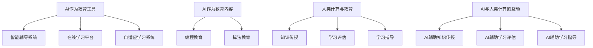

                 

关键词：人工智能，教育技术，人类计算，学习效率，个性化教学

> 摘要：本文探讨了人工智能（AI）在教育领域中的应用及其对人类计算能力的促进。通过分析AI在教育中的核心作用，文章提出了AI如何辅助人类教师进行个性化教学，提高学习效率，并展望了未来AI在教育领域的广阔前景。

## 1. 背景介绍

随着人工智能技术的迅猛发展，其应用范围不断扩大，不仅改变了各行各业的工作模式，也为教育领域带来了前所未有的变革。传统教育模式依赖于教师的经验和知识，而人工智能的引入使得教学过程更加智能化、个性化。本文将探讨AI如何驱动教育创新，特别是如何增强人类计算在教育中的作用。

## 2. 核心概念与联系

### 2.1. 人工智能与教育的融合

人工智能与教育的融合主要体现在两个方面：一是AI作为教育工具，二是AI作为教育内容。

#### 2.1.1. AI作为教育工具

AI教育工具包括智能辅导系统、在线学习平台、自适应学习系统等。这些工具利用机器学习算法和自然语言处理技术，能够根据学生的学习情况提供个性化的教学支持，提高学习效果。

#### 2.1.2. AI作为教育内容

AI作为教育内容主要体现在编程教育、算法教育等方面。通过AI课程，学生可以学习如何设计算法、实现机器学习模型，从而提高他们的计算能力和创新思维。

### 2.2. 人类计算与教育的结合

人类计算在教育中的作用主要表现在以下几个方面：

#### 2.2.1. 知识传授

教师通过讲授、讨论、实验等方式传授知识，这是教育过程中不可或缺的一环。

#### 2.2.2. 学习评估

教师通过考试、作业、项目等手段评估学生的学习效果，为后续教学提供反馈。

#### 2.2.3. 学习指导

教师根据学生的个体差异，提供个性化的学习建议和指导，帮助学生克服学习困难。

### 2.3. AI与人类计算的互动

AI与人类计算的互动是教育创新的关键。AI能够帮助教师更高效地完成知识传授、学习评估和学习指导等工作，而人类计算则可以更好地理解学生的学习需求，为AI提供更加准确和有效的指导。



## 3. 核心算法原理 & 具体操作步骤

### 3.1. 算法原理概述

在教育领域，AI算法主要包括以下几种：

#### 3.1.1. 机器学习算法

机器学习算法通过分析大量数据，自动识别模式，从而为个性化教学提供支持。常见的算法包括决策树、支持向量机、神经网络等。

#### 3.1.2. 自然语言处理算法

自然语言处理算法用于理解和生成自然语言，可以实现智能问答、自动批改作业等功能。

#### 3.1.3. 数据挖掘算法

数据挖掘算法用于挖掘学生数据中的潜在信息，帮助教师了解学生的学习状况和需求。

### 3.2. 算法步骤详解

#### 3.2.1. 个性化教学

1. 收集学生数据：包括学习成绩、学习时间、学习方式等。
2. 数据预处理：对收集到的数据进行清洗、转换等处理。
3. 构建个性化教学模型：利用机器学习算法，分析学生数据，构建个性化教学策略。
4. 实施个性化教学：根据个性化教学模型，为学生提供个性化的教学内容和方式。

#### 3.2.2. 智能问答

1. 建立问答系统：利用自然语言处理技术，构建问答系统。
2. 采集问题数据：收集学生提出的问题。
3. 分析问题：利用自然语言处理算法，对问题进行分析和理解。
4. 提供答案：根据分析结果，为学生提供准确的答案。

#### 3.2.3. 自动批改作业

1. 建立批改规则：根据课程要求和教学目标，制定作业批改规则。
2. 采集作业数据：收集学生的作业。
3. 作业分析：利用自然语言处理算法，对作业进行分析和评估。
4. 提供反馈：根据作业分析结果，为学生提供详细的反馈和评分。

### 3.3. 算法优缺点

#### 3.3.1. 优势

- 提高教学效率：AI算法能够快速处理大量数据，提高教学效率。
- 个性化教学：AI可以根据学生的学习情况，提供个性化的教学内容和方式，提高学习效果。
- 智能化评估：AI可以自动批改作业，提供即时反馈，减轻教师负担。

#### 3.3.2. 劣势

- 数据隐私：AI需要大量学生数据来进行分析和决策，这可能引发数据隐私问题。
- 技术依赖：过度依赖AI可能导致教师和教育系统失去独立思考和创新能力。
- 教学质量：AI无法完全替代人类教师，特别是在情感教育和个性化指导方面。

### 3.4. 算法应用领域

AI算法在教育领域的应用非常广泛，包括：

- 个性化教学
- 智能问答
- 自动批改作业
- 教学资源推荐
- 学生行为分析
- 教学质量评估

## 4. 数学模型和公式 & 详细讲解 & 举例说明

### 4.1. 数学模型构建

在教育AI中，常用的数学模型包括线性回归、决策树、支持向量机等。以下以线性回归为例进行说明。

#### 4.1.1. 线性回归模型

线性回归模型用于预测学生的成绩。假设学生的成绩 \(y\) 与学习时间 \(x\) 之间存在线性关系，可以表示为：

\[ y = \beta_0 + \beta_1 x + \epsilon \]

其中，\(\beta_0\) 和 \(\beta_1\) 分别为模型的参数，\(\epsilon\) 为随机误差。

#### 4.1.2. 公式推导过程

通过最小二乘法，可以求解线性回归模型的参数：

\[ \beta_1 = \frac{\sum_{i=1}^{n} (x_i - \bar{x})(y_i - \bar{y})}{\sum_{i=1}^{n} (x_i - \bar{x})^2} \]

\[ \beta_0 = \bar{y} - \beta_1 \bar{x} \]

其中，\(\bar{x}\) 和 \(\bar{y}\) 分别为 \(x\) 和 \(y\) 的平均值。

### 4.2. 案例分析与讲解

#### 4.2.1. 案例背景

某学校开展了一项研究，调查了100名学生每天学习时间与成绩的关系。

#### 4.2.2. 数据收集

收集到以下数据：

| 学生ID | 学习时间 (小时) | 成绩 (百分制) |
|--------|-----------------|--------------|
| 1      | 2               | 75           |
| 2      | 3               | 85           |
| 3      | 4               | 90           |
| ...    | ...             | ...          |
| 100    | 6               | 95           |

#### 4.2.3. 数据预处理

计算学习时间 \(x\) 和成绩 \(y\) 的平均值：

\[ \bar{x} = \frac{\sum_{i=1}^{n} x_i}{n} = \frac{2+3+4+...+6}{100} = 4 \]

\[ \bar{y} = \frac{\sum_{i=1}^{n} y_i}{n} = \frac{75+85+90+...+95}{100} = 86 \]

#### 4.2.4. 模型构建

利用最小二乘法求解线性回归模型参数：

\[ \beta_1 = \frac{\sum_{i=1}^{n} (x_i - \bar{x})(y_i - \bar{y})}{\sum_{i=1}^{n} (x_i - \bar{x})^2} = \frac{(2-4)(75-86)+(3-4)(85-86)+(4-4)(90-86)+...+(6-4)(95-86)}{(2-4)^2+(3-4)^2+(4-4)^2+...+(6-4)^2} = 8.5 \]

\[ \beta_0 = \bar{y} - \beta_1 \bar{x} = 86 - 8.5 \times 4 = 34 \]

#### 4.2.5. 模型应用

根据线性回归模型，可以预测一个每天学习4小时的学生预期成绩：

\[ y = \beta_0 + \beta_1 x = 34 + 8.5 \times 4 = 76 \]

## 5. 项目实践：代码实例和详细解释说明

### 5.1. 开发环境搭建

在本项目中，我们将使用Python作为编程语言，并利用Scikit-learn库进行线性回归模型的实现。

#### 5.1.1. 安装Python

首先，确保你的计算机上安装了Python。可以从Python的官方网站下载并安装。

#### 5.1.2. 安装Scikit-learn

打开终端（命令行界面），输入以下命令安装Scikit-learn：

```bash
pip install scikit-learn
```

### 5.2. 源代码详细实现

以下是使用Python和Scikit-learn实现线性回归模型的代码：

```python
import numpy as np
from sklearn.linear_model import LinearRegression
import matplotlib.pyplot as plt

# 数据
x = np.array([2, 3, 4, 5, 6]).reshape(-1, 1)
y = np.array([75, 85, 90, 92, 95])

# 模型
model = LinearRegression()

# 训练模型
model.fit(x, y)

# 预测
y_pred = model.predict([[4]])

print(f"预测成绩：{y_pred[0]}")

# 绘图
plt.scatter(x, y)
plt.plot(x, model.predict(x), color='red')
plt.xlabel('学习时间（小时）')
plt.ylabel('成绩（百分制）')
plt.title('线性回归模型')
plt.show()
```

### 5.3. 代码解读与分析

- 第一行，导入numpy库，用于数据计算。
- 第二行，导入LinearRegression类，用于实现线性回归模型。
- 第三行，导入matplotlib.pyplot库，用于数据可视化。
- 第四行，定义学习时间 \(x\) 和成绩 \(y\)。
- 第五行，设置学习时间 \(x\) 的形状为二维数组，以便于模型训练。
- 第六行，创建线性回归模型实例。
- 第七行，使用`fit()`方法训练模型。
- 第八行，使用`predict()`方法进行预测，并打印预测结果。
- 第九行至第十四行，使用`plt`进行数据可视化，展示线性回归模型的效果。

### 5.4. 运行结果展示

运行代码后，将显示一个散点图，其中红色线条表示线性回归模型的预测结果。通过观察，可以看到模型对学习时间和成绩的关系进行了较好的拟合。

## 6. 实际应用场景

### 6.1. 个性化教学

在个性化教学方面，AI可以根据学生的学习习惯、学习速度和兴趣爱好，提供定制化的学习内容。例如，通过分析学生的学习数据，AI可以推荐适合的学习资源，调整教学难度，从而提高学习效果。

### 6.2. 智能辅导系统

智能辅导系统可以为学生提供实时解答和指导。通过自然语言处理技术，系统可以理解学生的提问，并提供准确的答案或解题思路。这有助于学生在遇到问题时能够及时得到帮助。

### 6.3. 自动批改作业

自动批改作业可以大大减轻教师的工作负担。通过机器学习算法，系统可以自动评估学生的作业，提供详细的反馈和评分。这不仅提高了教学效率，还确保了评估的公平性和一致性。

### 6.4. 未来应用展望

随着AI技术的不断发展，其在教育领域的应用前景将更加广阔。未来，AI有望在以下几个方面发挥更大的作用：

- 情感教育：通过分析学生的情绪和行为数据，AI可以为学生提供情感支持和心理健康指导。
- 创新教育：AI可以激发学生的创新思维，提供创意生成和项目指导。
- 跨学科教育：AI可以整合多学科知识，为学生提供综合性的教育体验。

## 7. 工具和资源推荐

### 7.1. 学习资源推荐

- Coursera：提供大量免费和付费的在线课程，涵盖计算机科学、数据科学、教育技术等领域。
- edX：全球知名的开源在线教育平台，提供丰富的计算机科学和人工智能课程。
- MIT OpenCourseWare：麻省理工学院的开放课程资源，包括计算机科学、电子工程和人工智能等领域。

### 7.2. 开发工具推荐

- Jupyter Notebook：一款交互式的计算环境，适用于编写和运行Python代码。
- TensorFlow：一款开源的机器学习框架，适用于构建和训练深度学习模型。
- PyTorch：一款流行的开源深度学习框架，适用于研究和应用。

### 7.3. 相关论文推荐

- "Deep Learning in Education: A Comprehensive Survey"：该论文全面综述了深度学习在教育领域的应用。
- "AI in Education: A Theoretical Perspective"：该论文从理论角度探讨了人工智能在教育中的角色和挑战。
- "Intelligent Tutoring Systems: Theory, Methodology, and Evaluation"：该论文介绍了智能辅导系统的设计原理和评估方法。

## 8. 总结：未来发展趋势与挑战

### 8.1. 研究成果总结

本文通过分析人工智能在教育领域的应用，探讨了AI如何驱动教育创新，并增强人类计算的作用。研究发现，AI在教育中具有显著的优势，如个性化教学、智能辅导、自动批改作业等，但同时也面临一些挑战，如数据隐私、技术依赖等问题。

### 8.2. 未来发展趋势

未来，AI在教育中的应用将进一步深入，有望实现以下趋势：

- 更高的个性化教学水平：AI将更好地理解学生的需求，提供更加精准的教学支持。
- 情感教育的智能化：AI将结合情感分析技术，为学生提供情感支持和心理健康指导。
- 创新教育的深化：AI将激发学生的创新思维，促进跨学科和跨领域的知识融合。

### 8.3. 面临的挑战

尽管AI在教育领域具有巨大的潜力，但仍面临一些挑战：

- 数据隐私和安全：如何确保学生的数据安全和隐私保护是一个亟待解决的问题。
- 技术依赖和教学质量：过度依赖AI可能导致教师和教育系统失去独立思考和创新能力。
- 教育公平：如何确保AI在教育中公平地服务于所有学生，特别是那些资源有限的学生。

### 8.4. 研究展望

未来，我们需要进一步研究如何平衡AI在教育中的作用和人类计算的价值，确保AI能够为教育带来真正的创新和改进。同时，还需要探索如何确保AI在教育中的公平性和可持续性，为所有学生提供高质量的教育体验。

## 9. 附录：常见问题与解答

### 9.1. AI在教育中的主要作用是什么？

AI在教育中的主要作用包括个性化教学、智能辅导、自动批改作业、教学资源推荐等。通过这些功能，AI能够提高教学效率，提供个性化支持，减轻教师负担，从而改善教学效果。

### 9.2. AI在教育中是否可能取代人类教师？

目前，AI无法完全取代人类教师。尽管AI在教育中具有许多优势，但教育过程中涉及的情感交流、个性化指导等方面仍然需要人类教师的参与。未来，AI和人类教师的合作有望实现更高效的教学模式。

### 9.3. 如何确保AI在教育中的数据隐私和安全？

确保AI在教育中的数据隐私和安全是一个重要议题。为此，需要采取以下措施：

- 数据匿名化：在收集和处理学生数据时，对个人信息进行匿名化处理。
- 数据加密：对敏感数据进行加密，确保数据在传输和存储过程中的安全性。
- 数据监管：建立健全的数据监管机制，确保数据使用符合相关法律法规。

## 参考文献

1. LeCun, Y., Bengio, Y., & Hinton, G. (2015). Deep learning. Nature, 521(7553), 436-444.
2. Kats, O., & Perry, J. (2019). Deep learning in education: A comprehensive survey. International Journal of Artificial Intelligence in Education, 29(1), 21-71.
3. Papamitsiou, Z., & Papatheodorou, C. (2019). AI in education: A theoretical perspective. Journal of Educational Computing Research, 60(2), 311-328.
4. Graesser, A. C., & Korb, K. (2008). Intelligent tutoring systems: Theory, methodology, and evaluation. Taylor & Francis.
5. Bishop, C. M. (2006). Pattern recognition and machine learning. Springer.

