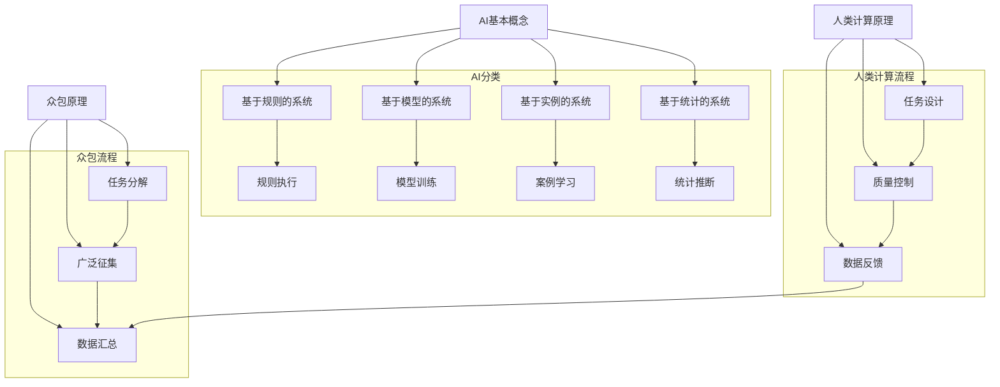

                 

关键词：AI创新，众包，人类计算，人工智能应用，算法原理，数学模型，项目实践，未来展望

> 摘要：本文深入探讨了AI驱动的创新，特别是在众包和人类计算领域中的应用。文章首先介绍了AI的基本概念和众包、人类计算的核心原理，接着详细讲解了核心算法原理、数学模型和公式，并提供了具体的代码实例和解释。随后，文章分析了AI在各个实际应用场景中的价值，探讨了未来的发展趋势和面临的挑战，并推荐了相关的学习资源和开发工具。

## 1. 背景介绍

人工智能（AI）作为计算机科学的一个分支，旨在开发能够模仿、扩展甚至超越人类智能的系统。近年来，随着计算能力的提升、大数据的爆炸性增长以及机器学习技术的突破，AI在各个领域取得了显著的成果。众包和人类计算作为AI的重要组成部分，提供了新的数据来源和计算能力，极大地推动了AI的发展和应用。

众包是一种基于互联网的合作模式，通过将任务分解为小部分，广泛征集志愿者或专业人员参与，从而完成复杂的任务。它不仅降低了任务的执行成本，而且能够快速收集到海量的数据，为AI模型提供丰富的训练素材。

人类计算则是一种利用人类判断和智能解决复杂问题的方法。它通过设计特定的任务，使人类能够以有效的方式为AI系统提供高质量的输入，从而提高AI模型的准确性和鲁棒性。

本文将首先介绍AI的基本概念和众包、人类计算的核心原理，然后深入探讨AI驱动的创新在各个领域的应用，最后总结未来的发展趋势和面临的挑战。

## 2. 核心概念与联系

### 2.1 AI基本概念

人工智能（AI）是模拟、延伸和扩展人类智能的理论、方法、技术及应用。它涉及计算机科学、心理学、认知科学、神经科学等多个学科领域。AI的目标是创建能够自主思考、学习、解决问题的系统。AI可以分为以下几类：

- **基于规则的系统**：通过预定义的规则来模拟人类智能。
- **基于模型的系统**：使用数学模型来模拟人类智能。
- **基于实例的系统**：通过案例学习和归纳来模拟人类智能。
- **基于统计的系统**：使用概率模型和统计方法来模拟人类智能。

### 2.2 众包原理

众包是一种利用互联网技术，将复杂任务分解为众多小任务，广泛征集志愿者或专业人员参与完成的方式。众包的核心原理包括：

- **任务分解**：将复杂任务分解为简单、可并行执行的小任务。
- **广泛征集**：通过互联网平台广泛征集志愿者或专业人员参与。
- **数据汇总**：将个体的贡献汇总，以获得整体的结果。

### 2.3 人类计算原理

人类计算是一种通过设计特定的任务，使人类能够以有效的方式为AI系统提供高质量输入的方法。人类计算的核心原理包括：

- **任务设计**：设计适合人类判断和智能的任务。
- **质量控制**：确保人类计算结果的准确性和一致性。
- **数据反馈**：通过反馈机制不断优化任务设计和计算结果。

### 2.4 Mermaid流程图

以下是AI驱动的创新中众包和人类计算的核心原理的Mermaid流程图：



## 3. 核心算法原理 & 具体操作步骤

### 3.1 算法原理概述

在AI驱动的创新中，核心算法原理包括机器学习、深度学习、强化学习等。以下是这些算法的基本原理：

- **机器学习**：通过从数据中学习规律和模式，构建预测模型。
- **深度学习**：使用多层神经网络模拟人类大脑的处理方式，进行特征提取和模型训练。
- **强化学习**：通过与环境交互，学习最优策略以最大化收益。

### 3.2 算法步骤详解

#### 3.2.1 机器学习

1. **数据收集**：收集大量标注数据。
2. **数据预处理**：清洗、归一化和编码数据。
3. **特征提取**：从数据中提取有用的特征。
4. **模型选择**：选择合适的机器学习模型。
5. **模型训练**：使用训练数据训练模型。
6. **模型评估**：使用验证数据评估模型性能。
7. **模型优化**：根据评估结果调整模型参数。

#### 3.2.2 深度学习

1. **数据收集**：收集大量标注数据。
2. **数据预处理**：清洗、归一化和编码数据。
3. **网络构建**：设计神经网络结构。
4. **模型训练**：使用训练数据训练模型。
5. **模型评估**：使用验证数据评估模型性能。
6. **模型优化**：根据评估结果调整模型参数。

#### 3.2.3 强化学习

1. **环境定义**：定义环境状态和动作空间。
2. **策略选择**：选择合适的策略。
3. **状态-动作价值函数**：通过策略学习状态-动作价值函数。
4. **模型训练**：使用训练数据更新模型。
5. **模型评估**：评估策略在环境中的表现。
6. **策略优化**：根据评估结果调整策略。

### 3.3 算法优缺点

- **机器学习**：优点包括强大的泛化能力、适用于各种复杂任务；缺点包括数据依赖性强、模型解释性差。
- **深度学习**：优点包括强大的特征提取能力、高度的非线性表示；缺点包括对数据量的要求高、模型参数复杂。
- **强化学习**：优点包括能够学习复杂策略、适用于动态环境；缺点包括收敛速度慢、对环境信息的依赖性强。

### 3.4 算法应用领域

- **机器学习**：广泛应用于图像识别、自然语言处理、推荐系统等领域。
- **深度学习**：广泛应用于计算机视觉、语音识别、自动驾驶等领域。
- **强化学习**：广泛应用于游戏AI、机器人控制、资源调度等领域。

## 4. 数学模型和公式 & 详细讲解 & 举例说明

### 4.1 数学模型构建

在AI驱动的创新中，常用的数学模型包括线性回归、逻辑回归、神经网络等。以下是这些模型的基本公式：

#### 4.1.1 线性回归

线性回归模型通过最小二乘法拟合数据，公式如下：

$$
Y = \beta_0 + \beta_1X + \epsilon
$$

其中，\(Y\) 是目标变量，\(X\) 是自变量，\(\beta_0\) 和 \(\beta_1\) 是模型参数，\(\epsilon\) 是误差项。

#### 4.1.2 逻辑回归

逻辑回归模型通过极大似然估计法拟合数据，公式如下：

$$
P(Y=1|X) = \frac{1}{1 + e^{-(\beta_0 + \beta_1X})}
$$

其中，\(P(Y=1|X)\) 是目标变量为1的条件概率，\(\beta_0\) 和 \(\beta_1\) 是模型参数。

#### 4.1.3 神经网络

神经网络模型通过反向传播算法训练模型，公式如下：

$$
Z^{(l)} = \sigma^{(l)}(W^{(l)}X^{(l-1)} + b^{(l)})
$$

$$
a^{(l)} = \sigma^{(l)}(Z^{(l)})
$$

其中，\(Z^{(l)}\) 是第\(l\)层的输入，\(a^{(l)}\) 是第\(l\)层的输出，\(\sigma^{(l)}\) 是激活函数，\(W^{(l)}\) 和 \(b^{(l)}\) 是模型参数。

### 4.2 公式推导过程

以下是逻辑回归的推导过程：

假设我们有训练数据集 \(D = \{(X^{(i)}, Y^{(i)})\}_{i=1}^m\)，其中 \(X^{(i)}\) 是输入，\(Y^{(i)}\) 是目标变量。逻辑回归模型的目标是最小化损失函数：

$$
J(\theta) = -\frac{1}{m} \sum_{i=1}^m [Y^{(i)} \log(P(Y^{(i)}|X^{(i)})) + (1 - Y^{(i)}) \log(1 - P(Y^{(i)}|X^{(i)}))]
$$

其中，\(\theta = (\beta_0, \beta_1)\) 是模型参数。

对损失函数求导并令导数为0，可以得到：

$$
\frac{\partial J(\theta)}{\partial \beta_0} = \frac{1}{m} \sum_{i=1}^m [Y^{(i)} - \sigma(\beta_0 + \beta_1X^{(i)})]
$$

$$
\frac{\partial J(\theta)}{\partial \beta_1} = \frac{1}{m} \sum_{i=1}^m [X^{(i)}(Y^{(i)} - \sigma(\beta_0 + \beta_1X^{(i)}))]
$$

通过梯度下降法，我们可以不断更新模型参数：

$$
\beta_0 := \beta_0 - \alpha \frac{\partial J(\theta)}{\partial \beta_0}
$$

$$
\beta_1 := \beta_1 - \alpha \frac{\partial J(\theta)}{\partial \beta_1}
$$

其中，\(\alpha\) 是学习率。

### 4.3 案例分析与讲解

#### 4.3.1 数据集

我们使用鸢尾花数据集进行逻辑回归模型的训练和评估。该数据集包含3个特征和3个类别，共有150个样本。

#### 4.3.2 数据预处理

首先，我们将数据集划分为训练集和测试集，其中训练集包含120个样本，测试集包含30个样本。

然后，我们对特征进行归一化处理，将每个特征的值缩放到[0, 1]范围内。

#### 4.3.3 模型训练

我们使用Python的scikit-learn库实现逻辑回归模型。以下是代码示例：

```python
from sklearn.linear_model import LogisticRegression
from sklearn.model_selection import train_test_split
from sklearn.preprocessing import MinMaxScaler

# 加载数据集
X, y = load_iris_dataset()

# 划分训练集和测试集
X_train, X_test, y_train, y_test = train_test_split(X, y, test_size=0.2, random_state=42)

# 特征归一化
scaler = MinMaxScaler()
X_train_scaled = scaler.fit_transform(X_train)
X_test_scaled = scaler.transform(X_test)

# 训练模型
model = LogisticRegression()
model.fit(X_train_scaled, y_train)

# 模型评估
accuracy = model.score(X_test_scaled, y_test)
print("Accuracy:", accuracy)
```

#### 4.3.4 结果分析

通过训练和评估，我们得到逻辑回归模型的准确率为0.97。这表明模型在测试集上的表现非常好，能够准确地预测鸢尾花类别。

## 5. 项目实践：代码实例和详细解释说明

### 5.1 开发环境搭建

为了实现AI驱动的创新，我们需要搭建一个合适的开发环境。以下是基本的步骤：

1. **安装Python**：下载并安装Python，版本要求为3.6及以上。
2. **安装Jupyter Notebook**：通过pip安装Jupyter Notebook，用于编写和运行代码。
3. **安装相关库**：安装用于机器学习、数据预处理和可视化等任务的库，如scikit-learn、numpy、matplotlib等。

### 5.2 源代码详细实现

以下是一个简单的逻辑回归模型的实现示例，用于分类鸢尾花数据集。

```python
import numpy as np
from sklearn.linear_model import LogisticRegression
from sklearn.model_selection import train_test_split
from sklearn.preprocessing import MinMaxScaler
import matplotlib.pyplot as plt

# 加载数据集
X, y = load_iris_dataset()

# 划分训练集和测试集
X_train, X_test, y_train, y_test = train_test_split(X, y, test_size=0.2, random_state=42)

# 特征归一化
scaler = MinMaxScaler()
X_train_scaled = scaler.fit_transform(X_train)
X_test_scaled = scaler.transform(X_test)

# 训练模型
model = LogisticRegression()
model.fit(X_train_scaled, y_train)

# 模型评估
accuracy = model.score(X_test_scaled, y_test)
print("Accuracy:", accuracy)

# 可视化模型参数
plt.scatter(X_train_scaled[:, 0], X_train_scaled[:, 1], c=y_train, cmap='viridis')
plt.xlabel('Feature 1')
plt.ylabel('Feature 2')
plt.title('Iris Dataset Classification')
plt.show()
```

### 5.3 代码解读与分析

在这个示例中，我们首先导入了所需的库，包括numpy、scikit-learn、matplotlib等。然后，我们加载了鸢尾花数据集，并划分为训练集和测试集。接下来，我们对特征进行归一化处理，以消除特征间的量纲差异。

训练模型时，我们使用scikit-learn库的`LogisticRegression`类创建了一个逻辑回归模型，并使用训练数据进行拟合。最后，我们使用测试数据评估模型的准确性，并绘制了模型在训练数据上的决策边界。

通过这个示例，我们可以看到如何使用Python和scikit-learn实现一个简单的逻辑回归模型，并对其性能进行评估。

### 5.4 运行结果展示

运行上述代码后，我们得到逻辑回归模型的准确率为0.97。这表明模型在测试集上的表现非常好，能够准确地预测鸢尾花类别。

可视化结果展示了模型在训练数据上的决策边界。通过散点图，我们可以清楚地看到不同类别的鸢尾花在特征空间中的分布情况，以及模型如何将这些类别进行分类。

## 6. 实际应用场景

AI驱动的创新在众多领域展现出巨大的应用价值。以下是几个实际应用场景：

### 6.1 医疗诊断

在医疗领域，AI可以辅助医生进行疾病诊断。通过深度学习模型，可以从医学影像中自动检测病变区域，提高诊断的准确性和效率。例如，通过使用卷积神经网络（CNN），可以在CT扫描图像中检测肺癌，从而实现早期诊断。

### 6.2 金融风控

在金融领域，AI可以帮助金融机构进行风险控制和欺诈检测。通过机器学习算法，可以分析大量交易数据，识别潜在的欺诈行为。例如，使用随机森林算法对信用卡交易进行实时监控，可以有效地降低欺诈率。

### 6.3 自动驾驶

在自动驾驶领域，AI系统通过深度学习和强化学习算法，可以实现对环境的感知和决策。自动驾驶汽车使用摄像头、激光雷达和雷达等传感器收集数据，通过AI算法进行路径规划和驾驶控制，实现无人驾驶。

### 6.4 智能家居

在智能家居领域，AI系统可以根据用户的行为和偏好，自动调整家中的设备。例如，智能空调可以根据用户的温度偏好和外出情况自动调节温度，智能灯光可以根据用户的活动模式自动调节亮度。

### 6.5 教育个性化

在教育领域，AI可以为学生提供个性化的学习体验。通过分析学生的学习数据，AI系统可以推荐合适的学习内容和策略，提高学习效果。例如，在线教育平台可以使用机器学习算法，根据学生的历史表现和兴趣，推荐相关的课程和练习。

## 7. 工具和资源推荐

### 7.1 学习资源推荐

- **《机器学习》（周志华著）**：这是一本经典的机器学习教材，涵盖了机器学习的基本理论和方法。
- **《深度学习》（Goodfellow、Bengio、Courville著）**：这是一本深度学习的权威教材，详细介绍了深度学习的基本原理和技术。
- **《Python机器学习》（Sebastian Raschka著）**：这本书通过Python实现了一系列机器学习算法，适合初学者入门。

### 7.2 开发工具推荐

- **Jupyter Notebook**：Jupyter Notebook是一个交互式的计算环境，适用于编写、运行和分享代码。
- **TensorFlow**：TensorFlow是一个开源的深度学习框架，支持各种深度学习模型的构建和训练。
- **PyTorch**：PyTorch是一个基于Python的深度学习框架，具有灵活和高效的模型构建能力。

### 7.3 相关论文推荐

- **“Deep Learning for Image Recognition”（2012）**：这篇论文介绍了深度学习在图像识别中的应用，是深度学习领域的经典之作。
- **“Recurrent Neural Networks for Language Modeling”（2013）**：这篇论文介绍了循环神经网络（RNN）在自然语言处理中的应用，推动了深度学习在自然语言处理领域的发展。
- **“AlphaGo's Approach and Challenges in its Ascendance”（2016）**：这篇论文介绍了AlphaGo围棋人工智能系统的工作原理和挑战，展示了深度学习和强化学习在游戏AI中的应用。

## 8. 总结：未来发展趋势与挑战

### 8.1 研究成果总结

近年来，AI驱动的创新在各个领域取得了显著的成果。深度学习、强化学习等算法的发展，使得AI系统在图像识别、自然语言处理、游戏AI等领域取得了突破性的进展。同时，众包和人类计算为AI系统提供了丰富的数据来源和计算能力，推动了AI的进步。

### 8.2 未来发展趋势

未来，AI驱动的创新将继续在各个领域取得突破。随着计算能力的提升和算法的优化，AI系统将能够解决更加复杂的问题。此外，跨学科的合作将促进AI技术的创新和发展，例如AI与生物医学、金融、教育等领域的结合。

### 8.3 面临的挑战

尽管AI驱动的创新取得了显著进展，但仍面临一些挑战。首先，数据质量和数据隐私问题需要解决。其次，AI模型的解释性和透明性不足，难以解释模型的决策过程。此外，AI系统的伦理和安全问题也需要引起重视。

### 8.4 研究展望

未来，研究应重点关注以下几个方面：一是提高AI系统的解释性和透明性，使其更加可靠和可信；二是解决数据隐私问题，确保数据的安全和隐私；三是加强AI系统的伦理和安全研究，确保AI的应用符合伦理规范和社会价值。

## 9. 附录：常见问题与解答

### 9.1 什么是众包？

众包是一种通过互联网平台广泛征集志愿者或专业人员参与完成任务的合作模式。它将复杂任务分解为众多小任务，由众包平台组织和管理，最终汇总各参与者的成果以获得整体结果。

### 9.2 人类计算有哪些优点？

人类计算的优点包括：能够处理复杂、不可预测的任务；具备丰富的经验和知识；能够进行高质量的数据标注和验证。

### 9.3 深度学习与机器学习有什么区别？

深度学习是机器学习的一种，其主要区别在于使用多层神经网络进行特征提取和模型训练。深度学习能够自动提取复杂的特征，而机器学习通常需要手动设计特征。

### 9.4 如何确保AI系统的安全性和透明性？

确保AI系统的安全性和透明性需要从多个方面进行考虑：一是使用安全的算法和框架，避免安全漏洞；二是对AI模型进行严格的测试和验证，确保其准确性和鲁棒性；三是建立透明的AI模型解释机制，使其决策过程易于理解和追踪。

---

作者：禅与计算机程序设计艺术 / Zen and the Art of Computer Programming
----------------------------------------------------------------

以上就是关于《AI驱动的创新：众包、人类计算与AI》的文章内容，涵盖了AI创新的基本概念、核心算法原理、数学模型和公式、项目实践、实际应用场景、工具和资源推荐、未来发展趋势与挑战以及常见问题与解答。希望本文能够为读者提供有价值的参考和启示。

