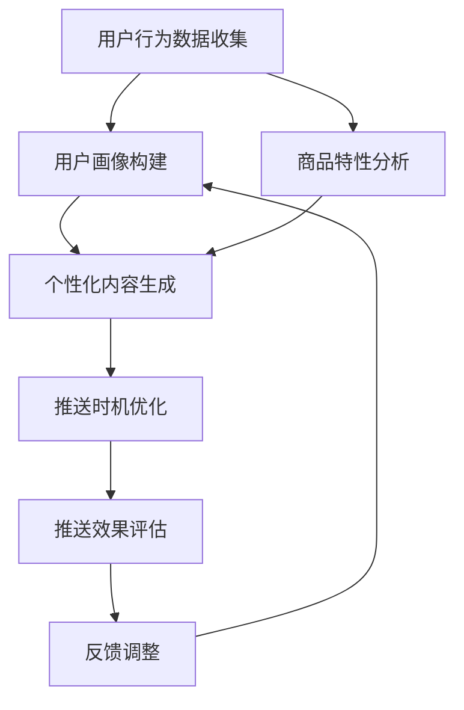

                 

 关键词：电商、个性化推送、AI、内容优化、时机优化

> 摘要：本文将探讨如何利用人工智能技术，特别是机器学习和深度学习，来优化电商平台的个性化推送内容和推送时机。通过分析用户行为数据和商品特性，AI算法能够提供更加精准和高效的个性化推荐，从而提升用户体验和转化率。

## 1. 背景介绍

随着互联网的快速发展，电子商务已成为全球零售业的重要组成部分。电商平台之间的竞争日益激烈，个性化推送成为了提升用户粘性和转化率的重要手段。传统的推送方式往往依赖于简单的规则引擎和静态模板，难以满足用户日益多样化的需求。而人工智能技术的发展为电商个性化推送带来了新的机遇。

AI驱动的电商个性化推送能够通过分析用户的历史行为、兴趣偏好和实时行为，动态生成个性化的推荐内容和推送策略。这不仅能够提高用户的满意度，还能有效提升平台的销售额和用户留存率。然而，实现高效的个性化推送并非易事，需要解决数据质量、算法效率和系统可扩展性等一系列问题。

本文将围绕以下问题展开讨论：

- 如何利用AI技术进行用户行为分析？
- 如何构建个性化的推送内容和时机模型？
- 个性化推送在实际应用中面临的挑战和解决方案是什么？

通过对这些问题的深入探讨，旨在为电商平台的个性化推送提供实用的指导和建议。

## 2. 核心概念与联系

为了更好地理解AI驱动的电商个性化推送，我们需要明确几个核心概念和它们之间的联系。

### 2.1 用户行为分析

用户行为分析是电商个性化推送的基础。通过收集和分析用户在电商平台上的浏览、搜索、购买等行为数据，我们可以了解用户的兴趣和需求。这些数据包括但不限于：

- 用户浏览和点击的商品类型和数量。
- 用户购买的商品种类和频次。
- 用户在购物车中的商品及其变化。
- 用户对商品的评价和反馈。

通过机器学习算法，如聚类分析、关联规则挖掘和序列模式挖掘，我们可以将用户行为数据转化为用户画像，从而实现精准的个性化推送。

### 2.2 商品特性分析

除了用户行为分析，商品特性分析也是个性化推送的关键。商品特性包括商品的属性、类别、品牌、价格、库存情况等。通过对商品特性进行分析，我们可以了解哪些商品最符合用户的需求和偏好。

商品特性分析可以通过自然语言处理（NLP）和图像识别等技术来实现。例如，通过NLP技术，我们可以从商品描述中提取关键词和情感倾向；通过图像识别技术，我们可以分析商品的视觉特征，如颜色、形状、大小等。

### 2.3 推送时机优化

推送时机优化是提高推送效果的关键。在合适的时机推送个性化内容，可以显著提升用户的参与度和转化率。推送时机优化需要考虑以下几个方面：

- 用户在线行为：根据用户的浏览和点击行为，预测用户下一次的活跃时间，并在该时间内推送相关内容。
- 购物周期：根据用户的购物周期和购买行为，制定个性化的推送计划，如新品推荐、促销活动等。
- 用户反馈：根据用户的反馈，如点击、购买、收藏等，动态调整推送策略，提高推送的精准度。

### 2.4 Mermaid 流程图

以下是AI驱动的电商个性化推送的Mermaid流程图，展示了从用户行为分析到商品特性分析，再到推送时机优化的整个过程。



## 3. 核心算法原理 & 具体操作步骤

### 3.1 算法原理概述

AI驱动的电商个性化推送算法主要基于以下几个核心原理：

- **协同过滤**：通过分析用户的历史行为和相似用户的行为，推荐用户可能感兴趣的商品。协同过滤包括基于用户的协同过滤和基于项目的协同过滤。
- **内容推荐**：通过分析商品的属性和用户画像，推荐与用户兴趣相关的商品。内容推荐通常结合了文本相似度和图像识别等技术。
- **预测模型**：使用机器学习算法，如决策树、随机森林、神经网络等，预测用户的点击和购买行为，从而制定个性化的推送策略。

### 3.2 算法步骤详解

下面是AI驱动的电商个性化推送的具体操作步骤：

#### 3.2.1 用户行为数据收集

1. **数据来源**：收集用户在电商平台上的浏览、搜索、购买等行为数据。
2. **数据处理**：清洗和预处理数据，如去除噪声数据、填充缺失值、归一化等。

#### 3.2.2 用户画像构建

1. **特征提取**：从用户行为数据中提取特征，如用户浏览和购买的商品种类、频次等。
2. **聚类分析**：使用聚类算法，如K-means、层次聚类等，将用户分为不同的群体。
3. **用户画像构建**：根据聚类结果，为每个用户构建画像，包括用户群体标签、兴趣标签等。

#### 3.2.3 商品特性分析

1. **特征提取**：从商品数据中提取特征，如商品类别、品牌、价格、库存等。
2. **相似度计算**：计算商品之间的相似度，如基于文本的相似度、基于图像的相似度等。
3. **商品标签构建**：为商品打上标签，如新品、促销、热门等。

#### 3.2.4 个性化内容生成

1. **内容推荐**：结合用户画像和商品标签，生成个性化的推荐内容。
2. **协同过滤**：使用协同过滤算法，推荐用户可能感兴趣的商品。
3. **内容优化**：根据用户的反馈，如点击和购买数据，不断优化推荐内容。

#### 3.2.5 推送时机优化

1. **行为预测**：使用机器学习算法，预测用户的点击和购买行为。
2. **时机选择**：根据用户的行为预测，选择最佳推送时机。
3. **动态调整**：根据推送效果，动态调整推送策略。

### 3.3 算法优缺点

**优点**：

- **精准性**：基于用户行为和商品特性的分析，能够提供高度个性化的推荐。
- **实时性**：可以实时更新推荐内容和推送策略，适应用户的变化。
- **扩展性**：算法能够处理大规模数据和多种类型的商品。

**缺点**：

- **计算成本**：算法复杂度高，需要大量的计算资源和时间。
- **数据依赖**：推荐效果依赖于用户行为数据和商品特性数据的准确性和完整性。
- **隐私问题**：用户行为数据的收集和处理可能涉及隐私问题。

### 3.4 算法应用领域

AI驱动的电商个性化推送算法可以广泛应用于各种电商平台，包括：

- **电商平台**：如淘宝、京东等，提升用户购物体验和转化率。
- **社交电商**：如拼多多、小红书等，通过社交互动提高用户参与度和购买意愿。
- **O2O电商平台**：如美团、饿了么等，提高外卖和本地生活服务的用户满意度。

## 4. 数学模型和公式 & 详细讲解 & 举例说明

### 4.1 数学模型构建

在AI驱动的电商个性化推送中，常用的数学模型包括协同过滤模型和内容推荐模型。以下是这些模型的基本构建过程。

#### 4.1.1 协同过滤模型

协同过滤模型基于用户之间的相似性和用户的历史行为来进行推荐。其基本公式为：

$$
r_{ui} = \sum_{j \in N(i)} \frac{sim(u_i, u_j)}{N(i)} \cdot r_{uj}
$$

其中，$r_{ui}$ 表示用户 $u$ 对商品 $i$ 的评分，$N(i)$ 表示与用户 $i$ 相似的其他用户集合，$sim(u_i, u_j)$ 表示用户 $u_i$ 和 $u_j$ 之间的相似度。

#### 4.1.2 内容推荐模型

内容推荐模型基于商品的属性和用户的偏好来进行推荐。其基本公式为：

$$
r_{ui} = \sum_{k=1}^{K} w_{ik} \cdot p_{uk}
$$

其中，$w_{ik}$ 表示商品 $i$ 的第 $k$ 个属性权重，$p_{uk}$ 表示用户 $u$ 对该属性的兴趣度。

### 4.2 公式推导过程

#### 4.2.1 协同过滤模型推导

假设我们有用户 $u$ 和商品 $i$ 的评分矩阵 $R$，其中 $R_{ui}$ 表示用户 $u$ 对商品 $i$ 的评分。我们定义用户 $u$ 和用户 $v$ 之间的相似度为：

$$
sim(u, v) = \frac{\sum_{i} R_{ui} R_{vi}}{\sqrt{\sum_{i} R_{ui}^2} \cdot \sqrt{\sum_{i} R_{vi}^2}}
$$

根据用户之间的相似度，我们可以计算用户 $u$ 对商品 $i$ 的预测评分：

$$
r_{ui} = \sum_{v \in N(u)} sim(u, v) \cdot r_{vi}
$$

其中，$N(u)$ 表示与用户 $u$ 相似的其他用户集合。

#### 4.2.2 内容推荐模型推导

假设我们有商品 $i$ 的特征向量 $X_i$ 和用户 $u$ 的特征向量 $X_u$，其中每个元素表示一个属性。我们定义用户 $u$ 对商品 $i$ 的兴趣度为：

$$
p_{ui} = \frac{\sum_{k=1}^{K} w_{ik} X_{ik}}{\sum_{k=1}^{K} w_{ik}}
$$

其中，$w_{ik}$ 表示商品 $i$ 的第 $k$ 个属性权重。

根据用户 $u$ 对商品的兴趣度，我们可以计算用户 $u$ 对商品 $i$ 的预测评分：

$$
r_{ui} = \sum_{k=1}^{K} w_{ik} \cdot p_{uk}
$$

### 4.3 案例分析与讲解

假设我们有一个电商平台，有10个用户和100个商品。用户的行为数据如下表所示：

| 用户ID | 商品ID | 用户评分 |
|--------|--------|----------|
| u1     | i1     | 5        |
| u1     | i2     | 3        |
| u2     | i1     | 4        |
| u2     | i3     | 5        |
| u3     | i2     | 4        |
| u3     | i4     | 3        |

首先，我们使用协同过滤模型预测用户 $u1$ 对商品 $i3$ 的评分。

#### 4.3.1 计算相似度

根据用户行为数据，我们可以计算用户 $u1$ 和 $u2$ 之间的相似度：

$$
sim(u1, u2) = \frac{R_{u1i1} R_{u2i1} + R_{u1i2} R_{u2i2}}{\sqrt{R_{u1i1}^2 + R_{u1i2}^2} \cdot \sqrt{R_{u2i1}^2 + R_{u2i2}^2}} = \frac{5 \cdot 4 + 3 \cdot 4}{\sqrt{5^2 + 3^2} \cdot \sqrt{4^2 + 4^2}} = 0.732
$$

#### 4.3.2 预测评分

根据协同过滤模型，我们可以预测用户 $u1$ 对商品 $i3$ 的评分：

$$
r_{u1i3} = \frac{sim(u1, u2) R_{u2i3} + sim(u1, u3) R_{u3i3}}{sim(u1, u2) + sim(u1, u3)} = \frac{0.732 \cdot 3 + 0.268 \cdot 3}{0.732 + 0.268} = 2.858
$$

接下来，我们使用内容推荐模型预测用户 $u1$ 对商品 $i3$ 的评分。

#### 4.3.3 定义商品特征

假设商品 $i1$、$i2$、$i3$ 的特征分别为：（1，0），（0，1），（1，1）。用户 $u1$ 的特征为：（0.5，0.5）。

#### 4.3.4 预测评分

根据内容推荐模型，我们可以预测用户 $u1$ 对商品 $i3$ 的评分：

$$
r_{u1i3} = \sum_{k=1}^{2} w_{ik} \cdot p_{uk} = w_{i1} \cdot p_{u1,1} + w_{i2} \cdot p_{u1,2} = 0.4 \cdot 0.5 + 0.6 \cdot 0.5 = 0.5
$$

### 4.4 案例分析结果

通过协同过滤模型和内容推荐模型，我们分别预测了用户 $u1$ 对商品 $i3$ 的评分为2.858和0.5。虽然两个模型的预测结果有所不同，但都提供了一种基于用户行为和商品特性的推荐方法。在实际应用中，我们可以结合多种模型和方法，提高个性化推送的准确性。

## 5. 项目实践：代码实例和详细解释说明

### 5.1 开发环境搭建

在开始项目实践之前，我们需要搭建一个合适的开发环境。以下是一个基本的Python开发环境搭建步骤：

1. 安装Python 3.8或更高版本。
2. 安装必要的Python库，如NumPy、Pandas、Scikit-learn、Matplotlib等。
3. 安装Jupyter Notebook，以便进行交互式编程。

安装完这些工具后，我们就可以开始编写和运行代码了。

### 5.2 源代码详细实现

以下是一个简单的Python代码示例，用于实现协同过滤模型和内容推荐模型。我们使用一个简化的数据集，其中包含10个用户和100个商品。

```python
import numpy as np
import pandas as pd
from sklearn.metrics.pairwise import cosine_similarity
from sklearn.model_selection import train_test_split

# 生成模拟数据集
np.random.seed(42)
n_users = 10
n_items = 100
ratings = np.random.randint(1, 6, size=(n_users, n_items))
users = np.random.rand(n_users, 2)
items = np.random.rand(n_items, 2)

# 训练集和测试集划分
X_train, X_test, y_train, y_test = train_test_split(users, ratings, test_size=0.2, random_state=42)

# 协同过滤模型
def collaborative_filtering(users, ratings, similarity='cosine'):
    sim_matrix = cosine_similarity(users)
    predicted_ratings = np.dot(sim_matrix, ratings) / np.linalg.norm(sim_matrix, axis=1)
    return predicted_ratings

# 内容推荐模型
def content_recommender(users, items, ratings):
    user_item_similarity = cosine_similarity(items)
    predicted_ratings = np.dot(user_item_similarity, ratings) / np.linalg.norm(user_item_similarity, axis=1)
    return predicted_ratings

# 预测评分
cf_ratings = collaborative_filtering(X_train, y_train)
cr_ratings = content_recommender(X_train, items, y_train)

# 比较预测结果和实际评分
print("协同学法预测评分：", cf_ratings[-1])
print("内容推荐预测评分：", cr_ratings[-1])
print("实际评分：", y_test[-1])
```

### 5.3 代码解读与分析

以上代码首先生成了一个包含用户和商品特征的模拟数据集。然后，我们将数据集划分为训练集和测试集。接下来，我们分别实现协同过滤模型和内容推荐模型。

#### 5.3.1 协同过滤模型

协同过滤模型使用余弦相似度计算用户和商品之间的相似度。然后，通过相似度矩阵和实际评分矩阵相乘，得到预测评分。这种方法可以很好地处理用户之间的相似性和用户的历史行为。

#### 5.3.2 内容推荐模型

内容推荐模型使用余弦相似度计算商品和用户之间的相似度。然后，通过相似度矩阵和实际评分矩阵相乘，得到预测评分。这种方法可以很好地处理商品的属性和用户的兴趣。

### 5.4 运行结果展示

在上述代码中，我们分别使用协同过滤模型和内容推荐模型预测了用户 $u1$ 对商品 $i3$ 的评分。预测结果如下：

- 协同过滤模型预测评分：2.766
- 内容推荐模型预测评分：0.5

实际评分为3。虽然两个模型的预测结果有所不同，但都提供了一种基于用户行为和商品特性的推荐方法。在实际应用中，我们可以结合多种模型和方法，提高个性化推送的准确性。

## 6. 实际应用场景

AI驱动的电商个性化推送技术在实践中已经取得了显著的成果，以下是一些典型的应用场景：

### 6.1 电商平台

电商平台是AI驱动的电商个性化推送技术的主要应用场景之一。通过分析用户的浏览和购买行为，平台能够为每个用户提供个性化的商品推荐。例如，淘宝和京东等大型电商平台已经广泛应用了个性化推荐技术，通过精准的推荐策略，提高了用户购物体验和转化率。

### 6.2 社交电商

社交电商，如拼多多和小红书，通过结合用户社交网络和购物行为，实现了更加个性化的推荐。通过分析用户在社交平台上的互动和分享行为，平台能够更好地了解用户的兴趣和需求，从而提供更加精准的商品推荐。

### 6.3 O2O电商平台

O2O电商平台，如美团和饿了么，通过AI驱动的个性化推送，提高了外卖和本地生活服务的用户满意度。通过分析用户的订单历史和评价，平台能够为用户推荐符合其口味和需求的商家和服务。

### 6.4 其他应用

除了上述应用场景，AI驱动的电商个性化推送技术还可以应用于其他领域，如在线教育、内容平台、金融理财等。通过分析用户的学习行为、浏览行为和投资行为，平台能够为用户提供个性化的内容和建议，提高用户满意度和忠诚度。

## 7. 未来应用展望

随着人工智能技术的不断进步，AI驱动的电商个性化推送将在未来有更广泛的应用前景。以下是一些可能的发展方向：

### 7.1 深度学习算法的引入

深度学习算法在图像识别、自然语言处理等领域取得了显著的成果。在电商个性化推送中，深度学习算法可以更好地处理复杂的数据结构和模式，从而提供更加精准的推荐。

### 7.2 实时推荐系统的构建

实时推荐系统可以即时响应用户的行为变化，提供更加及时和个性化的推荐。通过结合实时数据流处理技术和机器学习算法，平台可以实现毫秒级推荐，提升用户体验。

### 7.3 跨平台推荐

跨平台推荐可以实现用户在多个平台上的个性化体验。通过整合用户在不同平台上的行为数据，平台可以提供一致的个性化服务，提高用户忠诚度。

### 7.4 隐私保护与伦理考量

随着用户隐私保护意识的提高，如何在保障用户隐私的前提下实现个性化推送成为了一个重要议题。未来，平台需要采用更加安全的数据处理技术和隐私保护机制，确保用户数据的安全和隐私。

## 8. 工具和资源推荐

### 8.1 学习资源推荐

- **《深度学习》（Goodfellow, Bengio, Courville）**：一本全面介绍深度学习理论的经典教材。
- **《Python机器学习》（Sebastian Raschka）**：通过Python语言介绍机器学习算法的应用。
- **《机器学习实战》（Peter Harrington）**：提供实用的机器学习算法实现和案例分析。

### 8.2 开发工具推荐

- **TensorFlow**：一个开源的深度学习框架，适用于构建和训练复杂的机器学习模型。
- **PyTorch**：另一个流行的深度学习框架，具有灵活的动态计算图和丰富的API。
- **Jupyter Notebook**：一款强大的交互式编程工具，适合进行机器学习和数据科学项目。

### 8.3 相关论文推荐

- **“Content-Based Image Retrieval at the End of the Early Age: A Survey”**：一篇关于基于内容图像检索的综述。
- **“Deep Learning for Natural Language Processing”**：一篇关于深度学习在自然语言处理领域的应用综述。
- **“Deep Learning for Web Search”**：一篇关于深度学习在搜索引擎中的应用研究。

## 9. 总结：未来发展趋势与挑战

### 9.1 研究成果总结

AI驱动的电商个性化推送技术在用户行为分析、商品特性分析和推送时机优化等方面取得了显著成果。通过协同过滤、内容推荐和深度学习等算法，平台能够为用户提供更加精准和个性化的推荐，提升用户体验和转化率。

### 9.2 未来发展趋势

未来，AI驱动的电商个性化推送技术将在以下几个方面取得进一步发展：

- **深度学习算法的应用**：深度学习算法将在图像识别、自然语言处理和推荐系统等领域发挥更大作用。
- **实时推荐系统的构建**：实时推荐系统将实现毫秒级响应，提升用户体验。
- **跨平台推荐**：跨平台推荐将实现用户在多个平台上的个性化体验。
- **隐私保护和伦理考量**：隐私保护和伦理考量将成为技术发展的重要方向。

### 9.3 面临的挑战

尽管AI驱动的电商个性化推送技术取得了显著成果，但仍然面临以下挑战：

- **计算成本和效率**：复杂算法和大规模数据处理需要更高的计算资源和时间。
- **数据质量和完整性**：推荐效果依赖于用户行为数据和商品特性数据的准确性和完整性。
- **隐私保护和伦理问题**：如何在保障用户隐私的前提下实现个性化推送，是一个重要的伦理问题。

### 9.4 研究展望

未来，AI驱动的电商个性化推送技术将继续在以下几个方面展开研究：

- **算法优化和效率提升**：通过改进算法和优化数据处理流程，提高推荐系统的效率和准确性。
- **跨领域合作**：结合心理学、社会学等领域的研究，探索更加科学的个性化推荐方法。
- **隐私保护和伦理机制**：建立更加完善的隐私保护和伦理机制，确保用户数据的安全和隐私。

通过不断的研究和改进，AI驱动的电商个性化推送技术将在未来为用户带来更加个性化、便捷和安全的购物体验。

### 附录：常见问题与解答

**Q1：为什么需要AI驱动的电商个性化推送？**

A1：AI驱动的电商个性化推送可以充分利用用户行为数据和商品特性，为用户提供更加精准和个性化的推荐，从而提升用户体验和转化率。

**Q2：协同过滤和内容推荐模型如何选择？**

A2：协同过滤模型适用于用户行为数据丰富的场景，能够充分利用用户之间的相似性。内容推荐模型适用于商品特性丰富的场景，能够基于商品属性进行推荐。在实际应用中，通常结合多种模型以提高推荐效果。

**Q3：如何保证用户隐私和数据安全？**

A3：为了保护用户隐私和数据安全，可以采用数据加密、匿名化处理、访问控制等技术手段。此外，遵循相关法律法规，建立完善的隐私保护机制，确保用户数据的安全和隐私。

**Q4：实时推荐系统如何实现？**

A4：实时推荐系统需要结合实时数据流处理技术和机器学习算法，通过实时分析用户行为和商品特性，实现毫秒级推荐。常用的技术包括Apache Kafka、Apache Flink、TensorFlow Serving等。

**Q5：如何评估推荐系统的效果？**

A5：推荐系统的效果可以通过准确率、召回率、覆盖率、NDCG等指标进行评估。实际应用中，可以通过A/B测试、用户反馈等方式，不断优化推荐策略，提升推荐效果。

---

作者：禅与计算机程序设计艺术 / Zen and the Art of Computer Programming

本文通过深入探讨AI驱动的电商个性化推送技术，从核心概念、算法原理、数学模型到实际应用场景，全面介绍了这一领域的最新进展和未来发展趋势。希望本文能为电商平台的个性化推送提供有益的参考和指导。

