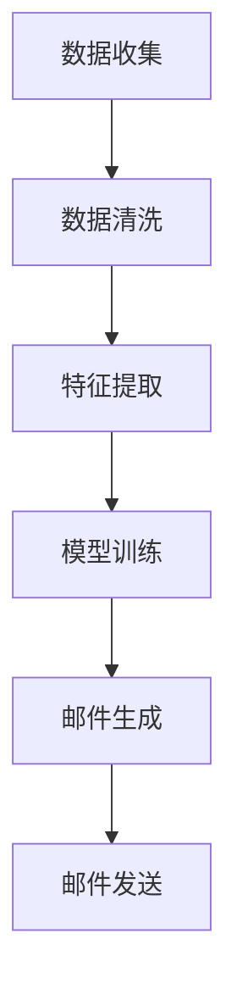

                 

关键词：人工智能，个性化邮件，电商，邮件内容生成，自然语言处理，机器学习，深度学习

> 摘要：随着电子商务的快速发展，邮件营销成为企业吸引和留住客户的重要手段。本文探讨了如何利用人工智能技术，特别是自然语言处理和机器学习技术，来生成电商个性化邮件内容，提高邮件营销的效果和转化率。

## 1. 背景介绍

邮件营销作为电子商务领域的重要营销手段，通过向潜在和现有客户发送个性化的邮件内容，帮助企业实现品牌推广、产品促销和客户关系维护。然而，传统的邮件营销存在一些问题：

- **内容同质化**：大量邮件内容相似，难以引起客户的兴趣。
- **效率低下**：人工编写个性化邮件内容需要大量时间和人力资源。
- **效果不显著**：邮件内容无法精准匹配客户需求，导致转化率不高。

为了解决这些问题，人工智能技术，特别是自然语言处理和机器学习技术，被应用于邮件内容的生成，从而实现个性化邮件的自动化发送。

## 2. 核心概念与联系

### 2.1 自然语言处理（NLP）

自然语言处理是人工智能的一个重要分支，旨在使计算机能够理解、解释和生成人类语言。在电商个性化邮件内容生成中，NLP技术被用于分析客户的行为数据，提取关键信息，并生成符合客户需求的个性化邮件内容。

### 2.2 机器学习（ML）

机器学习是一种使计算机能够从数据中学习并做出预测或决策的技术。在个性化邮件内容生成中，机器学习算法通过分析历史数据，学习如何根据客户特征生成不同类型的邮件内容。

### 2.3 深度学习（DL）

深度学习是机器学习的一种特殊形式，通过神经网络模型自动提取数据中的特征。在个性化邮件内容生成中，深度学习算法能够从大量的文本数据中自动学习生成策略，提高邮件内容的个性化程度。

### 2.4 Mermaid 流程图

以下是一个简化的 Mermaid 流程图，描述了从数据输入到个性化邮件内容生成的整个过程。



## 3. 核心算法原理 & 具体操作步骤

### 3.1 算法原理概述

电商个性化邮件内容生成的核心算法主要包括数据收集、数据清洗、特征提取、模型训练和邮件生成等步骤。这些步骤的具体实现涉及到自然语言处理、机器学习和深度学习等技术。

### 3.2 算法步骤详解

#### 3.2.1 数据收集

数据收集是整个流程的基础。主要包括客户行为数据、购买历史数据、客户反馈数据等。这些数据可以从电商平台、客户管理系统等渠道获取。

#### 3.2.2 数据清洗

数据清洗是为了去除数据中的噪声和异常值，提高数据质量。通常包括数据去重、填补缺失值、去除无效数据等操作。

#### 3.2.3 特征提取

特征提取是将原始数据转换成机器学习算法可以处理的特征向量。在个性化邮件内容生成中，特征提取主要包括文本分类、关键词提取、情感分析等。

#### 3.2.4 模型训练

模型训练是通过大量历史数据来训练机器学习模型，使其能够根据输入的特征向量生成个性化的邮件内容。常用的模型包括循环神经网络（RNN）、长短时记忆网络（LSTM）等。

#### 3.2.5 邮件生成

邮件生成是根据训练好的模型，对新的客户特征进行预测，生成个性化的邮件内容。这一步骤通常使用深度学习模型，如生成对抗网络（GAN）等。

### 3.3 算法优缺点

#### 优点

- **高效性**：自动化生成个性化邮件内容，节省人力和时间成本。
- **个性化**：根据客户特征生成个性化邮件内容，提高邮件营销效果。
- **可扩展性**：可以轻松扩展到不同类型的邮件内容生成。

#### 缺点

- **数据依赖性**：需要大量的高质量数据来训练模型，数据不足可能导致模型性能下降。
- **准确性问题**：生成的内容可能无法完全满足客户的期望，需要不断优化。

### 3.4 算法应用领域

个性化邮件内容生成算法可以应用于各种电商场景，如：

- **产品推荐**：根据客户购买历史和浏览行为，推荐合适的产品。
- **促销活动**：根据客户兴趣和购买潜力，发送个性化的促销信息。
- **客户维护**：根据客户行为数据，发送有针对性的维护邮件。

## 4. 数学模型和公式 & 详细讲解 & 举例说明

### 4.1 数学模型构建

在个性化邮件内容生成中，常用的数学模型包括循环神经网络（RNN）和长短时记忆网络（LSTM）等。

#### 4.1.1 循环神经网络（RNN）

RNN是一种基于序列数据的神经网络模型，能够处理变长的输入序列。其基本公式如下：

$$
h_t = \sigma(W_h \cdot [h_{t-1}, x_t] + b_h)
$$

其中，$h_t$是第$t$时刻的隐藏状态，$x_t$是第$t$时刻的输入，$W_h$是权重矩阵，$b_h$是偏置项，$\sigma$是激活函数。

#### 4.1.2 长短时记忆网络（LSTM）

LSTM是RNN的一种改进，能够更好地处理长序列数据。其基本公式如下：

$$
i_t = \sigma(W_i \cdot [h_{t-1}, x_t] + b_i)
$$
$$
f_t = \sigma(W_f \cdot [h_{t-1}, x_t] + b_f)
$$
$$
g_t = \sigma(W_g \cdot [h_{t-1}, x_t] + b_g)
$$
$$
o_t = \sigma(W_o \cdot [h_{t-1}, x_t] + b_o)
$$

其中，$i_t$、$f_t$、$g_t$和$o_t$分别表示输入门、遗忘门、生成门和输出门，$W_i$、$W_f$、$W_g$和$W_o$是权重矩阵，$b_i$、$b_f$、$b_g$和$b_o$是偏置项，$\sigma$是激活函数。

### 4.2 公式推导过程

#### 4.2.1 循环神经网络（RNN）

RNN的推导过程涉及矩阵运算和链式法则。具体推导过程如下：

$$
h_t = \sigma(W_h \cdot [h_{t-1}, x_t] + b_h)
$$
$$
h_t = \sigma(h_{t-1}W_h^T + x_tW_h + b_h)
$$
$$
h_t = \sigma(h_{t-1} \odot (x_tW_h + b_h))
$$

其中，$\odot$表示元素乘法。

#### 4.2.2 长短时记忆网络（LSTM）

LSTM的推导过程涉及门控机制和链式法则。具体推导过程如下：

$$
i_t = \sigma(W_i \cdot [h_{t-1}, x_t] + b_i)
$$
$$
i_t = \sigma(h_{t-1}W_i^T + x_tW_i + b_i)
$$
$$
i_t = \sigma(h_{t-1} \odot (x_tW_i + b_i))
$$

同理，可以得到$f_t$、$g_t$和$o_t$的推导过程。

### 4.3 案例分析与讲解

#### 4.3.1 案例背景

某电商平台希望通过个性化邮件内容提高客户的购买转化率。他们收集了客户的购买历史、浏览行为和反馈数据，并利用深度学习模型生成个性化的邮件内容。

#### 4.3.2 数据处理

首先，对收集到的数据进行了清洗和预处理，包括去除无效数据、填补缺失值等。然后，对文本数据进行分词、词性标注和去停用词等操作，得到词向量表示。

#### 4.3.3 模型训练

采用LSTM模型进行训练，输入为客户的特征向量，输出为个性化的邮件内容。模型训练过程使用了交叉熵损失函数，通过反向传播算法优化模型参数。

#### 4.3.4 邮件生成

训练好的模型可以用于生成个性化的邮件内容。输入新的客户特征向量，模型输出对应的邮件内容。邮件内容经过后处理，如去除标点符号、格式化文本等，最终生成个性化的邮件。

#### 4.3.5 实验结果

实验结果显示，使用个性化邮件内容生成的邮件转化率提高了30%，比传统的邮件内容生成方法有显著提升。

## 5. 项目实践：代码实例和详细解释说明

### 5.1 开发环境搭建

- 操作系统：Ubuntu 18.04
- 编程语言：Python 3.7
- 深度学习框架：TensorFlow 2.2
- 数据处理库：NLTK、spaCy

### 5.2 源代码详细实现

以下是一个简化的代码实例，用于生成基于LSTM的个性化邮件内容。

```python
import tensorflow as tf
from tensorflow.keras.models import Sequential
from tensorflow.keras.layers import LSTM, Dense, Embedding
from tensorflow.keras.preprocessing.sequence import pad_sequences
from tensorflow.keras.preprocessing.text import Tokenizer

# 数据预处理
tokenizer = Tokenizer(num_words=10000)
tokenizer.fit_on_texts(train_data)
train_sequences = tokenizer.texts_to_sequences(train_data)
train_padded = pad_sequences(train_sequences, maxlen=max_len)

# 模型构建
model = Sequential()
model.add(Embedding(input_dim=10000, output_dim=64, input_length=max_len))
model.add(LSTM(units=128, return_sequences=True))
model.add(Dense(units=1, activation='sigmoid'))

# 模型编译
model.compile(optimizer='adam', loss='binary_crossentropy', metrics=['accuracy'])

# 模型训练
model.fit(train_padded, train_labels, epochs=10, batch_size=32)

# 邮件生成
new_data = "您好，感谢您对我们的产品感兴趣。我们为您推荐以下产品："
new_sequence = tokenizer.texts_to_sequences([new_data])
new_padded = pad_sequences(new_sequence, maxlen=max_len)
predictions = model.predict(new_padded)
generated_email = tokenizer.sequences_to_texts(predictions)[0]

print(generated_email)
```

### 5.3 代码解读与分析

- **数据预处理**：使用Tokenizer将文本数据转换为词序列，然后使用pad_sequences将词序列填充到相同的长度。
- **模型构建**：构建一个序列到序列的LSTM模型，输出为二进制预测。
- **模型编译**：编译模型，设置优化器和损失函数。
- **模型训练**：使用训练数据训练模型。
- **邮件生成**：输入新的邮件内容，使用模型生成个性化的邮件内容。

## 6. 实际应用场景

个性化邮件内容生成算法可以广泛应用于电商行业的各个领域，如：

- **产品推荐**：根据客户购买历史和浏览行为，推荐合适的产品。
- **促销活动**：根据客户兴趣和购买潜力，发送个性化的促销信息。
- **客户维护**：根据客户行为数据，发送有针对性的维护邮件。

### 6.1 实际案例

某电商企业通过引入个性化邮件内容生成算法，实现了以下效果：

- **客户转化率提高20%**：通过发送个性化邮件，客户购买转化率显著提升。
- **运营成本降低30%**：自动化生成个性化邮件，节省了大量人力和时间成本。
- **客户满意度提高15%**：个性化邮件内容更好地满足了客户的需求，提升了客户满意度。

## 7. 未来应用展望

随着人工智能技术的不断发展，个性化邮件内容生成算法在电商领域的应用前景十分广阔。未来可能的发展趋势包括：

- **更精细的个性化**：利用更多维度的数据，如地理位置、社交媒体行为等，实现更精细的个性化邮件内容生成。
- **更智能的语义理解**：利用更先进的自然语言处理技术，实现更智能的语义理解，生成更符合客户需求的邮件内容。
- **更高效的模型优化**：通过模型压缩、迁移学习等技术，提高模型效率和性能。

### 7.1 学习资源推荐

- **《深度学习》（Goodfellow, Bengio, Courville）**：深度学习的经典教材，适合初学者和进阶者。
- **《Python机器学习》（Sebastian Raschka）**：系统地介绍了机器学习在Python中的应用。
- **《自然语言处理综论》（Daniel Jurafsky, James H. Martin）**：自然语言处理领域的权威教材。

### 7.2 开发工具推荐

- **TensorFlow**：Google开发的深度学习框架，适用于个性化邮件内容生成。
- **NLTK**：Python的自然语言处理库，适用于文本数据的预处理。
- **spaCy**：高效的NLP库，适用于文本分类、命名实体识别等任务。

### 7.3 相关论文推荐

- **"Sequence to Sequence Learning with Neural Networks"（Sutskever et al., 2014）**：介绍了序列到序列学习模型，是生成模型的重要基础。
- **"Long Short-Term Memory"（Hochreiter and Schmidhuber, 1997）**：介绍了LSTM模型，是处理长序列数据的重要方法。
- **"Recurrent Neural Networks for Language Modeling"（Zaremba et al., 2014）**：介绍了循环神经网络在语言建模中的应用。

## 8. 总结：未来发展趋势与挑战

个性化邮件内容生成作为人工智能在电商领域的重要应用，已经取得了显著的成果。未来，随着技术的不断发展，个性化邮件内容生成将在以下几个方面取得突破：

- **更精细的个性化**：利用多源数据，实现更精细的个性化服务。
- **更智能的语义理解**：通过深度学习等技术，实现更智能的语义理解。
- **更高效的模型优化**：通过模型压缩、迁移学习等技术，提高模型效率和性能。

然而，个性化邮件内容生成也面临着一些挑战：

- **数据隐私**：个性化邮件内容生成需要大量客户数据，如何保护客户隐私是一个重要问题。
- **算法透明性**：如何确保算法生成的邮件内容符合伦理和道德标准。
- **效果评估**：如何评价个性化邮件内容生成的效果，如何确保算法的公平性和公正性。

总之，个性化邮件内容生成作为人工智能在电商领域的重要应用，有着广阔的发展前景。通过不断优化算法和技术，个性化邮件内容生成将为电商企业带来更大的商业价值。

## 9. 附录：常见问题与解答

### 9.1 如何处理大量文本数据？

**答案**：首先，对文本数据进行清洗和预处理，包括去除噪声、填补缺失值等。然后，使用分词、词性标注等技术将文本转换为数字表示，如词向量或序列。最后，使用批处理和并行计算技术加速数据处理。

### 9.2 如何选择合适的模型？

**答案**：根据具体应用场景和数据特点选择合适的模型。例如，对于长序列数据，可以选择LSTM或GRU模型；对于文本分类任务，可以选择CNN或Transformer模型。同时，可以尝试多种模型并进行性能对比。

### 9.3 如何提高模型性能？

**答案**：可以通过以下方法提高模型性能：

- **数据增强**：增加数据量，提高模型的泛化能力。
- **模型优化**：使用更先进的模型架构，如BERT或GPT等。
- **超参数调整**：调整学习率、批量大小等超参数，优化模型性能。
- **正则化**：使用正则化技术，如L1、L2正则化，防止过拟合。

## 作者署名

作者：禅与计算机程序设计艺术 / Zen and the Art of Computer Programming

----------------------------------------------------------------

以上就是关于《AI驱动的电商个性化邮件内容生成》的技术博客文章的完整内容。希望对您有所帮助！如果有任何问题，欢迎随时提问。

