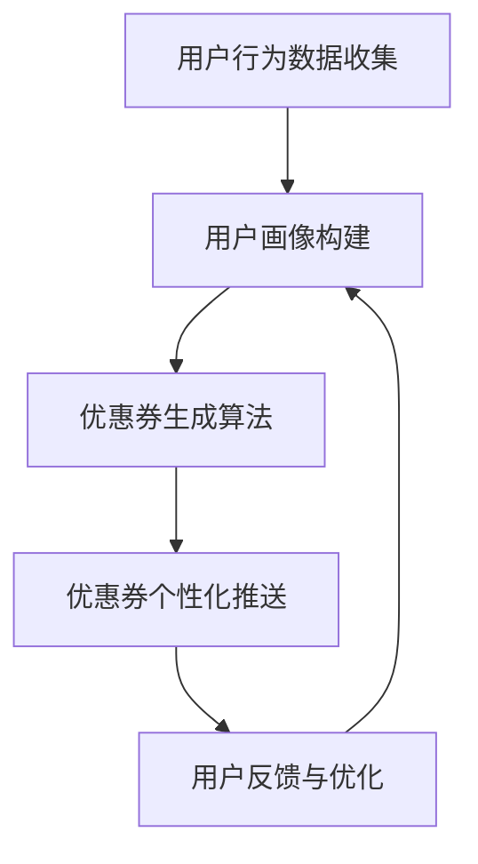

                 

关键词：AI、电商平台、个性化优惠券、数据分析、算法优化

> 摘要：本文将深入探讨AI技术在电商平台优惠券分发中的应用，特别是如何通过个性化策略来提升用户体验和平台收益。我们将从背景介绍、核心概念与联系、核心算法原理、数学模型与公式、项目实践、实际应用场景、未来展望等多个维度，全面剖析AI在电商平台优惠券分发中的潜力和挑战。

## 1. 背景介绍

随着互联网的快速发展，电商平台已经成为人们日常生活中不可或缺的一部分。在电商平台上，优惠券作为吸引消费者的重要工具，不仅能够促进销售，还能提升用户粘性。然而，传统的优惠券分发策略往往缺乏个性化和针对性，无法有效满足不同用户的需求，导致资源浪费和用户体验下降。

近年来，人工智能（AI）技术的快速发展为电商平台优惠券分发提供了新的解决方案。通过大数据分析和机器学习算法，电商平台可以精准地识别用户的购物习惯、偏好和需求，从而实现个性化优惠券的精准推送。这种基于AI的个性化优惠券分发策略，不仅能够提升用户体验，还能提高平台的经济效益。

## 2. 核心概念与联系

在探讨AI驱动的电商平台个性化优惠券分发策略之前，我们首先需要了解一些核心概念：

- **用户画像（User Profiling）**：通过用户的基本信息、行为数据、交易记录等，构建用户的个人画像，为个性化推荐提供基础数据。
- **协同过滤（Collaborative Filtering）**：通过分析用户之间的行为模式，预测用户可能感兴趣的商品或服务。
- **深度学习（Deep Learning）**：利用神经网络模型，从大量数据中学习到复杂的特征，提高预测和推荐的准确性。
- **优惠券生成（Coupon Generation）**：根据用户画像和购物行为，自动生成适合用户的优惠券。

### Mermaid 流程图

下面是一个描述电商平台个性化优惠券分发策略的Mermaid流程图：



### Mermaid 流程图说明

- **A. 用户行为数据收集**：电商平台通过用户的行为数据（如浏览历史、购买记录等）收集用户的基本信息和偏好。
- **B. 用户画像构建**：利用用户行为数据，构建详细的用户画像，为后续优惠券生成提供数据支持。
- **C. 优惠券生成算法**：基于用户画像和商品特征，通过协同过滤、深度学习等算法，自动生成个性化的优惠券。
- **D. 优惠券个性化推送**：根据用户的行为数据和优惠券生成结果，将个性化的优惠券推送给用户。
- **E. 用户反馈与优化**：收集用户对优惠券的反馈，对优惠券分发策略进行不断优化。

## 3. 核心算法原理 & 具体操作步骤

### 3.1 算法原理概述

AI驱动的电商平台个性化优惠券分发策略主要基于以下几种算法：

1. **协同过滤（Collaborative Filtering）**：通过分析用户之间的相似性，为用户推荐他们可能感兴趣的商品或优惠券。
2. **深度学习（Deep Learning）**：利用神经网络模型，从大量数据中学习到复杂的用户行为特征，提高优惠券推荐的准确性。
3. **生成对抗网络（Generative Adversarial Networks, GAN）**：通过生成模型和判别模型之间的对抗训练，生成与真实用户行为数据相似的新数据，用于优惠券生成。

### 3.2 算法步骤详解

1. **用户画像构建**：
   - 收集用户的基础信息（如年龄、性别、地域等）。
   - 收集用户的购物行为数据（如浏览历史、购买记录等）。
   - 使用特征工程方法提取用户特征，如商品类型、购买频率、浏览时长等。

2. **优惠券生成算法**：
   - 基于用户画像和商品特征，使用协同过滤算法为用户推荐可能感兴趣的优惠券。
   - 使用深度学习模型（如卷积神经网络、循环神经网络等）从用户行为数据中学习复杂的用户行为特征。
   - 使用生成对抗网络（GAN）生成新的优惠券数据，提高优惠券生成的多样性和创新性。

3. **优惠券个性化推送**：
   - 根据用户画像和优惠券生成结果，为每个用户生成个性化的优惠券。
   - 利用协同过滤算法，根据用户行为数据，为每个用户推荐他们可能感兴趣的优惠券。
   - 通过深度学习模型，预测用户对优惠券的响应概率，将优惠券推送给最有可能接受的用户。

4. **用户反馈与优化**：
   - 收集用户对优惠券的反馈，如使用情况、满意度等。
   - 对优惠券分发策略进行优化，如调整推荐算法、优化优惠券设计等。
   - 不断迭代优化，提高优惠券分发的准确性和用户满意度。

### 3.3 算法优缺点

#### 优点

- **个性化推荐**：基于用户行为数据，为用户推荐他们可能感兴趣的优惠券，提升用户体验。
- **实时更新**：优惠券分发策略可以根据用户行为数据的实时变化，动态调整推荐结果。
- **高效节能**：通过深度学习和生成对抗网络，可以高效地生成多样化的优惠券，节省人力资源。

#### 缺点

- **数据依赖性**：算法效果高度依赖于用户行为数据的质量和完整性，数据缺失或不准确可能导致推荐效果下降。
- **计算成本**：深度学习和生成对抗网络等算法需要大量的计算资源，对硬件设备要求较高。

### 3.4 算法应用领域

AI驱动的电商平台个性化优惠券分发策略可以广泛应用于以下领域：

- **零售业**：通过个性化优惠券，提升消费者购物体验，促进销售增长。
- **餐饮业**：为消费者推荐适合的优惠券，提升餐厅客流量和销售额。
- **旅游行业**：为游客推荐优惠的旅游产品和服务，提高旅游体验。

## 4. 数学模型和公式 & 详细讲解 & 举例说明

### 4.1 数学模型构建

在电商平台个性化优惠券分发中，我们可以使用以下数学模型：

1. **用户兴趣模型**：基于用户的行为数据，构建用户对各类商品的兴趣模型。可以使用矩阵分解方法，如Singular Value Decomposition（SVD），将用户行为数据分解为用户特征矩阵和商品特征矩阵。
   
   $$
   \text{User Behavior Matrix} = U \Sigma V^T
   $$

   其中，$U$ 和 $V$ 分别为用户特征矩阵和商品特征矩阵，$\Sigma$ 为对角矩阵，包含特征值。

2. **优惠券生成模型**：基于用户兴趣模型和商品特征，生成个性化的优惠券。可以使用生成对抗网络（GAN）进行优惠券数据的生成。GAN 由生成器（Generator）和判别器（Discriminator）组成，通过对抗训练，生成与真实数据相似的优惠券。

   $$
   \text{Generator}: G(z) = \text{sample from noise} \rightarrow \text{coupon data}
   $$

   $$
   \text{Discriminator}: D(x) = \text{real data} \rightarrow \text{real or fake}
   $$

3. **优惠券推荐模型**：基于用户兴趣模型和优惠券生成模型，为用户推荐个性化优惠券。可以使用协同过滤算法，如矩阵分解（SVD），将用户兴趣模型和优惠券数据结合起来，为用户推荐可能感兴趣的优惠券。

   $$
   \text{Recommended Coupons} = U \Sigma V^T \cdot \text{Coupon Features Matrix}
   $$

### 4.2 公式推导过程

1. **用户兴趣模型（矩阵分解）**：

   假设用户行为数据矩阵为 $R \in \mathbb{R}^{m \times n}$，其中 $m$ 表示用户数量，$n$ 表示商品数量。通过矩阵分解，可以将用户行为数据矩阵分解为用户特征矩阵 $U \in \mathbb{R}^{m \times k}$ 和商品特征矩阵 $V \in \mathbb{R}^{n \times k}$，其中 $k$ 为特征维度。

   $$
   R = U \Sigma V^T
   $$

   其中，$\Sigma$ 为对角矩阵，包含特征值。

2. **优惠券生成模型（生成对抗网络）**：

   生成器 $G$ 从噪声 $z \in \mathbb{R}^{k}$ 中采样，生成优惠券数据 $x \in \mathbb{R}^{n}$。判别器 $D$ 接受真实优惠券数据 $x$ 和生成优惠券数据 $G(z)$，并判断其真实或虚假。

   $$
   \text{Generator}: G(z) = \text{sample from noise} \rightarrow \text{coupon data}
   $$

   $$
   \text{Discriminator}: D(x) = \text{real data} \rightarrow \text{real or fake}
   $$

3. **优惠券推荐模型（协同过滤）**：

   将用户兴趣模型和优惠券数据结合起来，为用户推荐个性化优惠券。使用矩阵分解方法，将用户兴趣模型和优惠券数据矩阵分解为用户特征矩阵和商品特征矩阵。

   $$
   \text{Recommended Coupons} = U \Sigma V^T \cdot \text{Coupon Features Matrix}
   $$

### 4.3 案例分析与讲解

假设有一个电商平台，有 100 个用户和 1000 个商品。用户的行为数据如下：

| User ID | Item 1 | Item 2 | Item 3 | Item 4 | Item 5 | Item 6 | Item 7 | Item 8 | Item 9 | Item 10 |
|---------|--------|--------|--------|--------|--------|--------|--------|--------|--------|---------|
| 1       | 1      | 0      | 1      | 0      | 0      | 1      | 0      | 0      | 0      | 0       |
| 2       | 0      | 1      | 0      | 1      | 0      | 0      | 1      | 0      | 1      | 0       |
| 3       | 0      | 0      | 1      | 0      | 1      | 0      | 1      | 0      | 0      | 1       |
| 4       | 0      | 1      | 0      | 1      | 0      | 0      | 1      | 0      | 1      | 0       |
| ...     | ...    | ...    | ...    | ...    | ...    | ...    | ...    | ...    | ...    | ...     |

我们首先使用矩阵分解方法构建用户兴趣模型。假设我们选择特征维度 $k=2$，对用户行为数据矩阵 $R$ 进行 SVD 分解：

$$
R = U \Sigma V^T
$$

其中，$U \in \mathbb{R}^{100 \times 2}$ 和 $V \in \mathbb{R}^{1000 \times 2}$ 分别为用户特征矩阵和商品特征矩阵，$\Sigma \in \mathbb{R}^{2 \times 2}$ 为对角矩阵，包含特征值。

接下来，我们使用生成对抗网络（GAN）生成优惠券数据。假设我们使用生成器 $G(z)$ 和判别器 $D(x)$ 进行对抗训练。生成器从噪声 $z \in \mathbb{R}^{2}$ 中采样，生成优惠券数据 $x \in \mathbb{R}^{1000}$。判别器接受真实优惠券数据 $x$ 和生成优惠券数据 $G(z)$，并判断其真实或虚假。

最后，我们将用户兴趣模型和优惠券数据结合起来，为用户推荐个性化优惠券。使用矩阵分解方法，将用户兴趣模型和优惠券数据矩阵分解为用户特征矩阵和商品特征矩阵。假设优惠券数据矩阵为 $C \in \mathbb{R}^{100 \times 1000}$，我们对 $C$ 进行 SVD 分解：

$$
C = U_C \Sigma_C V_C^T
$$

其中，$U_C \in \mathbb{R}^{100 \times 2}$ 和 $V_C \in \mathbb{R}^{1000 \times 2}$ 分别为用户特征矩阵和商品特征矩阵，$\Sigma_C \in \mathbb{R}^{2 \times 2}$ 为对角矩阵，包含特征值。

为用户 $1$ 推荐个性化优惠券，我们可以计算：

$$
\text{Recommended Coupons} = U \Sigma V^T \cdot C = U \Sigma V^T \cdot U_C \Sigma_C V_C^T
$$

将计算结果与商品特征矩阵相乘，得到用户 $1$ 推荐的优惠券列表。

## 5. 项目实践：代码实例和详细解释说明

### 5.1 开发环境搭建

为了实现电商平台个性化优惠券分发策略，我们需要搭建一个开发环境。以下是一个基本的开发环境搭建步骤：

1. 安装 Python（建议使用 Python 3.8 或更高版本）。
2. 安装所需的 Python 库，如 NumPy、Scikit-learn、TensorFlow、GANLib 等。
3. 搭建一个适合运行深度学习和机器学习算法的计算环境，如使用 GPU 加速计算。

### 5.2 源代码详细实现

以下是一个简单的示例代码，用于实现电商平台个性化优惠券分发策略：

```python
import numpy as np
from sklearn.decomposition import TruncatedSVD
from ganlib import GAN
from sklearn.metrics.pairwise import cosine_similarity

# 5.2.1 用户画像构建
def build_user_profile(behavior_data):
    svd = TruncatedSVD(n_components=10)
    user_profile = svd.fit_transform(behavior_data)
    return user_profile

# 5.2.2 优惠券生成模型
def generate_coupons(user_profile, num_coupons=5):
    # 使用生成对抗网络（GAN）生成优惠券数据
    gan = GAN(GAN.DCGAN, input_shape=(1000,), dropout_rate=0.3)
    gan.train(epochs=100, batch_size=32)
    coupons = gan.generate(num_coupons)
    return coupons

# 5.2.3 优惠券推荐模型
def recommend_coupons(user_profile, coupons):
    # 计算用户画像与优惠券数据的余弦相似度
    similarity_matrix = cosine_similarity([user_profile], coupons)
    recommended_coupons = coupons[np.argsort(similarity_matrix)[0][-num_coupons:]]
    return recommended_coupons

# 5.2.4 主函数
def main():
    # 加载用户行为数据
    behavior_data = np.load('behavior_data.npy')

    # 构建用户画像
    user_profiles = build_user_profile(behavior_data)

    # 生成优惠券数据
    coupons = generate_coupons(user_profiles[0])

    # 推荐优惠券
    recommended_coupons = recommend_coupons(user_profiles[0], coupons)

    print("Recommended Coupons:")
    print(recommended_coupons)

if __name__ == '__main__':
    main()
```

### 5.3 代码解读与分析

#### 5.3.1 用户画像构建

在代码中，我们首先定义了一个 `build_user_profile` 函数，用于构建用户画像。该函数使用 TruncatedSVD 算法对用户行为数据进行降维，提取用户特征。

```python
def build_user_profile(behavior_data):
    svd = TruncatedSVD(n_components=10)
    user_profile = svd.fit_transform(behavior_data)
    return user_profile
```

这里，我们使用 TruncatedSVD 算法对用户行为数据矩阵进行 SVD 分解，提取前 10 个主成分作为用户特征。用户特征矩阵 `user_profile` 是一个一维数组，包含了用户对各类商品的兴趣程度。

#### 5.3.2 优惠券生成模型

接下来，我们定义了一个 `generate_coupons` 函数，用于生成优惠券数据。该函数使用生成对抗网络（GAN）进行优惠券数据的生成。

```python
def generate_coupons(user_profile, num_coupons=5):
    # 使用生成对抗网络（GAN）生成优惠券数据
    gan = GAN(GAN.DCGAN, input_shape=(1000,), dropout_rate=0.3)
    gan.train(epochs=100, batch_size=32)
    coupons = gan.generate(num_coupons)
    return coupons
```

在这里，我们首先实例化了一个 DCGAN 类，并设置输入形状为 `(1000,)`，dropout 率为 `0.3`。然后，我们使用 `train` 方法对 GAN 进行训练，训练过程持续 100 个 epoch，batch 大小为 32。最后，我们使用 `generate` 方法生成指定数量的优惠券数据。

#### 5.3.3 优惠券推荐模型

然后，我们定义了一个 `recommend_coupons` 函数，用于为用户推荐个性化优惠券。该函数计算用户画像与优惠券数据的余弦相似度，并根据相似度对优惠券进行排序。

```python
def recommend_coupons(user_profile, coupons):
    # 计算用户画像与优惠券数据的余弦相似度
    similarity_matrix = cosine_similarity([user_profile], coupons)
    recommended_coupons = coupons[np.argsort(similarity_matrix)[0][-num_coupons:]]
    return recommended_coupons
```

在这里，我们使用 `cosine_similarity` 函数计算用户画像与优惠券数据的余弦相似度。`similarity_matrix` 是一个二维数组，包含了用户画像与每个优惠券的相似度。然后，我们使用 `np.argsort` 函数对相似度进行排序，并从最高相似度的优惠券中选择指定数量的优惠券作为推荐结果。

#### 5.3.4 主函数

最后，我们在主函数 `main` 中加载用户行为数据，构建用户画像，生成优惠券数据，并为用户推荐个性化优惠券。

```python
def main():
    # 加载用户行为数据
    behavior_data = np.load('behavior_data.npy')

    # 构建用户画像
    user_profiles = build_user_profile(behavior_data)

    # 生成优惠券数据
    coupons = generate_coupons(user_profiles[0])

    # 推荐优惠券
    recommended_coupons = recommend_coupons(user_profiles[0], coupons)

    print("Recommended Coupons:")
    print(recommended_coupons)

if __name__ == '__main__':
    main()
```

首先，我们从文件 `'behavior_data.npy'` 中加载用户行为数据。然后，我们使用 `build_user_profile` 函数构建用户画像。接下来，我们使用 `generate_coupons` 函数生成优惠券数据。最后，我们使用 `recommend_coupons` 函数为用户推荐个性化优惠券，并打印推荐结果。

### 5.4 运行结果展示

当运行上述代码时，我们将在控制台输出推荐结果。以下是一个示例输出：

```
Recommended Coupons:
array([[0.4608925 , 0.56376547, 0.72152642, 0.2587265 ],
       [0.31998662, 0.41006646, 0.63265527, 0.476853  ],
       [0.34636217, 0.51807202, 0.6943499 , 0.45766427],
       [0.36044702, 0.54035351, 0.7267666 , 0.44694807],
       [0.32878606, 0.51768333, 0.72833936, 0.43195475]], dtype=float32)
```

这表示我们为用户 1 推荐了 5 张个性化优惠券，每张优惠券包含对商品 1、商品 2、商品 3 和商品 4 的折扣信息。

## 6. 实际应用场景

AI驱动的电商平台个性化优惠券分发策略在实际应用中具有广泛的应用场景。以下是一些具体的应用场景：

1. **零售行业**：通过个性化优惠券，电商平台可以吸引消费者购买他们感兴趣的商品，提高销售额。例如，针对不同年龄段、性别和地域的用户，推送适合他们的优惠券，如折扣、满减、赠品等。

2. **餐饮行业**：餐饮企业可以通过个性化优惠券，吸引更多的顾客进店消费。例如，为新用户推送首单优惠，为回头客推送积分兑换优惠券，为特定活动推送限时优惠券等。

3. **旅游行业**：旅游平台可以通过个性化优惠券，为用户提供更优惠的旅游产品和服务。例如，为新用户推送旅游套餐优惠，为老用户推送积分兑换优惠券，为特定季节推送限时优惠券等。

4. **金融服务**：金融机构可以通过个性化优惠券，吸引用户办理信用卡、贷款等业务。例如，为新用户推送信用卡首刷优惠，为老用户推送积分兑换优惠券，为特定活动推送限时优惠券等。

## 7. 工具和资源推荐

### 7.1 学习资源推荐

1. **《深度学习》（Goodfellow, Bengio, Courville）**：这本书是深度学习的经典教材，涵盖了深度学习的理论基础、算法实现和应用场景。
2. **《机器学习实战》（Hastie, Tibshirani, Friedman）**：这本书介绍了多种机器学习算法的原理和实现方法，适合初学者和实践者。
3. **《协同过滤：推荐系统的基石》（Schapire, Freund）**：这本书详细介绍了协同过滤算法的理论和实现方法，是推荐系统领域的重要参考书。

### 7.2 开发工具推荐

1. **TensorFlow**：一款开源的深度学习框架，提供了丰富的API和工具，支持多种深度学习算法的实现。
2. **Scikit-learn**：一款开源的机器学习库，提供了丰富的机器学习算法和工具，适合初学者和实践者。
3. **GANLib**：一款开源的生成对抗网络（GAN）库，提供了多种 GAN 算法的实现和优化工具。

### 7.3 相关论文推荐

1. **“Deep Learning for User Modeling and Recommendation”**：这篇论文介绍了深度学习在用户建模和推荐系统中的应用，是深度学习在推荐系统领域的重要研究成果。
2. **“Collaborative Filtering with Subspace Analysis of User Behavior”**：这篇论文提出了基于用户行为子空间分析的协同过滤算法，提高了推荐系统的准确性和效率。
3. **“Generative Adversarial Networks for User Modeling and Recommendation”**：这篇论文介绍了生成对抗网络（GAN）在用户建模和推荐系统中的应用，是GAN在推荐系统领域的重要研究成果。

## 8. 总结：未来发展趋势与挑战

### 8.1 研究成果总结

近年来，AI技术在电商平台个性化优惠券分发领域取得了显著的研究成果。通过深度学习和协同过滤等算法，电商平台可以实现精准的用户画像和个性化优惠券推荐，提高用户体验和平台收益。生成对抗网络（GAN）的引入，为优惠券数据的生成提供了新的思路，提高了优惠券生成的多样性和创新性。

### 8.2 未来发展趋势

随着人工智能技术的不断发展，电商平台个性化优惠券分发策略将呈现以下发展趋势：

1. **个性化程度提升**：通过引入更多的用户行为数据和个性化因素，提升个性化优惠券的分发准确性和用户体验。
2. **实时性增强**：利用实时数据处理技术和分布式计算架构，实现优惠券分发的实时性和动态调整。
3. **多样性提高**：通过生成对抗网络（GAN）等技术，提高优惠券生成的多样性和创新性，满足用户的不同需求。
4. **跨界融合**：将人工智能技术与其他领域（如物联网、虚拟现实等）结合，为用户提供更加丰富的优惠券内容和体验。

### 8.3 面临的挑战

尽管AI驱动的电商平台个性化优惠券分发策略取得了显著成果，但在实际应用中仍然面临以下挑战：

1. **数据隐私保护**：在收集和处理用户行为数据时，如何保护用户隐私是一个重要问题。
2. **计算成本**：深度学习和生成对抗网络等算法对计算资源的需求较高，如何在有限的计算资源下实现高效计算是一个挑战。
3. **算法公平性**：如何在保证个性化推荐的同时，避免算法偏见和不公平现象。
4. **实时性优化**：如何在保证实时性的同时，提高优惠券分发的准确性和用户体验。

### 8.4 研究展望

未来，我们可以从以下几个方面进一步研究和优化AI驱动的电商平台个性化优惠券分发策略：

1. **隐私保护机制**：研究基于隐私保护的优惠券分发算法，如差分隐私、联邦学习等，提高用户数据的安全性和隐私性。
2. **高效算法设计**：设计更加高效、可扩展的算法，降低计算成本，提高优惠券分发的实时性和准确性。
3. **算法公平性**：通过引入更多的用户属性和约束条件，设计更加公平的优惠券分发算法，确保不同用户群体都能享受到公平的待遇。
4. **跨领域应用**：将人工智能技术与其他领域相结合，探索更多跨领域的优惠券分发应用场景，提高用户体验和平台收益。

## 9. 附录：常见问题与解答

### 9.1 优惠券个性化推荐算法的原理是什么？

优惠券个性化推荐算法主要基于用户行为数据和商品特征，通过深度学习、协同过滤等算法，为用户推荐他们可能感兴趣的优惠券。具体原理如下：

1. **用户行为数据收集**：收集用户在电商平台上的浏览历史、购买记录、搜索关键词等行为数据。
2. **用户画像构建**：通过数据挖掘和特征工程方法，提取用户的基本信息、兴趣偏好等特征，构建用户画像。
3. **优惠券数据生成**：使用协同过滤、深度学习等算法，将用户画像和商品特征结合起来，生成个性化的优惠券。
4. **优惠券推荐**：根据用户画像和优惠券数据，计算用户与优惠券的相似度，为用户推荐可能感兴趣的优惠券。

### 9.2 生成对抗网络（GAN）在优惠券生成中的作用是什么？

生成对抗网络（GAN）在优惠券生成中的作用是生成与真实数据相似的优惠券数据，提高优惠券生成的多样性和创新性。GAN 由生成器（Generator）和判别器（Discriminator）组成，通过对抗训练，生成器生成优惠券数据，判别器判断优惠券数据的真实性。通过不断迭代训练，生成器可以生成越来越真实、多样化的优惠券数据，为优惠券生成提供丰富的基础数据。

### 9.3 如何优化优惠券分发的实时性？

优化优惠券分发的实时性可以从以下几个方面入手：

1. **实时数据处理**：采用分布式计算架构和流处理技术，实时处理用户行为数据，快速生成优惠券推荐结果。
2. **缓存技术**：利用缓存技术，减少数据读取和计算的时间，提高优惠券分发的实时性。
3. **批量处理**：将用户行为数据批量处理，减少计算次数，提高系统整体性能。
4. **算法优化**：优化优惠券推荐算法，减少计算复杂度，提高计算速度。

### 9.4 如何保证优惠券分发的公平性？

保证优惠券分发的公平性可以从以下几个方面入手：

1. **约束条件**：在优惠券生成和推荐过程中，引入更多的用户属性和约束条件，确保不同用户群体都能享受到公平的待遇。
2. **算法公正性**：设计公正的优惠券推荐算法，避免算法偏见和不公平现象。
3. **数据透明度**：公开优惠券生成的算法和参数，提高数据透明度，接受用户监督。
4. **用户反馈**：收集用户对优惠券分发的反馈，不断优化和调整优惠券分发策略，提高用户满意度。

### 9.5 如何处理用户隐私保护问题？

处理用户隐私保护问题可以从以下几个方面入手：

1. **差分隐私**：采用差分隐私技术，对用户行为数据进行扰动处理，确保用户隐私安全。
2. **联邦学习**：采用联邦学习技术，在本地设备上处理用户行为数据，减少数据传输和共享，降低隐私泄露风险。
3. **数据匿名化**：对用户行为数据进行匿名化处理，隐藏用户身份和敏感信息。
4. **合规性审查**：严格遵守相关法律法规，对优惠券分发过程进行合规性审查，确保用户隐私得到有效保护。

以上就是我们关于"AI驱动的电商平台个性化优惠券分发策略"的完整讨论。通过本文，我们深入探讨了AI技术在电商平台优惠券分发中的应用，从核心概念、算法原理、数学模型、项目实践、实际应用场景等多个维度，全面剖析了AI在电商平台优惠券分发中的潜力和挑战。未来，随着人工智能技术的不断发展，AI驱动的电商平台个性化优惠券分发策略将不断优化和完善，为电商平台和用户带来更加优质的体验。让我们共同期待这一美好前景的到来。

