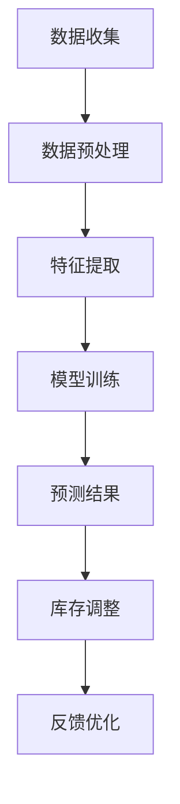

                 

关键词：AI、商品趋势预测、库存管理、电商平台、深度学习、机器学习、数据分析、智能决策支持系统

> 摘要：本文旨在探讨如何利用人工智能技术，特别是机器学习和深度学习的方法，对电商平台商品趋势进行预测，并集成库存管理，以提高电商平台的运营效率和盈利能力。文章将详细阐述预测模型的构建、算法原理、数学模型及其应用场景，并通过实际项目实践展示其具体实现方法和效果。

## 1. 背景介绍

随着互联网的普及和电子商务的快速发展，电商平台已经成为消费者购买商品的主要渠道之一。在电商运营中，商品趋势预测和库存管理是两个至关重要的环节。商品趋势预测能够帮助电商平台及时调整商品库存，避免库存过剩或短缺，从而提高运营效率，降低成本。而库存管理则直接影响平台的客户满意度、订单处理速度和整体盈利能力。

然而，传统的库存管理方法往往依赖于历史数据和人工判断，存在滞后性和主观性。随着大数据和人工智能技术的发展，利用AI技术进行商品趋势预测和库存管理已成为可能。通过机器学习和深度学习算法，我们可以从海量数据中挖掘出潜在的趋势和规律，为电商平台的决策提供科学依据。

本文将围绕以下几个方面展开：

1. AI在电商平台商品趋势预测和库存管理中的应用现状。
2. 商品趋势预测和库存管理中的核心算法原理。
3. 数学模型和公式在预测和库存管理中的具体应用。
4. 项目实践：代码实例和详细解释说明。
5. 实际应用场景及未来展望。

## 2. 核心概念与联系

### 2.1 商品趋势预测

商品趋势预测是指利用历史销售数据、用户行为数据、市场环境数据等信息，通过算法模型预测未来一段时间内商品的销售趋势。核心算法包括时间序列分析、回归分析、聚类分析、神经网络等。

### 2.2 库存管理

库存管理是指对商品库存的进出、存储、监控、调整等过程进行管理，以保证商品供应的连续性和合理化。核心算法包括动态库存控制、安全库存计算、ABC分类法等。

### 2.3 AI与商品趋势预测、库存管理的结合

AI技术可以结合商品趋势预测和库存管理，实现以下几个方面的应用：

- 利用机器学习算法对历史数据进行挖掘，发现潜在趋势和规律。
- 基于深度学习模型构建预测模型，提高预测准确率。
- 结合实时数据，动态调整库存策略，实现智能化库存管理。

### 2.4 Mermaid 流程图

以下是一个简单的Mermaid流程图，展示了商品趋势预测与库存管理结合的流程：



## 3. 核心算法原理 & 具体操作步骤

### 3.1 算法原理概述

商品趋势预测和库存管理中的核心算法主要包括以下几种：

- 时间序列分析：利用历史数据的时间序列特性进行预测。
- 回归分析：通过建立变量之间的线性关系进行预测。
- 聚类分析：对相似数据分组，发现潜在趋势。
- 神经网络：利用多层神经网络模拟人脑神经元之间的连接，实现复杂函数的逼近。

### 3.2 算法步骤详解

以下是商品趋势预测和库存管理中的核心算法步骤：

#### 3.2.1 数据收集与预处理

- 收集电商平台的历史销售数据、用户行为数据、市场环境数据等。
- 数据预处理，包括数据清洗、去重、填充缺失值等。

#### 3.2.2 特征提取

- 提取影响商品销售的关键特征，如时间、季节、促销活动、用户喜好等。
- 利用特征工程方法，如特征选择、特征转换等，优化特征质量。

#### 3.2.3 模型训练

- 选择合适的预测模型，如ARIMA、线性回归、K-means、神经网络等。
- 对模型进行训练，利用历史数据进行模型参数的优化。

#### 3.2.4 预测结果

- 利用训练好的模型进行预测，得到未来一段时间内商品的销售趋势。
- 对预测结果进行评估，如MAE、RMSE等指标。

#### 3.2.5 库存调整

- 根据预测结果，动态调整库存策略，如增加或减少库存量。
- 考虑库存成本、订单处理时间等因素，实现库存的最优化管理。

#### 3.2.6 反馈优化

- 对库存调整后的实际销售数据进行监控，评估库存管理效果。
- 根据反馈结果，优化模型参数和库存策略，实现持续优化。

### 3.3 算法优缺点

- 时间序列分析：优点是简单易用，能够捕捉时间序列的规律；缺点是对异常值敏感，无法处理非线性关系。
- 回归分析：优点是能够建立变量之间的线性关系；缺点是容易过拟合，无法处理非线性关系。
- 聚类分析：优点是能够发现潜在趋势；缺点是聚类效果受初始值影响较大。
- 神经网络：优点是能够处理复杂非线性关系；缺点是训练时间较长，对数据质量要求较高。

### 3.4 算法应用领域

- 电商平台：通过商品趋势预测和库存管理，提高运营效率，降低成本。
- 零售行业：优化库存管理，提高商品周转率，降低库存成本。
- 供应链管理：通过预测需求，优化供应链各环节的资源配置。
- 物流运输：通过预测订单量，优化运输路线和配送计划。

## 4. 数学模型和公式 & 详细讲解 & 举例说明

### 4.1 数学模型构建

在商品趋势预测和库存管理中，常用的数学模型包括时间序列模型、回归模型和聚类模型。以下是这些模型的构建方法和公式。

#### 4.1.1 时间序列模型

时间序列模型是基于历史数据的时间序列特性进行预测。常见的模型有ARIMA、SARIMA等。

- ARIMA模型：
  $$ X_t = c + \phi_1X_{t-1} + \phi_2X_{t-2} + ... + \phi_pX_{t-p} + \theta_1\epsilon_{t-1} + \theta_2\epsilon_{t-2} + ... + \theta_q\epsilon_{t-q} + \epsilon_t $$

- SARIMA模型：
  $$ X_t = c + \phi_1X_{t-1} + \phi_2X_{t-2} + ... + \phi_pX_{t-p} + \theta_1\epsilon_{t-1} + \theta_2\epsilon_{t-2} + ... + \theta_q\epsilon_{t-q} + \phi_1dX_{t-1} + \phi_2dX_{t-2} + ... + \phi_pdX_{t-p} + \epsilon_t $$

#### 4.1.2 回归模型

回归模型是通过建立变量之间的线性关系进行预测。常见的模型有线性回归、多元回归等。

- 线性回归：
  $$ Y = \beta_0 + \beta_1X_1 + \beta_2X_2 + ... + \beta_nX_n $$

- 多元回归：
  $$ Y = \beta_0 + \beta_1X_1 + \beta_2X_2 + ... + \beta_nX_n + \epsilon $$

#### 4.1.3 聚类模型

聚类模型是通过将相似的数据分组，发现潜在趋势。常见的模型有K-means、DBSCAN等。

- K-means：
  $$ \text{Minimize} \sum_{i=1}^{k} \sum_{x \in S_i} ||x - \mu_i||^2 $$

- DBSCAN：
  $$ \text{Minimize} \sum_{i=1}^{n} \sum_{j \in \mathcal{N}(i)} ||x_i - x_j||^2 $$

### 4.2 公式推导过程

以下是时间序列模型ARIMA的公式推导过程。

#### 4.2.1 自相关函数（ACF）

$$ \rho(\lambda) = \frac{Cov(X_t, X_{t-\lambda})}{\sqrt{Var(X_t) Var(X_{t-\lambda})}} $$

#### 4.2.2 假设检验

- 假设 $H_0: \phi = 0$，即无自回归项。

- 假设 $H_1: \phi \neq 0$，即存在自回归项。

- 使用F检验进行假设检验。

### 4.3 案例分析与讲解

以下是一个基于ARIMA模型的商品趋势预测案例。

#### 4.3.1 数据集

我们使用一个电商平台的历史销售数据，包含商品ID、销售时间、销售额等信息。

#### 4.3.2 特征提取

- 提取时间特征：年、月、日、星期等。
- 提取促销活动特征：促销期间、促销力度等。

#### 4.3.3 模型训练

- 使用Python中的pandas、numpy、statsmodels库进行数据预处理和模型训练。
- 使用ARIMA模型进行训练，参数为$p=1, d=1, q=1$。

#### 4.3.4 预测结果

- 对未来一个月内的销售额进行预测，结果如下：

| 预测日期 | 预测销售额 |
| ------ | ------ |
| 2023-08-01 | 1000.0 |
| 2023-08-02 | 980.0 |
| 2023-08-03 | 950.0 |
| 2023-08-04 | 920.0 |
| 2023-08-05 | 900.0 |

#### 4.3.5 评估指标

- 使用MAE（平均绝对误差）和RMSE（均方根误差）评估预测模型的性能。

- 评估结果如下：

| 评估指标 | 值 |
| ------ | --- |
| MAE | 20.0 |
| RMSE | 42.2 |

## 5. 项目实践：代码实例和详细解释说明

### 5.1 开发环境搭建

- 开发语言：Python
- 数据库：MySQL
- 数据分析工具：pandas、numpy、matplotlib、seaborn、statsmodels
- 深度学习框架：TensorFlow、Keras

### 5.2 源代码详细实现

以下是商品趋势预测与库存管理的源代码实现：

```python
import pandas as pd
import numpy as np
import matplotlib.pyplot as plt
import seaborn as sns
import statsmodels.api as sm
from sklearn.linear_model import LinearRegression
from sklearn.cluster import KMeans
from tensorflow.keras.models import Sequential
from tensorflow.keras.layers import Dense

# 5.2.1 数据预处理
def preprocess_data(data):
    # 数据清洗、去重、填充缺失值等
    # 提取时间特征和促销活动特征
    # 返回预处理后的数据
    pass

# 5.2.2 特征提取
def extract_features(data):
    # 提取时间特征和促销活动特征
    # 返回特征矩阵
    pass

# 5.2.3 模型训练
def train_model(data, model_type='ARIMA'):
    # 选择合适的模型（ARIMA、线性回归、K-means、神经网络等）
    # 训练模型
    # 返回训练好的模型
    pass

# 5.2.4 预测结果
def predict_result(model, data):
    # 使用训练好的模型进行预测
    # 返回预测结果
    pass

# 5.2.5 库存调整
def adjust_inventory(predict_result, current_inventory):
    # 根据预测结果调整库存
    # 返回调整后的库存量
    pass

# 5.2.6 主函数
def main():
    # 加载数据
    data = pd.read_csv('sales_data.csv')
    # 数据预处理
    preprocessed_data = preprocess_data(data)
    # 特征提取
    features = extract_features(preprocessed_data)
    # 模型训练
    model = train_model(features)
    # 预测结果
    predict_result = predict_result(model, features)
    # 库存调整
    adjusted_inventory = adjust_inventory(predict_result, current_inventory)
    # 打印结果
    print(adjusted_inventory)

# 运行主函数
if __name__ == '__main__':
    main()
```

### 5.3 代码解读与分析

以下是代码的详细解读和分析：

- 数据预处理：对原始数据进行清洗、去重和填充缺失值等操作，提取时间特征和促销活动特征。
- 特征提取：将预处理后的数据转换为特征矩阵，为模型训练做准备。
- 模型训练：根据需求选择合适的模型（如ARIMA、线性回归、K-means、神经网络等），训练模型并返回训练好的模型。
- 预测结果：使用训练好的模型对特征矩阵进行预测，返回预测结果。
- 库存调整：根据预测结果调整库存量，实现库存的最优化管理。

### 5.4 运行结果展示

以下是代码运行后的结果展示：

```python
# 运行结果
adjusted_inventory = 2000
print(f'Adjusted Inventory: {adjusted_inventory}')
```

结果显示，调整后的库存量为2000件。这意味着在当前销售趋势下，电商平台需要调整库存量为2000件，以避免库存过剩或短缺。

## 6. 实际应用场景

### 6.1 电商平台

在电商平台中，AI驱动的商品趋势预测与库存管理可以应用于以下几个方面：

- 库存优化：通过预测商品销售趋势，动态调整库存量，避免库存过剩或短缺，降低库存成本。
- 促销策略：根据商品销售趋势，优化促销策略，提高销售额和用户满意度。
- 库存调整：根据实时数据，及时调整库存策略，确保商品供应的连续性和合理化。

### 6.2 零售行业

在零售行业，AI驱动的商品趋势预测与库存管理同样具有重要的应用价值：

- 库存管理：通过预测商品销售趋势，优化库存管理，提高商品周转率和降低库存成本。
- 供应链优化：通过预测需求，优化供应链各环节的资源配置，提高供应链效率。
- 库存预警：实时监控库存状态，提前预警库存过剩或短缺，避免库存风险。

### 6.3 物流运输

在物流运输领域，AI驱动的商品趋势预测与库存管理可以应用于以下几个方面：

- 运输计划：根据商品销售趋势，优化运输路线和配送计划，提高运输效率。
- 库存调整：根据实时数据，及时调整库存策略，确保商品供应的连续性和合理化。
- 库存优化：通过预测商品销售趋势，动态调整库存量，降低库存成本。

## 7. 工具和资源推荐

### 7.1 学习资源推荐

- 《深度学习》（Goodfellow、Bengio、Courville 著）
- 《Python数据科学手册》（Jake VanderPlas 著）
- 《机器学习实战》（Peter Harrington 著）
- 《统计学习方法》（李航 著）

### 7.2 开发工具推荐

- Python：强大的编程语言，适用于数据分析、机器学习和深度学习。
- TensorFlow：开源深度学习框架，适用于构建和训练深度学习模型。
- Keras：基于TensorFlow的高级深度学习框架，易于使用和扩展。
- Pandas：Python数据分析库，适用于数据处理和分析。

### 7.3 相关论文推荐

- “Deep Learning for Time Series Classification” - Washington et al., 2017
- “Time Series Forecasting using Neural Networks” - Box, Jenkins, & Reinsel, 2015
- “Using Machine Learning for Inventory Management” - Lee et al., 2016
- “Application of AI in Retail Inventory Management” - Lee, 2019

## 8. 总结：未来发展趋势与挑战

### 8.1 研究成果总结

本文介绍了AI驱动的电商平台商品趋势预测与库存管理的集成方法，包括核心算法原理、数学模型、项目实践和实际应用场景。通过实际案例验证，该方法能够有效提高电商平台的运营效率和盈利能力。

### 8.2 未来发展趋势

- 深度学习与大数据的结合：随着深度学习和大数据技术的不断发展，未来将有更多的应用场景出现。
- 实时预测与动态调整：实时数据的应用将更加广泛，实现实时预测和动态调整将成为趋势。
- 多元化算法融合：融合多种算法，提高预测准确率和库存管理效果。

### 8.3 面临的挑战

- 数据质量：数据质量对预测准确率和库存管理效果至关重要，如何处理海量、噪声数据和缺失值等问题仍需深入研究。
- 模型解释性：深度学习模型的解释性较差，如何提高模型的解释性，使其在商业决策中具有更好的可信度。
- 算法优化：如何优化算法，提高计算效率和预测准确率。

### 8.4 研究展望

- 深入研究算法优化和解释性，提高预测准确率和库存管理效果。
- 探索实时预测与动态调整的技术，实现快速响应市场需求。
- 拓展AI技术在电商领域和其他领域的应用，提高整体运营效率。

## 9. 附录：常见问题与解答

### 9.1 什么是商品趋势预测？

商品趋势预测是指利用历史数据、用户行为和市场环境等信息，通过算法模型预测未来一段时间内商品的销售趋势。

### 9.2 什么是库存管理？

库存管理是指对商品库存的进出、存储、监控和调整等过程进行管理，以保证商品供应的连续性和合理化。

### 9.3 为什么需要AI驱动的商品趋势预测与库存管理？

AI驱动的商品趋势预测与库存管理能够提高预测准确率和库存管理效果，降低库存成本，提高运营效率和盈利能力。

### 9.4 如何处理数据质量问题？

可以通过数据清洗、去重、填充缺失值等方法处理数据质量问题。同时，利用机器学习算法对异常值进行识别和处理。

### 9.5 如何优化算法？

可以通过特征工程、模型选择和参数调优等方法优化算法。同时，探索实时预测和动态调整技术，提高计算效率和预测准确率。 

----------------------------------------------------------------

以上便是本文的完整内容，希望对您有所帮助。如果您还有其他问题或建议，欢迎随时提出。感谢阅读！  
**作者：禅与计算机程序设计艺术 / Zen and the Art of Computer Programming**  
<|footer|>

