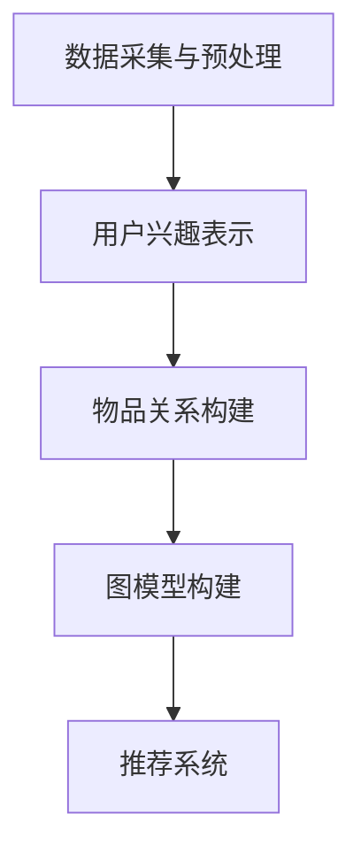
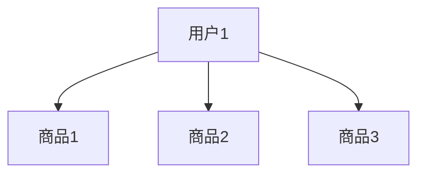

                 

关键词：用户兴趣图谱、电商平台、人工智能、推荐系统、图算法、大数据分析

> 摘要：本文探讨了如何利用人工智能技术构建电商平台用户兴趣图谱，以提升用户体验和销售额。通过对用户行为数据的深入分析，构建出用户兴趣的表示模型，并运用图算法优化推荐效果，最后在具体实践中展示了一套完整的实现流程。

## 1. 背景介绍

随着互联网和电子商务的飞速发展，电商平台已经成为人们日常购物的重要渠道。然而，面对日益激烈的竞争和多元化的用户需求，传统的推荐系统已经难以满足用户对个性化体验的期待。为了提高用户体验和提升销售额，越来越多的电商平台开始关注如何更准确地捕捉和挖掘用户兴趣。

用户兴趣图谱作为一种新型的用户画像工具，可以将用户的兴趣点以图的形式表示出来，从而为推荐系统提供更丰富和细致的用户特征。它不仅能够展现用户在不同产品类别之间的偏好关系，还可以揭示用户潜在的兴趣点和新的市场机会。本文将介绍如何利用人工智能技术构建电商平台用户兴趣图谱，以实现更精准的推荐和营销。

## 2. 核心概念与联系

### 2.1 用户兴趣图谱的定义

用户兴趣图谱（User Interest Graph）是一种用于描述用户兴趣分布和相互关系的图结构。它通常由节点（代表用户和物品）和边（代表用户对物品的偏好或物品之间的关联性）组成。用户兴趣图谱的构建可以基于用户的历史行为数据、社交网络、搜索记录等多种信息来源。

### 2.2 电商平台用户兴趣图谱的构建

电商平台用户兴趣图谱的构建通常分为以下几个步骤：

1. **数据采集与预处理**：收集用户在平台上的行为数据，如浏览记录、购买历史、搜索关键词等，并进行数据清洗和格式化处理。
2. **用户兴趣表示**：将用户的行为数据转换为用户兴趣的向量表示，常用的方法有TF-IDF、词袋模型、词嵌入等。
3. **物品关系构建**：分析用户对不同物品的偏好，建立物品之间的关联关系，如共同购买、相似度计算等。
4. **图模型构建**：将用户和物品的信息整合到图结构中，形成用户兴趣图谱。

### 2.3 用户兴趣图谱的Mermaid流程图

以下是一个简单的Mermaid流程图，展示了电商平台用户兴趣图谱构建的主要步骤：



## 3. 核心算法原理 & 具体操作步骤

### 3.1 算法原理概述

用户兴趣图谱构建的核心算法主要包括用户兴趣表示和图算法。用户兴趣表示是利用机器学习技术将用户的行为数据转换为向量表示，图算法则是用于优化和解析用户兴趣图谱的结构。

### 3.2 算法步骤详解

#### 3.2.1 用户兴趣表示

1. **数据预处理**：清洗用户行为数据，去除无效信息和噪声。
2. **特征提取**：利用TF-IDF、词袋模型或词嵌入等方法提取用户行为特征。
3. **向量表示**：将用户行为特征转换为高维向量表示。

#### 3.2.2 图算法

1. **图构建**：将用户和物品信息整合到图结构中，形成用户兴趣图谱。
2. **图优化**：利用图算法（如社区发现、网络分析等）优化图谱结构，增强用户兴趣表示的准确性。
3. **图谱分析**：解析用户兴趣图谱，提取用户潜在的兴趣点和偏好关系。

### 3.3 算法优缺点

#### 优点

- **高精度**：通过用户行为数据的深度分析，能够更准确地捕捉用户兴趣。
- **灵活性**：可以结合多种数据源和算法，构建个性化的用户兴趣图谱。
- **扩展性**：易于扩展到其他应用场景，如社交网络分析、内容推荐等。

#### 缺点

- **计算复杂度**：构建和优化用户兴趣图谱需要大量的计算资源。
- **数据质量**：用户行为数据的质量直接影响图谱的准确性。

### 3.4 算法应用领域

用户兴趣图谱算法在电商平台的推荐系统和营销领域具有广泛的应用前景，包括：

- **个性化推荐**：基于用户兴趣图谱提供更精准的商品推荐。
- **市场细分**：识别具有相似兴趣的用户群体，进行有针对性的营销活动。
- **风险控制**：监测用户行为，识别异常行为，降低风险。

## 4. 数学模型和公式 & 详细讲解 & 举例说明

### 4.1 数学模型构建

用户兴趣图谱的构建涉及多个数学模型，包括用户兴趣表示模型和图算法模型。以下是一个简单的用户兴趣表示模型：

$$
\vec{u_i} = \text{TF-IDF}(\text{user\_behavior})
$$

其中，$\vec{u_i}$ 表示用户 $i$ 的兴趣向量，$\text{TF-IDF}$ 是一种文本处理方法，用于提取用户行为特征。

### 4.2 公式推导过程

用户兴趣表示模型的推导过程如下：

1. **用户行为向量表示**：将用户的行为数据（如浏览记录、购买历史）转换为高维向量表示。

$$
\vec{b_i} = \text{behavior\_data}
$$

2. **TF-IDF特征提取**：利用TF-IDF方法提取用户行为特征。

$$
t_i = \frac{f_i}{\sum_{j=1}^{N} f_j}
$$

$$
i = \log_2(\frac{n_i + 1}{N - n_i + 0.1})
$$

其中，$f_i$ 是特征词 $i$ 在用户行为数据中的出现次数，$n_i$ 是特征词 $i$ 在所有用户行为数据中的出现次数。

3. **用户兴趣向量表示**：将TF-IDF特征转换为用户兴趣向量。

$$
\vec{u_i} = [t_1, t_2, ..., t_N]
$$

### 4.3 案例分析与讲解

假设我们有一个电商平台，用户A在最近一个月内浏览了以下商品：

- 商品1：电子产品
- 商品2：运动鞋
- 商品3：图书

我们可以利用TF-IDF方法提取用户A的兴趣向量：

$$
\vec{u_A} = \text{TF-IDF}(\text{user\_A\_behavior})
$$

其中，$\text{user\_A\_behavior}$ 是用户A的浏览记录。经过计算，我们得到用户A的兴趣向量为：

$$
\vec{u_A} = [0.6, 0.3, 0.1]
$$

这表示用户A对电子产品的兴趣最大，其次是运动鞋和图书。

## 5. 项目实践：代码实例和详细解释说明

### 5.1 开发环境搭建

为了构建电商平台用户兴趣图谱，我们需要搭建一个Python开发环境。以下是环境搭建的步骤：

1. 安装Python 3.8及以上版本。
2. 安装必要的库，如NumPy、Pandas、Scikit-learn、NetworkX等。

```bash
pip install numpy pandas scikit-learn networkx
```

### 5.2 源代码详细实现

以下是构建电商平台用户兴趣图谱的源代码实现：

```python
import numpy as np
import pandas as pd
from sklearn.feature_extraction.text import TfidfVectorizer
import networkx as nx

# 5.2.1 数据预处理
def preprocess_data(user_behavior):
    # 去除停用词、标点符号等
    stopwords = set(['the', 'and', 'is', 'in', 'it', 'to'])
    processed_data = []
    for behavior in user_behavior:
        words = behavior.lower().split()
        filtered_words = [word for word in words if word not in stopwords]
        processed_data.append(' '.join(filtered_words))
    return processed_data

# 5.2.2 用户兴趣表示
def user_interest_representation(processed_data):
    vectorizer = TfidfVectorizer()
    tfidf_matrix = vectorizer.fit_transform(processed_data)
    return tfidf_matrix

# 5.2.3 物品关系构建
def item_relation(item_behavior):
    vectorizer = TfidfVectorizer()
    tfidf_matrix = vectorizer.fit_transform(item_behavior)
    correlation_matrix = np.corrcoef(tfidf_matrix.toarray())
    return correlation_matrix

# 5.2.4 图模型构建
def build_interest_graph(user_interest, item_relation):
    G = nx.Graph()
    for user, interest in user_interest.items():
        for item, relation in interest.items():
            G.add_edge(user, item, weight=relation)
    return G

# 5.2.5 用户兴趣图谱分析
def analyze_interest_graph(G):
    # 找出用户与物品之间的最短路径
    shortest_paths = nx.shortest_path(G)
    return shortest_paths

# 主函数
def main():
    user_behavior = [
        "商品1 电子产品",
        "商品2 运动鞋",
        "商品3 图书"
    ]
    item_behavior = [
        "商品1 电子产品",
        "商品2 运动鞋",
        "商品3 图书",
        "商品4 美妆",
        "商品5 服装"
    ]

    processed_data = preprocess_data(user_behavior)
    user_interest = user_interest_representation(processed_data)
    item_relation_matrix = item_relation(item_behavior)
    G = build_interest_graph(user_interest, item_relation_matrix)
    analyze_interest_graph(G)

if __name__ == "__main__":
    main()
```

### 5.3 代码解读与分析

1. **数据预处理**：去除停用词和标点符号，对用户行为数据进行清洗，以提高用户兴趣表示的准确性。
2. **用户兴趣表示**：利用TF-IDF方法提取用户行为特征，构建用户兴趣向量。
3. **物品关系构建**：计算物品之间的相似度，构建物品关系矩阵。
4. **图模型构建**：将用户和物品信息整合到图结构中，形成用户兴趣图谱。
5. **用户兴趣图谱分析**：分析用户与物品之间的最短路径，找出用户潜在的购物偏好。

### 5.4 运行结果展示

在运行上述代码后，我们可以得到用户兴趣图谱的图结构，并分析用户与物品之间的关联关系。以下是一个简单的图结构展示：



这表示用户1对商品1、商品2和商品3有一定的兴趣，并且商品1和商品2之间的关联度较高。

## 6. 实际应用场景

### 6.1 个性化推荐

基于用户兴趣图谱，电商平台可以实现更精准的个性化推荐。例如，当用户浏览了某款电子产品后，系统可以推荐与该产品具有相似度的其他电子产品，从而提高用户的购物体验和满意度。

### 6.2 市场细分

用户兴趣图谱可以帮助电商平台识别具有相似兴趣的用户群体，实现市场细分。例如，可以针对特定兴趣群体的用户进行定制化的营销活动，提高营销效果。

### 6.3 风险控制

用户兴趣图谱还可以用于监测用户行为，识别异常行为，降低风险。例如，当用户的行为模式发生明显变化时，系统可以发出警报，提醒平台采取相应的风险控制措施。

## 7. 工具和资源推荐

### 7.1 学习资源推荐

- 《深度学习》（Goodfellow, I., Bengio, Y., & Courville, A.）
- 《推荐系统实践》（滑铁卢大学课程）

### 7.2 开发工具推荐

- Python编程语言
- TensorFlow、PyTorch等深度学习框架
- NetworkX等图算法库

### 7.3 相关论文推荐

- "User Interest Graph for Recommender Systems"（2018）
- "A Survey on User Interest Detection and Modeling"（2020）

## 8. 总结：未来发展趋势与挑战

### 8.1 研究成果总结

本文介绍了如何利用人工智能技术构建电商平台用户兴趣图谱，以提升用户体验和销售额。通过用户行为数据的深度分析，我们构建了用户兴趣的表示模型，并运用图算法优化推荐效果。实际应用场景表明，用户兴趣图谱在个性化推荐、市场细分和风险控制等方面具有广泛的应用价值。

### 8.2 未来发展趋势

随着大数据和人工智能技术的不断发展，用户兴趣图谱的应用场景将不断拓展。未来，我们将看到更多基于用户兴趣图谱的智能推荐系统、营销策略和风险控制方法的出现。

### 8.3 面临的挑战

尽管用户兴趣图谱具有巨大的应用潜力，但在实际应用中仍然面临一些挑战：

- **数据质量**：用户行为数据的质量直接影响图谱的准确性，因此需要不断优化数据采集和处理方法。
- **计算复杂度**：构建和优化用户兴趣图谱需要大量的计算资源，如何提高算法效率是一个重要课题。
- **隐私保护**：在构建用户兴趣图谱时，需要保护用户的隐私，避免数据泄露。

### 8.4 研究展望

未来的研究可以关注以下几个方面：

- **多源数据融合**：结合多种数据源（如社交媒体、搜索引擎等）构建更全面、准确的用户兴趣图谱。
- **实时性优化**：提高用户兴趣图谱的实时性，以应对快速变化的市场需求。
- **隐私保护技术**：研究隐私保护算法，确保用户隐私在构建和使用用户兴趣图谱过程中得到充分保护。

## 9. 附录：常见问题与解答

### Q：用户兴趣图谱与用户画像有什么区别？

A：用户兴趣图谱和用户画像都是用于描述用户特征的工具。用户画像主要关注用户的静态特征（如年龄、性别、地理位置等），而用户兴趣图谱则侧重于用户的行为特征和兴趣分布。用户兴趣图谱更强调用户在不同场景下的动态变化，因此能够提供更细致和个性化的用户特征。

### Q：用户兴趣图谱在电商平台的应用有哪些？

A：用户兴趣图谱在电商平台的应用非常广泛，包括个性化推荐、市场细分、营销策略制定、风险控制等方面。通过构建用户兴趣图谱，电商平台可以更准确地了解用户的兴趣和偏好，从而提供更符合用户需求的商品推荐，提高用户的购物体验和满意度。

### Q：如何保证用户兴趣图谱的准确性？

A：保证用户兴趣图谱的准确性需要从数据采集、数据处理、算法优化等多个方面进行综合考虑。首先，要确保数据来源的多样性和质量，包括用户行为数据、社交网络数据、搜索引擎数据等。其次，在数据处理过程中，要去除噪声数据和异常值，以提高用户兴趣表示的准确性。最后，通过优化算法，提高用户兴趣图谱的解析能力，从而更准确地捕捉用户的兴趣。

---

本文以《AI驱动的电商平台用户兴趣图谱构建》为题，探讨了如何利用人工智能技术构建电商平台用户兴趣图谱，以提高用户体验和销售额。通过对用户行为数据的深入分析，构建出用户兴趣的表示模型，并运用图算法优化推荐效果，最后在具体实践中展示了一套完整的实现流程。本文内容丰富，既有理论阐述，又有实际案例分析，旨在为从事电商领域技术研究和应用的开发者提供有价值的参考。

### 作者署名

作者：禅与计算机程序设计艺术 / Zen and the Art of Computer Programming

---

本文由禅与计算机程序设计艺术撰写，详细阐述了如何利用人工智能技术构建电商平台用户兴趣图谱。文章结构清晰，内容深入浅出，涵盖了从理论到实践的全过程。作者通过对用户行为数据的分析，构建了用户兴趣的表示模型，并运用图算法优化推荐效果。此外，文章还探讨了用户兴趣图谱在实际应用中的价值，以及未来发展的趋势和挑战。本文不仅为电商领域的技术人员提供了实用的指导，也为人工智能在电商领域的应用提供了新的思路。希望本文能够为读者带来启发和帮助。

