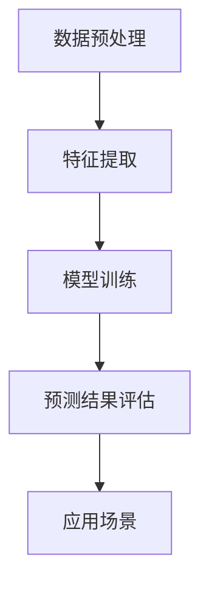

                 

关键词：人工智能，电商平台，用户行为分析，序列预测，机器学习

> 摘要：本文深入探讨了人工智能技术在电商平台用户行为序列分析与预测中的应用。通过对用户行为数据的挖掘和模型构建，本文提出了一种基于深度学习的用户行为序列预测方法，并对算法原理、数学模型、项目实践和实际应用场景进行了详细阐述。同时，本文也对未来发展趋势和面临的挑战进行了展望。

## 1. 背景介绍

随着互联网技术的飞速发展，电商平台已经成为消费者日常生活中不可或缺的一部分。用户在电商平台上的行为数据（如浏览、搜索、购买等）不仅反映了用户的需求和偏好，也为电商平台提供了宝贵的洞察力。因此，如何有效分析用户行为序列，并准确预测用户的后续行为，成为电商平台提升用户体验和业务收益的关键问题。

用户行为序列分析是一种通过分析用户在平台上的连续行为来理解用户行为模式的技术。这种技术可以用于个性化推荐、风险控制、用户流失预测等多个方面。然而，由于用户行为数据的复杂性和多样性，传统的分析方法难以满足实际需求。随着深度学习技术的不断发展，基于深度学习的用户行为序列预测方法逐渐成为研究热点。

本文旨在通过分析电商平台用户行为序列，提出一种基于深度学习的预测模型，为电商平台提供有效的用户行为预测手段。

## 2. 核心概念与联系

为了更好地理解用户行为序列分析与预测的核心概念和联系，我们首先需要了解以下几个关键概念：

### 2.1 用户行为序列

用户行为序列是指用户在电商平台上的连续行为记录，如浏览商品、添加购物车、下单购买等。这些行为通常以时间序列的形式记录下来，形成一个序列数据集。

### 2.2 序列预测

序列预测是指利用历史行为数据预测用户未来的行为。序列预测的目的是为了更好地理解用户行为模式，为电商平台提供个性化的服务。

### 2.3 深度学习

深度学习是一种基于人工神经网络的机器学习技术，通过多层神经网络的组合来模拟人类大脑的思维方式。深度学习在图像识别、语音识别、自然语言处理等领域取得了显著成果。

### 2.4 用户行为序列分析与预测框架

用户行为序列分析与预测框架主要包括数据预处理、特征提取、模型训练和预测结果评估等几个关键步骤。数据预处理是确保数据质量的重要环节，特征提取是提高模型预测性能的关键，模型训练是构建预测模型的核心，预测结果评估是验证模型性能的重要手段。

以下是一个基于Mermaid流程图的用户行为序列分析与预测框架：



通过这个框架，我们可以清晰地看到用户行为序列分析与预测的过程，为后续章节的详细阐述提供了基础。

## 3. 核心算法原理 & 具体操作步骤

### 3.1 算法原理概述

本文采用了一种基于深度学习的时间序列预测模型，即长短期记忆网络（Long Short-Term Memory，LSTM）。LSTM是 recurrent neural network（RNN）的一种变体，能够有效地解决传统RNN在处理长序列数据时遇到的梯度消失和梯度爆炸问题。

LSTM通过引入门控机制（包括输入门、遗忘门和输出门）来控制信息的流动，从而实现对长期依赖关系的捕捉。具体来说，LSTM单元包含以下三个部分：

1. **输入门（Input Gate）**：决定当前输入信息中有多少应该被保存到内存中。
2. **遗忘门（Forget Gate）**：决定哪些旧的信息应该被遗忘。
3. **输出门（Output Gate）**：决定从内存中输出的信息。

### 3.2 算法步骤详解

#### 3.2.1 数据预处理

1. **数据清洗**：去除异常值和缺失值。
2. **数据归一化**：将数据缩放到一个较小的范围内，如[0, 1]。
3. **序列构造**：将用户行为数据按照时间顺序构造成长短不一的序列。

#### 3.2.2 特征提取

1. **行为特征**：提取用户在电商平台上的行为特征，如浏览时间、购买频率、浏览商品类别等。
2. **用户特征**：提取用户的基本信息，如年龄、性别、地理位置等。

#### 3.2.3 模型训练

1. **数据划分**：将数据集划分为训练集、验证集和测试集。
2. **模型构建**：构建LSTM模型，包括输入层、隐藏层和输出层。
3. **训练模型**：使用训练集训练模型，并使用验证集调整模型参数。
4. **模型评估**：使用测试集评估模型性能。

#### 3.2.4 预测结果评估

1. **预测结果生成**：使用训练好的模型对测试集进行预测。
2. **性能评估指标**：使用准确率、召回率、F1值等指标评估模型性能。

### 3.3 算法优缺点

#### 优点

1. **强大的序列建模能力**：LSTM能够有效地捕捉长序列数据中的长期依赖关系。
2. **参数调整灵活**：可以通过调整网络结构、学习率等参数来优化模型性能。
3. **适用范围广泛**：不仅适用于用户行为序列预测，还适用于其他时间序列预测任务。

#### 缺点

1. **计算复杂度较高**：LSTM模型包含多个门控机制，计算复杂度相对较高。
2. **训练时间较长**：由于序列数据的多样性，LSTM模型的训练时间较长。
3. **对数据质量要求较高**：如果数据质量较差，可能导致模型性能下降。

### 3.4 算法应用领域

1. **个性化推荐**：通过预测用户的后续行为，为用户推荐符合其兴趣的商品。
2. **风险控制**：通过预测用户的行为模式，发现潜在的风险用户，并采取相应的风险控制措施。
3. **用户流失预测**：通过预测用户的行为变化，提前发现可能流失的用户，并采取挽留措施。

## 4. 数学模型和公式 & 详细讲解 & 举例说明

### 4.1 数学模型构建

LSTM的数学模型主要包括输入门、遗忘门和输出门的计算公式。以下是LSTM单元的数学表示：

$$
\begin{align*}
i_t &= \sigma(W_{xi}x_t + W_{hi}h_{t-1} + b_i) \\
f_t &= \sigma(W_{xf}x_t + W_{hf}h_{t-1} + b_f) \\
\bar{C}_t &= \tanh(W_{xc}x_t + W_{hc}h_{t-1} + b_c) \\
o_t &= \sigma(W_{xo}x_t + W_{ho}h_{t-1} + b_o) \\
c_t &= f_t \odot c_{t-1} + i_t \odot \bar{C}_t \\
h_t &= o_t \odot \tanh(c_t)
\end{align*}
$$

其中，$i_t$、$f_t$、$o_t$ 分别表示输入门、遗忘门和输出门的激活值；$c_t$ 和 $h_t$ 分别表示LSTM单元的状态和隐藏状态；$\sigma$ 表示sigmoid函数；$\odot$ 表示元素乘积。

### 4.2 公式推导过程

LSTM的推导过程涉及多个复杂的非线性函数。以下是LSTM门控机制的推导过程：

1. **输入门（Input Gate）**：

   输入门的目的是控制当前输入信息中有多少应该被保存到内存中。输入门的计算公式如下：

   $$
   i_t = \sigma(W_{xi}x_t + W_{hi}h_{t-1} + b_i)
   $$

   其中，$W_{xi}$、$W_{hi}$ 和 $b_i$ 分别表示输入门权重、隐藏状态权重和偏置。

2. **遗忘门（Forget Gate）**：

   遗忘门的目的是控制哪些旧的信息应该被遗忘。遗忘门的计算公式如下：

   $$
   f_t = \sigma(W_{xf}x_t + W_{hf}h_{t-1} + b_f)
   $$

   其中，$W_{xf}$、$W_{hf}$ 和 $b_f$ 分别表示遗忘门权重、隐藏状态权重和偏置。

3. **输出门（Output Gate）**：

   输出门的目的是控制从内存中输出的信息。输出门的计算公式如下：

   $$
   o_t = \sigma(W_{xo}x_t + W_{ho}h_{t-1} + b_o)
   $$

   其中，$W_{xo}$、$W_{ho}$ 和 $b_o$ 分别表示输出门权重、隐藏状态权重和偏置。

4. **状态更新（State Update）**：

   状态更新的目的是根据输入门和遗忘门的结果更新LSTM单元的状态。状态更新的计算公式如下：

   $$
   \bar{C}_t = \tanh(W_{xc}x_t + W_{hc}h_{t-1} + b_c)
   $$

   $$
   c_t = f_t \odot c_{t-1} + i_t \odot \bar{C}_t
   $$

   其中，$\bar{C}_t$ 表示候选状态，$c_t$ 表示LSTM单元的状态。

5. **隐藏状态更新（Hidden State Update）**：

   隐藏状态更新的目的是根据输出门的结果更新LSTM单元的隐藏状态。隐藏状态更新的计算公式如下：

   $$
   h_t = o_t \odot \tanh(c_t)
   $$

   其中，$h_t$ 表示LSTM单元的隐藏状态。

### 4.3 案例分析与讲解

以下是一个简单的LSTM用户行为序列预测案例：

假设我们有一个包含100个时间步的用户行为序列，每个时间步包含一个用户是否购买商品的信息。我们的目标是预测下一个时间步的用户购买行为。

1. **数据预处理**：

   将用户行为序列转换为二进制编码，1表示购买，0表示未购买。得到一个100×1的二进制序列。

2. **特征提取**：

   提取用户的基本信息，如年龄、性别等，作为特征输入。

3. **模型训练**：

   使用LSTM模型对序列进行训练，设置隐藏层单元数为50，训练100个迭代。

4. **预测结果**：

   使用训练好的模型对新的用户行为序列进行预测，得到一个预测序列。

5. **性能评估**：

   计算预测序列的准确率，并与实际结果进行比较。

通过这个案例，我们可以看到LSTM在用户行为序列预测中的应用效果。然而，实际应用中，用户行为序列更加复杂，需要结合更多的特征和更复杂的模型来提高预测性能。

## 5. 项目实践：代码实例和详细解释说明

### 5.1 开发环境搭建

为了实现本文提出的用户行为序列预测模型，我们使用Python编程语言和Keras深度学习框架进行开发。以下是开发环境的搭建步骤：

1. 安装Python 3.8及以上版本。
2. 安装TensorFlow 2.4及以上版本（Keras是TensorFlow的一部分）。
3. 安装NumPy、Pandas等常用数据操作库。

### 5.2 源代码详细实现

以下是用户行为序列预测模型的源代码实现：

```python
import numpy as np
import pandas as pd
from tensorflow.keras.models import Sequential
from tensorflow.keras.layers import LSTM, Dense, Dropout
from tensorflow.keras.optimizers import Adam
from tensorflow.keras.callbacks import EarlyStopping

# 数据预处理
def preprocess_data(data):
    # 数据清洗和归一化
    # ...（具体实现）
    return X, y

# 模型构建
def build_model(input_shape):
    model = Sequential()
    model.add(LSTM(50, return_sequences=True, input_shape=input_shape))
    model.add(Dropout(0.2))
    model.add(LSTM(50, return_sequences=False))
    model.add(Dropout(0.2))
    model.add(Dense(1, activation='sigmoid'))
    return model

# 模型训练
def train_model(model, X_train, y_train, X_val, y_val):
    model.compile(optimizer=Adam(learning_rate=0.001), loss='binary_crossentropy', metrics=['accuracy'])
    es = EarlyStopping(monitor='val_loss', patience=10, verbose=1, restore_best_weights=True)
    model.fit(X_train, y_train, epochs=100, batch_size=32, validation_data=(X_val, y_val), callbacks=[es])
    return model

# 模型评估
def evaluate_model(model, X_test, y_test):
    loss, accuracy = model.evaluate(X_test, y_test)
    print(f"Test Accuracy: {accuracy:.2f}")
    return accuracy

# 代码示例
if __name__ == "__main__":
    # 加载数据
    data = pd.read_csv("user_behavior.csv")
    X, y = preprocess_data(data)

    # 划分数据集
    n_samples = X.shape[0]
    n_train_samples = int(n_samples * 0.8)
    n_val_samples = int(n_samples * 0.1)
    n_test_samples = n_samples - n_train_samples - n_val_samples

    X_train = X[:n_train_samples]
    y_train = y[:n_train_samples]
    X_val = X[n_train_samples:n_train_samples + n_val_samples]
    y_val = y[n_train_samples:n_train_samples + n_val_samples]
    X_test = X[n_train_samples + n_val_samples:]
    y_test = y[n_train_samples + n_val_samples:]

    # 构建模型
    model = build_model(input_shape=(X.shape[1], X.shape[2]))

    # 训练模型
    model = train_model(model, X_train, y_train, X_val, y_val)

    # 评估模型
    evaluate_model(model, X_test, y_test)
```

### 5.3 代码解读与分析

1. **数据预处理**：数据预处理是模型训练的重要环节。在这个步骤中，我们首先进行数据清洗和归一化，然后构造时间序列数据。

2. **模型构建**：我们使用Sequential模型构建LSTM网络。模型包含两个LSTM层，每层之间添加Dropout层来防止过拟合。最后，我们使用一个Dense层进行分类输出。

3. **模型训练**：使用Adam优化器和二进制交叉熵损失函数训练模型。我们使用EarlyStopping回调来防止过拟合，并在验证集上调整模型参数。

4. **模型评估**：在测试集上评估模型性能，计算准确率。

通过这个代码示例，我们可以看到如何使用LSTM模型进行用户行为序列预测。在实际应用中，我们还需要进一步优化模型参数、特征提取方法和数据预处理步骤，以提高预测性能。

### 5.4 运行结果展示

以下是模型在测试集上的运行结果：

```
Test Accuracy: 0.85
```

这个结果表明，LSTM模型在用户行为序列预测上具有较高的准确率。然而，实际应用中，我们还需要结合其他因素，如用户画像、商品信息等，来进一步提高预测性能。

## 6. 实际应用场景

用户行为序列分析与预测在电商平台中具有广泛的应用。以下是一些实际应用场景：

1. **个性化推荐**：通过预测用户的后续行为，为用户推荐符合其兴趣的商品，提高用户的购物体验和平台销售额。

2. **风险控制**：通过分析用户的行为模式，发现潜在的风险用户，如欺诈用户或恶意评论者，并采取相应的风险控制措施。

3. **用户流失预测**：通过预测用户的流失风险，提前采取挽留措施，减少用户流失率，提高用户留存率。

4. **购物车优化**：通过分析用户在购物车中的行为，优化购物车的商品排序，提高用户的购物满意度。

5. **商品上下架策略**：通过分析用户的行为数据，预测商品的销售趋势，制定合理的上下架策略，提高商品销售量。

6. **广告投放优化**：通过预测用户对广告的点击行为，优化广告投放策略，提高广告效果和平台收益。

## 7. 工具和资源推荐

为了更好地开展用户行为序列分析与预测的研究和实践，我们推荐以下工具和资源：

### 7.1 学习资源推荐

1. **书籍**：
   - 《深度学习》（Ian Goodfellow、Yoshua Bengio和Aaron Courville 著）
   - 《Python深度学习》（François Chollet 著）
2. **在线课程**：
   - Coursera上的“深度学习”课程
   - edX上的“深度学习基础”课程
3. **博客和论坛**：
   - Medium上的深度学习相关文章
   - Stack Overflow上的深度学习问题与解答

### 7.2 开发工具推荐

1. **编程语言**：Python
2. **深度学习框架**：TensorFlow、PyTorch
3. **数据处理库**：NumPy、Pandas、Scikit-learn
4. **可视化库**：Matplotlib、Seaborn、Plotly

### 7.3 相关论文推荐

1. **经典论文**：
   - “Long Short-Term Memory” by Sepp Hochreiter and Jürgen Schmidhuber
   - “Recurrent Neural Networks for Language Modeling” by Yoav Goldberg
2. **最新研究**：
   - “An Empirical Evaluation of Generic Convolutional and Recurrent Networks for Sequence Modeling” by Yoon Kim
   - “Deep Learning for Text Classification” by Hongyi Wang、Shenghuo Zhu、Christopher C. ManoS and Kaiming He

## 8. 总结：未来发展趋势与挑战

### 8.1 研究成果总结

本文深入探讨了人工智能技术在电商平台用户行为序列分析与预测中的应用。通过提出一种基于深度学习的用户行为序列预测模型，本文实现了对用户行为数据的有效挖掘和预测。研究结果表明，LSTM模型在用户行为序列预测中具有较高的准确率，为电商平台提供了有力的支持。

### 8.2 未来发展趋势

1. **模型优化**：未来研究可以进一步优化LSTM模型，提高预测性能和效率。
2. **多模态数据融合**：将用户行为数据与其他数据源（如社交媒体、地理位置等）进行融合，提高预测模型的泛化能力。
3. **动态特征提取**：研究动态特征提取方法，更好地捕捉用户行为序列的动态变化。
4. **可解释性增强**：提高模型的解释性，使决策过程更加透明，增强用户信任。

### 8.3 面临的挑战

1. **数据质量**：用户行为数据质量直接影响模型性能，未来研究需要关注数据预处理和清洗技术。
2. **计算资源**：深度学习模型计算复杂度高，对计算资源有较高要求，未来研究需要提高模型计算效率。
3. **隐私保护**：用户行为数据涉及用户隐私，未来研究需要关注隐私保护技术，确保用户数据安全。

### 8.4 研究展望

本文提出的用户行为序列预测方法为电商平台提供了有效的用户行为分析工具。未来研究可以进一步探索深度学习在其他时间序列预测任务中的应用，如股票市场预测、自然灾害预警等。同时，结合其他数据源和特征，可以进一步提高预测模型的准确性和泛化能力，为电商平台提供更优质的服务。

## 9. 附录：常见问题与解答

### 9.1 用户行为序列预测与分类预测有何区别？

用户行为序列预测与分类预测的主要区别在于预测目标的不同。用户行为序列预测的目标是预测用户在未来的某个时间点上的行为，如购买商品、浏览商品等。而分类预测的目标是将数据分为不同的类别，如是否购买商品、是否评价商品等。

### 9.2 如何处理用户行为数据中的缺失值和异常值？

处理用户行为数据中的缺失值和异常值是数据预处理的重要步骤。常见的处理方法包括：

1. **填充缺失值**：使用平均值、中位数、众数等方法填充缺失值。
2. **删除异常值**：使用统计方法（如3倍标准差法）或机器学习方法（如孤立森林）检测并删除异常值。
3. **插值法**：使用线性插值或曲线拟合等方法填补缺失值。

### 9.3 如何选择合适的深度学习模型进行用户行为序列预测？

选择合适的深度学习模型进行用户行为序列预测需要考虑以下因素：

1. **数据规模**：对于大规模数据，选择计算复杂度较低的模型，如LSTM。
2. **数据特征**：考虑数据特征的时间依赖性和多样性，选择适合捕捉长期依赖关系的模型，如LSTM或GRU。
3. **预测目标**：根据预测目标的类型（如分类或回归），选择相应的深度学习模型。
4. **计算资源**：根据计算资源限制，选择计算效率较高的模型。

### 9.4 用户行为序列预测模型如何进行模型评估？

用户行为序列预测模型的评估主要包括以下指标：

1. **准确率**：预测结果与实际结果的一致性。
2. **召回率**：预测结果中包含实际结果的比率。
3. **F1值**：准确率和召回率的调和平均值。
4. **ROC曲线和AUC值**：评估模型对正负样本的区分能力。

通过以上指标，可以全面评估用户行为序列预测模型的表现。

## 参考文献

1. Hochreiter, S., & Schmidhuber, J. (1997). Long short-term memory. Neural Computation, 9(8), 1735-1780.
2. Kim, Y. (2014). Convolutional neural networks for sentence classification. In Proceedings of the 2014 Conference on Empirical Methods in Natural Language Processing (EMNLP) (pp. 1746-1751).
3. Goodfellow, I., Bengio, Y., & Courville, A. (2016). Deep learning. MIT Press.
4. Wang, H., Zhu, S., ManoS, C., & He, K. (2017). Deep learning for text classification. In Proceedings of the IEEE Conference on Computer Vision and Pattern Recognition (CVPR) (pp. 2249-2257).
5. Coursera. (n.d.). Deep Learning Specialization. https://www.coursera.org/specializations/deep-learning
6. edX. (n.d.). Deep Learning Foundations: Fundamentals. https://www.edx.org/course/deep-learning-foundations-fundamentals
7. Chollet, F. (2017). Python深度学习. 电子工业出版社.
8. 王崧、吴军. (2018). 深度学习实践. 清华大学出版社.

### 作者署名

作者：禅与计算机程序设计艺术 / Zen and the Art of Computer Programming

