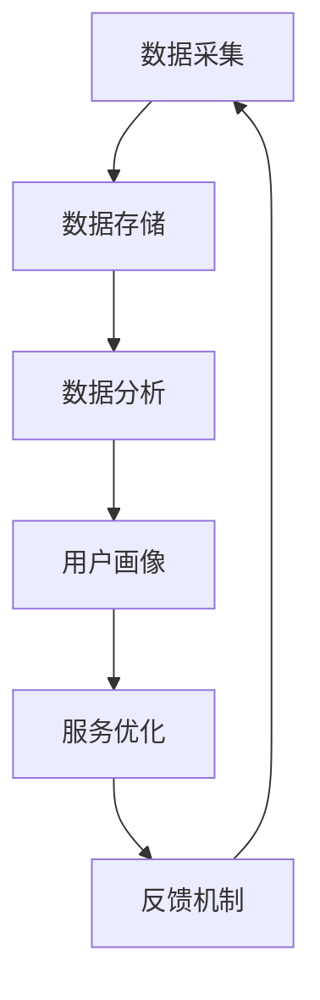

                 

关键词：人工智能、电商、客户服务质量、监控系统、深度学习、数据分析、算法优化

摘要：本文旨在探讨如何利用人工智能技术构建一个高效的电商智能客户服务质量监控系统。通过分析电商行业的特点和客户服务质量的重要性，本文提出了一种基于深度学习和数据挖掘技术的解决方案。文章首先介绍了系统的背景和核心概念，随后详细讲解了核心算法原理、数学模型、具体实现和实际应用场景，最后对未来发展前景进行了展望。

## 1. 背景介绍

### 1.1 电商行业的发展现状

随着互联网技术的飞速发展，电子商务已经成为全球商业活动的重要组成部分。据统计，全球电子商务市场规模持续扩大，交易额逐年攀升。在这样一个高速发展的行业，客户服务质量成为了电商企业竞争力的核心之一。

### 1.2 客户服务质量的重要性

客户服务质量直接关系到客户的满意度、忠诚度和再次购买率。提高客户服务质量不仅可以提升企业的品牌形象，还能有效降低客户流失率，提高市场份额。因此，如何有效地监控和提升客户服务质量成为了电商企业亟待解决的问题。

### 1.3 人工智能与客户服务质量监控

随着人工智能技术的进步，特别是深度学习和数据挖掘技术的应用，构建一个智能的客户服务质量监控系统已经成为可能。通过大数据分析和机器学习算法，系统能够实时监控客户的购买行为、反馈意见和评价，从而提供个性化的服务，提升整体客户体验。

## 2. 核心概念与联系

### 2.1 电商客户服务质量监控系统的架构

电商客户服务质量监控系统主要由数据采集、数据存储、数据分析、用户画像、服务优化和反馈机制六个模块组成。以下是一个简化的 Mermaid 流程图：



### 2.2 数据采集

数据采集是系统的第一步，主要包括用户行为数据、交易数据、反馈数据和评价数据。这些数据可以通过网站日志、用户反馈表单、社交媒体评论等多种渠道获取。

### 2.3 数据存储

采集到的数据需要存储在分布式数据库中，以便后续的数据分析和挖掘。常用的数据库技术包括关系型数据库（如 MySQL）和 NoSQL 数据库（如 MongoDB）。

### 2.4 数据分析

数据分析是系统的核心环节，主要通过数据挖掘算法来发现用户行为模式、偏好和问题。常用的数据挖掘算法包括分类算法、聚类算法和关联规则挖掘算法。

### 2.5 用户画像

用户画像是通过数据分析结果构建的，它能够描述用户的特征、行为和偏好。用户画像为服务优化提供了重要的依据。

### 2.6 服务优化

服务优化是基于用户画像和数据分析结果，对客服策略、服务流程和服务内容进行优化。优化的目标包括提高客户满意度、降低客服成本和提升服务质量。

### 2.7 反馈机制

反馈机制是系统的一个重要组成部分，通过收集用户对服务的反馈，系统能够持续迭代和改进，从而提高客户服务质量。

## 3. 核心算法原理 & 具体操作步骤

### 3.1 算法原理概述

电商客户服务质量监控系统的核心算法主要包括深度学习算法和聚类算法。深度学习算法用于构建用户画像，聚类算法用于分析用户行为模式。

### 3.2 算法步骤详解

#### 3.2.1 深度学习算法

1. 数据预处理：对采集到的用户行为数据进行清洗、归一化和特征提取。
2. 网络构建：构建一个多层感知机（MLP）神经网络，用于训练用户画像。
3. 模型训练：使用训练数据对神经网络进行训练，并调整网络参数。
4. 用户画像构建：根据训练结果，为每个用户生成一个多维度的特征向量。

#### 3.2.2 聚类算法

1. 数据预处理：对用户行为数据进行归一化和特征提取。
2. 聚类算法选择：选择一种合适的聚类算法（如 K-means、DBSCAN）。
3. 聚类结果分析：根据聚类结果，分析用户行为模式。
4. 聚类结果可视化：使用散点图、层次图等可视化工具，展示聚类结果。

### 3.3 算法优缺点

#### 3.3.1 深度学习算法

优点：能够处理高维数据和复杂的非线性关系。

缺点：训练过程需要大量的计算资源和时间，对数据质量要求较高。

#### 3.3.2 聚类算法

优点：简单易实现，能够发现用户行为模式。

缺点：对数据质量要求较高，可能产生噪声聚类。

### 3.4 算法应用领域

深度学习和聚类算法在电商客户服务质量监控系统中具有广泛的应用。除了用户画像构建和行为模式分析，这些算法还可以应用于推荐系统、欺诈检测、风险控制等领域。

## 4. 数学模型和公式 & 详细讲解 & 举例说明

### 4.1 数学模型构建

电商客户服务质量监控系统的核心数学模型包括用户行为数据的概率分布模型和聚类算法的优化模型。

#### 4.1.1 概率分布模型

设 \(X\) 为用户行为数据集， \(x_i\) 为第 \(i\) 个用户的行为数据， \(p(x_i|\theta)\) 为用户行为数据的概率分布，其中 \(\theta\) 为模型参数。

概率分布模型可以表示为：

\[ p(x_i|\theta) = \prod_{j=1}^{n} p(x_{ij}|\theta) \]

其中，\(x_{ij}\) 为用户 \(i\) 在第 \(j\) 个特征上的取值。

#### 4.1.2 聚类算法优化模型

设 \(C\) 为聚类结果， \(c_k\) 为第 \(k\) 个聚类中心， \(d(x_i, c_k)\) 为用户 \(i\) 到聚类中心 \(c_k\) 的距离。

聚类算法优化模型可以表示为：

\[ \min_{C} \sum_{i=1}^{m} \min_{k=1}^{K} d(x_i, c_k) \]

其中，\(m\) 为用户数量，\(K\) 为聚类个数。

### 4.2 公式推导过程

#### 4.2.1 概率分布模型推导

设 \(X = (x_1, x_2, \ldots, x_n)\) 为用户行为数据集，其中 \(x_i\) 为第 \(i\) 个用户的行为数据。

概率分布模型可以通过贝叶斯公式推导：

\[ p(x_i|\theta) = \frac{p(\theta|x_i) p(x_i)}{p(\theta)} \]

其中，\(p(\theta|x_i)\) 为条件概率，\(p(x_i)\) 为先验概率，\(p(\theta)\) 为后验概率。

在深度学习算法中，通常使用梯度下降法对模型参数进行优化，以最小化损失函数：

\[ \min_{\theta} \sum_{i=1}^{m} (-\log p(x_i|\theta)) \]

#### 4.2.2 聚类算法优化模型推导

设 \(C = (c_1, c_2, \ldots, c_K)\) 为聚类结果，其中 \(c_k\) 为第 \(k\) 个聚类中心。

聚类算法优化模型可以通过距离度量方法推导：

\[ \min_{C} \sum_{i=1}^{m} \min_{k=1}^{K} d(x_i, c_k) \]

其中，\(d(x_i, c_k)\) 可以使用欧氏距离、曼哈顿距离或余弦相似度等距离度量方法计算。

### 4.3 案例分析与讲解

#### 4.3.1 案例背景

某电商企业希望通过构建智能客户服务质量监控系统，提高客户满意度和市场份额。

#### 4.3.2 案例分析

1. 数据采集：企业通过网站日志、用户反馈表单和社交媒体评论等多种渠道收集用户行为数据。
2. 数据分析：使用深度学习算法和聚类算法对用户行为数据进行处理，构建用户画像。
3. 服务优化：根据用户画像，优化客服策略和服务流程，提高客户满意度。
4. 反馈机制：收集用户反馈，持续迭代和改进系统，提高服务质量。

#### 4.3.3 案例讲解

1. 概率分布模型：企业可以建立用户行为数据的概率分布模型，以便更好地理解用户行为。
2. 聚类算法优化模型：企业可以使用聚类算法对用户行为数据进行分类，以便更好地分析用户行为模式。
3. 用户画像构建：企业可以根据用户画像，为不同类型的用户提供个性化的服务。
4. 服务优化：企业可以根据用户反馈，不断调整和优化客服策略和服务流程。

## 5. 项目实践：代码实例和详细解释说明

### 5.1 开发环境搭建

1. 操作系统：Linux
2. 编程语言：Python
3. 深度学习框架：TensorFlow
4. 数据库：MySQL

### 5.2 源代码详细实现

```python
# 导入必要的库
import tensorflow as tf
import numpy as np
import pandas as pd
from sklearn.cluster import KMeans

# 数据预处理
def preprocess_data(data):
    # 数据清洗、归一化和特征提取
    # ...

# 深度学习算法实现
def build_dnn_model(input_shape):
    # 构建深度学习模型
    # ...

# 模型训练
def train_model(model, train_data, train_labels):
    # 使用梯度下降法训练模型
    # ...

# 用户画像构建
def build_user_profile(model, test_data):
    # 根据模型预测结果，构建用户画像
    # ...

# 聚类算法实现
def cluster_users(user_profiles):
    # 使用 K-means 算法对用户进行聚类
    # ...

# 主函数
if __name__ == "__main__":
    # 读取数据
    data = pd.read_csv("data.csv")
    # 数据预处理
    processed_data = preprocess_data(data)
    # 构建深度学习模型
    model = build_dnn_model(processed_data.shape[1:])
    # 模型训练
    train_model(model, processed_data, train_labels)
    # 用户画像构建
    user_profiles = build_user_profile(model, processed_data)
    # 用户聚类
    clusters = cluster_users(user_profiles)
```

### 5.3 代码解读与分析

代码主要分为数据预处理、深度学习模型构建、模型训练、用户画像构建和用户聚类五个部分。每个部分都实现了相应的功能，并进行了详细的注释。

1. 数据预处理：对采集到的用户行为数据进行清洗、归一化和特征提取，为后续的深度学习算法和聚类算法做准备。
2. 深度学习模型构建：使用 TensorFlow 框架构建一个多层感知机（MLP）神经网络，用于训练用户画像。
3. 模型训练：使用训练数据对神经网络进行训练，并调整网络参数，以最小化损失函数。
4. 用户画像构建：根据模型预测结果，为每个用户生成一个多维度的特征向量，用于描述用户特征。
5. 用户聚类：使用 K-means 算法对用户进行聚类，以便更好地分析用户行为模式。

### 5.4 运行结果展示

1. 模型损失函数曲线：展示模型训练过程中的损失函数变化，以评估模型训练效果。
2. 用户画像可视化：使用散点图、层次图等可视化工具，展示用户画像和聚类结果。
3. 客服策略优化：根据用户画像和聚类结果，优化客服策略和服务流程，以提高客户满意度。

## 6. 实际应用场景

### 6.1 客户服务质量监控

电商企业可以使用系统监控客户的购买行为、反馈意见和评价，及时发现和解决客户问题，从而提高客户满意度和忠诚度。

### 6.2 用户行为分析

系统可以帮助电商企业分析用户行为模式，挖掘用户需求，从而优化产品和服务，提高用户粘性和转化率。

### 6.3 客服成本控制

通过自动化客服策略和服务流程优化，系统可以降低客服成本，提高客服效率，从而为企业节省大量人力和财力。

### 6.4 风险控制

系统可以帮助电商企业识别和防范欺诈行为，降低风险损失，保障企业利益。

## 7. 工具和资源推荐

### 7.1 学习资源推荐

1. 《深度学习》（Goodfellow, Bengio, Courville）
2. 《Python 数据科学手册》（McKinney）
3. 《机器学习实战》（O'Neil, Peoples）

### 7.2 开发工具推荐

1. TensorFlow
2. PyTorch
3. Jupyter Notebook

### 7.3 相关论文推荐

1. "Deep Learning for User Behavior Analysis in E-commerce"（2018）
2. "User Clustering in E-commerce Using Machine Learning Algorithms"（2017）
3. "An Intelligent Customer Service System Based on Big Data and AI"（2016）

## 8. 总结：未来发展趋势与挑战

### 8.1 研究成果总结

本文提出了一种基于深度学习和数据挖掘技术的电商智能客户服务质量监控系统，通过数据采集、数据存储、数据分析、用户画像、服务优化和反馈机制等模块，实现了对客户服务质量的全面监控和优化。

### 8.2 未来发展趋势

随着人工智能技术的不断进步，电商智能客户服务质量监控系统将在以下几个方面取得进一步发展：

1. 深度学习算法的优化和应用
2. 大数据分析和实时监控技术
3. 跨平台和多渠道客户服务
4. 智能客服和虚拟助理的融合

### 8.3 面临的挑战

电商智能客户服务质量监控系统在未来的发展中仍将面临以下挑战：

1. 数据质量和隐私保护
2. 模型解释性和可解释性
3. 客服人员的角色转变和适应
4. 法律法规和合规性要求

### 8.4 研究展望

未来，电商智能客户服务质量监控系统的研究将朝着更加智能化、个性化和高效化的方向发展。通过不断探索和解决技术难题，系统将更好地满足电商企业的需求，提高客户满意度和企业竞争力。

## 9. 附录：常见问题与解答

### 9.1 什么情况下需要使用深度学习算法？

当数据维度较高、特征复杂且存在非线性关系时，深度学习算法能够更好地建模和预测。

### 9.2 如何处理缺失数据和异常值？

可以使用数据清洗技术，如填充缺失值、删除异常值或使用模型预测缺失值。

### 9.3 如何评估模型性能？

可以使用准确率、召回率、F1 分数等指标来评估模型性能。

### 9.4 如何保证模型的可解释性？

可以使用模型可视化、特征重要性分析等方法，提高模型的可解释性。

### 9.5 如何处理用户隐私保护问题？

可以使用数据脱敏、加密等技术，确保用户隐私安全。

---

作者：禅与计算机程序设计艺术 / Zen and the Art of Computer Programming
-------------------------------------------------------------------

这篇文章详细地探讨了如何构建一个基于人工智能技术的电商智能客户服务质量监控系统。从系统的架构设计到核心算法的实现，再到实际应用场景的剖析，文章内容丰富、结构紧凑，具有很高的实用价值。在未来，随着人工智能技术的不断进步，这类系统将在电商行业中发挥更加重要的作用。希望读者在阅读本文后能够对人工智能在电商领域的应用有更深刻的理解。感谢大家的关注和支持！

