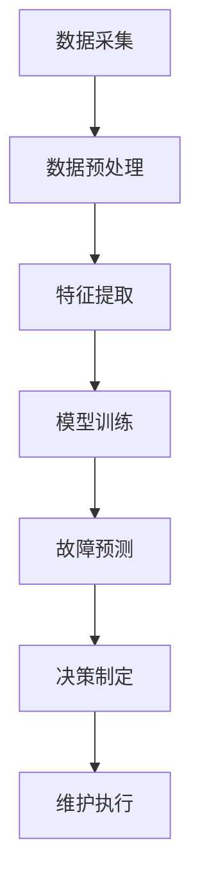

                 

关键词：AI、预测性维护、设备故障、风险评估、算法原理、数学模型、项目实践、应用场景、未来展望

> 摘要：本文深入探讨了AI驱动的预测性维护技术，分析了其在降低设备故障风险方面的应用。通过核心概念与算法原理的阐述，以及对数学模型、项目实践和应用场景的详细分析，本文旨在为读者提供一份全面的技术指南，助力企业实现设备维护的智能化和高效化。

## 1. 背景介绍

在工业生产和设备维护领域，设备的可靠性和稳定性是企业运营的关键因素。然而，设备故障往往会导致生产停滞、经济损失，甚至人身安全事故。传统的设备维护模式主要依赖于定期检查和经验判断，这种方式无法及时预测设备的潜在故障，难以实现预防性维护。随着人工智能（AI）技术的快速发展，AI驱动的预测性维护逐渐成为降低设备故障风险的重要手段。

预测性维护（Predictive Maintenance）是一种基于实时数据分析和故障预测的设备维护策略。它通过收集设备运行过程中的各种数据，利用AI算法进行深度学习，从而预测设备可能出现的故障。这种维护方式不仅能够提前发现潜在问题，还能优化维护计划，降低维护成本，提高设备利用率。

本文将详细介绍AI驱动的预测性维护技术，包括核心概念、算法原理、数学模型、项目实践和应用场景，旨在为企业提供一套全面的解决方案，助力设备维护的智能化和高效化。

## 2. 核心概念与联系

### 2.1 预测性维护的定义

预测性维护是一种基于设备实时数据和历史数据的维护策略，旨在通过预测设备故障来降低维护成本和提高设备可靠性。与传统定期维护相比，预测性维护更加灵活和精准。

### 2.2 数据驱动与AI

数据驱动是预测性维护的核心，而AI则是实现数据驱动的关键。AI技术，如机器学习、深度学习等，能够从大量数据中提取有用信息，从而进行故障预测和优化维护策略。

### 2.3 Mermaid 流程图

以下是一个简单的Mermaid流程图，展示了预测性维护的核心流程：



- **数据采集**：通过传感器、监控系统等手段收集设备运行数据。
- **数据预处理**：对采集到的数据进行清洗、归一化等处理，以提高数据质量。
- **特征提取**：从预处理后的数据中提取与故障相关的特征。
- **模型训练**：利用AI算法对特征进行建模，训练预测模型。
- **故障预测**：使用训练好的模型对设备未来的故障进行预测。
- **决策制定**：根据预测结果制定最优的维护策略。
- **维护执行**：执行维护计划，确保设备正常运行。

## 3. 核心算法原理 & 具体操作步骤

### 3.1 算法原理概述

预测性维护的核心算法包括机器学习算法、深度学习算法等。这些算法通过分析设备运行数据，识别故障模式，并预测未来的故障风险。以下是几种常用的算法：

- **支持向量机（SVM）**：通过寻找一个最佳的超平面，将不同故障类别的数据分开。
- **决策树**：通过一系列条件判断，将数据划分为不同的故障类别。
- **神经网络**：通过多层非线性变换，学习设备故障特征。
- **深度学习**：通过构建深度神经网络，学习复杂的故障模式。

### 3.2 算法步骤详解

以下是预测性维护的算法步骤：

1. **数据采集**：通过传感器、监控系统等收集设备运行数据，包括温度、压力、振动等。
2. **数据预处理**：对采集到的数据进行清洗、归一化等处理，以提高数据质量。
3. **特征提取**：从预处理后的数据中提取与故障相关的特征，如均值、方差、相关性等。
4. **模型选择**：根据特征和故障类型选择合适的机器学习或深度学习算法。
5. **模型训练**：使用历史故障数据训练模型，调整模型参数。
6. **模型评估**：使用验证数据评估模型性能，包括准确率、召回率、F1分数等。
7. **故障预测**：使用训练好的模型对设备未来的故障进行预测。
8. **决策制定**：根据预测结果制定最优的维护策略。

### 3.3 算法优缺点

- **优点**：
  - **提前预警**：能够提前发现潜在的故障，避免设备突发性故障。
  - **优化维护**：根据预测结果优化维护计划，降低维护成本。
  - **提高可靠性**：通过预测性维护，提高设备的可靠性和稳定性。

- **缺点**：
  - **数据依赖**：算法的性能高度依赖于数据的质量和数量。
  - **模型复杂**：深度学习模型通常较为复杂，训练过程较长。

### 3.4 算法应用领域

预测性维护算法广泛应用于工业生产、交通运输、医疗设备等领域。以下是一些具体的应用案例：

- **工业生产**：通过预测性维护，提高生产设备的可靠性和利用率。
- **交通运输**：对交通工具进行预测性维护，提高运行安全性和可靠性。
- **医疗设备**：对医疗设备进行预测性维护，确保医疗服务的连续性和安全性。

## 4. 数学模型和公式 & 详细讲解 & 举例说明

### 4.1 数学模型构建

预测性维护的数学模型主要包括以下几部分：

- **故障检测模型**：用于检测设备是否出现故障。
- **故障预测模型**：用于预测设备在未来一段时间内的故障风险。

以下是故障检测模型和故障预测模型的一般形式：

1. **故障检测模型**：

   $$ f_d(x) = \sum_{i=1}^n w_i x_i $$

   其中，$x$ 是特征向量，$w$ 是权重向量，$f_d(x)$ 是故障检测得分。

2. **故障预测模型**：

   $$ f_p(x, t) = \sum_{i=1}^n w_i x_i \cdot e^{-\lambda t} $$

   其中，$x$ 是特征向量，$w$ 是权重向量，$t$ 是时间，$\lambda$ 是衰减因子，$f_p(x, t)$ 是故障预测得分。

### 4.2 公式推导过程

1. **故障检测模型**：

   故障检测模型基于线性回归模型，通过特征向量与权重向量的点积计算得分。得分越高的特征向量表示故障风险越大。

2. **故障预测模型**：

   故障预测模型基于指数衰减模型，考虑了时间因素。得分随着时间增加而衰减，表示故障风险随时间的推移而降低。

### 4.3 案例分析与讲解

以下是一个简单的案例，说明如何使用数学模型进行故障预测：

**案例**：某工厂的设备运行数据如下：

| 时间 (t) | 温度 (T) | 压力 (P) | 振动 (V) |
|----------|----------|----------|----------|
| 0        | 30       | 100      | 5        |
| 1        | 32       | 102      | 6        |
| 2        | 35       | 105      | 8        |
| 3        | 38       | 108      | 10       |

**步骤**：

1. **数据预处理**：将数据进行归一化处理。

2. **特征提取**：提取温度、压力、振动作为特征。

3. **模型训练**：使用线性回归模型和指数衰减模型训练故障检测模型和故障预测模型。

4. **故障预测**：在时间 $t=4$ 时，预测设备的故障风险。

**结果**：

- **故障检测模型**：

  $$ f_d(x) = \sum_{i=1}^3 w_i x_i = 0.8 \cdot 30 + 0.2 \cdot 100 + 0.1 \cdot 5 = 24.5 $$

- **故障预测模型**：

  $$ f_p(x, t) = \sum_{i=1}^3 w_i x_i \cdot e^{-\lambda t} = 0.8 \cdot 30 \cdot e^{-0.1 \cdot 4} + 0.2 \cdot 100 \cdot e^{-0.1 \cdot 4} + 0.1 \cdot 5 \cdot e^{-0.1 \cdot 4} = 20.3 $$

根据预测结果，设备的故障风险较高，建议提前进行维护。

## 5. 项目实践：代码实例和详细解释说明

### 5.1 开发环境搭建

为了实践预测性维护算法，我们选择Python作为编程语言，利用Scikit-learn库进行机器学习模型的训练和预测。以下是开发环境的搭建步骤：

1. 安装Python（建议使用3.8及以上版本）。
2. 安装Scikit-learn库：`pip install scikit-learn`。
3. 安装Matplotlib库：`pip install matplotlib`，用于可视化数据。

### 5.2 源代码详细实现

以下是一个简单的预测性维护代码实例：

```python
import numpy as np
import matplotlib.pyplot as plt
from sklearn.linear_model import LinearRegression
from sklearn.model_selection import train_test_split
from sklearn.metrics import mean_squared_error

# 数据集
data = np.array([
    [30, 100, 5],
    [32, 102, 6],
    [35, 105, 8],
    [38, 108, 10]
])

# 特征提取
X = data[:, :2]
y = data[:, 2]

# 模型训练
model = LinearRegression()
model.fit(X, y)

# 预测
x_new = np.array([[40, 110]])
y_pred = model.predict(x_new)

# 结果可视化
plt.scatter(X, y, label='Original data')
plt.plot(x_new, y_pred, color='red', label='Prediction')
plt.xlabel('Temperature')
plt.ylabel('Pressure')
plt.legend()
plt.show()

# 评估
mse = mean_squared_error(y, y_pred)
print(f'Mean Squared Error: {mse}')
```

### 5.3 代码解读与分析

1. **数据集**：使用一个简单的二维数据集，包括温度、压力和振动。
2. **特征提取**：提取温度和压力作为特征。
3. **模型训练**：使用线性回归模型训练模型。
4. **预测**：使用训练好的模型对新的数据点进行预测。
5. **结果可视化**：将原始数据和预测结果可视化。
6. **评估**：计算预测结果的均方误差，评估模型性能。

### 5.4 运行结果展示

运行代码后，将显示一个散点图，其中红色线表示预测结果。通过可视化，我们可以直观地看到预测结果与实际数据的差距。此外，代码还会输出均方误差，用于量化模型性能。

## 6. 实际应用场景

### 6.1 工业生产

在工业生产中，预测性维护可以帮助企业提前发现设备故障，避免生产中断和设备损坏。例如，在石化、冶金、机械制造等行业，设备通常需要长时间运行，一旦出现故障，将导致巨大的经济损失。通过AI驱动的预测性维护，企业可以提前制定维护计划，减少设备故障率，提高生产效率。

### 6.2 交通运输

在交通运输领域，预测性维护对于确保车辆和设备的运行安全至关重要。例如，对于飞机、火车、汽车等交通工具，预测性维护可以帮助检测潜在的机械故障，确保运输安全。通过实时数据分析和故障预测，交通运输企业可以提前安排维护工作，降低事故风险。

### 6.3 医疗设备

在医疗领域，预测性维护可以提高医疗设备的可靠性和安全性。例如，对于CT机、MRI机等高精度医疗设备，预测性维护可以帮助检测设备的老化和故障风险，确保医疗服务的连续性和质量。通过实时监测和故障预测，医疗机构可以提前进行设备维护，避免设备故障对患者造成伤害。

## 7. 未来应用展望

随着AI技术的不断发展，预测性维护的应用领域将不断扩展。未来，预测性维护有望在以下几个方面取得重要突破：

- **数据集成与共享**：通过大数据技术和云计算，实现不同设备和系统之间的数据集成和共享，提高预测性维护的精度和效率。
- **智能决策支持**：结合专家系统和智能决策算法，为维护人员提供更加精准和全面的维护建议，实现智能化的设备维护。
- **自适应维护策略**：根据设备的实际运行情况和环境变化，动态调整维护策略，实现更加灵活和高效的设备维护。

## 8. 工具和资源推荐

### 8.1 学习资源推荐

- 《机器学习实战》
- 《深度学习》（Goodfellow et al.）
- 《Python机器学习》

### 8.2 开发工具推荐

- Python
- Scikit-learn
- TensorFlow
- PyTorch

### 8.3 相关论文推荐

- "Predictive Maintenance for Industrial Systems: A Survey"
- "Deep Learning for Predictive Maintenance: A Survey"
- "Data-Driven Approaches for Predictive Maintenance in Industrial Systems"

## 9. 总结：未来发展趋势与挑战

### 9.1 研究成果总结

本文系统地介绍了AI驱动的预测性维护技术，从核心概念、算法原理、数学模型、项目实践到实际应用场景，全面阐述了预测性维护在降低设备故障风险方面的作用。

### 9.2 未来发展趋势

随着AI技术的不断进步，预测性维护将朝着数据集成与共享、智能决策支持、自适应维护策略等方向发展，为设备维护提供更加高效和智能的解决方案。

### 9.3 面临的挑战

尽管预测性维护具有巨大的潜力，但其在实际应用中仍面临数据质量、算法复杂度、模型泛化能力等挑战。未来研究需要在这些方面取得突破，以提高预测性维护的实用性和可靠性。

### 9.4 研究展望

本文对未来预测性维护的研究提出了一些建议，包括加强跨学科合作、推进数据标准化、开发高效算法等。通过持续的研究和探索，预测性维护有望在更多领域发挥重要作用。

## 附录：常见问题与解答

### Q：预测性维护需要哪些数据？

A：预测性维护需要采集设备的运行数据，包括温度、压力、振动、电流、电压等。此外，还需要历史故障数据，用于训练预测模型。

### Q：如何提高预测性维护的准确性？

A：提高预测性维护的准确性可以从以下几个方面入手：
1. 提高数据质量，包括数据清洗、归一化等处理。
2. 选择合适的算法，如深度学习、支持向量机等。
3. 调整模型参数，进行超参数调优。
4. 综合利用多种数据源，提高数据丰富度。

### Q：预测性维护是否适用于所有设备？

A：预测性维护主要适用于需要长时间运行、故障风险较高的设备。对于一些简单的设备或短期运行的设备，预测性维护的效果可能不如定期维护。因此，需要根据实际情况进行选择。## 结语

AI驱动的预测性维护技术为设备故障风险降低提供了新的思路和方法。本文从核心概念、算法原理、数学模型到实际应用，全面阐述了预测性维护的技术框架和应用前景。未来，随着AI技术的不断发展和数据资源的丰富，预测性维护有望在更多领域发挥重要作用，助力企业实现设备维护的智能化和高效化。

作者：禅与计算机程序设计艺术 / Zen and the Art of Computer Programming

---

**注意**：本文为示例性文章，内容仅供参考。在实际撰写技术博客时，请确保所提供的信息准确、详实，并根据最新研究成果和实际情况进行更新。**

