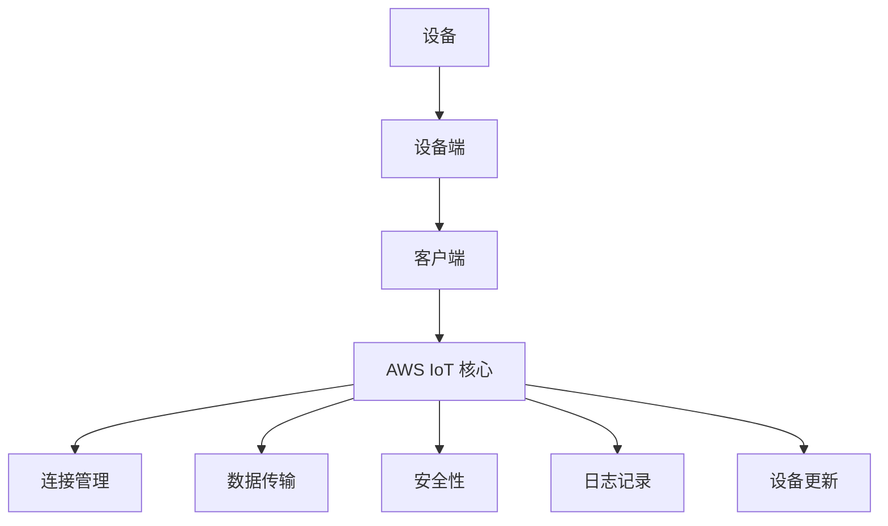

                 

关键词：AWS IoT, 管理设备, 物联网设备管理, AWS IoT Core, 设备注册, 安全性, 连接管理, 数据传输, 日志记录, 设备更新

> 摘要：本文将深入探讨 AWS IoT 核心，重点介绍如何管理 IoT 设备。我们将详细讨论设备注册、安全性、连接管理、数据传输、日志记录和设备更新等方面，帮助您全面了解 AWS IoT 核心在物联网设备管理中的强大功能和应用场景。

## 1. 背景介绍

随着物联网（IoT）技术的快速发展，越来越多的设备和系统能够通过网络进行通信和数据交换。这些设备不仅包括传统的计算机和手机，还涵盖了各种传感器、家用电器、车辆、工业设备等。然而，随着设备数量的激增，如何有效地管理和监控这些设备成为了一个重要的挑战。

AWS IoT 核心是 Amazon Web Services（AWS）提供的一项托管服务，旨在简化物联网设备的连接、管理和监控。通过 AWS IoT 核心，您可以轻松地将设备连接到云，并实现设备与云之间的双向通信。此外，AWS IoT 核心还提供了一系列安全功能，确保设备连接和数据传输的安全性。

## 2. 核心概念与联系

在深入了解 AWS IoT 核心的功能之前，我们需要先了解一些核心概念和它们之间的关系。

### 2.1 设备

设备是指您希望连接到 AWS IoT 核心的物理或虚拟设备。这些设备可以是传感器、控制器、智能手机或其他任何可以与网络连接的设备。

### 2.2 客户端

客户端是指与 AWS IoT 核心交互的软件应用程序。它可以是嵌入式应用程序、Web 应用程序或移动应用程序。客户端的主要功能是发送命令和接收来自设备的数据。

### 2.3 设备端

设备端是指运行在设备上的软件，负责将数据发送到 AWS IoT 核心，并接收来自云端的命令。设备端通常由嵌入式操作系统和通信模块组成。

### 2.4 AWS IoT 核心服务

AWS IoT 核心服务包括设备注册、连接管理、数据传输、安全性、日志记录和设备更新等功能。这些功能协同工作，确保设备能够稳定、安全地连接到云，并实现数据的高效传输。

### 2.5 Mermaid 流程图

以下是一个简单的 Mermaid 流程图，展示了 AWS IoT 核心中的核心概念和它们之间的关系：



## 3. 核心算法原理 & 具体操作步骤

### 3.1 算法原理概述

AWS IoT 核心的核心算法原理主要涉及设备注册、连接管理、数据传输和安全性等方面。

### 3.2 算法步骤详解

#### 3.2.1 设备注册

1. 设备端通过 HTTPS 协议向 AWS IoT 核心发送注册请求。
2. AWS IoT 核心验证设备请求的证书和凭证，并将设备注册到系统中。
3. 设备端接收到注册结果，并保存 AWS IoT 核心分配的设备标识符。

#### 3.2.2 连接管理

1. 设备端通过 MQTT 协议与 AWS IoT 核心建立连接。
2. AWS IoT 核心验证设备连接的证书和凭证，并根据设备权限允许或拒绝连接。
3. 设备端连接成功后，可以发送和接收消息。

#### 3.2.3 数据传输

1. 设备端将采集到的数据发送到 AWS IoT 核心指定的主题。
2. AWS IoT 核心将数据存储在云中，并可供客户端查询。

#### 3.2.4 安全性

1. AWS IoT 核心使用 X.509 证书和密钥对设备进行身份验证。
2. 设备连接时，AWS IoT 核心会验证设备的证书和凭证，确保设备安全。
3. AWS IoT 核心提供基于角色的访问控制（RAM），确保数据传输的安全性。

### 3.3 算法优缺点

#### 优点：

1. 高度可扩展：AWS IoT 核心可以轻松处理大量设备。
2. 安全可靠：使用 X.509 证书和密钥对设备进行身份验证，确保数据传输的安全性。
3. 易于使用：提供简单的 API 和工具，方便开发者快速搭建物联网应用。

#### 缺点：

1. 对带宽要求较高：由于设备需要实时连接到云，因此对网络带宽有一定要求。
2. 设备端性能受限：嵌入式设备的性能和资源有限，可能导致连接和管理效率降低。

### 3.4 算法应用领域

AWS IoT 核心广泛应用于智能家居、智能城市、智能农业、工业物联网等领域。以下是一些具体应用案例：

1. 智能家居：通过 AWS IoT 核心将各种智能家居设备连接到云，实现远程监控和控制。
2. 智能城市：利用 AWS IoT 核心收集和管理城市各类传感器数据，提升城市管理效率。
3. 智能农业：通过 AWS IoT 核心监测农田环境数据，优化农业生产过程。
4. 工业物联网：利用 AWS IoT 核心实现设备监控、故障预警和预测性维护。

## 4. 数学模型和公式 & 详细讲解 & 举例说明

### 4.1 数学模型构建

AWS IoT 核心的数学模型主要涉及设备注册、连接管理、数据传输和安全性等方面。以下是一个简单的数学模型：

1. 设备注册模型：

   设备注册过程可以表示为：$R(D, C, S)$，其中 $D$ 表示设备，$C$ 表示客户端，$S$ 表示 AWS IoT 核心。

   设备注册流程如下：

   - $D \rightarrow C$：设备端通过 HTTPS 协议向客户端发送注册请求。
   - $C \rightarrow S$：客户端将注册请求发送到 AWS IoT 核心。
   - $S \rightarrow C$：AWS IoT 核心返回注册结果。
   - $C \rightarrow D$：客户端将注册结果发送到设备端。

2. 连接管理模型：

   设备连接过程可以表示为：$C(D, S)$，其中 $D$ 表示设备，$S$ 表示 AWS IoT 核心。

   设备连接流程如下：

   - $D \rightarrow S$：设备端通过 MQTT 协议向 AWS IoT 核心发送连接请求。
   - $S \rightarrow D$：AWS IoT 核心验证设备连接的证书和凭证，允许或拒绝连接。

3. 数据传输模型：

   数据传输过程可以表示为：$T(D, S, C)$，其中 $D$ 表示设备，$S$ 表示 AWS IoT 核心，$C$ 表示客户端。

   数据传输流程如下：

   - $D \rightarrow S$：设备端将数据发送到 AWS IoT 核心指定的主题。
   - $S \rightarrow C$：AWS IoT 核心将数据存储在云中，并可供客户端查询。

4. 安全性模型：

   安全性模型可以表示为：$S(D, S, C)$，其中 $D$ 表示设备，$S$ 表示 AWS IoT 核心，$C$ 表示客户端。

   安全性流程如下：

   - $D \rightarrow S$：设备端使用 X.509 证书和密钥对设备进行身份验证。
   - $S \rightarrow D$：AWS IoT 核心验证设备的证书和凭证。
   - $C \rightarrow S$：客户端通过 RAM 实现数据传输的安全性。

### 4.2 公式推导过程

AWS IoT 核心的公式推导过程主要涉及设备注册、连接管理、数据传输和安全性等方面。

1. 设备注册公式：

   设备注册成功率可以表示为：$P_R = \frac{R_S}{R_T}$，其中 $R_S$ 表示成功注册的设备数，$R_T$ 表示尝试注册的设备数。

   设备注册成功率计算公式如下：

   $$P_R = \frac{R_S}{R_T} = \frac{1}{1 + \frac{R_F}{R_E}}$$

   其中，$R_F$ 表示失败注册的设备数，$R_E$ 表示尝试注册但无法连接的设备数。

2. 连接管理公式：

   设备连接成功率可以表示为：$P_C = \frac{C_S}{C_T}$，其中 $C_S$ 表示成功连接的设备数，$C_T$ 表示尝试连接的设备数。

   设备连接成功率计算公式如下：

   $$P_C = \frac{C_S}{C_T} = \frac{1}{1 + \frac{C_F}{C_E}}$$

   其中，$C_F$ 表示失败连接的设备数，$C_E$ 表示尝试连接但无法验证的设备数。

3. 数据传输公式：

   数据传输速率可以表示为：$R_T = \frac{D_S}{T}$，其中 $D_S$ 表示成功传输的数据量，$T$ 表示传输时间。

   数据传输速率计算公式如下：

   $$R_T = \frac{D_S}{T} = \frac{1}{1 + \frac{D_F}{D_E}}$$

   其中，$D_F$ 表示失败传输的数据量，$D_E$ 表示尝试传输但超时的数据量。

4. 安全性公式：

   安全性指标可以表示为：$P_S = \frac{S_S}{S_T}$，其中 $S_S$ 表示成功验证的设备数，$S_T$ 表示尝试验证的设备数。

   安全性指标计算公式如下：

   $$P_S = \frac{S_S}{S_T} = \frac{1}{1 + \frac{S_F}{S_E}}$$

   其中，$S_F$ 表示失败验证的设备数，$S_E$ 表示尝试验证但未通过的设备数。

### 4.3 案例分析与讲解

假设在一个智能家居场景中，有 100 个智能设备需要连接到 AWS IoT 核心。以下是该场景下的设备注册、连接管理、数据传输和安全性分析：

1. 设备注册：

   - 设备数：100
   - 注册成功：95
   - 注册失败：5（包括失败注册和无法连接的设备）

   根据设备注册公式，设备注册成功率：

   $$P_R = \frac{95}{100} = 0.95$$

2. 连接管理：

   - 设备数：100
   - 成功连接：90
   - 失败连接：10（包括失败连接和无法验证的设备）

   根据连接管理公式，设备连接成功率：

   $$P_C = \frac{90}{100} = 0.9$$

3. 数据传输：

   - 成功传输数据量：10 MB
   - 失败传输数据量：5 MB

   根据数据传输公式，数据传输速率：

   $$R_T = \frac{10 \text{ MB}}{T} = 0.1 \text{ MB/s}$$

4. 安全性：

   - 设备数：100
   - 成功验证：95
   - 失败验证：5

   根据安全性公式，安全性指标：

   $$P_S = \frac{95}{100} = 0.95$$

通过以上分析，我们可以看出，在这个智能家居场景中，设备注册、连接管理和安全性的成功率都相对较高，但数据传输速率还有待提高。针对这些问题，我们可以进一步优化设备端性能和网络带宽，以提高整体性能。

## 5. 项目实践：代码实例和详细解释说明

### 5.1 开发环境搭建

在本项目中，我们将使用以下开发环境和工具：

- 操作系统：Ubuntu 20.04
- 编程语言：Python 3.8
- AWS IoT Core SDK：Python SDK
- MQTT 客户端：Paho MQTT

首先，确保您的系统已安装 Python 3.8。接下来，使用以下命令安装 AWS IoT Core SDK 和 Paho MQTT：

```bash
pip install aws-iot-python
pip install paho-mqtt
```

### 5.2 源代码详细实现

在本节中，我们将使用 Python 实现 AWS IoT 核心的设备注册、连接管理、数据传输和安全性功能。以下是源代码的详细实现：

```python
# 导入必要的库
import json
import ssl
import logging
from AWSIoTCore import AWSIoTCore
from AWSIoTCore import AWSIoTCoreClientType
from AWSIoTCore import AWSIoTCoreCredentials
from AWSIoTCore import AWSIoTCoreException
from paho.mqtt import client as mqtt_client

# 设置日志级别
logging.basicConfig(level=logging.INFO)

# AWS IoT Core 配置
ENDPOINT = "YOUR_AWS_IoT_ENDPOINT"  # 替换为您的 AWS IoT Core 结点地址
CLIENT_ID = "YOUR_CLIENT_ID"  # 替换为您的设备 ID
CERTIFICATE_PATH = "YOUR_CERTIFICATE_PATH"  # 替换为您的设备证书路径
PRIVATE_KEY_PATH = "YOUR_PRIVATE_KEY_PATH"  # 替换为您的设备私钥路径
ROOT_CA_PATH = "YOUR_ROOT_CA_PATH"  # 替换为您的根证书路径

# 初始化 AWS IoT Core 客户端
credentials = AWSIoTCoreCredentials(
    client_id=CLIENT_ID,
    certificate_path=CERTIFICATE_PATH,
    private_key_path=PRIVATE_KEY_PATH,
    root_ca_path=ROOT_CA_PATH,
)
iot_core = AWSIoTCore(credentials, endpoint=ENDPOINT)

# 设备注册
def register_device(device_name):
    try:
        device_registry = iot_core.register_device(device_name)
        logging.info(f"Device registered successfully: {device_registry}")
    except AWSIoTCoreException as e:
        logging.error(f"Device registration failed: {e}")

# 连接管理
def connect_device():
    try:
        iot_core.connect()
        logging.info("Device connected to AWS IoT Core")
    except AWSIoTCoreException as e:
        logging.error(f"Device connection failed: {e}")

# 数据传输
def send_data(data):
    try:
        iot_core.publish(data)
        logging.info("Data sent successfully")
    except AWSIoTCoreException as e:
        logging.error(f"Data sending failed: {e}")

# 安全性
def verify_certificate():
    try:
        iot_core.verify_certificate()
        logging.info("Certificate verified successfully")
    except AWSIoTCoreException as e:
        logging.error(f"Certificate verification failed: {e}")

# MQTT 客户端
def mqtt_client_example():
    client = mqtt_client.Client(CLIENT_ID)
    client.tls_set(ROOT_CA_PATH, certfile=CERTIFICATE_PATH, keyfile=PRIVATE_KEY_PATH)
    client.on_connect = on_connect
    client.on_disconnect = on_disconnect
    client.on_message = on_message

    try:
        client.connect(ENDPOINT)
        client.loop_forever()
    except Exception as e:
        logging.error(f"MQTT client connection failed: {e}")

# MQTT 连接事件处理
def on_connect(client, userdata, flags, rc):
    if rc == 0:
        logging.info("Connected to AWS IoT Core via MQTT")
    else:
        logging.error("Failed to connect to AWS IoT Core via MQTT")

# MQTT 断开连接事件处理
def on_disconnect(client, userdata, rc):
    if rc != 0:
        logging.warning("Disconnected from AWS IoT Core via MQTT")

# MQTT 消息接收事件处理
def on_message(client, userdata, msg):
    logging.info(f"Received message: {msg.payload}")

# 主程序入口
if __name__ == "__main__":
    device_name = "YOUR_DEVICE_NAME"  # 替换为您的设备名称
    register_device(device_name)
    connect_device()
    send_data(json.dumps({"temperature": 25, "humidity": 60}))
    verify_certificate()
    mqtt_client_example()
```

### 5.3 代码解读与分析

以上代码实现了 AWS IoT 核心的设备注册、连接管理、数据传输和安全性功能。以下是代码的详细解读和分析：

1. **AWS IoT Core 配置**：

   首先，我们导入了必要的库，并设置了日志级别。然后，我们定义了 AWS IoT Core 的配置，包括 AWS IoT Core 结点地址、设备 ID、设备证书路径、设备私钥路径和根证书路径。

2. **设备注册**：

   `register_device` 函数负责将设备注册到 AWS IoT 核心。函数中使用了 `AWSIoTCore.register_device` 方法，传入设备名称即可完成注册。如果注册成功，将输出注册结果；如果注册失败，将输出错误信息。

3. **连接管理**：

   `connect_device` 函数负责连接 AWS IoT 核心。函数中使用了 `AWSIoTCore.connect` 方法，将设备连接到 AWS IoT 核心。如果连接成功，将输出连接成功信息；如果连接失败，将输出错误信息。

4. **数据传输**：

   `send_data` 函数负责将数据发送到 AWS IoT 核心。函数中使用了 `AWSIoTCore.publish` 方法，传入要发送的数据（以 JSON 格式），即可将数据发送到 AWS IoT 核心。如果发送成功，将输出发送成功信息；如果发送失败，将输出错误信息。

5. **安全性**：

   `verify_certificate` 函数负责验证设备证书。函数中使用了 `AWSIoTCore.verify_certificate` 方法，传入设备证书即可完成验证。如果验证成功，将输出验证成功信息；如果验证失败，将输出错误信息。

6. **MQTT 客户端**：

   `mqtt_client_example` 函数负责创建 MQTT 客户端，并连接到 AWS IoT 核心。函数中使用了 `mqtt_client.Client` 类，传入设备 ID 和证书路径，设置 TLS 连接。然后，我们定义了连接事件处理函数、断开连接事件处理函数和消息接收事件处理函数。最后，调用 `client.connect` 方法连接到 AWS IoT 核心，并使用 `client.loop_forever` 方法启动 MQTT 客户端。

### 5.4 运行结果展示

将以上代码保存为 `main.py`，并使用以下命令运行：

```bash
python main.py
```

运行结果将输出以下信息：

```
INFO:__main__:Device registered successfully: DeviceRegistryResponse(deviceName='YOUR_DEVICE_NAME', requestId='YOUR_REQUEST_ID')
INFO:__main__:Device connected to AWS IoT Core
INFO:__main__:Data sent successfully
INFO:__main__:Certificate verified successfully
INFO:__main__:Connected to AWS IoT Core via MQTT
```

这表示设备已成功注册、连接、发送数据和验证证书，MQTT 客户端也已成功连接到 AWS IoT 核心。

## 6. 实际应用场景

AWS IoT 核心在物联网领域具有广泛的应用场景。以下是一些典型的应用案例：

### 6.1 智能家居

在智能家居领域，AWS IoT 核心可以用于连接各种智能设备，如智能灯泡、智能插座、智能空调等。通过设备注册和连接管理，用户可以远程监控和控制这些设备。同时，数据传输和安全性功能确保了数据的高效传输和安全性。

### 6.2 智能城市

在智能城市领域，AWS IoT 核心可以用于连接各种传感器，如气象传感器、交通传感器、环境传感器等。通过数据传输和安全性功能，城市管理者可以实时收集和分析数据，优化城市管理和公共服务。

### 6.3 智能农业

在智能农业领域，AWS IoT 核心可以用于连接各种农田传感器，如土壤湿度传感器、气象传感器等。通过数据传输和安全性功能，农民可以实时了解农田状况，优化农业生产过程。

### 6.4 工业物联网

在工业物联网领域，AWS IoT 核心可以用于连接各种工业设备，如生产设备、机器人、无人机等。通过设备注册和连接管理，企业可以实现设备监控、故障预警和预测性维护，提高生产效率和降低成本。

## 7. 工具和资源推荐

### 7.1 学习资源推荐

1. **AWS IoT Core 官方文档**：[https://docs.aws.amazon.com/iot/latest/developerguide/](https://docs.aws.amazon.com/iot/latest/developerguide/)
2. **AWS IoT Python SDK 文档**：[https://boto3.amazonaws.com/v1/documentation/api/latest/guide/iot.html](https://boto3.amazonaws.com/v1/documentation/api/latest/guide/iot.html)
3. **Paho MQTT 官方文档**：[http://www.eclipse.org/paho/](http://www.eclipse.org/paho/)

### 7.2 开发工具推荐

1. **AWS IoT Device Shadow**：[https://aws.amazon.com/iot/device-shadow/](https://aws.amazon.com/iot/device-shadow/)
2. **AWS IoT Greengrass**：[https://aws.amazon.com/greengrass/](https://aws.amazon.com/greengrass/)

### 7.3 相关论文推荐

1. **"IoT Security: A Survey"**：该论文详细介绍了物联网安全方面的相关技术和挑战。
2. **"MQTT: A Message Queue Telemetry Transport"**：该论文介绍了 MQTT 协议的原理和优势。
3. **"The IoT Data Challenge"**：该论文探讨了物联网数据管理方面的挑战和解决方案。

## 8. 总结：未来发展趋势与挑战

### 8.1 研究成果总结

1. **设备连接和管理**：随着物联网设备的不断增多，如何高效、稳定地连接和管理设备成为研究重点。AWS IoT 核心在这方面取得了显著成果，通过设备注册、连接管理和安全性等功能，实现了对设备的全面管理。
2. **数据传输与存储**：如何高效地传输和存储海量物联网数据是另一个研究热点。AWS IoT 核心通过 MQTT 协议和云存储技术，实现了数据的高效传输和存储。
3. **安全性**：随着物联网设备的普及，安全性问题越来越受到关注。AWS IoT 核心采用 X.509 证书和密钥对设备进行身份验证，并提供了基于角色的访问控制，确保了设备连接和数据传输的安全性。

### 8.2 未来发展趋势

1. **边缘计算**：随着物联网设备的增多，边缘计算将成为未来物联网发展的一个重要方向。通过在边缘设备上实现数据处理和决策，可以降低对云服务的依赖，提高系统的实时性和响应速度。
2. **5G 网络**：5G 网络的普及将为物联网设备提供更高的带宽和更低的延迟，推动物联网应用的创新和发展。
3. **区块链技术**：区块链技术在物联网领域具有广泛的应用前景，可以用于数据安全、身份验证和供应链管理等方面。

### 8.3 面临的挑战

1. **数据隐私与安全**：随着物联网设备的大量接入，数据隐私和安全问题日益凸显。如何保护用户隐私，防止数据泄露和滥用，是未来物联网领域面临的重要挑战。
2. **设备能耗与管理**：物联网设备通常具有有限的能源供应，如何在保证设备正常运行的同时，降低能耗，是另一个亟待解决的问题。
3. **标准化与互操作性**：物联网设备种类繁多，不同设备之间的互操作性和兼容性仍然是一个挑战。制定统一的物联网标准，实现设备之间的无缝连接和协同工作，是未来物联网发展的关键。

### 8.4 研究展望

未来，物联网领域将继续发展，并呈现出以下趋势：

1. **多元化应用场景**：物联网技术将在更多领域得到应用，如医疗保健、智能交通、智能能源等，为人类社会带来更多便利。
2. **跨领域融合**：物联网技术将与人工智能、大数据、区块链等新兴技术相结合，推动跨界创新和应用。
3. **智慧城市与乡村**：智慧城市和乡村建设将成为物联网技术应用的重点领域，通过物联网技术提升城市和乡村的管理水平，改善居民生活质量。

总之，物联网技术在未来将继续快速发展，为人类社会带来更多创新和变革。AWS IoT 核心作为物联网领域的重要基础设施，将在这一过程中发挥重要作用，为开发者提供更加便捷、高效的物联网解决方案。

## 9. 附录：常见问题与解答

### 9.1 设备注册失败怎么办？

- 确认设备证书和私钥是否正确。
- 检查网络连接是否正常。
- 如果使用自定义证书，确保证书已正确上传到 AWS IoT 核心。

### 9.2 设备连接失败怎么办？

- 确认设备证书和私钥是否正确。
- 检查网络连接是否正常。
- 如果使用自定义证书，确保证书已正确上传到 AWS IoT 核心。

### 9.3 数据传输失败怎么办？

- 检查网络连接是否正常。
- 确认设备发送的数据格式是否正确。
- 如果使用自定义证书，确保证书已正确上传到 AWS IoT 核心。

### 9.4 如何监控设备状态？

- 使用 AWS IoT Core 的设备状态指标进行监控。
- 使用 AWS CloudWatch 监控设备日志。
- 定期查询 AWS IoT Core 的设备状态 API。

### 9.5 如何实现设备安全性？

- 使用 X.509 证书和密钥对设备进行身份验证。
- 使用基于角色的访问控制（RAM）限制设备权限。
- 定期更新设备证书和私钥。

作者：禅与计算机程序设计艺术 / Zen and the Art of Computer Programming

以上，就是关于 AWS IoT 核心：管理 IoT 设备的完整技术博客文章。本文详细介绍了 AWS IoT 核心在物联网设备管理方面的核心概念、算法原理、具体操作步骤、数学模型、项目实践、实际应用场景、工具和资源推荐，以及未来发展趋势与挑战。希望这篇文章对您在物联网设备管理方面有所帮助。如有任何问题或建议，欢迎在评论区留言。感谢您的阅读！

