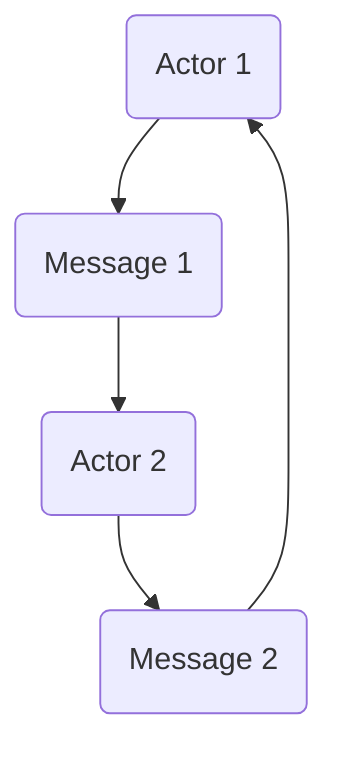
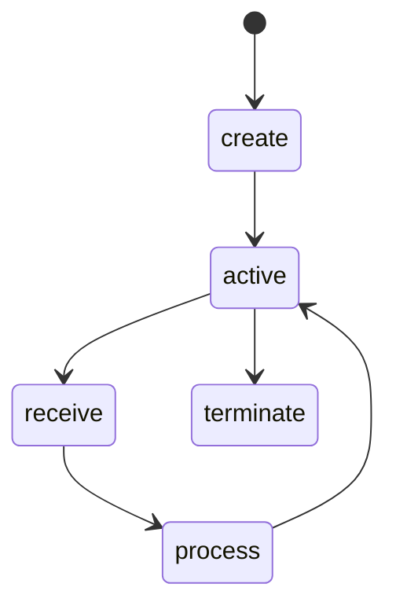
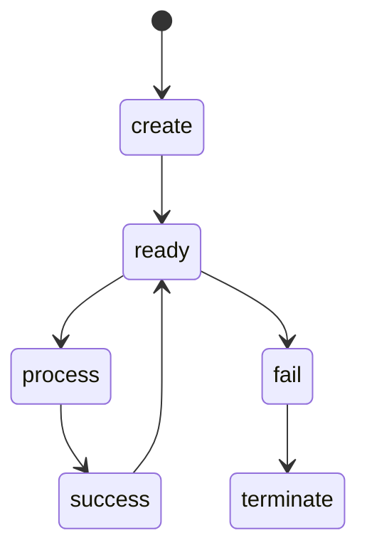

                 

关键词：Actor Model，并发编程，异步通信，消息传递，并发系统，并发算法，性能优化，分布式系统

> 摘要：本文将深入探讨Actor Model的核心原理及其在并发编程中的应用。通过详细讲解Actor Model的基本概念、架构设计、数学模型和代码实例，读者将掌握如何利用Actor Model构建高性能、可扩展的并发系统。文章还将探讨Actor Model在分布式系统中的应用前景和面临的挑战，为未来的研究提供方向。

## 1. 背景介绍

并发编程是现代计算机科学中一个至关重要的领域，尤其在分布式系统和高性能计算中。传统的并发编程模型如线程和进程往往面临着复杂度高、同步困难、死锁等问题。为了解决这些问题，研究人员提出了许多新的并发编程模型，其中Actor Model因其简洁性和高效性受到了广泛关注。

### 1.1 并发编程的挑战

并发编程面临的主要挑战包括：

1. **死锁**：当多个进程或线程相互等待对方持有的资源时，系统可能会进入死锁状态，导致整个系统瘫痪。
2. **竞态条件**：多个线程访问共享资源时，如果没有正确的同步机制，可能导致不可预知的结果。
3. **锁竞争**：线程为了获取锁而陷入长时间的等待，降低系统性能。
4. **资源管理**：在多线程环境下管理资源（如内存和文件）变得复杂。

### 1.2 Actor Model的兴起

Actor Model由Carl Hewitt在1973年提出，旨在解决传统并发编程模型中的问题。Actor Model基于消息传递和独立计算单元（即Actor）的概念，使得并发编程变得更加简单和高效。

### 1.3 目标读者

本文面向对并发编程和分布式系统有一定了解的读者，希望读者能够：

1. 理解Actor Model的基本概念和核心原理。
2. 掌握如何使用Actor Model进行并发编程。
3. 了解Actor Model在分布式系统中的应用。

## 2. 核心概念与联系

### 2.1 Actor Model基础概念

**Actor**：Actor是并发编程中的基本计算单元，它可以独立运行、发送和接收消息。每个Actor有自己的状态和行为，且这些状态和行为在内部是私有的，外部无法直接访问。

**消息传递**：Actor之间的通信通过消息传递实现。当一个Actor需要与其他Actor交互时，它会发送一条消息给目标Actor，然后继续执行自己的任务，而无需等待响应。

**独立计算**：每个Actor是独立计算的，即使一个Actor发生故障，也不会影响其他Actor的运行。

**并发性**：多个Actor可以同时运行，每个Actor独立处理其收到的消息。

### 2.2 架构设计

Actor Model的架构设计非常简洁，主要由以下部分组成：

1. **Actor网络**：多个Actor通过网络连接形成一个大的并发计算网络。
2. **消息传递系统**：负责在Actor之间传递消息。
3. **调度器**：负责调度Actor的执行，确保每个Actor都能公平地获取CPU时间。

### 2.3 Mermaid流程图

以下是一个简单的Mermaid流程图，展示了Actor Model的基本架构和核心概念：



在这个流程图中，A和C是两个Actor，它们通过发送和接收消息进行通信。

## 3. 核心算法原理 & 具体操作步骤

### 3.1 算法原理概述

Actor Model的核心算法原理是基于消息传递和独立计算。每个Actor独立处理其收到的消息，并根据消息内容更新自身状态。这种独立计算和异步通信的方式避免了传统并发编程中的死锁、竞态条件和锁竞争等问题。

### 3.2 算法步骤详解

1. **创建Actor**：首先需要创建Actor实例，每个Actor都有自己的唯一标识和初始状态。
2. **发送消息**：当一个Actor需要与其他Actor交互时，它会通过消息传递系统发送一条消息给目标Actor。
3. **处理消息**：接收到消息的Actor会根据消息内容更新自身状态并执行相应的操作。
4. **状态更新**：每个Actor在处理消息后都会更新自身状态，以便在下一次接收消息时使用。
5. **循环执行**：每个Actor会持续接收消息并处理，直到系统停止。

### 3.3 算法优缺点

**优点**：

1. **简单性**：Actor Model的架构设计简洁，使得并发编程变得容易。
2. **高效性**：Actor Model通过异步通信和独立计算提高了系统的性能。
3. **可靠性**：由于每个Actor都是独立运行的，即使某个Actor发生故障，也不会影响其他Actor的运行。

**缺点**：

1. **性能开销**：消息传递系统会带来一定的性能开销，特别是在高负载情况下。
2. **资源限制**：某些Actor Model实现可能对Actor的数量有限制，导致系统可扩展性受限。

### 3.4 算法应用领域

Actor Model适用于以下场景：

1. **分布式系统**：通过将任务分解为多个Actor，可以轻松构建分布式系统。
2. **高性能计算**：利用Actor Model可以构建高效并行计算系统。
3. **实时系统**：Actor Model的异步通信方式使得实时系统设计更加简单和可靠。

## 4. 数学模型和公式 & 详细讲解 & 举例说明

### 4.1 数学模型构建

在Actor Model中，我们可以使用状态转移图（State Transition Graph）来描述Actor的状态和行为。以下是一个简单的状态转移图示例：



在这个状态转移图中，每个状态表示Actor的一个状态，箭头表示状态之间的转移。状态转移由接收到的消息触发。

### 4.2 公式推导过程

假设一个Actor在其生命周期内经历了多个状态转移，我们可以使用以下公式来计算Actor的平均响应时间：

$$
\text{平均响应时间} = \frac{\sum_{i=1}^{n} (\text{状态持续时间} \times \text{状态出现次数})}{n}
$$

其中，$n$ 是状态转移的总次数，$\text{状态持续时间}$ 和 $\text{状态出现次数}$ 分别表示每个状态在生命周期中的持续时间和出现次数。

### 4.3 案例分析与讲解

假设有一个银行系统，其中一个关键功能是处理交易。我们可以将交易处理模块设计为一个Actor，其状态转移图如下：



在这个状态转移图中，Actor的初始状态是create，随后进入ready状态，等待接收交易消息。当接收到交易消息后，Actor会进入process状态，处理交易。如果交易成功，Actor会进入success状态，并重新变为ready状态；如果交易失败，Actor会进入fail状态，并最终终止。

根据上述状态转移图，我们可以使用以下公式计算该Actor的平均响应时间：

$$
\text{平均响应时间} = \frac{(\text{ready状态持续时间} \times 2) + (\text{process状态持续时间} \times 1) + (\text{fail状态持续时间} \times 1)}{4}
$$

其中，$\text{ready状态持续时间}$、$\text{process状态持续时间}$ 和 $\text{fail状态持续时间}$ 分别表示每个状态在生命周期中的持续时间。

## 5. 项目实践：代码实例和详细解释说明

### 5.1 开发环境搭建

在本节中，我们将使用Erlang编程语言来演示Actor Model的代码实例。Erlang是一种用于构建并发系统的编程语言，内置了Actor Model的支持。

1. **安装Erlang**：首先，从Erlang官方网站下载并安装Erlang/OTP环境。
2. **配置环境变量**：确保Erlang的安装路径添加到系统的环境变量中。
3. **启动Erlang shell**：在命令行中输入 `erl` 命令，启动Erlang shell。

### 5.2 源代码详细实现

以下是一个简单的Erlang代码实例，展示了如何创建和发送消息给Actor：

```erlang
% actor.erl
-module(actor).
-export([start/0, receive_message/1, process/1]).

start() ->
    register(my_actor, spawn(actor, process, [])).

receive_message(Msg) ->
    my_actor ! Msg.

process(_) ->
    receive
        Msg ->
            io:format("Received message: ~p~n", [Msg]),
            process(Msg)
    end.
```

这个模块定义了一个名为 `actor` 的Actor，它包含以下功能：

- `start/0`：启动Actor并注册一个进程名。
- `receive_message/1`：接收消息并转发给Actor。
- `process/1`：处理接收到的消息。

### 5.3 代码解读与分析

在这个代码实例中，我们首先定义了一个名为 `actor` 的模块，该模块导出了三个函数。`start/0` 函数使用 `spawn/3` 函数创建一个新的进程，并将其注册为一个名为 `my_actor` 的全局进程名。这样，其他模块可以通过进程名来发送消息给Actor。

`receive_message/1` 函数接收一个消息并将其发送给Actor。这通过使用 `!` 运算符实现，该运算符用于向指定的进程发送消息。

`process/1` 函数是Actor的核心处理逻辑。它使用 `receive` 语句来等待接收消息，并在接收到消息后将其打印出来，并继续执行。这个过程会一直持续，直到Actor被停止。

### 5.4 运行结果展示

在Erlang shell中，我们可以启动Actor并测试消息传递功能：

```erlang
1> c(actor).
{ok,actor}
2> actor:start().
{ok,my_actor}
3> actor:receive_message("Hello, World!").
Received message: "Hello, World!"
```

这个示例展示了如何启动Actor、发送消息以及处理接收到的消息。通过这个简单的实例，我们可以看到Actor Model的基本原理是如何应用于实际编程的。

## 6. 实际应用场景

### 6.1 分布式系统

在分布式系统中，Actor Model提供了强大的并发性和容错性。通过将任务分解为多个Actor，可以轻松构建可扩展的分布式系统。例如，在分布式数据库中，每个数据节点可以看作是一个Actor，负责处理本地数据存储和查询请求。

### 6.2 实时系统

在实时系统中，Actor Model的异步通信特性使其非常适合处理高频率的事件处理。例如，在实时金融交易系统中，可以使用Actor Model来处理大量的交易请求，确保系统的高效和可靠。

### 6.3 高性能计算

在并行计算领域，Actor Model通过将任务分解为多个Actor，可以充分利用多核处理器的性能。例如，在图像处理和科学计算中，可以使用Actor Model来并行处理大量数据，提高计算效率。

### 6.4 未来应用展望

随着云计算和物联网的兴起，Actor Model在分布式系统和实时系统中的应用前景将更加广阔。未来，Actor Model有望在智能交通、智能医疗、智能城市等领域发挥重要作用，为构建高效、可靠和智能的下一代系统提供有力支持。

## 7. 工具和资源推荐

### 7.1 学习资源推荐

1. **《Actor Model: A Brief Introduction》**：由Simon Marlow撰写的简明介绍Actor Model的电子书。
2. **Erlang官方文档**：提供Erlang语言和Actor Model的详细文档和教程。
3. **《Concurrent Programming in Erlang》**：由Robert Virding和Arjuna S. Murthy撰写的关于Erlang和Actor Model的经典书籍。

### 7.2 开发工具推荐

1. **Erlang/OTP**：Erlang的官方发行版，包括Actor Model的实现。
2. **Eclipse Paho**：Eclipse基金会提供的开源消息传递客户端库，支持Actor Model的消息传递功能。

### 7.3 相关论文推荐

1. **“The Actor Model of Concurrency”**：由Carl Hewitt撰写的Actor Model的奠基性论文。
2. **“Efficient Dynamic Software Updates”**：由Robert Virding和Cliff Click等人在Erlang中实现动态更新的论文。

## 8. 总结：未来发展趋势与挑战

### 8.1 研究成果总结

自Actor Model提出以来，已在分布式系统、实时系统和并行计算等领域取得了显著成果。通过消息传递和独立计算，Actor Model解决了传统并发编程中的许多问题，如死锁、竞态条件和锁竞争等。

### 8.2 未来发展趋势

1. **性能优化**：随着硬件性能的提升，对Actor Model的性能优化将成为研究重点。
2. **标准化**：制定统一的Actor Model标准，以促进不同语言和平台之间的互操作性。
3. **安全性**：研究如何在Actor Model中实现更高效的安全保障。

### 8.3 面临的挑战

1. **消息传递开销**：在高负载情况下，消息传递可能会成为性能瓶颈。
2. **可扩展性**：如何在大型系统中实现Actor Model的可扩展性，仍需进一步研究。

### 8.4 研究展望

随着云计算、物联网和大数据等领域的快速发展，Actor Model在未来仍将发挥重要作用。通过不断优化和改进，Actor Model有望在构建高效、可靠和智能的下一代系统中发挥更大作用。

## 9. 附录：常见问题与解答

### Q：什么是Actor Model？

A：Actor Model是一种并发编程模型，基于消息传递和独立计算单元（Actor）的概念。每个Actor都有自己的状态和行为，且这些状态和行为在内部是私有的，外部无法直接访问。Actor之间通过消息传递进行通信，这种方式避免了传统并发编程中的许多问题。

### Q：Actor Model有哪些优点？

A：Actor Model的主要优点包括：

1. **简单性**：Actor Model的架构设计简洁，使得并发编程变得容易。
2. **高效性**：通过异步通信和独立计算提高了系统的性能。
3. **可靠性**：每个Actor都是独立计算的，即使某个Actor发生故障，也不会影响其他Actor的运行。

### Q：Actor Model有哪些缺点？

A：Actor Model的主要缺点包括：

1. **性能开销**：消息传递系统会带来一定的性能开销，特别是在高负载情况下。
2. **资源限制**：某些Actor Model实现可能对Actor的数量有限制，导致系统可扩展性受限。

### Q：Actor Model适用于哪些场景？

A：Actor Model适用于以下场景：

1. **分布式系统**：通过将任务分解为多个Actor，可以轻松构建分布式系统。
2. **实时系统**：适合处理高频率的事件处理。
3. **高性能计算**：通过将任务分解为多个Actor，可以充分利用多核处理器的性能。

