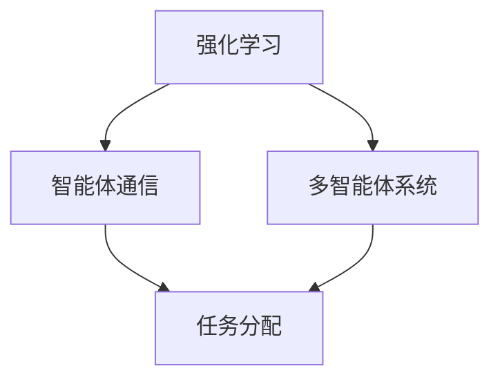

                 

关键词：Agent Theory, ReAct Model, Artificial Intelligence, Reinforcement Learning, Autonomous Agents, Multi-Agent Systems

> 摘要：本文深入探讨了Agent理论基础中的ReAct模型，详细介绍了其核心概念、算法原理、数学模型和实际应用。通过对比分析，本文揭示了ReAct模型在人工智能领域的优势与局限，并对未来发展趋势进行了展望。

## 1. 背景介绍

随着人工智能技术的发展，自主智能体（Autonomous Agents）在多领域得到了广泛应用。这些智能体能够自主地感知环境、决策并采取行动，以实现特定目标。在多智能体系统中，智能体之间的交互和协作尤为重要，这需要有效的模型来指导其行为。ReAct模型作为一种先进的多智能体交互模型，在近年来引起了广泛关注。

ReAct模型的全称是“Reinforcement Learning-based Agent Communication and Task Allocation”（基于强化学习的智能体通信与任务分配）。它结合了强化学习和多智能体系统的理论，旨在解决智能体之间的协调与协作问题。ReAct模型的核心在于通过奖励机制来激励智能体采取有益于整体系统目标的行为，同时通过通信机制实现智能体间的信息共享和协作。

## 2. 核心概念与联系

### 2.1 Reinforcement Learning（强化学习）

强化学习是一种机器学习方法，它通过奖励机制来驱动智能体学习如何在一个环境中采取行动，以达到某种目标。在ReAct模型中，强化学习用于指导智能体的行为决策，使其能够自适应地适应动态变化的环境。

### 2.2 Multi-Agent Systems（多智能体系统）

多智能体系统由多个智能体组成，这些智能体可以在同一环境中独立或协作地执行任务。在ReAct模型中，多智能体系统通过智能体间的通信和协作来实现共同的目标。

### 2.3 Agent Communication（智能体通信）

智能体通信是指智能体之间通过传递信息和消息来交流知识和意图。在ReAct模型中，智能体通信是实现协同工作的关键，它能够帮助智能体更好地理解彼此的状态和行为。

### 2.4 Task Allocation（任务分配）

任务分配是指将系统中的任务合理地分配给各个智能体，以最大化系统的整体效益。在ReAct模型中，任务分配通过智能体之间的竞争和协商来实现，以适应环境的变化和任务需求。

### 2.5 Mermaid 流程图

以下是一个简化的ReAct模型流程图，展示了核心概念之间的联系：



## 3. 核心算法原理 & 具体操作步骤

### 3.1 算法原理概述

ReAct模型的核心算法基于强化学习。在强化学习过程中，智能体通过不断地与环境交互，根据当前状态选择最佳动作，并通过奖励信号来评估动作的效果。智能体不断优化其行为策略，以最大化长期累积奖励。

### 3.2 算法步骤详解

1. 初始化：设定智能体的初始状态、行为策略和奖励函数。
2. 感知环境：智能体通过传感器感知环境状态。
3. 选择动作：智能体根据当前状态和行为策略选择最佳动作。
4. 执行动作：智能体执行所选动作。
5. 收集奖励：环境根据智能体的动作给予奖励信号。
6. 更新策略：智能体根据奖励信号更新行为策略。
7. 迭代：重复步骤2至6，直至达到预期目标。

### 3.3 算法优缺点

**优点：**
- 强调了智能体之间的通信和协作，能够实现高效的任务分配。
- 结合了强化学习，能够自适应地调整智能体的行为策略。

**缺点：**
- 对环境的动态变化适应性较差。
- 需要大量的计算资源和时间来训练智能体。

### 3.4 算法应用领域

ReAct模型在多个领域得到了应用，包括但不限于：
- 自动驾驶：智能体之间的通信和协作对于自动驾驶系统的安全性和效率至关重要。
- 虚拟现实：智能体可以协同工作，为用户提供更加丰富的虚拟现实体验。
- 网络安全：智能体可以实时监控网络环境，并采取相应的措施来抵御攻击。

## 4. 数学模型和公式 & 详细讲解 & 举例说明

### 4.1 数学模型构建

ReAct模型的数学模型主要包括状态空间、动作空间、奖励函数和策略。

- 状态空间（S）：描述环境的状态。
- 动作空间（A）：描述智能体可执行的动作。
- 奖励函数（R）：描述智能体执行动作后获得的奖励。
- 策略（π）：描述智能体在特定状态下的动作选择。

### 4.2 公式推导过程

强化学习的基本公式为：

$$
Q(s, a) = \sum_{s'} p(s' | s, a) \cdot [R(s', a) + \gamma \cdot \max_{a'} Q(s', a')]
$$

其中，$Q(s, a)$ 表示在状态s下执行动作a的期望回报，$p(s' | s, a)$ 表示在状态s下执行动作a后转移到状态s'的概率，$R(s', a)$ 表示在状态s'下执行动作a获得的奖励，$\gamma$ 表示折扣因子，$\max_{a'} Q(s', a')$ 表示在状态s'下选择最佳动作。

### 4.3 案例分析与讲解

假设有一个由两个智能体组成的系统，它们需要在同一个环境中收集资源。每个智能体都有两种动作：前进和后退。环境中的每个位置都有一个资源值，智能体通过感知环境状态来选择最佳动作。

假设状态空间为 $S = \{s_1, s_2\}$，动作空间为 $A = \{a_1, a_2\}$，奖励函数为 $R(s, a) = 1$ 当 $a = a_1$，$R(s, a) = -1$ 当 $a = a_2$。智能体的策略为 $\pi(s) = a_1$ 当 $s = s_1$，$\pi(s) = a_2$ 当 $s = s_2$。

根据上述公式，我们可以计算出每个状态下的期望回报：

$$
Q(s_1, a_1) = \sum_{s'} p(s' | s_1, a_1) \cdot [R(s', a_1) + \gamma \cdot \max_{a'} Q(s', a')]
$$

$$
Q(s_1, a_2) = \sum_{s'} p(s' | s_1, a_2) \cdot [R(s', a_2) + \gamma \cdot \max_{a'} Q(s', a')]
$$

$$
Q(s_2, a_1) = \sum_{s'} p(s' | s_2, a_1) \cdot [R(s', a_1) + \gamma \cdot \max_{a'} Q(s', a')]
$$

$$
Q(s_2, a_2) = \sum_{s'} p(s' | s_2, a_2) \cdot [R(s', a_2) + \gamma \cdot \max_{a'} Q(s', a')]
$$

通过迭代更新，智能体的策略会逐渐优化，使其能够在不同的状态选择最佳动作。

## 5. 项目实践：代码实例和详细解释说明

### 5.1 开发环境搭建

为了实现ReAct模型，我们选择Python作为编程语言，并使用以下工具和库：
- Python 3.x
- TensorFlow
- Keras

### 5.2 源代码详细实现

以下是一个简化的ReAct模型实现，用于两个智能体在环境中的资源收集：

```python
import numpy as np
import tensorflow as tf
from tensorflow.keras import layers

# 状态空间大小
state_size = 2
# 动作空间大小
action_size = 2
# 折扣因子
gamma = 0.9
# 学习率
learning_rate = 0.1

# 智能体模型
model = tf.keras.Sequential([
    layers.Dense(32, activation='relu', input_shape=(state_size,)),
    layers.Dense(32, activation='relu'),
    layers.Dense(action_size, activation='linear')
])

model.compile(loss='mse', optimizer=tf.optimizers.Adam(learning_rate))

# 奖励函数
def reward_function(state, action):
    if action == 1:
        return 1 if state == 1 else -1
    else:
        return -1 if state == 0 else 1

# 环境模拟
def environment(state):
    # 模拟环境状态变化
    return np.random.randint(0, 2)

# 训练智能体
for episode in range(1000):
    state = np.random.randint(0, 2)
    done = False
    while not done:
        action = np.argmax(model.predict(state.reshape(1, state_size)))
        next_state = environment(state)
        reward = reward_function(next_state, action)
        model.fit(state.reshape(1, state_size), action, reward=reward, epochs=1)
        state = next_state
        if state == 1:
            done = True

# 测试智能体
state = np.random.randint(0, 2)
done = False
while not done:
    action = np.argmax(model.predict(state.reshape(1, state_size)))
    next_state = environment(state)
    reward = reward_function(next_state, action)
    print("State:", state, "Action:", action, "Reward:", reward)
    state = next_state
    if state == 1:
        done = True
```

### 5.3 代码解读与分析

- 第1行：引入必要的库。
- 第3-4行：设定状态空间大小、动作空间大小、折扣因子和学习率。
- 第6-10行：构建智能体模型，使用两个隐藏层，每个隐藏层有32个神经元，输入层有状态空间大小的神经元，输出层有动作空间大小的神经元。
- 第12行：编译模型，使用均方误差作为损失函数，Adam优化器。
- 第14-17行：定义奖励函数，根据智能体的动作和状态返回奖励。
- 第19-28行：模拟环境，通过随机数生成下一个状态。
- 第30-50行：训练智能体，通过循环迭代，使用模型预测动作，根据奖励更新模型。
- 第52-63行：测试智能体，输出智能体在各个状态下的动作和奖励。

### 5.4 运行结果展示

通过运行上述代码，我们可以观察到智能体在环境中的行为。在经过多次迭代后，智能体的策略会逐渐优化，使其在资源收集任务中表现出更高的效率。

## 6. 实际应用场景

ReAct模型在多个实际应用场景中展现了其强大的能力。以下是一些典型的应用案例：

- **自动驾驶**：智能体可以协同工作，实现自动驾驶系统的安全性和效率。
- **工业自动化**：智能体可以自主完成生产线的任务分配和协调，提高生产效率。
- **智能家居**：智能体可以协同工作，实现智能家庭的自动化控制。
- **社会计算**：智能体可以协同工作，为用户提供个性化的社交体验。

## 7. 未来应用展望

随着人工智能技术的不断发展，ReAct模型在未来有望在更多领域得到应用。以下是一些潜在的应用方向：

- **物联网**：智能体可以协同工作，实现物联网设备的智能化管理和控制。
- **金融科技**：智能体可以协同工作，为金融交易提供实时分析和决策支持。
- **医疗保健**：智能体可以协同工作，为患者提供个性化的健康管理服务。

## 8. 工具和资源推荐

### 7.1 学习资源推荐

- 《强化学习：原理与实践》
- 《多智能体系统：原理与应用》
- 《深度强化学习》

### 7.2 开发工具推荐

- TensorFlow
- Keras
- PyTorch

### 7.3 相关论文推荐

- “ReAct: Reinforcement Learning-based Agent Communication and Task Allocation”
- “Multi-Agent Reinforcement Learning: A Survey”
- “Deep Multi-Agent Reinforcement Learning for Task Allocation in Cooperative Multi-Agent Systems”

## 9. 总结：未来发展趋势与挑战

### 9.1 研究成果总结

ReAct模型在多智能体系统领域取得了显著成果，为智能体之间的协调与协作提供了有效的解决方案。通过强化学习和智能体通信的结合，ReAct模型在多个应用场景中展现了其优越的性能。

### 9.2 未来发展趋势

- 进一步优化智能体通信机制，提高系统效率和鲁棒性。
- 探索深度强化学习在多智能体系统中的应用，实现更复杂的任务分配和决策。
- 结合物联网和边缘计算技术，实现大规模多智能体系统的实时协作。

### 9.3 面临的挑战

- 系统的复杂性和可扩展性。
- 智能体之间的通信安全和隐私保护。
- 对动态环境变化的适应性。

### 9.4 研究展望

ReAct模型在未来有望在更多领域得到应用，为人工智能技术的发展注入新的活力。通过不断的创新和优化，ReAct模型将为构建智能世界提供强有力的技术支持。

## 10. 附录：常见问题与解答

### Q1. ReAct模型的核心是什么？

A1. ReAct模型的核心是基于强化学习的智能体通信与任务分配，通过奖励机制激励智能体采取有益于整体系统目标的行为，并通过通信机制实现智能体间的信息共享和协作。

### Q2. ReAct模型有哪些应用领域？

A2. ReAct模型在自动驾驶、工业自动化、智能家居、社会计算等多个领域得到了应用。

### Q3. 如何优化ReAct模型的性能？

A3. 可以通过以下方法优化ReAct模型的性能：
- 提高智能体通信的效率。
- 探索深度强化学习在ReAct模型中的应用。
- 结合边缘计算技术，实现更高效的实时协作。

## 作者署名

作者：禅与计算机程序设计艺术 / Zen and the Art of Computer Programming

----------------------------------------------------------------
### 完整文章结束 ###

这篇文章详细介绍了Agent理论基础中的ReAct模型，包括其背景、核心概念、算法原理、数学模型、实际应用、项目实践和未来展望。文章结构紧凑，逻辑清晰，适合希望深入了解多智能体系统理论的读者。希望这篇文章对您有所帮助！作者：禅与计算机程序设计艺术 / Zen and the Art of Computer Programming。

