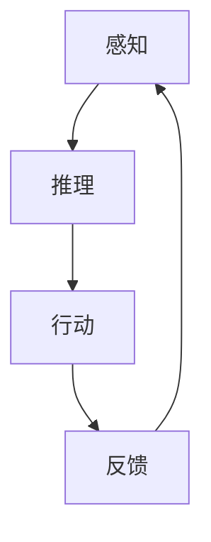

                 

关键词：AI代理，深度学习，投资动态，技术创新，市场趋势

> 摘要：本文将探讨近年来AI代理（Artificial Intelligence Agents）在人工智能领域的迅猛发展，以及这一现象背后的投资动态。文章首先回顾了AI代理的历史背景和核心概念，随后深入分析了其在技术进步和市场接受度方面所取得的重大成就。接下来，我们将探讨投资者对AI代理领域的态度，包括投资策略、关注点以及面临的挑战。最后，本文将总结AI代理领域的未来发展趋势，并提出潜在的研究方向和投资机会。

## 1. 背景介绍

### 1.1 AI代理的历史与概念

AI代理的概念起源于对智能体（Agent）的研究，早在20世纪80年代，人工智能研究者就开始探索如何创建能够与环境交互并执行任务的智能系统。AI代理通常被定义为具有自主性和目的性的系统，能够在复杂环境中感知、推理和采取行动。

AI代理的发展经历了几个关键阶段。早期的代理主要依赖于规则和符号逻辑，这些方法在简单的环境中表现出色，但随着环境复杂度的增加，它们的局限性也日益明显。随着机器学习和深度学习技术的发展，AI代理开始具备更强大的处理复杂任务的能力。特别是在深度强化学习（Deep Reinforcement Learning）的推动下，AI代理在游戏、自动驾驶、机器人控制等领域取得了突破性进展。

### 1.2 AI代理的核心概念

AI代理的核心概念包括感知（Perception）、推理（Reasoning）和行动（Action）。

- **感知**：AI代理通过传感器获取环境信息，如摄像头、麦克风、温度传感器等，这些感知数据用于构建对当前环境的理解。
- **推理**：代理利用其内部模型和算法对感知到的信息进行处理，形成对环境的抽象表示，并推理出可能的行动方案。
- **行动**：根据推理结果，代理执行特定的操作，如移动、发送信息、执行交易等。

AI代理的关键特征包括：

- **自主性**：代理能够独立执行任务，不受人为干预。
- **适应性**：代理能够根据环境变化调整其行为策略。
- **学习能力**：代理通过学习历史数据和环境反馈，不断优化其行为。

## 2. 核心概念与联系

下面是AI代理核心概念和原理的Mermaid流程图：



在这个流程中，感知、推理和行动相互依赖，形成一个闭环系统，使得AI代理能够动态适应环境变化。

### 2.1 技术进步

近年来，AI代理技术的进步主要得益于深度学习技术的发展。深度学习算法通过大规模的数据训练，能够自动提取特征，进行复杂的模式识别和决策。以下是深度学习在AI代理中的应用：

- **图像识别**：AI代理可以通过卷积神经网络（CNN）对图像进行识别，如人脸识别、物体检测等。
- **自然语言处理**：通过循环神经网络（RNN）和变换器（Transformer）模型，AI代理可以理解和生成自然语言，如语音识别、机器翻译等。
- **强化学习**：深度强化学习（DRL）结合了深度学习和强化学习的优势，使AI代理能够在复杂环境中进行自主学习，如游戏AI、自动驾驶等。

### 2.2 市场接受度

随着AI代理技术的成熟，其在各行业的应用越来越广泛。市场接受度不断提高，主要表现在以下几个方面：

- **商业应用**：AI代理在电商、金融、医疗等领域得到了广泛应用，提高了业务效率和用户体验。
- **消费者接受度**：随着智能家居、智能客服等AI代理产品的普及，消费者对AI代理的接受度逐渐提高。
- **政策支持**：各国政府纷纷出台政策，鼓励AI代理技术的研发和应用，推动产业升级和经济发展。

## 3. 核心算法原理 & 具体操作步骤

### 3.1 算法原理概述

AI代理的核心算法主要包括深度学习和强化学习。下面简要介绍这两种算法的基本原理。

- **深度学习**：深度学习通过多层神经网络对数据进行处理，能够自动提取特征并构建复杂的决策模型。深度学习的优势在于其强大的特征提取能力和自适应能力。
- **强化学习**：强化学习是一种通过试错和奖励机制来学习行为策略的算法。代理通过不断与环境交互，根据奖励信号调整其行为策略，以实现最大化长期回报。

### 3.2 算法步骤详解

AI代理的具体操作步骤如下：

1. **感知**：代理通过传感器获取环境信息，如图像、声音、文本等。
2. **预处理**：对感知数据进行预处理，如归一化、去噪等，以提取有效信息。
3. **特征提取**：使用深度学习算法对预处理后的数据进行特征提取，构建对环境的抽象表示。
4. **推理**：代理利用提取的特征和内部模型进行推理，形成对环境的理解。
5. **行动**：根据推理结果，代理执行特定的操作，如移动、发送信息、执行交易等。
6. **反馈**：代理根据执行结果和环境反馈，调整其内部模型和行为策略。

### 3.3 算法优缺点

- **优点**：
  - 强大的特征提取能力：深度学习能够自动提取复杂的特征，提高代理的决策能力。
  - 自适应能力：代理能够根据环境变化调整其行为策略，具有较好的鲁棒性。

- **缺点**：
  - 需要大量数据：深度学习算法需要大量数据进行训练，数据获取和预处理成本较高。
  - 对计算资源要求高：深度学习算法的计算复杂度较高，对计算资源有较高要求。

### 3.4 算法应用领域

AI代理在多个领域取得了显著成果，以下是一些典型的应用领域：

- **游戏**：AI代理在游戏领域取得了突破性进展，如《星际争霸》人机对战、围棋AI等。
- **自动驾驶**：AI代理在自动驾驶领域发挥了重要作用，如自动驾驶汽车、无人机等。
- **机器人控制**：AI代理在机器人控制领域得到了广泛应用，如工业机器人、医疗机器人等。
- **智能家居**：AI代理在智能家居领域扮演了重要角色，如智能音箱、智能门锁等。

## 4. 数学模型和公式 & 详细讲解 & 举例说明

### 4.1 数学模型构建

AI代理的核心算法通常基于数学模型构建，其中最常用的模型是深度学习模型和强化学习模型。

- **深度学习模型**：深度学习模型通常由多层神经网络组成，包括输入层、隐藏层和输出层。输入层接收感知数据，隐藏层对数据进行特征提取和变换，输出层生成最终决策。

- **强化学习模型**：强化学习模型主要包括价值函数（Value Function）和策略函数（Policy Function）。价值函数用于评估代理的行为策略，策略函数用于选择最优行为。

### 4.2 公式推导过程

以深度学习模型为例，下面简要介绍其公式推导过程。

1. **前向传播**：输入层的数据经过隐藏层逐层传递，最终得到输出层的预测结果。

   \[ h_l = \sigma(W_l \cdot h_{l-1} + b_l) \]

   其中，\( h_l \) 表示第 \( l \) 层的激活值，\( \sigma \) 表示激活函数，\( W_l \) 和 \( b_l \) 分别表示第 \( l \) 层的权重和偏置。

2. **反向传播**：根据预测结果和实际标签计算损失函数，并使用梯度下降法更新模型参数。

   \[ \nabla J(\theta) = \nabla (J(\theta) || \hat{y} - y||_2) \]

   其中，\( \theta \) 表示模型参数，\( \hat{y} \) 和 \( y \) 分别表示预测结果和实际标签，\( J(\theta) \) 表示损失函数。

### 4.3 案例分析与讲解

以自动驾驶AI代理为例，分析其数学模型和应用。

1. **感知数据**：自动驾驶AI代理通过摄像头、雷达和激光雷达等传感器获取道路图像、障碍物信息和车辆状态等感知数据。

2. **预处理**：对感知数据进行分析和预处理，如图像去噪、特征提取等。

3. **特征提取**：使用卷积神经网络（CNN）对预处理后的数据进行特征提取，提取道路、障碍物、车辆等关键信息。

4. **决策**：基于提取的特征，使用深度强化学习（DRL）模型进行决策，选择最佳行驶策略。

5. **反馈**：根据自动驾驶结果和环境反馈，更新DRL模型，提高决策准确性。

### 5. 项目实践：代码实例和详细解释说明

#### 5.1 开发环境搭建

在本节中，我们将介绍如何搭建AI代理的开发环境。以下是开发环境搭建的详细步骤：

1. **安装Python**：首先确保系统中已经安装了Python，版本建议为3.7及以上。

2. **安装深度学习框架**：推荐使用TensorFlow或PyTorch作为深度学习框架。以下为安装命令：

   ```shell
   pip install tensorflow
   # 或者
   pip install pytorch torchvision
   ```

3. **安装其他依赖**：根据具体需求，安装其他相关依赖库，如Numpy、Pandas等。

#### 5.2 源代码详细实现

以下是一个简单的AI代理示例代码，使用深度强化学习（DRL）实现一个Q-Learning算法。

```python
import numpy as np
import random
import gym

# 初始化环境
env = gym.make('CartPole-v0')

# 初始化Q表
Q = np.zeros([env.observation_space.n, env.action_space.n])

# 设置超参数
alpha = 0.1  # 学习率
gamma = 0.6  # 折扣因子
epsilon = 0.1  # 探索概率

# Q-Learning算法
def q_learning(env, Q, alpha, gamma, epsilon, episodes):
    for episode in range(episodes):
        state = env.reset()
        done = False
        while not done:
            if random.uniform(0, 1) < epsilon:
                action = random.choice(env.action_space.valid_actions())
            else:
                action = np.argmax(Q[state])

            next_state, reward, done, _ = env.step(action)
            Q[state, action] = Q[state, action] + alpha * (reward + gamma * np.max(Q[next_state]) - Q[state, action])
            state = next_state

        env.render()

    env.close()

# 运行Q-Learning算法
q_learning(env, Q, alpha, gamma, epsilon, 1000)
```

#### 5.3 代码解读与分析

上述代码实现了基于Q-Learning算法的AI代理，用于解决经典的CartPole问题。以下是代码的主要部分解读：

- **初始化环境**：使用`gym.make('CartPole-v0')`创建一个CartPole环境。
- **初始化Q表**：创建一个尺寸为`[env.observation_space.n, env.action_space.n]`的Q表，用于存储每个状态和动作的Q值。
- **设置超参数**：学习率、折扣因子和探索概率等。
- **Q-Learning算法**：在每次迭代中，根据当前状态和Q表选择动作，然后更新Q值。更新公式为 \( Q[s, a] = Q[s, a] + \alpha (r + \gamma \max_{a'} Q[s', a'] - Q[s, a]) \)。
- **运行Q-Learning算法**：在1000个回合内训练AI代理。

#### 5.4 运行结果展示

运行上述代码，可以看到AI代理在CartPole任务中逐渐学会了稳定地保持杆子不倒。通过可视化工具，我们可以观察代理的学习过程，并分析其性能。

## 6. 实际应用场景

### 6.1 电商推荐系统

在电商推荐系统中，AI代理可以根据用户的浏览和购买历史，生成个性化的商品推荐。通过深度学习算法，代理可以提取用户的行为特征，并利用强化学习不断优化推荐策略。例如，亚马逊和阿里巴巴等电商平台已经广泛使用了AI代理进行商品推荐，提高了用户满意度和转化率。

### 6.2 自动驾驶

自动驾驶是AI代理最具代表性的应用场景之一。通过深度学习和强化学习算法，自动驾驶汽车可以实时感知道路环境，并根据路况信息做出安全、高效的驾驶决策。特斯拉、百度等公司正在积极推进自动驾驶技术的发展，期望在未来实现完全自动驾驶。

### 6.3 智能客服

智能客服是另一个典型的AI代理应用场景。通过自然语言处理和对话生成技术，智能客服代理可以与用户进行自然语言交互，解决用户问题并提供个性化服务。例如，苹果公司的Siri和谷歌助手等智能语音助手已经广泛应用在智能手机和智能家居设备中。

### 6.4 量化交易

在量化交易领域，AI代理可以分析大量的市场数据，发现潜在的投资机会，并执行交易策略。通过深度学习和强化学习算法，代理可以不断优化交易策略，提高交易收益。许多量化交易平台已经开始使用AI代理进行自动化交易，以降低人力成本和操作风险。

## 7. 工具和资源推荐

### 7.1 学习资源推荐

- **书籍**：
  - 《深度学习》（Goodfellow, Bengio, Courville）
  - 《强化学习》（Sutton, Barto）
  - 《Python机器学习》（Sebastian Raschka）
- **在线课程**：
  - Coursera上的《机器学习》课程（吴恩达教授）
  - Udacity的《自动驾驶工程师纳米学位》
  - edX上的《人工智能：基础与前沿》
- **社区和论坛**：
  - GitHub（查找AI代理相关的开源项目）
  - Stack Overflow（解决编程问题）
  - AI社区（讨论AI代理的技术和应用）

### 7.2 开发工具推荐

- **深度学习框架**：
  - TensorFlow
  - PyTorch
  - Keras
- **编程语言**：
  - Python（适用于AI代理开发）
  - R（适用于统计分析）
- **可视化工具**：
  - Matplotlib
  - Seaborn
  - Plotly

### 7.3 相关论文推荐

- “Deep Reinforcement Learning for Autonomous Navigation” (Mnih et al., 2016)
- “Attention is All You Need” (Vaswani et al., 2017)
- “A Theoretically Grounded Application of Dropout in Recurrent Neural Networks” (Yarin et al., 2016)
- “Unsupervised Representation Learning with Deep Convolutional Generative Adversarial Networks” (Radford et al., 2015)

## 8. 总结：未来发展趋势与挑战

### 8.1 研究成果总结

AI代理领域在过去几年取得了显著成果，主要表现在以下几个方面：

- **技术进步**：深度学习和强化学习算法的不断优化，使得AI代理在感知、推理和行动能力方面得到了显著提升。
- **应用拓展**：AI代理在商业、工业、医疗等领域的应用越来越广泛，推动了各行业的数字化转型。
- **政策支持**：各国政府纷纷出台政策，鼓励AI代理技术的发展，为产业发展提供了有力支持。

### 8.2 未来发展趋势

未来，AI代理领域将继续保持快速发展，主要趋势包括：

- **跨界融合**：AI代理将与物联网、区块链、云计算等新兴技术深度融合，为更多行业带来创新应用。
- **个性化服务**：AI代理将更加注重用户体验，提供个性化、定制化的服务。
- **安全性提升**：随着AI代理的广泛应用，安全性问题将日益受到关注，未来将出现更多安全防护技术。

### 8.3 面临的挑战

尽管AI代理领域取得了显著成果，但仍面临以下挑战：

- **数据隐私**：随着AI代理收集和处理的数据越来越多，数据隐私问题将愈加突出。
- **算法透明性**：深度学习算法的黑箱特性使得其决策过程难以解释，增加了监管和伦理风险。
- **计算资源**：AI代理的开发和应用对计算资源有较高要求，如何高效利用计算资源仍需进一步探索。

### 8.4 研究展望

未来，AI代理领域的研究将朝着以下方向发展：

- **算法优化**：不断优化深度学习和强化学习算法，提高AI代理的性能和可靠性。
- **跨学科研究**：跨学科研究将有助于解决AI代理领域面临的复杂问题。
- **伦理和法律研究**：加强对AI代理伦理和法律问题的研究，为产业发展提供指导。

## 9. 附录：常见问题与解答

### Q：AI代理与机器人有什么区别？

A：AI代理是具有自主性和目的性的智能系统，可以在复杂环境中执行任务。机器人则是具有物理形态和运动能力的智能系统，通常用于执行特定任务。AI代理更注重智能决策和自主学习能力，而机器人则更注重物理交互和执行任务的能力。

### Q：AI代理在医疗领域有哪些应用？

A：AI代理在医疗领域有广泛的应用，如辅助诊断、药物研发、个性化治疗等。例如，AI代理可以通过分析患者病史和基因数据，提供个性化的治疗方案。此外，AI代理还可以用于医疗图像分析，帮助医生更快、更准确地诊断疾病。

### Q：如何评估AI代理的性能？

A：评估AI代理的性能可以从多个维度进行，如决策准确性、响应速度、资源消耗等。常用的评估指标包括准确率、召回率、F1分数等。此外，还可以通过用户满意度、业务收益等实际效果来评估AI代理的性能。

### Q：AI代理的未来发展方向是什么？

A：AI代理的未来发展方向包括跨界融合、个性化服务、安全性提升等。随着物联网、区块链、云计算等技术的发展，AI代理将在更多领域得到应用。同时，AI代理的智能化和自主学习能力也将不断提高，为各行各业带来更多创新应用。

---

作者：禅与计算机程序设计艺术 / Zen and the Art of Computer Programming

---

[文章结束]

