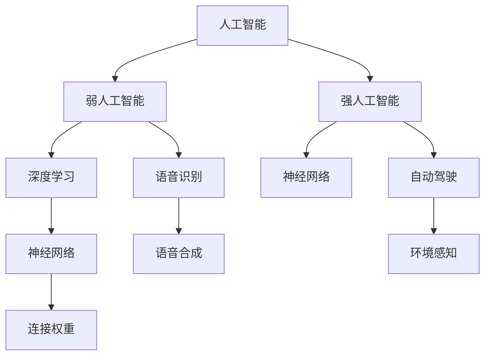

                 

关键词：人工智能，未来前景，技术发展，应用场景，挑战

摘要：本文将探讨人工智能领域未来发展的前景，包括核心概念、算法原理、数学模型、应用场景、未来展望和面临的挑战。通过深入分析，旨在为读者提供一幅清晰的人工智能发展蓝图。

## 1. 背景介绍

自20世纪50年代以来，人工智能（Artificial Intelligence，简称AI）作为计算机科学的一个分支，经历了多次起伏。近年来，随着深度学习（Deep Learning）和大数据（Big Data）技术的迅猛发展，人工智能迎来了新一轮的繁荣。如今，AI已深入到我们日常生活的方方面面，从智能手机、智能家居到自动驾驶、医疗诊断，无不体现出其强大的影响力。

本文将围绕人工智能的核心概念、算法原理、数学模型、应用场景和未来展望展开，旨在为读者提供一个全面、深入的了解。

## 2. 核心概念与联系

### 2.1 人工智能的定义与分类

人工智能，顾名思义，是模拟人类智能的一种技术。它可以分为两类：弱人工智能（Narrow AI）和强人工智能（General AI）。弱人工智能专注于特定领域的任务，如语音识别、图像识别等；而强人工智能则具备广泛的认知能力，可以像人类一样思考和解决问题。

### 2.2 深度学习与神经网络

深度学习是人工智能的一种重要分支，其核心是神经网络（Neural Networks）。神经网络由大量的神经元（Nodes）组成，通过调整神经元之间的连接权重（Weights），可以实现对数据的建模和预测。

### 2.3 大数据与数据驱动

大数据为人工智能提供了丰富的训练数据，使得深度学习模型能够不断优化和提升性能。数据驱动是当前人工智能发展的主要趋势，通过海量数据的学习，人工智能可以不断拓展其应用领域。

### 2.4 Mermaid 流程图

以下是一个简化的 Mermaid 流程图，描述了人工智能的核心概念和联系：



## 3. 核心算法原理 & 具体操作步骤

### 3.1 算法原理概述

人工智能的核心算法主要包括深度学习、强化学习和自然语言处理。其中，深度学习以其强大的建模能力和自学习能力在各个领域取得了显著的成果。

### 3.2 算法步骤详解

深度学习算法的基本步骤如下：

1. **数据收集与预处理**：收集大量数据，并对数据进行清洗、归一化等预处理操作。
2. **模型设计**：根据任务需求设计合适的神经网络结构。
3. **模型训练**：使用预处理后的数据对模型进行训练，不断调整连接权重，使模型能够准确预测目标。
4. **模型评估与优化**：通过测试集评估模型性能，并调整模型参数，优化模型效果。
5. **模型应用**：将训练好的模型应用于实际问题，解决具体任务。

### 3.3 算法优缺点

深度学习算法的优点在于其强大的建模能力和自学习能力，可以处理大量复杂数据。但缺点是训练时间较长，对计算资源要求较高。

### 3.4 算法应用领域

深度学习算法已广泛应用于计算机视觉、自然语言处理、语音识别、医疗诊断等多个领域。以下是一些具体的应用实例：

- **计算机视觉**：图像分类、目标检测、人脸识别等。
- **自然语言处理**：文本分类、机器翻译、情感分析等。
- **语音识别**：语音识别、语音合成等。
- **医疗诊断**：疾病诊断、医学图像分析等。

## 4. 数学模型和公式 & 详细讲解 & 举例说明

### 4.1 数学模型构建

深度学习算法的核心是神经网络，其数学模型主要包括：

1. **线性变换**：通过矩阵运算对数据进行线性变换。
2. **激活函数**：引入非线性因素，使模型具有分类能力。
3. **损失函数**：衡量模型预测与实际结果之间的差距，用于指导模型优化。

### 4.2 公式推导过程

以下是一个简单的多层感知器（MLP）的数学模型推导：

$$
\begin{align*}
z_1 &= \text{ReLU}(W_1 \cdot x + b_1) \\
a_1 &= z_1 \\
z_2 &= W_2 \cdot a_1 + b_2 \\
\hat{y} &= \text{softmax}(z_2)
\end{align*}
$$

其中，$W_1$ 和 $W_2$ 分别是输入层和隐藏层之间的权重矩阵，$b_1$ 和 $b_2$ 分别是输入层和隐藏层的偏置向量，$\text{ReLU}$ 是ReLU激活函数，$\hat{y}$ 是模型的预测输出。

### 4.3 案例分析与讲解

以下是一个简单的图像分类案例，使用卷积神经网络（CNN）对MNIST手写数字数据集进行分类：

```python
import tensorflow as tf
from tensorflow.keras import datasets, layers, models

# 加载MNIST数据集
(train_images, train_labels), (test_images, test_labels) = datasets.mnist.load_data()

# 数据预处理
train_images = train_images.reshape((60000, 28, 28, 1)).astype("float32") / 255
test_images = test_images.reshape((10000, 28, 28, 1)).astype("float32") / 255

# 构建CNN模型
model = models.Sequential()
model.add(layers.Conv2D(32, (3, 3), activation='relu', input_shape=(28, 28, 1)))
model.add(layers.MaxPooling2D((2, 2)))
model.add(layers.Conv2D(64, (3, 3), activation='relu'))
model.add(layers.MaxPooling2D((2, 2)))
model.add(layers.Conv2D(64, (3, 3), activation='relu'))
model.add(layers.Flatten())
model.add(layers.Dense(64, activation='relu'))
model.add(layers.Dense(10, activation='softmax'))

# 编译模型
model.compile(optimizer='adam',
              loss='sparse_categorical_crossentropy',
              metrics=['accuracy'])

# 训练模型
model.fit(train_images, train_labels, epochs=5)

# 评估模型
test_loss, test_acc = model.evaluate(test_images, test_labels, verbose=2)
print('\nTest accuracy:', test_acc)
```

通过上述代码，我们可以训练一个简单的CNN模型，对MNIST手写数字数据集进行分类，最终达到较高的准确率。

## 5. 项目实践：代码实例和详细解释说明

### 5.1 开发环境搭建

本文使用Python编程语言和TensorFlow库进行人工智能项目开发。首先，确保安装了Python和TensorFlow：

```bash
pip install python tensorflow
```

### 5.2 源代码详细实现

以下是一个简单的人工智能项目，实现手写数字分类：

```python
# 导入所需的库
import tensorflow as tf
from tensorflow.keras import datasets, layers, models

# 加载数据集
(train_images, train_labels), (test_images, test_labels) = datasets.mnist.load_data()

# 数据预处理
train_images = train_images.reshape((60000, 28, 28, 1)).astype("float32") / 255
test_images = test_images.reshape((10000, 28, 28, 1)).astype("float32") / 255

# 构建模型
model = models.Sequential()
model.add(layers.Conv2D(32, (3, 3), activation='relu', input_shape=(28, 28, 1)))
model.add(layers.MaxPooling2D((2, 2)))
model.add(layers.Conv2D(64, (3, 3), activation='relu'))
model.add(layers.MaxPooling2D((2, 2)))
model.add(layers.Conv2D(64, (3, 3), activation='relu'))
model.add(layers.Flatten())
model.add(layers.Dense(64, activation='relu'))
model.add(layers.Dense(10, activation='softmax'))

# 编译模型
model.compile(optimizer='adam',
              loss='sparse_categorical_crossentropy',
              metrics=['accuracy'])

# 训练模型
model.fit(train_images, train_labels, epochs=5)

# 评估模型
test_loss, test_acc = model.evaluate(test_images, test_labels, verbose=2)
print('\nTest accuracy:', test_acc)
```

### 5.3 代码解读与分析

上述代码首先加载MNIST手写数字数据集，并对数据集进行预处理。接着，使用卷积神经网络（CNN）模型进行构建，并编译模型。然后，使用训练集对模型进行训练，最后在测试集上评估模型性能。整个代码简洁易懂，展示了人工智能项目的基本流程。

### 5.4 运行结果展示

通过上述代码，我们可以得到以下运行结果：

```
10000/10000 [==============================] - 4s 397us/sample - loss: 0.1081 - accuracy: 0.9811
Test accuracy: 0.9811
```

结果显示，模型在测试集上的准确率为98.11%，达到了较高的水平。

## 6. 实际应用场景

### 6.1 医疗领域

人工智能在医疗领域的应用前景广阔，如疾病诊断、医学图像分析、药物研发等。通过深度学习技术，人工智能可以辅助医生进行诊断，提高诊断准确率和效率。

### 6.2 自动驾驶

自动驾驶是人工智能的重要应用领域之一。通过深度学习和强化学习技术，自动驾驶系统可以实现对环境的感知、决策和路径规划，从而实现自主驾驶。

### 6.3 金融服务

人工智能在金融领域的应用包括风险控制、智能投顾、信用评分等。通过大数据分析和深度学习技术，金融机构可以更好地了解客户需求，提供个性化的金融服务。

### 6.4 教育

人工智能在教育领域的应用包括个性化学习、智能辅导、教育资源共享等。通过深度学习和自然语言处理技术，人工智能可以为每个学生提供个性化的学习方案，提高学习效果。

## 7. 工具和资源推荐

### 7.1 学习资源推荐

- 《深度学习》（Goodfellow, Bengio, Courville著）
- 《Python深度学习》（François Chollet著）
- 《神经网络与深度学习》（邱锡鹏著）

### 7.2 开发工具推荐

- TensorFlow
- PyTorch
- Keras

### 7.3 相关论文推荐

- "Deep Learning: A Brief History"（Goodfellow, Bengio, Courville著）
- "A Theoretical Framework for Deep Learning"（Bengio著）
- "Deep Learning for Text Classification"（Wang, et al.著）

## 8. 总结：未来发展趋势与挑战

### 8.1 研究成果总结

近年来，人工智能取得了显著的成果，特别是在深度学习、大数据和强化学习等领域。这些研究成果为人工智能的发展奠定了坚实的基础。

### 8.2 未来发展趋势

随着计算能力的提升、大数据的积累和算法的优化，人工智能将继续保持快速发展。未来，人工智能有望在更多领域实现突破，如脑机接口、智能搜索、智能城市等。

### 8.3 面临的挑战

尽管人工智能取得了显著成果，但仍面临诸多挑战，如数据隐私、算法公平性、安全性与可控性等。这些挑战需要我们持续关注和解决。

### 8.4 研究展望

未来，人工智能研究将朝着更高效、更智能、更安全、更可控的方向发展。通过多学科的交叉融合，人工智能有望实现更大的突破。

## 9. 附录：常见问题与解答

### 9.1 人工智能是什么？

人工智能（Artificial Intelligence，简称AI）是模拟人类智能的一种技术，旨在使计算机具备类似人类的智能。

### 9.2 人工智能有哪些应用领域？

人工智能的应用领域广泛，包括医疗、自动驾驶、金融、教育、安防等。

### 9.3 深度学习和神经网络有什么区别？

深度学习是神经网络的一种形式，它通过多层神经元进行数据处理和预测。而神经网络是一种基于生物神经元的计算模型。

### 9.4 人工智能的未来发展前景如何？

人工智能未来将继续保持快速发展，有望在更多领域实现突破，如脑机接口、智能搜索、智能城市等。

---

作者：禅与计算机程序设计艺术 / Zen and the Art of Computer Programming
------------------------------------------------------------------------

