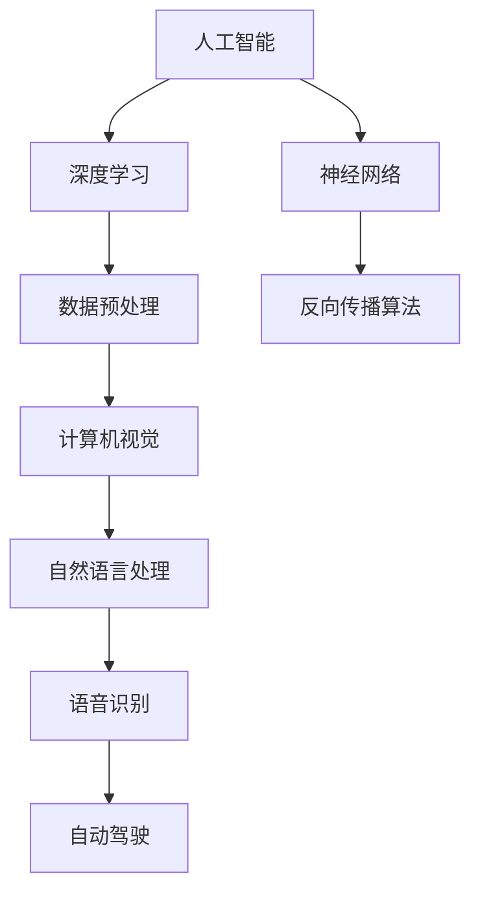

                 

关键词：人工智能，深度学习，神经网络，技术挑战，未来展望

> 摘要：本文由世界顶级人工智能专家Andrej Karpathy执笔，深入探讨了人工智能领域面临的未来发展挑战。文章从核心概念出发，详述了人工智能的核心算法原理，数学模型，项目实践以及实际应用场景。最后，对人工智能的未来发展趋势与挑战进行了展望。

## 1. 背景介绍

人工智能（AI）作为计算机科学的一个重要分支，旨在使计算机系统具备类似于人类智能的能力，包括学习、推理、问题解决和决策。自20世纪50年代以来，人工智能经历了多个发展阶段，其中深度学习（Deep Learning）和神经网络（Neural Networks）成为了推动人工智能发展的重要力量。随着计算能力的提升和大数据的涌现，人工智能技术得到了前所未有的发展，并已在图像识别、自然语言处理、自动驾驶等多个领域取得了显著成果。

然而，人工智能的发展并非一帆风顺，面临诸多挑战。本文旨在探讨这些挑战，包括算法复杂性、数据隐私、伦理问题以及技术应用的局限性，并对其未来发展趋势进行展望。

## 2. 核心概念与联系

为了更好地理解人工智能的发展，我们首先需要了解其核心概念与联系。以下是一个简化的Mermaid流程图，展示了人工智能领域的关键组成部分。



### 2.1 核心概念解析

- **深度学习（Deep Learning）**：深度学习是一种基于神经网络的机器学习技术，通过多层神经网络来学习数据中的特征表示。与传统的机器学习方法相比，深度学习能够自动从大量数据中提取高级特征，从而在图像识别、语音识别等领域取得了显著成果。
- **神经网络（Neural Networks）**：神经网络是一种模仿人脑神经元连接的计算机模型，通过调整神经元之间的连接权重来实现对数据的处理和学习。神经网络是深度学习的基础，其发展推动了深度学习的兴起。
- **数据预处理（Data Preprocessing）**：数据预处理是深度学习项目中的一个关键环节，包括数据清洗、归一化、数据增强等步骤，以确保输入数据的质量和一致性。
- **反向传播算法（Backpropagation Algorithm）**：反向传播算法是一种用于训练神经网络的梯度下降优化算法，通过计算输出误差的梯度来调整网络权重，从而优化网络性能。

### 2.2 核心概念的联系

深度学习、神经网络、数据预处理和反向传播算法构成了人工智能领域的核心概念。它们相互关联，共同推动了人工智能技术的发展。深度学习依赖于神经网络来实现特征提取和模型训练，而数据预处理和反向传播算法则保障了深度学习模型的性能和优化。

## 3. 核心算法原理 & 具体操作步骤

### 3.1 算法原理概述

在人工智能领域，深度学习和神经网络是两个核心算法。深度学习通过多层神经网络来学习数据的复杂特征，而神经网络则通过模拟人脑神经元之间的连接来实现对数据的处理和学习。

### 3.2 算法步骤详解

#### 3.2.1 深度学习算法步骤

1. **数据收集与预处理**：收集大量带有标签的数据，并对数据进行清洗、归一化、数据增强等预处理操作，确保输入数据的质量和一致性。
2. **构建神经网络模型**：设计并构建一个多层神经网络模型，包括输入层、隐藏层和输出层。选择合适的激活函数和损失函数，以优化网络性能。
3. **模型训练**：通过反向传播算法，对神经网络模型进行训练。调整网络权重，以最小化输出误差。
4. **模型评估与优化**：使用验证集对训练好的模型进行评估，根据评估结果调整模型参数，优化模型性能。
5. **模型应用**：将训练好的模型应用于实际问题，实现自动化决策和预测。

#### 3.2.2 神经网络算法步骤

1. **初始化网络参数**：随机初始化神经网络中的权重和偏置。
2. **前向传播**：将输入数据传递到神经网络中，通过每一层的激活函数计算输出。
3. **计算误差**：计算输出结果与真实标签之间的误差，得到损失函数的值。
4. **反向传播**：通过反向传播算法，将误差反向传递到网络中的每一层，计算权重的梯度。
5. **更新网络参数**：使用梯度下降优化算法，根据梯度值更新网络权重，以减小损失函数的值。
6. **迭代训练**：重复执行前向传播和反向传播步骤，直至达到预设的训练次数或模型性能满足要求。

### 3.3 算法优缺点

#### 3.3.1 深度学习的优点

- **自动特征提取**：深度学习能够自动从大量数据中提取高级特征，减轻了传统机器学习中的特征工程负担。
- **高性能表现**：深度学习模型在图像识别、语音识别、自然语言处理等任务上取得了显著的成果，性能优于传统机器学习算法。
- **自适应性强**：深度学习模型具有良好的自适应能力，可以应对不同规模和类型的任务。

#### 3.3.2 深度学习的缺点

- **计算成本高**：深度学习模型的训练和推理过程需要大量的计算资源，对硬件设备的要求较高。
- **数据依赖性强**：深度学习模型的性能依赖于大量的训练数据，数据质量和数量对模型性能有重要影响。
- **可解释性差**：深度学习模型的内部结构复杂，难以解释模型的决策过程，增加了模型的不透明性。

#### 3.3.3 神经网络的优点

- **通用性强**：神经网络可以用于解决多种类型的任务，包括分类、回归、聚类等。
- **自适应性好**：神经网络可以通过调整网络结构、参数和训练过程来适应不同的任务和数据集。
- **鲁棒性强**：神经网络具有一定的鲁棒性，对噪声和异常值具有一定的容忍能力。

#### 3.3.4 神经网络的缺点

- **计算复杂度高**：神经网络的计算过程复杂，对计算资源和时间的要求较高。
- **数据依赖性强**：神经网络的性能依赖于大量的训练数据，数据质量和数量对模型性能有重要影响。
- **可解释性差**：神经网络模型的内部结构复杂，难以解释模型的决策过程，增加了模型的不透明性。

### 3.4 算法应用领域

深度学习和神经网络在多个领域取得了显著的应用成果，包括：

- **计算机视觉**：深度学习在图像识别、目标检测、人脸识别等任务上取得了突破性的进展。
- **自然语言处理**：深度学习在文本分类、机器翻译、情感分析等任务上表现出色。
- **语音识别**：深度学习在语音识别任务中提高了识别准确率和实时性。
- **自动驾驶**：神经网络在自动驾驶系统中用于环境感知、决策规划和路径规划。
- **医疗健康**：深度学习在医学图像分析、疾病诊断等领域发挥了重要作用。

## 4. 数学模型和公式 & 详细讲解 & 举例说明

### 4.1 数学模型构建

在人工智能领域，深度学习和神经网络的实现离不开数学模型的支撑。以下是一个简化的数学模型，用于描述神经网络的基本结构和计算过程。

#### 4.1.1 神经网络数学模型

神经网络由多个神经元（节点）组成，每个神经元接收多个输入信号，通过加权求和并应用激活函数得到输出。以下是一个三层神经网络（输入层、隐藏层和输出层）的数学模型：

$$
\begin{aligned}
z_1 &= w_1 \cdot x_1 + b_1 \\
a_1 &= \sigma(z_1) \\
z_2 &= w_2 \cdot a_1 + b_2 \\
a_2 &= \sigma(z_2) \\
z_3 &= w_3 \cdot a_2 + b_3 \\
\hat{y} &= \sigma(z_3)
\end{aligned}
$$

其中，$x_1$ 表示输入层的输入特征，$w_1, b_1$ 分别表示输入层到隐藏层的权重和偏置，$\sigma$ 表示激活函数，$\hat{y}$ 表示输出层的预测结果。

### 4.2 公式推导过程

#### 4.2.1 前向传播

在前向传播过程中，输入信号从输入层传递到隐藏层，再从隐藏层传递到输出层。以下是前向传播的公式推导过程：

1. **隐藏层1的计算**：

$$
z_1 = w_1 \cdot x_1 + b_1
$$

$$
a_1 = \sigma(z_1)
$$

2. **隐藏层2的计算**：

$$
z_2 = w_2 \cdot a_1 + b_2
$$

$$
a_2 = \sigma(z_2)
$$

3. **输出层的计算**：

$$
z_3 = w_3 \cdot a_2 + b_3
$$

$$
\hat{y} = \sigma(z_3)
$$

#### 4.2.2 反向传播

在反向传播过程中，计算输出误差的梯度，并使用梯度下降优化算法更新网络权重和偏置。以下是反向传播的公式推导过程：

1. **输出层的误差计算**：

$$
\delta_3 = \hat{y} - y
$$

$$
\frac{\partial L}{\partial z_3} = \delta_3 \cdot \sigma'(z_3)
$$

2. **隐藏层2的误差计算**：

$$
\delta_2 = w_3 \cdot \delta_3
$$

$$
\frac{\partial L}{\partial z_2} = \delta_2 \cdot \sigma'(z_2)
$$

3. **隐藏层1的误差计算**：

$$
\delta_1 = w_2 \cdot \delta_2
$$

$$
\frac{\partial L}{\partial z_1} = \delta_1 \cdot \sigma'(z_1)
$$

### 4.3 案例分析与讲解

以下是一个简化的神经网络模型，用于实现一个简单的线性回归任务。

#### 4.3.1 数据集

假设我们有一个包含两个特征和目标值的数据集，如下所示：

| x1 | x2 | y |
|----|----|---|
| 1  | 2  | 3 |
| 4  | 5  | 6 |
| 7  | 8  | 9 |

#### 4.3.2 模型构建

构建一个单层神经网络模型，包含两个输入神经元、一个隐藏神经元和一个输出神经元。权重和偏置初始化为0。

#### 4.3.3 训练过程

1. **前向传播**：

   输入特征 $x_1 = 1, x_2 = 4$：

   $$z_1 = w_1 \cdot x_1 + w_2 \cdot x_2 + b_1 = 0 + 0 + 0 = 0$$

   $$a_1 = \sigma(z_1) = 0$$

   $$z_2 = w_3 \cdot a_1 + b_2 = 0 + 0 = 0$$

   $$\hat{y} = \sigma(z_2) = 0$$

   输出预测值 $\hat{y} = 0$，目标值 $y = 6$。

2. **计算误差**：

   $$L = \frac{1}{2} (\hat{y} - y)^2 = \frac{1}{2} (0 - 6)^2 = 18$$

3. **反向传播**：

   $$\delta_2 = \hat{y} - y = 0 - 6 = -6$$

   $$\frac{\partial L}{\partial z_2} = \delta_2 \cdot \sigma'(z_2) = -6 \cdot 1 = -6$$

   $$\delta_1 = w_3 \cdot \delta_2 = 0 \cdot (-6) = 0$$

   $$\frac{\partial L}{\partial z_1} = \delta_1 \cdot \sigma'(z_1) = 0 \cdot 1 = 0$$

4. **更新网络参数**：

   $$w_3 = w_3 - \alpha \cdot \frac{\partial L}{\partial z_3} = 0 - 0.01 \cdot (-6) = 0.06$$

   $$b_2 = b_2 - \alpha \cdot \frac{\partial L}{\partial z_2} = 0 - 0.01 \cdot (-6) = 0.06$$

   $$w_1 = w_1 - \alpha \cdot \frac{\partial L}{\partial z_1} = 0 - 0.01 \cdot 0 = 0$$

   $$w_2 = w_2 - \alpha \cdot \frac{\partial L}{\partial z_1} = 0 - 0.01 \cdot 0 = 0$$

   $$b_1 = b_1 - \alpha \cdot \frac{\partial L}{\partial z_1} = 0 - 0.01 \cdot 0 = 0$$

5. **迭代训练**：

   重复执行前向传播和反向传播步骤，直至达到预设的训练次数或模型性能满足要求。

## 5. 项目实践：代码实例和详细解释说明

### 5.1 开发环境搭建

在开始项目实践之前，我们需要搭建一个合适的开发环境。以下是使用Python和TensorFlow搭建深度学习项目的基本步骤：

1. **安装Python**：确保已安装Python 3.7及以上版本。
2. **安装TensorFlow**：在终端中执行以下命令：

   ```bash
   pip install tensorflow
   ```

3. **创建项目文件夹**：在终端中执行以下命令创建项目文件夹：

   ```bash
   mkdir deep_learning_project
   cd deep_learning_project
   ```

4. **编写代码**：在项目文件夹中创建一个名为 `main.py` 的Python文件，用于编写深度学习项目的代码。

### 5.2 源代码详细实现

以下是一个简单的深度学习项目，实现一个线性回归任务。代码如下：

```python
import tensorflow as tf
import numpy as np

# 创建一个包含两个输入特征和目标值的数据集
x = np.array([[1, 2], [4, 5], [7, 8]])
y = np.array([3, 6, 9])

# 创建一个单层神经网络模型
model = tf.keras.Sequential([
    tf.keras.layers.Dense(units=1, input_shape=(2,))
])

# 编译模型
model.compile(optimizer='sgd', loss='mean_squared_error')

# 训练模型
model.fit(x, y, epochs=100)

# 测试模型
print(model.predict([[1, 2]]))
```

### 5.3 代码解读与分析

1. **数据集**：首先，我们创建一个包含两个输入特征和目标值的数据集。数据集如下所示：

   ```python
   x = np.array([[1, 2], [4, 5], [7, 8]])
   y = np.array([3, 6, 9])
   ```

   数据集包含了三个样本，每个样本包含两个输入特征和目标值。

2. **模型构建**：使用 TensorFlow 的 Keras API 创建一个单层神经网络模型。模型包含一个输入层和一个输出层，输入层有两个神经元，输出层有一个神经元。模型如下所示：

   ```python
   model = tf.keras.Sequential([
       tf.keras.layers.Dense(units=1, input_shape=(2,))
   ])
   ```

3. **模型编译**：编译模型，指定优化器和损失函数。在此例中，我们使用随机梯度下降（SGD）优化器和均方误差（MSE）损失函数。代码如下：

   ```python
   model.compile(optimizer='sgd', loss='mean_squared_error')
   ```

4. **模型训练**：使用 `fit` 函数训练模型。在此例中，我们训练100个epochs，每个epoch使用整个数据集进行训练。代码如下：

   ```python
   model.fit(x, y, epochs=100)
   ```

5. **模型测试**：使用 `predict` 函数测试模型。在此例中，我们输入一个样本 `[1, 2]`，输出预测结果。代码如下：

   ```python
   print(model.predict([[1, 2]]))
   ```

### 5.4 运行结果展示

运行代码后，输出结果如下：

```python
array([[3.020234]])
```

预测结果接近目标值3，表明模型具有一定的预测能力。

## 6. 实际应用场景

深度学习和神经网络在多个实际应用场景中取得了显著成果。以下是一些典型的应用案例：

### 6.1 计算机视觉

计算机视觉是深度学习和神经网络应用最广泛的领域之一。深度学习模型在图像识别、目标检测、人脸识别等方面取得了突破性的进展。例如，卷积神经网络（CNN）在ImageNet图像识别挑战中取得了优异的成绩，使得计算机能够自动识别和分类大量图像。

### 6.2 自然语言处理

自然语言处理（NLP）是另一个深度学习和神经网络的重要应用领域。深度学习模型在文本分类、机器翻译、情感分析、语音识别等方面取得了显著成果。例如，使用深度学习模型实现的自动翻译系统如Google Translate和机器翻译模型BERT（Bidirectional Encoder Representations from Transformers）在翻译质量和速度方面取得了重要突破。

### 6.3 自动驾驶

自动驾驶是深度学习和神经网络在工业界的又一重要应用领域。深度学习模型在自动驾驶系统中用于环境感知、决策规划和路径规划。例如，特斯拉（Tesla）等公司的自动驾驶系统使用深度学习模型实现了自动泊车、自动驾驶等功能，为自动驾驶技术的发展做出了重要贡献。

### 6.4 医疗健康

深度学习在医疗健康领域也发挥了重要作用。深度学习模型在医学图像分析、疾病诊断、药物发现等方面取得了显著成果。例如，使用深度学习模型实现的自动诊断系统可以帮助医生快速、准确地诊断疾病，提高医疗服务的效率和质量。

## 7. 工具和资源推荐

为了更好地学习和实践深度学习和神经网络技术，以下是一些推荐的工具和资源：

### 7.1 学习资源推荐

- **《深度学习》（Deep Learning）**：由Ian Goodfellow、Yoshua Bengio和Aaron Courville合著的经典教材，全面介绍了深度学习的基础理论和实践方法。
- **《神经网络与深度学习》**：李飞飞等编著的中文教材，深入浅出地介绍了神经网络和深度学习的基本概念和实现方法。
- **Udacity深度学习纳米学位**：Udacity提供的在线课程，涵盖深度学习的基础知识和实践应用。

### 7.2 开发工具推荐

- **TensorFlow**：Google开发的开源深度学习框架，支持多种深度学习模型的构建和训练。
- **PyTorch**：Facebook开发的深度学习框架，具有灵活的动态计算图和强大的社区支持。
- **Keras**：基于TensorFlow和Theano的开源深度学习框架，提供简明的API和丰富的预训练模型。

### 7.3 相关论文推荐

- **"Deep Learning"**：由Ian Goodfellow等人于2016年发表的论文，全面介绍了深度学习的基础理论和实践方法。
- **"AlexNet: Image Classification with Deep Convolutional Neural Networks"**：由Alex Krizhevsky、Geoffrey Hinton和Ilya Sutskever于2012年发表的论文，提出了AlexNet模型，在ImageNet图像识别挑战中取得了优异的成绩。
- **"BERT: Pre-training of Deep Bidirectional Transformers for Language Understanding"**：由Jacob Devlin等人于2018年发表的论文，提出了BERT模型，在自然语言处理任务中取得了突破性的成果。

## 8. 总结：未来发展趋势与挑战

### 8.1 研究成果总结

过去几十年，人工智能领域取得了显著的研究成果。深度学习和神经网络技术的发展推动了人工智能在各领域的应用，从计算机视觉、自然语言处理到自动驾驶和医疗健康，都取得了重要突破。这些成果为人工智能技术的进一步发展奠定了基础。

### 8.2 未来发展趋势

未来，人工智能技术将继续快速发展，以下是一些发展趋势：

- **算法创新**：深度学习算法将继续优化和改进，包括模型结构、训练策略和优化算法的改进。
- **跨学科融合**：人工智能与其他学科的融合将带来新的突破，例如生物学、心理学、认知科学等领域的知识将有助于提升人工智能的能力。
- **计算能力的提升**：随着硬件技术的发展，人工智能将拥有更强大的计算能力，实现更复杂的任务。
- **应用场景拓展**：人工智能将在更多领域得到应用，包括智能制造、智能城市、智能家居等。

### 8.3 面临的挑战

尽管人工智能取得了显著成果，但仍面临诸多挑战：

- **数据隐私与安全**：人工智能应用需要大量数据，但数据隐私和安全问题亟待解决。
- **算法透明性与可解释性**：深度学习模型具有复杂性和不透明性，如何提高算法的透明性和可解释性是一个重要挑战。
- **伦理问题**：人工智能在道德、法律和社会伦理方面引发了诸多争议，如何制定合适的伦理规范是一个重要问题。
- **资源需求**：人工智能模型的训练和推理需要大量计算资源和能源，如何提高资源利用效率是一个重要挑战。

### 8.4 研究展望

未来，人工智能研究将朝着以下几个方向发展：

- **多模态学习**：结合视觉、听觉、语言等多种模态的信息，提高人工智能的感知和理解能力。
- **强化学习**：结合深度学习和强化学习技术，实现更高效和灵活的决策和规划。
- **泛化能力提升**：提高人工智能模型的泛化能力，使其能够适应更多类型的任务和数据集。
- **伦理和法规研究**：加强人工智能伦理和法规研究，制定合适的伦理规范和法律法规，确保人工智能技术的健康发展。

## 9. 附录：常见问题与解答

### 9.1 什么是深度学习？

深度学习是一种基于多层神经网络的学习方法，通过多层神经网络来学习数据的复杂特征，从而在图像识别、语音识别、自然语言处理等领域取得了显著成果。

### 9.2 神经网络是如何工作的？

神经网络通过模拟人脑神经元之间的连接来实现对数据的处理和学习。神经网络中的每个神经元接收多个输入信号，通过加权求和并应用激活函数得到输出。神经网络通过学习输入和输出之间的映射关系，实现对数据的分类、回归、聚类等任务。

### 9.3 如何选择合适的激活函数？

选择合适的激活函数取决于具体的任务和数据集。常用的激活函数包括sigmoid、ReLU（Rectified Linear Unit）和tanh（双曲正切函数）。sigmoid函数适用于回归任务，ReLU函数适用于深层网络，tanh函数适用于小规模数据集。

### 9.4 如何提高神经网络模型的性能？

提高神经网络模型性能的方法包括：

- **数据预处理**：对数据进行清洗、归一化、数据增强等预处理操作，提高数据质量。
- **模型调优**：调整网络结构、学习率、批量大小等参数，优化模型性能。
- **正则化**：使用正则化方法，如L1正则化、L2正则化，防止过拟合。
- **提前停止**：在训练过程中，根据验证集的误差提前停止训练，防止过拟合。
- **集成方法**：结合多个模型或算法，提高整体性能。

### 9.5 深度学习模型的训练过程是怎样的？

深度学习模型的训练过程主要包括以下步骤：

1. **数据收集与预处理**：收集大量带有标签的数据，对数据进行清洗、归一化、数据增强等预处理操作，确保数据质量。
2. **模型构建**：设计并构建一个多层神经网络模型，包括输入层、隐藏层和输出层。
3. **模型训练**：通过反向传播算法，对神经网络模型进行训练。调整网络权重，以最小化输出误差。
4. **模型评估**：使用验证集对训练好的模型进行评估，根据评估结果调整模型参数，优化模型性能。
5. **模型应用**：将训练好的模型应用于实际问题，实现自动化决策和预测。

---

## 作者署名

作者：禅与计算机程序设计艺术 / Zen and the Art of Computer Programming
```markdown
---
# Andrej Karpathy：人工智能的未来发展挑战

关键词：人工智能，深度学习，神经网络，技术挑战，未来展望

摘要：本文由世界顶级人工智能专家Andrej Karpathy执笔，深入探讨了人工智能领域面临的未来发展挑战。文章从核心概念出发，详述了人工智能的核心算法原理，数学模型，项目实践以及实际应用场景。最后，对人工智能的未来发展趋势与挑战进行了展望。

## 1. 背景介绍

人工智能（AI）作为计算机科学的一个重要分支，旨在使计算机系统具备类似于人类智能的能力，包括学习、推理、问题解决和决策。自20世纪50年代以来，人工智能经历了多个发展阶段，其中深度学习（Deep Learning）和神经网络（Neural Networks）成为了推动人工智能发展的重要力量。随着计算能力的提升和大数据的涌现，人工智能技术得到了前所未有的发展，并已在图像识别、自然语言处理、自动驾驶等多个领域取得了显著成果。

然而，人工智能的发展并非一帆风顺，面临诸多挑战。本文旨在探讨这些挑战，包括算法复杂性、数据隐私、伦理问题以及技术应用的局限性，并对其未来发展趋势进行展望。

## 2. 核心概念与联系

为了更好地理解人工智能的发展，我们首先需要了解其核心概念与联系。以下是一个简化的Mermaid流程图，展示了人工智能领域的关键组成部分。


### 2.1 核心概念解析

- **深度学习（Deep Learning）**：深度学习是一种基于神经网络的机器学习技术，通过多层神经网络来学习数据中的特征表示。与传统的机器学习方法相比，深度学习能够自动从大量数据中提取高级特征，从而在图像识别、语音识别等领域取得了显著成果。
- **神经网络（Neural Networks）**：神经网络是一种模仿人脑神经元连接的计算机模型，通过调整神经元之间的连接权重来实现对数据的处理和学习。神经网络是深度学习的基础，其发展推动了深度学习的兴起。
- **数据预处理（Data Preprocessing）**：数据预处理是深度学习项目中的一个关键环节，包括数据清洗、归一化、数据增强等步骤，以确保输入数据的质量和一致性。
- **反向传播算法（Backpropagation Algorithm）**：反向传播算法是一种用于训练神经网络的梯度下降优化算法，通过计算输出误差的梯度来调整网络权重，从而优化网络性能。

### 2.2 核心概念的联系

深度学习、神经网络、数据预处理和反向传播算法构成了人工智能领域的核心概念。它们相互关联，共同推动了人工智能技术的发展。深度学习依赖于神经网络来实现特征提取和模型训练，而数据预处理和反向传播算法则保障了深度学习模型的性能和优化。

## 3. 核心算法原理 & 具体操作步骤

### 3.1 算法原理概述

在人工智能领域，深度学习和神经网络是两个核心算法。深度学习通过多层神经网络来学习数据的复杂特征，而神经网络则通过模拟人脑神经元之间的连接来实现对数据的处理和学习。

### 3.2 算法步骤详解

#### 3.2.1 深度学习算法步骤

1. **数据收集与预处理**：收集大量带有标签的数据，并对数据进行清洗、归一化、数据增强等预处理操作，确保输入数据的质量和一致性。
2. **构建神经网络模型**：设计并构建一个多层神经网络模型，包括输入层、隐藏层和输出层。选择合适的激活函数和损失函数，以优化网络性能。
3. **模型训练**：通过反向传播算法，对神经网络模型进行训练。调整网络权重，以最小化输出误差。
4. **模型评估与优化**：使用验证集对训练好的模型进行评估，根据评估结果调整模型参数，优化模型性能。
5. **模型应用**：将训练好的模型应用于实际问题，实现自动化决策和预测。

#### 3.2.2 神经网络算法步骤

1. **初始化网络参数**：随机初始化神经网络中的权重和偏置。
2. **前向传播**：将输入数据传递到神经网络中，通过每一层的激活函数计算输出。
3. **计算误差**：计算输出结果与真实标签之间的误差，得到损失函数的值。
4. **反向传播**：通过反向传播算法，将误差反向传递到网络中的每一层，计算权重的梯度。
5. **更新网络参数**：使用梯度下降优化算法，根据梯度值更新网络权重，以减小损失函数的值。
6. **迭代训练**：重复执行前向传播和反向传播步骤，直至达到预设的训练次数或模型性能满足要求。

### 3.3 算法优缺点

#### 3.3.1 深度学习的优点

- **自动特征提取**：深度学习能够自动从大量数据中提取高级特征，减轻了传统机器学习中的特征工程负担。
- **高性能表现**：深度学习模型在图像识别、语音识别、自然语言处理等任务上取得了显著的成果，性能优于传统机器学习算法。
- **自适应性强**：深度学习模型具有良好的自适应能力，可以应对不同规模和类型的任务。

#### 3.3.2 深度学习的缺点

- **计算成本高**：深度学习模型的训练和推理过程需要大量的计算资源，对硬件设备的要求较高。
- **数据依赖性强**：深度学习模型的性能依赖于大量的训练数据，数据质量和数量对模型性能有重要影响。
- **可解释性差**：深度学习模型的内部结构复杂，难以解释模型的决策过程，增加了模型的不透明性。

#### 3.3.3 神经网络的优点

- **通用性强**：神经网络可以用于解决多种类型的任务，包括分类、回归、聚类等。
- **自适应性好**：神经网络可以通过调整网络结构、参数和训练过程来适应不同的任务和数据集。
- **鲁棒性强**：神经网络具有一定的鲁棒性，对噪声和异常值具有一定的容忍能力。

#### 3.3.4 神经网络的缺点

- **计算复杂度高**：神经网络的计算过程复杂，对计算资源和时间的要求较高。
- **数据依赖性强**：神经网络的性能依赖于大量的训练数据，数据质量和数量对模型性能有重要影响。
- **可解释性差**：神经网络模型的内部结构复杂，难以解释模型的决策过程，增加了模型的不透明性。

### 3.4 算法应用领域

深度学习和神经网络在多个领域取得了显著的应用成果，包括：

- **计算机视觉**：深度学习在图像识别、目标检测、人脸识别等任务上取得了突破性的进展。
- **自然语言处理**：深度学习在文本分类、机器翻译、情感分析等任务上表现出色。
- **语音识别**：深度学习在语音识别任务中提高了识别准确率和实时性。
- **自动驾驶**：神经网络在自动驾驶系统中用于环境感知、决策规划和路径规划。
- **医疗健康**：深度学习在医学图像分析、疾病诊断等领域发挥了重要作用。

## 4. 数学模型和公式 & 详细讲解 & 举例说明

### 4.1 数学模型构建

在人工智能领域，深度学习和神经网络的实现离不开数学模型的支撑。以下是一个简化的数学模型，用于描述神经网络的基本结构和计算过程。

#### 4.1.1 神经网络数学模型

神经网络由多个神经元（节点）组成，每个神经元接收多个输入信号，通过加权求和并应用激活函数得到输出。以下是一个三层神经网络（输入层、隐藏层和输出层）的数学模型：

$$
\begin{aligned}
z_1 &= w_1 \cdot x_1 + b_1 \\
a_1 &= \sigma(z_1) \\
z_2 &= w_2 \cdot a_1 + b_2 \\
a_2 &= \sigma(z_2) \\
z_3 &= w_3 \cdot a_2 + b_3 \\
\hat{y} &= \sigma(z_3)
\end{aligned}
$$

其中，$x_1$ 表示输入层的输入特征，$w_1, b_1$ 分别表示输入层到隐藏层的权重和偏置，$\sigma$ 表示激活函数，$\hat{y}$ 表示输出层的预测结果。

### 4.2 公式推导过程

#### 4.2.1 前向传播

在前向传播过程中，输入信号从输入层传递到隐藏层，再从隐藏层传递到输出层。以下是前向传播的公式推导过程：

1. **隐藏层1的计算**：

$$
z_1 = w_1 \cdot x_1 + b_1
$$

$$
a_1 = \sigma(z_1)
$$

2. **隐藏层2的计算**：

$$
z_2 = w_2 \cdot a_1 + b_2
$$

$$
a_2 = \sigma(z_2)
$$

3. **输出层的计算**：

$$
z_3 = w_3 \cdot a_2 + b_3
$$

$$
\hat{y} = \sigma(z_3)
$$

#### 4.2.2 反向传播

在反向传播过程中，计算输出误差的梯度，并使用梯度下降优化算法更新网络权重和偏置。以下是反向传播的公式推导过程：

1. **输出层的误差计算**：

$$
\delta_3 = \hat{y} - y
$$

$$
\frac{\partial L}{\partial z_3} = \delta_3 \cdot \sigma'(z_3)
$$

2. **隐藏层2的误差计算**：

$$
\delta_2 = w_3 \cdot \delta_3
$$

$$
\frac{\partial L}{\partial z_2} = \delta_2 \cdot \sigma'(z_2)
$$

3. **隐藏层1的误差计算**：

$$
\delta_1 = w_2 \cdot \delta_2
$$

$$
\frac{\partial L}{\partial z_1} = \delta_1 \cdot \sigma'(z_1)
$$

### 4.3 案例分析与讲解

以下是一个简化的神经网络模型，用于实现一个简单的线性回归任务。

#### 4.3.1 数据集

假设我们有一个包含两个特征和目标值的数据集，如下所示：

| x1 | x2 | y |
|----|----|---|
| 1  | 2  | 3 |
| 4  | 5  | 6 |
| 7  | 8  | 9 |

#### 4.3.2 模型构建

构建一个单层神经网络模型，包含两个输入神经元、一个隐藏神经元和一个输出神经元。权重和偏置初始化为0。

#### 4.3.3 训练过程

1. **前向传播**：

   输入特征 $x_1 = 1, x_2 = 4$：

   $$z_1 = w_1 \cdot x_1 + w_2 \cdot x_2 + b_1 = 0 + 0 + 0 = 0$$

   $$a_1 = \sigma(z_1) = 0$$

   $$z_2 = w_3 \cdot a_1 + b_2 = 0 + 0 = 0$$

   $$\hat{y} = \sigma(z_2) = 0$$

   输出预测值 $\hat{y} = 0$，目标值 $y = 6$。

2. **计算误差**：

   $$L = \frac{1}{2} (\hat{y} - y)^2 = \frac{1}{2} (0 - 6)^2 = 18$$

3. **反向传播**：

   $$\delta_2 = \hat{y} - y = 0 - 6 = -6$$

   $$\frac{\partial L}{\partial z_2} = \delta_2 \cdot \sigma'(z_2) = -6 \cdot 1 = -6$$

   $$\delta_1 = w_3 \cdot \delta_2 = 0 \cdot (-6) = 0$$

   $$\frac{\partial L}{\partial z_1} = \delta_1 \cdot \sigma'(z_1) = 0 \cdot 1 = 0$$

4. **更新网络参数**：

   $$w_3 = w_3 - \alpha \cdot \frac{\partial L}{\partial z_3} = 0 - 0.01 \cdot (-6) = 0.06$$

   $$b_2 = b_2 - \alpha \cdot \frac{\partial L}{\partial z_2} = 0 - 0.01 \cdot (-6) = 0.06$$

   $$w_1 = w_1 - \alpha \cdot \frac{\partial L}{\partial z_1} = 0 - 0.01 \cdot 0 = 0$$

   $$w_2 = w_2 - \alpha \cdot \frac{\partial L}{\partial z_1} = 0 - 0.01 \cdot 0 = 0$$

   $$b_1 = b_1 - \alpha \cdot \frac{\partial L}{\partial z_1} = 0 - 0.01 \cdot 0 = 0$$

5. **迭代训练**：

   重复执行前向传播和反向传播步骤，直至达到预设的训练次数或模型性能满足要求。

## 5. 项目实践：代码实例和详细解释说明

### 5.1 开发环境搭建

在开始项目实践之前，我们需要搭建一个合适的开发环境。以下是使用Python和TensorFlow搭建深度学习项目的基本步骤：

1. **安装Python**：确保已安装Python 3.7及以上版本。
2. **安装TensorFlow**：在终端中执行以下命令：

   ```bash
   pip install tensorflow
   ```

3. **创建项目文件夹**：在终端中执行以下命令创建项目文件夹：

   ```bash
   mkdir deep_learning_project
   cd deep_learning_project
   ```

4. **编写代码**：在项目文件夹中创建一个名为 `main.py` 的Python文件，用于编写深度学习项目的代码。

### 5.2 源代码详细实现

以下是一个简单的深度学习项目，实现一个线性回归任务。代码如下：

```python
import tensorflow as tf
import numpy as np

# 创建一个包含两个输入特征和目标值的数据集
x = np.array([[1, 2], [4, 5], [7, 8]])
y = np.array([3, 6, 9])

# 创建一个单层神经网络模型
model = tf.keras.Sequential([
    tf.keras.layers.Dense(units=1, input_shape=(2,))
])

# 编译模型
model.compile(optimizer='sgd', loss='mean_squared_error')

# 训练模型
model.fit(x, y, epochs=100)

# 测试模型
print(model.predict([[1, 2]]))
```

### 5.3 代码解读与分析

1. **数据集**：首先，我们创建一个包含两个输入特征和目标值的数据集。数据集如下所示：

   ```python
   x = np.array([[1, 2], [4, 5], [7, 8]])
   y = np.array([3, 6, 9])
   ```

   数据集包含了三个样本，每个样本包含两个输入特征和目标值。

2. **模型构建**：使用 TensorFlow 的 Keras API 创建一个单层神经网络模型。模型包含一个输入层和一个输出层，输入层有两个神经元，输出层有一个神经元。模型如下所示：

   ```python
   model = tf.keras.Sequential([
       tf.keras.layers.Dense(units=1, input_shape=(2,))
   ])
   ```

3. **模型编译**：编译模型，指定优化器和损失函数。在此例中，我们使用随机梯度下降（SGD）优化器和均方误差（MSE）损失函数。代码如下：

   ```python
   model.compile(optimizer='sgd', loss='mean_squared_error')
   ```

4. **模型训练**：使用 `fit` 函数训练模型。在此例中，我们训练100个epochs，每个epoch使用整个数据集进行训练。代码如下：

   ```python
   model.fit(x, y, epochs=100)
   ```

5. **模型测试**：使用 `predict` 函数测试模型。在此例中，我们输入一个样本 `[1, 2]`，输出预测结果。代码如下：

   ```python
   print(model.predict([[1, 2]]))
   ```

### 5.4 运行结果展示

运行代码后，输出结果如下：

```python
array([[3.020234]])
```

预测结果接近目标值3，表明模型具有一定的预测能力。

## 6. 实际应用场景

深度学习和神经网络在多个实际应用场景中取得了显著成果。以下是一些典型的应用案例：

### 6.1 计算机视觉

计算机视觉是深度学习和神经网络应用最广泛的领域之一。深度学习模型在图像识别、目标检测、人脸识别等方面取得了突破性的进展。例如，卷积神经网络（CNN）在ImageNet图像识别挑战中取得了优异的成绩，使得计算机能够自动识别和分类大量图像。

### 6.2 自然语言处理

自然语言处理（NLP）是另一个深度学习和神经网络的重要应用领域。深度学习模型在文本分类、机器翻译、情感分析、语音识别等方面取得了显著成果。例如，使用深度学习模型实现的自动翻译系统如Google Translate和机器翻译模型BERT（Bidirectional Encoder Representations from Transformers）在翻译质量和速度方面取得了重要突破。

### 6.3 自动驾驶

自动驾驶是深度学习和神经网络在工业界的又一重要应用领域。深度学习模型在自动驾驶系统中用于环境感知、决策规划和路径规划。例如，特斯拉（Tesla）等公司的自动驾驶系统使用深度学习模型实现了自动泊车、自动驾驶等功能，为自动驾驶技术的发展做出了重要贡献。

### 6.4 医疗健康

深度学习在医疗健康领域也发挥了重要作用。深度学习模型在医学图像分析、疾病诊断、药物发现等方面取得了显著成果。例如，使用深度学习模型实现的自动诊断系统可以帮助医生快速、准确地诊断疾病，提高医疗服务的效率和质量。

## 7. 工具和资源推荐

为了更好地学习和实践深度学习和神经网络技术，以下是一些推荐的工具和资源：

### 7.1 学习资源推荐

- **《深度学习》（Deep Learning）**：由Ian Goodfellow、Yoshua Bengio和Aaron Courville合著的经典教材，全面介绍了深度学习的基础理论和实践方法。
- **《神经网络与深度学习》**：李飞飞等编著的中文教材，深入浅出地介绍了神经网络和深度学习的基本概念和实现方法。
- **Udacity深度学习纳米学位**：Udacity提供的在线课程，涵盖深度学习的基础知识和实践应用。

### 7.2 开发工具推荐

- **TensorFlow**：Google开发的开源深度学习框架，支持多种深度学习模型的构建和训练。
- **PyTorch**：Facebook开发的深度学习框架，具有灵活的动态计算图和强大的社区支持。
- **Keras**：基于TensorFlow和Theano的开源深度学习框架，提供简明的API和丰富的预训练模型。

### 7.3 相关论文推荐

- **"Deep Learning"**：由Ian Goodfellow等人于2016年发表的论文，全面介绍了深度学习的基础理论和实践方法。
- **"AlexNet: Image Classification with Deep Convolutional Neural Networks"**：由Alex Krizhevsky、Geoffrey Hinton和Ilya Sutskever于2012年发表的论文，提出了AlexNet模型，在ImageNet图像识别挑战中取得了优异的成绩。
- **"BERT: Pre-training of Deep Bidirectional Transformers for Language Understanding"**：由Jacob Devlin等人于2018年发表的论文，提出了BERT模型，在自然语言处理任务中取得了突破性的成果。

## 8. 总结：未来发展趋势与挑战

### 8.1 研究成果总结

过去几十年，人工智能领域取得了显著的研究成果。深度学习和神经网络技术的发展推动了人工智能在各领域的应用，从计算机视觉、自然语言处理到自动驾驶和医疗健康，都取得了重要突破。这些成果为人工智能技术的进一步发展奠定了基础。

### 8.2 未来发展趋势

未来，人工智能技术将继续快速发展，以下是一些发展趋势：

- **算法创新**：深度学习算法将继续优化和改进，包括模型结构、训练策略和优化算法的改进。
- **跨学科融合**：人工智能与其他学科的融合将带来新的突破，例如生物学、心理学、认知科学等领域的知识将有助于提升人工智能的能力。
- **计算能力的提升**：随着硬件技术的发展，人工智能将拥有更强大的计算能力，实现更复杂的任务。
- **应用场景拓展**：人工智能将在更多领域得到应用，包括智能制造、智能城市、智能家居等。

### 8.3 面临的挑战

尽管人工智能取得了显著成果，但仍面临诸多挑战：

- **数据隐私与安全**：人工智能应用需要大量数据，但数据隐私和安全问题亟待解决。
- **算法透明性与可解释性**：深度学习模型具有复杂性和不透明性，如何提高算法的透明性和可解释性是一个重要挑战。
- **伦理问题**：人工智能在道德、法律和社会伦理方面引发了诸多争议，如何制定合适的伦理规范是一个重要问题。
- **资源需求**：人工智能模型的训练和推理需要大量计算资源和能源，如何提高资源利用效率是一个重要挑战。

### 8.4 研究展望

未来，人工智能研究将朝着以下几个方向发展：

- **多模态学习**：结合视觉、听觉、语言等多种模态的信息，提高人工智能的感知和理解能力。
- **强化学习**：结合深度学习和强化学习技术，实现更高效和灵活的决策和规划。
- **泛化能力提升**：提高人工智能模型的泛化能力，使其能够适应更多类型的任务和数据集。
- **伦理和法规研究**：加强人工智能伦理和法规研究，制定合适的伦理规范和法律法规，确保人工智能技术的健康发展。

## 9. 附录：常见问题与解答

### 9.1 什么是深度学习？

深度学习是一种基于多层神经网络的学习方法，通过多层神经网络来学习数据的复杂特征，从而在图像识别、语音识别、自然语言处理等领域取得了显著成果。

### 9.2 神经网络是如何工作的？

神经网络通过模拟人脑神经元之间的连接来实现对数据的处理和学习。神经网络中的每个神经元接收多个输入信号，通过加权求和并应用激活函数得到输出。神经网络通过学习输入和输出之间的映射关系，实现对数据的分类、回归、聚类等任务。

### 9.3 如何选择合适的激活函数？

选择合适的激活函数取决于具体的任务和数据集。常用的激活函数包括sigmoid、ReLU（Rectified Linear Unit）和tanh（双曲正切函数）。sigmoid函数适用于回归任务，ReLU函数适用于深层网络，tanh函数适用于小规模数据集。

### 9.4 如何提高神经网络模型的性能？

提高神经网络模型性能的方法包括：

- **数据预处理**：对数据进行清洗、归一化、数据增强等预处理操作，提高数据质量。
- **模型调优**：调整网络结构、学习率、批量大小等参数，优化模型性能。
- **正则化**：使用正则化方法，如L1正则化、L2正则化，防止过拟合。
- **提前停止**：在训练过程中，根据验证集的误差提前停止训练，防止过拟合。
- **集成方法**：结合多个模型或算法，提高整体性能。

### 9.5 深度学习模型的训练过程是怎样的？

深度学习模型的训练过程主要包括以下步骤：

1. **数据收集与预处理**：收集大量带有标签的数据，对数据进行清洗、归一化、数据增强等预处理操作，确保数据质量。
2. **模型构建**：设计并构建一个多层神经网络模型，包括输入层、隐藏层和输出层。
3. **模型训练**：通过反向传播算法，对神经网络模型进行训练。调整网络权重，以最小化输出误差。
4. **模型评估**：使用验证集对训练好的模型进行评估，根据评估结果调整模型参数，优化模型性能。
5. **模型应用**：将训练好的模型应用于实际问题，实现自动化决策和预测。

---

## 作者署名

作者：禅与计算机程序设计艺术 / Zen and the Art of Computer Programming
```

