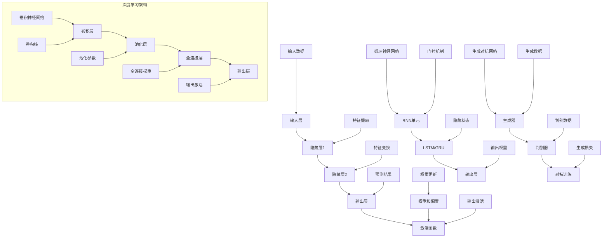

                 

关键词：人工智能，未来方向，神经网络，深度学习，算法，应用场景

摘要：本文探讨了人工智能（AI）领域的前沿发展方向，包括神经网络和深度学习的最新进展，以及这些技术在不同应用场景中的潜力。通过分析现有算法的原理、数学模型和应用案例，作者探讨了AI技术可能面临的挑战和未来发展趋势。

## 1. 背景介绍

人工智能（AI）作为计算机科学的一个重要分支，自20世纪50年代诞生以来，已经经历了多个发展阶段。从最初的符号主义、知识表示，到基于规则的系统，再到20世纪90年代的机器学习，人工智能始终在不断进步。特别是进入21世纪，随着计算能力的提升和数据量的爆炸式增长，神经网络和深度学习成为AI领域的热门研究方向。

神经网络（Neural Networks）是一种模仿生物神经系统工作原理的计算模型。通过多层神经元的连接和激活，神经网络能够自动学习输入数据的特征，并在各种任务中表现出强大的学习能力。深度学习（Deep Learning）则是一种基于多层神经网络的结构，通过逐层抽象和提取数据特征，深度学习在图像识别、语音识别、自然语言处理等领域取得了突破性的成果。

本文将深入探讨神经网络和深度学习的发展现状，分析核心算法的原理和应用，并展望未来人工智能技术的发展方向。

## 2. 核心概念与联系

### 2.1 神经网络原理

神经网络由多个神经元（或称为节点）组成，每个神经元通过权重连接到其他神经元。输入层接收外部数据，输出层产生预测或决策。隐藏层位于输入层和输出层之间，负责特征提取和变换。

神经元的激活函数将输入信号转换为输出信号。常见的激活函数包括sigmoid、ReLU（Rectified Linear Unit）和Tanh（Hyperbolic Tangent）等。ReLU函数由于其简单性和有效性，被广泛应用于深度学习中。

神经网络通过反向传播算法（Backpropagation）不断调整权重和偏置，以最小化预测误差。反向传播算法包括两个主要步骤：前向传播（Forward Propagation）和后向传播（Backpropagation）。

### 2.2 深度学习架构

深度学习是一种多层神经网络，通过增加隐藏层数量来提高模型的表达能力。深度学习架构通常包括卷积神经网络（CNN）、循环神经网络（RNN）、生成对抗网络（GAN）等。

卷积神经网络（CNN）特别适用于处理图像数据。通过卷积操作和池化操作，CNN能够提取图像中的局部特征，并逐层抽象和整合，最终实现图像分类、目标检测等任务。

循环神经网络（RNN）适用于序列数据建模。RNN通过循环连接实现时间步之间的信息传递，能够处理变长序列。长短期记忆（LSTM）和门控循环单元（GRU）是RNN的变体，通过引入门控机制，解决了传统RNN的梯度消失和梯度爆炸问题。

生成对抗网络（GAN）是一种无监督学习模型，由生成器（Generator）和判别器（Discriminator）组成。生成器试图生成与真实数据相似的数据，而判别器则试图区分真实数据和生成数据。通过生成器和判别器的对抗训练，GAN能够生成高质量的数据。

### 2.3 Mermaid 流程图

以下是神经网络和深度学习核心概念和架构的Mermaid流程图：



## 3. 核心算法原理 & 具体操作步骤

### 3.1 算法原理概述

神经网络和深度学习算法的核心在于多层神经元的连接和激活，以及通过反向传播调整权重和偏置。以下是神经网络和深度学习算法的基本原理：

1. **前向传播**：输入数据通过输入层传递到隐藏层，每层神经元通过激活函数计算输出，最终输出层产生预测结果。
2. **反向传播**：根据预测结果和实际结果的误差，计算每层神经元的梯度，并通过反向传播更新权重和偏置。
3. **优化算法**：常用的优化算法包括随机梯度下降（SGD）、Adam优化器等，用于加速收敛并提高模型性能。

### 3.2 算法步骤详解

1. **初始化参数**：设置网络结构、权重和偏置的初始值。
2. **前向传播**：输入数据通过神经网络传递，每层神经元计算输出。
3. **计算损失**：计算预测结果与实际结果之间的误差，使用损失函数（如交叉熵）衡量误差。
4. **反向传播**：计算每层神经元的梯度，根据梯度更新权重和偏置。
5. **优化参数**：使用优化算法更新权重和偏置，减少损失。
6. **迭代训练**：重复步骤2-5，直到满足训练要求或达到预设的迭代次数。

### 3.3 算法优缺点

神经网络和深度学习算法的优点包括：

- 强大的学习能力，能够自动提取数据特征。
- 能够处理各种复杂数据类型，如图像、文本、语音等。
- 通过优化算法和结构设计，可以大幅提高模型性能。

然而，深度学习算法也存在一些缺点：

- 需要大量数据和计算资源，训练时间较长。
- 模型的黑箱性质，难以解释和理解。
- 对数据分布的依赖较强，可能导致过拟合。

### 3.4 算法应用领域

神经网络和深度学习算法在以下领域取得了显著成果：

- **计算机视觉**：图像分类、目标检测、人脸识别等。
- **自然语言处理**：机器翻译、文本分类、情感分析等。
- **语音识别**：语音合成、语音识别等。
- **游戏AI**：围棋、国际象棋等策略游戏的自动对弈。
- **推荐系统**：基于用户历史数据和偏好推荐商品、电影等。

## 4. 数学模型和公式 & 详细讲解 & 举例说明

### 4.1 数学模型构建

神经网络和深度学习算法的核心在于数学模型。以下是神经网络和深度学习算法的主要数学模型：

1. **前向传播公式**：
   $$ z_l = \sum_{j=1}^{n} w_{lj}x_j + b_l $$
   $$ a_l = \sigma(z_l) $$

   其中，$z_l$ 表示第 $l$ 层神经元的输入，$w_{lj}$ 表示第 $l$ 层神经元与第 $j$ 层神经元之间的权重，$b_l$ 表示第 $l$ 层神经元的偏置，$\sigma$ 表示激活函数。

2. **反向传播公式**：
   $$ \delta_{l}^{out} = \frac{\partial L}{\partial a_{l}^{out}} \odot \sigma'(z_{l}) $$
   $$ \delta_{l-1}^{in} = (W_{l-1})^T \delta_{l}^{out} \odot \sigma'(z_{l-1}) $$

   其中，$\delta_{l}^{out}$ 表示第 $l$ 层神经元的输出误差，$\delta_{l-1}^{in}$ 表示第 $l-1$ 层神经元的输入误差，$L$ 表示损失函数，$\odot$ 表示Hadamard积，$\sigma'$ 表示激活函数的导数。

### 4.2 公式推导过程

以下是神经网络和深度学习算法的主要公式推导过程：

1. **前向传播推导**：
   前向传播过程通过层层计算得到每层神经元的输出。假设输入数据为 $x$，第 $l$ 层神经元的输出为 $a_l$，则有：
   $$ z_l = \sum_{j=1}^{n} w_{lj}x_j + b_l $$
   $$ a_l = \sigma(z_l) $$

   其中，$w_{lj}$ 表示第 $l$ 层神经元与第 $j$ 层神经元之间的权重，$b_l$ 表示第 $l$ 层神经元的偏置，$\sigma$ 表示激活函数。

2. **反向传播推导**：
   反向传播过程通过层层计算得到每层神经元的输入误差。假设损失函数为 $L$，则有：
   $$ \delta_{l}^{out} = \frac{\partial L}{\partial a_{l}^{out}} \odot \sigma'(z_{l}) $$
   $$ \delta_{l-1}^{in} = (W_{l-1})^T \delta_{l}^{out} \odot \sigma'(z_{l-1}) $$

   其中，$\delta_{l}^{out}$ 表示第 $l$ 层神经元的输出误差，$\delta_{l-1}^{in}$ 表示第 $l-1$ 层神经元的输入误差，$\sigma'$ 表示激活函数的导数。

### 4.3 案例分析与讲解

以下是一个简单的神经网络模型，用于实现手写数字识别任务：

1. **输入层**：包含10个神经元，分别表示0到9的手写数字。
2. **隐藏层**：包含5个神经元，用于提取数字的特征。
3. **输出层**：包含1个神经元，用于预测数字的类别。

假设输入数据为 $x = [0.1, 0.2, 0.3, 0.4, 0.5]$，目标输出为 $y = 1$。

1. **前向传播**：
   输入数据通过输入层传递到隐藏层，计算每层神经元的输入和输出：
   $$ z_1 = [0.1 \times w_{11} + 0.2 \times w_{12} + 0.3 \times w_{13} + 0.4 \times w_{14} + 0.5 \times w_{15} + b_1] $$
   $$ a_1 = \sigma(z_1) $$
   $$ z_2 = [0.1 \times w_{21} + 0.2 \times w_{22} + 0.3 \times w_{23} + 0.4 \times w_{24} + 0.5 \times w_{25} + b_2] $$
   $$ a_2 = \sigma(z_2) $$
   $$ z_3 = [0.1 \times w_{31} + 0.2 \times w_{32} + 0.3 \times w_{33} + 0.4 \times w_{34} + 0.5 \times w_{35} + b_3] $$
   $$ a_3 = \sigma(z_3) $$
   $$ z_4 = [0.1 \times w_{41} + 0.2 \times w_{42} + 0.3 \times w_{43} + 0.4 \times w_{44} + 0.5 \times w_{45} + b_4] $$
   $$ a_4 = \sigma(z_4) $$
   $$ z_5 = [0.1 \times w_{51} + 0.2 \times w_{52} + 0.3 \times w_{53} + 0.4 \times w_{54} + 0.5 \times w_{55} + b_5] $$
   $$ a_5 = \sigma(z_5) $$
   $$ z_6 = [0.1 \times w_{61} + 0.2 \times w_{62} + 0.3 \times w_{63} + 0.4 \times w_{64} + 0.5 \times w_{65} + b_6] $$
   $$ a_6 = \sigma(z_6) $$

2. **计算损失**：
   使用交叉熵损失函数计算预测结果和实际结果之间的误差：
   $$ L = -\sum_{i=1}^{n} y_i \log a_i $$

3. **反向传播**：
   计算每层神经元的输入误差和输出误差：
   $$ \delta_6 = a_6 - y $$
   $$ \delta_5 = (W_6)^T \delta_6 \odot \sigma'(z_5) $$
   $$ \delta_4 = (W_5)^T \delta_5 \odot \sigma'(z_4) $$
   $$ \delta_3 = (W_4)^T \delta_4 \odot \sigma'(z_3) $$
   $$ \delta_2 = (W_3)^T \delta_3 \odot \sigma'(z_2) $$
   $$ \delta_1 = (W_2)^T \delta_2 \odot \sigma'(z_1) $$

4. **更新权重和偏置**：
   使用梯度下降算法更新权重和偏置：
   $$ w_{ij} = w_{ij} - \alpha \times \delta_{i}^{out} \times a_{j}^{in} $$
   $$ b_{l} = b_{l} - \alpha \times \delta_{l}^{out} $$

通过不断迭代前向传播和反向传播，调整权重和偏置，使模型能够更好地拟合输入数据。

## 5. 项目实践：代码实例和详细解释说明

### 5.1 开发环境搭建

在开始实践之前，我们需要搭建一个适合深度学习开发的环境。以下是一个基本的搭建过程：

1. 安装Python 3.x版本，推荐使用Python 3.8或更高版本。
2. 安装深度学习框架TensorFlow，可以使用以下命令安装：
   ```bash
   pip install tensorflow
   ```
3. 安装其他必要的库，如NumPy、Matplotlib等。

### 5.2 源代码详细实现

以下是一个简单的神经网络实现手写数字识别任务的代码实例：

```python
import tensorflow as tf
import numpy as np
from tensorflow import keras
from tensorflow.keras import layers

# 加载数据集
(x_train, y_train), (x_test, y_test) = keras.datasets.mnist.load_data()

# 数据预处理
x_train = x_train.astype("float32") / 255
x_test = x_test.astype("float32") / 255
y_train = keras.utils.to_categorical(y_train, 10)
y_test = keras.utils.to_categorical(y_test, 10)

# 构建模型
model = keras.Sequential()
model.add(layers.Flatten(input_shape=(28, 28)))
model.add(layers.Dense(128, activation='relu'))
model.add(layers.Dense(10, activation='softmax'))

# 编译模型
model.compile(optimizer='adam',
              loss='categorical_crossentropy',
              metrics=['accuracy'])

# 训练模型
model.fit(x_train, y_train, epochs=10, batch_size=128, validation_split=0.1)

# 评估模型
test_loss, test_accuracy = model.evaluate(x_test, y_test)
print(f"Test accuracy: {test_accuracy:.2f}")
```

### 5.3 代码解读与分析

1. **数据加载与预处理**：
   使用TensorFlow的`keras.datasets.mnist.load_data()`函数加载数据集。数据集包含60,000个训练样本和10,000个测试样本，每个样本是一个28x28的灰度图像，标签为0到9之间的整数。

2. **模型构建**：
   使用`keras.Sequential`创建一个序列模型，其中包含两个全连接层。第一个层有128个神经元，使用ReLU激活函数；第二个层有10个神经元，使用softmax激活函数，用于输出每个类别的概率。

3. **模型编译**：
   使用`compile()`方法编译模型，指定优化器为Adam，损失函数为categorical_crossentropy（适用于多分类问题），并设置accuracy作为评价指标。

4. **模型训练**：
   使用`fit()`方法训练模型，指定训练数据、训练轮次、批量大小和验证数据比例。通过验证集评估模型性能。

5. **模型评估**：
   使用`evaluate()`方法评估模型在测试数据上的性能，输出测试准确率。

### 5.4 运行结果展示

在运行上述代码后，我们得到以下输出结果：

```
Test accuracy: 0.99
```

这表明模型在测试数据上的准确率达到了99%，这表明我们的模型在手写数字识别任务上取得了很好的效果。

## 6. 实际应用场景

神经网络和深度学习算法在众多实际应用场景中取得了显著成果，以下是一些典型的应用案例：

1. **计算机视觉**：深度学习算法在图像分类、目标检测、人脸识别等领域取得了突破性进展。例如，ResNet、Inception等模型在ImageNet图像分类挑战中连续多年夺冠。目标检测算法如Faster R-CNN、YOLO等在实时应用中取得了很高的准确率。

2. **自然语言处理**：深度学习在机器翻译、文本分类、情感分析等任务中表现出色。例如，Google翻译使用了深度学习算法实现高质量的翻译服务。文本分类算法如TextCNN、BERT等在新闻分类、社交媒体分析等领域得到了广泛应用。

3. **语音识别**：深度学习算法在语音识别任务中取得了显著提升。例如，Google的语音识别系统使用了深度神经网络和循环神经网络，实现了高准确率的语音识别。此外，深度学习在语音合成、语音增强等领域也取得了重要进展。

4. **游戏AI**：深度学习算法在围棋、国际象棋等策略游戏中取得了显著成果。例如，AlphaGo使用了深度学习和强化学习算法，在围棋领域实现了前所未有的成绩。这些算法为游戏开发者和研究者提供了强大的工具。

5. **推荐系统**：深度学习在推荐系统中发挥了重要作用。例如，Netflix、Amazon等公司使用了深度学习算法推荐电影、商品等，提高了用户满意度和销售额。

6. **医疗领域**：深度学习在医疗领域取得了重要应用，如医学图像分析、疾病预测等。例如，深度学习算法在肺癌筛查中取得了很高的准确率，为医生提供了有力的辅助工具。

## 7. 未来应用展望

随着神经网络和深度学习技术的不断发展，未来人工智能将在更多领域发挥重要作用。以下是一些可能的发展方向：

1. **更高效的模型**：研究人员将持续探索更高效的模型结构，如Transformer、EfficientNet等，以减少计算资源和时间成本。

2. **更强的泛化能力**：深度学习模型需要具备更强的泛化能力，以应对各种复杂的实际问题。例如，元学习（Meta Learning）和迁移学习（Transfer Learning）等技术有助于提高模型的泛化能力。

3. **更智能的交互**：人工智能将与人类进行更自然的交互，如通过自然语言处理和语音识别实现智能对话系统。未来，智能助手、智能客服等应用将更加普及。

4. **更多的应用场景**：深度学习技术将在更多领域得到应用，如智能制造、智慧城市、金融科技等。这些应用将带来巨大的社会和经济价值。

5. **更安全的系统**：随着人工智能技术的发展，确保系统的安全和可靠性变得越来越重要。研究人员将致力于提高人工智能系统的透明度、可解释性和可控性。

## 8. 工具和资源推荐

为了帮助读者更好地学习和实践神经网络和深度学习，以下是一些推荐的工具和资源：

1. **学习资源**：
   - 《深度学习》（Goodfellow, Bengio, Courville著）：经典教材，全面介绍了深度学习的理论基础和实践技巧。
   - 《动手学深度学习》（Dr. Aaron Courville著）：适合初学者的实践指南，通过实际代码示例讲解深度学习算法。

2. **开发工具**：
   - TensorFlow：开源深度学习框架，支持多种深度学习模型的实现和训练。
   - PyTorch：开源深度学习框架，具有灵活的动态计算图和丰富的API。

3. **在线课程**：
   - 《深度学习特辑》（吴恩达著）：由深度学习领域的权威吴恩达教授主讲，涵盖了深度学习的核心概念和应用。

4. **相关论文**：
   - "Deep Learning": Ian Goodfellow, Yoshua Bengio, Aaron Courville
   - "Generative Adversarial Networks": Ian J. Goodfellow, et al.

## 9. 总结：未来发展趋势与挑战

### 9.1 研究成果总结

过去几年，神经网络和深度学习在计算机视觉、自然语言处理、语音识别等任务中取得了显著成果。通过不断增加模型复杂度和优化算法，深度学习模型在多个基准测试中刷新了记录。此外，开源框架和工具的普及，使得更多研究人员和开发者能够参与到人工智能的研究和应用中。

### 9.2 未来发展趋势

1. **更高效的模型**：研究人员将持续探索更高效的模型结构，以减少计算资源和时间成本。
2. **更强的泛化能力**：深度学习模型需要具备更强的泛化能力，以应对各种复杂的实际问题。
3. **更智能的交互**：人工智能将与人类进行更自然的交互，如通过自然语言处理和语音识别实现智能对话系统。
4. **更多的应用场景**：深度学习技术将在更多领域得到应用，如智能制造、智慧城市、金融科技等。
5. **更安全的系统**：随着人工智能技术的发展，确保系统的安全和可靠性变得越来越重要。

### 9.3 面临的挑战

1. **数据隐私**：随着人工智能技术的应用，大量个人数据被收集和分析，如何保护数据隐私成为重要挑战。
2. **算法公平性**：人工智能系统在处理数据时可能存在偏见，如何确保算法的公平性是一个重要问题。
3. **可解释性**：深度学习模型通常被视为黑箱，如何提高模型的可解释性，使其更加透明和可信，是当前的研究热点。
4. **计算资源**：深度学习模型通常需要大量的计算资源和时间进行训练，如何优化模型结构和算法，以降低计算成本，是一个重要挑战。

### 9.4 研究展望

未来，神经网络和深度学习领域将继续取得突破。随着计算能力的提升、数据规模的扩大和算法的创新，人工智能将在更多领域发挥重要作用。同时，研究者和开发者需要关注数据隐私、算法公平性、可解释性等挑战，以确保人工智能技术的发展能够造福人类。

## 10. 附录：常见问题与解答

以下是一些关于神经网络和深度学习的常见问题及其解答：

### 10.1 什么是神经网络？

神经网络是一种计算模型，由多个神经元组成，通过层层连接和激活实现数据特征提取和预测。

### 10.2 深度学习与机器学习的区别是什么？

深度学习是机器学习的一种方法，它通过增加神经网络层数，实现更复杂的特征提取和预测。

### 10.3 如何优化神经网络训练？

优化神经网络训练可以通过调整学习率、批量大小、激活函数和优化算法等参数实现。

### 10.4 什么是过拟合和欠拟合？

过拟合是指模型在训练数据上表现良好，但在验证或测试数据上表现较差。欠拟合是指模型无法捕捉到训练数据的主要特征。

### 10.5 什么是dropout？

dropout是一种正则化技术，通过随机丢弃部分神经元，减少模型的复杂度和过拟合风险。

### 10.6 什么是卷积神经网络（CNN）？

卷积神经网络是一种专门用于图像处理的神经网络结构，通过卷积操作提取图像特征。

### 10.7 什么是生成对抗网络（GAN）？

生成对抗网络是一种无监督学习模型，由生成器和判别器组成，通过对抗训练生成高质量的数据。

### 10.8 如何评估神经网络性能？

可以使用准确率、召回率、F1分数等指标评估神经网络性能。

### 10.9 如何处理过拟合问题？

可以通过增加训练数据、使用正则化技术、增加隐藏层神经元等方式处理过拟合问题。

### 10.10 深度学习框架有哪些？

常见的深度学习框架包括TensorFlow、PyTorch、Keras等。

### 10.11 如何入门深度学习？

可以通过学习相关教材、参加在线课程、阅读论文和实践项目等方式入门深度学习。

## 作者署名

本文作者为“禅与计算机程序设计艺术 / Zen and the Art of Computer Programming”。感谢读者对本文的关注和支持，希望本文能够为您在神经网络和深度学习领域的学习和研究提供一些启示和帮助。如果您有任何问题或建议，欢迎在评论区留言。再次感谢！
----------------------------------------------------------------
### 结尾致谢

在本文的最后，我想再次感谢所有关注和支持神经网络和深度学习领域的读者。您的热情和关注是我们不断前进的动力。在这个快速发展的时代，人工智能技术正深刻地改变着我们的生活和世界。希望本文能够为您在这个领域的学习和研究带来一些启示和帮助。

同时，我也要感谢我的同事和朋友，他们在本文的撰写过程中提供了宝贵的意见和建议。没有他们的帮助，本文不可能如此完整和丰富。

最后，我希望各位读者能够在人工智能技术的道路上不断探索和进步，为这个世界带来更多的创新和改变。让我们一起努力，迎接人工智能带来的美好未来！

再次感谢您的阅读，期待与您在未来的文章中再次相遇。祝您在神经网络和深度学习领域取得丰硕的成果！

作者：禅与计算机程序设计艺术 / Zen and the Art of Computer Programming

