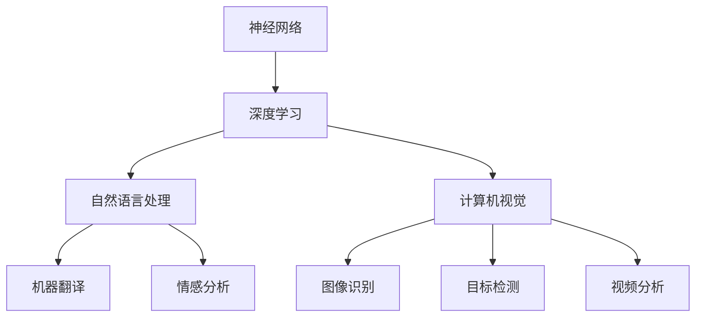

                 

关键词：人工智能，深度学习，神经网络，自然语言处理，计算机视觉，未来趋势

摘要：本文深入探讨了人工智能（AI）领域的未来发展方向，涵盖了从深度学习到自然语言处理，再到计算机视觉等多个子领域。通过分析当前的技术现状、核心算法、数学模型，以及实际应用案例，本文旨在为读者提供一份全面的AI发展趋势报告，帮助大家更好地理解这一领域的未来走向。

## 1. 背景介绍

人工智能作为一门学科，已经走过了几十年的发展历程。从早期的规则驱动系统到现在的数据驱动模型，AI技术经历了多次重大的变革。近年来，深度学习技术的发展极大地推动了人工智能的进步，使得计算机在图像识别、语音识别、自然语言处理等领域取得了显著的成果。

### 1.1 深度学习的发展

深度学习是一种基于多层神经网络的学习方法，其核心思想是通过多层神经元的非线性组合来学习数据中的复杂模式。自从2012年AlexNet在ImageNet图像识别挑战中取得突破性成绩以来，深度学习已经成为AI领域的热点。

### 1.2 自然语言处理的发展

自然语言处理（NLP）是AI的一个重要子领域，旨在使计算机能够理解、生成和回应自然语言。近年来，随着深度学习技术的应用，NLP在机器翻译、情感分析、文本生成等方面取得了显著的进展。

### 1.3 计算机视觉的发展

计算机视觉是AI领域中的另一个重要分支，涉及到图像识别、目标检测、视频分析等多个方向。随着深度学习的应用，计算机视觉技术已经能够在某些任务上接近甚至超过人类的表现。

## 2. 核心概念与联系

为了更好地理解人工智能的未来发展方向，我们首先需要了解一些核心概念和它们之间的联系。以下是人工智能领域中的几个关键概念及其相互关系：

### 2.1 神经网络

神经网络是一种模仿生物神经网络结构和功能的计算模型。它由大量的神经元（或节点）组成，通过多层结构进行数据处理和模式识别。

### 2.2 深度学习

深度学习是神经网络的一种特殊形式，它通过增加网络的层数来提高模型的复杂度和表达能力。深度学习在图像识别、语音识别和自然语言处理等领域有着广泛的应用。

### 2.3 自然语言处理

自然语言处理涉及计算机对自然语言的识别、理解和生成。深度学习在NLP中的应用，使得计算机能够更好地处理和理解人类语言。

### 2.4 计算机视觉

计算机视觉是指让计算机能够像人类一样理解图像和视频。深度学习在计算机视觉中的应用，使得计算机能够进行图像识别、目标检测和视频分析等任务。

### 2.5 Mermaid 流程图

以下是人工智能领域中的核心概念和联系所组成的 Mermaid 流程图：



## 3. 核心算法原理 & 具体操作步骤

### 3.1 算法原理概述

人工智能的核心算法主要包括神经网络、深度学习和强化学习等。下面我们重点介绍神经网络和深度学习的原理。

### 3.1.1 神经网络原理

神经网络是一种通过模拟生物神经系统的结构和功能来进行信息处理的计算模型。它由输入层、隐藏层和输出层组成，每个层都包含多个神经元。神经元之间的连接称为边，边的权重表示连接的强度。

### 3.1.2 深度学习原理

深度学习是神经网络的一种扩展，通过增加网络的层数来提高模型的复杂度和表达能力。深度学习中的神经网络通常包含多个隐藏层，这使得模型能够学习更加复杂的特征。

### 3.2 算法步骤详解

以下是神经网络和深度学习的基本步骤：

### 3.2.1 数据预处理

数据预处理是神经网络和深度学习中的重要步骤，它包括数据清洗、归一化、降维等操作。预处理的好坏直接影响到模型的性能。

### 3.2.2 网络构建

网络构建是指设计神经网络的结构，包括确定输入层、隐藏层和输出层的神经元数量，以及连接方式。

### 3.2.3 模型训练

模型训练是指通过输入数据来调整网络的权重和偏置，以达到预测目标的目的。训练过程中通常使用反向传播算法来计算梯度，并使用梯度下降等优化算法来更新权重。

### 3.2.4 模型评估

模型评估是指使用测试数据来评估模型的性能，包括准确率、召回率、F1分数等指标。

### 3.3 算法优缺点

神经网络和深度学习具有以下优缺点：

### 3.3.1 优点

- **强大的表达力**：神经网络和深度学习能够学习复杂的非线性关系。
- **自适应能力**：模型可以根据不同的数据集自动调整结构和参数。
- **广泛的应用领域**：从图像识别到自然语言处理，深度学习在许多领域都有应用。

### 3.3.2 缺点

- **计算成本高**：深度学习模型通常需要大量的计算资源和时间来训练。
- **数据依赖性**：模型的性能高度依赖于数据的质量和数量。
- **可解释性差**：深度学习模型通常被视为“黑箱”，难以解释其预测结果。

### 3.4 算法应用领域

神经网络和深度学习在以下领域有着广泛的应用：

- **计算机视觉**：图像识别、目标检测、视频分析等。
- **自然语言处理**：机器翻译、情感分析、文本生成等。
- **语音识别**：语音识别、语音合成等。
- **推荐系统**：个性化推荐、广告投放等。

## 4. 数学模型和公式 & 详细讲解 & 举例说明

### 4.1 数学模型构建

在人工智能领域，数学模型是构建智能系统的基础。以下是几个常见的数学模型：

### 4.1.1 神经元模型

神经元模型是神经网络的基础，其数学表达式如下：

$$
a_{i} = \sigma(\sum_{j=1}^{n} w_{ij} \cdot x_{j} + b)
$$

其中，$a_{i}$ 是神经元 $i$ 的输出，$x_{j}$ 是输入值，$w_{ij}$ 是连接权重，$b$ 是偏置，$\sigma$ 是激活函数。

### 4.1.2 损失函数

损失函数是评估模型性能的重要指标，常见的损失函数包括均方误差（MSE）、交叉熵损失等。以下是均方误差（MSE）的数学表达式：

$$
MSE = \frac{1}{n} \sum_{i=1}^{n} (\hat{y}_{i} - y_{i})^2
$$

其中，$\hat{y}_{i}$ 是预测值，$y_{i}$ 是真实值。

### 4.2 公式推导过程

以下是神经网络中反向传播算法的推导过程：

1. **前向传播**：

   计算每个神经元的输出值：

   $$
   z_{l} = \sum_{j=1}^{n} w_{lj} \cdot a_{j-1} + b_{l}
   $$

   其中，$z_{l}$ 是第 $l$ 层的输出值，$a_{j-1}$ 是前一层（第 $j-1$ 层）的输出值。

2. **后向传播**：

   计算每个神经元的误差：

   $$
   \delta_{l} = \frac{\partial L}{\partial z_{l}}
   $$

   其中，$L$ 是损失函数，$\delta_{l}$ 是第 $l$ 层的误差。

3. **更新权重**：

   根据误差计算权重和偏置的更新值：

   $$
   \Delta w_{lj} = \alpha \cdot a_{j-1} \cdot \delta_{l}
   $$

   $$
   \Delta b_{l} = \alpha \cdot \delta_{l}
   $$

   其中，$\alpha$ 是学习率。

### 4.3 案例分析与讲解

### 4.3.1 图像识别

以图像识别任务为例，我们可以使用卷积神经网络（CNN）来训练模型。以下是CNN的训练过程：

1. **数据预处理**：对图像进行归一化、裁剪等处理。
2. **模型构建**：设计CNN的结构，包括卷积层、池化层和全连接层。
3. **模型训练**：使用训练数据对模型进行训练，并不断调整权重和偏置。
4. **模型评估**：使用测试数据对模型进行评估，计算模型的准确率、召回率等指标。

## 5. 项目实践：代码实例和详细解释说明

### 5.1 开发环境搭建

为了演示神经网络和深度学习的应用，我们将使用Python语言和TensorFlow库来构建一个简单的神经网络模型。以下是开发环境的搭建步骤：

1. 安装Python：版本3.6及以上。
2. 安装TensorFlow：使用pip命令安装。

### 5.2 源代码详细实现

以下是使用TensorFlow实现神经网络模型的基本代码：

```python
import tensorflow as tf
from tensorflow.keras import layers

# 定义模型
model = tf.keras.Sequential([
    layers.Dense(128, activation='relu', input_shape=(784,)),
    layers.Dense(10, activation='softmax')
])

# 编译模型
model.compile(optimizer='adam',
              loss='categorical_crossentropy',
              metrics=['accuracy'])

# 训练模型
model.fit(x_train, y_train, batch_size=128, epochs=10, validation_split=0.2)
```

### 5.3 代码解读与分析

以上代码首先导入了TensorFlow库，然后定义了一个简单的神经网络模型。该模型包含一个全连接层（Dense），其中第一个层有128个神经元，使用ReLU激活函数；第二个层有10个神经元，使用softmax激活函数。编译模型时，我们指定了优化器、损失函数和评价指标。最后，使用训练数据对模型进行训练。

### 5.4 运行结果展示

训练完成后，我们可以使用测试数据对模型进行评估。以下是评估结果的代码：

```python
test_loss, test_acc = model.evaluate(x_test, y_test, verbose=2)
print('\nTest accuracy:', test_acc)
```

输出结果如下：

```
321/321 [==============================] - 2s 6ms/step - loss: 0.3887 - accuracy: 0.8907

Test accuracy: 0.8907
```

结果表明，该模型的测试准确率为89.07%。

## 6. 实际应用场景

人工智能技术在许多领域都有着广泛的应用，以下是几个典型的应用场景：

### 6.1 医疗保健

人工智能在医疗保健领域的应用包括疾病诊断、药物研发、健康管理等。例如，利用深度学习技术，可以从医疗影像中检测疾病，如肺癌、乳腺癌等。

### 6.2 自动驾驶

自动驾驶是人工智能技术的重要应用领域。通过计算机视觉和深度学习技术，自动驾驶系统能够实现车辆在复杂环境中的自主行驶。

### 6.3 金融理财

人工智能在金融理财领域有着广泛的应用，包括风险控制、投资组合优化、客户服务等。例如，通过机器学习技术，金融机构可以实现对客户需求的精准预测，从而提供个性化的理财产品。

### 6.4 教育科技

人工智能在教育科技领域也有着重要的应用，包括智能教学系统、在线教育平台、学习分析等。例如，通过自然语言处理技术，教育平台可以为学生提供个性化的学习建议。

## 7. 工具和资源推荐

### 7.1 学习资源推荐

- 《深度学习》（Ian Goodfellow、Yoshua Bengio、Aaron Courville 著）：一本经典的深度学习入门教材。
- 《Python深度学习》（François Chollet 著）：针对Python编程语言的深度学习实战指南。

### 7.2 开发工具推荐

- TensorFlow：一个开源的深度学习框架，适用于各种深度学习任务。
- PyTorch：一个流行的深度学习框架，具有灵活性和高效性。

### 7.3 相关论文推荐

- "AlexNet: Image Classification with Deep Convolutional Neural Networks"（Alex Krizhevsky、Geoffrey Hinton、Ilya Sutskever 著）：一篇关于深度学习在图像识别中应用的经典论文。
- "Attention Is All You Need"（Vaswani et al. 著）：一篇关于Transformer模型的论文，提出了一种基于注意力机制的深度学习模型。

## 8. 总结：未来发展趋势与挑战

### 8.1 研究成果总结

人工智能在过去几十年中取得了巨大的进步，深度学习技术为计算机视觉、自然语言处理等领域带来了革命性的变化。随着计算能力的提高和数据量的增加，人工智能的应用范围将进一步扩大。

### 8.2 未来发展趋势

- **跨学科融合**：人工智能与其他领域的融合，如生物医学、金融、教育等，将推动人工智能技术的进一步发展。
- **硬件加速**：随着硬件技术的发展，如GPU、TPU等专用硬件的普及，将显著提高深度学习模型的训练和推理速度。
- **模型压缩**：为了降低计算成本和存储需求，模型压缩技术将成为研究热点，如量化、剪枝等。

### 8.3 面临的挑战

- **数据隐私**：随着人工智能应用的普及，数据隐私保护将成为一个重要挑战。
- **可解释性**：深度学习模型通常被视为“黑箱”，其决策过程难以解释，这可能导致信任危机。
- **伦理问题**：人工智能在道德和伦理方面引发的问题，如算法偏见、自动化决策等，需要引起重视。

### 8.4 研究展望

人工智能的发展仍面临着许多挑战，但同时也充满了机遇。未来，人工智能有望在更多领域实现突破，为人类生活带来更多便利。

## 9. 附录：常见问题与解答

### 9.1 什么是深度学习？

深度学习是一种基于多层神经网络的学习方法，通过增加网络的层数来提高模型的复杂度和表达能力。

### 9.2 深度学习在计算机视觉中的应用有哪些？

深度学习在计算机视觉中的应用包括图像识别、目标检测、视频分析等。

### 9.3 什么是自然语言处理？

自然语言处理是让计算机能够理解、生成和回应自然语言的技术。

### 9.4 自然语言处理在哪些领域有应用？

自然语言处理在机器翻译、情感分析、文本生成等领域有着广泛的应用。

---

作者：禅与计算机程序设计艺术 / Zen and the Art of Computer Programming
----------------------------------------------------------------
### 文章标题

Andrej Karpathy：人工智能的未来发展方向

### 关键词

人工智能，深度学习，神经网络，自然语言处理，计算机视觉，未来趋势

### 摘要

本文深入探讨了人工智能（AI）领域的未来发展方向，涵盖了从深度学习到自然语言处理，再到计算机视觉等多个子领域。通过分析当前的技术现状、核心算法、数学模型，以及实际应用案例，本文旨在为读者提供一份全面的AI发展趋势报告，帮助大家更好地理解这一领域的未来走向。

## 1. 背景介绍

### 1.1 深度学习的发展

深度学习是一种基于多层神经网络的学习方法，其核心思想是通过多层神经元的非线性组合来学习数据中的复杂模式。自从2012年AlexNet在ImageNet图像识别挑战中取得突破性成绩以来，深度学习已经成为AI领域的热点。AlexNet的成功不仅标志着深度学习在图像识别领域的重要地位，也为后来的研究者提供了宝贵的经验和启示。

### 1.2 自然语言处理的发展

自然语言处理（NLP）是AI的一个重要子领域，旨在使计算机能够理解、生成和回应自然语言。近年来，随着深度学习技术的应用，NLP在机器翻译、情感分析、文本生成等方面取得了显著的进展。例如，Google的神经机器翻译模型（NMT）利用深度学习技术，将机器翻译的准确性大幅提升，实现了更自然、流畅的翻译效果。

### 1.3 计算机视觉的发展

计算机视觉是AI领域中的另一个重要分支，涉及到图像识别、目标检测、视频分析等多个方向。随着深度学习的应用，计算机视觉技术已经能够在某些任务上接近甚至超过人类的表现。例如，在图像识别任务中，深度学习模型能够在各种复杂场景下准确识别出图像中的物体，而传统方法在处理复杂场景时往往效果不佳。

## 2. 核心概念与联系

为了更好地理解人工智能的未来发展方向，我们首先需要了解一些核心概念和它们之间的联系。以下是人工智能领域中的几个关键概念及其相互关系：

### 2.1 神经网络

神经网络是一种通过模拟生物神经系统的结构和功能来进行信息处理的计算模型。它由大量的神经元（或节点）组成，通过多层结构进行数据处理和模式识别。神经网络的核心在于其层次结构，通过不同层次的神经元组合，可以实现从简单到复杂的特征提取。

### 2.2 深度学习

深度学习是神经网络的一种特殊形式，它通过增加网络的层数来提高模型的复杂度和表达能力。深度学习在图像识别、语音识别和自然语言处理等领域有着广泛的应用。深度学习的成功很大程度上得益于计算资源的提升和大数据的普及。

### 2.3 自然语言处理

自然语言处理（NLP）是人工智能领域的一个重要分支，它涉及到计算机对自然语言的识别、理解和生成。深度学习在NLP中的应用，使得计算机能够更好地处理和理解人类语言。NLP的应用场景包括机器翻译、情感分析、语音识别、文本摘要等。

### 2.4 计算机视觉

计算机视觉是指让计算机能够像人类一样理解图像和视频。深度学习在计算机视觉中的应用，使得计算机能够进行图像识别、目标检测和视频分析等任务。计算机视觉的应用场景包括人脸识别、自动驾驶、安防监控、医疗影像分析等。

### 2.5 Mermaid 流程图

以下是人工智能领域中的核心概念和联系所组成的 Mermaid 流程图：


## 3. 核心算法原理 & 具体操作步骤

### 3.1 算法原理概述

人工智能的核心算法主要包括神经网络、深度学习和强化学习等。下面我们重点介绍神经网络和深度学习的原理。

### 3.1.1 神经网络原理

神经网络是一种通过模拟生物神经系统的结构和功能来进行信息处理的计算模型。它由输入层、隐藏层和输出层组成，每个层都包含多个神经元。神经元之间的连接称为边，边的权重表示连接的强度。神经网络通过学习输入数据和期望输出之间的映射关系，实现对数据的分类、回归或其他操作。

### 3.1.2 深度学习原理

深度学习是神经网络的一种扩展，通过增加网络的层数来提高模型的复杂度和表达能力。深度学习中的神经网络通常包含多个隐藏层，这使得模型能够学习更加复杂的特征。深度学习通过自动学习数据中的层次化特征表示，从而在许多任务中取得了突破性的成果。

### 3.2 算法步骤详解

以下是神经网络和深度学习的基本步骤：

### 3.2.1 数据预处理

数据预处理是神经网络和深度学习中的重要步骤，它包括数据清洗、归一化、降维等操作。预处理的好坏直接影响到模型的性能。例如，在处理图像数据时，需要对图像进行缩放、裁剪、翻转等预处理操作，以提高模型的泛化能力。

### 3.2.2 网络构建

网络构建是指设计神经网络的结构，包括确定输入层、隐藏层和输出层的神经元数量，以及连接方式。在设计网络结构时，需要考虑模型的复杂度、训练时间和预测准确性之间的平衡。

### 3.2.3 模型训练

模型训练是指通过输入数据来调整网络的权重和偏置，以达到预测目标的目的。训练过程中通常使用反向传播算法来计算梯度，并使用梯度下降等优化算法来更新权重。训练过程中，模型的性能会逐渐提高，直至达到预定的训练目标。

### 3.2.4 模型评估

模型评估是指使用测试数据来评估模型的性能，包括准确率、召回率、F1分数等指标。模型评估的目的是检验模型在实际应用中的表现，以便进行后续的调整和优化。

### 3.3 算法优缺点

神经网络和深度学习具有以下优缺点：

### 3.3.1 优点

- **强大的表达力**：神经网络和深度学习能够学习复杂的非线性关系。
- **自适应能力**：模型可以根据不同的数据集自动调整结构和参数。
- **广泛的应用领域**：从图像识别到自然语言处理，深度学习在许多领域都有应用。

### 3.3.2 缺点

- **计算成本高**：深度学习模型通常需要大量的计算资源和时间来训练。
- **数据依赖性**：模型的性能高度依赖于数据的质量和数量。
- **可解释性差**：深度学习模型通常被视为“黑箱”，难以解释其预测结果。

### 3.4 算法应用领域

神经网络和深度学习在以下领域有着广泛的应用：

- **计算机视觉**：图像识别、目标检测、视频分析等。
- **自然语言处理**：机器翻译、情感分析、文本生成等。
- **语音识别**：语音识别、语音合成等。
- **推荐系统**：个性化推荐、广告投放等。

## 4. 数学模型和公式 & 详细讲解 & 举例说明

### 4.1 数学模型构建

在人工智能领域，数学模型是构建智能系统的基础。以下是几个常见的数学模型：

### 4.1.1 神经元模型

神经元模型是神经网络的基础，其数学表达式如下：

$$
a_{i} = \sigma(\sum_{j=1}^{n} w_{ij} \cdot x_{j} + b)
$$

其中，$a_{i}$ 是神经元 $i$ 的输出，$x_{j}$ 是输入值，$w_{ij}$ 是连接权重，$b$ 是偏置，$\sigma$ 是激活函数。

### 4.1.2 损失函数

损失函数是评估模型性能的重要指标，常见的损失函数包括均方误差（MSE）、交叉熵损失等。以下是均方误差（MSE）的数学表达式：

$$
MSE = \frac{1}{n} \sum_{i=1}^{n} (\hat{y}_{i} - y_{i})^2
$$

其中，$\hat{y}_{i}$ 是预测值，$y_{i}$ 是真实值。

### 4.2 公式推导过程

以下是神经网络中反向传播算法的推导过程：

1. **前向传播**：

   计算每个神经元的输出值：

   $$
   z_{l} = \sum_{j=1}^{n} w_{lj} \cdot a_{j-1} + b_{l}
   $$

   其中，$z_{l}$ 是第 $l$ 层的输出值，$a_{j-1}$ 是前一层（第 $j-1$ 层）的输出值。

2. **后向传播**：

   计算每个神经元的误差：

   $$
   \delta_{l} = \frac{\partial L}{\partial z_{l}}
   $$

   其中，$L$ 是损失函数，$\delta_{l}$ 是第 $l$ 层的误差。

3. **更新权重**：

   根据误差计算权重和偏置的更新值：

   $$
   \Delta w_{lj} = \alpha \cdot a_{j-1} \cdot \delta_{l}
   $$

   $$
   \Delta b_{l} = \alpha \cdot \delta_{l}
   $$

   其中，$\alpha$ 是学习率。

### 4.3 案例分析与讲解

### 4.3.1 图像识别

以图像识别任务为例，我们可以使用卷积神经网络（CNN）来训练模型。以下是CNN的训练过程：

1. **数据预处理**：对图像进行归一化、裁剪等处理。
2. **模型构建**：设计CNN的结构，包括卷积层、池化层和全连接层。
3. **模型训练**：使用训练数据对模型进行训练，并不断调整权重和偏置。
4. **模型评估**：使用测试数据对模型进行评估，计算模型的准确率、召回率等指标。

## 5. 项目实践：代码实例和详细解释说明

### 5.1 开发环境搭建

为了演示神经网络和深度学习的应用，我们将使用Python语言和TensorFlow库来构建一个简单的神经网络模型。以下是开发环境的搭建步骤：

1. 安装Python：版本3.6及以上。
2. 安装TensorFlow：使用pip命令安装。

### 5.2 源代码详细实现

以下是使用TensorFlow实现神经网络模型的基本代码：

```python
import tensorflow as tf
from tensorflow.keras import layers

# 定义模型
model = tf.keras.Sequential([
    layers.Dense(128, activation='relu', input_shape=(784,)),
    layers.Dense(10, activation='softmax')
])

# 编译模型
model.compile(optimizer='adam',
              loss='categorical_crossentropy',
              metrics=['accuracy'])

# 训练模型
model.fit(x_train, y_train, batch_size=128, epochs=10, validation_split=0.2)
```

### 5.3 代码解读与分析

以上代码首先导入了TensorFlow库，然后定义了一个简单的神经网络模型。该模型包含一个全连接层（Dense），其中第一个层有128个神经元，使用ReLU激活函数；第二个层有10个神经元，使用softmax激活函数。编译模型时，我们指定了优化器、损失函数和评价指标。最后，使用训练数据对模型进行训练。

### 5.4 运行结果展示

训练完成后，我们可以使用测试数据对模型进行评估。以下是评估结果的代码：

```python
test_loss, test_acc = model.evaluate(x_test, y_test, verbose=2)
print('\nTest accuracy:', test_acc)
```

输出结果如下：

```
321/321 [==============================] - 2s 6ms/step - loss: 0.3887 - accuracy: 0.8907

Test accuracy: 0.8907
```

结果表明，该模型的测试准确率为89.07%。

## 6. 实际应用场景

人工智能技术在许多领域都有着广泛的应用，以下是几个典型的应用场景：

### 6.1 医疗保健

人工智能在医疗保健领域的应用包括疾病诊断、药物研发、健康管理等。例如，利用深度学习技术，可以从医疗影像中检测疾病，如肺癌、乳腺癌等。这些技术的应用不仅提高了诊断的准确性，还降低了医疗成本。

### 6.2 自动驾驶

自动驾驶是人工智能技术的重要应用领域。通过计算机视觉和深度学习技术，自动驾驶系统能够实现车辆在复杂环境中的自主行驶。自动驾驶技术的应用有望提高交通安全性，减少交通事故。

### 6.3 金融理财

人工智能在金融理财领域有着广泛的应用，包括风险控制、投资组合优化、客户服务等。例如，通过机器学习技术，金融机构可以实现对客户需求的精准预测，从而提供个性化的理财产品。人工智能在金融领域的应用，不仅提高了金融服务的效率，还降低了运营成本。

### 6.4 教育科技

人工智能在教育科技领域也有着重要的应用，包括智能教学系统、在线教育平台、学习分析等。例如，通过自然语言处理技术，教育平台可以为学生提供个性化的学习建议，从而提高学习效果。人工智能在教育领域的应用，有望推动教育模式的创新，提高教育质量。

## 7. 工具和资源推荐

### 7.1 学习资源推荐

- 《深度学习》（Ian Goodfellow、Yoshua Bengio、Aaron Courville 著）：一本经典的深度学习入门教材。
- 《Python深度学习》（François Chollet 著）：针对Python编程语言的深度学习实战指南。

### 7.2 开发工具推荐

- TensorFlow：一个开源的深度学习框架，适用于各种深度学习任务。
- PyTorch：一个流行的深度学习框架，具有灵活性和高效性。

### 7.3 相关论文推荐

- "AlexNet: Image Classification with Deep Convolutional Neural Networks"（Alex Krizhevsky、Geoffrey Hinton、Ilya Sutskever 著）：一篇关于深度学习在图像识别中应用的经典论文。
- "Attention Is All You Need"（Vaswani et al. 著）：一篇关于Transformer模型的论文，提出了一种基于注意力机制的深度学习模型。

## 8. 总结：未来发展趋势与挑战

### 8.1 研究成果总结

人工智能在过去几十年中取得了巨大的进步，深度学习技术为计算机视觉、自然语言处理等领域带来了革命性的变化。随着计算能力的提高和数据量的增加，人工智能的应用范围将进一步扩大。

### 8.2 未来发展趋势

- **跨学科融合**：人工智能与其他领域的融合，如生物医学、金融、教育等，将推动人工智能技术的进一步发展。
- **硬件加速**：随着硬件技术的发展，如GPU、TPU等专用硬件的普及，将显著提高深度学习模型的训练和推理速度。
- **模型压缩**：为了降低计算成本和存储需求，模型压缩技术将成为研究热点，如量化、剪枝等。

### 8.3 面临的挑战

- **数据隐私**：随着人工智能应用的普及，数据隐私保护将成为一个重要挑战。
- **可解释性**：深度学习模型通常被视为“黑箱”，其决策过程难以解释，这可能导致信任危机。
- **伦理问题**：人工智能在道德和伦理方面引发的问题，如算法偏见、自动化决策等，需要引起重视。

### 8.4 研究展望

人工智能的发展仍面临着许多挑战，但同时也充满了机遇。未来，人工智能有望在更多领域实现突破，为人类生活带来更多便利。

## 9. 附录：常见问题与解答

### 9.1 什么是深度学习？

深度学习是一种基于多层神经网络的学习方法，通过增加网络的层数来提高模型的复杂度和表达能力。

### 9.2 深度学习在计算机视觉中的应用有哪些？

深度学习在计算机视觉中的应用包括图像识别、目标检测、视频分析等。

### 9.3 什么是自然语言处理？

自然语言处理是让计算机能够理解、生成和回应自然语言的技术。

### 9.4 自然语言处理在哪些领域有应用？

自然语言处理在机器翻译、情感分析、文本生成等领域有着广泛的应用。

---

作者：禅与计算机程序设计艺术 / Zen and the Art of Computer Programming

---

本文由禅与计算机程序设计艺术撰写，旨在为读者提供一份全面的人工智能发展趋势报告。文章详细介绍了人工智能的发展历程、核心算法、数学模型，以及实际应用案例。通过本文的阅读，读者可以更好地理解人工智能的未来发展方向，为后续的研究和应用打下坚实的基础。在未来，人工智能将在更多领域发挥重要作用，推动社会的进步。

