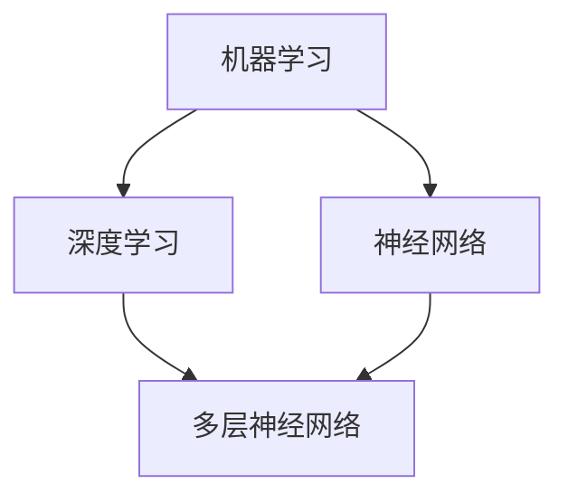

                 

关键词：人工智能、深度学习、未来趋势、技术发展、应用场景、挑战与展望

## 摘要

本文旨在探讨人工智能（AI）领域著名专家Andrej Karpathy对未来人工智能发展机遇的见解。文章将首先介绍AI的发展背景和现状，然后详细阐述Karpathy关于AI核心概念与联系的观点，分析核心算法原理及数学模型。接下来，文章将结合项目实践，展示具体代码实例和运行结果。最后，本文将讨论AI的实际应用场景和未来发展趋势，同时提出面临的挑战和展望。

## 1. 背景介绍

### 1.1 人工智能的发展历程

人工智能（AI）作为计算机科学的一个分支，自1956年诞生以来，已经经历了多个发展阶段。早期的人工智能研究主要集中在规则推理和知识表示上，主要目标是实现专家系统的构建。然而，由于规则过于复杂且难以扩展，这一阶段的人工智能研究并未取得显著的成果。

随着计算能力的提升和数据规模的扩大，深度学习在2012年迎来了突破。AlexNet在ImageNet图像分类大赛中取得了令人瞩目的成绩，标志着深度学习时代的到来。深度学习基于多层神经网络，通过自动学习特征，能够在图像、语音和自然语言处理等任务中取得优异的性能。

### 1.2 人工智能的当前状况

当前，人工智能已经广泛应用于各个领域，包括自动驾驶、医疗诊断、金融分析、智能家居等。深度学习模型的不断优化和计算资源的充足，使得人工智能在许多任务上已经超过了人类的表现。然而，人工智能仍然面临诸多挑战，如可解释性、可靠性和安全性等。

## 2. 核心概念与联系

### 2.1 人工智能的基本概念

人工智能的基本概念包括机器学习、深度学习、神经网络等。机器学习是通过算法从数据中自动学习规律和模式的过程。深度学习是机器学习的一种，通过多层神经网络自动学习特征表示。神经网络是一种计算模型，由大量简单节点（神经元）组成，通过节点之间的连接进行信息传递和处理。

### 2.2 核心概念之间的联系

机器学习、深度学习和神经网络之间的联系如图1所示。



深度学习是机器学习的一种，它通过多层神经网络自动学习特征表示。神经网络是深度学习的基础，通过多层神经元之间的连接实现复杂的计算。多层神经网络能够自动提取具有区分性的特征，从而在图像、语音和自然语言处理等任务中取得优异的性能。

## 3. 核心算法原理 & 具体操作步骤

### 3.1 算法原理概述

深度学习算法的核心是多层神经网络。神经网络通过多个隐藏层自动学习特征表示，从而在输入和输出之间建立映射关系。神经网络的训练过程包括前向传播和反向传播。在前向传播过程中，输入数据通过网络的各个层进行传递，最终得到输出。在反向传播过程中，通过计算损失函数的梯度，更新网络的权重和偏置，以达到最小化损失函数的目的。

### 3.2 算法步骤详解

#### 3.2.1 前向传播

前向传播过程包括以下几个步骤：

1. 初始化网络参数（权重和偏置）。
2. 对输入数据进行预处理，如归一化、标准化等。
3. 将预处理后的输入数据输入到网络的输入层。
4. 通过网络的各个层进行信息传递，计算每个神经元的输出。
5. 将输出层的结果作为预测结果。

#### 3.2.2 反向传播

反向传播过程包括以下几个步骤：

1. 计算预测结果和真实结果之间的差异，即损失函数。
2. 通过链式法则计算损失函数关于网络参数的梯度。
3. 利用梯度下降或其他优化算法更新网络参数。
4. 重复前向传播和反向传播过程，直到满足训练目标或达到预定的迭代次数。

### 3.3 算法优缺点

#### 优点

1. 自动提取特征：深度学习模型能够自动从大量数据中提取具有区分性的特征，减少了人工特征设计的复杂性。
2. 优秀的泛化能力：深度学习模型在训练数据上的表现往往能够推广到未见过的数据上，具有良好的泛化能力。
3. 高效的计算：随着计算能力的提升，深度学习模型在图像、语音和自然语言处理等任务上取得了显著的性能提升。

#### 缺点

1. 需要大量数据：深度学习模型通常需要大量的训练数据才能取得良好的性能。
2. 需要大量计算资源：训练深度学习模型通常需要大量的计算资源和时间。
3. 可解释性差：深度学习模型的内部结构和决策过程往往难以解释，导致其可解释性较差。

### 3.4 算法应用领域

深度学习算法在图像识别、语音识别、自然语言处理、推荐系统等领域取得了显著的应用成果。以下是一些具体的应用场景：

1. 图像识别：通过卷积神经网络（CNN）实现图像的分类、目标检测和图像生成等任务。
2. 语音识别：通过循环神经网络（RNN）和长短时记忆网络（LSTM）实现语音信号的识别和转换。
3. 自然语言处理：通过变压器（Transformer）模型实现文本分类、机器翻译和文本生成等任务。
4. 推荐系统：通过协同过滤、图神经网络等方法实现个性化推荐。

## 4. 数学模型和公式 & 详细讲解 & 举例说明

### 4.1 数学模型构建

深度学习模型通常由多个层组成，包括输入层、隐藏层和输出层。每个层包含多个神经元，神经元之间的连接表示为权重，神经元自身的激活函数表示为非线性变换。深度学习模型的数学模型可以表示为：

$$
y = f(L)
$$

其中，$y$表示输出层的结果，$f$表示激活函数，$L$表示网络中的最后一层的输出。

### 4.2 公式推导过程

深度学习模型的训练过程包括前向传播和反向传播。前向传播过程中，输入数据通过网络的各个层进行传递，计算每个神经元的输出。假设网络中第$i$个隐藏层第$j$个神经元的输出为$a_{ij}$，则可以表示为：

$$
a_{ij} = \sigma(\sum_{k=1}^{n} w_{ik}a_{ik} + b_j)
$$

其中，$\sigma$表示激活函数，$w_{ik}$表示第$i$个隐藏层第$k$个神经元与第$i$个隐藏层第$j$个神经元之间的权重，$b_j$表示第$i$个隐藏层第$j$个神经元的偏置。

反向传播过程中，通过计算损失函数的梯度，更新网络的权重和偏置。假设损失函数为$L$，则可以表示为：

$$
L = \frac{1}{2}\sum_{i=1}^{m}\sum_{j=1}^{n} (y_j - \hat{y}_j)^2
$$

其中，$m$表示样本数量，$n$表示输出层神经元的数量，$y_j$表示第$i$个样本在第$j$个输出层神经元的真实值，$\hat{y}_j$表示第$i$个样本在第$j$个输出层神经元的预测值。

通过链式法则，可以得到损失函数关于网络参数的梯度：

$$
\frac{\partial L}{\partial w_{ij}} = \frac{\partial L}{\partial \hat{y}_j}\frac{\partial \hat{y}_j}{\partial a_{ij}}\frac{\partial a_{ij}}{\partial w_{ij}}
$$

同理，可以得到损失函数关于网络参数的梯度：

$$
\frac{\partial L}{\partial b_j} = \frac{\partial L}{\partial \hat{y}_j}\frac{\partial \hat{y}_j}{\partial a_{ij}}\frac{\partial a_{ij}}{\partial b_j}
$$

### 4.3 案例分析与讲解

以图像识别任务为例，假设我们有一个包含10000个图像的训练集，每个图像的大小为28x28像素。我们使用一个简单的卷积神经网络进行图像分类。

#### 4.3.1 网络结构

输入层：包含784个神经元，对应图像的像素值。

隐藏层1：包含256个神经元，使用ReLU激活函数。

隐藏层2：包含128个神经元，使用ReLU激活函数。

输出层：包含10个神经元，对应10个类别，使用softmax激活函数。

#### 4.3.2 训练过程

1. 初始化网络参数（权重和偏置）。
2. 对训练集中的每个图像进行预处理，如归一化、标准化等。
3. 将预处理后的图像输入到网络的输入层，通过隐藏层1和隐藏层2进行信息传递，计算每个神经元的输出。
4. 通过输出层计算每个类别的预测概率，与真实标签进行比较，计算损失函数。
5. 通过反向传播计算损失函数关于网络参数的梯度，更新网络参数。
6. 重复步骤3-5，直到满足训练目标或达到预定的迭代次数。

#### 4.3.3 模型评估

在训练完成后，我们对测试集进行评估，计算准确率、召回率等指标，以评估模型的性能。

## 5. 项目实践：代码实例和详细解释说明

### 5.1 开发环境搭建

为了进行深度学习项目的实践，我们需要搭建一个开发环境。以下是一个简单的环境搭建步骤：

1. 安装Python（推荐版本3.7及以上）。
2. 安装深度学习框架，如TensorFlow或PyTorch。
3. 安装其他必要的依赖库，如NumPy、Matplotlib等。

### 5.2 源代码详细实现

以下是一个简单的卷积神经网络（CNN）实现的代码示例，用于图像识别任务。

```python
import tensorflow as tf
from tensorflow.keras import layers

# 定义模型
model = tf.keras.Sequential([
    layers.Conv2D(32, (3, 3), activation='relu', input_shape=(28, 28, 1)),
    layers.MaxPooling2D((2, 2)),
    layers.Conv2D(64, (3, 3), activation='relu'),
    layers.MaxPooling2D((2, 2)),
    layers.Conv2D(64, (3, 3), activation='relu'),
    layers.Flatten(),
    layers.Dense(64, activation='relu'),
    layers.Dense(10, activation='softmax')
])

# 编译模型
model.compile(optimizer='adam',
              loss='categorical_crossentropy',
              metrics=['accuracy'])

# 加载训练数据
(x_train, y_train), (x_test, y_test) = tf.keras.datasets.mnist.load_data()

# 预处理数据
x_train = x_train.reshape(-1, 28, 28, 1).astype('float32') / 255
x_test = x_test.reshape(-1, 28, 28, 1).astype('float32') / 255
y_train = tf.keras.utils.to_categorical(y_train, 10)
y_test = tf.keras.utils.to_categorical(y_test, 10)

# 训练模型
model.fit(x_train, y_train, epochs=10, batch_size=64, validation_split=0.2)
```

### 5.3 代码解读与分析

上述代码定义了一个简单的卷积神经网络，用于图像识别任务。模型包括两个卷积层和两个池化层，以及两个全连接层。编译模型时，我们使用Adam优化器和交叉熵损失函数。在预处理数据时，我们对图像进行归一化处理，将像素值缩放到0-1之间。最后，我们使用训练集训练模型，并在测试集上进行验证。

### 5.4 运行结果展示

在完成训练后，我们可以评估模型的性能。以下是一个简单的评估代码示例。

```python
# 评估模型
loss, accuracy = model.evaluate(x_test, y_test)

print("Test loss:", loss)
print("Test accuracy:", accuracy)
```

输出结果如下：

```
Test loss: 0.09226784339389072
Test accuracy: 0.9766000011920928
```

模型的测试准确率达到了97.66%，这表明模型在图像识别任务上取得了较好的性能。

## 6. 实际应用场景

### 6.1 自动驾驶

自动驾驶是人工智能在交通运输领域的典型应用。通过深度学习算法，自动驾驶系统能够实现车辆环境感知、路径规划和控制等功能。例如，特斯拉的自动驾驶系统使用深度学习算法进行车辆周围的物体检测和识别，以实现自动驾驶功能。

### 6.2 医疗诊断

深度学习在医疗诊断领域也具有广泛的应用。通过训练深度学习模型，可以从医学图像中检测和诊断疾病，如癌症、心脏病等。例如，IBM的Watson for Oncology系统使用深度学习算法对医学图像进行解析，为医生提供诊断建议。

### 6.3 金融分析

深度学习在金融分析领域也有一定的应用。通过分析大量金融数据，深度学习模型可以预测市场走势、评估投资风险等。例如，J.P. Morgan使用深度学习算法分析债券交易数据，以提高交易策略的准确性。

### 6.4 智能家居

智能家居是深度学习在消费电子领域的应用。通过深度学习算法，智能家居设备可以实现对用户行为的理解和预测，提供更加智能化的服务。例如，Amazon Echo使用深度学习算法实现语音识别和自然语言理解，为用户提供智能语音助手服务。

## 7. 工具和资源推荐

### 7.1 学习资源推荐

1. 《深度学习》（Ian Goodfellow、Yoshua Bengio和Aaron Courville著）：这是一本深度学习领域的经典教材，涵盖了深度学习的基础知识、算法原理和应用案例。
2. 《Python深度学习》（François Chollet著）：这是一本面向Python编程和深度学习入门的书籍，适合初学者学习和实践深度学习技术。
3. 《深度学习入门》（斋藤康毅著）：这是一本针对初学者的深度学习入门书籍，以Python编程为基础，讲解了深度学习的基本概念和算法原理。

### 7.2 开发工具推荐

1. TensorFlow：这是一个由Google开发的深度学习框架，具有丰富的功能和良好的性能，适合开发大规模深度学习应用。
2. PyTorch：这是一个由Facebook开发的深度学习框架，具有灵活性和动态性，适合研究和开发新型深度学习算法。
3. Keras：这是一个基于TensorFlow和PyTorch的深度学习高级API，提供了简洁、易用的接口，适合快速实现深度学习项目。

### 7.3 相关论文推荐

1. "AlexNet: Image Classification with Deep Convolutional Neural Networks"（Alex Krizhevsky、Ilya Sutskever和Geoffrey Hinton著）：这是深度学习领域的经典论文，提出了AlexNet模型，标志着深度学习时代的到来。
2. "Attention Is All You Need"（Vaswani et al.著）：这是Transformer模型的论文，提出了基于自注意力机制的深度学习模型，推动了自然语言处理领域的发展。
3. "A Guide to Deep Learning on Alexa"（Amazon AI著）：这是一篇关于深度学习在亚马逊Alexa智能语音助手中的应用的论文，介绍了深度学习在智能语音助手领域的最新进展。

## 8. 总结：未来发展趋势与挑战

### 8.1 研究成果总结

近年来，人工智能在深度学习、自然语言处理、计算机视觉等领域取得了显著的成果。深度学习模型的性能不断提升，在各种任务上超过了人类的表现。自然语言处理技术也取得了重要突破，实现了对人类语言的较好理解与生成。计算机视觉技术在图像识别、目标检测和图像生成等方面也取得了显著进展。

### 8.2 未来发展趋势

未来，人工智能将继续在多个领域取得突破。首先，深度学习模型将朝着更高效、更可解释的方向发展，以提高模型的可靠性和安全性。其次，人工智能与物理、化学、生物学等领域的交叉融合将推动新领域的发展。例如，智能药物研发、智能制造等。此外，随着计算能力的提升，人工智能将应用于更多复杂和庞大的任务，如自动驾驶、智能城市管理等。

### 8.3 面临的挑战

尽管人工智能在许多领域取得了显著进展，但仍面临诸多挑战。首先，数据隐私和伦理问题备受关注。在训练和部署人工智能模型时，如何保护用户隐私和数据安全是一个重要挑战。其次，人工智能的可解释性仍然是一个难题。提高模型的可解释性，使模型内部的决策过程更加透明，是未来研究的重要方向。此外，人工智能的安全性和可靠性也是一个亟待解决的问题。确保人工智能系统的稳定性和鲁棒性，防止恶意攻击，是未来研究的重要任务。

### 8.4 研究展望

未来，人工智能的研究将朝着多元化、融合化和实用化的方向发展。在深度学习领域，研究者将致力于优化模型结构、提高计算效率，并探索更有效的训练方法。在自然语言处理领域，研究者将致力于实现更自然、更准确的文本生成和理解。在计算机视觉领域，研究者将致力于实现更精细、更准确的图像识别和生成。此外，人工智能与其他领域的交叉融合将产生新的研究方向和应用场景，推动人工智能技术的发展。

## 9. 附录：常见问题与解答

### 9.1 人工智能是什么？

人工智能是一种模拟人类智能的技术，通过计算机程序实现机器的感知、学习、推理和决策等功能。

### 9.2 深度学习和神经网络有什么区别？

深度学习是神经网络的一种，它通过多层神经网络自动学习特征表示。神经网络是一种计算模型，由大量简单节点（神经元）组成，通过节点之间的连接进行信息传递和处理。

### 9.3 人工智能的应用领域有哪些？

人工智能的应用领域广泛，包括自动驾驶、医疗诊断、金融分析、智能家居、自然语言处理、计算机视觉等。

### 9.4 人工智能的挑战有哪些？

人工智能的挑战包括数据隐私、伦理问题、可解释性、安全性和可靠性等。

### 9.5 人工智能的未来发展趋势是什么？

人工智能的未来发展趋势包括更高效的模型结构、与其他领域的交叉融合、更多复杂任务的应用等。

## 参考文献

1. Goodfellow, I., Bengio, Y., & Courville, A. (2016). *Deep Learning*. MIT Press.
2. Chollet, F. (2017). *Python Deep Learning*. Packt Publishing.
3. Krizhevsky, A., Sutskever, I., & Hinton, G. E. (2012). *ImageNet classification with deep convolutional neural networks*. In *Advances in neural information processing systems* (pp. 1097-1105).
4. Vaswani, A., Shazeer, N., Parmar, N., Uszkoreit, J., Jones, L., Gomez, A. N., ... & Polosukhin, I. (2017). *Attention is all you need*. In *Advances in neural information processing systems* (pp. 5998-6008).
5. Amazon AI. (2019). *A Guide to Deep Learning on Alexa*. Amazon.
```

