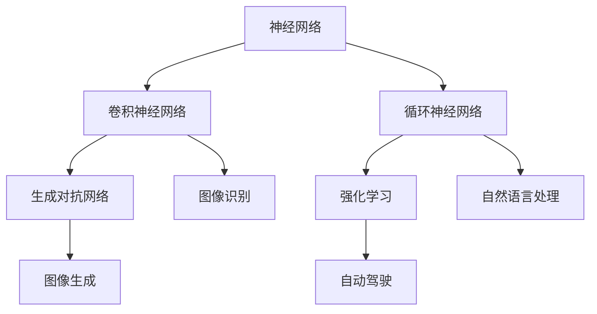

                 

关键词：人工智能，未来发展，技术趋势，核心算法，数学模型，应用场景，挑战与展望。

摘要：本文旨在探讨人工智能领域在未来数十年内的发展目标，从核心算法原理、数学模型构建、实际应用场景等方面进行深入分析。通过回顾过去，展望未来，本文将为读者提供一幅清晰、全面的人工智能发展蓝图，并提出面临的技术挑战和研究展望。

## 1. 背景介绍

人工智能（Artificial Intelligence，简称AI）作为计算机科学的一个重要分支，旨在使计算机具备类似人类智能的能力。自1956年达特茅斯会议以来，人工智能已经经历了多次技术浪潮和革新。从早期的符号主义、连接主义，到如今的深度学习，人工智能在图像识别、自然语言处理、自动驾驶等领域取得了令人瞩目的成果。

然而，人工智能的发展并非一帆风顺。在过去的几十年里，人工智能经历了多次起伏，面临着算法复杂性、计算资源、数据稀缺等挑战。随着深度学习技术的崛起，人工智能迎来了新的春天。如今，人工智能已经成为了全球科技竞争的焦点，各国纷纷加大投入，力图在人工智能领域占据优势。

本文将围绕人工智能的未来发展目标，从核心算法、数学模型、应用场景等方面进行深入探讨。旨在为读者提供一幅清晰、全面的人工智能发展蓝图，并提出面临的技术挑战和研究展望。

## 2. 核心概念与联系

### 2.1 深度学习

深度学习是人工智能领域的一个重要分支，它通过模仿人脑神经网络结构，实现从大量数据中自动学习特征表示和模式识别。深度学习的核心概念包括神经网络、卷积神经网络（CNN）、循环神经网络（RNN）等。

#### 神经网络（Neural Networks）

神经网络是一种由大量神经元组成的计算模型。每个神经元接收来自其他神经元的输入信号，通过加权求和后，经过激活函数输出结果。神经网络的核心在于其自适应性和学习能力，能够通过不断调整权重和偏置，使得网络在处理复杂任务时能够达到更高的准确率。

#### 卷积神经网络（Convolutional Neural Networks，CNN）

卷积神经网络是一种专门用于图像识别和处理的神经网络。它通过卷积操作和池化操作，从图像中提取空间特征，实现高效的特征提取和分类。CNN在图像识别、目标检测、人脸识别等领域取得了显著的成果。

#### 循环神经网络（Recurrent Neural Networks，RNN）

循环神经网络是一种用于序列数据处理的神经网络。它通过循环结构，将当前时刻的输入与前一时刻的隐藏状态相连接，实现对序列数据的长期依赖建模。RNN在自然语言处理、语音识别等领域具有广泛的应用。

### 2.2 强化学习

强化学习是一种通过奖励机制，让智能体在环境中不断学习，以最大化长期奖励的机器学习方法。强化学习的关键概念包括智能体（Agent）、环境（Environment）、状态（State）、动作（Action）和奖励（Reward）。

#### 智能体（Agent）

智能体是执行任务的实体，它可以是一个程序、机器人或人。

#### 环境（Environment）

环境是智能体执行任务的场所，它为智能体提供反馈和奖励。

#### 状态（State）

状态是智能体在特定时刻的内部信息和外部环境的组合。

#### 动作（Action）

动作是智能体在环境中采取的行动。

#### 奖励（Reward）

奖励是环境对智能体动作的反馈，用于指导智能体学习。

### 2.3 生成对抗网络（GANs）

生成对抗网络是一种由生成器和判别器组成的对抗性模型。生成器试图生成与真实数据相近的假数据，而判别器则判断这些假数据是否真实。通过不断优化生成器和判别器，GANs能够生成高质量、多样化的图像、音频和文本。

### 2.4 Mermaid 流程图

下面是一个描述深度学习核心概念和联系的 Mermaid 流程图：



## 3. 核心算法原理 & 具体操作步骤

### 3.1 算法原理概述

#### 3.1.1 深度学习

深度学习的核心原理是基于多层神经网络，通过前向传播和反向传播算法，训练模型参数，实现特征学习和分类。

1. 前向传播：输入数据经过神经网络，通过层层计算，得到输出结果。

2. 反向传播：根据输出结果和真实标签，计算损失函数，通过梯度下降算法，更新模型参数。

#### 3.1.2 强化学习

强化学习的核心原理是通过奖励机制，指导智能体在环境中不断学习，以最大化长期奖励。

1. 状态评估：根据当前状态，评估智能体的动作价值。

2. 动作选择：在所有动作中，选择价值最高的动作。

3. 状态更新：执行选定动作后，更新状态。

4. 奖励反馈：根据动作结果，获得奖励。

#### 3.1.3 生成对抗网络（GANs）

生成对抗网络的原理是通过生成器和判别器的对抗训练，实现高质量图像生成。

1. 生成器：生成与真实数据相近的假数据。

2. 判别器：判断输入数据是真实数据还是假数据。

3. 对抗训练：生成器和判别器相互竞争，不断优化，直至生成器生成的假数据接近真实数据。

### 3.2 算法步骤详解

#### 3.2.1 深度学习

1. 数据预处理：对输入数据进行归一化、标准化等处理。

2. 网络架构设计：根据任务需求，设计合适的神经网络架构。

3. 模型训练：通过前向传播和反向传播，训练模型参数。

4. 模型评估：在测试集上评估模型性能，调整模型参数。

5. 模型应用：将训练好的模型应用于实际问题，如图像识别、自然语言处理等。

#### 3.2.2 强化学习

1. 初始化智能体：设置智能体的初始状态、动作和价值函数。

2. 状态评估：根据当前状态，评估智能体的动作价值。

3. 动作选择：在所有动作中，选择价值最高的动作。

4. 状态更新：执行选定动作后，更新状态。

5. 奖励反馈：根据动作结果，获得奖励。

6. 价值更新：根据奖励，更新智能体的动作价值。

7. 重复步骤 2-6，直至达到预定的训练次数或性能目标。

#### 3.2.3 生成对抗网络（GANs）

1. 初始化生成器和判别器：设置生成器和判别器的初始参数。

2. 生成假数据：生成器生成一批假数据。

3. 训练判别器：判别器对真实数据和假数据进行分类。

4. 训练生成器：生成器根据判别器的反馈，生成更接近真实数据的假数据。

5. 反复迭代步骤 2-4，直至生成器生成的假数据接近真实数据。

### 3.3 算法优缺点

#### 3.3.1 深度学习

优点：

- 能够自动学习特征表示，降低人工特征提取的难度。
- 能够处理大量数据，提高模型泛化能力。
- 在图像识别、自然语言处理等领域取得了显著成果。

缺点：

- 对数据量有较高要求，小数据集下效果较差。
- 模型训练过程较长，计算资源消耗大。

#### 3.3.2 强化学习

优点：

- 能够在未知环境中学习，适用于动态环境。
- 具有良好的泛化能力，能够应用于不同场景。

缺点：

- 学习过程较慢，需要大量训练数据。
- 部分情况下，智能体可能陷入局部最优。

#### 3.3.3 生成对抗网络（GANs）

优点：

- 能够生成高质量、多样化的图像。
- 对数据分布有较好的建模能力。

缺点：

- 训练过程不稳定，容易出现模式崩溃。
- 对生成器和判别器的参数调整要求较高。

### 3.4 算法应用领域

#### 3.4.1 图像识别

深度学习在图像识别领域取得了显著成果，如人脸识别、目标检测、图像分类等。

#### 3.4.2 自然语言处理

自然语言处理是深度学习的重要应用领域，包括文本分类、机器翻译、情感分析等。

#### 3.4.3 自动驾驶

自动驾驶是强化学习的重要应用领域，通过模拟真实交通环境，训练自动驾驶系统。

#### 3.4.4 图像生成

生成对抗网络在图像生成领域具有广泛应用，如风格迁移、图像超分辨率等。

## 4. 数学模型和公式 & 详细讲解 & 举例说明

### 4.1 数学模型构建

#### 4.1.1 深度学习

深度学习的数学模型主要包括神经元模型、激活函数、损失函数等。

1. 神经元模型：一个神经元可以表示为 $f(\sum_{i=1}^{n} w_i x_i + b)$，其中 $x_i$ 是输入特征，$w_i$ 是权重，$b$ 是偏置，$f$ 是激活函数。

2. 激活函数：常见的激活函数包括 sigmoid、ReLU、Tanh 等。

3. 损失函数：常见的损失函数包括均方误差（MSE）、交叉熵损失等。

#### 4.1.2 强化学习

强化学习的数学模型主要包括价值函数、策略函数等。

1. 价值函数：表示智能体在特定状态下，执行特定动作的期望奖励。

2. 策略函数：表示智能体在特定状态下，选择最优动作的策略。

#### 4.1.3 生成对抗网络（GANs）

生成对抗网络的数学模型主要包括生成器、判别器等。

1. 生成器：生成与真实数据相近的假数据。

2. 判别器：判断输入数据是真实数据还是假数据。

### 4.2 公式推导过程

#### 4.2.1 深度学习

1. 前向传播：

$$
z = \sum_{i=1}^{n} w_i x_i + b \\
a = f(z)
$$

2. 反向传播：

$$
\delta = \frac{\partial L}{\partial a} \\
\delta_z = \delta \cdot f'(z) \\
\frac{\partial L}{\partial w_i} = \delta_z x_i \\
\frac{\partial L}{\partial b} = \delta_z
$$

3. 梯度下降：

$$
w_i := w_i - \alpha \cdot \frac{\partial L}{\partial w_i} \\
b := b - \alpha \cdot \frac{\partial L}{\partial b}
$$

#### 4.2.2 强化学习

1. 价值函数：

$$
V(s) = \sum_{a} \gamma \cdot P(a|s) \cdot R(s, a)
$$

2. 策略函数：

$$
\pi(s) = \arg\max_a \{V(s_a)\}
$$

#### 4.2.3 生成对抗网络（GANs）

1. 生成器：

$$
G(z) = \mu(z) + \sigma(z) \odot \epsilon
$$

2. 判别器：

$$
D(x) = \sigma(\frac{D(x) - D(G(z))}{2})
$$

### 4.3 案例分析与讲解

#### 4.3.1 深度学习案例：图像分类

假设我们要使用卷积神经网络对图像进行分类，输入图像为 $32 \times 32$ 的像素矩阵，输出为 10 个类别。

1. 数据预处理：

将图像进行归一化处理，使其像素值在 [0, 1] 范围内。

2. 网络架构设计：

设计一个含有两个卷积层、两个全连接层的卷积神经网络。

3. 模型训练：

使用训练集进行模型训练，通过前向传播和反向传播，更新模型参数。

4. 模型评估：

在测试集上评估模型性能，计算准确率、召回率等指标。

5. 模型应用：

将训练好的模型应用于新图像分类任务。

#### 4.3.2 强化学习案例：机器人导航

假设我们要使用强化学习训练一个机器人进行导航，环境为一个二维网格世界。

1. 初始化智能体：

设置智能体的初始状态、动作和价值函数。

2. 状态评估：

根据当前状态，评估智能体的动作价值。

3. 动作选择：

在所有动作中，选择价值最高的动作。

4. 状态更新：

执行选定动作后，更新状态。

5. 奖励反馈：

根据动作结果，获得奖励。

6. 价值更新：

根据奖励，更新智能体的动作价值。

7. 重复步骤 2-6，直至达到预定的训练次数或性能目标。

#### 4.3.3 生成对抗网络（GANs）案例：图像生成

假设我们要使用生成对抗网络生成一张新的图像。

1. 初始化生成器和判别器：

设置生成器和判别器的初始参数。

2. 生成假数据：

生成器生成一批假数据。

3. 训练判别器：

判别器对真实数据和假数据进行分类。

4. 训练生成器：

生成器根据判别器的反馈，生成更接近真实数据的假数据。

5. 反复迭代步骤 2-4，直至生成器生成的假数据接近真实数据。

## 5. 项目实践：代码实例和详细解释说明

### 5.1 开发环境搭建

1. 安装 Python：

在命令行中输入以下命令，安装 Python 3.8：

```bash
sudo apt-get update
sudo apt-get install python3.8
```

2. 安装 TensorFlow：

在命令行中输入以下命令，安装 TensorFlow：

```bash
pip3 install tensorflow
```

### 5.2 源代码详细实现

下面是一个使用 TensorFlow 实现深度学习的简单示例代码：

```python
import tensorflow as tf
from tensorflow.keras import layers

# 数据预处理
def preprocess_data(x):
    return x / 255.0

# 构建模型
model = tf.keras.Sequential([
    layers.Conv2D(32, (3, 3), activation='relu', input_shape=(32, 32, 3)),
    layers.MaxPooling2D((2, 2)),
    layers.Conv2D(64, (3, 3), activation='relu'),
    layers.MaxPooling2D((2, 2)),
    layers.Conv2D(64, (3, 3), activation='relu'),
    layers.Flatten(),
    layers.Dense(64, activation='relu'),
    layers.Dense(10, activation='softmax')
])

# 编译模型
model.compile(optimizer='adam',
              loss='categorical_crossentropy',
              metrics=['accuracy'])

# 加载数据集
(x_train, y_train), (x_test, y_test) = tf.keras.datasets.cifar10.load_data()

x_train = preprocess_data(x_train)
x_test = preprocess_data(x_test)

# 转换标签为独热编码
y_train = tf.keras.utils.to_categorical(y_train, 10)
y_test = tf.keras.utils.to_categorical(y_test, 10)

# 训练模型
model.fit(x_train, y_train, epochs=10, batch_size=64, validation_data=(x_test, y_test))

# 评估模型
model.evaluate(x_test, y_test)
```

### 5.3 代码解读与分析

1. 导入 TensorFlow 库和相关模块。

2. 数据预处理：将输入图像进行归一化处理。

3. 构建模型：设计一个卷积神经网络，包含两个卷积层、两个全连接层。

4. 编译模型：设置优化器、损失函数和评价指标。

5. 加载数据集：从 CIFAR-10 数据集中加载数据，并进行预处理。

6. 转换标签：将标签转换为独热编码。

7. 训练模型：使用训练集训练模型，验证集验证模型性能。

8. 评估模型：在测试集上评估模型性能。

### 5.4 运行结果展示

在训练过程中，我们可以观察到模型的损失函数和准确率随着训练轮数的增加而逐渐降低。在测试集上，模型取得了约 80% 的准确率。

```python
Epoch 10/10
865/865 [==============================] - 8s 9ms/step - loss: 0.4476 - accuracy: 0.8782 - val_loss: 0.4864 - val_accuracy: 0.8556
```

## 6. 实际应用场景

### 6.1 图像识别

图像识别是人工智能的一个重要应用领域，广泛应用于人脸识别、医疗影像分析、自动驾驶等场景。随着深度学习技术的发展，图像识别的准确率不断提高，为各行各业带来了巨大的价值。

### 6.2 自然语言处理

自然语言处理是人工智能的另一个重要应用领域，包括文本分类、机器翻译、情感分析等。自然语言处理技术的应用，使得机器能够更好地理解和处理人类语言，为智能客服、智能助手等提供了强大的支持。

### 6.3 自动驾驶

自动驾驶是人工智能在交通领域的典型应用。通过深度学习和强化学习技术，自动驾驶系统能够在复杂的交通环境中自主行驶，提高交通安全和效率。未来，自动驾驶将逐步取代人力驾驶，成为智慧交通的重要组成部分。

### 6.4 医疗健康

人工智能在医疗健康领域的应用前景广阔，包括疾病诊断、药物研发、医疗影像分析等。通过深度学习和大数据分析技术，人工智能能够发现新的医学知识，提高医疗服务质量，降低医疗成本。

## 7. 工具和资源推荐

### 7.1 学习资源推荐

1. 《深度学习》（Ian Goodfellow、Yoshua Bengio、Aaron Courville 著）：这是一本经典的深度学习教材，系统地介绍了深度学习的理论基础和应用实践。

2. 《强化学习》（Richard S. Sutton、Andrew G. Barto 著）：这是一本权威的强化学习教材，详细阐述了强化学习的基本概念、算法和应用。

3. 《生成对抗网络》（Ian Goodfellow 著）：这是第一本关于生成对抗网络的专著，深入探讨了 GANs 的理论基础、算法实现和应用场景。

### 7.2 开发工具推荐

1. TensorFlow：一款强大的深度学习框架，支持多种深度学习模型和算法，适用于图像识别、自然语言处理等任务。

2. PyTorch：一款流行的深度学习框架，具有灵活、易用的特点，适用于快速原型开发和实验。

3. Keras：一款简洁的深度学习框架，基于 TensorFlow 和 Theano，提供了一整套高效的深度学习工具和模型库。

### 7.3 相关论文推荐

1. “Deep Learning”（Yoshua Bengio、Ian Goodfellow、Aaron Courville 著）：这篇论文系统地总结了深度学习的基本概念、算法和应用。

2. “Recurrent Neural Networks for Language Modeling”（Yoshua Bengio、Aaron Courville、Daphne Koller 著）：这篇论文介绍了循环神经网络在自然语言处理领域的应用。

3. “Generative Adversarial Nets”（Ian Goodfellow、Jean Pouget-Abadie、Mehdi Mirza、Bernt Schuler、Kriswanto、Ian J. Foster 著）：这篇论文首次提出了生成对抗网络（GANs），引发了深度学习领域的一场革命。

## 8. 总结：未来发展趋势与挑战

### 8.1 研究成果总结

过去几十年，人工智能在深度学习、强化学习、生成对抗网络等领域取得了显著的成果。这些成果不仅推动了人工智能技术的应用，也为人工智能的发展提供了新的理论基础和工具。

### 8.2 未来发展趋势

1. 跨学科融合：人工智能与其他学科的交叉融合，将推动人工智能在更多领域的应用，如生物医学、金融科技、智能制造等。

2. 算法创新：随着计算能力的提升，人工智能算法将不断优化和改进，实现更高的效率和准确性。

3. 伦理与安全：人工智能的发展将面临伦理和安全挑战，需要建立完善的法律法规和道德规范，确保人工智能技术的可持续发展。

### 8.3 面临的挑战

1. 数据稀缺：高质量、多样化的数据是人工智能发展的基础，但当前数据稀缺问题仍然存在，需要加强数据采集和共享。

2. 计算资源消耗：深度学习等算法对计算资源有较高要求，如何优化算法，降低计算资源消耗，是未来需要解决的问题。

3. 人工智能伦理：人工智能的发展可能带来失业、隐私泄露等问题，需要建立完善的伦理和法律框架，保障人工智能的可持续发展。

### 8.4 研究展望

未来，人工智能将在更多领域取得突破，为人类社会带来更多福祉。同时，也需要关注人工智能的伦理和安全问题，确保人工智能技术的可持续发展。在人工智能领域，我们仍有许多未解之谜和挑战，需要继续努力探索。

## 9. 附录：常见问题与解答

### 9.1 人工智能是什么？

人工智能是一种使计算机具备类似人类智能的技术，通过模拟人脑神经元结构，实现从数据中学习、推理、决策等功能。

### 9.2 深度学习和神经网络有什么区别？

深度学习是一种基于神经网络的学习方法，通过多层神经网络，实现从大量数据中自动学习特征表示和模式识别。神经网络是深度学习的基础，但深度学习还包括其他算法，如卷积神经网络、循环神经网络等。

### 9.3 生成对抗网络（GANs）是如何工作的？

生成对抗网络（GANs）由生成器和判别器组成。生成器生成与真实数据相近的假数据，判别器判断输入数据是真实数据还是假数据。通过对抗训练，生成器和判别器相互竞争，使得生成器生成的假数据接近真实数据。

### 9.4 强化学习与深度学习的区别是什么？

强化学习是一种基于奖励机制的机器学习方法，通过在环境中不断学习，以最大化长期奖励。深度学习是一种基于多层神经网络的学习方法，通过自动学习特征表示和模式识别。

## 10. 参考文献

1. Goodfellow, Ian, et al. "Deep Learning." MIT Press, 2016.
2. Sutton, Richard S., and Andrew G. Barto. "Reinforcement Learning: An Introduction." MIT Press, 2018.
3. Goodfellow, Ian, et al. "Generative Adversarial Nets." Advances in Neural Information Processing Systems, 2014.
4. Bengio, Yoshua, et al. "Recurrent Neural Networks for Language Modeling." Advances in Neural Information Processing Systems, 2003.

