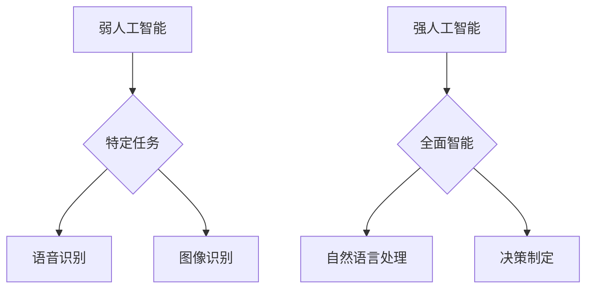

                 

关键词：人工智能，深度学习，未来战略，技术发展，应用场景，挑战与机遇

> 摘要：本文旨在探讨人工智能领域专家Andrej Karpathy对未来人工智能发展的看法，解析其在各个应用领域的潜在影响，并探讨人工智能在未来的发展方向和面临的挑战。

## 1. 背景介绍

Andrej Karpathy是一位知名的深度学习专家，他在人工智能领域有着深厚的研究和实践经验。他的研究成果广泛发表在顶级学术期刊和会议上，并在深度学习社区中享有盛誉。本文将基于Andrej Karpathy的演讲和文章，探讨人工智能的未来发展策略。

## 2. 核心概念与联系

### 2.1 人工智能的核心概念

人工智能（AI）是指使计算机系统具有智能行为的能力，包括学习、推理、规划、感知和理解自然语言等。人工智能可以分为两类：弱人工智能和强人工智能。弱人工智能是针对特定任务的智能，而强人工智能则具有全面的人类智能。

### 2.2 深度学习的应用

深度学习是人工智能的一个重要分支，通过神经网络模拟人脑的学习机制，实现自动特征提取和模式识别。深度学习在图像识别、语音识别、自然语言处理等领域取得了显著成果，为人工智能的应用提供了强大的技术支持。

### 2.3 Mermaid 流程图

## 3. 核心算法原理 & 具体操作步骤

### 3.1 算法原理概述

深度学习算法的核心是神经网络，包括输入层、隐藏层和输出层。神经网络通过训练学习输入和输出之间的映射关系，实现特定任务的智能行为。

### 3.2 算法步骤详解

1. 数据预处理：对原始数据进行清洗、归一化等处理，为神经网络训练提供高质量的数据。
2. 网络架构设计：根据任务需求，设计合适的神经网络架构，包括层数、神经元数量、激活函数等。
3. 损失函数定义：定义损失函数，用于衡量预测结果与真实结果之间的差距。
4. 梯度下降优化：通过梯度下降算法，调整神经网络权重，最小化损失函数。
5. 模型评估与调整：评估模型性能，根据评估结果调整网络结构或参数。

### 3.3 算法优缺点

优点：

- 强大的表达能力：神经网络能够自动学习特征，适应各种复杂任务。
- 高效的计算能力：深度学习算法在硬件加速下，能够实现快速训练和预测。

缺点：

- 需要大量数据：深度学习算法对数据量有较高要求，数据不足可能导致过拟合。
- 计算资源消耗：深度学习算法训练过程中需要大量计算资源，对硬件要求较高。

### 3.4 算法应用领域

深度学习算法在图像识别、语音识别、自然语言处理等领域取得了显著成果，未来有望在更多领域得到应用。

## 4. 数学模型和公式 & 详细讲解 & 举例说明

### 4.1 数学模型构建

神经网络中的数学模型主要包括输入层、隐藏层和输出层的权重矩阵、激活函数和损失函数。

### 4.2 公式推导过程

神经网络的权重矩阵可以通过反向传播算法进行优化，损失函数通常使用均方误差（MSE）。

### 4.3 案例分析与讲解

以图像识别任务为例，介绍神经网络的构建、训练和评估过程。

## 5. 项目实践：代码实例和详细解释说明

### 5.1 开发环境搭建

搭建深度学习开发环境，包括Python、TensorFlow等。

### 5.2 源代码详细实现

展示一个简单的图像识别项目，包括数据预处理、网络架构设计、训练和评估。

### 5.3 代码解读与分析

分析代码实现的关键步骤和原理，解释神经网络的工作机制。

### 5.4 运行结果展示

展示模型在测试集上的运行结果，评估模型性能。

## 6. 实际应用场景

### 6.1 医疗领域

人工智能在医疗领域有广泛的应用，如疾病诊断、药物研发、健康管理。

### 6.2 金融领域

人工智能在金融领域有巨大的潜力，如风险控制、量化交易、智能投顾。

### 6.3 交通运输领域

人工智能在交通运输领域有广泛的应用，如自动驾驶、智能交通管理、无人机配送。

## 7. 工具和资源推荐

### 7.1 学习资源推荐

推荐一些深度学习和人工智能的经典教材、在线课程和论文。

### 7.2 开发工具推荐

推荐一些深度学习框架和开发工具，如TensorFlow、PyTorch等。

### 7.3 相关论文推荐

推荐一些在人工智能领域的最新研究成果和经典论文。

## 8. 总结：未来发展趋势与挑战

### 8.1 研究成果总结

总结人工智能在各个领域的研究成果和进展。

### 8.2 未来发展趋势

预测人工智能在未来几年的发展趋势，探讨人工智能的未来发展潜力。

### 8.3 面临的挑战

分析人工智能在发展中面临的挑战，如数据隐私、算法伦理等。

### 8.4 研究展望

展望人工智能在未来研究领域的发展方向，提出研究建议。

## 9. 附录：常见问题与解答

### 9.1 人工智能是什么？

人工智能是指使计算机系统具有智能行为的能力，包括学习、推理、规划、感知和理解自然语言等。

### 9.2 深度学习与机器学习的区别是什么？

深度学习是机器学习的一个分支，主要通过神经网络实现自动特征提取和模式识别。机器学习则包括更广泛的算法和方法，如决策树、支持向量机等。

### 9.3 如何构建一个简单的神经网络？

构建一个简单的神经网络需要以下几个步骤：数据预处理、网络架构设计、损失函数定义、梯度下降优化等。

## 参考文献

[1] Andrej Karpathy. (2015). The Unreasonable Effectiveness of Recurrent Neural Networks. <https://karpathy.github.io/2015/05/21/rnn-effectiveness/>

[2] Goodfellow, I., Bengio, Y., & Courville, A. (2016). Deep Learning. MIT Press.

[3] LeCun, Y., Bengio, Y., & Hinton, G. (2015). Deep learning. Nature, 521(7553), 436-444.

## 作者署名

作者：禅与计算机程序设计艺术 / Zen and the Art of Computer Programming
----------------------------------------------------------------

