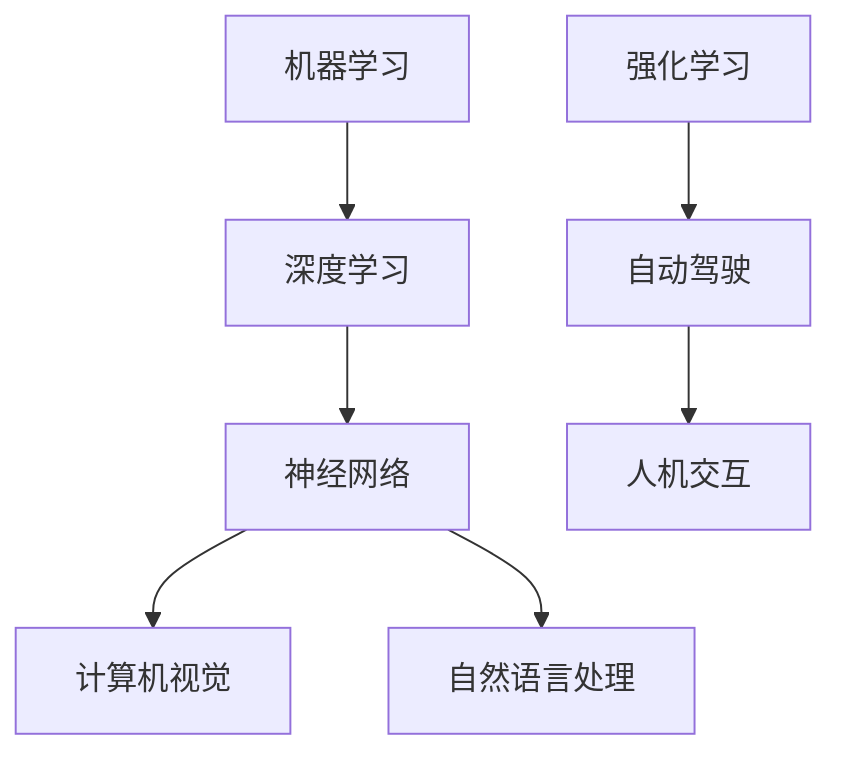

                 

关键词：Andrej Karpathy, 人工智能，未来发展策略，技术趋势，挑战与展望

> 摘要：本文旨在探讨人工智能领域杰出专家Andrej Karpathy提出的未来发展策略，通过分析其核心观点，展望人工智能技术的未来趋势、面临的挑战及潜在解决方案。

## 1. 背景介绍

Andrej Karpathy是一位在人工智能领域备受尊敬的专家，他在深度学习、自然语言处理、计算机视觉等领域有着丰富的经验和卓越的贡献。他的研究和成果不仅推动了人工智能技术的发展，也为业界提供了宝贵的实践经验和理论指导。本文将围绕Andrej Karpathy在人工智能未来发展策略方面的观点进行深入探讨，旨在为读者提供对人工智能技术未来趋势的全面了解。

## 2. 核心概念与联系

在人工智能领域，核心概念包括机器学习、深度学习、神经网络等。这些概念相互关联，共同构成了人工智能技术的理论基础。下面，我们通过一个Mermaid流程图来展示这些核心概念之间的联系。



通过这个流程图，我们可以看到机器学习是深度学习和神经网络的基石，而深度学习又推动了计算机视觉和自然语言处理等领域的快速发展。同时，强化学习也为自动驾驶和人机交互等应用提供了重要的理论支持。

## 3. 核心算法原理 & 具体操作步骤

### 3.1 算法原理概述

人工智能的核心在于算法，而深度学习算法是其中最重要的部分。深度学习算法基于多层神经网络，通过逐层提取特征，实现从原始数据到高级抽象表示的转换。下面，我们将简要介绍深度学习算法的基本原理。

### 3.2 算法步骤详解

1. **数据预处理**：对原始数据进行清洗、归一化等处理，以便于后续的神经网络训练。
2. **构建神经网络模型**：设计合适的神经网络结构，包括输入层、隐藏层和输出层。
3. **初始化参数**：随机初始化神经网络模型的参数。
4. **前向传播**：将输入数据通过神经网络模型进行前向传播，得到输出结果。
5. **计算损失函数**：通过计算输出结果与真实值之间的差距，得到损失函数的值。
6. **反向传播**：根据损失函数的梯度，对神经网络模型的参数进行更新。
7. **迭代训练**：重复上述步骤，直到满足训练终止条件。

### 3.3 算法优缺点

**优点**：

- **强大的特征提取能力**：深度学习算法能够自动学习数据中的复杂特征，提高模型的泛化能力。
- **适用于大规模数据**：深度学习算法可以处理海量数据，提高模型的训练效率和准确性。
- **多任务学习**：深度学习算法可以同时解决多个任务，提高模型的利用效率。

**缺点**：

- **模型复杂度高**：深度学习算法需要大量的计算资源和时间来训练模型。
- **对数据依赖性强**：深度学习算法对数据质量有较高要求，数据质量不佳可能导致模型性能下降。

### 3.4 算法应用领域

深度学习算法在计算机视觉、自然语言处理、语音识别、推荐系统等领域有着广泛的应用。例如，在计算机视觉领域，深度学习算法可以用于图像分类、目标检测、人脸识别等任务；在自然语言处理领域，深度学习算法可以用于机器翻译、文本生成、情感分析等任务。

## 4. 数学模型和公式 & 详细讲解 & 举例说明

### 4.1 数学模型构建

在深度学习中，核心的数学模型是神经网络。神经网络由多层神经元组成，每个神经元都是一个简单的函数。下面，我们简要介绍神经网络的基本数学模型。

#### 4.1.1 神经元模型

一个简单的神经元模型可以表示为：

$$
z = \sum_{i=1}^{n} w_{i} x_{i} + b
$$

其中，$x_{i}$ 是第 $i$ 个输入，$w_{i}$ 是权重，$b$ 是偏置，$z$ 是神经元的输出。

#### 4.1.2 激活函数

为了引入非线性，我们需要在神经元模型中引入激活函数。常见的激活函数包括：

- **Sigmoid函数**：

$$
\sigma(z) = \frac{1}{1 + e^{-z}}
$$

- **ReLU函数**：

$$
\text{ReLU}(z) = \max(0, z)
$$

- **Tanh函数**：

$$
\tanh(z) = \frac{e^{2z} - 1}{e^{2z} + 1}
$$

### 4.2 公式推导过程

#### 4.2.1 前向传播

前向传播是神经网络的基本过程。给定一个输入向量 $x$，通过神经网络模型得到输出向量 $y$。具体推导过程如下：

$$
z^{[l]} = \sigma(W^{[l]} \cdot a^{[l-1]} + b^{[l]})
$$

$$
a^{[l]} = \sigma(z^{[l]})
$$

其中，$a^{[l-1]}$ 是上一层神经元的输出，$W^{[l]}$ 是当前层权重，$b^{[l]}$ 是当前层偏置，$z^{[l]}$ 是当前层神经元的输出，$\sigma$ 是激活函数。

#### 4.2.2 反向传播

反向传播是神经网络训练的核心过程。通过计算损失函数的梯度，更新神经网络的权重和偏置。具体推导过程如下：

$$
\delta^{[l]} = \frac{\partial J}{\partial z^{[l]}}
$$

$$
\frac{\partial J}{\partial W^{[l]}} = a^{[l-1]T} \cdot \delta^{[l]}
$$

$$
\frac{\partial J}{\partial b^{[l]}} = \delta^{[l]}
$$

其中，$J$ 是损失函数，$\delta^{[l]}$ 是当前层神经元的误差，$a^{[l-1]T}$ 是当前层神经元的输出转置。

### 4.3 案例分析与讲解

#### 4.3.1 图像分类

假设我们要对一张图像进行分类，选择一种深度学习算法（如卷积神经网络）来实现。首先，我们需要收集和预处理大量图像数据。然后，构建神经网络模型，并进行训练和测试。最后，根据测试结果调整模型参数，提高分类准确性。

#### 4.3.2 自然语言处理

自然语言处理是深度学习的另一个重要应用领域。假设我们要实现一个机器翻译系统，选择一种深度学习算法（如循环神经网络）来实现。首先，我们需要收集和预处理大量双语数据。然后，构建神经网络模型，并进行训练和测试。最后，根据测试结果调整模型参数，提高翻译准确性。

## 5. 项目实践：代码实例和详细解释说明

### 5.1 开发环境搭建

在实现深度学习项目之前，我们需要搭建一个合适的开发环境。这里我们选择使用Python编程语言和TensorFlow开源框架。

### 5.2 源代码详细实现

以下是一个简单的图像分类项目的代码示例：

```python
import tensorflow as tf

# 定义神经网络模型
model = tf.keras.Sequential([
    tf.keras.layers.Conv2D(32, (3, 3), activation='relu', input_shape=(28, 28, 1)),
    tf.keras.layers.MaxPooling2D((2, 2)),
    tf.keras.layers.Flatten(),
    tf.keras.layers.Dense(128, activation='relu'),
    tf.keras.layers.Dense(10, activation='softmax')
])

# 编译模型
model.compile(optimizer='adam', loss='categorical_crossentropy', metrics=['accuracy'])

# 加载图像数据
(x_train, y_train), (x_test, y_test) = tf.keras.datasets.mnist.load_data()

# 预处理图像数据
x_train = x_train / 255.0
x_test = x_test / 255.0

# 转换标签为one-hot编码
y_train = tf.keras.utils.to_categorical(y_train, 10)
y_test = tf.keras.utils.to_categorical(y_test, 10)

# 训练模型
model.fit(x_train, y_train, epochs=10, batch_size=32, validation_data=(x_test, y_test))

# 评估模型
test_loss, test_acc = model.evaluate(x_test, y_test)
print(f"Test accuracy: {test_acc}")
```

### 5.3 代码解读与分析

上述代码实现了一个简单的图像分类项目。首先，我们使用TensorFlow框架定义了一个卷积神经网络模型，包括两个卷积层、一个池化层、一个全连接层和一个softmax层。然后，我们加载和预处理MNIST手写数字数据集，并编译模型。接着，我们使用训练数据对模型进行训练，并使用测试数据进行评估。

## 6. 实际应用场景

深度学习技术在实际应用场景中具有广泛的应用，包括但不限于：

- **计算机视觉**：图像分类、目标检测、人脸识别等。
- **自然语言处理**：机器翻译、文本生成、情感分析等。
- **语音识别**：语音识别、语音合成等。
- **推荐系统**：基于深度学习的推荐算法，如基于内容的推荐、协同过滤等。
- **自动驾驶**：实时环境感知、车辆控制等。

## 7. 工具和资源推荐

### 7.1 学习资源推荐

- **《深度学习》**：由Ian Goodfellow、Yoshua Bengio和Aaron Courville合著，是深度学习领域的经典教材。
- **《Python深度学习》**：由François Chollet合著，深入讲解了深度学习在Python中的应用。
- **Coursera上的深度学习课程**：由Andrew Ng教授主讲，提供了全面的深度学习理论和技术。

### 7.2 开发工具推荐

- **TensorFlow**：一款开源的深度学习框架，适用于各种深度学习应用。
- **PyTorch**：一款开源的深度学习框架，提供了灵活的动态计算图功能。
- **Keras**：一款基于TensorFlow和Theano的开源深度学习库，提供了简明的API。

### 7.3 相关论文推荐

- **“A Guide to Learning Models from Large-scale Data”**：总结了大规模数据学习的一些关键技术和方法。
- **“Deep Learning for Text”**：介绍了深度学习在自然语言处理中的应用。
- **“Unsupervised Learning of Visual Representations”**：探讨了无监督学习在计算机视觉中的应用。

## 8. 总结：未来发展趋势与挑战

### 8.1 研究成果总结

近年来，人工智能领域取得了许多重要成果，包括深度学习、强化学习、生成对抗网络等。这些成果不仅在学术界引起了广泛关注，也在工业界得到了广泛应用。

### 8.2 未来发展趋势

随着技术的不断进步，人工智能在未来将继续朝着以下几个方向发展：

- **算法优化**：通过优化算法结构、提升计算效率，实现更高效的人工智能应用。
- **多模态学习**：结合多种数据模态（如文本、图像、语音等），实现更全面的人工智能系统。
- **自主决策**：通过强化学习等技术，实现人工智能系统的自主决策能力。

### 8.3 面临的挑战

尽管人工智能取得了显著进展，但仍面临一些挑战：

- **数据隐私**：如何保护用户隐私，防止数据泄露。
- **算法公平性**：如何确保算法的公平性，避免歧视和偏见。
- **计算资源**：如何降低计算资源的消耗，提高人工智能应用的普及率。

### 8.4 研究展望

未来，人工智能将在更多领域发挥重要作用，推动社会进步。同时，我们也将面临更多挑战，需要不断探索新的理论和技术，以应对这些挑战。

## 9. 附录：常见问题与解答

### 9.1 深度学习与传统机器学习的区别是什么？

深度学习与传统机器学习的主要区别在于算法结构和学习方式。传统机器学习主要依赖于特征工程，需要手动提取特征；而深度学习通过多层神经网络自动学习特征，能够处理复杂的数据。

### 9.2 深度学习在自然语言处理中的应用有哪些？

深度学习在自然语言处理中的应用包括机器翻译、文本生成、情感分析、问答系统等。其中，基于循环神经网络（RNN）和变压器（Transformer）的模型取得了显著成果。

### 9.3 如何优化深度学习模型的性能？

优化深度学习模型性能的方法包括：

- **数据增强**：通过增加训练数据量，提高模型的泛化能力。
- **正则化**：使用正则化方法，如L1、L2正则化，防止模型过拟合。
- **优化器选择**：选择合适的优化器，如Adam、RMSProp等，提高训练效率。
- **模型压缩**：通过模型压缩技术，如知识蒸馏、剪枝等，降低模型复杂度。

## 参考文献

- Goodfellow, I., Bengio, Y., & Courville, A. (2016). Deep Learning. MIT Press.
- Chollet, F. (2017). Python深度学习。电子工业出版社.
- Ng, A. (2013). Coursera上的深度学习课程。

