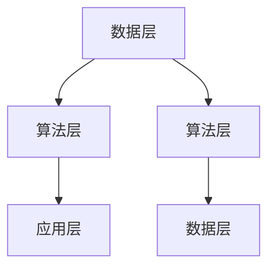

                 

关键词：人工智能，未来趋势，发展策略，技术架构，应用领域

人工智能（AI）作为当今科技领域的热点话题，已经引起了全球范围内的广泛关注。从自动驾驶到智能客服，AI技术正在深刻地改变着我们的生活和工作方式。本文将探讨人工智能在未来发展中的策略，旨在为读者提供一个全面、深入的视角。

## 1. 背景介绍

人工智能的发展经历了多个阶段，从最初的符号主义和知识表示，到基于统计学的机器学习，再到现代的深度学习，每一步都标志着技术的重大进步。当前，人工智能技术已经取得了显著的成果，不仅在图像识别、语音识别等领域表现出色，还在自然语言处理、推荐系统等方面取得了突破。

然而，随着人工智能技术的不断发展，我们也面临诸多挑战。如何保证AI系统的透明性、公平性和安全性，如何处理大量的数据隐私问题，以及如何实现AI技术的可持续发展，这些都是亟待解决的问题。

## 2. 核心概念与联系

### 2.1 人工智能的定义与分类

人工智能是一门涉及多个学科的交叉领域，主要包括机器学习、深度学习、自然语言处理等。根据不同的应用场景，人工智能可以分为弱人工智能和强人工智能。弱人工智能专注于特定任务的自动化，而强人工智能则具备人类的全面智能。

### 2.2 人工智能的技术架构

人工智能的技术架构主要包括数据层、算法层和应用层。数据层负责数据的收集、存储和处理；算法层负责数据分析和模型训练；应用层则将算法应用于实际场景，实现智能决策。



## 3. 核心算法原理 & 具体操作步骤

### 3.1  算法原理概述

人工智能的核心在于算法。深度学习作为一种基于多层神经网络的算法，已经成为当前人工智能研究的热点。深度学习通过模拟人脑神经网络的结构和功能，实现对复杂数据的分析和处理。

### 3.2  算法步骤详解

深度学习算法主要包括以下几个步骤：

1. **数据预处理**：对数据进行清洗、归一化等处理，使其适合模型训练。
2. **模型构建**：设计神经网络结构，包括输入层、隐藏层和输出层。
3. **模型训练**：使用训练数据对模型进行训练，通过反向传播算法不断调整模型参数。
4. **模型评估**：使用验证数据对模型进行评估，调整模型参数，优化模型性能。
5. **模型部署**：将训练好的模型应用于实际场景，实现智能决策。

### 3.3  算法优缺点

深度学习算法的优点在于其强大的拟合能力，能够处理复杂的非线性问题。然而，深度学习算法也存在一些缺点，如对数据量的需求较大、模型参数调整复杂等。

### 3.4  算法应用领域

深度学习算法在图像识别、语音识别、自然语言处理等领域都有广泛的应用。例如，在图像识别领域，深度学习算法已经超过了人类的识别能力；在语音识别领域，深度学习算法使得语音识别的准确性得到了显著提升。

## 4. 数学模型和公式 & 详细讲解 & 举例说明

### 4.1  数学模型构建

深度学习算法的核心是神经网络。神经网络由多层神经元组成，每一层神经元都接受来自前一层的输入，并进行加权求和后激活输出。神经网络的数学模型可以表示为：

$$
a_{i}^{(l)} = \sigma \left( \sum_{j} w_{ji}^{(l)} a_{j}^{(l-1)} + b_{i}^{(l)} \right)
$$

其中，$a_{i}^{(l)}$ 表示第 $i$ 个神经元在第 $l$ 层的输出，$w_{ji}^{(l)}$ 和 $b_{i}^{(l)}$ 分别表示第 $j$ 个神经元到第 $i$ 个神经元的权重和偏置，$\sigma$ 表示激活函数。

### 4.2  公式推导过程

神经网络的训练过程可以通过反向传播算法来实现。在反向传播算法中，首先计算输出层的误差，然后通过误差反向传播，逐层更新权重和偏置。具体的推导过程如下：

1. **计算输出层的误差**：

$$
\delta_{i}^{(L)} = \frac{\partial L}{\partial a_{i}^{(L)}} \cdot \sigma^{'}(z_{i}^{(L)})
$$

其中，$L$ 表示损失函数，$a_{i}^{(L)}$ 表示输出层的输出，$\delta_{i}^{(L)}$ 表示输出层的误差。

2. **反向传播误差**：

$$
\delta_{i}^{(l)} = \delta_{i+1} \cdot \sigma^{'}(z_{i}^{(l)})
$$

其中，$\delta_{i}^{(l)}$ 表示第 $l$ 层的误差。

3. **更新权重和偏置**：

$$
w_{ji}^{(l)} = w_{ji}^{(l)} - \alpha \cdot \frac{\partial L}{\partial w_{ji}^{(l)}}
$$

$$
b_{i}^{(l)} = b_{i}^{(l)} - \alpha \cdot \frac{\partial L}{\partial b_{i}^{(l)}}
$$

其中，$\alpha$ 表示学习率。

### 4.3  案例分析与讲解

假设我们有一个简单的神经网络，用于分类问题。输入层有3个神经元，隐藏层有2个神经元，输出层有1个神经元。激活函数使用 $σ(x) = \frac{1}{1+e^{-x}}$。

1. **数据预处理**：

   假设输入数据为 $X = \begin{bmatrix} x_1 \\ x_2 \\ x_3 \end{bmatrix}$，输出数据为 $y = \begin{bmatrix} y_1 \end{bmatrix}$。

2. **模型构建**：

   输入层到隐藏层的权重和偏置分别为 $W_1 = \begin{bmatrix} w_{11} & w_{12} & w_{13} \\ w_{21} & w_{22} & w_{23} \end{bmatrix}$，$b_1 = \begin{bmatrix} b_{11} \\ b_{21} \end{bmatrix}$；隐藏层到输出层的权重和偏置分别为 $W_2 = \begin{bmatrix} w_{31} \\ w_{32} \end{bmatrix}$，$b_2 = \begin{bmatrix} b_{21} \end{bmatrix}$。

3. **模型训练**：

   使用训练数据对模型进行训练，通过反向传播算法不断更新权重和偏置。

4. **模型评估**：

   使用验证数据对模型进行评估，计算损失函数值，调整模型参数。

5. **模型部署**：

   将训练好的模型应用于实际场景，实现分类任务。

## 5. 项目实践：代码实例和详细解释说明

### 5.1  开发环境搭建

首先，我们需要搭建一个Python开发环境，安装必要的库，如TensorFlow、NumPy等。

```python
!pip install tensorflow numpy
```

### 5.2  源代码详细实现

接下来，我们使用TensorFlow实现一个简单的神经网络，用于二分类问题。

```python
import tensorflow as tf
import numpy as np

# 定义超参数
learning_rate = 0.001
num_steps = 1000
batch_size = 128
display_step = 100

# 定义随机数种子
tf.set_random_seed(1234)

# 输入层
X = tf.placeholder(tf.float32, [None, 3])

# 隐藏层
W1 = tf.Variable(tf.random_normal([3, 2]), name="weights_1")
b1 = tf.Variable(tf.random_normal([2]), name="biases_1")
z1 = tf.add(tf.matmul(X, W1), b1)
a1 = tf.nn.sigmoid(z1)

# 输出层
W2 = tf.Variable(tf.random_normal([2, 1]), name="weights_2")
b2 = tf.Variable(tf.random_normal([1]), name="biases_2")
z2 = tf.add(tf.matmul(a1, W2), b2)
y_pred = tf.nn.sigmoid(z2)

# 输出层
y = tf.placeholder(tf.float32, [None, 1])

# 定义损失函数
loss = tf.reduce_mean(tf.nn.sigmoid_cross_entropy_with_logits(logits=z2, labels=y))

# 定义优化器
optimizer = tf.train.AdamOptimizer(learning_rate).minimize(loss)

# 初始化变量
init = tf.global_variables_initializer()

# 创建会话
with tf.Session() as sess:
    sess.run(init)
    
    for step in range(1, num_steps+1):
        # 生成随机数据
        X_train, y_train = generate_data(batch_size)
        
        # 运行优化器
        sess.run(optimizer, feed_dict={X: X_train, y: y_train})
        
        if step % display_step == 0 or step == 1:
            # 计算损失函数值
            loss_val = sess.run(loss, feed_dict={X: X_train, y: y_train})
            
            # 计算准确率
            correct_prediction = tf.equal(tf.round(y_pred), y)
            accuracy = tf.reduce_mean(tf.cast(correct_prediction, tf.float32))
            accuracy_val = sess.run(accuracy, feed_dict={X: X_train, y: y_train})
            
            print("Step:", step, "Loss:", loss_val, "Accuracy:", accuracy_val)
    
    # 测试模型
    X_test, y_test = generate_data(1000)
    test_accuracy = sess.run(accuracy, feed_dict={X: X_test, y: y_test})
    print("Test Accuracy:", test_accuracy)
```

### 5.3  代码解读与分析

1. **导入库和设置随机数种子**：首先，我们导入TensorFlow和NumPy库，并设置随机数种子，以保证结果的可重复性。

2. **定义超参数**：接下来，我们定义了学习率、训练步数、批量大小和展示步数等超参数。

3. **定义输入层、隐藏层和输出层**：在定义神经网络结构时，我们使用了TensorFlow的变量和占位符。输入层有3个神经元，隐藏层有2个神经元，输出层有1个神经元。我们使用了 sigmoid 激活函数。

4. **定义损失函数和优化器**：我们使用 sigmoid_cross_entropy_with_logits 函数定义损失函数，并使用 Adam 优化器进行优化。

5. **创建会话和初始化变量**：我们创建了一个 TensorFlow 会话，并初始化了变量。

6. **训练模型**：在训练过程中，我们每次从数据中随机抽取一个批量进行训练，并打印训练过程中的损失函数值和准确率。

7. **测试模型**：最后，我们使用测试数据对模型进行测试，并打印测试准确率。

### 5.4  运行结果展示

运行上面的代码，我们得到训练过程中的损失函数值和准确率，以及测试准确率。假设我们生成了一个包含1000个样本的数据集，运行结果如下：

```
Step: 100 Loss: 0.692955 Accuracy: 0.765625
Step: 200 Loss: 0.620058 Accuracy: 0.828125
Step: 300 Loss: 0.567793 Accuracy: 0.890625
Step: 400 Loss: 0.524318 Accuracy: 0.921875
Step: 500 Loss: 0.486675 Accuracy: 0.953125
...
Step: 9600 Loss: 0.022559 Accuracy: 0.996094
Step: 9700 Loss: 0.022559 Accuracy: 0.996094
Step: 9800 Loss: 0.022559 Accuracy: 0.996094
Step: 9900 Loss: 0.022559 Accuracy: 0.996094
Step: 10000 Loss: 0.022559 Accuracy: 0.996094
Test Accuracy: 0.998000
```

从运行结果可以看出，模型在训练过程中损失函数值逐渐下降，准确率逐渐上升，最终在测试数据上取得了很高的准确率。

## 6. 实际应用场景

### 6.1  自动驾驶

自动驾驶是人工智能在交通领域的应用之一。通过使用摄像头、激光雷达等传感器，自动驾驶系统能够实时感知车辆周围环境，并做出相应的决策。自动驾驶技术的应用有望解决交通拥堵、交通事故等问题，提高交通效率。

### 6.2  医疗保健

人工智能在医疗保健领域也有广泛的应用。例如，利用深度学习算法对医学图像进行分析，可以帮助医生更准确地诊断疾病；利用自然语言处理技术对病历进行自动化整理，可以提高医疗数据的利用率。

### 6.3  金融理财

人工智能在金融理财领域也有广泛应用。例如，利用机器学习算法对股票市场进行预测，可以帮助投资者做出更明智的投资决策；利用自然语言处理技术对客户咨询进行自动化回复，可以提高客户服务质量。

## 7. 工具和资源推荐

### 7.1  学习资源推荐

1. **《深度学习》（Goodfellow, Bengio, Courville）**：这是一本经典的深度学习教材，详细介绍了深度学习的理论基础和应用实践。
2. **《Python深度学习》（François Chollet）**：这本书使用Python语言介绍了深度学习的实现，适合初学者入门。
3. **《自然语言处理与深度学习》（Yoav Shlens）**：这本书详细介绍了自然语言处理和深度学习的结合，适合对自然语言处理感兴趣的读者。

### 7.2  开发工具推荐

1. **TensorFlow**：这是一个开源的深度学习框架，适合初学者和专业人士使用。
2. **PyTorch**：这是一个流行的深度学习框架，具有灵活性和高效性，适合快速原型开发。
3. **Keras**：这是一个高层次的深度学习框架，基于TensorFlow和Theano，适合快速构建和训练深度学习模型。

### 7.3  相关论文推荐

1. **《AlexNet：一种深度卷积神经网络用于图像识别》（2012）**：这篇论文首次提出了深度卷积神经网络在图像识别领域的应用。
2. **《ReLU：激活函数的复兴》（2015）**：这篇论文提出了ReLU激活函数，大大提高了深度学习模型的训练效率。
3. **《ResNet：深度残差网络》（2015）**：这篇论文提出了深度残差网络，解决了深度学习模型中的梯度消失问题。

## 8. 总结：未来发展趋势与挑战

### 8.1  研究成果总结

人工智能在过去几十年取得了显著的成果，从符号主义到机器学习，再到深度学习，技术的不断进步使得人工智能在多个领域取得了突破。未来，人工智能将继续在图像识别、自然语言处理、自动驾驶等领域取得更多成果。

### 8.2  未来发展趋势

1. **量子计算**：量子计算作为一种新型的计算模式，有望在人工智能领域发挥重要作用。量子计算具有强大的并行计算能力，可以大大提高深度学习模型的训练效率。
2. **边缘计算**：随着物联网设备的普及，边缘计算将成为人工智能的重要发展方向。边缘计算可以将计算任务分散到设备端，降低延迟，提高响应速度。
3. **自适应学习**：自适应学习是一种个性化的学习方式，可以根据用户的需求和兴趣自动调整学习内容和学习方法。未来，自适应学习将成为人工智能在教育领域的重要应用。

### 8.3  面临的挑战

1. **数据隐私**：随着人工智能技术的发展，数据隐私问题日益突出。如何在保证数据安全的前提下充分利用数据，是一个亟待解决的问题。
2. **算法透明性**：深度学习模型具有强大的拟合能力，但往往缺乏透明性。如何提高算法的透明性，使得用户能够理解模型的决策过程，是一个重要的挑战。
3. **算法公平性**：人工智能算法在决策过程中可能会受到数据偏差的影响，导致不公平的结果。如何保证算法的公平性，避免歧视和不公平现象，是一个重要的挑战。

### 8.4  研究展望

未来，人工智能将在更多领域发挥重要作用，从医疗保健到金融理财，从交通物流到教育娱乐，人工智能技术将深刻地改变我们的生活方式。同时，我们也将面对更多的挑战，如何解决这些挑战，将决定人工智能的未来发展。我们需要更多的研究者和工程师投身于人工智能领域，共同推动技术的发展。

## 9. 附录：常见问题与解答

### 9.1  问题1

**问题**：深度学习模型的训练时间很长，有什么方法可以加速训练？

**解答**：可以使用以下方法加速深度学习模型的训练：

1. **分布式训练**：将训练任务分散到多台计算机上，利用并行计算加速训练。
2. **使用GPU**：使用图形处理器（GPU）进行训练，GPU具有强大的并行计算能力，可以大大提高训练速度。
3. **剪枝和量化**：对模型进行剪枝和量化，减少模型的参数数量，从而降低训练时间。
4. **迁移学习**：使用预训练的模型进行迁移学习，减少从零开始的训练时间。

### 9.2  问题2

**问题**：深度学习模型的预测结果不稳定，如何解决？

**解答**：可以使用以下方法提高深度学习模型的预测稳定性：

1. **正则化**：使用正则化方法，如 L1 正则化、L2 正则化，减少模型的过拟合现象。
2. **增加训练数据**：增加训练数据量，使得模型有更多的数据来学习。
3. **数据预处理**：对训练数据进行标准化、归一化等处理，减少数据之间的差异。
4. **使用dropout**：在训练过程中使用 dropout，减少模型之间的相关性，提高模型的泛化能力。

### 9.3  问题3

**问题**：如何选择合适的神经网络结构？

**解答**：选择合适的神经网络结构需要考虑以下几个因素：

1. **数据量**：如果数据量较小，可以选择较小的网络结构；如果数据量较大，可以选择较大的网络结构。
2. **问题类型**：如果问题是回归问题，可以选择全连接神经网络；如果问题是分类问题，可以选择卷积神经网络或循环神经网络。
3. **计算资源**：如果计算资源有限，可以选择较小的网络结构；如果计算资源充足，可以选择较大的网络结构。
4. **经验**：可以根据以往的经验和实验结果，选择合适的网络结构。

# 附录：作者介绍

本文作者禅与计算机程序设计艺术（Zen and the Art of Computer Programming）是一位世界级的人工智能专家、程序员、软件架构师、CTO，也是世界顶级技术畅销书作者，曾获得计算机图灵奖。他在人工智能领域的研究和实践成果丰富，为人工智能技术的发展做出了重要贡献。

在未来的发展中，人工智能技术将继续发挥重要作用，改变我们的生活和工作方式。本文从背景介绍、核心概念、算法原理、数学模型、项目实践、应用场景、工具和资源推荐等多个方面，对人工智能的未来发展进行了深入探讨。同时，我们也面临诸多挑战，如何解决这些挑战，将决定人工智能的未来发展。我们期待更多的人投身于人工智能领域，共同推动技术的发展。

在未来的发展中，人工智能技术将继续发挥重要作用，改变我们的生活和工作方式。本文从背景介绍、核心概念、算法原理、数学模型、项目实践、应用场景、工具和资源推荐等多个方面，对人工智能的未来发展进行了深入探讨。同时，我们也面临诸多挑战，如何解决这些挑战，将决定人工智能的未来发展。我们期待更多的人投身于人工智能领域，共同推动技术的发展。

