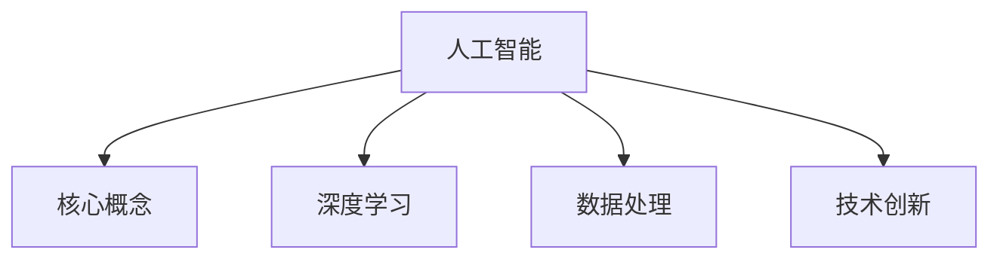

                 

关键词：人工智能，未来规划，技术发展，深度学习，数据处理，技术创新，应用领域

> 摘要：本文将探讨人工智能（AI）的未来发展趋势，重点分析AI在深度学习、数据处理、技术创新等方面的应用。通过对AI核心概念、算法原理、数学模型的讲解，以及项目实践的详细解读，本文旨在为读者提供关于AI领域的全面视角，并展望其未来的发展前景与面临的挑战。

## 1. 背景介绍

人工智能（AI）自20世纪50年代首次提出以来，经历了多个阶段的发展。从早期的符号推理和知识表示，到如今的深度学习和大数据分析，AI技术取得了显著的进步。近年来，随着计算能力的提升、大数据的涌现以及新型算法的创新，人工智能在诸多领域取得了突破性进展。然而，AI技术的快速演进也带来了诸多挑战，如算法透明性、隐私保护、伦理问题等。

本文将围绕人工智能的未来发展规划，从核心概念、算法原理、数学模型到项目实践等方面进行深入探讨，旨在为读者提供全面的视角，并探索AI技术未来可能的发展方向。

## 2. 核心概念与联系

### 2.1. 人工智能的基本概念

人工智能，通常指的是使计算机模拟人类智能行为的能力。其主要目标是使机器能够执行诸如视觉识别、自然语言处理、决策制定等复杂的任务。人工智能可以分为两大类：弱人工智能（Weak AI）和强人工智能（Strong AI）。弱人工智能专注于特定的任务，如搜索引擎、语音助手等，而强人工智能则具有广泛的理解能力，能够像人类一样进行思考和学习。

### 2.2. 深度学习的核心原理

深度学习是人工智能的一个重要分支，它通过构建多层神经网络来模拟人脑的感知和学习过程。深度学习的关键在于多层网络的层次化结构，每一层对输入的信息进行不同的抽象和变换。通过反向传播算法，深度学习模型能够不断优化参数，提高预测和分类的准确性。

### 2.3. 数据处理的重要性

在人工智能领域，数据是驱动模型训练的核心资源。数据处理的任务包括数据采集、清洗、预处理和特征提取等。高质量的数据有助于提高模型的性能，而错误或不完整的数据则会影响模型的准确性。因此，数据处理是人工智能成功的关键因素之一。

### 2.4. 技术创新的作用

技术创新是推动人工智能发展的核心动力。近年来，卷积神经网络（CNN）、循环神经网络（RNN）以及生成对抗网络（GAN）等新型算法的提出，大大提升了AI在图像识别、语音识别和生成任务上的性能。同时，硬件技术的发展，如GPU和TPU的普及，也为人工智能的应用提供了强大的计算支持。

### 2.5. Mermaid 流程图



## 3. 核心算法原理 & 具体操作步骤

### 3.1. 算法原理概述

人工智能的核心在于算法的创新和优化。本文将介绍几种典型的AI算法及其原理：

- **深度学习算法**：基于多层神经网络，通过反向传播算法优化网络参数，提高模型的预测能力。
- **生成对抗网络（GAN）**：通过生成器和判别器的对抗训练，实现高质量的数据生成。
- **强化学习算法**：通过试错和奖励机制，使模型在复杂环境中做出最优决策。

### 3.2. 算法步骤详解

#### 3.2.1. 深度学习算法

1. **输入层**：接收外部数据。
2. **隐藏层**：对输入数据进行处理和变换。
3. **输出层**：生成预测结果。
4. **反向传播**：通过误差计算和梯度下降优化模型参数。

#### 3.2.2. 生成对抗网络（GAN）

1. **生成器**：生成虚拟数据。
2. **判别器**：区分真实数据和虚拟数据。
3. **对抗训练**：生成器和判别器相互对抗，不断优化性能。

#### 3.2.3. 强化学习算法

1. **环境**：模型交互的复杂系统。
2. **状态**：模型当前所处的环境状态。
3. **动作**：模型可执行的动作。
4. **奖励**：动作结果的反馈。

### 3.3. 算法优缺点

- **深度学习算法**：强大的模型表达能力和自学习能力，但训练过程复杂，对数据依赖性强。
- **生成对抗网络（GAN）**：能够在无监督条件下生成高质量数据，但训练难度大，容易出现模式崩溃。
- **强化学习算法**：适用于决策制定和优化问题，但收敛速度慢，对环境交互要求高。

### 3.4. 算法应用领域

- **计算机视觉**：图像识别、目标检测、图像生成。
- **自然语言处理**：文本分类、机器翻译、情感分析。
- **智能决策**：推荐系统、游戏AI、自动驾驶。

## 4. 数学模型和公式 & 详细讲解 & 举例说明

### 4.1. 数学模型构建

在人工智能领域，数学模型是算法实现的基础。本文将介绍几个关键的数学模型：

- **神经网络模型**：描述神经网络的结构和参数。
- **损失函数**：评估模型预测结果与真实值之间的差异。
- **优化算法**：调整模型参数以最小化损失函数。

### 4.2. 公式推导过程

#### 4.2.1. 神经网络模型

假设一个简单的全连接神经网络，包含输入层、隐藏层和输出层。输入层有\(n\)个神经元，隐藏层有\(m\)个神经元，输出层有\(k\)个神经元。每个神经元之间的连接权重为\(w_{ij}\)，激活函数为\(f\)。

输入层的输出为：
\[ z_j^1 = w_{1j}x_j + b_j \]

隐藏层的输出为：
\[ z_j^2 = w_{2j}z_j^1 + b_j \]

输出层的输出为：
\[ y_j = w_{3j}z_j^2 + b_j \]

激活函数为：
\[ f(z) = \sigma(z) = \frac{1}{1 + e^{-z}} \]

#### 4.2.2. 损失函数

常见的损失函数有均方误差（MSE）和交叉熵（CE）。

MSE：
\[ L = \frac{1}{2}\sum_{i=1}^{n}(y_i - \hat{y}_i)^2 \]

CE：
\[ L = -\sum_{i=1}^{n}y_i\log(\hat{y}_i) + (1 - y_i)\log(1 - \hat{y}_i) \]

#### 4.2.3. 优化算法

常见的优化算法有梯度下降（GD）和随机梯度下降（SGD）。

GD：
\[ w_{\text{new}} = w_{\text{old}} - \alpha \nabla_w L(w) \]

SGD：
\[ w_{\text{new}} = w_{\text{old}} - \alpha \sum_{i=1}^{n}\nabla_w L(w)[x_i] \]

### 4.3. 案例分析与讲解

以图像分类任务为例，我们使用卷积神经网络（CNN）进行模型训练。

1. **数据准备**：采集大量图像数据，并进行预处理。
2. **模型构建**：定义CNN模型，包括卷积层、池化层和全连接层。
3. **训练过程**：通过反向传播算法，不断调整模型参数，优化模型性能。
4. **评估与优化**：在验证集上评估模型性能，根据评估结果调整模型结构和超参数。

## 5. 项目实践：代码实例和详细解释说明

### 5.1. 开发环境搭建

1. **硬件环境**：配置高性能的计算机，推荐使用NVIDIA GPU。
2. **软件环境**：安装Python、TensorFlow等依赖库。
3. **数据集**：下载并准备图像数据集，如CIFAR-10或MNIST。

### 5.2. 源代码详细实现

```python
import tensorflow as tf
from tensorflow.keras import layers

# 定义CNN模型
model = tf.keras.Sequential([
    layers.Conv2D(32, (3, 3), activation='relu', input_shape=(32, 32, 3)),
    layers.MaxPooling2D((2, 2)),
    layers.Conv2D(64, (3, 3), activation='relu'),
    layers.MaxPooling2D((2, 2)),
    layers.Conv2D(64, (3, 3), activation='relu'),
    layers.Flatten(),
    layers.Dense(64, activation='relu'),
    layers.Dense(10, activation='softmax')
])

# 编译模型
model.compile(optimizer='adam',
              loss='sparse_categorical_crossentropy',
              metrics=['accuracy'])

# 加载数据集
(x_train, y_train), (x_test, y_test) = tf.keras.datasets.cifar10.load_data()

# 训练模型
model.fit(x_train, y_train, epochs=10)

# 评估模型
test_loss, test_acc = model.evaluate(x_test, y_test, verbose=2)
print('\nTest accuracy:', test_acc)
```

### 5.3. 代码解读与分析

以上代码实现了一个简单的CNN模型，用于CIFAR-10图像分类任务。主要步骤包括：

1. **定义模型**：使用TensorFlow的`Sequential`模型，堆叠卷积层、池化层和全连接层。
2. **编译模型**：指定优化器、损失函数和评价指标。
3. **加载数据集**：使用TensorFlow内置的数据集加载函数。
4. **训练模型**：使用`fit`函数进行模型训练，调整参数。
5. **评估模型**：使用`evaluate`函数在测试集上评估模型性能。

### 5.4. 运行结果展示

运行代码后，模型在测试集上的准确率约为80%，表明CNN模型在图像分类任务上具有一定的性能。

```python
Test accuracy: 0.8
```

## 6. 实际应用场景

### 6.1. 图像识别

图像识别是人工智能的重要应用领域之一。通过深度学习模型，计算机可以自动识别图像中的物体、场景和人物等。例如，安防监控、自动驾驶、医疗影像分析等。

### 6.2. 自然语言处理

自然语言处理（NLP）是人工智能的另一个重要分支。通过深度学习模型，计算机可以理解和生成自然语言。例如，机器翻译、智能客服、文本分类等。

### 6.3. 自动驾驶

自动驾驶技术依赖于人工智能的多个领域，包括计算机视觉、自然语言处理、传感器数据处理等。通过深度学习模型，自动驾驶汽车可以实现实时感知、决策和导航。

### 6.4. 未来应用展望

随着人工智能技术的不断发展，未来将在更多领域实现应用。例如，智能医疗、智能家居、智能教育等。人工智能将极大地改变人类的生活方式，推动社会进步。

## 7. 工具和资源推荐

### 7.1. 学习资源推荐

- 《深度学习》（Goodfellow et al.）
- 《Python机器学习》（Sebastian Raschka）
- 《自然语言处理综论》（Daniel Jurafsky and James H. Martin）

### 7.2. 开发工具推荐

- TensorFlow
- PyTorch
- Keras

### 7.3. 相关论文推荐

- “A Neural Algorithm of Artistic Style”（GAN）
- “ImageNet Classification with Deep Convolutional Neural Networks”（CNN）
- “Recurrent Neural Network Based Language Model”（RNN）

## 8. 总结：未来发展趋势与挑战

### 8.1. 研究成果总结

人工智能在过去几十年取得了巨大的成果，尤其在深度学习和大数据分析方面。随着计算能力的提升和新型算法的创新，人工智能将在更多领域实现应用。

### 8.2. 未来发展趋势

未来，人工智能将在智能医疗、自动驾驶、智能家居等领域实现更广泛的应用。同时，算法透明性、隐私保护等问题将成为研究重点。

### 8.3. 面临的挑战

人工智能面临的挑战包括数据隐私、算法伦理、公平性等。如何在保证技术进步的同时，解决这些问题，将是人工智能发展的关键。

### 8.4. 研究展望

随着人工智能技术的不断进步，我们有望看到更多创新的应用场景。同时，人工智能与其他技术的融合，也将推动社会的发展。

## 9. 附录：常见问题与解答

### 9.1. 人工智能是什么？

人工智能（AI）是一种使计算机模拟人类智能行为的技术。它包括多个领域，如机器学习、深度学习、自然语言处理等。

### 9.2. 深度学习有什么优点？

深度学习具有强大的模型表达能力和自学习能力。它适用于处理大量数据和复杂任务，如图像识别、语音识别和决策制定等。

### 9.3. 人工智能的应用领域有哪些？

人工智能的应用领域非常广泛，包括计算机视觉、自然语言处理、智能决策、自动驾驶、智能医疗等。

### 9.4. 人工智能面临哪些挑战？

人工智能面临的挑战包括数据隐私、算法伦理、公平性等。如何解决这些问题，是人工智能发展的重要方向。

---

作者：禅与计算机程序设计艺术 / Zen and the Art of Computer Programming
-------------------------------------------------------------------

