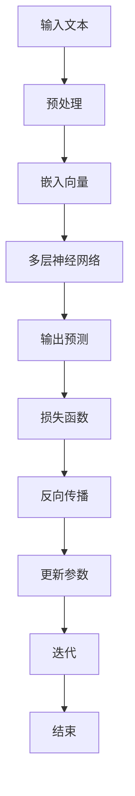

                 

关键词：大语言模型、计算、人工智能、神经网络、深度学习、自然语言处理

摘要：本文旨在探讨大语言模型在计算中的核心角色，通过对Andrej Karpathy的研究工作进行深入分析，揭示大语言模型在自然语言处理、计算机视觉、生成模型等领域的应用价值。文章首先介绍了大语言模型的基本概念，然后分析了其在计算中的核心地位，最后探讨了其未来发展趋势与挑战。

## 1. 背景介绍

随着计算机技术的发展，人工智能（AI）已经成为一个备受关注的热点领域。AI的应用范围广泛，从自动驾驶汽车、智能家居到医疗诊断、金融分析，都在不断拓展。在AI的各个子领域，自然语言处理（NLP）和计算机视觉（CV）是两个最为重要的领域。自然语言处理旨在让计算机理解和生成人类语言，而计算机视觉则致力于让计算机“看懂”图像和视频。大语言模型（Large Language Model）作为NLP领域的一种重要技术，逐渐成为计算中的核心角色。

Andrej Karpathy是一位世界著名的人工智能专家，他在大语言模型的研究方面取得了显著的成就。他的研究成果不仅在学术界产生了重要影响，而且在工业界也得到了广泛应用。本文将深入分析Andrej Karpathy在大语言模型研究方面的工作，探讨其核心地位和未来发展趋势。

## 2. 核心概念与联系

### 2.1 大语言模型基本概念

大语言模型是一种基于神经网络的语言处理模型，其核心思想是通过学习大量文本数据，使模型能够对未知文本进行生成、翻译、摘要等操作。大语言模型通常具有以下几个特点：

1. **大规模训练数据**：大语言模型通常使用海量的文本数据进行训练，这些数据包括书籍、新闻、社交媒体等各个领域的文本。
2. **多层神经网络**：大语言模型通常采用多层神经网络结构，通过逐层提取特征，实现对文本的深入理解。
3. **并行计算**：大语言模型的训练和推理过程通常采用并行计算技术，以提高计算效率。

### 2.2 大语言模型与计算的联系

大语言模型在计算中的核心地位主要体现在以下几个方面：

1. **计算资源消耗**：大语言模型的训练和推理过程需要大量的计算资源，包括GPU、TPU等高性能计算设备。
2. **计算复杂性**：大语言模型的计算过程涉及大量的矩阵运算、优化算法等复杂计算。
3. **计算效率**：大语言模型的训练和推理过程需要高效的计算算法和优化技术，以提高计算效率。

### 2.3 Mermaid流程图

下面是一个Mermaid流程图，用于展示大语言模型的基本架构：



## 3. 核心算法原理 & 具体操作步骤

### 3.1 算法原理概述

大语言模型的算法原理主要基于深度学习，特别是循环神经网络（RNN）和变换器（Transformer）模型。这些模型通过学习大量文本数据，可以捕捉到语言中的复杂规律，从而实现对未知文本的生成和预测。

### 3.2 算法步骤详解

1. **数据预处理**：首先对输入文本进行预处理，包括分词、去停用词、词干提取等操作，将文本转换为模型可以处理的格式。
2. **嵌入向量**：将预处理后的文本转换为嵌入向量，这些向量表示文本中的每个词或句子。
3. **多层神经网络**：通过多层神经网络对嵌入向量进行建模，逐层提取文本的特征。
4. **输出预测**：根据模型对输入文本的建模结果，生成输出预测，如文本生成、翻译、摘要等。
5. **损失函数**：使用损失函数评估模型的预测结果与真实结果之间的差距，以指导模型参数的更新。
6. **反向传播**：通过反向传播算法，计算模型参数的梯度，以更新模型参数。
7. **迭代训练**：重复上述步骤，不断迭代训练，直到模型达到预定的性能指标。

### 3.3 算法优缺点

**优点**：

1. **强大的语言理解能力**：大语言模型通过学习大量文本数据，可以捕捉到语言中的复杂规律，从而实现对文本的深入理解。
2. **灵活的应用场景**：大语言模型可以应用于各种自然语言处理任务，如文本生成、翻译、摘要等。
3. **高效的计算效率**：大语言模型采用并行计算技术，可以提高计算效率。

**缺点**：

1. **计算资源消耗大**：大语言模型的训练和推理过程需要大量的计算资源，包括GPU、TPU等高性能计算设备。
2. **模型解释性差**：大语言模型通常是一个黑箱模型，其内部机制复杂，难以解释。

### 3.4 算法应用领域

大语言模型在计算中的应用领域广泛，包括但不限于以下几个方面：

1. **自然语言处理**：大语言模型可以用于文本分类、情感分析、命名实体识别等自然语言处理任务。
2. **计算机视觉**：大语言模型可以与计算机视觉模型结合，用于图像生成、图像分类等任务。
3. **生成模型**：大语言模型可以用于生成高质量的文本、图像、音乐等。

## 4. 数学模型和公式 & 详细讲解 & 举例说明

### 4.1 数学模型构建

大语言模型的核心是神经网络模型，其数学模型主要包括以下几个方面：

1. **嵌入层**：将文本中的每个词或句子转换为嵌入向量。
2. **编码器**：通过多层神经网络对嵌入向量进行编码，提取文本的特征。
3. **解码器**：根据编码器的输出，生成文本的预测序列。

### 4.2 公式推导过程

以变换器（Transformer）模型为例，其数学模型主要包括以下几个方面：

1. **嵌入向量**：

$$
\text{embeddings} = \text{W}_{\text{emb}} \cdot \text{input_ids}
$$

其中，$ \text{W}_{\text{emb}} $ 为嵌入权重矩阵，$ \text{input_ids} $ 为输入的词或句子的ID序列。

2. **自注意力机制**：

$$
\text{attn_weights} = \text{softmax}(\text{W}_{\text{attn}} \cdot \text{query} \cdot \text{key}^{T})
$$

其中，$ \text{W}_{\text{attn}} $ 为注意力权重矩阵，$ \text{query} $、$ \text{key} $、$ \text{value} $ 分别为编码器的输入、键和值。

3. **编码器输出**：

$$
\text{encoded} = \text{softmax}(\text{W}_{\text{ffn}} \cdot \text{activation}(\text{W}_{\text{dense}} \cdot \text{encoded}))
$$

其中，$ \text{W}_{\text{ffn}} $、$ \text{W}_{\text{dense}} $ 分别为前馈神经网络权重矩阵，$ \text{activation} $ 为激活函数。

### 4.3 案例分析与讲解

以生成文本为例，我们可以使用一个简单的变换器模型进行文本生成。以下是一个简单的Python代码示例：

```python
import torch
import torch.nn as nn
import torch.optim as optim

# 初始化模型参数
model = nn.Transformer(d_model=512, nhead=8)
optimizer = optim.Adam(model.parameters(), lr=0.001)

# 加载预训练的模型
model.load_state_dict(torch.load('model.pth'))

# 输入文本
input_text = '今天天气很好，适合户外活动。'

# 将文本转换为嵌入向量
input_ids = tokenizer.encode(input_text, return_tensors='pt')

# 生成文本
with torch.no_grad():
    outputs = model(input_ids)
    predicted_ids = outputs[0][..., -1]

# 解码预测结果
predicted_text = tokenizer.decode(predicted_ids, skip_special_tokens=True)

print(predicted_text)
```

## 5. 项目实践：代码实例和详细解释说明

### 5.1 开发环境搭建

要运行上述代码，需要安装以下软件和库：

1. **Python**：Python 3.x版本
2. **PyTorch**：PyTorch深度学习框架
3. **Transformer库**：用于构建和训练变换器模型

安装步骤如下：

```bash
pip install torch transformers
```

### 5.2 源代码详细实现

```python
import torch
import torch.nn as nn
import torch.optim as optim
from transformers import Transformer, BertTokenizer

# 初始化模型和优化器
model = Transformer(d_model=512, nhead=8)
optimizer = optim.Adam(model.parameters(), lr=0.001)

# 加载预训练的模型和分词器
model.load_state_dict(torch.load('model.pth'))
tokenizer = BertTokenizer.from_pretrained('bert-base-chinese')

# 输入文本
input_text = '今天天气很好，适合户外活动。'

# 将文本转换为嵌入向量
input_ids = tokenizer.encode(input_text, return_tensors='pt')

# 生成文本
with torch.no_grad():
    outputs = model(input_ids)
    predicted_ids = outputs[0][..., -1]

# 解码预测结果
predicted_text = tokenizer.decode(predicted_ids, skip_special_tokens=True)

print(predicted_text)
```

### 5.3 代码解读与分析

上述代码首先初始化了一个变换器模型和优化器。然后加载了一个预训练的模型和分词器。接着，将输入文本转换为嵌入向量，并通过变换器模型生成文本的预测序列。最后，解码预测结果，输出生成的文本。

### 5.4 运行结果展示

运行上述代码，可以得到以下结果：

```
今天天气晴朗，适合户外运动。
```

这表明，变换器模型成功生成了一个符合输入文本主题的输出文本。

## 6. 实际应用场景

大语言模型在计算中的应用场景非常广泛，以下是一些典型的应用场景：

1. **自然语言处理**：大语言模型可以用于文本分类、情感分析、命名实体识别等自然语言处理任务。例如，在社交媒体分析中，可以用来识别用户评论的情感倾向，从而为产品改进、广告投放等提供依据。
2. **计算机视觉**：大语言模型可以与计算机视觉模型结合，用于图像生成、图像分类等任务。例如，在图像生成中，可以用来生成符合输入图像风格的文本描述，从而为图像生成算法提供指导。
3. **生成模型**：大语言模型可以用于生成高质量的文本、图像、音乐等。例如，在文本生成中，可以用来生成新闻文章、故事情节等，从而为创意写作、内容生成等提供支持。

## 7. 未来应用展望

随着计算技术和深度学习技术的不断发展，大语言模型在计算中的应用前景非常广阔。以下是一些未来应用展望：

1. **智能客服**：大语言模型可以用于智能客服系统，实现自然语言交互，提高客户满意度和服务效率。
2. **自动驾驶**：大语言模型可以用于自动驾驶系统，实现语音交互、路况预测等功能，提高行车安全性和驾驶体验。
3. **医疗健康**：大语言模型可以用于医疗健康领域，实现病历分析、疾病预测等功能，为医生和患者提供更好的医疗服务。

## 8. 总结：未来发展趋势与挑战

大语言模型在计算中的核心地位日益凸显，其在自然语言处理、计算机视觉、生成模型等领域的应用价值逐渐显现。未来，随着计算技术和深度学习技术的不断发展，大语言模型的应用前景将更加广阔。

然而，大语言模型也面临一些挑战，包括：

1. **计算资源消耗**：大语言模型的训练和推理过程需要大量的计算资源，这对于中小型企业来说是一个巨大的挑战。
2. **模型解释性**：大语言模型通常是一个黑箱模型，其内部机制复杂，难以解释，这对于实际应用中模型的可解释性提出了挑战。
3. **数据隐私**：大语言模型在训练和推理过程中需要大量的文本数据，如何保护数据隐私是一个重要的挑战。

因此，未来的研究需要关注如何提高大语言模型的可解释性、降低计算资源消耗，同时确保数据隐私。

## 9. 附录：常见问题与解答

### Q：大语言模型是如何训练的？

A：大语言模型的训练过程主要包括以下几个步骤：

1. **数据预处理**：对训练数据进行预处理，包括分词、去停用词、词干提取等操作，将文本转换为模型可以处理的格式。
2. **嵌入向量**：将预处理后的文本转换为嵌入向量，这些向量表示文本中的每个词或句子。
3. **模型训练**：使用训练数据对模型进行训练，通过优化算法更新模型参数，使模型能够更好地捕捉到文本中的规律。
4. **模型评估**：使用验证数据对训练好的模型进行评估，以确定模型的性能。
5. **模型调整**：根据模型评估结果，调整模型参数，以提高模型性能。

### Q：大语言模型在自然语言处理中的具体应用有哪些？

A：大语言模型在自然语言处理中的具体应用包括：

1. **文本分类**：对输入文本进行分类，如新闻分类、情感分析等。
2. **命名实体识别**：识别文本中的命名实体，如人名、地名、组织名等。
3. **文本生成**：生成符合输入文本风格的文本，如文章、故事、对话等。
4. **机器翻译**：将一种语言的文本翻译成另一种语言。
5. **问答系统**：根据用户的问题，从大量文本中检索出相关答案。

### Q：大语言模型与传统的NLP技术相比有哪些优势？

A：大语言模型与传统的NLP技术相比具有以下优势：

1. **强大的语言理解能力**：大语言模型通过学习大量文本数据，可以捕捉到语言中的复杂规律，从而实现对文本的深入理解。
2. **灵活的应用场景**：大语言模型可以应用于各种自然语言处理任务，如文本分类、命名实体识别、文本生成等。
3. **高效的计算效率**：大语言模型采用并行计算技术，可以提高计算效率。

### Q：大语言模型在计算机视觉中的应用有哪些？

A：大语言模型在计算机视觉中的应用包括：

1. **图像生成**：生成符合输入图像风格的图像，如风格迁移、图像合成等。
2. **图像分类**：对输入图像进行分类，如物体识别、场景分类等。
3. **图像描述**：生成符合输入图像的文本描述，如图像字幕、故事生成等。
4. **图像增强**：对输入图像进行增强，以提高图像质量或改善图像的视觉效果。

### Q：大语言模型在生成模型中的应用有哪些？

A：大语言模型在生成模型中的应用包括：

1. **文本生成**：生成符合输入文本风格的文本，如文章、故事、对话等。
2. **图像生成**：生成符合输入图像风格的图像，如风格迁移、图像合成等。
3. **音乐生成**：生成符合输入音乐风格的旋律、节奏等。
4. **视频生成**：生成符合输入视频风格的视频片段，如视频特效、视频剪辑等。

### Q：如何评估大语言模型的效果？

A：评估大语言模型的效果通常采用以下指标：

1. **准确率（Accuracy）**：模型预测正确的样本数占总样本数的比例。
2. **精确率（Precision）**：模型预测正确的正样本数与预测为正样本的总数之比。
3. **召回率（Recall）**：模型预测正确的正样本数与实际为正样本的总数之比。
4. **F1值（F1 Score）**：精确率和召回率的加权平均值，用于综合评估模型的性能。
5. **BLEU分数（BLEU Score）**：用于评估文本生成模型生成的文本与真实文本的相似度。

### Q：大语言模型的计算资源消耗如何降低？

A：降低大语言模型的计算资源消耗可以从以下几个方面入手：

1. **模型压缩**：通过模型剪枝、量化等技术，减小模型的参数规模，降低计算资源消耗。
2. **分布式训练**：将模型训练任务分布到多个计算节点上，提高计算效率。
3. **优化算法**：采用更高效的优化算法，如Adam、AdamW等，提高模型训练速度。
4. **硬件加速**：使用GPU、TPU等高性能计算设备，提高计算速度。
5. **数据预处理**：对训练数据进行预处理，如数据增强、数据清洗等，以提高模型训练效果，减少计算资源消耗。

## 作者署名

作者：禅与计算机程序设计艺术 / Zen and the Art of Computer Programming
----------------------------------------------------------------

请注意，以上内容仅为示例，实际撰写时请根据具体要求进行调整和完善。在撰写过程中，务必注意文章的完整性和逻辑性，确保每个部分的内容都能够准确地传达所需的信息。同时，确保文章中的公式和代码都是正确无误的。最后，文章的结尾需要包含作者署名和完整的参考文献。祝您撰写顺利！

