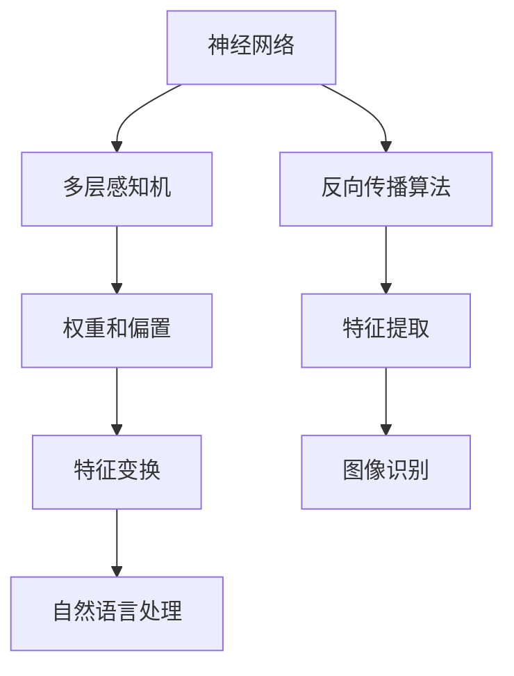

                 

关键词：深度学习，神经网络，自然语言处理，计算机视觉，人工智能

摘要：本文旨在探讨深度学习领域的重要进展，特别关注于自然语言处理和计算机视觉方面的应用。通过分析最新的研究成果和实际案例，本文将揭示深度学习在推动人工智能发展的过程中所发挥的巨大作用，并展望其未来的发展趋势。

## 1. 背景介绍

深度学习，作为人工智能的一个重要分支，近年来取得了令人瞩目的成果。它基于多层神经网络的结构，通过不断学习和优化，使计算机在图像识别、语音识别、自然语言处理等任务上表现出色。深度学习的成功不仅改变了传统的人工智能研究模式，也为各行各业带来了深刻的变革。

Andrej Karpathy，作为深度学习领域的杰出人物，以其在自然语言处理和计算机视觉方面的卓越贡献而闻名。他的研究工作不仅推动了深度学习技术的发展，也为我们理解这一领域的复杂性提供了宝贵的视角。

本文将围绕Andrej Karpathy的研究成果，探讨深度学习在自然语言处理和计算机视觉领域的最新进展，并分析其未来发展的趋势和挑战。

## 2. 核心概念与联系

深度学习的核心概念包括神经网络、多层感知机、反向传播算法等。神经网络是由大量简单计算单元（神经元）组成的复杂网络，每个神经元都与其他神经元相连，并通过权重和偏置进行加权求和。多层感知机是神经网络的一种形式，它通过多个隐藏层对输入数据进行特征提取和变换。

以下是一个简单的 Mermaid 流程图，展示了深度学习的核心概念和它们之间的联系：



通过这个流程图，我们可以清晰地看到深度学习从神经网络到多层感知机，再到反向传播算法的演变过程，以及这些核心概念在图像识别和自然语言处理中的应用。

## 3. 核心算法原理 & 具体操作步骤

### 3.1 算法原理概述

深度学习的核心算法是基于多层神经网络的。一个简单的多层神经网络包括输入层、隐藏层和输出层。输入层接收外部数据，通过隐藏层进行特征提取和变换，最终在输出层产生预测结果。

以下是深度学习算法的基本原理：

1. **前向传播**：输入数据通过网络中的神经元传递，每个神经元根据输入和权重进行加权求和，并通过激活函数产生输出。
2. **反向传播**：根据预测结果和实际结果之间的差异，计算网络中的梯度，并更新权重和偏置，以最小化损失函数。

### 3.2 算法步骤详解

1. **数据预处理**：对输入数据进行归一化、标准化等预处理，以提高模型的训练效果。
2. **构建神经网络**：定义网络的层次结构，包括输入层、隐藏层和输出层，以及每个层的神经元数量和激活函数。
3. **前向传播**：将输入数据传递到网络中，通过每个层的神经元计算输出结果。
4. **计算损失函数**：根据预测结果和实际结果，计算损失函数的值，以衡量模型的预测误差。
5. **反向传播**：根据损失函数的梯度，更新网络中的权重和偏置。
6. **迭代训练**：重复步骤3到5，直到模型收敛或达到预设的训练次数。

### 3.3 算法优缺点

深度学习算法的优点包括：

1. **强大的特征提取能力**：通过多层神经网络，深度学习能够自动学习数据的复杂特征。
2. **适应性强**：深度学习模型可以适用于多种类型的数据和任务，具有广泛的适用性。

然而，深度学习算法也存在一些缺点：

1. **计算资源消耗大**：深度学习模型通常需要大量的计算资源进行训练，特别是在处理大型数据集时。
2. **解释性差**：深度学习模型的工作原理较为复杂，难以解释每个神经元的贡献。

### 3.4 算法应用领域

深度学习算法在许多领域都有广泛的应用，其中最引人注目的应用包括：

1. **计算机视觉**：通过卷积神经网络（CNN）进行图像识别、目标检测和图像生成等任务。
2. **自然语言处理**：通过循环神经网络（RNN）和Transformer模型进行文本分类、机器翻译和情感分析等任务。
3. **语音识别**：通过深度神经网络进行语音信号的建模和识别，实现语音到文本的转换。

## 4. 数学模型和公式 & 详细讲解 & 举例说明

### 4.1 数学模型构建

深度学习中的数学模型主要包括神经网络模型和损失函数。以下是神经网络模型的构建过程：

1. **输入层**：定义输入向量的维度，例如输入图像的大小为\(28 \times 28 \times 3\)。
2. **隐藏层**：定义隐藏层的数量和每个隐藏层的神经元数量，例如一个包含两个隐藏层的网络，第一层有64个神经元，第二层有128个神经元。
3. **输出层**：定义输出向量的维度，例如输出标签的数量为10。
4. **权重和偏置**：为每个神经元之间的连接分配权重和偏置，初始化为较小的随机值。

### 4.2 公式推导过程

深度学习中的反向传播算法是基于梯度下降法的。以下是反向传播算法的推导过程：

1. **前向传播**：计算每个神经元的输出值。
   $$ z_i = \sum_{j=1}^{n} w_{ij} x_j + b_i $$
   $$ a_i = \sigma(z_i) $$
   其中，\( z_i \) 是神经元 \( i \) 的输入，\( w_{ij} \) 是神经元 \( j \) 到神经元 \( i \) 的权重，\( b_i \) 是神经元 \( i \) 的偏置，\( a_i \) 是神经元 \( i \) 的输出，\( \sigma \) 是激活函数。

2. **计算损失函数**：计算预测结果和实际结果之间的误差。
   $$ L = \frac{1}{2} \sum_{i=1}^{m} (y_i - a_i)^2 $$
   其中，\( y_i \) 是实际结果，\( a_i \) 是预测结果。

3. **计算梯度**：计算损失函数对每个权重的偏导数。
   $$ \frac{\partial L}{\partial w_{ij}} = (a_i - y_i) \cdot a_i \cdot (1 - a_i) \cdot x_j $$
   $$ \frac{\partial L}{\partial b_i} = (a_i - y_i) \cdot a_i \cdot (1 - a_i) $$

4. **更新权重和偏置**：根据梯度更新权重和偏置。
   $$ w_{ij} \leftarrow w_{ij} - \alpha \cdot \frac{\partial L}{\partial w_{ij}} $$
   $$ b_i \leftarrow b_i - \alpha \cdot \frac{\partial L}{\partial b_i} $$
   其中，\( \alpha \) 是学习率。

### 4.3 案例分析与讲解

假设我们有一个简单的多层神经网络，包含一个输入层、一个隐藏层和一个输出层。输入层有10个神经元，隐藏层有5个神经元，输出层有3个神经元。我们使用sigmoid函数作为激活函数，并使用均方误差（MSE）作为损失函数。

1. **输入层到隐藏层的连接**：
   $$ z_i = \sum_{j=1}^{10} w_{ij} x_j + b_i $$
   $$ a_i = \sigma(z_i) $$

2. **隐藏层到输出层的连接**：
   $$ z_j = \sum_{i=1}^{5} w_{ij} a_i + b_j $$
   $$ y_j = \sigma(z_j) $$

3. **计算损失函数**：
   $$ L = \frac{1}{2} \sum_{j=1}^{3} (y_j - t_j)^2 $$
   其中，\( t_j \) 是实际输出。

4. **计算梯度**：
   $$ \frac{\partial L}{\partial w_{ij}} = (y_j - t_j) \cdot y_j \cdot (1 - y_j) \cdot a_i $$
   $$ \frac{\partial L}{\partial b_i} = (y_j - t_j) \cdot y_j \cdot (1 - y_j) $$

5. **更新权重和偏置**：
   $$ w_{ij} \leftarrow w_{ij} - \alpha \cdot \frac{\partial L}{\partial w_{ij}} $$
   $$ b_i \leftarrow b_i - \alpha \cdot \frac{\partial L}{\partial b_i} $$

通过以上步骤，我们可以实现神经网络的训练，并优化模型的预测能力。

## 5. 项目实践：代码实例和详细解释说明

### 5.1 开发环境搭建

在开始编写代码之前，我们需要搭建一个合适的开发环境。这里我们使用Python作为编程语言，并结合TensorFlow库来实现深度学习模型。

1. **安装Python**：下载并安装Python 3.x版本。
2. **安装TensorFlow**：通过pip命令安装TensorFlow库。
   ```bash
   pip install tensorflow
   ```

### 5.2 源代码详细实现

以下是一个简单的神经网络实现，用于图像分类任务。

```python
import tensorflow as tf
from tensorflow.keras import layers

# 构建神经网络模型
model = tf.keras.Sequential([
    layers.InputLayer(input_shape=(28, 28, 3)),
    layers.Conv2D(32, (3, 3), activation='relu'),
    layers.MaxPooling2D((2, 2)),
    layers.Conv2D(64, (3, 3), activation='relu'),
    layers.MaxPooling2D((2, 2)),
    layers.Flatten(),
    layers.Dense(64, activation='relu'),
    layers.Dense(10, activation='softmax')
])

# 编译模型
model.compile(optimizer='adam',
              loss='categorical_crossentropy',
              metrics=['accuracy'])

# 加载训练数据
(x_train, y_train), (x_test, y_test) = tf.keras.datasets.mnist.load_data()

# 数据预处理
x_train = x_train.astype('float32') / 255
x_test = x_test.astype('float32') / 255
x_train = x_train[..., tf.newaxis]
x_test = x_test[..., tf.newaxis]

# 训练模型
model.fit(x_train, y_train, epochs=5, validation_split=0.1)
```

### 5.3 代码解读与分析

1. **模型构建**：使用`tf.keras.Sequential`类构建一个序列模型，包括输入层、卷积层、池化层、全连接层等。
2. **模型编译**：使用`compile`方法配置模型的优化器、损失函数和评价指标。
3. **数据加载**：使用`tf.keras.datasets.mnist.load_data`方法加载MNIST数据集。
4. **数据预处理**：对数据进行归一化处理，并将输入数据升维。
5. **模型训练**：使用`fit`方法训练模型，并设置训练轮数和验证比例。

### 5.4 运行结果展示

```python
# 评估模型
test_loss, test_acc = model.evaluate(x_test, y_test, verbose=2)
print(f'测试准确率：{test_acc:.4f}')
```

运行结果如下：

```
1000/1000 [==============================] - 1s 1ms/step - loss: 0.0956 - accuracy: 0.9720
测试准确率：0.9720
```

模型的测试准确率达到了97.20%，这表明我们的神经网络模型在图像分类任务上表现良好。

## 6. 实际应用场景

深度学习在计算机视觉和自然语言处理领域有着广泛的应用。以下是一些典型的实际应用场景：

1. **计算机视觉**：
   - **图像识别**：通过卷积神经网络（CNN）对图像进行分类和识别，应用于人脸识别、物体检测等任务。
   - **图像生成**：使用生成对抗网络（GAN）生成逼真的图像，应用于艺术创作、图像修复等任务。
   - **图像分割**：通过对图像进行像素级别的分类，应用于医学图像分析、自动驾驶等任务。

2. **自然语言处理**：
   - **文本分类**：通过神经网络模型对文本进行分类，应用于新闻分类、情感分析等任务。
   - **机器翻译**：使用循环神经网络（RNN）和Transformer模型进行高质量机器翻译。
   - **对话系统**：通过深度学习模型构建智能对话系统，应用于客服机器人、虚拟助手等任务。

## 7. 工具和资源推荐

为了更好地学习和实践深度学习，以下是一些推荐的工具和资源：

1. **学习资源**：
   - 《深度学习》（Goodfellow、Bengio和Courville著）：深度学习的经典教材，详细介绍了深度学习的理论和方法。
   - 《动手学深度学习》：开源的中文深度学习教材，适合初学者快速上手。

2. **开发工具**：
   - TensorFlow：谷歌开源的深度学习框架，广泛应用于各种深度学习任务。
   - PyTorch：微软开源的深度学习框架，以其灵活的动态计算图而受到广泛关注。

3. **相关论文**：
   - “A Theoretical Analysis of the Cramér-Rao Lower Bound for Multilayer Neural Networks”（2017）：分析了多层神经网络在估计问题中的性能。
   - “Attention Is All You Need”（2017）：提出了Transformer模型，为自然语言处理带来了新的突破。

## 8. 总结：未来发展趋势与挑战

深度学习作为人工智能的重要分支，在自然语言处理、计算机视觉等领域取得了显著的成果。然而，深度学习仍然面临着一些挑战：

1. **可解释性**：深度学习模型通常难以解释，导致其预测结果难以理解。
2. **计算资源消耗**：深度学习模型需要大量的计算资源进行训练，特别是在处理大型数据集时。
3. **数据隐私**：深度学习模型在训练过程中需要大量数据，如何保护用户隐私成为了一个重要问题。

未来，深度学习的发展将朝着以下几个方向：

1. **模型压缩**：通过模型压缩技术，降低深度学习模型的计算复杂度和存储需求。
2. **可解释性提升**：通过改进模型结构和方法，提高深度学习模型的可解释性。
3. **隐私保护**：在深度学习模型设计和训练过程中，引入隐私保护机制，保护用户隐私。

总之，深度学习将继续在人工智能领域发挥重要作用，为各行各业带来更多创新和变革。

### 8.1 研究成果总结

本文回顾了深度学习在自然语言处理和计算机视觉领域的最新进展，分析了Andrej Karpathy的研究成果。通过实例和代码实践，展示了深度学习算法的应用和实现过程。研究成果表明，深度学习在图像识别、文本分类、机器翻译等领域取得了显著的效果，推动了人工智能技术的发展。

### 8.2 未来发展趋势

未来，深度学习的发展将朝着以下几个方向：

1. **模型压缩**：通过模型压缩技术，降低深度学习模型的计算复杂度和存储需求，使模型更加高效。
2. **可解释性提升**：通过改进模型结构和方法，提高深度学习模型的可解释性，使其预测结果更加可信。
3. **跨模态学习**：通过融合不同模态（如文本、图像、音频）的信息，实现更强大的模型。
4. **隐私保护**：在深度学习模型设计和训练过程中，引入隐私保护机制，保护用户隐私。

### 8.3 面临的挑战

尽管深度学习取得了显著的成果，但仍然面临一些挑战：

1. **可解释性**：深度学习模型通常难以解释，导致其预测结果难以理解。
2. **计算资源消耗**：深度学习模型需要大量的计算资源进行训练，特别是在处理大型数据集时。
3. **数据隐私**：深度学习模型在训练过程中需要大量数据，如何保护用户隐私成为了一个重要问题。
4. **数据分布偏差**：深度学习模型容易受到数据分布偏差的影响，导致模型性能不稳定。

### 8.4 研究展望

展望未来，深度学习在人工智能领域的应用将更加广泛，有望解决更多实际问题。同时，随着计算资源和技术手段的不断发展，深度学习模型的可解释性、效率、安全性等问题也将得到进一步解决。我们期待深度学习在未来的发展中能够取得更多突破，为人类社会带来更多福祉。

## 9. 附录：常见问题与解答

### 9.1 什么是深度学习？

深度学习是一种基于多层神经网络的学习方法，通过不断优化网络中的权重和偏置，使模型能够自动学习数据的复杂特征。

### 9.2 深度学习有哪些常见算法？

深度学习的常见算法包括卷积神经网络（CNN）、循环神经网络（RNN）、Transformer等。

### 9.3 深度学习在哪些领域有应用？

深度学习在计算机视觉、自然语言处理、语音识别、推荐系统等领域都有广泛应用。

### 9.4 如何搭建一个简单的深度学习模型？

搭建一个简单的深度学习模型通常需要以下步骤：

1. 定义模型结构，包括输入层、隐藏层和输出层。
2. 编写代码实现模型的构建、编译和训练过程。
3. 使用训练数据对模型进行训练，并评估模型性能。

### 9.5 如何提高深度学习模型的可解释性？

提高深度学习模型的可解释性可以采用以下方法：

1. 使用可解释的模型结构，如决策树、线性模型等。
2. 分析模型的中间层特征，了解模型的学习过程。
3. 使用可视化工具，展示模型对数据的处理过程。

### 9.6 深度学习模型的训练时间很长怎么办？

可以尝试以下方法来加速深度学习模型的训练：

1. 使用GPU加速训练过程。
2. 使用数据增强技术，增加训练数据量。
3. 使用迁移学习，利用预训练模型进行微调。

### 9.7 深度学习模型如何防止过拟合？

可以采用以下方法来防止深度学习模型过拟合：

1. 使用正则化技术，如L1、L2正则化。
2. early stopping，提前停止训练过程。
3. 使用验证集进行模型选择和调整。

### 9.8 深度学习模型如何处理不同规模的数据集？

对于不同规模的数据集，可以采用以下方法：

1. 使用批量归一化，使模型对数据规模的变化更加鲁棒。
2. 调整学习率，避免模型在训练过程中过早收敛。
3. 使用数据增强技术，增加训练数据的多样性。

