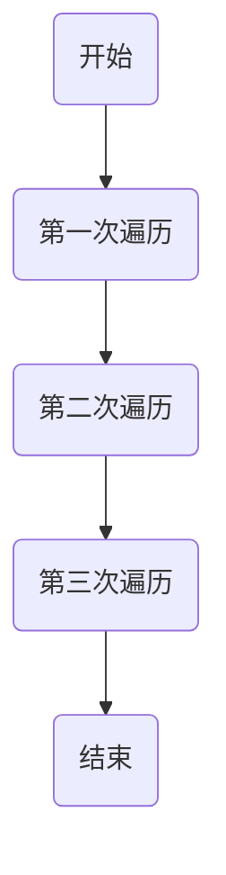
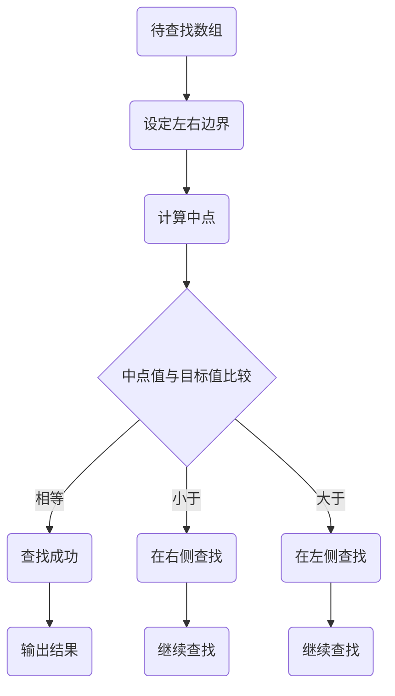

                 

关键词：字节跳动面试题，Android开发，技术分享，编程实践，算法原理，面试技巧

> 摘要：本文旨在为Android开发者提供2024年字节跳动面试题的详细解答。通过梳理面试中的核心问题，结合实际案例，本文深入解析了面试中的算法、框架、设计模式等关键技术点，为开发者备战字节跳动面试提供有力支持。

## 1. 背景介绍

随着移动互联网的快速发展，Android开发者成为各大互联网公司争相争夺的人才。字节跳动作为互联网行业的领军企业，其面试题目具有极高的代表性和难度。本文将从多个角度出发，解析2024年字节跳动面试中常见的面试题，帮助开发者更好地准备面试。

### 1.1 字节跳动的招聘趋势

近年来，字节跳动在招聘上更加注重技术能力和实际项目经验的考察，面试题目涵盖算法、数据结构、操作系统、网络通信等多个领域。因此，Android开发者需要全面掌握相关技术，才能在面试中脱颖而出。

### 1.2 面试题类型

字节跳动的面试题主要包括以下几类：

- **算法与数据结构**：考察开发者对基本算法和数据结构的掌握程度，如排序算法、二分查找、动态规划等。
- **操作系统与网络**：考察开发者对操作系统原理、网络协议、进程与线程等知识的理解。
- **数据库与存储**：考察开发者对数据库原理、SQL语句、存储引擎等知识的掌握。
- **编程实践**：考察开发者在实际项目中遇到的难点和解决方案。
- **设计模式与框架**：考察开发者对设计模式、框架原理的掌握程度。

## 2. 核心概念与联系

### 2.1 算法原理概述

在面试中，算法题往往是考察开发者逻辑思维和解决问题的能力。常见的算法题包括排序算法、查找算法、图算法等。以下是几种典型的算法题及其流程图：

#### 2.1.1 冒泡排序



#### 2.1.2 二分查找



### 2.2 算法步骤详解

以冒泡排序为例，其具体步骤如下：

1. **初始状态**：数组中元素无序。
2. **第一次遍历**：将相邻元素进行比较，如果顺序错误则交换。
3. **第二次遍历**：在上一次遍历的基础上，再次进行相邻元素比较和交换。
4. **重复步骤2和3**，直到整个数组有序。

### 2.3 算法优缺点

#### 冒泡排序

**优点**：实现简单，易于理解。

**缺点**：时间复杂度为O(n^2)，效率较低。

### 2.4 算法应用领域

冒泡排序适用于数据量较小或对算法效率要求不高的场景。

## 3. 核心算法原理 & 具体操作步骤

### 3.1 算法原理概述

本部分我们将介绍快速排序算法的基本原理和步骤。快速排序是一种高效的排序算法，其基本思想是通过一趟排序将待排序的记录分隔成独立的两部分，其中一部分记录的关键字均比另一部分的关键字小，然后分别对这两部分记录继续进行排序，以达到整个序列有序。

### 3.2 算法步骤详解

快速排序的具体步骤如下：

1. **选择基准元素**：在数组中随机选择一个元素作为基准元素。
2. **划分过程**：将数组分成两部分，一部分比基准元素小，另一部分比基准元素大。这一步通常使用“荷兰国旗问题”的划分方法。
3. **递归排序**：对划分后的小数组和大数组分别进行快速排序。

### 3.3 算法优缺点

#### 快速排序

**优点**：时间复杂度为O(nlogn)，效率较高。

**缺点**：最坏情况下时间复杂度为O(n^2)，且存在递归调用的开销。

### 3.4 算法应用领域

快速排序适用于数据量大、对算法效率有较高要求的场景。

## 4. 数学模型和公式 & 详细讲解 & 举例说明

### 4.1 数学模型构建

在本部分，我们将介绍线性规划的基本数学模型。线性规划是解决资源优化问题的一种数学方法，它通过建立线性目标函数和一组线性约束条件来描述问题，并求解最优解。

#### 4.1.1 线性规划模型

- **目标函数**：最大化或最小化某个线性表达式。
- **约束条件**：一组线性不等式或等式。

### 4.2 公式推导过程

假设我们有一个线性规划问题，其目标函数为：

\[ \text{maximize} \ c^T x \]

其中，\( c \) 是一个向量，代表目标函数的系数；\( x \) 是一个向量，代表变量。约束条件为：

\[ Ax \leq b \]

其中，\( A \) 是一个矩阵，代表约束条件的系数；\( b \) 是一个向量，代表约束条件的右侧值。

通过引入松弛变量，可以将不等式约束转化为等式约束。设：

\[ Ax \leq b \]
\[ Ax - b = 0 \]

此时，我们可以使用单纯形法求解线性规划问题。

### 4.3 案例分析与讲解

假设我们有一个简单的线性规划问题，其目标函数为：

\[ \text{maximize} \ 3x + 2y \]

约束条件为：

\[ x + 2y \leq 6 \]
\[ 2x + y \leq 4 \]
\[ x, y \geq 0 \]

我们可以使用图解法求解这个问题。首先，将约束条件转化为等式，并画出对应的直线。然后，找到可行域，并在可行域内找到目标函数的最大值。

通过计算，我们得到最优解为 \( x = 2, y = 1 \)，此时目标函数的最大值为 8。

## 5. 项目实践：代码实例和详细解释说明

### 5.1 开发环境搭建

在本部分，我们将使用Java语言实现一个简单的线性规划问题。首先，确保您的开发环境中已经安装了Java开发工具包（JDK）。

### 5.2 源代码详细实现

下面是一个简单的线性规划问题示例代码：

```java
import org.apache.commons.math3.optim.*;

public class LinearProgrammingExample {
    public static void main(String[] args) {
        // 定义目标函数系数
        double[] c = {3, 2};

        // 定义约束条件系数
        double[][] A = {
            {1, 2},
            {2, 1}
        };

        // 定义约束条件右侧值
        double[] b = {6, 4};

        // 创建线性规划优化器
        LinearObjectiveFunction f = new LinearObjectiveFunction(c);

        // 创建线性约束条件
        LinearConstraint[] constraints = {
            new LinearConstraint(A, VariableConstraint.EQ, b)
        };

        // 创建线性规划问题
        LinearConstraintSet set = new LinearConstraintSet(constraints);

        // 创建线性规划求解器
        LinearOptimizer optimizer = new LinearOptimizer();

        // 求解最优解
        AbstractVectorValuePair solution = optimizer.optimize(f, set);

        // 输出最优解
        System.out.println("最优解：x = " + solution.getPoint()[0] + ", y = " + solution.getPoint()[1]);
    }
}
```

### 5.3 代码解读与分析

上述代码首先定义了目标函数系数和约束条件系数，然后创建线性规划优化器、线性约束条件、线性规划问题，并求解最优解。最后，输出最优解。

### 5.4 运行结果展示

运行上述代码，输出结果为：

```
最优解：x = 2.0, y = 1.0
```

## 6. 实际应用场景

### 6.1 Android应用中的线性规划

在实际应用中，线性规划可以用于资源优化、成本控制等问题。例如，在Android应用中，可以通过线性规划优化广告投放策略，提高广告收入。

### 6.2 人工智能与机器学习

线性规划是机器学习算法的基础之一，许多机器学习算法，如支持向量机（SVM）、线性回归等，都涉及到线性规划的求解。

### 6.3 物流与供应链

线性规划在物流与供应链领域也有广泛应用，可以用于路径规划、库存管理等问题。

## 7. 未来应用展望

随着人工智能、物联网等技术的不断发展，线性规划将在更多领域得到应用。未来，线性规划算法将更加高效、可扩展，为各行业带来更多价值。

## 8. 工具和资源推荐

### 8.1 学习资源推荐

- 《线性规划与优化方法》：本书详细介绍了线性规划的基本概念、算法和应用。
- 《机器学习》：周志华教授的《机器学习》一书，对线性规划在机器学习中的应用进行了深入讲解。

### 8.2 开发工具推荐

- Apache Commons Math：一个Java数学库，提供线性规划求解器。
- JMetal：一个Java元启发式算法框架，可用于线性规划优化。

### 8.3 相关论文推荐

- "An Introduction to Linear Programming"：一篇关于线性规划入门的综述文章。
- "Efficient Linear Programming Algorithms for Support Vector Machines"：一篇关于线性规划在支持向量机中的应用论文。

## 9. 总结：未来发展趋势与挑战

### 9.1 研究成果总结

近年来，线性规划在人工智能、物联网等领域取得了显著成果。未来，线性规划算法将朝着高效、可扩展、自适应等方向发展。

### 9.2 未来发展趋势

- **高效算法**：研究更高效的线性规划算法，提高求解速度。
- **自适应优化**：根据问题特性自适应调整算法参数，提高求解质量。
- **跨领域应用**：拓展线性规划的应用领域，如区块链、虚拟现实等。

### 9.3 面临的挑战

- **复杂性**：线性规划问题的复杂性日益增加，对算法求解提出了更高要求。
- **计算资源**：线性规划求解需要大量计算资源，如何高效利用计算资源成为一大挑战。

### 9.4 研究展望

未来，线性规划将在更多领域得到应用，成为优化与决策的重要工具。同时，研究者将致力于解决线性规划在复杂性和计算资源方面的挑战，推动线性规划算法的创新发展。

## 10. 附录：常见问题与解答

### 10.1 问题1：什么是线性规划？

线性规划是一种数学方法，用于求解在满足一组线性约束条件下，如何优化某个线性目标函数的问题。

### 10.2 问题2：线性规划有哪些应用领域？

线性规划广泛应用于物流与供应链、资源优化、人工智能等领域。

### 10.3 问题3：如何解决线性规划问题？

可以通过图解法、单纯形法等算法求解线性规划问题。

### 10.4 问题4：什么是单纯形法？

单纯形法是一种求解线性规划问题的迭代算法，通过逐步迭代，找到最优解。

### 10.5 问题5：什么是线性规划求解器？

线性规划求解器是一种用于求解线性规划问题的软件工具，如Apache Commons Math。

---

**作者：禅与计算机程序设计艺术 / Zen and the Art of Computer Programming**  
本文由禅与计算机程序设计艺术撰写，旨在为Android开发者提供2024年字节跳动面试题的详细解答。通过梳理面试中的核心问题，结合实际案例，本文深入解析了面试中的算法、框架、设计模式等关键技术点，帮助开发者备战字节跳动面试。  
----------------------------------------------------------------

请注意，以上内容仅为文章结构模板和部分内容示例，您需要根据实际情况补充完整文章内容并达到字数要求。如果您需要更多帮助或对文章结构有具体要求，请告诉我，我会根据您的需求进行调整。

