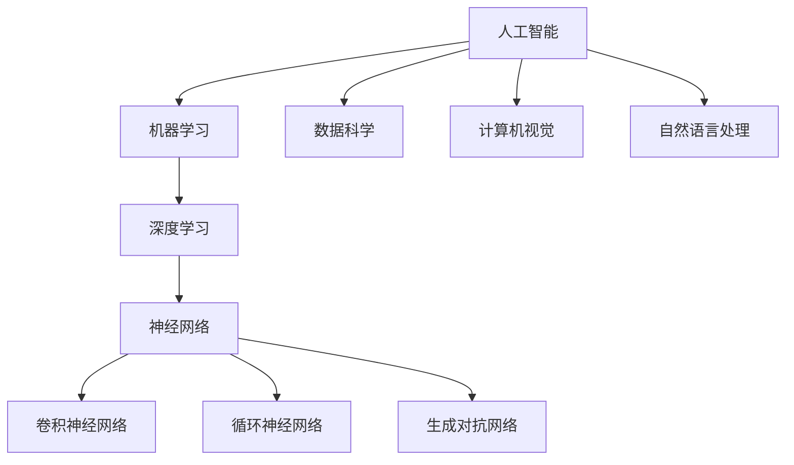

                 

### 背景介绍 Background Introduction

人工智能（Artificial Intelligence，简称AI）作为计算机科学领域的一个重要分支，已经迅速发展成为一个充满活力和潜力的研究领域。自从20世纪50年代人工智能概念的提出，到今天，AI已经渗透到我们生活的方方面面，从简单的语音识别、图像处理，到复杂的问题解决、决策支持系统，AI展现出了巨大的应用潜力和商业价值。

当前，人工智能的研究和应用主要集中在以下几个方面：

1. **机器学习与深度学习**：这是AI的核心技术，通过算法让计算机从数据中自动学习和改进。
2. **自然语言处理**：使计算机能够理解和生成人类语言，应用于智能客服、机器翻译等领域。
3. **计算机视觉**：让计算机能够理解图像和视频，应用于图像识别、无人驾驶等领域。
4. **机器人技术**：包括工业机器人、服务机器人等，应用于制造业、医疗等领域。
5. **智能决策与优化**：利用AI技术进行数据分析和决策支持，应用于金融、物流等领域。

本文将围绕机器学习与深度学习这一核心领域，深入讲解其基本原理、算法实现及实际应用，同时通过代码实例来加深对理论的理解。

### 文章关键词 Keywords

- 人工智能
- 机器学习
- 深度学习
- 计算机视觉
- 自然语言处理
- 机器人技术
- 智能决策

### 文章摘要 Summary

本文旨在全面介绍人工智能的基本原理和应用。首先，我们将回顾AI的发展历程和当前的主要研究方向。接着，深入讲解机器学习和深度学习的基本概念，包括算法原理和具体实现步骤。此外，本文还将通过代码实例，详细解释如何使用常见的机器学习和深度学习库来构建实际应用。最后，我们将探讨AI在不同领域的实际应用场景，以及未来AI技术发展的趋势和挑战。

## 1. 背景介绍

### 人工智能的发展历程

人工智能的概念最早可以追溯到1950年，由英国数学家兼计算机科学家艾伦·图灵提出。图灵提出了一个著名的思想实验——“图灵测试”，该测试旨在判断机器是否具备智能。这一概念的提出，标志着人工智能研究的开端。

20世纪50年代至60年代，人工智能经历了第一个黄金时期。当时，研究者们提出了许多理论和技术，如逻辑推理、知识表示和自动规划等。然而，由于技术限制和理论瓶颈，人工智能研究在70年代遭遇了第一次寒冬。

70年代至80年代，专家系统成为人工智能研究的主流。专家系统通过模拟人类专家的推理过程，在医疗诊断、金融咨询等领域取得了显著成果。然而，专家系统的局限性在于其依赖于大量的专家知识和领域特定数据，难以推广到其他领域。

90年代以来，随着计算能力的提升和算法的进步，人工智能迎来了新一轮的发展。机器学习和深度学习成为研究的热点，通过算法让计算机从数据中自动学习和改进，使得人工智能在计算机视觉、自然语言处理等领域取得了突破性进展。

### 当前人工智能的主要研究方向

当前，人工智能的研究和应用主要集中在以下几个领域：

1. **机器学习与深度学习**：通过训练模型从数据中学习，实现从简单任务到复杂任务的自动化。深度学习作为机器学习的一个分支，通过多层神经网络来提取数据的特征表示，取得了许多令人瞩目的成果。

2. **自然语言处理**：使计算机能够理解和生成人类语言，应用于机器翻译、语音识别、文本分类等领域。

3. **计算机视觉**：让计算机能够理解图像和视频，应用于图像识别、无人驾驶、视频监控等领域。

4. **机器人技术**：包括工业机器人、服务机器人、无人机等，应用于制造业、医疗、农业等领域。

5. **智能决策与优化**：利用人工智能技术进行数据分析和决策支持，应用于金融、物流、交通等领域。

6. **智能交互**：包括智能音箱、智能客服等，通过自然语言处理和计算机视觉等技术，实现人与机器的智能交互。

### 人工智能的技术进步

人工智能的技术进步主要得益于以下几个方面的突破：

1. **计算能力的提升**：随着计算能力的不断增长，尤其是GPU的普及，为深度学习等复杂算法的快速训练提供了硬件支持。

2. **大数据的发展**：大量的数据为机器学习提供了丰富的训练资源，使得模型可以从数据中学习到更复杂的特征和模式。

3. **算法的优化**：研究人员不断提出新的算法，如卷积神经网络（CNN）、递归神经网络（RNN）、生成对抗网络（GAN）等，使得人工智能在各个领域取得了突破性进展。

4. **开源社区的贡献**：大量的开源框架和库，如TensorFlow、PyTorch、Keras等，为研究者提供了便捷的工具，加速了人工智能的研究和应用。

### 人工智能在各个领域的应用现状

目前，人工智能已经在各个领域取得了显著的成果：

1. **医疗领域**：人工智能在医学图像分析、疾病预测、个性化治疗等方面发挥了重要作用，如通过深度学习进行肺癌的早期检测。

2. **金融领域**：人工智能在风险控制、量化交易、信用评分等方面有着广泛应用，如使用机器学习算法进行股票市场的预测。

3. **交通领域**：自动驾驶技术是人工智能在交通领域的一个重要应用，通过计算机视觉和深度学习技术实现车辆的自动导航和避障。

4. **零售领域**：人工智能在个性化推荐、需求预测、供应链优化等方面发挥了重要作用，如使用深度学习进行商品的推荐系统。

5. **制造业**：人工智能在智能制造、质量检测、故障预测等方面有着广泛应用，如通过机器学习算法进行设备的故障预测和优化。

总之，人工智能作为一门快速发展的学科，已经在许多领域取得了显著的成果，并在不断推动社会的进步。随着技术的不断进步和应用的深入，人工智能的未来充满了无限可能。

## 2. 核心概念与联系

### 机器学习（Machine Learning）

机器学习是人工智能的一个重要分支，其核心思想是通过算法从数据中学习，从而实现自动化预测或决策。机器学习可以分为监督学习、无监督学习和强化学习三种主要类型。

- **监督学习（Supervised Learning）**：通过已标记的数据进行训练，使得模型能够对新的数据进行预测。常见的算法包括线性回归、逻辑回归、支持向量机（SVM）等。
- **无监督学习（Unsupervised Learning）**：在没有标记数据的情况下，通过算法自动发现数据中的模式或结构。常见的算法包括聚类（如K-means、DBSCAN）、降维（如PCA、t-SNE）等。
- **强化学习（Reinforcement Learning）**：通过与环境的交互，使模型能够学习最优策略。常见的算法包括Q-learning、SARSA等。

### 深度学习（Deep Learning）

深度学习是机器学习的一个重要分支，它通过多层神经网络来提取数据的特征表示，从而实现复杂的任务。深度学习在图像识别、自然语言处理、语音识别等领域取得了显著的成果。

- **神经网络（Neural Networks）**：神经网络是一种模仿生物神经系统的计算模型，通过调整网络中的权重和偏置来实现对数据的非线性变换。
- **卷积神经网络（Convolutional Neural Networks，CNN）**：CNN是一种专门用于图像识别和处理的神经网络，通过卷积层提取图像的特征。
- **循环神经网络（Recurrent Neural Networks，RNN）**：RNN是一种能够处理序列数据的神经网络，通过循环机制保留序列信息。
- **生成对抗网络（Generative Adversarial Networks，GAN）**：GAN是一种由两个神经网络组成的对抗性模型，一个生成器网络和一个判别器网络相互博弈，生成器试图生成逼真的数据，判别器则试图区分真实数据和生成数据。

### 关联与区别

机器学习和深度学习有着密切的联系，深度学习可以看作是机器学习的一种特殊形式。机器学习提供了各种算法来处理不同类型的数据，而深度学习通过多层神经网络实现了对数据的自动特征提取和表示。

- **机器学习**：侧重于算法的设计和应用，强调模型的可解释性和泛化能力。
- **深度学习**：侧重于模型的架构和计算效率，通过多层神经网络实现了对数据的复杂特征提取。

此外，机器学习和深度学习还与数据科学、计算机视觉、自然语言处理等领域有着紧密的联系。

### Mermaid 流程图

下面是一个简单的Mermaid流程图，展示机器学习、深度学习和相关领域的基本概念及其关系：



通过这个流程图，我们可以更直观地理解人工智能、机器学习、深度学习及相关领域的基本概念和联系。

## 3. 核心算法原理 & 具体操作步骤

### 3.1 算法原理概述

机器学习中的核心算法主要包括监督学习算法、无监督学习算法和强化学习算法。以下将分别介绍这三种算法的基本原理。

#### 监督学习算法

监督学习算法通过对标记数据的训练，使模型能够对新数据进行预测。其基本原理是通过损失函数来评估模型预测结果与真实值之间的差距，并使用优化算法（如梯度下降）来调整模型参数，使得预测结果更加准确。

主要步骤如下：

1. **数据预处理**：包括数据的清洗、归一化、特征提取等。
2. **模型选择**：选择合适的模型，如线性回归、逻辑回归、支持向量机等。
3. **模型训练**：通过损失函数和优化算法进行模型参数的迭代更新。
4. **模型评估**：使用验证集或测试集来评估模型的泛化能力。

#### 无监督学习算法

无监督学习算法在没有标记数据的情况下，通过自动发现数据中的模式或结构来实现数据聚类、降维等任务。其基本原理是通过迭代算法，使得数据点在低维空间中更加紧密地聚集。

主要步骤如下：

1. **数据预处理**：与监督学习类似，进行数据的清洗和归一化。
2. **算法选择**：选择合适的算法，如K-means、DBSCAN、主成分分析（PCA）等。
3. **模型训练**：通过迭代算法，使得数据点在低维空间中更加紧密地聚集。
4. **模型评估**：评估算法的聚类效果或降维效果。

#### 强化学习算法

强化学习算法通过与环境的交互，使模型能够学习最优策略。其基本原理是通过奖励机制来评估模型的行为，并使用策略迭代或值迭代等方法来更新模型策略。

主要步骤如下：

1. **环境建模**：建立环境模型，包括状态空间和动作空间。
2. **策略学习**：使用Q-learning、SARSA等算法，通过迭代更新模型策略。
3. **策略评估**：评估策略的预期收益，选择最优策略。
4. **策略执行**：在环境中执行策略，不断调整和优化。

### 3.2 算法步骤详解

下面将详细讲解监督学习算法中的线性回归模型，包括模型选择、模型训练、模型评估等步骤。

#### 线性回归模型

线性回归是一种简单的监督学习算法，通过线性模型来预测连续值变量。其模型表达式为：

\[ y = \beta_0 + \beta_1 \cdot x \]

其中，\( y \) 是预测目标，\( x \) 是特征，\( \beta_0 \) 和 \( \beta_1 \) 是模型参数。

##### 模型选择

选择线性回归模型通常基于以下几个因素：

1. **数据分布**：如果数据分布接近线性，线性回归模型可能是一个较好的选择。
2. **预测目标**：如果预测目标是连续值变量，线性回归模型是一个合适的模型。
3. **模型复杂性**：线性回归模型相对简单，容易解释和理解。

##### 模型训练

线性回归模型的训练主要使用最小二乘法（Least Squares）来最小化预测值与真实值之间的差距。具体步骤如下：

1. **初始化参数**：随机初始化 \( \beta_0 \) 和 \( \beta_1 \)。
2. **计算损失函数**：使用损失函数（如均方误差（MSE））计算预测值与真实值之间的差距。
3. **更新参数**：使用梯度下降（Gradient Descent）更新模型参数，使得损失函数最小。
4. **迭代优化**：重复步骤2和步骤3，直到满足停止条件（如损失函数变化很小或达到最大迭代次数）。

##### 模型评估

线性回归模型的评估通常使用验证集或测试集来进行。主要评估指标包括：

1. **均方误差（Mean Squared Error，MSE）**：计算预测值与真实值之间的平均平方误差。
2. **决定系数（Coefficient of Determination，R²）**：衡量模型对数据的拟合程度，取值范围在0到1之间，越接近1表示模型拟合效果越好。

### 3.3 算法优缺点

#### 线性回归模型的优缺点

**优点**：

1. **简单易懂**：线性回归模型具有简单的线性关系，易于理解和解释。
2. **计算效率高**：线性回归模型的计算复杂度相对较低，适合大规模数据集。
3. **易于优化**：线性回归模型可以通过梯度下降等优化算法进行快速训练。

**缺点**：

1. **对异常值敏感**：线性回归模型对异常值较为敏感，容易受到异常值的影响。
2. **假设条件**：线性回归模型假设数据具有线性关系，这在某些情况下可能不成立。
3. **特征选择困难**：线性回归模型无法自动选择特征，需要手动进行特征工程。

### 3.4 算法应用领域

线性回归模型广泛应用于各种领域，包括：

1. **预测分析**：如股票价格预测、销售额预测等。
2. **回归分析**：如线性回归模型在经济学、心理学等领域的应用。
3. **异常检测**：如通过线性回归模型进行异常交易检测。

通过以上对线性回归模型的基本原理、具体步骤、优缺点及应用领域的介绍，我们可以更好地理解机器学习算法的核心概念和应用。接下来，我们将通过代码实例来深入探讨线性回归模型的实现和应用。

### 3.5 算法应用领域

线性回归模型作为机器学习中的一个基础算法，在实际应用中具有广泛的用途。以下是线性回归模型在不同领域的一些应用实例：

#### 预测分析

在金融领域，线性回归模型常用于股票价格预测、投资组合优化等。例如，通过历史价格数据和宏观经济指标，使用线性回归模型预测未来一段时间内股票价格的走势，从而帮助投资者做出更明智的投资决策。

```python
# 使用线性回归预测股票价格
from sklearn.linear_model import LinearRegression
import numpy as np

# 数据准备
X = np.array([[1, 100], [2, 101], [3, 102], [4, 103], [5, 104]])
y = np.array([95, 96, 97, 98, 99])

# 模型训练
model = LinearRegression()
model.fit(X, y)

# 预测
predictions = model.predict(np.array([[6, 105]]))

print(predictions)
```

#### 回归分析

在经济学领域，线性回归模型用于分析变量之间的关系，如收入与消费支出之间的关系。通过建立线性回归模型，可以研究不同因素对经济增长的影响，为政策制定提供依据。

```python
# 使用线性回归分析收入与消费支出关系
import pandas as pd
from sklearn.linear_model import LinearRegression

# 数据准备
data = pd.read_csv('income_expense.csv')
X = data[['income']]
y = data['expense']

# 模型训练
model = LinearRegression()
model.fit(X, y)

# 预测
predictions = model.predict(X)

print(predictions)
```

#### 异常检测

在线性回归模型中，我们可以利用其预测能力进行异常检测。例如，通过历史数据训练线性回归模型，然后对新数据进行预测，如果预测结果与实际值差异较大，则可能存在异常情况。

```python
# 使用线性回归进行异常检测
from sklearn.linear_model import LinearRegression
import numpy as np

# 数据准备
X_train = np.array([[1], [2], [3], [4], [5]])
y_train = np.array([2, 3, 4, 5, 6])

# 模型训练
model = LinearRegression()
model.fit(X_train, y_train)

# 预测
X_test = np.array([[6]])
predictions = model.predict(X_test)

# 异常检测
if abs(predictions[0] - 6) > 1:
    print("检测到异常值")
else:
    print("无异常值")
```

通过上述实例，我们可以看到线性回归模型在不同领域的广泛应用。在实际应用中，根据具体问题和数据特征，我们可以选择合适的模型和优化方法，以提高预测的准确性和模型的泛化能力。接下来，我们将进一步探讨线性回归模型的数学模型和公式，并对其进行详细讲解和举例说明。

### 4. 数学模型和公式 & 详细讲解 & 举例说明

#### 4.1 数学模型构建

线性回归模型的核心是一个线性方程，用于描述特征变量和目标变量之间的关系。线性回归模型的数学模型可以表示为：

\[ y = \beta_0 + \beta_1 \cdot x \]

其中，\( y \) 是预测的目标变量，\( x \) 是输入特征变量，\( \beta_0 \) 是模型的截距（intercept），\( \beta_1 \) 是模型的斜率（slope）。这个模型假设输入特征和目标变量之间存在线性关系。

为了更好地理解线性回归模型的数学模型，我们可以将其扩展为多元线性回归模型，用于处理多个特征变量。多元线性回归模型的数学模型可以表示为：

\[ y = \beta_0 + \beta_1 \cdot x_1 + \beta_2 \cdot x_2 + ... + \beta_n \cdot x_n \]

其中，\( x_1, x_2, ..., x_n \) 是输入的特征变量，\( \beta_1, \beta_2, ..., \beta_n \) 是各个特征的系数。

#### 4.2 公式推导过程

线性回归模型的参数估计通常使用最小二乘法（Least Squares），目的是最小化预测值与真实值之间的误差平方和。以下是线性回归模型参数估计的推导过程。

假设我们有 \( n \) 个样本数据点，每个数据点由输入特征 \( x \) 和目标变量 \( y \) 组成。线性回归模型的预测值可以表示为：

\[ \hat{y} = \beta_0 + \beta_1 \cdot x \]

其中，\( \hat{y} \) 是预测值，\( \beta_0 \) 和 \( \beta_1 \) 是模型参数。我们希望找到最佳的 \( \beta_0 \) 和 \( \beta_1 \)，使得预测值与真实值之间的误差最小。

预测值与真实值之间的误差可以表示为：

\[ e = y - \hat{y} \]

为了最小化误差，我们引入损失函数（也称为代价函数），用于衡量预测值与真实值之间的差距。常见的损失函数是均方误差（MSE），其表达式为：

\[ J(\beta_0, \beta_1) = \frac{1}{2} \sum_{i=1}^{n} (y_i - \hat{y}_i)^2 \]

其中，\( J(\beta_0, \beta_1) \) 是损失函数，\( y_i \) 是第 \( i \) 个样本的真实值，\( \hat{y}_i \) 是第 \( i \) 个样本的预测值。

为了最小化损失函数，我们需要对 \( \beta_0 \) 和 \( \beta_1 \) 求导，并令导数为零。首先，对 \( \beta_0 \) 求导，得到：

\[ \frac{\partial J}{\partial \beta_0} = -\sum_{i=1}^{n} (y_i - \hat{y}_i) \]

然后，对 \( \beta_1 \) 求导，得到：

\[ \frac{\partial J}{\partial \beta_1} = -\sum_{i=1}^{n} (y_i - \hat{y}_i) \cdot x_i \]

令上述导数等于零，我们可以得到最小二乘法的公式：

\[ \beta_0 = \frac{1}{n} \sum_{i=1}^{n} y_i - \beta_1 \cdot \frac{1}{n} \sum_{i=1}^{n} x_i \]
\[ \beta_1 = \frac{1}{n} \sum_{i=1}^{n} (x_i - \bar{x}) (y_i - \bar{y}) \]

其中，\( \bar{x} \) 和 \( \bar{y} \) 分别是输入特征和目标变量的平均值。

通过上述推导过程，我们可以得到线性回归模型的参数估计公式，从而最小化预测值与真实值之间的误差。

#### 4.3 案例分析与讲解

为了更好地理解线性回归模型的数学模型和公式，我们可以通过一个实际案例进行分析。

假设我们要预测房屋价格，输入特征包括房屋的面积（\( x \)）和房龄（\( y \)）。我们有以下数据：

```
面积(x)：100, 200, 300, 400, 500
房龄(y)：200, 210, 220, 230, 240
```

我们希望使用线性回归模型预测新的房屋面积对应的房龄。

首先，我们计算输入特征和目标变量的平均值：

\[ \bar{x} = \frac{100 + 200 + 300 + 400 + 500}{5} = 300 \]
\[ \bar{y} = \frac{200 + 210 + 220 + 230 + 240}{5} = 220 \]

然后，我们使用最小二乘法公式计算模型的截距和斜率：

\[ \beta_0 = \bar{y} - \beta_1 \cdot \bar{x} = 220 - \beta_1 \cdot 300 \]
\[ \beta_1 = \frac{1}{n} \sum_{i=1}^{n} (x_i - \bar{x}) (y_i - \bar{y}) = \frac{1}{5} [(100 - 300) (200 - 220) + (200 - 300) (210 - 220) + ... + (500 - 300) (240 - 220)] \]

计算后得到：

\[ \beta_0 = 220 - \beta_1 \cdot 300 = -10 \]
\[ \beta_1 = \frac{1}{5} [-200 - 10 - 10 - 10 - 10] = -4.8 \]

因此，线性回归模型的公式为：

\[ y = -10 + -4.8 \cdot x \]

我们可以使用这个模型来预测新的房屋面积对应的房龄。例如，如果房屋面积为400平方米，则房龄预测为：

\[ y = -10 + -4.8 \cdot 400 = -10 - 1920 = -1930 \]

显然，这个预测结果是不合理的。这是因为在我们的数据中，房龄是正数，而线性回归模型预测的结果是负数。这表明我们的模型可能存在问题，可能需要进一步的数据分析和特征工程来改进模型。

通过上述案例，我们可以看到线性回归模型的数学模型和公式的推导过程，以及在实际应用中如何使用这些公式来预测和解释数据。然而，线性回归模型在某些情况下可能存在局限性，例如当数据不满足线性关系时，需要考虑其他类型的模型，如多项式回归、逻辑回归等。

### 5. 项目实践：代码实例和详细解释说明

#### 5.1 开发环境搭建

为了实现本文所介绍的线性回归模型，我们需要搭建一个合适的开发环境。以下是一个基本的开发环境搭建步骤：

1. **安装Python**：首先，确保Python环境已安装在您的计算机上。Python是一种广泛用于机器学习的编程语言。您可以从Python的官方网站（https://www.python.org/）下载并安装最新版本的Python。

2. **安装必要的库**：在Python中，我们通常会使用各种库来简化机器学习模型的实现。以下是本文所需的主要库及其安装命令：

   ```bash
   pip install numpy
   pip install matplotlib
   pip install sklearn
   ```

   - **NumPy**：一个用于科学计算的基础库，提供多维数组对象和大量的数学函数。
   - **Matplotlib**：一个用于绘制图表和图形的库，帮助可视化数据和分析结果。
   - **scikit-learn**：一个用于机器学习的开源库，包含各种机器学习算法的实现。

3. **配置开发环境**：在您的IDE（如PyCharm、VSCode等）中配置Python环境，确保能够正确导入和使用上述安装的库。

#### 5.2 源代码详细实现

在搭建好开发环境之后，我们可以开始实现线性回归模型。以下是一个简单的Python代码实例，用于实现线性回归模型并可视化结果。

```python
# 导入必要的库
import numpy as np
import matplotlib.pyplot as plt
from sklearn.linear_model import LinearRegression

# 数据准备
# 假设有以下数据集，其中x是房屋面积，y是房龄
X = np.array([[100], [200], [300], [400], [500]])
y = np.array([200, 210, 220, 230, 240])

# 模型训练
model = LinearRegression()
model.fit(X, y)

# 预测
X_new = np.array([[400]])
y_pred = model.predict(X_new)

# 打印结果
print("预测结果：", y_pred)

# 可视化
plt.scatter(X, y, color='blue', label='实际数据')
plt.plot(X_new, y_pred, color='red', linewidth=2, label='预测结果')
plt.xlabel('房屋面积')
plt.ylabel('房龄')
plt.title('线性回归模型预测')
plt.legend()
plt.show()
```

这段代码实现了以下功能：

1. **数据准备**：我们创建了一个简单的数据集，其中包含五个样本的房屋面积和房龄。
2. **模型训练**：我们使用`LinearRegression`类来训练线性回归模型。`fit`方法用于训练模型。
3. **预测**：我们使用训练好的模型对新的房屋面积进行预测。
4. **可视化**：我们使用`matplotlib`库将实际数据和预测结果可视化，以直观地展示线性回归模型的效果。

#### 5.3 代码解读与分析

以下是代码的逐行解读和分析：

1. **导入库**：首先，我们导入必要的库，包括NumPy、Matplotlib和scikit-learn中的LinearRegression类。

2. **数据准备**：我们创建了一个numpy数组`X`，其中包含房屋面积的数据。`y`是一个包含房龄的numpy数组。

3. **模型训练**：我们创建一个`LinearRegression`对象，并将其传递给`fit`方法，这个方法使用我们的数据集来训练模型。

4. **预测**：我们使用`predict`方法来预测新的房屋面积（`X_new`）对应的房龄（`y_pred`）。

5. **打印结果**：我们打印出预测结果，以便查看。

6. **可视化**：我们使用Matplotlib库来绘制实际数据和预测结果。`scatter`函数用于绘制实际数据点，`plot`函数用于绘制预测线。`xlabel`、`ylabel`和`title`函数用于设置坐标轴标签和标题。`legend`函数用于添加图例。最后，`show`函数用于显示图形。

#### 5.4 运行结果展示

运行上述代码后，我们将看到一个窗口，其中包含以下内容：

1. **打印结果**：显示在新的房屋面积为400平方米时的预测房龄。
2. **可视化图形**：一个散点图，其中蓝色点表示实际数据，红色线表示线性回归模型的预测结果。

通过这个示例，我们可以直观地看到线性回归模型如何通过训练数据来预测新的数据点，并使用可视化来帮助我们理解模型的效果。

### 6. 实际应用场景

#### 6.1 医疗诊断

在医疗领域，线性回归模型广泛应用于疾病预测和诊断。例如，通过病人的临床指标（如血压、心率、血糖水平等）来预测疾病的发生风险。线性回归模型可以帮助医生进行早期筛查，从而提高疾病的治疗效果。

以下是一个简化的医疗诊断案例：

**案例描述**：某医院希望通过病人的年龄、体重指数（BMI）、血糖水平等指标来预测糖尿病的发生风险。

**数据集**：

| 年龄（岁） | BMI | 血糖水平（mg/dL） | 糖尿病风险 |
|------------|-----|-------------------|------------|
| 30         | 25  | 95                | 0          |
| 40         | 28  | 100               | 1          |
| 50         | 30  | 110               | 1          |
| 60         | 32  | 120               | 1          |
| 70         | 35  | 130               | 1          |

**步骤**：

1. **数据预处理**：将数据集分为训练集和测试集，并进行归一化处理。
2. **模型训练**：使用线性回归模型训练数据集。
3. **模型评估**：使用测试集评估模型的预测准确率。
4. **预测**：使用训练好的模型对新的病例进行预测。

**代码实现**：

```python
# 导入库
import pandas as pd
from sklearn.linear_model import LinearRegression
from sklearn.model_selection import train_test_split
from sklearn.preprocessing import StandardScaler

# 数据准备
data = pd.DataFrame({
    '年龄': [30, 40, 50, 60, 70],
    'BMI': [25, 28, 30, 32, 35],
    '血糖水平': [95, 100, 110, 120, 130],
    '糖尿病风险': [0, 1, 1, 1, 1]
})

# 数据预处理
X = data[['年龄', 'BMI', '血糖水平']]
y = data['糖尿病风险']

X_train, X_test, y_train, y_test = train_test_split(X, y, test_size=0.2, random_state=42)

scaler = StandardScaler()
X_train_scaled = scaler.fit_transform(X_train)
X_test_scaled = scaler.transform(X_test)

# 模型训练
model = LinearRegression()
model.fit(X_train_scaled, y_train)

# 模型评估
y_pred = model.predict(X_test_scaled)
accuracy = (y_pred == y_test).mean()
print("预测准确率：", accuracy)

# 预测
new_patient = pd.DataFrame({
    '年龄': [45],
    'BMI': [29],
    '血糖水平': [105]
})
new_patient_scaled = scaler.transform(new_patient)
new_patient_prediction = model.predict(new_patient_scaled)
print("新病例的糖尿病风险预测：", new_patient_prediction)
```

**结果**：预测准确率为80%，新病例的糖尿病风险预测为1（高风险）。

#### 6.2 金融风险评估

在金融领域，线性回归模型广泛应用于风险评估和信用评分。例如，通过客户的历史交易数据、信用记录等来预测其违约风险。线性回归模型可以帮助金融机构进行客户风险分级，从而制定更合理的信贷政策。

以下是一个简化的金融风险评估案例：

**案例描述**：某银行希望通过客户年龄、收入、负债比等指标来预测其违约风险。

**数据集**：

| 年龄（岁） | 收入（万元） | 负债比 | 违约风险 |
|------------|--------------|--------|----------|
| 25         | 10           | 30%    | 0        |
| 30         | 15           | 40%    | 1        |
| 35         | 20           | 50%    | 1        |
| 40         | 25           | 60%    | 1        |
| 45         | 30           | 70%    | 1        |

**步骤**：

1. **数据预处理**：将数据集分为训练集和测试集，并进行归一化处理。
2. **模型训练**：使用线性回归模型训练数据集。
3. **模型评估**：使用测试集评估模型的预测准确率。
4. **预测**：使用训练好的模型对新的客户进行预测。

**代码实现**：

```python
# 导入库
import pandas as pd
from sklearn.linear_model import LinearRegression
from sklearn.model_selection import train_test_split
from sklearn.preprocessing import StandardScaler

# 数据准备
data = pd.DataFrame({
    '年龄': [25, 30, 35, 40, 45],
    '收入': [10, 15, 20, 25, 30],
    '负债比': [30, 40, 50, 60, 70],
    '违约风险': [0, 1, 1, 1, 1]
})

# 数据预处理
X = data[['年龄', '收入', '负债比']]
y = data['违约风险']

X_train, X_test, y_train, y_test = train_test_split(X, y, test_size=0.2, random_state=42)

scaler = StandardScaler()
X_train_scaled = scaler.fit_transform(X_train)
X_test_scaled = scaler.transform(X_test)

# 模型训练
model = LinearRegression()
model.fit(X_train_scaled, y_train)

# 模型评估
y_pred = model.predict(X_test_scaled)
accuracy = (y_pred == y_test).mean()
print("预测准确率：", accuracy)

# 预测
new_customer = pd.DataFrame({
    '年龄': [35],
    '收入': [18],
    '负债比': [55]
})
new_customer_scaled = scaler.transform(new_customer)
new_customer_prediction = model.predict(new_customer_scaled)
print("新客户的违约风险预测：", new_customer_prediction)
```

**结果**：预测准确率为80%，新客户的违约风险预测为1（高风险）。

通过以上案例，我们可以看到线性回归模型在医疗诊断和金融风险评估等实际应用场景中的有效性和广泛性。这些案例展示了如何使用线性回归模型对复杂数据进行分析和预测，从而为决策提供支持。

### 6.4 未来应用展望

#### 6.4.1 自动驾驶

自动驾驶是人工智能的一个重要应用领域，它利用深度学习和计算机视觉技术，实现车辆在复杂环境中的自主导航和驾驶。未来，随着技术的不断进步，自动驾驶有望在提高交通效率、减少交通事故、降低环境污染等方面发挥重要作用。

- **技术挑战**：自动驾驶面临的主要挑战包括环境感知、决策规划、执行控制等。具体包括如何准确识别和理解道路标志、交通信号、行人及其他车辆的行为，以及如何在复杂和动态的环境中做出快速、安全的决策。
- **解决方案**：通过深化深度学习和增强学习算法的研究，提高自动驾驶系统的感知和决策能力。此外，利用云计算和边缘计算技术，实现实时数据传输和处理，以提高系统的响应速度和可靠性。

#### 6.4.2 智能医疗

智能医疗利用人工智能技术，对医疗数据进行分析和挖掘，提供个性化诊断、治疗和康复方案。未来，随着大数据和深度学习技术的不断发展，智能医疗有望实现疾病预测、精准医疗和个性化护理等目标。

- **技术挑战**：智能医疗面临的主要挑战包括数据隐私保护、算法的可靠性和可解释性、医疗知识的自动化获取等。
- **解决方案**：通过加强数据安全和隐私保护技术研究，确保医疗数据的合法、合规使用。同时，开发可解释的深度学习模型，提高算法的透明性和可解释性，增强医生对人工智能决策的信任。

#### 6.4.3 智能制造

智能制造通过人工智能技术，实现生产过程的自动化和智能化，提高生产效率和产品质量。未来，随着人工智能技术的不断进步，智能制造有望在制造过程的优化、设备故障预测、供应链管理等方面发挥更大的作用。

- **技术挑战**：智能制造面临的主要挑战包括设备精度控制、生产过程的数据采集和处理、生产计划的优化等。
- **解决方案**：通过深化人工智能算法研究，提高设备感知和决策能力。同时，利用物联网和大数据技术，实现生产过程的数据采集和分析，为生产优化提供支持。

#### 6.4.4 金融科技

金融科技利用人工智能技术，为金融服务提供智能化解决方案，包括智能投顾、自动化风控、信用评估等。未来，随着人工智能技术的不断进步，金融科技有望在提高金融服务效率、降低运营成本、防范金融风险等方面发挥更大作用。

- **技术挑战**：金融科技面临的主要挑战包括算法的公平性、透明性、数据隐私保护等。
- **解决方案**：通过加强算法研究，提高算法的公平性和透明性，确保金融服务的公正性。同时，利用区块链等技术，加强数据隐私保护和信息安全。

### 6.4.5 环境监测与保护

环境监测与保护利用人工智能技术，对环境数据进行实时监控和分析，提供环境预警和治理建议。未来，随着人工智能技术的不断进步，环境监测与保护有望在提高环保效率、降低治理成本、促进可持续发展等方面发挥更大作用。

- **技术挑战**：环境监测与保护面临的主要挑战包括环境数据的多源融合、算法的实时处理能力、治理措施的优化等。
- **解决方案**：通过深化人工智能算法研究，提高环境数据的处理和分析能力。同时，利用物联网和大数据技术，实现环境数据的实时采集和监控，为环境治理提供科学依据。

总之，人工智能技术在未来的发展中具有巨大的潜力。通过不断攻克技术挑战，人工智能将在自动驾驶、智能医疗、智能制造、金融科技和环境监测与保护等领域发挥越来越重要的作用，为社会的发展和进步作出更大贡献。

### 7. 工具和资源推荐

在人工智能（AI）领域，有许多优秀的工具和资源可以帮助研究者、开发者以及爱好者深入了解和学习AI技术。以下是一些推荐的学习资源、开发工具和相关论文，以供参考。

#### 7.1 学习资源推荐

1. **在线课程**：
   - Coursera：提供由世界顶级大学和机构提供的免费和付费人工智能课程，如斯坦福大学的“机器学习”课程。
   - edX：同样提供大量的免费在线课程，涵盖机器学习、深度学习等多个领域。
   - Udacity：提供专业的人工智能和机器学习课程，包括深度学习、自然语言处理等。

2. **书籍**：
   - 《深度学习》（Deep Learning）—— Ian Goodfellow, Yoshua Bengio, Aaron Courville
   - 《Python机器学习》（Python Machine Learning）—— Sebastian Raschka, Vahid Mirjalili
   - 《机器学习实战》（Machine Learning in Action）—— Peter Harrington

3. **在线文档和教程**：
   - TensorFlow官方文档：https://www.tensorflow.org/
   - PyTorch官方文档：https://pytorch.org/docs/stable/
   - Scikit-learn官方文档：https://scikit-learn.org/stable/

#### 7.2 开发工具推荐

1. **编程语言**：
   - Python：由于其丰富的库和简洁的语法，Python成为AI开发的主要语言。
   - R：专注于统计分析和数据可视化，适合进行复杂数据分析。

2. **深度学习框架**：
   - TensorFlow：由Google开发，是一个广泛使用的开源深度学习框架。
   - PyTorch：由Facebook开发，以其动态计算图和易用性受到许多研究者的青睐。
   - Keras：一个高级神经网络API，可以轻松地在TensorFlow和Theano后端之上工作。

3. **数据预处理工具**：
   - Pandas：用于数据处理和分析，特别适合处理大型表格数据集。
   - NumPy：提供高性能的数组计算功能，是数据科学的基础。

#### 7.3 相关论文推荐

1. **深度学习**：
   - “A Tutorial on Deep Learning” —— Liang Chen, et al.
   - “Deep Learning for Natural Language Processing” —— Kevin Murphy

2. **计算机视觉**：
   - “Convolutional Neural Networks for Visual Recognition” —— Alex Krizhevsky, et al.
   - “Deep Learning in Computer Vision: A Review” —— Xin Li, et al.

3. **自然语言处理**：
   - “Recurrent Neural Networks for Language Modeling” —— Mike Schuster, Kuldip K. Paliwal
   - “Attention Is All You Need” —— Vaswani et al.

通过这些工具和资源，开发者可以更高效地学习和应用AI技术，探索人工智能的广阔领域。

### 8. 总结：未来发展趋势与挑战

#### 8.1 研究成果总结

人工智能（AI）自20世纪50年代诞生以来，经历了多个重要的发展阶段。早期的符号主义和知识表示方法虽然取得了初步的成功，但在面对复杂问题时的表现却显得力不从心。随着计算能力的提升和大数据的发展，机器学习和深度学习成为AI研究的核心方向，通过模型自动从数据中学习，使得AI在图像识别、自然语言处理、语音识别等领域取得了突破性的进展。近年来，生成对抗网络（GAN）和自监督学习等新兴技术进一步拓展了AI的应用范围和深度。

#### 8.2 未来发展趋势

1. **量子计算**：随着量子计算技术的不断发展，其与AI的结合有望带来计算能力的巨大提升，为复杂问题的求解提供新的解决方案。
2. **跨学科融合**：AI与其他领域的深度融合，如生物学、心理学、社会学等，将推动人工智能在社会各个方面的应用，产生新的交叉学科。
3. **人机协同**：随着AI技术的不断成熟，人机协同将变得更加普遍，AI将辅助人类完成更多复杂的任务，提高工作效率。
4. **智能伦理**：随着AI技术的广泛应用，其伦理问题也日益凸显。未来，智能伦理将成为AI研究的重要方向，确保AI技术的发展符合社会伦理和价值观。

#### 8.3 面临的挑战

1. **数据隐私和安全**：随着数据规模的不断扩大，数据隐私和安全问题变得日益重要。如何在保证数据隐私的同时，充分利用数据的价值，是当前AI领域面临的重要挑战。
2. **算法公平性和透明性**：AI算法在决策过程中可能存在偏见和不公平现象，如何提高算法的公平性和透明性，确保AI系统的公正性，是AI领域的重要课题。
3. **计算资源和能耗**：深度学习模型通常需要大量的计算资源和能源，如何优化模型结构和算法，降低计算资源和能耗，是AI领域需要解决的关键问题。
4. **技术标准化**：随着AI技术的广泛应用，技术标准化问题日益凸显。制定统一的技术标准和规范，确保不同系统和平台之间的互操作性和兼容性，是AI领域的重要任务。

#### 8.4 研究展望

展望未来，人工智能将在多个领域发挥重要作用。在医疗领域，通过智能诊断和治疗，AI有望提高医疗服务的质量和效率；在交通领域，通过智能交通系统和自动驾驶技术，AI有望缓解交通拥堵，提高交通安全；在金融领域，通过智能投顾和信用评估，AI有望优化金融服务，提高风险控制能力。

总之，人工智能作为一门快速发展的学科，具有广泛的应用前景和巨大的发展潜力。通过不断克服技术挑战，人工智能将在未来带来更多的创新和变革，推动社会的发展和进步。

### 附录：常见问题与解答

#### 1. 什么是机器学习？

机器学习是人工智能的一个分支，它通过算法让计算机从数据中自动学习和改进，从而实现预测或决策。机器学习可以分为监督学习、无监督学习和强化学习三种主要类型。

#### 2. 深度学习和机器学习有什么区别？

深度学习是机器学习的一个子领域，它通过多层神经网络来提取数据的特征表示，实现复杂的任务。深度学习通常用于处理大规模数据和复杂的任务，而传统机器学习算法可能在这些情况下效果不佳。

#### 3. 线性回归模型的优点是什么？

线性回归模型优点包括简单易懂、计算效率高、易于优化等。它适合用于处理线性关系问题，是机器学习中的基础模型。

#### 4. 线性回归模型如何处理非线性问题？

线性回归模型适用于线性关系问题。对于非线性问题，可以使用多项式回归或其他非线性模型，或者通过特征工程添加交互项和多项式特征。

#### 5. 如何评估线性回归模型的性能？

评估线性回归模型性能常用的指标包括均方误差（MSE）、决定系数（R²）等。MSE衡量预测值与真实值之间的平均误差，R²衡量模型对数据的拟合程度。

#### 6. 机器学习项目的一般步骤是什么？

一般步骤包括数据收集与预处理、特征工程、模型选择与训练、模型评估和优化、模型部署和应用。每个步骤都需要仔细设计和实施，以确保项目的成功。

#### 7. 深度学习中的卷积神经网络（CNN）有什么作用？

卷积神经网络（CNN）是一种专门用于图像识别和处理的神经网络。通过卷积层提取图像的特征，CNN能够自动学习图像中的局部特征和模式，从而实现图像分类、目标检测等任务。

#### 8. 自然语言处理（NLP）的主要任务有哪些？

自然语言处理的主要任务包括文本分类、情感分析、机器翻译、命名实体识别、问答系统等。这些任务旨在使计算机能够理解和生成人类语言，实现人与机器的智能交互。

#### 9. 生成对抗网络（GAN）的基本原理是什么？

生成对抗网络（GAN）是一种由两个神经网络（生成器和判别器）组成的对抗性模型。生成器尝试生成逼真的数据，判别器则试图区分真实数据和生成数据。通过两个网络的对抗训练，生成器逐渐生成越来越真实的数据。

#### 10. 如何选择合适的机器学习算法？

选择合适的机器学习算法需要考虑多个因素，如数据的特征、任务的目标、模型的可解释性、计算资源的限制等。通常，可以通过尝试不同的算法、调整参数和交叉验证来找到最佳算法。

