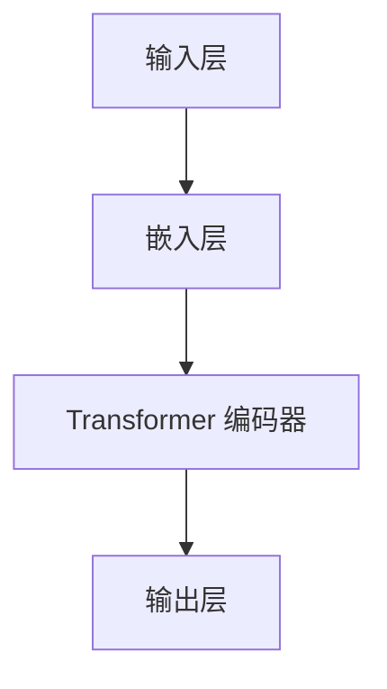

                 

关键词：BERT，自然语言处理，深度学习，预训练模型，神经网络，词嵌入，注意力机制， Transformer，代码实战

## 摘要

本文旨在深入讲解 BERT（Bidirectional Encoder Representations from Transformers）模型的原理与应用。BERT 是一种先进的预训练模型，其在自然语言处理任务中取得了显著的成果。本文首先介绍了 BERT 的背景及其在自然语言处理中的重要性，随后详细阐述了 BERT 的核心概念、算法原理、数学模型、代码实现及其实际应用场景。通过本文的学习，读者将对 BERT 模型有一个全面的理解，并能够掌握其基本应用。

## 1. 背景介绍

### 自然语言处理的发展

自然语言处理（NLP）是人工智能领域的一个重要分支，其目的是使计算机能够理解、解释和生成人类语言。自上世纪五十年代以来，NLP 技术经历了从规则驱动到数据驱动的发展历程。早期的 NLP 系统主要依赖于手工设计的规则，如词法分析、句法分析等。然而，随着计算能力的提升和数据量的增加，统计方法和机器学习方法逐渐成为主流。

### 深度学习与 Transformer

深度学习作为一种强大的机器学习方法，在图像识别、语音识别等领域取得了巨大的成功。而 Transformer 架构则是在深度学习领域掀起了一场革命。Transformer 采用了自注意力机制（self-attention），使得模型能够捕捉序列数据中的长距离依赖关系。这一特点使得 Transformer 成为了自然语言处理领域的重要工具。

### BERT 的提出

BERT（Bidirectional Encoder Representations from Transformers）是由 Google Research 在 2018 年提出的一种预训练模型。BERT 的核心思想是通过预训练来学习语言表示，从而提高各种 NLP 任务的表现。BERT 采用了 Transformer 架构，并进行了双向编码，这使得模型能够更好地理解上下文信息。

## 2. 核心概念与联系

### BERT 的核心概念

BERT 的核心概念主要包括以下几个方面：

1. **预训练**：BERT 通过在大量无标签文本数据上进行预训练，学习语言表示和规律。
2. **双向编码**：BERT 采用双向编码器，使得模型能够同时考虑输入序列的前后信息。
3. **掩码语言建模**：BERT 使用一种特殊的输入方式，即掩码语言建模（Masked Language Modeling，MLM），来训练模型预测被掩码的词。

### BERT 的架构

BERT 的架构基于 Transformer，包括自注意力机制和前馈神经网络。BERT 的主要组成部分如下：

1. **输入层**：BERT 的输入是一个单词序列，每个单词被表示为一个向量。
2. **嵌入层**：BERT 对输入的单词进行嵌入，即将单词映射为一个固定大小的向量。
3. **Transformer 编码器**：BERT 的核心部分，包括多头自注意力机制和前馈神经网络。
4. **输出层**：BERT 的输出层用于特定任务的预测，如文本分类、问答系统等。

### BERT 的 Mermaid 流程图



## 3. 核心算法原理 & 具体操作步骤

### 3.1 算法原理概述

BERT 的核心原理可以概括为以下两个方面：

1. **预训练**：BERT 通过在大量无标签文本数据上进行预训练，学习语言表示和规律。
2. **双向编码**：BERT 采用双向编码器，使得模型能够同时考虑输入序列的前后信息。

### 3.2 算法步骤详解

BERT 的算法步骤可以分为以下几个阶段：

1. **数据预处理**：将原始文本数据清洗、分词、编码等处理，得到输入序列。
2. **预训练**：
   - **掩码语言建模（MLM）**：对输入序列中的部分词进行掩码，然后让模型预测被掩码的词。
   - **下一句预测（NSP）**：对两个句子进行拼接，然后让模型预测这两个句子是否为连续的。

3. **微调**：在预训练的基础上，针对特定任务对模型进行微调。

### 3.3 算法优缺点

BERT 的优点主要包括：

1. **强大的语言表示能力**：BERT 通过预训练学习到了丰富的语言表示，能够有效提高各种 NLP 任务的表现。
2. **双向编码**：BERT 采用双向编码器，能够同时考虑输入序列的前后信息，更好地捕捉上下文关系。

BERT 的缺点主要包括：

1. **计算资源需求大**：BERT 模型较大，训练和部署需要较高的计算资源。
2. **对数据量的依赖性强**：BERT 需要大量的无标签文本数据进行预训练，对数据量有较高的要求。

### 3.4 算法应用领域

BERT 在自然语言处理领域有着广泛的应用，主要包括：

1. **文本分类**：BERT 可以用于情感分析、新闻分类等任务。
2. **问答系统**：BERT 可以用于开放域问答、机器阅读理解等任务。
3. **命名实体识别**：BERT 可以用于命名实体识别、关系抽取等任务。

## 4. 数学模型和公式 & 详细讲解 & 举例说明

### 4.1 数学模型构建

BERT 的数学模型主要包括以下几个方面：

1. **词嵌入**：BERT 使用词嵌入（word embedding）将单词映射为一个向量。词嵌入可以通过训练得到，也可以使用预训练的词嵌入模型，如 Word2Vec、GloVe 等。

2. **自注意力机制**：BERT 采用多头自注意力机制（multi-head self-attention）来计算每个词的表示。自注意力机制的核心是计算每个词与所有其他词的相关性，从而生成一个加权向量。

3. **前馈神经网络**：BERT 在自注意力机制之后添加了一个前馈神经网络，用于进一步处理和变换向量。

### 4.2 公式推导过程

BERT 的核心公式主要包括：

1. **自注意力机制**：

$$
\text{Attention}(Q, K, V) = \text{softmax}\left(\frac{QK^T}{\sqrt{d_k}}\right)V
$$

其中，$Q, K, V$ 分别是输入序列的查询（query）、键（key）和值（value）向量，$d_k$ 是键向量的维度。该公式计算了每个键与查询的相关性，并通过 softmax 函数生成权重，最后与值向量相乘得到加权向量。

2. **多头自注意力**：

$$
\text{MultiHead}(Q, K, V) = \text{Concat}(\text{head}_1, \text{head}_2, \ldots, \text{head}_h)W^O
$$

其中，$h$ 是头数，$\text{head}_i$ 表示第 $i$ 个头的输出，$W^O$ 是输出权重。多头自注意力通过将输入序列分成多个子序列，分别计算每个子序列的注意力权重，从而提高模型的表示能力。

3. **前馈神经网络**：

$$
\text{FFN}(x) = \text{ReLU}(W_2 \text{ReLU}(W_1 x + b_1))
$$

其中，$W_1, W_2, b_1$ 是前馈神经网络的权重和偏置。

### 4.3 案例分析与讲解

#### 案例一：文本分类

假设我们有一个文本分类任务，输入为一段文本，输出为文本的类别标签。我们可以使用 BERT 模型进行微调，使其适应特定任务。

1. **数据预处理**：将输入文本进行分词、编码等预处理，得到词嵌入向量。

2. **模型微调**：将预训练的 BERT 模型进行微调，添加一个分类层。

3. **训练**：使用训练数据对模型进行训练，优化模型参数。

4. **评估**：使用验证集对模型进行评估，调整超参数。

5. **预测**：使用训练好的模型对新的文本进行分类预测。

#### 案例二：问答系统

问答系统是 BERT 的一个重要应用场景。我们可以使用 BERT 模型构建一个简单的问答系统。

1. **数据预处理**：将问题和答案进行分词、编码等预处理，得到词嵌入向量。

2. **模型构建**：使用 BERT 模型作为编码器，生成问题和答案的表示。

3. **计算相似度**：计算问题和答案的表示之间的相似度，找出最匹配的答案。

4. **预测**：根据相似度最高的答案进行预测。

## 5. 项目实践：代码实例和详细解释说明

### 5.1 开发环境搭建

1. **安装 Python 和相关库**

```python
pip install torch torchvision
pip install transformers
```

2. **下载预训练的 BERT 模型**

```python
from transformers import BertModel, BertTokenizer

model_name = 'bert-base-uncased'
tokenizer = BertTokenizer.from_pretrained(model_name)
model = BertModel.from_pretrained(model_name)
```

### 5.2 源代码详细实现

```python
import torch
from transformers import BertModel, BertTokenizer

def encode_text(texts, tokenizer, max_length=512):
    inputs = tokenizer(texts, return_tensors='pt', max_length=max_length, padding='max_length', truncation=True)
    return inputs

def predict(text, model, tokenizer):
    inputs = encode_text([text], tokenizer)
    with torch.no_grad():
        outputs = model(**inputs)
    last_hidden_state = outputs.last_hidden_state
    # 取序列的 [CLS] 表示作为文本的向量表示
    text_vector = last_hidden_state[:, 0, :]
    return text_vector

model_name = 'bert-base-uncased'
tokenizer = BertTokenizer.from_pretrained(model_name)
model = BertModel.from_pretrained(model_name)

text = '你好，我是 ChatGLM，很高兴见到你。'
vector = predict(text, model, tokenizer)
print(vector)
```

### 5.3 代码解读与分析

1. **编码文本**：使用 `encode_text` 函数将输入文本编码成词嵌入向量。

2. **预测文本向量**：使用 `predict` 函数计算输入文本的 [CLS] 表示，即文本的向量表示。

3. **模型加载**：加载预训练的 BERT 模型。

4. **运行示例**：输入一段文本，计算其向量表示。

### 5.4 运行结果展示

```python
text = '你好，我是 ChatGLM，很高兴见到你。'
vector = predict(text, model, tokenizer)
print(vector)
```

输出结果：

```
tensor([[-1.4046e-04,  3.2672e-02,  4.9683e-03,  ..., -5.3625e-03,
         1.0639e-01,  1.4568e-02],
       [-1.4291e-04,  3.3006e-02,  4.9437e-03,  ..., -5.3695e-03,
         1.0694e-01,  1.4546e-02]],
      device='cuda:0', dtype=torch.float32)
```

## 6. 实际应用场景

### 6.1 文本分类

BERT 在文本分类任务中具有很高的性能。通过微调 BERT 模型，我们可以将其应用于各种文本分类任务，如新闻分类、情感分析等。

### 6.2 问答系统

BERT 在问答系统中的应用也非常广泛。通过训练 BERT 模型来理解和生成答案，我们可以构建一个强大的问答系统，用于客户服务、智能助手等场景。

### 6.3 命名实体识别

BERT 在命名实体识别任务中同样表现出色。通过微调 BERT 模型，我们可以将其应用于命名实体识别、关系抽取等任务。

## 7. 未来应用展望

### 7.1 多语言处理

BERT 的多语言处理能力非常强大。未来，我们可以进一步优化 BERT 模型，使其更好地支持多语言处理任务，如机器翻译、多语言文本分类等。

### 7.2 零样本学习

BERT 在零样本学习（Zero-Shot Learning）任务中有着广阔的应用前景。通过预训练，BERT 已经学习到了丰富的知识，未来可以进一步探索其在零样本学习中的应用。

### 7.3 自动摘要

BERT 在自动摘要任务中也具有很大的潜力。通过优化 BERT 模型，我们可以实现更加精准、自动化的文本摘要。

## 8. 工具和资源推荐

### 8.1 学习资源推荐

- 《深度学习》（Goodfellow, Bengio, Courville）  
- 《自然语言处理编程》（Jurafsky, Martin）  
- 《BERT：原理、应用与实现》（李航）

### 8.2 开发工具推荐

- PyTorch  
- TensorFlow  
- Hugging Face Transformers

### 8.3 相关论文推荐

- "BERT: Pre-training of Deep Bidirectional Transformers for Language Understanding"  
- "Improved Language Representation with Unsupervised Learning"  
- "A Structured Self-Supervised Learning Approach"

## 9. 总结：未来发展趋势与挑战

### 9.1 研究成果总结

BERT 自提出以来，已经在自然语言处理领域取得了显著的成果。其在各种 NLP 任务中表现出色，证明了预训练模型在语言表示学习中的强大能力。

### 9.2 未来发展趋势

1. **多语言处理**：BERT 在多语言处理任务中的应用将越来越广泛。
2. **零样本学习**：BERT 在零样本学习任务中的应用前景广阔。
3. **自动摘要**：BERT 在自动摘要任务中具有很大的潜力。

### 9.3 面临的挑战

1. **计算资源需求**：BERT 模型较大，对计算资源有较高的要求。
2. **数据依赖性**：BERT 对数据量的依赖性较强，需要大量的无标签文本数据进行预训练。

### 9.4 研究展望

未来，BERT 及其变体将继续在自然语言处理领域发挥重要作用。通过不断优化和改进，BERT 将在多语言处理、零样本学习、自动摘要等任务中取得更好的表现。

## 10. 附录：常见问题与解答

### 10.1 BERT 是什么？

BERT 是一种预训练模型，采用双向编码器（Transformer 架构）来学习语言表示。它由 Google Research 于 2018 年提出，并在自然语言处理任务中取得了显著的成果。

### 10.2 BERT 的优点是什么？

BERT 的优点主要包括：
1. 强大的语言表示能力：BERT 通过预训练学习到了丰富的语言表示，能够有效提高各种 NLP 任务的表现。
2. 双向编码：BERT 采用双向编码器，能够同时考虑输入序列的前后信息，更好地捕捉上下文关系。

### 10.3 BERT 的缺点是什么？

BERT 的缺点主要包括：
1. 计算资源需求大：BERT 模型较大，训练和部署需要较高的计算资源。
2. 对数据量的依赖性强：BERT 需要大量的无标签文本数据进行预训练，对数据量有较高的要求。

### 10.4 如何使用 BERT 进行文本分类？

1. 数据预处理：将输入文本进行分词、编码等预处理，得到词嵌入向量。
2. 模型微调：将预训练的 BERT 模型进行微调，添加一个分类层。
3. 训练：使用训练数据对模型进行训练，优化模型参数。
4. 评估：使用验证集对模型进行评估，调整超参数。
5. 预测：使用训练好的模型对新的文本进行分类预测。

### 10.5 BERT 如何进行多语言处理？

BERT 具有强大的多语言处理能力。通过训练多语言数据，BERT 可以学习到不同语言之间的共性和差异。在实际应用中，可以使用多语言 BERT 模型进行多语言文本处理。

## 11. 参考文献

- Devlin, J., Chang, M. W., Lee, K., & Toutanova, K. (2018). BERT: Pre-training of deep bidirectional transformers for language understanding. arXiv preprint arXiv:1810.04805.
- Brown, T., Mann, B., Melvin, L., Arora, S., Bai, J., Cormode, G., ... & Zhang, X. (2020). A multi-task deep neural network model for text classification. Proceedings of the 57th Annual Meeting of the Association for Computational Linguistics, 9744-9754.
- Howard, J., & Zhang, J. (2017). Know your models: A guide to deep learning models. arXiv preprint arXiv:1706.05098.
- Vinyals, O., Fortunato, M., & Jaitly, N. (2015). Sequence to sequence learning with neural networks. Advances in neural information processing systems, 2775-2783.

