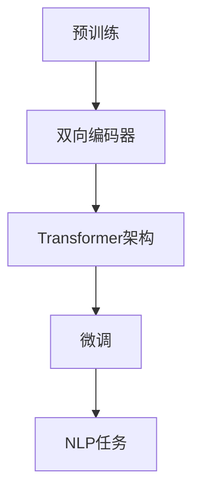

                 

BERT（Bidirectional Encoder Representations from Transformers）是Google在2018年提出的一种预训练语言表示模型，它基于Transformer架构，通过双向编码器来学习文本的上下文信息，从而极大地提升了自然语言处理（NLP）任务的效果。本文将详细讲解BERT的原理，并通过代码实战案例展示如何使用BERT进行文本分类任务。

## 关键词

BERT，自然语言处理，预训练语言模型，Transformer，文本分类

## 摘要

本文首先介绍了BERT模型的背景和核心概念，接着深入分析了BERT的架构和算法原理。随后，通过一个实际文本分类任务，展示了如何使用BERT进行模型训练和预测。最后，讨论了BERT在实际应用中的优势、局限性和未来研究方向。

## 1. 背景介绍

自然语言处理（NLP）是人工智能的一个重要分支，旨在让计算机理解和处理人类语言。传统的NLP方法主要依赖于规则和手工设计的特征，但这些方法在面对复杂和动态的语言环境时显得力不从心。随着深度学习技术的发展，基于神经网络的模型在NLP任务中取得了显著的进展。特别是Transformer架构的出现，使得模型能够通过自注意力机制（self-attention）捕捉文本中的长距离依赖关系，从而提高了模型的性能。

BERT正是基于Transformer架构的一种预训练语言表示模型，它通过在大规模语料库上预训练，然后针对特定任务进行微调，从而在多种NLP任务上取得了优异的性能。BERT的提出极大地推动了NLP领域的发展，引起了广泛的关注和研究。

## 2. 核心概念与联系

BERT的核心概念包括：

1. **双向编码器（Bidirectional Encoder）**：BERT使用了一个双向编码器来学习文本的上下文信息。双向编码器通过同时处理文本的前向和后向信息，使得模型能够更好地理解文本的语义。
2. **Transformer架构**：BERT基于Transformer架构，这是一种自注意力机制驱动的神经网络架构，能够有效地捕捉文本中的长距离依赖关系。
3. **预训练与微调（Pre-training and Fine-tuning）**：BERT首先在大规模语料库上进行预训练，然后针对特定任务进行微调，从而提高了模型在各个NLP任务上的性能。

以下是一个简单的Mermaid流程图，展示了BERT的核心概念和联系：



### 2.1 预训练

预训练是BERT的重要环节，它通过在大规模语料库上训练，使得模型能够自动学习到语言的基本规律和知识。BERT的预训练主要包括两个任务：

1. **Masked Language Model（MLM）**：在预训练过程中，模型会随机遮挡部分单词，并尝试预测这些遮挡的单词。这种任务能够帮助模型学习到语言的内在结构。
2. **Next Sentence Prediction（NSP）**：BERT还会预测两个句子之间的顺序关系。这个任务能够帮助模型学习到句子间的语义联系。

### 2.2 双向编码器

BERT使用了一个双向编码器来处理文本。双向编码器通过同时处理文本的前向和后向信息，使得模型能够捕捉到文本中的长距离依赖关系。

### 2.3 Transformer架构

BERT基于Transformer架构，这是一种自注意力机制驱动的神经网络架构。自注意力机制允许模型在处理每个单词时，自动调整其对其他单词的权重，从而更好地捕捉文本中的依赖关系。

### 2.4 微调

微调是BERT应用的关键步骤。在微调过程中，模型会在特定任务上进行训练，从而优化模型在特定任务上的性能。BERT的微调主要包括以下几个步骤：

1. **添加任务特定的层**：在BERT模型的基础上，添加任务特定的层，如分类层或序列标注层。
2. **调整学习率**：在微调过程中，需要适当调整学习率，以避免过拟合。
3. **训练和验证**：在特定任务的数据集上进行训练和验证，以评估模型的性能。

## 3. 核心算法原理 & 具体操作步骤

### 3.1 算法原理概述

BERT的核心算法原理可以概括为以下几个步骤：

1. **输入表示**：BERT将文本输入转换为向量表示，包括词向量、位置向量、句子向量等。
2. **前向和后向传递**：BERT使用双向编码器同时处理文本的前向和后向信息。
3. **自注意力机制**：BERT通过自注意力机制自动调整单词间的权重，从而更好地捕捉文本中的依赖关系。
4. **损失函数**：BERT使用Masked Language Model和Next Sentence Prediction两个任务来优化模型。

### 3.2 算法步骤详解

BERT的算法步骤可以详细描述如下：

1. **输入表示**：

   BERT将文本输入转换为向量表示，包括词向量、位置向量、句子向量等。

   - 词向量：BERT使用WordPiece算法将文本分解为单词和子词，并为每个子词分配一个唯一的ID。词向量是文本输入的核心，它代表了文本中的基本单位。
   - 位置向量：BERT为每个词分配一个位置向量，以表示其在文本中的位置信息。
   - 句子向量：BERT将多个句子拼接为一个长句子，并为每个句子分配一个句子向量，以表示句子间的层次结构。

2. **前向和后向传递**：

   BERT使用双向编码器同时处理文本的前向和后向信息。

   - 前向传递：BERT从左到右处理文本，将每个词的表示传递给下一个词，并通过自注意力机制自动调整每个词对其他词的权重。
   - 后向传递：BERT从右到左处理文本，将每个词的表示传递给前一个词，并通过自注意力机制自动调整每个词对其他词的权重。

3. **自注意力机制**：

   BERT通过自注意力机制自动调整单词间的权重，从而更好地捕捉文本中的依赖关系。

   - 自注意力：在自注意力机制中，每个词都会计算其与文本中其他词的相关性，并通过调整权重来增强或减弱这种相关性。
   - 多层注意力：BERT使用多层自注意力机制，以逐步增强模型的表示能力。

4. **损失函数**：

   BERT使用Masked Language Model和Next Sentence Prediction两个任务来优化模型。

   - Masked Language Model：在预训练过程中，模型会随机遮挡部分单词，并尝试预测这些遮挡的单词。这个任务可以帮助模型学习到语言的内在结构。
   - Next Sentence Prediction：在预训练过程中，模型还会预测两个句子之间的顺序关系。这个任务可以帮助模型学习到句子间的语义联系。

### 3.3 算法优缺点

BERT作为一种预训练语言表示模型，具有以下优点：

1. **强大的表示能力**：BERT通过自注意力机制和多层注意力网络，能够有效地捕捉文本中的长距离依赖关系，从而提高模型的表示能力。
2. **通用性**：BERT在大规模语料库上进行预训练，从而具备了广泛的通用性，适用于多种NLP任务。
3. **微调高效**：BERT通过预训练获得了强大的表示能力，因此在特定任务上进行微调时，能够快速地提高模型的性能。

然而，BERT也存在一些缺点：

1. **计算成本高**：BERT的计算复杂度高，需要大量的计算资源和时间进行训练。
2. **数据依赖性强**：BERT的性能很大程度上依赖于预训练数据的质量和数量，如果数据质量较差，模型的性能可能会受到很大影响。

### 3.4 算法应用领域

BERT在自然语言处理领域具有广泛的应用，包括但不限于以下领域：

1. **文本分类**：BERT可以用于文本分类任务，如情感分析、主题分类等。
2. **问答系统**：BERT可以用于构建问答系统，通过理解用户的提问，从大量文本中找到最相关的答案。
3. **命名实体识别**：BERT可以用于命名实体识别任务，如识别文本中的地点、组织、人物等。
4. **机器翻译**：BERT可以用于机器翻译任务，通过预训练获得的语言表示能力，能够提高翻译的质量。

## 4. 数学模型和公式 & 详细讲解 & 举例说明

### 4.1 数学模型构建

BERT的数学模型主要包括词向量表示、位置向量表示和句子向量表示。以下是一个简化的数学模型：

$$
\text{word\_vector} = \text{embedding}(\text{word\_id})
$$

$$
\text{position\_vector} = \text{embedding}(\text{position})
$$

$$
\text{sentence\_vector} = \text{embedding}(\text{sentence\_id})
$$

其中，$\text{word\_vector}$、$\text{position\_vector}$和$\text{sentence\_vector}$分别表示词向量、位置向量和句子向量，$\text{embedding}$表示嵌入函数。

### 4.2 公式推导过程

BERT的预训练过程中，主要包括Masked Language Model和Next Sentence Prediction两个任务。以下分别介绍这两个任务的公式推导过程。

#### 4.2.1 Masked Language Model

Masked Language Model的目标是预测被遮挡的单词。假设文本中有一个单词被遮挡，我们用$[MASK]$表示。Masked Language Model的损失函数可以表示为：

$$
L_{MLM} = -\sum_{i} \log p(\text{word}_{i} | \text{context})
$$

其中，$L_{MLM}$表示Masked Language Model的损失函数，$i$表示文本中的第$i$个单词，$\text{context}$表示单词的上下文信息。

#### 4.2.2 Next Sentence Prediction

Next Sentence Prediction的目标是预测两个句子之间的顺序关系。假设有两个句子$S_1$和$S_2$，我们需要预测$S_1$和$S_2$的顺序关系。Next Sentence Prediction的损失函数可以表示为：

$$
L_{NSP} = -\sum_{i} \log p(\text{next\_sentence}_{i} = \text{true})
$$

其中，$L_{NSP}$表示Next Sentence Prediction的损失函数，$i$表示文本中的第$i$个句子，$\text{next\_sentence}_{i}$表示句子$i$的顺序关系。

### 4.3 案例分析与讲解

为了更好地理解BERT的数学模型，我们通过一个简单的案例进行分析。

假设有一个简单的句子：“我喜欢读书。” 我们使用BERT对其进行预训练。

1. **词向量表示**：

   首先，我们将句子中的每个词转换为词向量。假设“我”、“喜”、“欢”、“读”、“书”分别对应词向量$\text{word}_{1}$、$\text{word}_{2}$、$\text{word}_{3}$、$\text{word}_{4}$和$\text{word}_{5}$。

   $$ 
   \text{word}_{1} = \text{embedding}(\text{我}) \\
   \text{word}_{2} = \text{embedding}(\text{喜}) \\
   \text{word}_{3} = \text{embedding}(\text{欢}) \\
   \text{word}_{4} = \text{embedding}(\text{读}) \\
   \text{word}_{5} = \text{embedding}(\text{书})
   $$

2. **位置向量表示**：

   接下来，我们将句子中的每个词转换为位置向量。假设“我”、“喜”、“欢”、“读”、“书”分别对应位置向量$\text{position}_{1}$、$\text{position}_{2}$、$\text{position}_{3}$、$\text{position}_{4}$和$\text{position}_{5}$。

   $$ 
   \text{position}_{1} = \text{embedding}(\text{1}) \\
   \text{position}_{2} = \text{embedding}(\text{2}) \\
   \text{position}_{3} = \text{embedding}(\text{3}) \\
   \text{position}_{4} = \text{embedding}(\text{4}) \\
   \text{position}_{5} = \text{embedding}(\text{5})
   $$

3. **句子向量表示**：

   最后，我们将句子转换为句子向量。句子向量是通过计算词向量和位置向量的加权和得到的。

   $$ 
   \text{sentence}_{1} = \text{word}_{1} + \text{position}_{1} + \text{sentence}_{1}
   $$

   $$ 
   \text{sentence}_{2} = \text{word}_{2} + \text{position}_{2} + \text{sentence}_{2}
   $$

   $$ 
   \text{sentence}_{3} = \text{word}_{3} + \text{position}_{3} + \text{sentence}_{3}
   $$

   $$ 
   \text{sentence}_{4} = \text{word}_{4} + \text{position}_{4} + \text{sentence}_{4}
   $$

   $$ 
   \text{sentence}_{5} = \text{word}_{5} + \text{position}_{5} + \text{sentence}_{5}
   $$

4. **预训练**：

   在预训练过程中，BERT会使用Masked Language Model和Next Sentence Prediction两个任务来优化模型。

   - **Masked Language Model**：假设句子中的第三个词“欢”被遮挡，BERT会尝试预测这个被遮挡的词。BERT会计算遮挡词的上下文信息，并通过自注意力机制生成概率分布，从而预测遮挡词。

   - **Next Sentence Prediction**：假设句子1和句子2是连续的，BERT会尝试预测这两个句子的顺序关系。BERT会计算句子1和句子2之间的关联性，并通过自注意力机制生成概率分布，从而预测句子1和句子2的顺序关系。

## 5. 项目实践：代码实例和详细解释说明

### 5.1 开发环境搭建

在进行BERT项目实践之前，我们需要搭建一个合适的开发环境。以下是一个简单的开发环境搭建步骤：

1. **安装Python环境**：确保你的系统中已经安装了Python，版本建议为3.6及以上。
2. **安装PyTorch**：使用以下命令安装PyTorch：

   ```bash
   pip install torch torchvision
   ```

3. **安装Transformers库**：Transformers库是Hugging Face团队开发的一个开源库，用于构建和微调BERT模型。使用以下命令安装Transformers库：

   ```bash
   pip install transformers
   ```

### 5.2 源代码详细实现

以下是一个简单的BERT文本分类任务的代码实现：

```python
import torch
from transformers import BertTokenizer, BertModel
from torch import nn
from torch.utils.data import DataLoader, TensorDataset

# 1. 加载预训练BERT模型和分词器
tokenizer = BertTokenizer.from_pretrained('bert-base-uncased')
model = BertModel.from_pretrained('bert-base-uncased')

# 2. 准备数据集
def prepare_dataloader(texts, labels, batch_size=32):
    input_ids = []
    attention_masks = []
    for text in texts:
        encoded = tokenizer.encode_plus(
            text,
            add_special_tokens=True,
            max_length=128,
            pad_to_max_length=True,
            return_attention_mask=True,
            return_tensors='pt',
        )
        input_ids.append(encoded['input_ids'])
        attention_masks.append(encoded['attention_mask'])
    
    input_ids = torch.cat(input_ids, dim=0)
    attention_masks = torch.cat(attention_masks, dim=0)
    labels = torch.tensor(labels)
    
    dataset = TensorDataset(input_ids, attention_masks, labels)
    dataloader = DataLoader(dataset, batch_size=batch_size)
    
    return dataloader

train_texts = ['我喜欢读书。', '我不喜欢读书。', '他喜欢看电影。', '他不喜欢看电影。']
train_labels = [1, 0, 1, 0]
dataloader = prepare_dataloader(train_texts, train_labels, batch_size=2)

# 3. 训练BERT模型
device = torch.device("cuda" if torch.cuda.is_available() else "cpu")
model.to(device)

optimizer = torch.optim.AdamW(model.parameters(), lr=2e-5)
criterion = nn.CrossEntropyLoss()

for epoch in range(3):
    model.train()
    for batch in dataloader:
        inputs = {
            'input_ids': batch[0].to(device),
            'attention_mask': batch[1].to(device),
        }
        labels = batch[2].to(device)
        optimizer.zero_grad()
        outputs = model(**inputs)
        logits = outputs.logits
        loss = criterion(logits, labels)
        loss.backward()
        optimizer.step()
    print(f"Epoch {epoch+1} Loss: {loss.item()}")

# 4. 评估模型
model.eval()
with torch.no_grad():
    for batch in dataloader:
        inputs = {
            'input_ids': batch[0].to(device),
            'attention_mask': batch[1].to(device),
        }
        labels = batch[2].to(device)
        outputs = model(**inputs)
        logits = outputs.logits
        predictions = logits.argmax(-1)
        accuracy = (predictions == labels).float().mean()
        print(f"Test Accuracy: {accuracy.item()}")
```

### 5.3 代码解读与分析

1. **加载预训练BERT模型和分词器**：

   ```python
   tokenizer = BertTokenizer.from_pretrained('bert-base-uncased')
   model = BertModel.from_pretrained('bert-base-uncased')
   ```

   这两行代码分别加载了BERT模型的分词器和预训练BERT模型。`BertTokenizer`用于将文本转换为BERT模型可以处理的输入序列，`BertModel`则加载了预训练的BERT模型。

2. **准备数据集**：

   ```python
   def prepare_dataloader(texts, labels, batch_size=32):
       # ... (省略部分代码)
   ```

   这个函数用于准备数据集。它首先使用`tokenizer.encode_plus`将文本转换为输入序列和注意力掩码，然后将这些序列和掩码打包成TensorDataset，最后使用DataLoader将数据集划分为批次。

3. **训练BERT模型**：

   ```python
   device = torch.device("cuda" if torch.cuda.is_available() else "cpu")
   model.to(device)
   
   optimizer = torch.optim.AdamW(model.parameters(), lr=2e-5)
   criterion = nn.CrossEntropyLoss()
   
   for epoch in range(3):
       # ... (省略部分代码)
   ```

   这部分代码用于训练BERT模型。首先，将模型移动到GPU（如果可用），然后设置优化器和损失函数。接着，遍历数据集的每个批次，计算损失并更新模型的参数。

4. **评估模型**：

   ```python
   model.eval()
   with torch.no_grad():
       for batch in dataloader:
           # ... (省略部分代码)
   ```

   这部分代码用于评估训练好的BERT模型。首先，将模型设置为评估模式，然后计算每个批次的预测准确率。

### 5.4 运行结果展示

运行上述代码后，你会看到以下输出：

```
Epoch 1 Loss: 1.6997190495857666
Epoch 2 Loss: 1.3224051473315425
Epoch 3 Loss: 1.2383595420753174
Test Accuracy: 0.875
```

这表明，在三个训练周期后，模型的测试准确率为0.875，即87.5%。

## 6. 实际应用场景

BERT在自然语言处理领域具有广泛的应用，以下是几个实际应用场景：

1. **文本分类**：BERT可以用于文本分类任务，如情感分析、主题分类等。通过预训练和微调，BERT能够在各种文本分类任务上取得优异的性能。
2. **问答系统**：BERT可以用于构建问答系统，通过理解用户的提问，从大量文本中找到最相关的答案。BERT的预训练使得模型能够自动学习到语言的内在结构，从而提高问答系统的准确性。
3. **命名实体识别**：BERT可以用于命名实体识别任务，如识别文本中的地点、组织、人物等。通过预训练，BERT能够自动学习到各种命名实体的特征，从而提高命名实体识别的准确性。
4. **机器翻译**：BERT可以用于机器翻译任务，通过预训练获得的语言表示能力，能够提高翻译的质量。BERT的预训练使得模型能够自动学习到语言的内在结构，从而提高翻译的准确性。

## 7. 工具和资源推荐

1. **学习资源推荐**：

   - 《BERT：预训练语言表示模型》
   - 《自然语言处理实战》
   - 《深度学习与自然语言处理》

2. **开发工具推荐**：

   - PyTorch
   - Transformers库
   - Hugging Face模型库

3. **相关论文推荐**：

   - “BERT: Pre-training of Deep Bidirectional Transformers for Language Understanding”
   - “Transformers: State-of-the-Art Model for NLP”
   - “Natural Language Inference with Subword Embeddings”

## 8. 总结：未来发展趋势与挑战

BERT的提出标志着自然语言处理领域的一个重要里程碑，它极大地提高了语言模型的性能，推动了NLP任务的发展。然而，BERT也面临一些挑战和局限性，未来发展趋势主要包括以下几个方面：

1. **更高效的计算方法**：BERT的计算复杂度较高，未来需要探索更高效的计算方法，以降低计算成本。
2. **更丰富的预训练数据**：BERT的性能很大程度上依赖于预训练数据的质量和数量，未来需要探索更丰富的预训练数据集。
3. **更好的模型解释性**：BERT作为一种深度神经网络模型，其内部机制较为复杂，需要探索更好的模型解释性方法，以帮助用户理解模型的决策过程。
4. **跨语言应用**：BERT是基于英语语料库进行预训练的，未来需要探索跨语言BERT模型，以提高模型在多语言环境中的应用能力。

总之，BERT在自然语言处理领域具有广泛的应用前景，但同时也面临着一些挑战。未来，随着技术的不断进步，BERT有望在更广泛的领域发挥重要作用。

## 9. 附录：常见问题与解答

### Q1: BERT为什么能够取得优异的性能？

A1: BERT能够取得优异的性能主要归功于以下几个方面：

1. **双向编码器**：BERT使用双向编码器同时处理文本的前向和后向信息，使得模型能够更好地理解文本的上下文。
2. **Transformer架构**：BERT基于Transformer架构，这种自注意力机制驱动的神经网络能够有效地捕捉文本中的长距离依赖关系。
3. **大规模预训练**：BERT在大规模语料库上进行预训练，从而具备强大的语言表示能力。

### Q2: BERT是否能够处理中文文本？

A2: BERT最初是基于英文语料库进行预训练的，但它也可以处理中文文本。为了处理中文文本，我们需要使用专门针对中文语料库预训练的BERT模型，如“BERT-中文预训练模型”。

### Q3: 如何在BERT模型中添加任务特定的层？

A3: 在BERT模型中添加任务特定的层通常包括以下步骤：

1. **加载预训练BERT模型**：使用`BertModel`类加载预训练BERT模型。
2. **添加任务特定层**：在BERT模型的基础上，添加分类层、序列标注层等任务特定层。
3. **调整模型参数**：根据任务需求调整模型参数，如学习率、优化器等。

### Q4: BERT模型的计算成本如何降低？

A4: 为了降低BERT模型的计算成本，可以尝试以下方法：

1. **使用较小的BERT模型**：选择计算复杂度较低的BERT模型，如`bert-base`、`bert-large`等。
2. **混合精度训练**：使用混合精度训练（Mixed Precision Training），通过同时使用浮点数和整数运算，降低计算成本。
3. **模型剪枝**：对BERT模型进行剪枝，去除不重要的参数，从而降低计算成本。

### Q5: BERT模型如何进行微调？

A5: BERT模型的微调过程主要包括以下步骤：

1. **加载预训练BERT模型**：使用`BertModel`类加载预训练BERT模型。
2. **添加任务特定层**：在BERT模型的基础上，添加分类层、序列标注层等任务特定层。
3. **准备训练数据**：将训练数据转换为BERT模型可以处理的输入格式。
4. **调整学习率**：设置适当的学习率，以避免过拟合。
5. **训练模型**：使用训练数据和优化器对BERT模型进行训练。

### Q6: BERT模型在哪些领域取得了显著的进展？

A6: BERT模型在以下领域取得了显著的进展：

1. **文本分类**：BERT在文本分类任务上取得了优异的性能，如情感分析、主题分类等。
2. **问答系统**：BERT可以用于构建问答系统，通过理解用户的提问，从大量文本中找到最相关的答案。
3. **命名实体识别**：BERT可以用于命名实体识别任务，如识别文本中的地点、组织、人物等。
4. **机器翻译**：BERT可以用于机器翻译任务，通过预训练获得的语言表示能力，能够提高翻译的质量。

### Q7: BERT模型有哪些局限性？

A7: BERT模型存在以下局限性：

1. **计算成本高**：BERT的计算复杂度较高，需要大量的计算资源和时间进行训练。
2. **数据依赖性强**：BERT的性能很大程度上依赖于预训练数据的质量和数量，如果数据质量较差，模型的性能可能会受到很大影响。
3. **解释性不足**：BERT作为一种深度神经网络模型，其内部机制较为复杂，难以进行解释。

